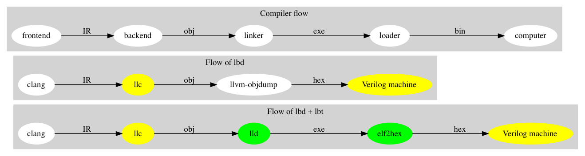

.. _sec-about:

About
======

.. contents::
   :local:
   :depth: 4

Authors
-------

Chen Chung-Shu
	gamma_chen@yahoo.com.tw
	
	http://jonathan2251.github.io/ws/en/index.html

Contributors
------------

Anoushe Jamshidi, ajamshidi@gmail.com,  Chapters 1, 2, 3 English re-writing and Sphinx tool and format setting.

Chen Wei-Ren, chenwj@iis.sinica.edu.tw, assisted with text and code formatting.

Chen Zhong-Cheng, who is the author of original cpu0 verilog code.

Acknowledgments
---------------

We would like to thank Sean Silva, chisophugis@gmail.com, for his help, 
encouragement, and assistance with the Sphinx document generator.  
Without his help, this book would not have been finished and published online. 
We also thank those corrections from readers who make the book more accurate.

Support
--------

We get the kind help from LLVM development mail list, llvmdev@cs.uiuc.edu, 
even we don't know them. So, our experience is you are not 
alone and can get help from the development list members in working with the LLVM 
project. Some of them are:

Akira Hatanaka <ahatanak@gmail.com> in va_arg question answer.

Ulrich Weigand <Ulrich.Weigand@de.ibm.com> in AsmParser question answer.

Revision history
----------------

Version 3.9.4, Released August 5, 2021.

Version 3.9.3, Released March 1, 2020.
  Add Appendix C: GPU compiler

Version 3.9.2, Released Feburary 17, 2020.
  Add section "Add specific backend intrinsic function".
  Add reasons for regression test.
  More phi node explanation.

Version 3.9.1, Released May 11, 2018
  Fix tailcall bug.
  Fix return-vector.ll run slowly problem, bug from Cpu0ISelLowering.cpp.
  Add figure "Tblgen generate files for Cpu0 backend".
  Modify section float and double of Chapter Other data type.
  Move storeRegToStack() and loadRegFromStack() from Chapter9_1 to Chapter3_5.
  Section DSA of chapter Cpu0 architecture and LLVM structure.

Version 3.9.0, Released November 22, 2016
  Porting to llvm 3.9.
  Correct writing.

Version 3.7.4, Released December 7, 2016
  Change bal instruction from with delay slot to without delay slot.

Version 3.7.3, Released July 20, 2016
  Refine code-block according sphinx lexers.
  Add search this book.

Version 3.7.2, Released June 29, 2016
  Add Verilog delay slot simulation.
  Explain "tablegen(" in CMakeLists.txt.
  Correct typing.
  Add lbdex/install_llvm/\*.sh for installation.
  Upgrade sphinx to 1.4.4.

Version 3.7.1, Released November 7, 2015
  Remove EM_CPU0_EL.
  Add subsection Caller and callee saved registers.
  Add IR blockaddress and indirectbr support.
  Correct tglobaladdr, tblockaddress, tjumptable and tglobaltlsaddr of 
  Cpu0InstrInfo.td.
  Add stacksave and stackrestore support.
  Add sub-section frameaddress, returnaddress and eh.return support of chapter
  Function call.
  Match Mips 3.7 style.
  Add bswap in Chapter Function call.
  Add section "Vector type (SIMD) support" of Chapter "Other data type".
  Add section "Long branch support" of Chapter "Control flow statements".
  Add sub-section "eh.dwarf intrinsic" of Chapter Function call.
  Change display "ret $rx" to "jr $rx" where $rx is not $lr.
  Move sub-section Caller and callee saved registers.
  Add sub-sections Live in and live out register.
  Add Phi node.
  Replace ch3-proepilog.ll with ch3_largeframe.cpp.
  Remove DecodeCMPInstruction().
  Re-organize testing ch4_2_1.cpp, ch4_2_2.cpp and ch9_4.cpp.
  Fix dynamic alloca bug.
  Move Cpu0AnalyzeImmediate.cpp and related functions from Chapter3_4 to Chapter3_5.
  Rename input files.

Version 3.7.0, Released September 24, 2015
  Porting to lld 3.7.
  Change tricore_llvm.pdf web link.
  Add C++ atomic to regression test.

Version 3.6.4, Released July 15, 2015
  Add C++ atomic support.

Version 3.6.3, Released May 25, 2015
  Correct typing.

Version 3.6.2, Released May 3, 2015
  Write Appendix B.
  Split chapter Appendix B from Appendix A.
  Move some test from lbt to lbd.
  Remove warning in build Cpu0 code.

Version 3.6.1, Released March 22, 2015
  Add Cpu0 instructions ROLV and RORV.

Version 3.6.0, Released March 9, 2015
  Update Appendix A for llvm 3.6.
  Replace cpp with ll for appearing in document.
  Move chapter lld, optimization, library to 
  https://github.com/Jonathan2251/lbt.git.

Version 3.5.9, Released February 2, 2015
  Fix bug of 64 bits shift.
  Fix global address error by replacing addiu with ori.
  Change encode of "cmp $sw, $3, $2" from 0x10320000 to 0x10f32000.

Version 3.5.8, Released December 27, 2014
  Correct typing.
  Fix typing error for update lbdex/src/modify/src/ of install.rst.
  Add libsoftfloat/compiler-rt and libc/avr-libc-1.8.1.
  Add LLVM-VPO in chapter Optimization.

Version 3.5.7, Released December 1, 2014
  Fix over 16-bits frame prologue/epilogue error from 3.5.3.
  Call convention ABI S32 is enabled by option.
  Change from ADD to ADDu in copyPhysReg() of Cpu0SEInstrInfo.cpp.
  Add asm directive .weak back which exists in 3.5.3.

Version 3.5.6, Released November 18, 2014
  Remove SWI and IRET instructions.
  Add Cpu0SetChapter.h for ex-build-test.sh.
  Correct typing.
  Fix thread variable error come from version 3.5.3 in static mode.
  Add sub-section "Cpu0 backend machine ID and relocation records" of Chapter 2.

Version 3.5.5, Released November 11, 2014
  Rename SPR to C0R.
  Add ISR simulation.

Version 3.5.4, Released November 6, 2014
  Adjust chapter 9 sections.
  Fix .cprestore bug.
  Re-organize sections.
  Add sub-section "Why not using ADD instead of SUB?" in chapter 2.
  Add overflow control option to use ADD and SUB instructions.

Version 3.5.3, Released October 29, 2014
  Merge Cpu0 example code into one copy and it can be config by Cpu0Config.h.

Version 3.5.2, Released October 3, 2014
  Move R_CPU0_32 from type of non-relocation record to type ofrelocation record.
  Correct logic error for setgt of BrcondPatsSlt of Cpu0InstrInfo.td.

Version 3.5.1, Released October 1, 2014
  Add move alias instruction for addu $reg, $zero.
  Add cpu cycles count in verilog.
  Fix ISD::SIGN_EXTEND_INREG error in other types beside i1.
  Support DAG op br_jt and DAG node JumpTable.

Version 3.5.0, Released September 05, 2014
  Issue NOP in delay slot.

Version 3.4.8, Released August 29, 2014
  Add reason that set endian swap in memory module.
  Add presentation files.

Version 3.4.7, Released August 22, 2014
  Fix wrapper_pic for cmov.ll.
  Add shift operations 64 bits support.
  Fix wrapper_pic for ch8_5.cpp.
  Add section thread of chapter 14.
  Add section Motivation of chapter about.
  Support little endian for cpu0 verilog.
  Move ch8_5.cpp test from Chapter Run backend to Chapter lld since it need lld 
  linker.
  Support both big endian and little endian in cpu0 Verilog, elf2hex and lld.
  Make branch release_34_7.

Version 3.4.6, Released July 26, 2014
  Add Chapter 15, optimization.
  Correct typing.
  Add Chapter 14, C++.
  Fix bug of generating cpu032II instruction in dynamic_linker.cpp.

Version 3.4.5, Released June 30, 2014
  Correct typing.

Version 3.4.4, Released June 24, 2014
  Correct typing.
  Add the reason of use SSA form.
  Move sections LLVM Code Generation Sequence, DAG and Instruction Selection 
  from Chapter 3 to Chapter 2.

Version 3.4.3, Released March 31, 2014
  Fix Disassembly bug for GPROut register class.
  Adjust Chapters.
  Remove hand copy Table of tblgen in AsmParser.

Version 3.4.2, Released February 9, 2014
  Add ch12_2.cpp for slt instruction explanation and fix bug in Cpu0InstrInfo.cpp.
  Correct typing.
  Move Cpu0 Status Register from Number 20 to Number 10.
  Fix llc -mcpu option problem.
  Update example code build shell script.
  Add condition move instruction.
  Fix bug of branch pattern match in Cpu0InstrInfo.td.

Version 3.4.1, Released January 18, 2014
  Add ch9_4.cpp to lld test.
  Fix the wrong reference in lbd/lib/Target/Cpu0 code.
  inlineasm.
  First instruction jmp X, where X changed from _Z5startv to start.
  Correct typing.

Version 3.4.0, Released January 9, 2014
  Porting to llvm 3.4 release.

Version 3.3.14, Released January 4, 2014
  lld support on iMac.
  Correct typing.

Version 3.3.13, Released December 27, 2013
  Update section Install sphinx on install.rst.
  Add Fig/llvmstructure/cpu0_arch.odp.

Version 3.3.12, Released December 25, 2013
  Correct typing error.
  Adjust Example Code.
  Add section Data operands DAGs of backendstructure.rst.
  Fix bug in instructions lb and lh of cpu0.v.
  Fix bug in itoa.cpp.
  Add ch7_2_2.cpp for othertype.rst.
  Add AsmParser reference web.

Version 3.3.11, Released December 11, 2013
  Add Figure Code generation and execution flow in about.rst.
  Update backendstructure.rst.
  Correct otherinst.rst.
  Decoration.
  Correct typing error.

Version 3.3.10, Released December 5, 2013
  Correct typing error.
  Dynamic linker in lld.rst.
  Correct errors came from old version of example code.
  lld.rst.

Version 3.3.9, Released November 22, 2013
  Add LLD introduction and Cpu0 static linker document in lld.rst.
  Fix the plt bug in elf2hex.h for dynamic linker.

Version 3.3.8, Released November 19, 2013
  Fix the reference file missing for make gh-page.

Version 3.3.7, Released November 17, 2013
  lld.rst documentation.
  Add cpu032I and cpu032II in `llc -mcpu`.
  Reference only for Chapter12_2.

Version 3.3.6, Released November 8, 2013
  Move example code from github to dropbox since the name is not work for 
  download example code.

Version 3.3.5, Released November 7, 2013
  Split the elf2hex code from modiified llvm-objdump.cpp to elf2hex.h.
  Fix bug for tail call setting in LowerCall().
  Fix bug for LowerCPLOAD().
  Update elf.rst.
  Fix typing error.
  Add dynamic linker support.
  Merge cpu0 Chapter12_1 and Chapter12_2 code into one, and identify each of 
  them by -mcpu=cpu0I and -mcpu=cpu0II.
  cpu0II.
  Update lld.rst for static linker.
  Change the name of example code from LLVMBackendTutorialExampleCode to lbdex.

Version 3.3.4, Released September 21, 2013
  Fix Chapter Global variables error for LUi instructions and the material move
  to Chapter Other data type.
  Update regression test items.

Version 3.3.3, Released September 20, 2013
  Add Chapter othertype

Version 3.3.2, Released September 17, 2013
  Update example code.
  Fix bug sext_inreg.
  Fix llvm-objdump.cpp bug to support global variable of .data.
  Update install.rst to run on llvm 3.3.  

Version 3.3.1, Released September 14, 2013
  Add load bool type in chapter 6.
  Fix chapter 4 error.
  Add interrupt function in cpu0i.v.
  Fix bug in alloc() support of Chapter 8 by adding code of spill $fp register. 
  Add JSUB texternalsym for memcpy function call of llvm auto reference.
  Rename cpu0i.v to cpu0s.v.
  Modify itoa.cpp.
  Cpu0 of lld.

Version 3.3.0, Released July 13, 2013
  Add Table: C operator ! corresponding IR of .bc and IR of DAG and Table: C 
  operator ! corresponding IR of Type-legalized selection DAG and Cpu0 
  instructions. Add explanation in section Full support %. 
  Add Table: Chapter 4 operators.
  Add Table: Chapter 3 .bc IR instructions.
  Rewrite Chapter 5 Global variables.
  Rewrite section Handle $gp register in PIC addressing mode.
  Add Large Frame Stack Pointer support.
  Add dynamic link section in elf.rst.
  Re-oganize Chapter 3.
  Re-oganize Chapter 8.
  Re-oganize Chapter 10.
  Re-oganize Chapter 11.
  Re-oganize Chapter 12.
  Fix bug that ret not $lr register.
  Porting to LLVM 3.3.

Version 3.2.15, Released June 12, 2013
	Porting to llvm 3.3.
	Rewrite section Support arithmetic instructions of chapter Adding arithmetic
	and local pointer support with the table adding.
	Add two sentences in Preface. 
	Add `llc -debug-pass` in section LLVM Code Generation Sequence.
	Remove section Adjust cpu0 instructions.
	Remove section Use cpu0 official LDI instead of ADDiu of Appendix-C.
Version 3.2.14, Released May 24, 2013
	Fix example code disappeared error.
Version 3.2.13, Released May 23, 2013
	Add sub-section "Setup llvm-lit on iMac" of Appendix A.
	Replace some code-block with literalinclude in \*.rst.
	Add Fig 9 of chapter Backend structure.
	Add section Dynamic stack allocation support of chapter Function call.
	Fix bug of Cpu0DelUselessJMP.cpp.
	Fix cpu0 instruction table errors.
Version 3.2.12, Released March 9, 2013
	Add section "Type of char and short int" of chapter 
	"Global variables, structs and arrays, other type".
Version 3.2.11, Released March 8, 2013
	Fix bug in generate elf of chapter "Backend Optimization".
Version 3.2.10, Released February 23, 2013
	Add chapter "Backend Optimization".
Version 3.2.9, Released February 20, 2013
	Correct the "Variable number of arguments" such as sum_i(int amount, ...) 
	errors. 
Version 3.2.8, Released February 20, 2013
	Add section llvm-objdump -t -r.
Version 3.2.7, Released February 14, 2013
	Add chapter Run backend.
	Add Icarus Verilog tool installation in Appendix A. 
Version 3.2.6, Released February 4, 2013
	Update CMP instruction implementation.
	Add llvm-objdump section.
Version 3.2.5, Released January 27, 2013
	Add "LLVMBackendTutorialExampleCode/llvm3.1".
	Add  section "Structure type support". 
	Change reference from Figure title to Figure number.
Version 3.2.4, Released January 17, 2013
	Update for LLVM 3.2.
	Change title (book name) from "Write An LLVM Backend Tutorial For Cpu0" to 
	"Tutorial: Creating an LLVM Backend for the Cpu0 Architecture".
Version 3.2.3, Released January 12, 2013
	Add chapter "Porting to LLVM 3.2".
Version 3.2.2, Released January 10, 2013
	Add section "Full support %" and section "Verify DIV for operator %".
Version 3.2.1, Released January 7, 2013
	Add Footnote for references.
	Reorganize chapters (Move bottom part of chapter "Global variable" to 
	chapter "Other instruction"; Move section "Translate into obj file" to 
	new chapter "Generate obj file". 
	Fix errors in Fig/otherinst/2.png and Fig/otherinst/3.png. 
Version 3.2.0, Released January 1, 2013
	Add chapter Function.
	Move Chapter "Installing LLVM and the Cpu0 example code" from beginning to 
	Appendix A.
	Add subsection "Install other tools on Linux".
	Add chapter ELF.
Version 3.1.2, Released December 15, 2012
	Fix section 6.1 error by add “def : Pat<(brcond RC:$cond, bb:$dst), 
	(JNEOp (CMPOp RC:$cond, ZEROReg), bb:$dst)>;” in last pattern.
	Modify section 5.5
	Fix bug Cpu0InstrInfo.cpp SW to ST.
	Correct LW to LD; LB to LDB; SB to STB.
Version 3.1.1, Released November 28, 2012
	Add Revision history.
	Correct ldi instruction error (replace ldi instruction with addiu from the 
	beginning and in the all example code).
	Move ldi instruction change from section of "Adjust cpu0 instruction and 
	support type of local variable pointer" to Section ”CPU0 
	processor architecture”.
	Correct some English & typing errors.

Licensing
---------

http://llvm.org/docs/DeveloperPolicy.html#license

Motivation
-----------

We all learned computer knowledge from school through the concept of book.
The concept is an effective way to know the big view. 
But once getting into develop a real complicated system, we often feel the 
concept from school or book is not much or not details enough. 
Compiler is a very complicated system, so traditionally 
the students in school learn this knowledge in concept and do the home work via 
yacc/lex tools to translate part of C or other high level language into 
immediate representation (IR) or assembly to feel the parsing knowledge and 
tools application. 

On the other hand, the compiler engineers who graduated from school often facing 
the real market complicated CPUs and specification. Since for market reason, 
there are a serial of CPUs and ABI (Application Binary Interface) to deal with. 
Moreover, for speed performance reason, the real compiler backend program is too 
complicated to be a learning material in compiler backend designing even the 
market CPU include only one CPU and ABI. 

This book develop the compiler backend along with a simple school designed CPU 
which called Cpu0. It include the implementation of a compiler backend, linker, 
llvm-objdump, elf2hex as well as Verilog language source code of Cpu0 
instruction set. 
We provide readers full source code to compile C/C++ program and see 
how the programs run on the Cpu0 machine created by verilog language.
Through this school learning purpose CPU, you get the chance to know the whole 
thing in compiler backend, linker, system tools and CPU design. Usually it is 
not easy from working in real CPU and compiler since the real job is too 
complicated to be finished by one single person only.

As my observation, LLVM advocated by some software engineers against gcc with 
two reasons. 
One is political with BSD license [#llvm-license]_ [#richard]_. 
The other is technical with following the 3 tiers of compiler software 
structure along with C++ object oriented technology.
GCC started with C and adopted C++ after near 20 years later [#wiki-gcc]_.
Maybe gcc adopted C++ just because llvm do that.
I learned C++ object oriented programming during studing in school.
After "Design Pattern", "C++/STL" and "object oriented design" books study,
I understand the C is easy to trace while C++ is easy to creating reusable
software units known as object.
If a programmer has well knowledge in "Design Pattern", then the C++ can
supply more reuse ability and rewrite ability. A book of "system language" 
about software quality that I have ever read , listing these items: read 
ability, rewrite ability, reuse ability and performance to define the software 
quality.
Object oriented programming exists for solving the big and complex
software development. 
Of course, compiler and OS are complex software without question, why do gcc 
and linux not using c++ [#wiki-cpp]_?
This is the reason I try to create a backend under llvm rather than gcc.

Preface
-------

The LLVM Compiler Infrastructure provides a versatile structure for creating new
backends. Creating a new backend should not be too difficult once you 
familiarize yourself with this structure. However, the available backend 
documentation is fairly high level and leaves out many details. This tutorial 
will provide step-by-step instructions to write a new backend for a new target 
architecture from scratch. 

We will use the Cpu0 architecture as an example to build our new backend. Cpu0 
is a simple RISC architecture that has been designed for educational purposes. 
More information about Cpu0, including its instruction set, is available 
`here <http://ccckmit.wikidot.com/ocs:cpu0>`_. The Cpu0 example code referenced in
this book can be found `here <http://jonathan2251.github.io/lbd/lbdex.tar.gz>`_.
As you progress from one chapter to the next, you will incrementally build the 
backend's functionality.

Since Cpu0 is a simple RISC CPU for educational purpose, it makes this llvm 
backend code simple too and easy to learning. In addition, Cpu0 supply the 
Verilog source code that you can run on your PC or FPGA platform when you go to 
chapter "Verify backend on Verilog simulator". To explain the backend design, 
we carefully design C/C++ program for each chapter new added function. Through 
these example code, readers can understand what IRs (llvm immediate form) the 
backend transfer from and the C/C++ code corresponding to these IRs.

This tutorial started using the LLVM 3.1 Mips backend as a reference and sync
to llvm 3.5 Mips at version 3.5.3. As our experience, reference and sync with
a released backend code will help upgrading your backend features and fixing 
bugs.
You can take advantage by compare difference from version to version, and hire
llvm development team effort. 
Since Cpu0 is an educational architecture, and it has missed some key pieces of 
documentation needed when developing a compiler, such as an Application Binary 
Interface (ABI). We implement our backend by borrowing information from the Mips 
ABI as a guide. You may want to familiarize yourself with the relevant parts of 
the Mips ABI as you progress through this tutorial.

This document can be a tutorial of toolchain development for a new CPU 
architecture. Many programmer gradutated from school with the knowledges of 
Compiler as well as Computer architecture but is not an professional engineer 
in compiler or CPU design. This document is a material to introduce these 
engineers how to programming a toolchain as well as designing a CPU based on 
the LLVM infrastructure without pay any money to buy software or hardware. 
Computer is the only device needed.

Finally, this book is not a compiler book in concept. It is for those readers 
who are interested in extending compiler toolchain to support a new CPU based on 
llvm structure. To program on Linux OS, you program a driver without knowing 
every details in OS. 
For example in a specific USB device driver program on Linux plateform, he 
or she will try to understand the USB specification, linux USB subsystem and 
common device driver working model and API. 
In the same way, to extend functions from a large software like this llvm 
umbrella project, you should find a way to reach the goal and ignore the 
details not on your way. 
Try to understand in details of every line of source code is not realistic if 
your project is an extended function from a well defined software structure. 
It only makes sense in rewriting the whole software structure.
Of course, if there are more llvm backend book or documents, then 
readers have the chance to know more about llvm by reading book or documents. 

Prerequisites
-------------

Readers should be comfortable with the C++ language and Object-Oriented 
Programming concepts. LLVM has been developed and implemented in C++, and it is 
written in a modular way so that various classes can be adapted and reused as 
often as possible.

Already having conceptual knowledge of how compilers work is a plus, and if you 
already have implemented compilers in the past you will likely have no trouble 
following this tutorial. As this tutorial will build up an LLVM backend 
step-by-step, we will introduce important concepts as necessary.

This tutorial references the following materials.  We highly recommend you read 
these documents to get a deeper understanding of what the tutorial is teaching:

`The Architecture of Open Source Applications Chapter on LLVM <http://www.aosabook.org/en/llvm.html>`_

`LLVM's Target-Independent Code Generation documentation <http://llvm.org/docs/CodeGenerator.html>`_

`LLVM's TableGen Fundamentals documentation <http://llvm.org/docs/TableGenFundamentals.html>`_

`LLVM's Writing an LLVM Compiler Backend documentation <http://llvm.org/docs/WritingAnLLVMBackend.html>`_

`Description of the Tricore LLVM Backend <https://opus4.kobv.de/opus4-fau/files/1108/tricore_llvm.pdf>`_

`Mips ABI document <http://www.linux-mips.org/pub/linux/mips/doc/ABI/mipsabi.pdf>`_

Outline of Chapters
-------------------

.. _about-f1: 

  Code generation and execution flow

The top part of :numref:`about-f1` is the work flow and software package 
of a computer program be generated and executed. IR stands for Intermediate 
Representation. 
The middle part is this book's work flow. Except clang, the other blocks need to 
be extended for a new backend development (Many backend extending clang too, but
Cpu0 backend has not this need at this point). 
This book implement the yellow boxes part. The green parts of this figure, lld 
and elf2hex for Cpu0 backend, can be found on 
http://jonathan2251.github.io/lbt/index.html.
The hex is the ascii file format 
using '0' to '9' and 'a' to 'f' for hexadecimal value representation since 
the Verilog language machine uses it as input file.

This book include 10,000 lines of source code for

1. Step-by-step, creating an llvm backend for the Cpu0. Chapter 2 to 
   11.
2. Cpu0 verilog source code. Chapter 12.

With these code, reader can generate Cpu0 machine code through Cpu0 llvm 
backend compiler, then see how it runs on your computer if the code without
global variable or relocation record for handling by linker. 
The pdf and epub are also available in the web. 
This is a tutorial for llvm backend developer but not for an expert. 
It also can be a material for those who have compiler and computer 
architecture book's knowledges and like to know how to extend the llvm 
toolchain to support a new CPU.

:ref:`sec-llvmstructure`:

This chapter introduces the Cpu0 architecture, a high-level view of LLVM, and 
how Cpu0 will be targeted in in an LLVM backend. 
This chapter will run you through the initial steps of building the backend, 
including initial work on the target description (td), setting up cmake and 
LLVMBuild files, and target registration. Around 750 lines of source 
code are added by the end of this chapter.

:ref:`sec-backendstructure`:

This chapter highlights the structure of an LLVM backend using by UML graphs, 
and we continue to build the Cpu0 backend. 
Thousands of lines of source code are added, most of which are common from one 
LLVM backends to another, regardless of the target architecture. 
By the end of this chapter, the Cpu0 LLVM backend will support less than ten 
instructions to generate some initial assembly output. 

:ref:`sec-addingmoresupport`:

Over ten C operators and their corresponding LLVM IR instructions are introduced 
in this chapter. 
Few houndred lines of source code, mostly in .td Target Description files, are 
added. With these houndred lines of source code, the backend can now translate 
the **+, -, \*, /, &, |, ^, <<, >>, !** and **%** C operators into the 
appropriate Cpu0 assembly code. Usage of the ``llc`` debug option and of 
**Graphviz** as a debug tool are introduced in this chapter.

:ref:`sec-genobjfiles`:

Object file generation support for the Cpu0 backend is added in this chapter, 
as the Target Registration structure is introduced. 
Based on llvm structure, the Cpu0 backend can generate big and little endian 
ELF object files without much effort.

:ref:`sec-globalvars`:

Global variable handling is added in this chapter. Cpu0 supports PIC and static 
addressing mode, both addressing mode explained as their functionality are 
implemented.

:ref:`sec-othertypesupport`:

In addition to type int, other data type such as pointer, char, bool, long long, 
structure and array are added in this chapter.

:ref:`sec-controlflow`:

Support for flow control statements, such as, **if, else, while, for, goto, 
switch, case** as well as both a simple optimization software pass and hardware 
instructions for control statement optimization discussed in this chapter. 

:ref:`sec-funccall`:

This chapter details the implementation of function calls in the Cpu0 backend. 
The stack frame, handling incoming & outgoing arguments, and their corresponding 
standard LLVM functions are introduced. 

:ref:`sec-elf`:

This chapter details Cpu0 support for the well-known ELF object file format. 
The ELF format and binutils tools are not a part of LLVM, but are introduced. 
This chapter details how to use the ELF tools to verify and analyze the object 
files created by the Cpu0 backend. 
The disassemble command ``llvm-objdump -d`` support for Cpu0 is added in the 
last section of this chapter.

:ref:`sec-asm`:

Support the translation of hand code assembly language into obj under the llvm 
insfrastructure. 

:ref:`sec-c++`:

Support C++ language features. It's under working.  

:ref:`sec-verilog`:

Create the CPU0 virtual machine with Verilog language of Icarus tool first. 
With this tool, feeding the hex file which generated by llvm-objdump to the Cpu0 
virtual machine and seeing the Cpu0 running result on PC computer.

:ref:`sec-appendix-installing`:

Details how to set up the LLVM source code, development tools, and environment
setting for Mac OS X and Linux platforms.

:ref:`sec-appendix-doc`:

This book uses Sphinx to generate pdf and epub format of document further.
Details about how to install tools to and generate these docuemnts and 
regression test for Cpu0 backend are included.

.. [#llvm-license] http://llvm.org/docs/DeveloperPolicy.html#license

.. [#richard] http://www.phoronix.com/scan.php?page=news_item&px=MTU4MjA

.. [#wiki-gcc] http://en.wikipedia.org/wiki/GNU_Compiler_Collection

.. [#wiki-cpp] http://en.wikipedia.org/wiki/C%2B%2B

