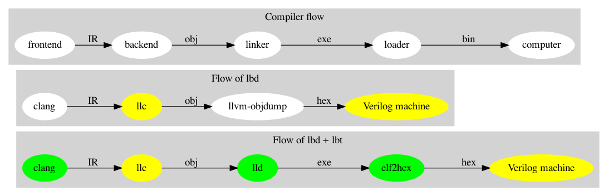

.. _sec-about:

About
======

.. contents::
   :local:
   :depth: 4

Authors
-------

.. figure:: ../Fig/Author_ChineseName.png
   :align: right

Chen Chung-Shu

  gamma_chen@yahoo.com.tw
	
  http://jonathan2251.github.io/ws/en/index.html

Contributors
------------

Anoushe Jamshidi, ajamshidi@gmail.com,  Chapters 1, 2, 3 English re-writing and Sphinx tool and format setting.

Chen Wei-Ren, chenwj@iis.sinica.edu.tw, assisted with text and code formatting.

Chen Zhong-Cheng, who is the author of original cpu0 verilog code.

Acknowledgments
---------------

We would like to thank Sean Silva, chisophugis@gmail.com, for his help, 
encouragement, and assistance with the Sphinx document generator.  
Without his help, this book would not have been finished and published online. 
We also thank those corrections from readers who make the book more accurate.

Support
--------

We get the kind help from LLVM development mail list, llvmdev@cs.uiuc.edu, 
even we don't know them. So, our experience is you are not 
alone and can get help from the development list members in working with the LLVM 
project. Some of them are:

Akira Hatanaka <ahatanak@gmail.com> in va_arg question answer.

Ulrich Weigand <Ulrich.Weigand@de.ibm.com> in AsmParser question answer.

Build steps
-----------

https://github.com/Jonathan2251/lbd/blob/master/README.md

Revision history
----------------

Version 12.0.19, not released yet.

Version 12.0.18, October 4, 2025.

  gpu.rst: add subsection 'Processor Units and Memory Hierarchy in NVIDIA GPU',
  'Geometry Units', 'Rasterization Units' and 'Render Output Units (ROPs)'.

Version 12.0.17.3, Released September 26, 2025.

  gpu.rst: gpu-hw.gv, ogl-pipeline-hw.gv, add subsection 
  'Texture Mapping Units (TMUs)' and add section 
  'Unified IR Conversion Flows'.

Version 12.0.17.2, Released September 20, 2025.

  gpu.rst: add subsection 'RegLess-style architectures'.

Version 12.0.17.1, Released September 14, 2025.

  gpu.rst: add 'SISD, SIMD, and SPMD Pipelines' in subsection SM (SIMT).
  backendstructure.rst: enc.gv.

Version 12.0.17, Released September 7, 2025.

  c++.rst: Rewrite section 'C++ Memory Order'.
  llvmstructure.rst: Refine the order of sections.
  gpu.rst: Refine subsection 'GPU Hardware Units'.

Version 12.0.16.3, Released Augest 10, 2025.

  llvmstructure.rst: Modify subsection 'Why doesn’t the Clang compiler use YACC/LEX tools to parse C++?'.
  gpu.rst: Modify subsection 'SIMT'.

Version 12.0.16.2, Released July 22, 2025.

  c++.rst: Rewrite section 'C++ Memory Order'.

Version 12.0.16.1, Released July 20, 2025.

  llvmstructure.rst: add section "BNF Auto-Generated Parsers vs. Handwritten 
  Parsers".
  c++.rst: Rewrite section 'C++ Memory Order'.
  gpu.rst: section 'OpenCL, Vulkan and spir-v', subsections 'Buffers'.
  add 'Descrete GPU', 'Goals', 'GLSL vs. C: Feature Overview' and
  'GLSL Qualifiers by Shader Stage' in subsection 'GLSL (GL Shader Language)'.

Version 12.0.16, Released May 24, 2025.

  Chatgpt: Refine my English for the input reStructuredText (reST) format I 
  provide below, and output the corrected version in reST format with each 
  line no longer than 80 characters.

Version 12.0.15.4, Released September 22, 2024.

  backendstructure.rst: Fix Cpu0.td for CH2, Cpu0MCInstLower::Lower() and 
  printAsm.gv, callFunctions.gv, cpu0-function.gv;
  elf.rst: ch3.disas.log, table to explain decodeInstruction();

Version 12.0.15.3, Released September 15, 2024.

  gpu.rst: address coalescing, subgroup and trans-steps.png;
  backendstructure.rst: printAsm.gv, asm-emit.gv and llvm-data-structure.gv;
  elf.rst: disas.gv;
  asm.rst: asmFlow.gv;
  genobj.rst: getMemEncoding, obj-emit.gv;

Version 12.0.15.2, Released August 18, 2024.

  gpu.rst: sm.png, gpu-block-diagram.png, spirv-lang-layers.gv, sycl.png, 
  subgroup, threadblock.jpg, threads-lanes.png, grid.png.

Version 12.0.15.1, Released May 31, 2024.

  gpu.rst: opengl-flow.gv, explanation of Vota, rotation, section Transformation,
  graphic-gpu-csf.png.
  llvmstructure.rst: DAG for two destination registers.

Version 12.0.15, Released March 16, 2024.

  llvmstructure.rst: table: C, llvm-ir and Cpu0. 
  gpu.rst: glsl-spirv.gv, AMD FreeSync, Fragment definition, comment for 
  References/01-triangles.cpp, Refine sections and sub-sections.

Version 12.0.14, Released December 30, 2023.

  gpu.rst: Table More Desciptive Name and Cuda term in GPU and Desciption, 
  Table Mapping saxpy code.
  gpu.rst: Table More Desciptive Name for Cuda term in Fermi GPU and Desciption.
  llvmstructure.rst: table: C, llvm-ir and Cpu0.
  lvmstructure.rst: note What and how the ISA of Cpu0 be selected
  

Version 12.0.13.9, Released November 30, 2023.

  gpu.rst: Table More Desciptive Name and Cuda term in GPU and Desciption,
  Table Mapping saxpy code.

Version 12.0.13.8, Released November 30, 2023.

  gpu.rst: graphic_cpu_gpu.png, additive-colors.

Version 12.0.13.7, Released November 16, 2023.

  gpu.rst: 2d-vector-inward, ogl-pointing-outwards and short-rendering-pipeline, Double Buffering and VSync.

Version 12.0.13.6, Released November 13, 2023.

  gpu.rst: VAO.

Version 12.0.13.5, Released September 10, 2023.

  gpu.rst: Tessellation Shading and \clearpage for pdf. llvmstructure.rst: 
  section CFG and Register Allocation Passes.

Version 12.0.13.4, Released August 26, 2023.

  llvm.rst: Sections of Options of llc for debug and Options of opt.

Version 12.0.13.3, Released August 13, 2023.

  gpu.rst: animation, graphic-sw-stack.gv and opengl-flow.gv.

Version 12.0.13.2, Released August 7, 2023.

  gpu.rst: Subsection of buffers, vao binding.

Version 12.0.13.1, Released July 24, 2023.

  gpu.rst: Section of Basic geometry in computer graphics, a x b = -b x a in 2D,
  The role of GPU driver. npu.rst: The role of GPU driver.

Version 12.0.13, Released July 15, 2023.

  gpu.rst: Section of Basic geometry in computer graphics

Version 12.0.12, Released April 4, 2023.

  gpu.rst: refine.

Version 12.0.11, Released Feburary 27, 2023.

  README.md.
  docs.rst: Note of Sphinx.
  c++.rst: Atomic.

Version 12.0.10, Released December 15, 2022.

  gpu.rst: Refine Table 43.
  ctrl.rst: Refine section "Pipeline architecture".
  Change test_memcpy.ll.
  Refine install.rst.

Version 12.0.9, Released November 19, 2022.

  gpu.rst: Table 42 Map (Core,Thread) to saxpy and refine section of General purpose GPU.
  Move null_pointer.cpp from git/note to lbd/References.

Version 12.0.8, Released November 12, 2022.

  install.rst: section Toolchain and Brew install in China.
  Section Work flow of genobj.rst.
  set-llvm-lit.

Version 12.0.7, Released September 24, 2022.

  Atomic, section of Accelerate ML/DL on OpenCL/SYC and refine Makefile and install.rst

Version 12.0.6, Released August 16, 2022.

  Fig/backendstructure/class_access_link.puml.
  Lock-free of chapter c++ and Vulkan link of gpu.
  Install & doc.
  Update spirvtoolchain link and grid.png in gpu chapter.

Version 12.0.5, Released February 1, 2022.

  Fix regression test.

Version 12.0.4, Released January 22, 2022.

  Fix bug: add CMPu, store uses GPROut register to exclude SW registe and 
  Relocation Record: R_CPU0_HI16/fixup_Cpu0_HI16.

Version 12.0.3, Released January 9, 2022.

  Expand memory size of cpu0.v to 0x1000000, 24-bit. 
  Section LLVM vs GCC in structure.
  Add NOR instruction.
  Fix bug of SLTu SLTiu, SRA and SRAV in verilog code.

Version 12.0.2, Released December 18, 2021.

  Remove regression test cases for large frame of not supporting.

Version 12.0.1, Released December 12, 2021.

  Section: More about llvm.
  Table: The differences for speedup in architecture of CPU and GPU.
  Pipeline diagram and exception handling link.
  Update chapter Appendix A.

Version 12.0.0, Released August 11, 2021.

  Writing and comment.

Version 3.9.4, Released August 5, 2021.

  Writing and comment.

Version 3.9.3, Released March 1, 2020.

  Add Appendix C: GPU compiler

Version 3.9.2, Released Feburary 17, 2020.

  Add section "Add specific backend intrinsic function".
  Add reasons for regression test.
  More phi node explanation.

Version 3.9.1, Released May 11, 2018

  Fix tailcall bug.
  Fix return-vector.ll run slowly problem, bug from Cpu0ISelLowering.cpp.
  Add figure "Tblgen generate files for Cpu0 backend".
  Modify section float and double of Chapter Other data type.
  Move storeRegToStack() and loadRegFromStack() from Chapter9_1 to Chapter3_5.
  Section DSA of chapter Cpu0 architecture and LLVM structure.

Version 3.9.0, Released November 22, 2016

  Porting to llvm 3.9.
  Correct writing.

Version 3.7.4, Released December 7, 2016

  Change bal instruction from with delay slot to without delay slot.

Version 3.7.3, Released July 20, 2016

  Refine code-block according sphinx lexers.
  Add search this book.

Version 3.7.2, Released June 29, 2016

  Add Verilog delay slot simulation.
  Explain "tablegen(" in CMakeLists.txt.
  Correct typing.
  Add lbdex/install_llvm/\*.sh for installation.
  Upgrade sphinx to 1.4.4.

Version 3.7.1, Released November 7, 2015

  Remove EM_CPU0_EL.
  Add subsection Caller and callee saved registers.
  Add IR blockaddress and indirectbr support.
  Correct tglobaladdr, tblockaddress, tjumptable and tglobaltlsaddr of 
  Cpu0InstrInfo.td.
  Add stacksave and stackrestore support.
  Add sub-section frameaddress, returnaddress and eh.return support of chapter
  Function call.
  Match Mips 3.7 style.
  Add bswap in Chapter Function call.
  Add section "Vector type (SIMD) support" of Chapter "Other data type".
  Add section "Long branch support" of Chapter "Control flow statements".
  Add sub-section "eh.dwarf intrinsic" of Chapter Function call.
  Change display "ret $rx" to "jr $rx" where $rx is not $lr.
  Move sub-section Caller and callee saved registers.
  Add sub-sections Live in and live out register.
  Add Phi node.
  Replace ch3-proepilog.ll with ch3_largeframe.cpp.
  Remove DecodeCMPInstruction().
  Re-organize testing ch4_2_1.cpp, ch4_2_2.cpp and ch9_4.cpp.
  Fix dynamic alloca bug.
  Move Cpu0AnalyzeImmediate.cpp and related functions from Chapter3_4 to Chapter3_5.
  Rename input files.

Version 3.7.0, Released September 24, 2015

  Porting to lld 3.7.
  Change tricore_llvm.pdf web link.
  Add C++ atomic to regression test.

Version 3.6.4, Released July 15, 2015

  Add C++ atomic support.

Version 3.6.3, Released May 25, 2015

  Correct typing.

Version 3.6.2, Released May 3, 2015

  Write Appendix B.
  Split chapter Appendix B from Appendix A.
  Move some test from lbt to lbd.
  Remove warning in build Cpu0 code.

Version 3.6.1, Released March 22, 2015

  Add Cpu0 instructions ROLV and RORV.

Version 3.6.0, Released March 9, 2015

  Update Appendix A for llvm 3.6.
  Replace cpp with ll for appearing in document.
  Move chapter lld, optimization, library to 
  https://github.com/Jonathan2251/lbt.git.

Version 3.5.9, Released February 2, 2015

  Fix bug of 64 bits shift.
  Fix global address error by replacing addiu with ori.
  Change encode of "cmp $sw, $3, $2" from 0x10320000 to 0x10f32000.

Version 3.5.8, Released December 27, 2014

  Correct typing.
  Fix typing error for update lbdex/src/modify/src/ of install.rst.
  Add libsoftfloat/compiler-rt and libc/avr-libc-1.8.1.
  Add LLVM-VPO in chapter Optimization.

Version 3.5.7, Released December 1, 2014

  Fix over 16-bits frame prologue/epilogue error from 3.5.3.
  Call convention ABI S32 is enabled by option.
  Change from ADD to ADDu in copyPhysReg() of Cpu0SEInstrInfo.cpp.
  Add asm directive .weak back which exists in 3.5.3.

Version 3.5.6, Released November 18, 2014

  Remove SWI and IRET instructions.
  Add Cpu0SetChapter.h for ex-build-test.sh.
  Correct typing.
  Fix thread variable error come from version 3.5.3 in static mode.
  Add sub-section "Cpu0 backend machine ID and relocation records" of Chapter 2.

Version 3.5.5, Released November 11, 2014

  Rename SPR to C0R.
  Add ISR simulation.

Version 3.5.4, Released November 6, 2014

  Adjust chapter 9 sections.
  Fix .cprestore bug.
  Re-organize sections.
  Add sub-section "Why not using ADD instead of SUB?" in chapter 2.
  Add overflow control option to use ADD and SUB instructions.

Version 3.5.3, Released October 29, 2014

  Merge Cpu0 example code into one copy and it can be config by Cpu0Config.h.

Version 3.5.2, Released October 3, 2014

  Move R_CPU0_32 from type of non-relocation record to type ofrelocation record.
  Correct logic error for setgt of BrcondPatsSlt of Cpu0InstrInfo.td.

Version 3.5.1, Released October 1, 2014

  Add move alias instruction for addu $reg, $zero.
  Add cpu cycles count in verilog.
  Fix ISD::SIGN_EXTEND_INREG error in other types beside i1.
  Support DAG op br_jt and DAG node JumpTable.

Version 3.5.0, Released September 05, 2014

  Issue NOP in delay slot.

Version 3.4.8, Released August 29, 2014

  Add reason that set endian swap in memory module.
  Add presentation files.

Version 3.4.7, Released August 22, 2014

  Fix wrapper_pic for cmov.ll.
  Add shift operations 64 bits support.
  Fix wrapper_pic for ch8_5.cpp.
  Add section thread of chapter 14.
  Add section Motivation of chapter about.
  Support little endian for cpu0 verilog.
  Move ch8_5.cpp test from Chapter Run backend to Chapter lld since it need lld 
  linker.
  Support both big endian and little endian in cpu0 Verilog, elf2hex and lld.
  Make branch release_34_7.

Version 3.4.6, Released July 26, 2014

  Add Chapter 15, optimization.
  Correct typing.
  Add Chapter 14, C++.
  Fix bug of generating cpu032II instruction in dynamic_linker.cpp.

Version 3.4.5, Released June 30, 2014

  Correct typing.

Version 3.4.4, Released June 24, 2014

  Correct typing.
  Add the reason of use SSA form.
  Move sections LLVM Code Generation Sequence, DAG and Instruction Selection 
  from Chapter 3 to Chapter 2.

Version 3.4.3, Released March 31, 2014

  Fix Disassembly bug for GPROut register class.
  Adjust Chapters.
  Remove hand copy Table of tblgen in AsmParser.

Version 3.4.2, Released February 9, 2014

  Add ch12_2.cpp for slt instruction explanation and fix bug in Cpu0InstrInfo.cpp.
  Correct typing.
  Move Cpu0 Status Register from Number 20 to Number 10.
  Fix llc -mcpu option problem.
  Update example code build shell script.
  Add condition move instruction.
  Fix bug of branch pattern match in Cpu0InstrInfo.td.

Version 3.4.1, Released January 18, 2014

  Add ch9_4.cpp to lld test.
  Fix the wrong reference in lbd/lib/Target/Cpu0 code.
  inlineasm.
  First instruction jmp X, where X changed from _Z5startv to start.
  Correct typing.

Version 3.4.0, Released January 9, 2014

  Porting to llvm 3.4 release.

Version 3.3.14, Released January 4, 2014

  lld support on iMac.
  Correct typing.

Version 3.3.13, Released December 27, 2013

  Update section Install sphinx on install.rst.
  Add Fig/llvmstructure/cpu0_arch.odp.

Version 3.3.12, Released December 25, 2013

  Correct typing error.
  Adjust Example Code.
  Add section Data operands DAGs of backendstructure.rst.
  Fix bug in instructions lb and lh of cpu0.v.
  Fix bug in itoa.cpp.
  Add ch7_2_2.cpp for othertype.rst.
  Add AsmParser reference web.

Version 3.3.11, Released December 11, 2013

  Add Figure Code generation and execution flow in about.rst.
  Update backendstructure.rst.
  Correct otherinst.rst.
  Decoration.
  Correct typing error.

Version 3.3.10, Released December 5, 2013

  Correct typing error.
  Dynamic linker in lld.rst.
  Correct errors came from old version of example code.
  lld.rst.

Version 3.3.9, Released November 22, 2013

  Add LLD introduction and Cpu0 static linker document in lld.rst.
  Fix the plt bug in elf2hex.h for dynamic linker.

Version 3.3.8, Released November 19, 2013

  Fix the reference file missing for make gh-page.

Version 3.3.7, Released November 17, 2013

  lld.rst documentation.
  Add cpu032I and cpu032II in `llc -mcpu`.
  Reference only for Chapter12_2.

Version 3.3.6, Released November 8, 2013

  Move example code from github to dropbox since the name is not work for 
  download example code.

Version 3.3.5, Released November 7, 2013

  Split the elf2hex code from modiified llvm-objdump.cpp to elf2hex.h.
  Fix bug for tail call setting in LowerCall().
  Fix bug for LowerCPLOAD().
  Update elf.rst.
  Fix typing error.
  Add dynamic linker support.
  Merge cpu0 Chapter12_1 and Chapter12_2 code into one, and identify each of 
  them by -mcpu=cpu0I and -mcpu=cpu0II.
  cpu0II.
  Update lld.rst for static linker.
  Change the name of example code from LLVMBackendTutorialExampleCode to lbdex.

Version 3.3.4, Released September 21, 2013

  Fix Chapter Global variables error for LUi instructions and the material move
  to Chapter Other data type.
  Update regression test items.

Version 3.3.3, Released September 20, 2013

  Add Chapter othertype

Version 3.3.2, Released September 17, 2013

  Update example code.
  Fix bug sext_inreg.
  Fix llvm-objdump.cpp bug to support global variable of .data.
  Update install.rst to run on llvm 3.3.  

Version 3.3.1, Released September 14, 2013

  Add load bool type in chapter 6.
  Fix chapter 4 error.
  Add interrupt function in cpu0i.v.
  Fix bug in alloc() support of Chapter 8 by adding code of spill $fp register. 
  Add JSUB texternalsym for memcpy function call of llvm auto reference.
  Rename cpu0i.v to cpu0s.v.
  Modify itoa.cpp.
  Cpu0 of lld.

Version 3.3.0, Released July 13, 2013

  Add Table: C operator ! corresponding IR of .bc and IR of DAG and Table: C 
  operator ! corresponding IR of Type-legalized selection DAG and Cpu0 
  instructions. Add explanation in section Full support %. 
  Add Table: Chapter 4 operators.
  Add Table: Chapter 3 .bc IR instructions.
  Rewrite Chapter 5 Global variables.
  Rewrite section Handle $gp register in PIC addressing mode.
  Add Large Frame Stack Pointer support.
  Add dynamic link section in elf.rst.
  Re-oganize Chapter 3.
  Re-oganize Chapter 8.
  Re-oganize Chapter 10.
  Re-oganize Chapter 11.
  Re-oganize Chapter 12.
  Fix bug that ret not $lr register.
  Porting to LLVM 3.3.

Version 3.2.15, Released June 12, 2013

  Porting to llvm 3.3.
  Rewrite section Support arithmetic instructions of chapter Adding arithmetic
  and local pointer support with the table adding.
  Add two sentences in Preface. 
  Add `llc -debug-pass` in section LLVM Code Generation Sequence.
  Remove section Adjust cpu0 instructions.
  Remove section Use cpu0 official LDI instead of ADDiu of Appendix-C.
	
Version 3.2.14, Released May 24, 2013

  Fix example code disappeared error.
	
Version 3.2.13, Released May 23, 2013

  Add sub-section "Setup llvm-lit on iMac" of Appendix A.
  Replace some code-block with literalinclude in \*.rst.
  Add Fig 9 of chapter Backend structure.
  Add section Dynamic stack allocation support of chapter Function call.
  Fix bug of Cpu0DelUselessJMP.cpp.
  Fix cpu0 instruction table errors.
	
Version 3.2.12, Released March 9, 2013

  Add section "Type of char and short int" of chapter 
  "Global variables, structs and arrays, other type".
	
Version 3.2.11, Released March 8, 2013

  Fix bug in generate elf of chapter "Backend Optimization".
	
Version 3.2.10, Released February 23, 2013

  Add chapter "Backend Optimization".
	
Version 3.2.9, Released February 20, 2013

  Correct the "Variable number of arguments" such as sum_i(int amount, ...) 
  errors. 
	
Version 3.2.8, Released February 20, 2013

  Add section llvm-objdump -t -r.
	
Version 3.2.7, Released February 14, 2013

  Add chapter Run backend.
  Add Icarus Verilog tool installation in Appendix A. 
	
Version 3.2.6, Released February 4, 2013

  Update CMP instruction implementation.
  Add llvm-objdump section.
	
Version 3.2.5, Released January 27, 2013

  Add "LLVMBackendTutorialExampleCode/llvm3.1".
  Add  section "Structure type support". 
  Change reference from Figure title to Figure number.

Version 3.2.4, Released January 17, 2013
  Update for LLVM 3.2.
  Change title (book name) from "Write An LLVM Backend Tutorial For Cpu0" to 
  "Tutorial: Creating an LLVM Backend for the Cpu0 Architecture".

Version 3.2.3, Released January 12, 2013

  Add chapter "Porting to LLVM 3.2".

Version 3.2.2, Released January 10, 2013

  Add section "Full support %" and section "Verify DIV for operator %".

Version 3.2.1, Released January 7, 2013

  Add Footnote for references.
  Reorganize chapters (Move bottom part of chapter "Global variable" to 
  chapter "Other instruction"; Move section "Translate into obj file" to 
  new chapter "Generate obj file". 
  Fix errors in Fig/otherinst/2.png and Fig/otherinst/3.png. 

Version 3.2.0, Released January 1, 2013

  Add chapter Function.
  Move Chapter "Installing LLVM and the Cpu0 example code" from beginning to 
  Appendix A.
  Add subsection "Install other tools on Linux".
  Add chapter ELF.

Version 3.1.2, Released December 15, 2012

  Fix section 6.1 error by add “def : Pat<(brcond RC:$cond, bb:$dst), 
  (JNEOp (CMPOp RC:$cond, ZEROReg), bb:$dst)>;” in last pattern.
  Modify section 5.5
  Fix bug Cpu0InstrInfo.cpp SW to ST.
  Correct LW to LD; LB to LDB; SB to STB.

Version 3.1.1, Released November 28, 2012

  Add Revision history.
  Correct ldi instruction error (replace ldi instruction with addiu from the 
  beginning and in the all example code).
  Move ldi instruction change from section of "Adjust cpu0 instruction and 
  support type of local variable pointer" to Section ”CPU0 
  processor architecture”.
  Correct some English & typing errors.

Licensing
---------

http://llvm.org/docs/DeveloperPolicy.html#license

Motivation
-----------

My intention in writing this book stems from my curiosity about how a simple  
and robotic CPU ISA, along with an LLVM-based software toolchain, can be  
designed and implemented.

.. table:: Number of lines in source code (including spaces and comments) for Cpu0

  ======================  ===============
  Components              Number of lines
  ======================  ===============
  llvm                    15,000
  llvm-objdump            8
  elf2hex                 765
  verilog                 600
  lld                     140
  clang                   500
  compiler-rt's builtin   5 (abort.c)
  ----------------------  ---------------
  total                   17,018
  ======================  ===============
  

- Though the LLVM backend's source code can be ported from another backend, it
  still requires a lot of thought and effort to do so, making the process not  
  entirely easy.

We all learned computer knowledge in school through conceptual books.  
Concepts provide an effective way to understand the big picture.  
However, when developing real, complex systems, we often find that the  
concepts from school or books are insufficient or lack detail.  

A compiler is a highly complex system. Traditionally, students learn about  
compilers conceptually and complete homework assignments using yacc/lex tools  
to translate parts of C or another high-level language into an intermediate  
representation (IR) or assembly. This approach helps them understand parsing  
and tool applications.

On the other hand, compiler engineers who graduate from school often face real  
market CPUs and complex specifications. Due to market demands, there exist  
multiple CPU series and ABIs (Application Binary Interfaces) to handle.  
Furthermore, for performance reasons, real compiler backend implementations  
are too complex to serve as learning materials, even for a CPU with a single  
ABI.

This book develops a compiler backend alongside a simple, educational CPU  
called Cpu0. It includes implementations of a compiler backend, linker,  
llvm-objdump, elf2hex, and the Verilog source code for Cpu0's instruction set.  
We provide readers with full source code to compile C/C++ programs and observe  
how they run on the Cpu0 machine implemented in Verilog. Through this  
educational CPU, readers gain insight into compiler backends, linkers, system  
tools, and CPU design. In contrast, real-world CPUs and compilers are too  
complex for a single person to fully understand or develop alone.  

From my observations, LLVM is favored by some software engineers over GCC for  
two reasons. The first is political, as LLVM uses the BSD license  
[#llvm-license]_ [#richard]_. The second is technical, as LLVM follows the  
three-tier compiler software structure and leverages C++ object-oriented  
programming. GCC was originally written in C and only adopted C++ nearly 20  
years later [#wiki-gcc]_. Some speculate that GCC adopted C++ simply because  
LLVM did.

I learned object-oriented programming in C++ during my studies. After reading  
books on "Design Patterns," "C++/STL," and "Object-Oriented Design," I  
realized that C is easier to trace, whereas C++ enables the creation of  
reusable software units, known as objects. If a programmer has a strong  
understanding of design patterns, C++ provides better reusability and  
modifiability. A book I read on "system languages" defined software quality  
based on readability, modifiability, reusability, and performance.  
Object-oriented programming was introduced to manage large and complex  
software projects.  

Given that compilers and operating systems are undeniably complex, why do GCC  
and Linux still avoid using C++? [#wiki-cpp]_ This is one reason I chose to  
develop a backend under LLVM rather than GCC.

Preface
-------

The LLVM Compiler Infrastructure provides a versatile framework for creating  
new backends. Once you familiarize yourself with this structure, creating a  
new backend should not be too difficult. However, the available backend  
documentation is fairly high level and omits many details. This tutorial  
provides step-by-step instructions for writing a new backend for a new target  
architecture from scratch.  

We will use the Cpu0 architecture as an example to build our backend. Cpu0 is  
a simple RISC architecture designed for educational purposes. More information  
about Cpu0, including its instruction set, is available here [#cpu0-web]_. The  
Cpu0 example code referenced in this book can be found  
`<http://jonathan2251.github.io/lbd/lbdex.tar.gz>`_. As you progress through  
each chapter, you will incrementally build the backend's functionality.  

Since Cpu0 is a simple RISC CPU for educational purposes, the LLVM backend code  
for it is also simple and easy to learn. Additionally, Cpu0 provides Verilog  
source code that can be run on a PC or FPGA platform, as explained in the  
chapter "Verify Backend on Verilog Simulator." To illustrate backend design,  
we carefully design C/C++ programs for each newly added function in every  
chapter. Through these example codes, readers can understand which LLVM  
intermediate representations (IRs) the backend transforms and how these IRs  
correspond to the original C/C++ code.  

This tutorial initially used the LLVM 3.1 MIPS backend as a reference and was  
later synchronized with LLVM 3.5 MIPS at version 3.5.3. Based on our  
experience, referencing and synchronizing with an existing backend helps  
enhance features and fix bugs. By comparing differences across versions, you  
can leverage the LLVM development team's efforts to improve your backend.  

Since Cpu0 is an educational architecture, it lacks key documentation needed  
for compiler development, such as an Application Binary Interface (ABI). To  
implement our backend, we use the MIPS ABI as a reference. You may find it  
helpful to familiarize yourself with relevant parts of the MIPS ABI as you  
progress through this tutorial.  

This document also serves as a tutorial for toolchain development for a new  
CPU architecture. Many programmers graduate with knowledge of compilers and  
computer architecture but lack professional experience in compiler or CPU  
design. This document introduces these engineers to toolchain programming and  
CPU design using the LLVM infrastructure—without requiring the purchase of any  
software or hardware. A computer is the only device needed.  

Finally, this book is not a conceptual compiler textbook. It is intended for  
readers interested in extending a compiler toolchain to support a new CPU  
based on LLVM. Programming on Linux does not require understanding every  
detail of the operating system. For example, when developing a USB device  
driver for Linux, a programmer studies the USB specification, the Linux USB  
subsystem, and the common device driver model and APIs. Similarly, this book  
focuses on practical implementation rather than compiler theory.

In the same way, when extending functions in a large software project like the  
LLVM umbrella project, you should focus on achieving your goal and ignore  
irrelevant details.  

Trying to understand every line of source code in detail is unrealistic if  
your project involves extending a well-defined software structure. It only  
makes sense when rewriting the entire software structure.  

Of course, if more books or documents about LLVM backend development were  
available, readers would have more opportunities to understand LLVM by  
studying them.

Prerequisites
-------------

Readers should be comfortable with the C++ language and Object-Oriented  
Programming concepts. LLVM is developed in C++ and follows a modular design,  
allowing various classes to be adapted and reused efficiently.  

Having a conceptual understanding of how compilers work is beneficial. If you  
have implemented compilers before, you will likely have no trouble following  
this tutorial. Since this tutorial builds an LLVM backend step by step, we will  
introduce important concepts as needed.  

This tutorial references the following materials. We highly recommend reading  
these documents to gain a deeper understanding of the topics covered:

`The Architecture of Open Source Applications Chapter on LLVM <http://www.aosabook.org/en/llvm.html>`_

`LLVM's Target-Independent Code Generation documentation <http://llvm.org/docs/CodeGenerator.html>`_

`LLVM's TableGen Fundamentals documentation <http://llvm.org/docs/TableGenFundamentals.html>`_

`LLVM's Writing an LLVM Compiler Backend documentation <http://llvm.org/docs/WritingAnLLVMBackend.html>`_

`Description of the Tricore LLVM Backend <https://opus4.kobv.de/opus4-fau/files/1108/tricore_llvm.pdf>`_

`Mips ABI document <http://www.linux-mips.org/pub/linux/mips/doc/ABI/mipsabi.pdf>`_

Outline of Chapters
-------------------

.. _about-f1: 

  Code generation and execution flow

The top part of :numref:`about-f1` represents the workflow and software packages
involved in generating and executing a computer program. IR stands for
Intermediate Representation.

The middle part illustrates this book's workflow. Except for Clang, the other
components need to be extended for a new backend development. Although the Cpu0
backend extends Clang as well, it uses the MIPS ABI and can utilize MIPS-Clang.
This book implements the sections highlighted in yellow. The green sections,
which include lld and elf2hex for the Cpu0 backend, can be found at:
http://jonathan2251.github.io/lbt/index.html.

The hex format is an ASCII file representation that uses characters '0' to '9'
and 'a' to 'f' to encode hexadecimal values, as the Verilog machine reads it as
an input file.

This book includes 10,000 lines of source code covering:

1. Step-by-step creation of an LLVM backend for the Cpu0, from Chapters 2 to 11.
2. Cpu0 Verilog source code, discussed in Chapter 12.

With this code, readers can generate Cpu0 machine code through the Cpu0 LLVM
backend compiler and observe how it executes on a computer. However, execution
is only possible for code that does not contain global variables or relocation
records requiring linker handling. The book is also available in PDF and EPUB
formats online.

This tutorial is aimed at LLVM backend developers but is not intended for
experts. It serves as a valuable resource for those familiar with compiler
concepts and computer architecture who wish to learn how to extend the LLVM
toolchain to support a new CPU.

:ref:`sec-llvmstructure`:

This chapter introduces the Cpu0 architecture, provides a high-level overview
of LLVM, and explains how Cpu0 will be targeted in an LLVM backend. It guides
you through the initial steps of backend development, including target
description (TD), CMake setup, and target registration. By the end of this
chapter, around 750 lines of source code will be added.

:ref:`sec-backendstructure`:

This chapter outlines the structure of an LLVM backend using UML diagrams. It
continues the development of the Cpu0 backend, adding thousands of lines of
source code. Many of these lines are common across LLVM backends, regardless of
the target architecture.

By the end of this chapter, the Cpu0 LLVM backend will support fewer than ten
instructions and be capable of generating some initial assembly output.

:ref:`sec-addingmoresupport`:

Over ten C operators and their corresponding LLVM IR instructions are introduced  
in this chapter.  

A few hundred lines of source code, mostly in `.td` Target Description files,  
are added. With these lines of source code, the backend can now translate the  
**+, -, \*, /, &, |, ^, <<, >>, !** and **%** C operators into the appropriate  
Cpu0 assembly code.  

Usage of the ``llc`` debug option and **Graphviz** as a debug tool are  
introduced in this chapter.

:ref:`sec-genobjfiles`:

Object file generation support for the Cpu0 backend is added in this chapter,  
as the Target Registration structure is introduced.  

Based on the LLVM structure, the Cpu0 backend can generate big-endian and  
little-endian ELF object files with minimal effort.

:ref:`sec-globalvars`:

Global variable handling is added in this chapter. Cpu0 supports both PIC and  
static addressing modes. Both addressing modes are explained as their  
functionalities are implemented.

:ref:`sec-othertypesupport`:

In addition to the `int` type, other data types such as pointers, `char`,  
`bool`, `long long`, structures, and arrays are added in this chapter.

:ref:`sec-controlflow`:

Support for flow control statements, such as **if, else, while, for, goto,  
switch,** and **case**, as well as both a simple optimization software pass and  
hardware instructions for control statement optimization, are discussed in this  
chapter.

:ref:`sec-funccall`:

This chapter details the implementation of function calls in the Cpu0 backend.  
The stack frame, handling of incoming and outgoing arguments, and their  
corresponding standard LLVM functions are introduced.

:ref:`sec-elf`:

This chapter details Cpu0 support for the well-known ELF object file format.  
The ELF format and binutils tools are not part of LLVM but are introduced.  
This chapter explains how to use ELF tools to verify and analyze the object  
files created by the Cpu0 backend.  

The disassembly command ``llvm-objdump -d`` support for Cpu0 is added in the  
last section of this chapter.

:ref:`sec-asm`:

Support for translating hand-written assembly language into object files under  
the LLVM infrastructure.

:ref:`sec-c++`:

Support C++ language features. It's under working.  

:ref:`sec-verilog`:

First, create the Cpu0 virtual machine using the Verilog language with the  
Icarus tool. Using this tool, feed the hex file generated by ``llvm-objdump``  
to the Cpu0 virtual machine and observe the execution results on a PC.

:ref:`sec-appendix-installing`:

This section details how to set up the LLVM source code, development tools,  
and environment configuration for macOS and Linux platforms.

:ref:`sec-appendix-doc`:

This book uses Sphinx to generate PDF and EPUB document formats.  
Details on how to install the necessary tools, generate these documents,  
and perform regression testing for the Cpu0 backend are included.

.. [#llvm-license] http://llvm.org/docs/DeveloperPolicy.html#license

.. [#richard] http://www.phoronix.com/scan.php?page=news_item&px=MTU4MjA

.. [#wiki-gcc] http://en.wikipedia.org/wiki/GNU_Compiler_Collection

.. [#wiki-cpp] http://en.wikipedia.org/wiki/C%2B%2B

.. [#cpu0-web] http://ccckmit.wikidot.com/ocs:cpu0
