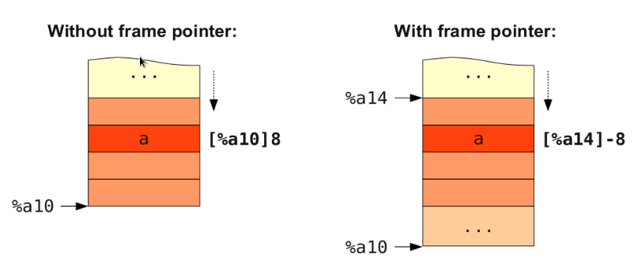

.. _sec-backendstructure:

Backend structure
==================

.. contents::
   :local:
   :depth: 4

This chapter introduces the back end class inheritance tree and class members 
first. 
Next, following the back end structure, adding individual class implementation 
in each section. 
At the end of this chapter, we will have a back end to compile llvm 
intermediate code into cpu0 assembly code.

Many code are added in this chapter. They almost are common in every back end 
except the back end name (cpu0 or mips ...). Actually, we copy almost all the 
code from mips and replace the name with cpu0. In addition to knowing the DAGs 
pattern match in theoretic compiler and realistic llvm code generation phase, 
please focus on the classes relationship in this backend structure. 
Once knowing the structure, you can 
create your backend structure as quickly as we did, even though there are 5000 
lines of code around in this chapter.

TargetMachine structure
-----------------------

.. rubric:: lbdex/chapters/Chapter3_1/Cpu0TargetObjectFile.h
.. literalinclude:: ../lbdex/chapters/Chapter3_1/Cpu0TargetObjectFile.h

.. rubric:: lbdex/chapters/Chapter3_1/Cpu0TargetObjectFile.cpp
.. literalinclude:: ../lbdex/chapters/Chapter3_1/Cpu0TargetObjectFile.cpp

.. rubric:: lbdex/chapters/Chapter3_1/Cpu0TargetMachine.h
.. literalinclude:: ../lbdex/chapters/Chapter3_1/Cpu0TargetMachine.h

.. rubric:: lbdex/chapters/Chapter3_1/Cpu0TargetMachine.cpp
.. literalinclude:: ../lbdex/chapters/Chapter3_1/Cpu0TargetMachine.cpp
  
.. rubric:: include/llvm/Target/TargetInstInfo.h
.. code-block:: c++

  class TargetInstrInfo : public MCInstrInfo { 
    TargetInstrInfo(const TargetInstrInfo &) = delete;
    void operator=(const TargetInstrInfo &) = delete;
  public: 
    ... 
  }
  ...
  class TargetInstrInfoImpl : public TargetInstrInfo { 
  protected: 
    TargetInstrInfoImpl(int CallFrameSetupOpcode = -1, 
              int CallFrameDestroyOpcode = -1) 
    : TargetInstrInfo(CallFrameSetupOpcode, CallFrameDestroyOpcode) {} 
  public: 
    ... 
  } 
  

.. rubric:: lbdex/chapters/Chapter3_1/Cpu0.td
.. literalinclude:: ../lbdex/Cpu0/Cpu0.td
    :start-after: #if CH >= CH3_1 1
    :end-before: #endif
.. literalinclude:: ../lbdex/Cpu0/Cpu0.td
    :start-after: #if CH >= CH3_1 2
    :end-before: #endif

.. rubric:: lbdex/chapters/Chapter3_1/Cpu0CallingConv.td
.. literalinclude:: ../lbdex/chapters/Chapter3_1/Cpu0CallingConv.td

.. rubric:: lbdex/chapters/Chapter3_1/Cpu0FrameLowering.h
.. literalinclude:: ../lbdex/chapters/Chapter3_1/Cpu0FrameLowering.h

.. rubric:: lbdex/chapters/Chapter3_1/Cpu0FrameLowering.cpp
.. literalinclude:: ../lbdex/chapters/Chapter3_1/Cpu0FrameLowering.cpp

.. rubric:: lbdex/chapters/Chapter3_1/Cpu0SEFrameLowering.h
.. literalinclude:: ../lbdex/chapters/Chapter3_1/Cpu0SEFrameLowering.h

.. rubric:: lbdex/chapters/Chapter3_1/Cpu0SEFrameLowering.cpp
.. literalinclude:: ../lbdex/chapters/Chapter3_1/Cpu0SEFrameLowering.cpp

.. rubric:: lbdex/chapters/Chapter3_1/Cpu0InstrInfo.h
.. literalinclude:: ../lbdex/chapters/Chapter3_1/Cpu0InstrInfo.h

.. rubric:: lbdex/chapters/Chapter3_1/Cpu0InstrInfo.cpp
.. literalinclude:: ../lbdex/chapters/Chapter3_1/Cpu0InstrInfo.cpp

.. rubric:: lbdex/chapters/Chapter3_1/Cpu0InstrInfo.td
.. literalinclude:: ../lbdex/Cpu0/Cpu0InstrInfo.td
    :start-after: #if CH >= CH3_1
    :end-before: #endif

.. rubric:: lbdex/chapters/Chapter3_1/Cpu0ISelLowering.h
.. literalinclude:: ../lbdex/chapters/Chapter3_1/Cpu0ISelLowering.h

.. rubric:: lbdex/chapters/Chapter3_1/Cpu0ISelLowering.cpp
.. literalinclude:: ../lbdex/chapters/Chapter3_1/Cpu0ISelLowering.cpp

.. rubric:: lbdex/chapters/Chapter3_1/Cpu0SEISelLowering.h
.. literalinclude:: ../lbdex/chapters/Chapter3_1/Cpu0SEISelLowering.h

.. rubric:: lbdex/chapters/Chapter3_1/Cpu0SEISelLowering.cpp
.. literalinclude:: ../lbdex/chapters/Chapter3_1/Cpu0SEISelLowering.cpp

.. rubric:: lbdex/chapters/Chapter3_1/Cpu0MachineFunction.h
.. literalinclude:: ../lbdex/chapters/Chapter3_1/Cpu0MachineFunction.h

.. rubric:: lbdex/chapters/Chapter3_1/Cpu0MachineFunction.cpp
.. literalinclude:: ../lbdex/chapters/Chapter3_1/Cpu0MachineFunction.cpp

.. rubric:: lbdex/chapters/Chapter3_1/MCTargetDesc/Cpu0ABIInfo.h
.. literalinclude:: ../lbdex/chapters/Chapter3_1/MCTargetDesc/Cpu0ABIInfo.h

.. rubric:: lbdex/chapters/Chapter3_1/MCTargetDesc/Cpu0ABIInfo.cpp
.. literalinclude:: ../lbdex/chapters/Chapter3_1/MCTargetDesc/Cpu0ABIInfo.cpp

.. rubric:: lbdex/chapters/Chapter3_1/Cpu0Subtarget.h
.. literalinclude:: ../lbdex/Cpu0/Cpu0Subtarget.h
    :start-after: #if CH >= CH3_1
    :end-before: #if CH >= CH6_1
.. literalinclude:: ../lbdex/Cpu0/Cpu0Subtarget.h
    :start-after: //@1
    :end-before: #if CH >= CH6_1 //RM
.. literalinclude:: ../lbdex/Cpu0/Cpu0Subtarget.h
    :start-after: #endif //TM
    :end-before: #if CH >= CH6_1 //hasSlt
.. literalinclude:: ../lbdex/Cpu0/Cpu0Subtarget.h
    :start-after: #endif //abiUsesSoftFloat
    :end-before: #endif // #if CH >= CH3_1

.. rubric:: lbdex/chapters/Chapter3_1/Cpu0Subtarget.cpp
.. literalinclude:: ../lbdex/chapters/Chapter3_1/Cpu0Subtarget.cpp

.. rubric:: lbdex/chapters/Chapter3_1/Cpu0RegisterInfo.h
.. literalinclude:: ../lbdex/chapters/Chapter3_1/Cpu0RegisterInfo.h

.. rubric:: lbdex/chapters/Chapter3_1/Cpu0RegisterInfo.cpp
.. literalinclude:: ../lbdex/chapters/Chapter3_1/Cpu0RegisterInfo.cpp

.. rubric:: lbdex/chapters/Chapter3_1/Cpu0SERegisterInfo.h
.. literalinclude:: ../lbdex/chapters/Chapter3_1/Cpu0SERegisterInfo.h

.. rubric:: lbdex/chapters/Chapter3_1/Cpu0SERegisterInfo.cpp
.. literalinclude:: ../lbdex/chapters/Chapter3_1/Cpu0SERegisterInfo.cpp

.. rubric:: cmake_debug_build/lib/Target/Cpu0/Cpu0GenInstInfo.inc
.. code-block:: c++

  //- Cpu0GenInstInfo.inc which generate from Cpu0InstrInfo.td 
  #ifdef GET_INSTRINFO_HEADER 
  #undef GET_INSTRINFO_HEADER 
  namespace llvm { 
  struct Cpu0GenInstrInfo : public TargetInstrInfoImpl { 
    explicit Cpu0GenInstrInfo(int SO = -1, int DO = -1); 
  }; 
  } // End llvm namespace 
  #endif // GET_INSTRINFO_HEADER 
  
  #define GET_INSTRINFO_HEADER 
  #include "Cpu0GenInstrInfo.inc" 
  //- Cpu0InstInfo.h 
  class Cpu0InstrInfo : public Cpu0GenInstrInfo { 
    Cpu0TargetMachine &TM; 
  public: 
    explicit Cpu0InstrInfo(Cpu0TargetMachine &TM); 
  };

.. _backendstructure-f1: 
.. figure:: ../Fig/backendstructure/1.png
  :align: center

  Cpu0 backend class access link

Chapter3_1 add most Cpu0 backend classes. The code of Chapter3_1 can be 
summaried as :num:`Figure #backendstructure-f1`. 
Class Cpu0Subtarget supply the interface getInstrInfo(), getFrameLowering(), 
..., to get other Cpu0 classes.
Most classes (like Cpu0InstrInfo, Cpu0RegisterInfo, ...) have Subtarget 
reference member to allowing them access other classes through the Cpu0Subtarget
interface.
Classes can access Subtarget class through Cpu0TargetMachine (usually use TM as 
symbol) by static_cast<Cpu0TargetMachine &>(TM).getSubtargetImpl().
Once getting Subtarget class, the backend code can access other classes through 
it.
For those classes name of Cpu0SExx, they mean the standard 32 bits class.
This arrangement follows llvm 3.5 Mips backend style. In Mips backend, it uses
Mips16, MipsSE and Mips64 files/classes name to define classes functions for 16,
32 and 64 bits architecture, respectively.
Since Cpu0Subtarget creates Cpu0InstrInfo, Cpu0RegisterInfo, ..., at constuctor
function, it can provide the class reference through the interfaces shown in 
:num:`Figure #backendstructure-f1`.

Below :num:`Figure #backendstructure-f2` shows Cpu0 TableGen inheritance 
relationship. 
Last chapter mentioned llvm TableGen (llvm-tblgen) is used in code generation 
process.
Backend class can choose the TableGen generated classes and inherited from it.
There are more TableGen generated classes, and they all exist in 
cmake_debug_build/lib/Target/Cpu0/\*.inc. Through C++ inheritance mechanism,
TableGen provides backend programmers a fexible way to use its generated
code. Programmers have chance to override this function if they need to. 

.. _backendstructure-f2:  
.. figure:: ../Fig/backendstructure/2.png
  :align: center

  Cpu0 classes inherited from TableGen generated files

Since llvm has deep inheritance tree, they are not digged here.
Benefit from the inheritance tree structure, there are not too much code need 
to be implemented in classes of instruction, frame/stack and select DAG, since 
many code are implemented by their parent class. 
The llvm-tblgen generate Cpu0GenInstrInfo.inc based on information from 
Cpu0InstrInfo.td. 
Cpu0InstrInfo.h extract those code it needs from Cpu0GenInstrInfo.inc by define 
“#define GET_INSTRINFO_HEADER”. 
With TabelGen, the code size in backend is reduced again through the pattern 
match theory of compiler developemnt. This is explained in sections 
of DAG and Instruction Selection in last chapter.
Following is the code fragment from Cpu0GenInstrInfo.inc. 
Code between "#if def  GET_INSTRINFO_HEADER" and 
"#endif // GET_INSTRINFO_HEADER”" will be extracted to Cpu0InstrInfo.h.

.. rubric:: cmake_debug_build/lib/Target/Cpu0/Cpu0GenInstInfo.inc
.. code-block:: c++

  //- Cpu0GenInstInfo.inc which generate from Cpu0InstrInfo.td 
  #ifdef GET_INSTRINFO_HEADER 
  #undef GET_INSTRINFO_HEADER 
  namespace llvm { 
  struct Cpu0GenInstrInfo : public TargetInstrInfoImpl { 
    explicit Cpu0GenInstrInfo(int SO = -1, int DO = -1); 
  }; 
  } // End llvm namespace 
  #endif // GET_INSTRINFO_HEADER 

Reference "Write An LLVM Backend" web site [#]_.

Chapter3_1/CMakeLists.txt is modified with these new added \*.cpp as follows,

.. rubric:: lbdex/chapters/Chapter3_1/CMakeLists.txt
.. literalinclude:: ../lbdex/Cpu0/CMakeLists.txt
    :start-after: #if CH >= CH3_1 1
    :end-before: #endif
.. literalinclude:: ../lbdex/Cpu0/CMakeLists.txt
    :start-after: #if CH >= CH3_1 2
    :end-before: #endif


Please take a look for Chapter3_1 code. 
After that, building Chapter3_1 by **"#define CH  CH2"** in Cpu0Config.h as 
follows, and do building with Xcode on iMac or make on linux again.

.. rubric:: ~/llvm/test/src/lib/Target/Cpu0SetChapter.h
.. code-block:: c++

  #define CH       CH3_1
  
  118-165-78-230:input Jonathan$ /Users/Jonathan/llvm/test/cmake_debug_build/
  Debug/bin/llc -march=cpu0 -relocation-model=pic -filetype=asm ch3.bc -o 
  ch3.cpu0.s
  ... Assertion `AsmInfo && "MCAsmInfo not initialized. " 
  ...

With Chapter3_1 implementation, the Chapter2 error message 
"Could not allocate target machine!" has gone.
The new error say that we have not Target AsmPrinter. 
We will add it in next section.

Chapter3_1 create FeatureCpu032I and FeatureCpu032II for CPU cpu032I and 
cpu032II, repectively.
Beyond that, it defines two more features, FeatureCmp and FeatureSlt. 
In order to demostrate the "instruction set designing choice" to readers, this 
book create two CPU. 
Readers will realize why Mips CPU uses instruction SLT instead of
CMP when they go to later Chapter "Control flow statement".
With the added code of supporting cpu032I and cpu32II in Cpu0.td and 
Cpu0InstrInfo.td of Chapter3_1, the command ``llc -march=cpu0 -mcpu=help`` can 
display messages as follows,

.. code-block:: bash
  
  JonathantekiiMac:input Jonathan$ /Users/Jonathan/llvm/test/
  cmake_debug_build/Debug/bin/llc -march=cpu0 -mcpu=help
  Available CPUs for this target:

    cpu032I  - Select the cpu032I processor.
    cpu032II - Select the cpu032II processor.

  Available features for this target:

    ch10_1   - Enable Chapter instructions..
    ch11_1   - Enable Chapter instructions..
    ch11_2   - Enable Chapter instructions..
    ch14_1   - Enable Chapter instructions..
    ch3_1    - Enable Chapter instructions..
    ch3_2    - Enable Chapter instructions..
    ch3_3    - Enable Chapter instructions..
    ch3_4    - Enable Chapter instructions..
    ch3_5    - Enable Chapter instructions..
    ch4_1    - Enable Chapter instructions..
    ch4_2    - Enable Chapter instructions..
    ch5_1    - Enable Chapter instructions..
    ch6_1    - Enable Chapter instructions..
    ch7_1    - Enable Chapter instructions..
    ch8_1    - Enable Chapter instructions..
    ch8_2    - Enable Chapter instructions..
    ch9_1    - Enable Chapter instructions..
    ch9_2    - Enable Chapter instructions..
    ch9_3    - Enable Chapter instructions..
    chall    - Enable Chapter instructions..
    cmp      - Enable 'cmp' instructions..
    cpu032I  - Cpu032I ISA Support.
    cpu032II - Cpu032II ISA Support (slt).
    o32      - Enable o32 ABI.
    s32      - Enable s32 ABI.
    slt      - Enable 'slt' instructions..

  Use +feature to enable a feature, or -feature to disable it.
  For example, llc -mcpu=mycpu -mattr=+feature1,-feature2
  ...

When user input ``-mcpu=cpu032I``, the variable IsCpu032I from Cpu0InstrInfo.td 
will be true since the function isCpu032I() defined in Cpu0Subtarget.h will be 
true by checking variable CPU in constructor function (the variable CPU is 
"cpu032I" when user input -mcpu=cpu032I).
Please notice variable Cpu0ArchVersion must be initialized in 
Cpu0Subtarget.cpp, otherwise variable Cpu0ArchVersion can be any value and  
functions isCpu032I() and isCpu032II() which support ``llc -mcpu=cpu032I`` and 
``llc -mcpu=cpu032II``, repectively, will have trouble.
The value of variables HasCmp and HasSlt are set depend on Cpu0ArchVersion. 
Instructions slt and beq, ... are supported only in case of HasSlt is true, and
furthermore, HasSlt is true only when Cpu0ArchVersion is Cpu032II.
Similiarly, Ch4_1, Ch4_2, ..., are used in controlling the enable or disable of 
instruction definition. Through **Subtarget->hasChapter4_1()** which exists 
both in Cpu0.td and Cpu0Subtarget.h, the Predicate, such as Ch4_1, defined in 
Cpu0InstrInfo.td can be enabled or disabled. For example, the shift-rotate 
instructions can be enabled by define CH to greater than or equal to CH4_1 as
follows,

.. rubric:: lbdex/Cpu0/Cpu0InstrInfo.td
.. literalinclude:: ../lbdex/Cpu0/Cpu0InstrInfo.td
    :start-after: #if CH >= CH4_1 3
    :end-before: #endif

.. rubric:: ~/llvm/test/src/lib/Target/Cpu0SetChapter.h
.. code-block:: c++

  #define CH       CH4_1

On the contrary, it can be disabled by define it to less than CH4_1, such as 
CH3_5, as follows,

.. rubric:: ~/llvm/test/src/lib/Target/Cpu0SetChapter.h
.. code-block:: c++

  #define CH       CH3_5


Add AsmPrinter
--------------

Chapter3_2/ contains the Cpu0AsmPrinter definition. 

.. rubric:: lbdex/chapters/Chapter2/Cpu0.td
.. code-block:: c++

  def Cpu0InstrInfo : InstrInfo;

  // Will generate Cpu0GenAsmWrite.inc included by Cpu0InstPrinter.cpp, contents 
  //  as follows,
  // void Cpu0InstPrinter::printInstruction(const MCInst *MI, raw_ostream &O) {...}
  // const char *Cpu0InstPrinter::getRegisterName(unsigned RegNo) {...}
  def Cpu0 : Target {
  // def Cpu0InstrInfo : InstrInfo as before.
    let InstructionSet = Cpu0InstrInfo;
  }

As above comments of Chapter2/Cpu0.td indicate, it will generate 
Cpu0GenAsmWrite.inc which is included by Cpu0InstPrinter.cpp as follows,

.. rubric:: lbdex/chapters/Chapter3_2/InstPrinter/Cpu0InstPrinter.h
.. literalinclude:: ../lbdex/chapters/Chapter3_2/InstPrinter/Cpu0InstPrinter.h

.. rubric:: lbdex/chapters/Chapter3_2/InstPrinter/Cpu0InstPrinter.cpp
.. literalinclude:: ../lbdex/chapters/Chapter3_2/InstPrinter/Cpu0InstPrinter.cpp

.. rubric:: lbdex/chapters/Chapter3_2/InstPrinter/CMakeLists.txt
.. literalinclude:: ../lbdex/chapters/Chapter3_2/InstPrinter/CMakeLists.txt

.. rubric:: lbdex/chapters/Chapter3_2/InstPrinter/LLVMBuild.txt
.. literalinclude:: ../lbdex/chapters/Chapter3_2/InstPrinter/LLVMBuild.txt

Cpu0GenAsmWrite.inc has the implementations of 
Cpu0InstPrinter::printInstruction() and Cpu0InstPrinter::getRegisterName(). 
Both of these functions can be auto-generated from the information we defined 
in Cpu0InstrInfo.td and Cpu0RegisterInfo.td. 
To let these two functions work in our code, the only thing needed is adding a 
class Cpu0InstPrinter and include them as did in Chapter3_2.

File Chapter3_2/Cpu0/InstPrinter/Cpu0InstPrinter.cpp include Cpu0GenAsmWrite.inc 
and call the auto-generated functions from TableGen.

Function Cpu0InstPrinter::printMemOperand() defined in Chapter3_2/InstPrinter/
Cpu0InstPrinter.cpp as above. It will be triggered since Cpu0InstrInfo.td 
defined **'let PrintMethod = \"printMemOperand\";'** as follows,

.. rubric:: lbdex/chapters/Chapter2/Cpu0InstrInfo.td
.. code-block:: c++

  // Address operand
  def mem : Operand<i32> {
    let PrintMethod = "printMemOperand";
    let MIOperandInfo = (ops CPURegs, simm16);
    let EncoderMethod = "getMemEncoding";
  //#if CH >= CH11_1
    let ParserMatchClass = Cpu0MemAsmOperand;
  //#endif
  }
  ...
  // 32-bit load.
  multiclass LoadM32<bits<8> op, string instr_asm, PatFrag OpNode,
                     bit Pseudo = 0> {
    def #NAME# : LoadM<op, instr_asm, OpNode, GPROut, mem, Pseudo>;
  }

  // 32-bit store.
  multiclass StoreM32<bits<8> op, string instr_asm, PatFrag OpNode,
                      bit Pseudo = 0> {
    def #NAME# : StoreM<op, instr_asm, OpNode, CPURegs, mem, Pseudo>;
  }

  defm LD     : LoadM32<0x01,  "ld",  load_a>;
  defm ST     : StoreM32<0x02, "st",  store_a>;


Cpu0InstPrinter::printMemOperand() will print backend operands for "local 
variable access", which like the following,

.. code-block:: bash

	  ld	$2, 16($fp)
	  st	$2, 8($fp)


Next, add Cpu0MCInstLower (Cpu0MCInstLower.h, Cpu0MCInstLower.cpp) as well as 
Cpu0BaseInfo.h, 
Cpu0FixupKinds.h and Cpu0MCAsmInfo (Cpu0MCAsmInfo.h, Cpu0MCAsmInfo.cpp) in 
sub-directory MCTargetDesc as follows,

.. rubric:: lbdex/chapters/Chapter3_2/Cpu0MCInstLower.h
.. literalinclude:: ../lbdex/chapters/Chapter3_2/Cpu0MCInstLower.h

.. rubric:: lbdex/chapters/Chapter3_2/Cpu0MCInstLower.cpp
.. literalinclude:: ../lbdex/chapters/Chapter3_2/Cpu0MCInstLower.cpp

.. rubric:: lbdex/chapters/Chapter3_2/MCTargetDesc/Cpu0BaseInfo.h
.. literalinclude:: ../lbdex/chapters/Chapter3_2/MCTargetDesc/Cpu0BaseInfo.h

.. rubric:: lbdex/chapters/Chapter3_2/Cpu0MCAsmInfo.h
.. literalinclude:: ../lbdex/Cpu0/MCTargetDesc/Cpu0MCAsmInfo.h

.. rubric:: lbdex/chapters/Chapter3_2/Cpu0MCAsmInfo.cpp
.. literalinclude:: ../lbdex/Cpu0/MCTargetDesc/Cpu0MCAsmInfo.cpp


Finally, add code in Cpu0MCTargetDesc.cpp to register Cpu0InstPrinter as 
below. By the way, it registers other classes (register, instruction and 
subtarget) which defined in Chapter3_1 at this point.

.. rubric:: lbdex/chapters/Chapter3_2/MCTargetDesc/Cpu0MCTargetDesc.h
.. code-block:: c++

  namespace llvm {
  class MCAsmBackend;
  class MCCodeEmitter;
  class MCContext;
  class MCInstrInfo;
  class MCObjectWriter;
  class MCRegisterInfo;
  class MCSubtargetInfo;
  class StringRef;
  ...
  class raw_ostream;
  ...
  }

.. rubric:: lbdex/chapters/Chapter3_2/MCTargetDesc/Cpu0MCTargetDesc.cpp
.. literalinclude:: ../lbdex/Cpu0/MCTargetDesc/Cpu0MCTargetDesc.cpp
    :start-after: #if CH >= CH3_2 //1
    :end-before: #endif
.. literalinclude:: ../lbdex/chapters/Chapter3_2/MCTargetDesc/Cpu0MCTargetDesc.cpp
    :start-after: //@1 {

.. rubric:: lbdex/chapters/Chapter3_2/MCTargetDesc/CMakeLists.txt
.. literalinclude:: ../lbdex/Cpu0/MCTargetDesc/CMakeLists.txt
    :start-after: #if CH >= CH3_2
    :end-before: #endif

.. rubric:: lbdex/chapters/Chapter3_2/MCTargetDesc/LLVMBuild.txt
.. literalinclude:: ../lbdex/Cpu0/MCTargetDesc/LLVMBuild.txt
    :start-after: #if CH >= CH3_2
    :end-before: #endif


To make the registration clearly, summary as follows,

.. rubric:: Register function of MC asm info
.. code-block:: c++

  for (Target *T : {&TheCpu0Target, &TheCpu0elTarget}) {
    // Register the MC asm info.
    RegisterMCAsmInfoFn X(*T, createCpu0MCAsmInfo);


      static MCAsmInfo *createCpu0MCAsmInfo(const 
      MCRegisterInfo &MRI, StringRef TT) {
        MCAsmInfo *MAI = new Cpu0MCAsmInfo(TT);

        unsigned SP = MRI.getDwarfRegNum(Cpu0::SP, true);
        MCCFIInstruction Inst = MCCFIInstruction::
      createDefCfa(0, SP, 0);
        MAI->addInitialFrameState(Inst);

        return MAI;
      }

Above registering the object of class Cpu0MCAsmInfo for 
target TheCpu0Target and TheCpu0elTarget. 
TheCpu0Target is for big endian and TheCpu0elTarget is for little endian. 
Cpu0MCAsmInfo is derived from MCAsmInfo which is an llvm built-in class. 
Most code is implemented in it's parent, back end reuses those code by 
inheritance.

.. rubric:: Register function of MC codegen info
.. code-block:: c++

  // Register the MC codegen info.
  TargetRegistry::RegisterMCCodeGenInfo(*T,
	                                      createCpu0MCCodeGenInfo);


      static MCCodeGenInfo *createCpu0MCCodeGenInfo(
                                            StringRef TT, Reloc::Model RM,
                                                    CodeModel::Model CM,
                                                    CodeGenOpt::Level OL) {
        MCCodeGenInfo *X = new MCCodeGenInfo();
        ...
       // defined in lib/MC/MCCodeGenInfo.cpp
        X->InitMCCodeGenInfo(RM, CM, OL); 
        return X;
      }

Above instancing MCCodeGenInfo, and initialize it by 
pass RM=Roloc::PIC when user compiling with position-independent code mode 
through command ``llc -relocation-model=pic`` or ``llc`` (default relocation 
mode is pic).
Recall there are two addressing mode in system program book, one is PIC 
mode, the other is absolute addressing mode. 
MC stands for Machine Code.

.. rubric:: Register function of MC instruction info
.. code-block:: c++

  // Register the MC instruction info.
  TargetRegistry::RegisterMCInstrInfo(*T, createCpu0MCInstrInfo);
  

     static MCInstrInfo *createCpu0MCInstrInfo() {
     MCInstrInfo *X = new MCInstrInfo();
     // defined in Cpu0GenInstrInfo.inc
  |--- InitCpu0MCInstrInfo(X);
  |    return X;
  |  }
  |      // Cpu0GenInstrInfo.inc
  |      extern const MCInstrDesc Cpu0Insts[] = {
  |      // Info generated from Cpu0InstrInfo.td
  |      }
  |--->  static inline void InitCpu0MCInstrInfo(
                               MCInstrInfo *II) {
           II->InitMCInstrInfo(Cpu0Insts, ...);
         }
  
Above instancing MCInstrInfo object X, and initialize it 
by InitCpu0MCInstrInfo(X). 
Since InitCpu0MCInstrInfo(X) is defined in Cpu0GenInstrInfo.inc, this function 
will add the information from Cpu0InstrInfo.td we specified. 

.. rubric:: Register function of MCInstPrinter
.. code-block:: c++

  // Register the MC instruction info.
  TargetRegistry::RegisterMCInstrInfo(*T, createCpu0MCInstrInfo);


      static MCInstPrinter *createCpu0MCInstPrinter(
                                                   const Target &T,
                                                    unsigned SyntaxVariant,
                                                    const MCAsmInfo &MAI,
                                                    const MCInstrInfo &MII,
                                                    const MCRegisterInfo &MRI,
                                                    const MCSubtargetInfo &STI)
      {
    |--- return new Cpu0InstPrinter(MAI, MII, MRI);
    |  }
    |
    |      // Cpu0InstPrinter.h      
    |--->  Cpu0InstPrinter(const MCAsmInfo &MAI, 
                           const MCInstrInfo &MII,
                            const MCRegisterInfo &MRI)
              : MCInstPrinter(MAI, MII, MRI) {}

Above instancing Cpu0InstPrinter to take care printing 
function for instructions. 

.. rubric:: Register function of RegisterInfo
.. code-block:: c++

  // Register the MC register info.
  TargetRegistry::RegisterMCRegInfo(*T, createCpu0MCRegisterInfo);


     static MCRegisterInfo *createCpu0MCRegisterInfo(
     StringRef TT) {
     MCRegisterInfo *X = new MCRegisterInfo();
     // defined in Cpu0GenRegisterInfo.inc
  |--- InitCpu0MCRegisterInfo(X, Cpu0::LR);
  |    return X;
  |  }
  |
  |      // Cpu0GenRegisterInfo.inc
  |--->  static inline void InitCpu0MCRegisterInfo(
         MCRegisterInfo *RI, ...) {
           RI->InitMCRegisterInfo(Cpu0RegDesc, ...)
         }
  
Above is similar to "Register function of MC instruction info", but it 
initialize the register information specified in Cpu0RegisterInfo.td. 
They share some values from instruction/register td description.
No need to specify them again in Initilize routine if they are consistant with 
td description files.

.. rubric:: Register function of SubtargetInfo
.. code-block:: c++

  // Register the MC subtarget info.
  TargetRegistry::RegisterMCSubtargetInfo(*T,
                                       createCpu0MCSubtargetInfo);


     static MCSubtargetInfo *createCpu0MCSubtargetInfo(
                StringRef TT, StringRef CPU,  StringRef FS) {
       ...
       MCSubtargetInfo *X = new MCSubtargetInfo();
       // defined in Cpu0GenSubtargetInfo.inc
  |--- InitCpu0MCSubtargetInfo(X, TT, CPU, ArchFS);
  |    return X;
  |  }
  |      // Cpu0GenSubtargetInfo.inc
  |--->  static inline void InitCpu0MCSubtargetInfo(
         MCSubtargetInfo *II, StringRef TT, 
         StringRef CPU, StringRef FS) {
           II->InitMCSubtargetInfo(TT, CPU, FS, 
                Cpu0FeatureKV, ...);
         }

Above instancing MCSubtargetInfo object and initialize with 
Cpu0.td information. 


According "section Target Registration" [#]_, we can register Cpu0 backend 
classes at LLVMInitializeCpu0TargetMC() on demand by the dynamic register 
mechanism as the above function, LLVMInitializeCpu0TargetMC().

Now, it's time to work with AsmPrinter as follows,

.. rubric:: lbdex/chapters/Chapter3_2/Cpu0AsmPrinter.h
.. literalinclude:: ../lbdex/chapters/Chapter3_2/Cpu0AsmPrinter.h

.. rubric:: lbdex/chapters/Chapter3_2/Cpu0AsmPrinter.cpp
.. literalinclude:: ../lbdex/chapters/Chapter3_2/Cpu0AsmPrinter.cpp


When instruction is ready to print, function Cpu0AsmPrinter::EmitInstruction() 
will be triggered first. And then it will call OutStreamer.EmitInstruction() to 
print OP code and register according the information from Cpu0GenInstrInfo.inc 
and Cpu0GenRegisterInfo.inc both registered at dynamic register function,
LLVMInitializeCpu0TargetMC().
Notice, file Cpu0InstPrinter.cpp only print operand while the OP code 
information come from Cpu0InstrInfo.td.

Add the following code to Cpu0ISelLowering.cpp.

.. rubric:: lbdex/chapters/Chapter3_2/Cpu0ISelLowering.cpp
.. code-block:: c++

  Cpu0TargetLowering::
  Cpu0TargetLowering(Cpu0TargetMachine &TM)
    : TargetLowering(TM, new Cpu0TargetObjectFile()),
      Subtarget(&TM.getSubtarget<Cpu0Subtarget>()) {

  //- Set .align 2
  // It will emit .align 2 later
    setMinFunctionAlignment(2);

  // must, computeRegisterProperties - Once all of the register classes are 
  //  added, this allows us to compute derived properties we expose.
    computeRegisterProperties();
  }

Add the following code to Cpu0MachineFunction.h since the Cpu0AsmPrinter.cpp
will call getEmitNOAT().

.. rubric:: lbdex/chapters/Chapter3_2/Cpu0MachineFunction.h
.. code-block:: c++

  class Cpu0FunctionInfo : public MachineFunctionInfo {
  public:
    Cpu0FunctionInfo(MachineFunction& MF)
    : ...
      , EmitNOAT(false)
      {}

    ...
    bool getEmitNOAT() const { return EmitNOAT; }
    void setEmitNOAT() { EmitNOAT = true; }
  private:
    ...
    bool EmitNOAT;
  };


Beyond adding these new .cpp files to CMakeLists.txt, please remember to add 
subdirectory InstPrinter, enable asmprinter, adding libraries AsmPrinter and 
Cpu0AsmPrinter to LLVMBuild.txt as follows,

.. rubric:: lbdex/chapters/Chapter3_2/CMakeLists.txt
.. literalinclude:: ../lbdex/Cpu0/CMakeLists.txt
    :start-after: #if CH >= CH3_2 1
    :end-before: #endif

.. code-block:: c++

  ...
  add_llvm_target(Cpu0CodeGen

.. literalinclude:: ../lbdex/Cpu0/CMakeLists.txt
    :start-after: #if CH >= CH3_2 2
    :end-before: #endif

.. code-block:: c++

    ...
    )
  ...
 
.. literalinclude:: ../lbdex/Cpu0/CMakeLists.txt
    :start-after: #if CH >= CH3_2 3
    :end-before: #endif

.. rubric:: lbdex/chapters/Chapter3_2/LLVMBuild.txt
.. code-block:: c++

  //  LLVMBuild.txt
  [common] 
  subdirectories = 
    InstPrinter 
    ...
  
  [component_0] 
  ...
  # Please enable asmprinter
  has_asmprinter = 1 
  ...
  
  [component_1] 
  required_libraries = 
                       AsmPrinter 
                       ... 
                       Cpu0AsmPrinter 
                       ...

Now, run Chapter3_2/Cpu0 for AsmPrinter support, will get new error message as 
follows,

.. code-block:: bash

  118-165-78-230:input Jonathan$ /Users/Jonathan/llvm/test/cmake_debug_build/
  Debug/bin/llc -march=cpu0 -relocation-model=pic -filetype=asm ch3.bc -o 
  ch3.cpu0.s
  /Users/Jonathan/llvm/test/cmake_debug_build/Debug/bin/llc: target does not 
  support generation of this file type!

The ``llc`` fails to compile IR code into machine code since we don't implement 
class Cpu0DAGToDAGISel. 


Add Cpu0DAGToDAGISel class
--------------------------

The IR DAG to machine instruction DAG transformation is introduced in the 
previous chapter. 
Now, let's check what IR DAG nodes the file ch3.bc has. List ch3.ll as follows,

.. code-block:: c++

  // ch3.ll
  define i32 @main() nounwind uwtable { 
  %1 = alloca i32, align 4 
  store i32 0, i32* %1 
  ret i32 0 
  } 

As above, ch3.ll uses the IR DAG node **store**, **ret**. 
So, the definitions in Cpu0InstrInfo.td as below is enough. 
The ADDiu used for stack adjustment which will needed in later section 
"Add Prologue/Epilogue functions" of this chapter.
IR DAG is defined in file  include/llvm/Target/TargetSelectionDAG.td.

.. rubric:: lbdex/chapters/Chapter2/Cpu0InstrInfo.td
.. code-block:: c++

  //===----------------------------------------------------------------------===//

  /// Load and Store Instructions
  ///  aligned
  defm LD     : LoadM32<0x01,  "ld",  load_a>;
  defm ST     : StoreM32<0x02, "st",  store_a>;

  /// Arithmetic Instructions (ALU Immediate)
  // IR "add" defined in include/llvm/Target/TargetSelectionDAG.td, line 315 (def add).
  def ADDiu   : ArithLogicI<0x09, "addiu", add, simm16, immSExt16, CPURegs>;

  let isReturn=1, isTerminator=1, hasDelaySlot=1, isBarrier=1, hasCtrlDep=1 in
  def RetLR : Cpu0Pseudo<(outs), (ins), "", [(Cpu0Ret)]>;
  
  def RET     : RetBase<GPROut>;


Add class Cpu0DAGToDAGISel (Cpu0ISelDAGToDAG.cpp) to CMakeLists.txt, and add 
the following fragment to Cpu0TargetMachine.cpp,

.. rubric:: lbdex/chapters/Chapter3_3/CMakeLists.txt
.. code-block:: c++

  add_llvm_target(
    ...
  
.. literalinclude:: ../lbdex/Cpu0/CMakeLists.txt
    :start-after: #if CH >= CH3_3
    :end-before: #endif
  
.. code-block:: c++
  
    ...
  )

The following code in Cpu0TargetMachine.cpp will create a pass in instruction 
selection stage.

.. rubric:: lbdex/chapters/Chapter3_3/Cpu0TargetMachine.cpp
.. literalinclude:: ../lbdex/Cpu0/Cpu0TargetMachine.cpp
    :start-after: #if CH >= CH3_3 //0.5
    :end-before: #endif

.. code-block:: c++

  ...
  class Cpu0PassConfig : public TargetPassConfig {
  public:
    ...

.. literalinclude:: ../lbdex/Cpu0/Cpu0TargetMachine.cpp
    :start-after: #if CH >= CH3_3 //1
    :end-before: #endif
	
.. code-block:: c++

  };
  ...

.. literalinclude:: ../lbdex/Cpu0/Cpu0TargetMachine.cpp
    :start-after: #if CH >= CH3_3 //2
    :end-before: #endif

.. rubric:: lbdex/chapters/Chapter3_3/Cpu0ISelDAGToDAG.h
.. literalinclude:: ../lbdex/chapters/Chapter3_3/Cpu0ISelDAGToDAG.h

.. rubric:: lbdex/chapters/Chapter3_3/Cpu0ISelDAGToDAG.cpp
.. literalinclude:: ../lbdex/chapters/Chapter3_3/Cpu0ISelDAGToDAG.cpp

.. rubric:: lbdex/chapters/Chapter3_3/Cpu0SEISelDAGToDAG.h
.. literalinclude:: ../lbdex/chapters/Chapter3_3/Cpu0SEISelDAGToDAG.h

.. rubric:: lbdex/chapters/Chapter3_3/Cpu0ISelDAGToDAG.cpp
.. literalinclude:: ../lbdex/chapters/Chapter3_3/Cpu0SEISelDAGToDAG.cpp


Function Cpu0DAGToDAGISel::Select() of Cpu0ISelDAGToDAG.cpp is for the 
selection of "OP code DAG node" while Cpu0DAGToDAGISel::SelectAddr() is for the
selection of "DATA DAG node with **addr** type" which defined in 
Chapter2/Cpu0InstrInfo.td. This method name corresponding to 
Chapter2/Cpu0InstrInfo.td as follows,

.. rubric:: lbdex/chapters/Chapter2/Cpu0InstrInfo.td
.. code-block:: c++

  def addr : ComplexPattern<iPTR, 2, "SelectAddr", [frameindex], [SDNPWantParent]>;

The iPTR, ComplexPattern, frameindex and SDNPWantParent defined as follows,

.. rubric:: src/include/llvm/Target/TargetSelection.td
.. code-block:: c++

  def SDNPWantParent  : SDNodeProperty;   // ComplexPattern gets the parent
  ...
  def frameindex  : SDNode<"ISD::FrameIndex",           SDTPtrLeaf, [],
                           "FrameIndexSDNode">;
  ...
  // Complex patterns, e.g. X86 addressing mode, requires pattern matching code
  // in C++. NumOperands is the number of operands returned by the select function;
  // SelectFunc is the name of the function used to pattern match the max. pattern;
  // RootNodes are the list of possible root nodes of the sub-dags to match.
  // e.g. X86 addressing mode - def addr : ComplexPattern<4, "SelectAddr", [add]>;
  //
  class ComplexPattern<ValueType ty, int numops, string fn,
                       list<SDNode> roots = [], list<SDNodeProperty> props = []> {
    ValueType Ty = ty;
    int NumOperands = numops;
    string SelectFunc = fn;
    list<SDNode> RootNodes = roots;
    list<SDNodeProperty> Properties = props;
  }


.. rubric:: src/include/llvm/CodeGen/ValueTypes.td
.. code-block:: c++

  // Pseudo valuetype mapped to the current pointer size.
  def iPTR   : ValueType<0  , 255>;


Chapter3_3 adding the following code in Cpu0InstInfo.cpp to enable debug 
information which called by llvm at proper time.

.. rubric:: lbdex/chapters/Chapter3_3/Cpu0InstrInfo.h
.. literalinclude:: ../lbdex/Cpu0/Cpu0InstrInfo.h
    :start-after: #if CH >= CH3_3
    :end-before: #endif

.. rubric:: lbdex/chapters/Chapter3_3/Cpu0InstrInfo.cpp
.. literalinclude:: ../lbdex/Cpu0/Cpu0InstrInfo.cpp
    :start-after: #if CH >= CH3_3
    :end-before: #endif


Build Chapter3_3 and run with it, finding the error message of Chapter3_2 is 
gone. The new error message for Chapter3_3 as follows,

.. code-block:: bash

  118-165-78-230:input Jonathan$ /Users/Jonathan/llvm/test/cmake_debug_build/
  Debug/bin/llc -march=cpu0 -relocation-model=pic -filetype=asm ch3.bc -o 
  ch3.cpu0.s
  ...
  LLVM ERROR: Cannot select: 0x24834b8: ch = Cpu0ISD::Ret 0x24832a8, 0x24833b0 [ORD=4] [ID=6]
    0x24833b0: i32 = Register %LR [ID=4]
  ...
    0x7f80f182d210: i32 = Register %LR [ID=4]

Above can display the error message DAG node "Cpu0ISD::Ret" because the following
code added in Chapter3_1/Cpu0ISelLowering.cpp.

.. rubric:: lbdex/chapters/Chapter3_1/Cpu0ISelLowering.cpp
.. literalinclude:: ../lbdex/Cpu0/Cpu0ISelLowering.cpp
    :start-after: //@3_1 1 {
    :end-before: #if CH >= CH12_1 //0.5
.. literalinclude:: ../lbdex/Cpu0/Cpu0ISelLowering.cpp
    :start-after: #endif //#if CH >= CH12_1 //0.5
    :end-before: //@3_1 1 }


Handle return register lr 
-----------------------------

.. rubric:: lbdex/chapters/Chapter3_4/CMakeLists.txt
.. code-block:: c++

  add_llvm_target(
    ...
  
.. literalinclude:: ../lbdex/Cpu0/CMakeLists.txt
    :start-after: #if CH >= CH3_4
    :end-before: #endif
  
.. code-block:: c++

    ...
  )

.. rubric:: lbdex/chapters/Chapter3_4/Cpu0AnalyzeImmediate.h
.. literalinclude:: ../lbdex/Cpu0/Cpu0AnalyzeImmediate.h

.. rubric:: lbdex/chapters/Chapter3_4/Cpu0AnalyzeImmediate.cpp
.. literalinclude:: ../lbdex/Cpu0/Cpu0AnalyzeImmediate.cpp

.. rubric:: lbdex/chapters/Chapter3_4/Cpu0CallingConv.td
.. literalinclude:: ../lbdex/Cpu0/Cpu0CallingConv.td
    :start-after: #if CH >= CH3_4 1
    :end-before: #endif
.. literalinclude:: ../lbdex/Cpu0/Cpu0CallingConv.td
    :start-after: #if CH >= CH3_4 2
    :end-before: #endif

.. rubric:: lbdex/chapters/Chapter3_4/Cpu0FrameLowering.h
.. literalinclude:: ../lbdex/Cpu0/Cpu0FrameLowering.h
    :start-after: #if CH >= CH3_4
    :end-before: #endif

.. rubric:: lbdex/chapters/Chapter3_4/Cpu0FrameLowering.cpp
.. literalinclude:: ../lbdex/Cpu0/Cpu0FrameLowering.cpp
    :start-after: #if CH >= CH3_4 //1
    :end-before: #endif
.. literalinclude:: ../lbdex/Cpu0/Cpu0FrameLowering.cpp
    :start-after: #if CH >= CH3_4 //2
    :end-before: #endif

.. rubric:: lbdex/chapters/Chapter3_4/Cpu0SEFrameLowering.cpp
.. literalinclude:: ../lbdex/Cpu0/Cpu0SEFrameLowering.cpp
    :start-after: #if CH >= CH3_4
    :end-before: #endif

.. rubric:: lbdex/chapters/Chapter3_4/Cpu0InstrFormats.td
.. literalinclude:: ../lbdex/Cpu0/Cpu0InstrFormats.td
    :start-after: #if CH >= CH3_4
    :end-before: #endif

.. rubric:: lbdex/chapters/Chapter3_4/Cpu0InstrInfo.td
.. literalinclude:: ../lbdex/Cpu0/Cpu0InstrInfo.td
    :start-after: #if CH >= CH3_4 1
    :end-before: #endif
.. literalinclude:: ../lbdex/Cpu0/Cpu0InstrInfo.td
    :start-after: #if CH >= CH3_4 2
    :end-before: #endif
.. literalinclude:: ../lbdex/Cpu0/Cpu0InstrInfo.td
    :start-after: #if CH >= CH3_4 3
    :end-before: #endif
.. literalinclude:: ../lbdex/Cpu0/Cpu0InstrInfo.td
    :start-after: #if CH >= CH3_4 4
    :end-before: #endif
.. literalinclude:: ../lbdex/Cpu0/Cpu0InstrInfo.td
    :start-after: #if CH >= CH3_4 5
    :end-before: #endif
.. literalinclude:: ../lbdex/Cpu0/Cpu0InstrInfo.td
    :start-after: #if CH >= CH3_4 6
    :end-before: #endif
.. literalinclude:: ../lbdex/Cpu0/Cpu0InstrInfo.td
    :start-after: #if CH >= CH3_4 7
    :end-before: #endif
.. literalinclude:: ../lbdex/Cpu0/Cpu0InstrInfo.td
    :start-after: #if CH >= CH3_4 8
    :end-before: #endif
.. literalinclude:: ../lbdex/Cpu0/Cpu0InstrInfo.td
    :start-after: #if CH >= CH3_4 9
    :end-before: #endif
.. literalinclude:: ../lbdex/Cpu0/Cpu0InstrInfo.td
    :start-after: #if CH >= CH3_4 10
    :end-before: #endif
.. literalinclude:: ../lbdex/Cpu0/Cpu0InstrInfo.td
    :start-after: #if CH >= CH3_4 11
    :end-before: #endif
.. literalinclude:: ../lbdex/Cpu0/Cpu0InstrInfo.td
    :start-after: #if CH >= CH3_4 12
    :end-before: #endif
.. literalinclude:: ../lbdex/Cpu0/Cpu0InstrInfo.td
    :start-after: #if CH >= CH3_4 13
    :end-before: #endif
.. literalinclude:: ../lbdex/Cpu0/Cpu0InstrInfo.td
    :start-after: #if CH >= CH3_4 14
    :end-before: #endif

.. rubric:: lbdex/chapters/Chapter3_4/Cpu0InstrInfo.h
.. literalinclude:: ../lbdex/Cpu0/Cpu0InstrInfo.h
    :start-after: #if CH >= CH3_4 //1
    :end-before: #endif
.. literalinclude:: ../lbdex/Cpu0/Cpu0InstrInfo.h
    :start-after: #if CH >= CH3_4 //2
    :end-before: #endif
.. literalinclude:: ../lbdex/Cpu0/Cpu0InstrInfo.h
    :start-after: #if CH >= CH3_4 //3
    :end-before: #endif

.. rubric:: lbdex/chapters/Chapter3_4/Cpu0InstrInfo.cpp
.. literalinclude:: ../lbdex/Cpu0/Cpu0InstrInfo.cpp
    :start-after: #if CH >= CH3_4 //1
    :end-before: #endif
    
.. rubric:: lbdex/chapters/Chapter3_4/Cpu0SEInstrInfo.h
.. literalinclude:: ../lbdex/Cpu0/Cpu0SEInstrInfo.h
    :start-after: #if CH >= CH3_4
    :end-before: #if CH >= CH9_3

.. literalinclude:: ../lbdex/Cpu0/Cpu0SEInstrInfo.cpp
    :start-after: #if CH >= CH3_4 //2
    :end-before: #if CH >= CH9_3 //1
.. literalinclude:: ../lbdex/Cpu0/Cpu0SEInstrInfo.cpp
    :start-after: #endif //#if CH >= CH9_3 //1
    :end-before: #endif //#if CH >= CH3_4 //2

.. rubric:: lbdex/chapters/Chapter3_4/Cpu0ISelLowering.h
.. literalinclude:: ../lbdex/chapters/Chapter3_4/Cpu0ISelLowering.h
    :start-after: //@CH3_4 1 {
    :end-before: //@CH3_4 1 }

.. rubric:: lbdex/chapters/Chapter3_4/Cpu0ISelLowering.cpp
.. literalinclude:: ../lbdex/Cpu0/Cpu0ISelLowering.cpp
    :start-after: #if CH >= CH3_1 //LowerReturn
    :end-before: #if CH >= CH3_4 //in LowerReturn
.. literalinclude:: ../lbdex/Cpu0/Cpu0ISelLowering.cpp
    :start-after: #if CH >= CH3_4 //in LowerReturn
    :end-before: #else // #if CH >= CH3_4

.. code-block:: c++

  }

.. literalinclude:: ../lbdex/Cpu0/Cpu0ISelLowering.cpp
    :start-after: #if CH >= CH3_4 //analyzeReturn
    :end-before: #endif // #if CH >= CH3_4 //analyzeReturn

.. literalinclude:: ../lbdex/Cpu0/Cpu0ISelLowering.cpp
    :start-after: #if CH >= CH3_4 //reservedArgArea
    :end-before: #endif

.. literalinclude:: ../lbdex/Cpu0/Cpu0ISelLowering.cpp
    :start-after: #if CH >= CH3_4 //getRegVT
    :end-before: #endif

.. rubric:: lbdex/chapters/Chapter3_4/Cpu0MachineFunction.h
.. literalinclude:: ../lbdex/Cpu0/Cpu0MachineFunction.h
    :start-after: //@1 {
    :end-before: public:
.. literalinclude:: ../lbdex/Cpu0/Cpu0MachineFunction.h
    :start-after: #if CH >= CH3_4 //1
    :end-before: #endif
.. literalinclude:: ../lbdex/Cpu0/Cpu0MachineFunction.h
    :start-after: #if CH >= CH3_4 //2
    :end-before: #endif
.. literalinclude:: ../lbdex/Cpu0/Cpu0MachineFunction.h
    :start-after: #if CH >= CH3_4 //3
    :end-before: #endif
.. literalinclude:: ../lbdex/Cpu0/Cpu0MachineFunction.h
    :start-after: #if CH >= CH3_4 //4
    :end-before: #endif
.. literalinclude:: ../lbdex/Cpu0/Cpu0MachineFunction.h
    :start-after: #if CH >= CH3_4 //5
    :end-before: #endif

.. code-block:: c++

  }


.. rubric:: lbdex/chapters/Chapter3_4/Cpu0RegisterInfo.cpp
.. literalinclude:: ../lbdex/chapters/Chapter3_4/Cpu0RegisterInfo.cpp
    :start-after: //@eliminateFrameIndex {
    :end-before: //}

.. rubric:: lbdex/chapters/Chapter3_4/Cpu0SEISelDAGToDAG.cpp
.. literalinclude:: ../lbdex/Cpu0/Cpu0SEISelDAGToDAG.cpp
    :start-after: #if CH >= CH3_4
    :end-before: #endif


To handle IR ret, these code in Cpu0InstrInfo.td do things as below.

1. Declare a pseudo node Cpu0::RetLR to takes care the IR Cpu0ISD::Ret by the 
following code,

.. rubric:: lbdex/chapters/Chapter3_4/Cpu0InstrInfo.td
.. literalinclude:: ../lbdex/Cpu0/Cpu0InstrInfo.td
    :start-after: //#if CH >= CH2 2
    :end-before: //#endif
.. literalinclude:: ../lbdex/Cpu0/Cpu0InstrInfo.td
    :start-after: //#if CH >= CH3_4 12
    :end-before: //#endif

2. Create Cpu0ISD::Ret node in LowerReturn() of Cpu0ISelLowering.cpp, which is 
   called when meets keyword of return in C. Remind, In LowerReturn() put
   return value in register \$2 (\$v0).

3. After instruction selection, the Cpu0ISD::Ret is replaced by Cpu0::RetLR 
   as below. This effect come from "def RetLR" as step 1.

.. code-block:: bash

  ===== Instruction selection begins: BB#0 'entry'
  Selecting: 0x1ea4050: ch = Cpu0ISD::Ret 0x1ea3f50, 0x1ea3e50, 
  0x1ea3f50:1 [ID=27]

  ISEL: Starting pattern match on root node: 0x1ea4050: ch = Cpu0ISD::Ret 
  0x1ea3f50, 0x1ea3e50, 0x1ea3f50:1 [ID=27]

    Morphed node: 0x1ea4050: ch = RetLR 0x1ea3e50, 0x1ea3f50, 0x1ea3f50:1
  ...
  ISEL: Match complete!
  => 0x1ea4050: ch = RetLR 0x1ea3e50, 0x1ea3f50, 0x1ea3f50:1
  ...
  ===== Instruction selection ends:
  Selected selection DAG: BB#0 'main:entry'
  SelectionDAG has 28 nodes:
  ...
      0x1ea3e50: <multiple use>
      0x1ea3f50: <multiple use>
      0x1ea3f50: <multiple use>
    0x1ea4050: ch = RetLR 0x1ea3e50, 0x1ea3f50, 0x1ea3f50:1


4. Expand the Cpu0ISD::RetLR into instruction Cpu0::RET \$lr in "Post-RA pseudo 
   instruction expansion pass" stage by the code in Chapter3_4/Cpu0SEInstrInfo.cpp 
   as above. This stage come after the register allocation, so we can replace the
   V0 (\$r2) by LR (\$lr) without any side effect.

5. Print assembly or obj according the information (those \*.inc generated by 
   TableGen from \*.td) generated by the following code at "Cpu0 Assembly 
   Printer" stage.

.. rubric:: lbdex/chapters/Chapter2/Cpu0InstrInfo.td
.. literalinclude:: ../lbdex/Cpu0/Cpu0InstrInfo.td
    :start-after: //#if CH >= CH2 12
    :end-before: //#endif
.. literalinclude:: ../lbdex/Cpu0/Cpu0InstrInfo.td
    :start-after: //#if CH >= CH2 15
    :end-before: //#endif


.. table:: Handle return register lr

  ===================================================  ========================================
  Stage                                                Function   
  ===================================================  ========================================
  Write Code                                           Declare a pseudo node Cpu0::RetLR
  -                                                    for IR Cpu0::Ret;
  Before CPU0 DAG->DAG Pattern Instruction Selection   Create Cpu0ISD::Ret DAG
  Instruction selection                                Cpu0::Ret is replaced by Cpu0::RetLR
  Post-RA pseudo instruction expansion pass            Cpu0::RetLR -> Cpu0::RET \$lr
  Cpu0 Assembly Printer                                Print according "def RET"
  ===================================================  ========================================


Function LowerReturn() of Cpu0ISelLowering.cpp handle return variable correctly.
Chapter3_4/Cpu0ISelLowering.cpp create Cpu0ISD::Ret node in LowerReturn() which 
is called by llvm system when it meets C's keyword of return. 
More specificly, it creates DAGs (Cpu0ISD::Ret (CopyToReg %X, %V0, %Y), %V0, 
Flag). Since the the 
V0 register is assigned in CopyToReg and Cpu0ISD::Ret use V0, the CopyToReg
with V0 register will live out and won't be removed at any later optimization
steps. Remember, if use "return DAG.getNode(Cpu0ISD::Ret, DL, MVT::Other, 
Chain, DAG.getRegister(Cpu0::LR, MVT::i32));" instead of "return DAG.getNode
(Cpu0ISD::Ret, DL, MVT::Other, &RetOps[0], RetOps.size());" then the V0 register
won't be live out, and the previous DAG (CopyToReg %X, %V0, %Y) will be removed
at later optimization steps. It ending with the return value is error. 

Function storeRegToStack() and loadRegFromStack() of Cpu0SEInstrInfo.cpp, 
storeRegToStackSlot() and loadRegFromStackSlot() of Cpu0InstrInfo.cpp are for
handling the registers spill during register allocation process.

Build Chapter3_4 and run with it, finding the error message in Chapter3_3 is 
gone. The compile result as follows,

.. code-block:: bash

  118-165-78-230:input Jonathan$ /Users/Jonathan/llvm/test/cmake_debug_build/
  Debug/bin/llc -march=cpu0 -relocation-model=pic -filetype=asm ch3.bc -o -
	  .text
	  .section .mdebug.abi32
	  .previous
	  .file	"ch3.bc"
	  .globl	main
	  .align	2
	  .type	main,@function
	  .ent	main                    # @main
  main:
	  .frame	$fp,8,$lr
	  .mask 	0x00000000,0
	  .set	noreorder
	  .set	nomacro
  # BB#0:
	  addiu	$2, $zero, 0
	  st	$2, 4($fp)
	  ret	$lr
	  .set	macro
	  .set	reorder
	  .end	main
  $tmp0:
	  .size	main, ($tmp0)-main


Although Chapter3_4 can generated asm for ch3.cpp, you will find the 
** st $2, 4($fp) ** instruction will has trouble since the stack pointer 
(stack frame) has not addjustment. This problem will be fixed at Chapter3_5.


Add Prologue/Epilogue functions
-------------------------------

Following come from tricore_llvm.pdf section “4.4.2 Non-static Register 
Information ”.

For some target architectures, some aspects of the target architecture’s 
register set are dependent upon variable factors and have to be determined at 
runtime. 
As a consequence, they cannot be generated statically from a TableGen 
description – although that would be possible for the bulk of them in the case 
of the TriCore backend. 
Among them are the following points:

- Callee-saved registers. Normally, the ABI specifies a set of registers that a 
  function must save on entry and restore on return if their contents are 
  possibly modified during execution.

- Reserved registers. Although the set of unavailable registers is already 
  defined in the TableGen file, TriCoreRegisterInfo contains a method that marks 
  all non-allocatable register numbers in a bit vector. 

The following methods are implemented:

- emitPrologue() inserts prologue code at the beginning of a function. Thanks 
  to TriCore’s context model, this is a trivial task as it is not required to 
  save any registers manually. The only thing that has to be done is reserving 
  space for the function’s stack frame by decrementing the stack pointer. 
  In addition, if the function needs a frame pointer, the frame register %a14 is 
  set to the old value of the stack pointer beforehand.

- emitEpilogue() is intended to emit instructions to destroy the stack frame 
  and restore all previously saved registers before returning from a function. 
  However, as %a10 (stack pointer), %a11 (return address), and %a14 (frame 
  pointer, if any) are all part of the upper context, no epilogue code is needed 
  at all. All cleanup operations are performed implicitly by the ret instruction. 

- eliminateFrameIndex() is called for each instruction that references a word 
  of data in a stack slot. All previous passes of the code generator have been 
  addressing stack slots through an abstract frame index and an immediate offset. 
  The purpose of this function is to translate such a reference into a 
  register–offset pair. Depending on whether the machine function that contains 
  the instruction has a fixed or a variable stack frame, either the stack pointer 
  %a10 or the frame pointer %a14 is used as the base register. 
  The offset is computed accordingly. 
  :num:`Figure #backendstructure-f10` demonstrates for both cases how a stack slot 
  is addressed. 

If the addressing mode of the affected instruction cannot handle the address 
because the offset is too large (the offset field has 10 bits for the BO 
addressing mode and 16 bits for the BOL mode), a sequence of instructions is 
emitted that explicitly computes the effective address. 
Interim results are put into an unused address register. 
If none is available, an already occupied address register is scavenged. 
For this purpose, LLVM’s framework offers a class named RegScavenger that 
takes care of all the details.

.. _backendstructure-f10: 


  Addressing of a variable a located on the stack. 
  If the stack frame has a variable size, slot must be addressed relative to 
  the frame pointer

We will explain the Prologue and Epilogue further by example code. 

For the following llvm IR code of ch3.cpp, Cpu0 backend will emit the
corresponding machine instructions as follows,

.. code-block:: bash

  define i32 @main() nounwind uwtable { 
    %1 = alloca i32, align 4 
    store i32 0, i32* %1 
    ret i32 0 
  }
  
    .section .mdebug.abi32
    .previous
    .file "ch3.bc"
    .text
    .globl  main//static void expandLargeImm\\n
    .align  2
    .type main,@function
    .ent  main                    # @main
  main:
    .cfi_startproc
    .frame  $sp,8,$lr
    .mask   0x00000000,0
    .set  noreorder
    .set  nomacro
  # BB#0:
    addiu $sp, $sp, -8
  $tmp1:
    .cfi_def_cfa_offset 8
    addiu $2, $zero, 0
    st  $2, 4($sp)
    addiu $sp, $sp, 8
    ret $lr
    .set  macro
    .set  reorder
    .end  main
  $tmp2:
    .size main, ($tmp2)-main
    .cfi_endproc

LLVM get the stack size by parsing IRs and counting how many virtual registers 
is assigned to local variables. After that, it calls emitPrologue(). 
This function will emit machine instructions to adjust sp (stack pointer 
register) for local variables. 
For our example, it will emit the instructions,

.. code-block:: c++

  addiu $sp, $sp, -8

The  emitEpilogue will emit “addiu  $sp, $sp, 8”, where 8 is the stack size.

Since Instruction Selection and Register Allocation occurs before 
Prologue/Epilogue Code Insertion, eliminateFrameIndex() is called after 
instruction selection and register allocated. 
It translates the frame index of local variable (%1 and %2 in the following 
example) into stack offset according the frame index order upward (stack grow 
up downward from high address to low address, 0($sp) is the top, 52($sp) is the 
bottom) as follows,

.. code-block:: bash

  define i32 @main() nounwind uwtable { 
       %1 = alloca i32, align 4 
       %2 = alloca i32, align 4 
      ...
      store i32 0, i32* %1
      store i32 5, i32* %2, align 4 
      ...
      ret i32 0 
  
  => # BB#0: 
    addiu $sp, $sp, -56 
  $tmp1: 
    addiu $3, $zero, 0 
    st  $3, 52($sp)   // %1 is the first frame index local variable, so allocate
                      // in 52($sp)
    addiu $2, $zero, 5 
    st  $2, 48($sp)   // %2 is the second frame index local variable, so 
                      // allocate in 48($sp)
    ...
    ret $lr

The Prologue and Epilogue functions as follows,

.. rubric:: lbdex/chapters/Chapter3_5/Cpu0SEFrameLowering.h
.. literalinclude:: ../lbdex/Cpu0/Cpu0SEFrameLowering.h
    :start-after: #if CH >= CH3_5
    :end-before: #endif

.. rubric:: lbdex/chapters/Chapter3_5/Cpu0SEFrameLowering.cpp
.. literalinclude:: ../lbdex/chapters/Chapter3_5/Cpu0SEFrameLowering.cpp
    :start-after: //@emitPrologue {
    :end-before: //}
.. literalinclude:: ../lbdex/chapters/Chapter3_5/Cpu0SEFrameLowering.cpp
    :start-after: //@emitEpilogue {
    :end-before: //}
.. literalinclude:: ../lbdex/chapters/Chapter3_5/Cpu0SEFrameLowering.cpp
    :start-after: //@hasReservedCallFrame {
    :end-before: //}
.. literalinclude:: ../lbdex/chapters/Chapter3_5/Cpu0SEFrameLowering.cpp
    :start-after: //@determineCalleeSaves {
    :end-before: //}

.. rubric:: lbdex/chapters/Chapter3_5/Cpu0MachineFunction.h
.. literalinclude:: ../lbdex/Cpu0/Cpu0MachineFunction.h
    :start-after: #if CH >= CH3_5
    :end-before: #endif


After adding these Prologue and Epilogue functions, and build with Chapter3_5/. 
Now we are ready to compile our example code ch3.bc and ouput cpu0 assembly as
follows,

.. code-block:: bash

  118-165-78-12:input Jonathan$ /Users/Jonathan/llvm/test/cmake_debug_build/
  Debug/bin/llc -march=cpu0 -relocation-model=pic -filetype=asm -debug ch3.bc -o -
    ...
    .section .mdebug.abi32
    .previous
    .file "ch3.bc"
    .text
    .globl  main
    .align  2
    .type main,@function
    .ent  main                    # @main
  main:
    .cfi_startproc
    .frame  $sp,8,$lr
    .mask   0x00000000,0
    .set  noreorder
    .set  nomacro
  # BB#0:
    addiu $sp, $sp, -8
  $tmp1:
    .cfi_def_cfa_offset 8
    addiu $2, $zero, 0
    st  $2, 4($sp)
    addiu $sp, $sp, 8
    ret $lr
    .set  macro
    .set  reorder
    .end  main
  $tmp2:
    .size main, ($tmp2)-main
    .cfi_endproc

To see how the **'DAG->DAG Pattern Instruction Selection'** work in llc, let's 
compile with ``llc -debug`` option and get the following result. 
The DAGs which before and after instruction selection stage are shown as follows,

.. code-block:: bash

  118-165-78-12:input Jonathan$ /Users/Jonathan/llvm/test/cmake_debug_build/
  Debug/bin/llc -march=cpu0 -relocation-model=pic -filetype=asm -debug ch3.bc -o -
  Args: /Users/Jonathan/llvm/test/cmake_debug_build/Debug/bin/llc -march=cpu0 
  -relocation-model=pic -filetype=asm -debug ch3.bc -o - 
  ...
  Optimized legalized selection DAG: BB#0 'main:'
  SelectionDAG has 8 nodes:
    0x7fbe4082d010: i32 = Constant<0> [ORD=1] [ID=1]
  
    0x7fbe4082d410: i32 = Register %V0 [ID=4]
  
        0x7fbe40410668: ch = EntryToken [ORD=1] [ID=0]
  
        0x7fbe4082d010: <multiple use>
        0x7fbe4082d110: i32 = FrameIndex<0> [ORD=1] [ID=2]
  
        0x7fbe4082d210: i32 = undef [ORD=1] [ID=3]
  
      0x7fbe4082d310: ch = store 0x7fbe40410668, 0x7fbe4082d010, 0x7fbe4082d110, 
      0x7fbe4082d210<ST4[%1]> [ORD=1] [ID=5]
  
      0x7fbe4082d410: <multiple use>
      0x7fbe4082d010: <multiple use>
    0x7fbe4082d510: ch,glue = CopyToReg 0x7fbe4082d310, 0x7fbe4082d410, 
    0x7fbe4082d010 [ID=6]
  
      0x7fbe4082d510: <multiple use>
      0x7fbe4082d410: <multiple use>
      0x7fbe4082d510: <multiple use>
    0x7fbe4082d610: ch = Cpu0ISD::Ret 0x7fbe4082d510, 0x7fbe4082d410, 
    0x7fbe4082d510:1 [ID=7]
  
  
  ===== Instruction selection begins: BB#0 ''
  Selecting: 0x7fbe4082d610: ch = Cpu0ISD::Ret 0x7fbe4082d510, 0x7fbe4082d410, 
  0x7fbe4082d510:1 [ID=7]
  
  ISEL: Starting pattern match on root node: 0x7fbe4082d610: ch = Cpu0ISD::Ret 
  0x7fbe4082d510, 0x7fbe4082d410, 0x7fbe4082d510:1 [ID=7]
  
    Morphed node: 0x7fbe4082d610: ch = RET 0x7fbe4082d410, 0x7fbe4082d510, 
    0x7fbe4082d510:1
    
  ISEL: Match complete!
  => 0x7fbe4082d610: ch = RET 0x7fbe4082d410, 0x7fbe4082d510, 0x7fbe4082d510:1
  
  Selecting: 0x7fbe4082d510: ch,glue = CopyToReg 0x7fbe4082d310, 0x7fbe4082d410, 
  0x7fbe4082d010 [ID=6]
  
  => 0x7fbe4082d510: ch,glue = CopyToReg 0x7fbe4082d310, 0x7fbe4082d410, 
  0x7fbe4082d010
  
  Selecting: 0x7fbe4082d310: ch = store 0x7fbe40410668, 0x7fbe4082d010, 
  0x7fbe4082d110, 0x7fbe4082d210<ST4[%1]> [ORD=1] [ID=5]
  
  ISEL: Starting pattern match on root node: 0x7fbe4082d310: ch = store 0x7fbe40410668, 
  0x7fbe4082d010, 0x7fbe4082d110, 0x7fbe4082d210<ST4[%1]> [ORD=1] [ID=5]
  
    Initial Opcode index to 166
    Morphed node: 0x7fbe4082d310: ch = ST 0x7fbe4082d010, 0x7fbe4082d710, 
    0x7fbe4082d810, 0x7fbe40410668<Mem:ST4[%1]> [ORD=1]
  
  ISEL: Match complete!
  => 0x7fbe4082d310: ch = ST 0x7fbe4082d010, 0x7fbe4082d710, 0x7fbe4082d810, 
  0x7fbe40410668<Mem:ST4[%1]> [ORD=1]
  
  Selecting: 0x7fbe4082d410: i32 = Register %V0 [ID=4]
  
  => 0x7fbe4082d410: i32 = Register %V0
  
  Selecting: 0x7fbe4082d010: i32 = Constant<0> [ORD=1] [ID=1]
  
  ISEL: Starting pattern match on root node: 0x7fbe4082d010: i32 = 
  Constant<0> [ORD=1] [ID=1]
  
    Initial Opcode index to 1201
    Morphed node: 0x7fbe4082d010: i32 = ADDiu 0x7fbe4082d110, 0x7fbe4082d810 [ORD=1]
  
  ISEL: Match complete!
  => 0x7fbe4082d010: i32 = ADDiu 0x7fbe4082d110, 0x7fbe4082d810 [ORD=1]
  
  Selecting: 0x7fbe40410668: ch = EntryToken [ORD=1] [ID=0]
  
  => 0x7fbe40410668: ch = EntryToken [ORD=1]
  
  ===== Instruction selection ends:


Summary above translation into Table: Chapter 3 .bc IR instructions.

.. table:: Chapter 3 .bc IR instructions

  =============================  ==================================  ==========
  .bc                            Optimized legalized selection DAG   Cpu0
  =============================  ==================================  ==========
  constant 0                     constant 0                          addiu         
  store                          store                               st
  ret                            Cpu0ISD::Ret                        ret
  =============================  ==================================  ==========

From above ``llc -debug`` display, we see the **store** and **ret** are 
translated into **store** and **Cpu0ISD::Ret** in stage Optimized legalized 
selection DAG, and then translated into Cpu0 instructions **st** and **ret** 
finally. 
Since store use **constant 0** (**store i32 0, i32\* %1** in this example), the 
constant 0 will be translated into **"addiu $2, $zero, 0"** via the following 
pattern defined in Cpu0InstrInfo.td.


.. rubric:: lbdex/chapters/Chapter2/Cpu0InstrInfo.td
.. literalinclude:: ../lbdex/Cpu0/Cpu0InstrInfo.td
    :start-after: //#if CH >= CH2 17
    :end-before: //#endif

.. rubric:: lbdex/chapters/Chapter3_4/Cpu0InstrInfo.td
.. literalinclude:: ../lbdex/Cpu0/Cpu0InstrInfo.td
    :start-after: //#if CH >= CH3_4 14
    :end-before: //#endif


The ADDiu defined before ORi, so it takes the priority. Of course, if the ORi
is defined first, the it will translate into "ori" intruction.

At this point, we have translated the very simple main() function with 
"return 0;" single instruction. 
The Cpu0AnalyzeImmediate.cpp and the Cpu0InstrInfo.td instructions defined in 
Chapter3_4, which take care the 32 bits stack size adjustments.

The Cpu0AnalyzeImmediate.cpp written in recursive with a little complicate in 
logic. Anyway, the recursive
skills is used in the front end compile book, you should fimiliar with it.
Instead tracking the code, listing the stack size and the instructions 
generated in "Table: Cpu0 stack adjustment instructions before replace addiu and 
shl with lui instruction" as follows and "Table: Cpu0 stack adjustment 
instructions after replace addiu and shl with lui instruction" at next,

.. table:: Cpu0 stack adjustment instructions before replace addiu and shl with lui instruction

  ====================  ================  ==================================  ==================================
  stack size range      ex. stack size    Cpu0 Prologue instructions          Cpu0 Epilogue instructions
  ====================  ================  ==================================  ==================================
  0 ~ 0x7ff8            - 0x7ff8          - addiu $sp, $sp, -32760;           - addiu $sp, $sp, 32760;
  0x8000 ~ 0xfff8       - 0x8000          - addiu $sp, $sp, -32768;           - addiu $1, $zero, 1;
                                                                              - shl $1, $1, 16;
                                                                              - addiu $1, $1, -32768;
                                                                              - addu $sp, $sp, $1;
  x10000 ~ 0xfffffff8   - 0x7ffffff8      - addiu $1, $zero, 8;               - addiu $1, $zero, 8;
                                          - shl $1, $1, 28;                   - shl $1, $1, 28;
                                          - addiu $1, $1, 8;                  - addiu $1, $1, -8;
                                          - addu $sp, $sp, $1;                - addu $sp, $sp, $1;
  x10000 ~ 0xfffffff8   - 0x90008000      - addiu $1, $zero, -9;              - addiu $1, $zero, -28671;
                                          - shl $1, $1, 28;                   - shl $1, $1, 16
                                          - addiu $1, $1, -32768;             - addiu $1, $1, -32768;
                                          - addu $sp, $sp, $1;                - addu $sp, $sp, $1;
  ====================  ================  ==================================  ==================================

Since the Cpu0 stack is 8 bytes alignment, the 0x7ff9 to 0x7fff is impossible 
existing.

Assume sp = 0xa0008000 and stack size = 0x90008000, then (0xa0008000 - 
0x90008000) => 0x10000000. Verify with the Cpu0 Prologue instructions as 
follows,

1. "addiu	$1, $zero, -9" => ($1 = 0 + 0xfffffff7) => $1 = 0xfffffff7.
2. "shl	$1, $1, 28;" => $1 = 0x70000000.
3. "addiu	$1, $1, -32768" => $1 = (0x70000000 + 0xffff8000) => $1 = 0x6fff8000.
4. "addu	$sp, $sp, $1" => $sp = (0xa0008000 + 0x6fff8000) => $sp = 0x10000000.

Verify with the Cpu0 Epilogue instructions with sp = 0x10000000 and stack size = 
0x90008000 as follows,

1. "addiu	$1, $zero, -28671" => ($1 = 0 + 0xffff9001) => $1 = 0xffff9001.
2. "shl	$1, $1, 16;" => $1 = 0x90010000.
3. "addiu	$1, $1, -32768" => $1 = (0x90010000 + 0xffff8000) => $1 = 0x90008000.
4. "addu	$sp, $sp, $1" => $sp = (0x10000000 + 0x90008000) => $sp = 0xa0008000.


The Cpu0AnalyzeImmediate::GetShortestSeq() will call Cpu0AnalyzeImmediate::
ReplaceADDiuSHLWithLUi() to replace addiu and shl with single instruction lui 
only. The effect as the following table.

.. table:: Cpu0 stack adjustment instructions after replace addiu and shl with lui instruction

  ====================  ================  ==================================  ==================================
  stack size range      ex. stack size    Cpu0 Prologue instructions          Cpu0 Epilogue instructions
  ====================  ================  ==================================  ==================================
  0x8000 ~ 0xfff8       - 0x8000          - addiu $sp, $sp, -32768;           - ori	$1, $zero, 32768;
                                                                              - addu $sp, $sp, $1;
  x10000 ~ 0xfffffff8   - 0x7ffffff8      - lui	$1, 32768;                    - lui	$1, 32767;
                                          - addiu $1, $1, 8;                  - ori	$1, $1, 65528
                                          - addu $sp, $sp, $1;                - addu $sp, $sp, $1;
  x10000 ~ 0xfffffff8   - 0x90008000      - lui $1, 28671;                    - lui $1, 36865;
                                          - ori	$1, $1, 32768;                - addiu $1, $1, -32768;
                                          - addu $sp, $sp, $1;                - addu $sp, $sp, $1;
  ====================  ================  ==================================  ==================================


Assume sp = 0xa0008000 and stack size = 0x90008000, then (0xa0008000 - 
0x90008000) => 0x10000000. Verify with the Cpu0 Prologue instructions as 
follows,

1. "lui	$1, 28671" => $1 = 0x6fff0000.
2. "ori	$1, $1, 32768" => $1 = (0x6fff0000 + 0x00008000) => $1 = 0x6fff8000.
3. "addu	$sp, $sp, $1" => $sp = (0xa0008000 + 0x6fff8000) => $sp = 0x10000000.

Verify with the Cpu0 Epilogue instructions with sp = 0x10000000 and stack size = 
0x90008000 as follows,

1. "lui	$1, 36865" => $1 = 0x90010000.
2. "addiu $1, $1, -32768" => $1 = (0x90010000 + 0xffff8000) => $1 = 0x90008000.
3. "addu $sp, $sp, $1" => $sp = (0x10000000 + 0x90008000) => $sp = 0xa0008000.

File ch3_largeframe.cpp include the large frame test.

Run Chapter3_5 with ch3_largeframe.cpp will get the following result.

.. rubric:: lbdex/input/ch3_largeframe.cpp
.. literalinclude:: ../lbdex/input/ch3_largeframe.cpp
    :start-after: /// start

.. code-block:: bash

  118-165-78-12:input Jonathan$ clang -target mips-unknown-linux-gnu -c 
  ch3_largeframe.cpp -emit-llvm -o ch3_largeframe.bc
  118-165-78-12:input Jonathan$ /Users/Jonathan/llvm/test/cmake_debug_build/
  Debug/bin/llc -march=cpu0 -relocation-model=pic -filetype=asm 
  ch3_largeframe.bc.bc -o -
    ...
    .section .mdebug.abiO32
    .previous
    .file "ch3_largeframe.bc"
    .globl  _Z16test_largegframev
    .align  2
    .type _Z16test_largegframev,@function
    .ent  _Z16test_largegframev   # @_Z16test_largegframev
  _Z16test_largegframev:
    .frame  $fp,1879015424,$lr
    .mask   0x00000000,0
    .set  noreorder
    .set  nomacro
    .set  noat
  # BB#0:
    lui $1, 36865
    addiu $1, $1, -32768
    addu  $sp, $sp, $1
    addiu $2, $zero, 0
    lui $1, 28672
    addiu $1, $1, -32768
    addu  $sp, $sp, $1
    ret $lr
    .set  at
    .set  macro
    .set  reorder
    .end  _Z16test_largegframev
  $func_end0:
    .size _Z16test_largegframev, ($func_end0)-_Z16test_largegframev


Data operands DAGs
---------------------

From above or compiler book, you can see all the OP code are the internal nodes 
in DAGs graph, and operands are the leaf of DAGs. 
To develop your backend, you can copy the 
related data operands DAGs node from other backend since the IR data nodes are 
take cared by all the backend. 
About the data DAGs nodes, you can understand some of them through the 
Cpu0InstrInfo.td and find it by grep -R "<datadag>"  \`find src/include/llvm\` 
with spending a little more time to think or guess about it. 
Some data DAGs we know more, some we know a little and some remains unknown but 
it's OK for us. 
List some of data DAGs we understand and occured until now as follows,


.. rubric:: include/llvm/Target/TargetSelectionDAG.td
.. code-block:: c++
  
  // PatLeaf's are pattern fragments that have no operands.  This is just a helper
  // to define immediates and other common things concisely.
  class PatLeaf<dag frag, code pred = [{}], SDNodeXForm xform = NOOP_SDNodeXForm>
   : PatFrag<(ops), frag, pred, xform>;

  // ImmLeaf is a pattern fragment with a constraint on the immediate.  The
  // constraint is a function that is run on the immediate (always with the value
  // sign extended out to an int64_t) as Imm.  For example:
  //
  //  def immSExt8 : ImmLeaf<i16, [{ return (char)Imm == Imm; }]>;
  //
  // this is a more convenient form to match 'imm' nodes in than PatLeaf and also
  // is preferred over using PatLeaf because it allows the code generator to
  // reason more about the constraint.
  //
  // If FastIsel should ignore all instructions that have an operand of this type,
  // the FastIselShouldIgnore flag can be set.  This is an optimization to reduce
  // the code size of the generated fast instruction selector.
  class ImmLeaf<ValueType vt, code pred, SDNodeXForm xform = NOOP_SDNodeXForm>
    : PatFrag<(ops), (vt imm), [{}], xform> {
    let ImmediateCode = pred;
    bit FastIselShouldIgnore = 0;
  }

.. rubric:: lbdex/chapters/Chapter3_5/Cpu0InstrInfo.td
.. literalinclude:: ../lbdex/Cpu0/Cpu0InstrInfo.td
    :start-after: //#if CH >= CH2 4
    :end-before: //#endif
.. literalinclude:: ../lbdex/Cpu0/Cpu0InstrInfo.td
    :start-after: //#if CH >= CH3_4 2
    :end-before: //#endif
.. literalinclude:: ../lbdex/Cpu0/Cpu0InstrInfo.td
    :start-after: //#if CH >= CH2 5
    :end-before: //#if CH >= CH11_1 2

.. code-block:: c++

  }

.. literalinclude:: ../lbdex/Cpu0/Cpu0InstrInfo.td
    :start-after: //#if CH >= CH3_4 3
    :end-before: //#endif
.. literalinclude:: ../lbdex/Cpu0/Cpu0InstrInfo.td
    :start-after: //#if CH >= CH2 6
    :end-before: //#endif
.. literalinclude:: ../lbdex/Cpu0/Cpu0InstrInfo.td
    :start-after: //#if CH >= CH3_4 4
    :end-before: //#endif
.. literalinclude:: ../lbdex/Cpu0/Cpu0InstrInfo.td
    :start-after: //#if CH >= CH2 7
    :end-before: //#endif
.. literalinclude:: ../lbdex/Cpu0/Cpu0InstrInfo.td
    :start-after: //#if CH >= CH2 8
    :end-before: //#endif
.. literalinclude:: ../lbdex/Cpu0/Cpu0InstrInfo.td
    :start-after: //#if CH >= CH2 9
    :end-before: //#endif


As mentioned in sub-section "instruction selection" of last chapter,
immSExt16 is a data leaf DAG node and it will return true if its value is 
in the range of signed 16 bits integer. The load_a, store_a and others are 
similar but they check with alignment.

The mem is explained in chapter3_2 for print operand; addr is explained in 
chapter3_3 for data DAG selection.
The simm16, ...,  inherited from Operand<i32> because Cpu0 is 32 bits. 
It may over 16 bits, so immSExt16 pattern leaf is used to control it as example
ADDiu mention in last chapter.
PatLeaf immZExt16, immLow16Zero and ImmLeaf immZExt5 are similar to immSExt16.


Summary of this Chapter
-----------------------

Summary the functions for llvm backend stages as the following table.

.. code-block:: bash

  118-165-79-200:input Jonathan$ /Users/Jonathan/llvm/test/cmake_debug_build/
  Debug/bin/llc -march=cpu0 -relocation-model=pic -filetype=asm ch3.bc 
  -debug-pass=Structure -o -
  ...
  Machine Branch Probability Analysis
    ModulePass Manager
      FunctionPass Manager
        ...
        CPU0 DAG->DAG Pattern Instruction Selection
          Initial selection DAG
          Optimized lowered selection DAG
          Type-legalized selection DAG
          Optimized type-legalized selection DAG
          Legalized selection DAG
          Optimized legalized selection DAG
          Instruction selection
          Selected selection DAG
          Scheduling
        ...
        Greedy Register Allocator
        ...
        Post-RA pseudo instruction expansion pass
        ...
        Cpu0 Assembly Printer


.. table:: Functions for llvm backend stage

  ===================================================  ===========================================
  Stage                                                Function   
  ===================================================  ===========================================
  Before CPU0 DAG->DAG Pattern Instruction Selection   - Cpu0TargetLowering::LowerFormalArguments
                                                       - Cpu0TargetLowering::LowerReturn
  Instruction selection                                - Cpu0DAGToDAGISel::Select
  Prologue/Epilogue Insertion & Frame Finalization     - Cpu0FrameLowering.cpp
                                                       - Cpu0RegisterInfo::eliminateFrameIndex()
  Cpu0 Assembly Printer                                - Cpu0AsmPrinter.cpp, Cpu0MCInstLower.cpp
                                                       - Cpu0InstPrinter.cpp
  ===================================================  ===========================================

We add a pass in Instruction Section stage in section "Add Cpu0DAGToDAGISel 
class". You can embed your code into other pass like that. Please check 
CodeGen/Passes.h for the information. Remember the pass is called according 
the function unit as the ``llc -debug-pass=Structure`` indicated.

We have finished a simple assembler for cpu0 which only support **ld**, 
**st**, **addiu**, **ori**, **lui**, **addu**, **shl** and **ret** 8 
instructions.

We are satisfied with this result. 
But you may think “After so many codes we program, and just get these 8 
instructions!”. 
The point is we have created a frame work for cpu0 target machine (please 
look back the llvm back end structure class inheritance tree early in this 
chapter). 
Until now, we have over 3000 lines of source code with comments which include 
files \*.cpp, \*.h, \*.td, CMakeLists.txt and LLVMBuild.txt. 
It can be counted by command ``wc `find dir -name *.cpp``` for files \*.cpp, 
\*.h, \*.td, \*.txt. 
LLVM front end tutorial have 700 lines of source code without comments in total. 
Don't feel down with this result. 
In reality, writing a back end is warm up slowly but run fastly. 
Clang has over 500,000 lines of source code with comments in clang/lib 
directory which include C++ and Obj C support. 
Mips back end of llvm 3.1 has only 15,000 lines with comments. 
Even the complicate X86 CPU which CISC outside and RISC inside (micro 
instruction), has only 45,000 lines in llvm 3.1 with comments. 
In next chapter, we will show you that add a new instruction support is as easy 
as 123.


.. [#] http://llvm.org/docs/WritingAnLLVMBackend.html#target-machine

.. [#] http://jonathan2251.github.io/lbd/llvmstructure.html#target-registration

