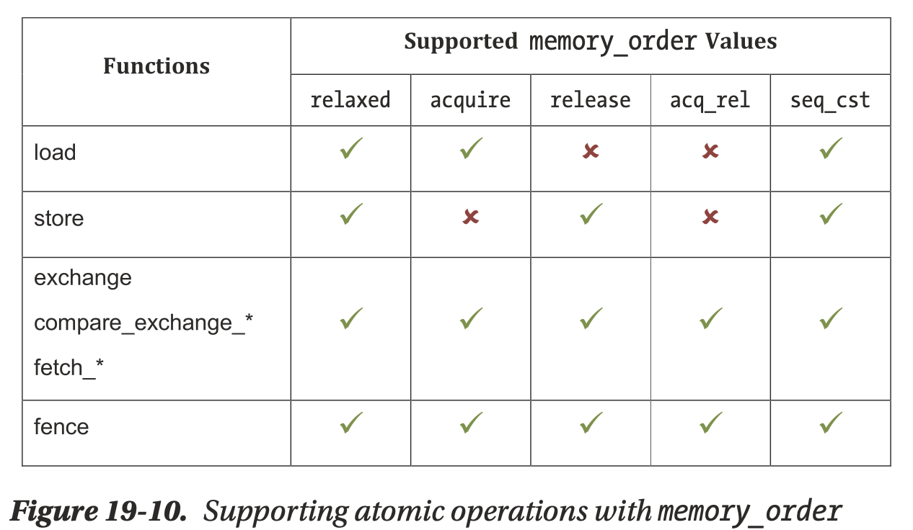
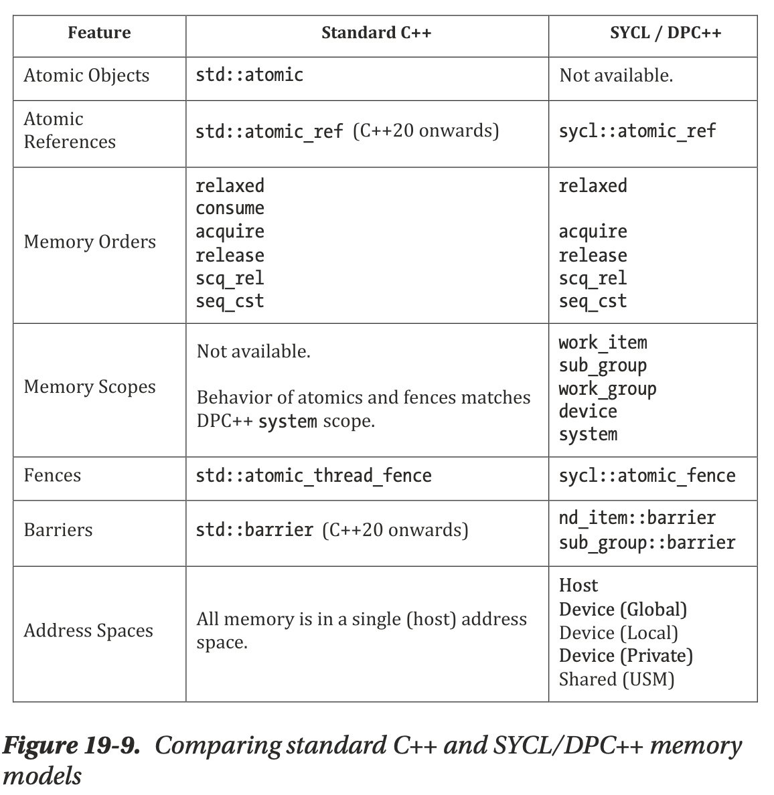

.. _sec-c++:

C++ support
=============

.. contents::
   :local:
   :depth: 4

This chapter supports some C++ compiler features. 

Exception handle
-------------------

The Chapter11_2 can be built and run with the C++ polymorphism example code of 
ch12_inherit.cpp as follows,

.. rubric:: lbdex/input/ch12_inherit.cpp
.. code-block:: c++

  ...
  class CPolygon { // _ZTVN10__cxxabiv117__class_type_infoE for parent class
    ...
  #ifdef COUT_TEST
   // generate IR nvoke, landing, resume and unreachable on iMac
      { cout << this->area() << endl; }
  #else
      { printf("%d\n", this->area()); }
  #endif
  };
  ...

If using cout instead of printf in ch12_inherit.cpp, it won't generate exception 
handler IRs on Linux, whereas it will generate invoke, landing, resume 
and unreachable exception handler IRs on iMac.
Example code, ch12_eh.cpp, which includes **try** and **catch** exception handler 
as the following will generate these exception handler IRs both on iMac and Linux.

.. rubric:: lbdex/input/ch12_eh.cpp
.. literalinclude:: ../lbdex/input/ch12_eh.cpp
    :start-after: /// start

.. code-block:: console

  JonathantekiiMac:input Jonathan$ clang -c ch12_eh.cpp -emit-llvm 
  -o ch12_eh.bc
  JonathantekiiMac:input Jonathan$ /Users/Jonathan/llvm/test/build/
  bin/llvm-dis ch12_eh.bc -o -
  
.. rubric:: ../lbdex/output/ch12_eh.ll
.. code-block:: llvm

  ...
  define dso_local i32 @_Z14test_try_catchv() #0 personality i8* bitcast (i32 (...
  )* @__gxx_personality_v0 to i8*) {
  entry:
    ...
    invoke void @_Z15throw_exceptionii(i32 signext 2, i32 signext 1)
          to label %invoke.cont unwind label %lpad

  invoke.cont:                                      ; preds = %entry
    br label %try.cont

  lpad:                                             ; preds = %entry
    %0 = landingpad { i8*, i32 }
            catch i8* null
    ...
  }
  ...

.. code:: console

  JonathantekiiMac:input Jonathan$ /Users/Jonathan/llvm/test/build/
  bin/llc -march=cpu0 -relocation-model=static -filetype=asm ch12_eh.bc -o -
	  .section .mdebug.abi32
	  .previous
	  .file	"ch12_eh.bc"
  llc: /Users/Jonathan/llvm/test/llvm/lib/CodeGen/LiveVariables.cpp:133: void llvm::
  LiveVariables::HandleVirtRegUse(unsigned int, llvm::MachineBasicBlock *, llvm
  ::MachineInstr *): Assertion `MRI->getVRegDef(reg) && "Register use before 
  def!"' failed.

A description for the C++ exception table formats can be found here 
[#itanium-exception]_.
About the IRs of LLVM exception handling, please reference here [#exception]_.
Chapter12_1 supports the llvm IRs of corresponding **try** and **catch** 
exception C++ keywords. It can compile ch12_eh.bc as follows,

.. rubric:: lbdex/chapters/Chapter12_1/Cpu0ISelLowering.h
.. literalinclude:: ../lbdex/Cpu0/Cpu0ISelLowering.h
    :start-after: #if CH >= CH12_1 //5
    :end-before: #endif

.. code-block:: console

  JonathantekiiMac:input Jonathan$ /Users/Jonathan/llvm/test/build/
  bin/llc -march=cpu0 -relocation-model=static -filetype=asm ch12_eh.bc -o -
  
.. rubric:: ../lbdex/output/ch12_eh.cpu0.s
.. code:: text

    .type  _Z14test_try_catchv,@function
    .ent  _Z14test_try_catchv             # @_Z14test_try_catchv
  _Z14test_try_catchv:
    ...
  $tmp0:
    addiu  $4, $zero, 2
    addiu  $5, $zero, 1
    jsub  _Z15throw_exceptionii
    nop
  $tmp1:
  # %bb.1:                                # %invoke.cont
    jmp  $BB1_4
  $BB1_2:                                 # %lpad
  $tmp2:
    st  $4, 16($fp)
    st  $5, 12($fp)
  # %bb.3:                                # %catch
    ld  $4, 16($fp)
    jsub  __cxa_begin_catch
    nop
    addiu  $2, $zero, 1
    st  $2, 20($fp)
    jsub  __cxa_end_catch
    nop
    jmp  $BB1_5
  $BB1_4:                                 # %try.cont
    addiu  $2, $zero, 0
    st  $2, 20($fp)
  $BB1_5:                                 # %return
    ld  $2, 20($fp)
    ...

Thread variable
-------------------

C++ support thread variable as the following file ch12_thread_var.cpp.

.. rubric:: lbdex/input/ch12_thread_var.cpp
.. literalinclude:: ../lbdex/input/ch12_thread_var.cpp
    :start-after: /// start

While global variable is a single instance shared by all threads in a process, 
thread variable has different instances for each different thread in a process. 
The same thread share the thread variable but different threads have their own 
thread variable with the same name [#thread-wiki]_.

To support thread variable, tlsgd, tlsldm, dtp_hi, dtp_lo, gottp, tp_hi and
tp_lo in both evaluateRelocExpr() of Cpu0AsmParser.cpp and printImpl() of
Cpu0MCExpr.cpp are needed, and the following code are required.
Most of them are for relocation record handle and display since the thread 
variable created by OS or language library which support multi-threads 
programming.

.. rubric:: lbdex/chapters/Chapter12_1/MCTargetDesc/Cpu0AsmBackend.cpp
.. literalinclude:: ../lbdex/Cpu0/MCTargetDesc/Cpu0AsmBackend.cpp
    :start-after: //@getFixupKindInfo {
    :end-before: { "fixup_Cpu0_32",             0,     32,   0 },
.. literalinclude:: ../lbdex/Cpu0/MCTargetDesc/Cpu0AsmBackend.cpp
    :start-after: #if CH >= CH12_1
    :end-before: #endif
	
.. code-block:: c++

      ...
    };
    ...
  }

.. rubric:: lbdex/chapters/Chapter12_1/MCTargetDesc/Cpu0BaseInfo.h
.. literalinclude:: ../lbdex/Cpu0/MCTargetDesc/Cpu0BaseInfo.h
    :start-after: //@Cpu0II
    :end-before: MO_NO_FLAG,
.. literalinclude:: ../lbdex/Cpu0/MCTargetDesc/Cpu0BaseInfo.h
    :start-after: #if CH >= CH12_1
    :end-before: #endif
	
.. code-block:: c++

      ...
    };
    ...
  }

.. rubric:: lbdex/chapters/Chapter12_1/MCTargetDesc/Cpu0ELFObjectWriter.cpp
.. literalinclude:: ../lbdex/Cpu0/MCTargetDesc/Cpu0ELFObjectWriter.cpp
    :start-after: //@GetRelocType {
    :end-before: default:
.. literalinclude:: ../lbdex/Cpu0/MCTargetDesc/Cpu0ELFObjectWriter.cpp
    :start-after: #if CH >= CH12_1
    :end-before: #endif
	
.. code-block:: c++

    ...
  }

.. rubric:: lbdex/chapters/Chapter12_1/MCTargetDesc/Cpu0FixupKinds.h
.. literalinclude:: ../lbdex/Cpu0/MCTargetDesc/Cpu0FixupKinds.h
    :start-after: //@Fixups {
    :end-before: //@ Pure upper 32 bit fixup resulting in - R_CPU0_32.
.. literalinclude:: ../lbdex/Cpu0/MCTargetDesc/Cpu0FixupKinds.h
    :start-after: #if CH >= CH12_1
    :end-before: #endif
	
.. code-block:: c++

      ...
    };

.. rubric:: lbdex/chapters/Chapter12_1/MCTargetDesc/Cpu0MCCodeEmitter.cpp
.. literalinclude:: ../lbdex/Cpu0/MCTargetDesc/Cpu0MCCodeEmitter.cpp
    :start-after: //@getExprOpValue {
    :end-before: //@getExprOpValue body {
.. literalinclude:: ../lbdex/Cpu0/MCTargetDesc/Cpu0MCCodeEmitter.cpp
    :start-after: #if CH >= CH12_1
    :end-before: #endif
	
.. code-block:: c++

    ...
  }

.. rubric:: lbdex/chapters/Chapter12_1/Cpu0InstrInfo.td
.. literalinclude:: ../lbdex/Cpu0/Cpu0InstrInfo.td
    :start-after: #if CH >= CH12_1 1
    :end-before: #endif
.. literalinclude:: ../lbdex/Cpu0/Cpu0InstrInfo.td
    :start-after: #if CH >= CH12_1 2
    :end-before: #endif
.. literalinclude:: ../lbdex/Cpu0/Cpu0InstrInfo.td
    :start-after: #if CH >= CH12_1 3
    :end-before: #endif
.. literalinclude:: ../lbdex/Cpu0/Cpu0InstrInfo.td
    :start-after: #if CH >= CH12_1 3.1
    :end-before: #endif
.. literalinclude:: ../lbdex/Cpu0/Cpu0InstrInfo.td
    :start-after: #if CH >= CH12_1 4
    :end-before: #endif

.. rubric:: lbdex/chapters/Chapter12_1/Cpu0SelLowering.cpp
.. literalinclude:: ../lbdex/Cpu0/Cpu0ISelLowering.cpp
    :start-after: //@Cpu0TargetLowering {
    :end-before: #if CH >= CH3_2
.. literalinclude:: ../lbdex/Cpu0/Cpu0ISelLowering.cpp
    :start-after: #if CH >= CH12_1 //1
    :end-before: #endif
	
.. code-block:: c++

    ...
  }
  
.. literalinclude:: ../lbdex/Cpu0/Cpu0ISelLowering.cpp
    :start-after: #if CH >= CH6_1 //3
    :end-before: #if CH >= CH8_1 //6
.. literalinclude:: ../lbdex/Cpu0/Cpu0ISelLowering.cpp
    :start-after: #if CH >= CH12_1 //3
    :end-before: #endif
	
.. code-block:: c++

      ...
    }
    ...
  }
  
.. literalinclude:: ../lbdex/Cpu0/Cpu0ISelLowering.cpp
    :start-after: #if CH >= CH12_1 //4
    :end-before: #endif

.. rubric:: lbdex/chapters/Chapter12_1/Cpu0ISelLowering.h
.. literalinclude:: ../lbdex/Cpu0/Cpu0ISelLowering.h
    :start-after: #if CH >= CH12_1 //1
    :end-before: #endif

.. rubric:: lbdex/chapters/Chapter12_1/Cpu0MCInstLower.cpp
.. literalinclude:: ../lbdex/Cpu0/Cpu0MCInstLower.cpp
    :start-after: //@LowerSymbolOperand {
    :end-before: default:
.. literalinclude:: ../lbdex/Cpu0/Cpu0MCInstLower.cpp
    :start-after: #if CH >= CH12_1
    :end-before: #endif
    
.. code-block:: c++

    ...
    }
    ...
  }

.. code-block:: console

  JonathantekiiMac:input Jonathan$ clang -target mips-unknown-linux-gnu -c 
  ch12_thread_var.cpp -emit-llvm -std=c++11 -o ch12_thread_var.bc
  JonathantekiiMac:input Jonathan$ /Users/Jonathan/llvm/test/build/
  bin/llvm-dis ch12_thread_var.bc -o -
  
.. rubric:: ../lbdex/output/ch12_thread_var.ll
.. code-block:: llvm

  ...
  @a = dso_local thread_local global i32 0, align 4
  @b = dso_local thread_local global i32 0, align 4

  ; Function Attrs: noinline nounwind optnone mustprogress
  define dso_local i32 @_Z15test_thread_varv() #0 {
  entry:
    store i32 2, i32* @a, align 4
    %0 = load i32, i32* @a, align 4
    ret i32 %0
  }

  ; Function Attrs: noinline nounwind optnone mustprogress
  define dso_local i32 @_Z17test_thread_var_2v() #0 {
  entry:
    store i32 3, i32* @b, align 4
    %0 = load i32, i32* @b, align 4
    ret i32 %0
  }
  ...

.. code-block:: console

  JonathantekiiMac:input Jonathan$ /Users/Jonathan/llvm/test/build/
  bin/llc -march=cpu0 -relocation-model=pic -filetype=asm ch12_thread_var.bc 
  -o ch12_thread_var.cpu0.pic.s
  JonathantekiiMac:input Jonathan$ cat ch12_thread_var.cpu0.pic.s
  
.. rubric:: ../lbdex/output/ch12_thread_var.cpu0.pic.s
.. code-block:: text

  ...
    .ent  _Z15test_thread_varv            # @_Z15test_thread_varv
  _Z15test_thread_varv:
    ...
    ori  $4, $gp, %tlsldm(a)
    ld  $t9, %call16(__tls_get_addr)($gp)
    jalr  $t9
    nop
    ld  $gp, 8($fp)
    lui  $3, %dtp_hi(a)
    addu  $2, $3, $2
    ori  $2, $2, %dtp_lo(a)
    ...

In pic mode, the __thread variable access by call function __tls_get_addr with 
the address of thread variable. 
The c++11 standard thread_local variable is accessed by calling function _ZTW1b 
which also call the function __tls_get_addr to get the thread_local variable 
address. 
In static mode, the thread variable is accessed by getting address of thread 
variables "a" and "b" with machine instructions as follows,

.. code-block:: console

  JonathantekiiMac:input Jonathan$ /Users/Jonathan/llvm/test/build/
  bin/llc -march=cpu0 -relocation-model=static -filetype=asm 
  ch12_thread_var.bc -o ch12_thread_var.cpu0.static.s
  JonathantekiiMac:input Jonathan$ cat ch12_thread_var.cpu0.static.s
  
.. rubric:: ../lbdex/output/ch12_thread_var.cpu0.static.s
.. code-block:: text

    ...
    lui  $2, %tp_hi(a)
    ori  $2, $2, %tp_lo(a)
    ...
    lui  $2, %tp_hi(b)
    ori  $2, $2, %tp_lo(b)
    ...

While Mips uses rdhwr instruction to access thread varaible as below, 
Cpu0 access thread varaible without inventing any new instruction. 
The thread variables are keeped in thread varaible memory location which 
accessed through \%tp_hi and \%tp_lo, and furthermore, this section of memory is 
protected through kernel mode program. 
Thus, the user mode program cannot access this area of memory and 
no space to breathe for hack program.

.. code-block:: console

  JonathantekiiMac:input Jonathan$ /Users/Jonathan/llvm/test/build/
  bin/llc -march=mips -relocation-model=static -filetype=asm 
  ch12_thread_var.bc -o -
    ...
    lui $1, %tprel_hi(a)
    ori $1, $1, %tprel_lo(a)
    .set  push
    .set  mips32r2
    rdhwr $3, $29
    .set  pop
    addu  $1, $3, $1
    addiu $2, $zero, 2
    sw  $2, 0($1)
    addiu $2, $zero, 2
    ...

In static mode, the thread variable is similar to global variable. 
In general, they are same in IRs, DAGs and machine code translation. 
List them in the following tables. 
You can check them with debug option enabled.

.. table:: The DAGs of thread varaible of static mode

  ==========================  ===========================
  stage                       DAG
  ==========================  ===========================
  IR                          load i32* @a, align 4;
  Legalized selection DAG     (add Cpu0ISD::Hi Cpu0ISD::Lo);
  Instruction Selection       ori $2, $zero, %tp_lo(a);
  -                           lui $3, %tp_hi(a);
  -                           addu  $3, $3, $2;
  ==========================  ===========================

.. table:: The DAGs of local_thread varaible of static mode

  ==========================  ===========================
  stage                       DAG
  ==========================  ===========================
  IR                          ret i32* @b;
  Legalized selection DAG     %0=(add Cpu0ISD::Hi Cpu0ISD::Lo);...
  Instruction Selection       ori $2, $zero, %tp_lo(a);
  -                           lui $3, %tp_hi(a);
  -                           addu  $3, $3, $2;
  ==========================  ===========================

Atomic
--------

- Reason

  - Compiler and CPU reorder the memory access instructions (load and store) to 
    accelerate. CPU has instructions for sequtential access (not reorder). 
    C/C++ provide memory ordering to tell compiler not to reorder..

  - If using asm instructions in C/C++ only, it
    cannot provide a common structure for all backend compiler since reorder may 
    happens in any pass. 

In tradition, C uses different API which provided by OS or library to support
multi-thread programming. For example, posix thread API on unix/linux, MS
windows API, ..., etc. In order to achieve synchronization to solve race
condition between threads, OS provide their own lock or semaphore functions to 
programmer. But this solution is OS dependent. 
After c++11, programmer can use atomic to program and run the code 
on every different platform since the thread and atomic are part of c++ standard.
Beside of portability, the other important benifit is the compiler can generate
high performance code by the target hardware instructions rather than couting on
lock() function only [#atomic-wiki]_ [#atomic-stackoverflow]_ 
[#atomic-herbsutter]_.

Compare-and-swap operation [#cas-wiki]_ is used to implement synchronization 
primitives like semaphores and mutexes, as well as more sophisticated 
wait-free and lock-free [#lf-wiki]_ algorithms. 
For atomic variables, Mips lock instructions, ll and sc, to solve the race 
condition problem. The semantic as follows,

- Load-link returns the current value of a memory location, while a subsequent 
  store-conditional to the same memory location will store a new value only if 
  no updates have occurred to that location since the load-link. 
  If any updates have occurred, the store-conditional is guaranteed to fail, 
  even if the value read by the load-link has since been restored. [#ll-wiki]_ 

Mips sync and ARM/X86-64 memory-barrier instruction [#mb-wiki]_ provide 
synchronization mechanism very efficiently in some scenarios.

Mips sync [#mips-sync]_ is explained simply as follows,

A Simple Description:
SYNC affects only uncached and cached coherent loads and stores. The loads and
stores that occur prior to the SYNC must be completed before the loads and 
stores after the SYNC are allowed to start.
Loads are completed when the destination register is written. Stores are completed
when the stored value is visible to every other processor in the system.

In order to support atomic in C++ and java, llvm provides the atomic IRs and 
memory ordering here [#atomics-llvm]_ [#llvmlang-ordering]_. C++ memory order
is explained and exampled here [#cpp-mem-order]_. The chapter 19 
of book DPC++ [#dpcpp-memorder]_ explains the memory ordering better and I add 
the related code fragment of lbdex/input/atomics.ll to it for explanation as 
follows,

- memory_order::relaxed

Read and write operations can be re-ordered before or after the operation with 
no restrictions. There are no ordering guarantees.

.. code-block:: console
  
  define i8 @load_i8_unordered(i8* %mem) {
  ; CHECK-LABEL: load_i8_unordered
  ; CHECK: ll
  ; CHECK: sc
  ; CHECK-NOT: sync
    %val = load atomic i8, i8* %mem unordered, align 1
    ret i8 %val
  }

No **sync** from CodeGen instructions above.

- memory_order::acquire

Read and write operations appearing after the operation in the program must 
occur after it (i.e., they cannot be re-ordered before the operation).

.. code-block:: console

  define i32 @load_i32_acquire(i32* %mem) {
  ; CHECK-LABEL: load_i32_acquire
  ; CHECK: ll
  ; CHECK: sc
    %val = load atomic i32, i32* %mem acquire, align 4
  ; CHECK: sync
    ret i32 %val
  }

Sync guarantees "load atomic" complete before the next R/W (Read/Write). All 
writes in other threads that release the same atomic variable are visible in the 
current thread.

- memory_order::release

Read and write operations appearing before the operation in the program must 
occur before it (i.e., they cannot be re-ordered after the operation), and 
preceding write operations are guaranteed to be visible to other program 
instances which have been synchronized by a corresponding acquire operation 
(i.e., an atomic operation using the same variable and memory_order::acquire 
or a barrier function).

.. code-block:: console

  define void @store_i32_release(i32* %mem) {
  ; CHECK-LABEL: store_i32_release
  ; CHECK: sync
  ; CHECK: ll
  ; CHECK: sc
    store atomic i32 42, i32* %mem release, align 4
    ret void
  }

Sync guarantees preceding R/W complete before "store atomic". Mips' ll and sc 
guarantee that "store atomic release" is visible to other processors.

- memory_order::acq_rel

The operation acts as both an acquire and a release. Read and write operations 
cannot be re-ordered around the operation, and preceding writes must be made 
visible as previously described for memory_order::release.

.. code-block:: console

  define i32 @cas_strong_i32_acqrel_acquire(i32* %mem) {
  ; CHECK-LABEL: cas_strong_i32_acqrel_acquire
  ; CHECK: ll
  ; CHECK: sc
    %val = cmpxchg i32* %mem, i32 0, i32 1 acq_rel acquire
  ; CHECK: sync
    %loaded = extractvalue { i32, i1} %val, 0
    ret i32 %loaded
  }

Sync guarantees preceding R/W complete before "cmpxchg". Other processors' 
preceding write operations are guaranteed to be visible to this 
"cmpxchg acquire" (Mips's ll and sc quarantee it).

- memory_order::seq_cst

The operation acts as an acquire, release, or both depending on whether it is 
a read, write, or read-modify-write operation, respectively. All operations 
with this memory order are observed in a sequentially consistent order.

.. code-block:: console

  define i8 @cas_strong_i8_sc_sc(i8* %mem) {
  ; CHECK-LABEL: cas_strong_i8_sc_sc
  ; CHECK: sync
  ; CHECK: ll
  ; CHECK: sc
    %val = cmpxchg i8* %mem, i8 0, i8 1 seq_cst seq_cst
  ; CHECK: sync
    %loaded = extractvalue { i8, i1} %val, 0
    ret i8 %loaded
  }

First sync guarantees preceding R/W complete before "cmpxchg seq_cst" and 
visible to "cmpxchg seq_cst". For seq_cst, a store performs a release operation.
Which means "cmpxchg seq_cst" are visible to other threads/processors that 
acquire the same atomic variable as the memory_order_release definition. 
Mips' ll and sc quarantees this feature of "cmpxchg seq_cst". 
Second Sync guarantees "cmpxchg seq_cst" complete before the next R/W.

There are several restrictions on which memory orders are supported by each 
operation. :numref:`c++-f1` (from book Figure 19-10) summarizes which 
combinations are valid.

.. _c++-f1:

  Supporting atomic operations with memory_order

Load operations do not write values to memory and are therefore incompatible 
with release semantics. Similarly, store operations do not read values from 
memory and are therefore incompatible with acquire semantics. The remaining 
read-modify-write atomic operations and fences are compatible with all memory 
orderings [#dpcpp-memorder]_.

.. note:: **C++ memory_order_consume**

.. _c++-f2:

  Comparing standard C++ and SYCL/DPC++ memory models

The C++ memory model additionally includes memory_order::consume, with similar 
behavior to memory_order::acquire. however, the C++17 standard discourages its 
use, noting that its definition is being revised. its inclusion in dpC++ has 
therefore been postponed to a future version.

For a few years now, compilers have treated consume as a synonym for acquire
[#cpp-memorder-consume-as-acquire]_.

The current expectation is that the replacement facility will rely on core 
memory model and atomics definitions very similar to what's currently there. 
Since memory_order_consume does have a profound impact on the memory model, 
removing this text would allow drastic simplification, but conversely would 
make it very difficult to add anything along the lines of memory_order_consume 
back in later, especially if the standard evolves in the meantime, as expected. 
Thus we are not proposing to remove the current wording 
[#cpp-memorder-consume-remove]_.

The following test files are extracted from memory_checks() of 
clang/test/Sema/atomic-ops.c. The "__c11_atomic_xxx" builtin-functions from 
clang defined in clang/include/clang/Basic/Builtins.def. Complie with clang
will get the results same with :numref:`c++-f1`. Clang compile 
memory_order_consume to the same result of memory_order_acquire. 

.. rubric:: lbdex/input/ch12_sema_atomic-ops.c
.. literalinclude:: ../lbdex/input/ch12_sema_atomic-ops.c

.. rubric:: lbdex/input/ch12_sema_atomic-fetch.c
.. literalinclude:: ../lbdex/input/ch12_sema_atomic-fetch.c

.. table:: Atomic related between clang's builtin and llvm ir

  ================================  ===========
  clang's builtin                   llvm ir
  ================================  ===========
  __c11_atomic_load                 load atomic
  __c11_atomic_store                store atomic
  __c11_atomic_exchange_xxx         cmpxchg
  atomic_thread_fence               fence
  __c11_atomic_fetch_xxx            atomicrmw xxx
  ================================  ===========

C++ atomic functions supported by calling implemented functions from C++ libary.
These implemented functions evently call "__c11_atomic_xxx" builtin-functions 
for implementation. So, 
"__c11_atomic_xxx" listed in above providing lower-level of better performance 
functions for C++ programmers. An example as follows,

.. rubric:: lbdex/input/ch12_c++_atomics.cpp
.. literalinclude:: ../lbdex/input/ch12_c++_atomics.cpp

For supporting llvm atomic IRs, the following code added to Chapter12_1.

.. rubric:: lbdex/chapters/Chapter12_1/Disassembler/Cpu0Disassembler.cpp
.. literalinclude:: ../lbdex/Cpu0/Disassembler/Cpu0Disassembler.cpp
    :start-after: //@DecodeMem {
    :end-before: //@DecodeMem body {
.. literalinclude:: ../lbdex/Cpu0/Disassembler/Cpu0Disassembler.cpp
    :start-after: #if CH >= CH12_1 //1
    :end-before: #endif

.. code-block:: c++

    ...
  }

.. rubric:: lbdex/chapters/Chapter12_1/Cpu0InstrInfo.td
.. literalinclude:: ../lbdex/Cpu0/Cpu0InstrInfo.td
    :start-after: #if CH >= CH12_1 5
    :end-before: #endif
.. literalinclude:: ../lbdex/Cpu0/Cpu0InstrInfo.td
    :start-after: #if CH >= CH12_1 6
    :end-before: #endif
.. literalinclude:: ../lbdex/Cpu0/Cpu0InstrInfo.td
    :start-after: #if CH >= CH12_1 7
    :end-before: #endif
.. literalinclude:: ../lbdex/Cpu0/Cpu0InstrInfo.td
    :start-after: #if CH >= CH12_1 8
    :end-before: #endif
.. literalinclude:: ../lbdex/Cpu0/Cpu0InstrInfo.td
    :start-after: #if CH >= CH12_1 9
    :end-before: #endif
.. literalinclude:: ../lbdex/Cpu0/Cpu0InstrInfo.td
    :start-after: #if CH >= CH12_1 10
    :end-before: #endif
.. literalinclude:: ../lbdex/Cpu0/Cpu0InstrInfo.td
    :start-after: #if CH >= CH12_1 11
    :end-before: #endif
.. literalinclude:: ../lbdex/Cpu0/Cpu0InstrInfo.td
    :start-after: #if CH >= CH12_1 12
    :end-before: #endif
.. literalinclude:: ../lbdex/Cpu0/Cpu0InstrInfo.td
    :start-after: #if CH >= CH12_1 13
    :end-before: #endif

.. rubric:: lbdex/chapters/Chapter12_1/Cpu0ISelLowering.h
.. literalinclude:: ../lbdex/Cpu0/Cpu0ISelLowering.h
    :start-after: #if CH >= CH12_1 //2
    :end-before: #endif
.. literalinclude:: ../lbdex/Cpu0/Cpu0ISelLowering.h
    :start-after: #if CH >= CH12_1 //3
    :end-before: #endif
.. literalinclude:: ../lbdex/Cpu0/Cpu0ISelLowering.h
    :start-after: #if CH >= CH12_1 //4
    :end-before: #endif

.. rubric:: lbdex/chapters/Chapter12_1/Cpu0SelLowering.cpp
.. literalinclude:: ../lbdex/Cpu0/Cpu0ISelLowering.cpp
    :start-after: //@3_1 1 {
    :end-before: switch (Opcode) {
.. literalinclude:: ../lbdex/Cpu0/Cpu0ISelLowering.cpp
    :start-after: #if CH >= CH12_1 //0.5
    :end-before: #endif //#if CH >= CH12_1 //0.5

.. code-block:: c++

    ...
  }

.. literalinclude:: ../lbdex/Cpu0/Cpu0ISelLowering.cpp
    :start-after: //@Cpu0TargetLowering {
    :end-before: #if CH >= CH3_2
.. literalinclude:: ../lbdex/Cpu0/Cpu0ISelLowering.cpp
    :start-after: #if CH >= CH12_1 //1.5
    :end-before: #endif

.. literalinclude:: ../lbdex/Cpu0/Cpu0ISelLowering.cpp
    :start-after: #if CH >= CH6_1 //3
    :end-before: #if CH >= CH8_1 //6
.. literalinclude:: ../lbdex/Cpu0/Cpu0ISelLowering.cpp
    :start-after: #if CH >= CH12_1 //7
    :end-before: #endif //#if CH >= CH12_1 //7

.. code-block:: c++

    ...
  }

.. literalinclude:: ../lbdex/Cpu0/Cpu0ISelLowering.cpp
    :start-after: #if CH >= CH12_1 //8
    :end-before: #endif

.. literalinclude:: ../lbdex/Cpu0/Cpu0ISelLowering.cpp
    :start-after: #if CH >= CH12_1 //9
    :end-before: #endif

.. rubric:: lbdex/chapters/Chapter12_1/Cpu0RegisterInfo.h
.. literalinclude:: ../lbdex/Cpu0/Cpu0RegisterInfo.h
    :start-after: #if CH >= CH12_1 //1
    :end-before: #endif

.. rubric:: lbdex/chapters/Chapter12_1/Cpu0RegisterInfo.cpp
.. literalinclude:: ../lbdex/Cpu0/Cpu0RegisterInfo.cpp
    :start-after: #if CH >= CH12_1 //1
    :end-before: #endif

.. rubric:: lbdex/chapters/Chapter12_1/Cpu0SEISelLowering.cpp
.. literalinclude:: ../lbdex/Cpu0/Cpu0SEISelLowering.cpp
    :start-after: //@Cpu0SETargetLowering {
    :end-before: //@Cpu0SETargetLowering body {
.. literalinclude:: ../lbdex/Cpu0/Cpu0SEISelLowering.cpp
    :start-after: #if CH >= CH12_1 //1
    :end-before: #endif

.. code-block:: c++

    ...
  }

.. rubric:: lbdex/chapters/Chapter12_1/Cpu0TargetMachine.cpp
.. literalinclude:: ../lbdex/Cpu0/Cpu0TargetMachine.cpp
    :start-after: //@Cpu0PassConfig {
    :end-before: public:
.. literalinclude:: ../lbdex/Cpu0/Cpu0TargetMachine.cpp
    :start-after: #if CH >= CH12_1 //1
    :end-before: #endif

.. code-block:: c++

    ...
  };

.. literalinclude:: ../lbdex/Cpu0/Cpu0TargetMachine.cpp
    :start-after: #if CH >= CH12_1 //2
    :end-before: #endif

Since SC instruction uses RegisterOperand type in Cpu0InstrInfo.td and SC uses
FMem node which DecoderMethod is "DecodeMem", the DecodeMem() of 
Cpu0Disassembler.cpp need to be changed as above.

The atomic node defined in "let usesCustomInserter = 1 in" of Cpu0InstrInfo.td
tells llvm calling EmitInstrWithCustomInserter() of Cpu0ISelLowering.cpp after 
Instruction Selection stage at Cpu0TargetLowering::EmitInstrWithCustomInserter() 
of ExpandISelPseudos::runOnMachineFunction() stage. For
example, "def ATOMIC_LOAD_ADD_I8 : Atomic2Ops<atomic_load_add_8, CPURegs>;" will
calling EmitInstrWithCustomInserter() with Machine Instruction Opcode 
"ATOMIC_LOAD_ADD_I8" when it meets IR "load atomic i8*".

The "setInsertFencesForAtomic(true);" in Cpu0ISelLowering.cpp will trigger 
addIRPasses() of Cpu0TargetMachine.cpp, then the createAtomicExpandPass() of 
addIRPasses() will create llvm IR ATOMIC_FENCE. Next, the lowerATOMIC_FENCE()
of Cpu0ISelLowering.cpp will create Cpu0ISD::Sync when it meets IR ATOMIC_FENCE
since "setOperationAction(ISD::ATOMIC_FENCE, MVT::Other, Custom);" of 
Cpu0SEISelLowering.cpp. Finally the pattern defined in Cpu0InstrInfo.td translate
it into instruction "sync" by "def SYNC" and alias "SYNC 0".

This part of Cpu0 backend code is same with Mips except Cpu0 has no instruction 
"nor".

List the atomic IRs, corresponding DAGs and Opcode as the following table.

.. table:: The atomic related IRs, their corresponding DAGs and Opcode of Cpu0ISelLowering.cpp

  ==========================  ===========================  ===========================
  IR                          DAG                          Opcode
  ==========================  ===========================  ===========================
  load atomic                 AtomicLoad                   ATOMIC_CMP_SWAP_XXX
  store atomic                AtomicStore                  ATOMIC_SWAP_XXX
  atomicrmw add               AtomicLoadAdd                ATOMIC_LOAD_ADD_XXX
  atomicrmw sub               AtomicLoadSub                ATOMIC_LOAD_SUB_XXX
  atomicrmw xor               AtomicLoadXor                ATOMIC_LOAD_XOR_XXX
  atomicrmw and               AtomicLoadAnd                ATOMIC_LOAD_AND_XXX
  atomicrmw nand              AtomicLoadNand               ATOMIC_LOAD_NAND_XXX
  atomicrmw or                AtomicLoadOr                 ATOMIC_LOAD_OR_XXX
  cmpxchg                     AtomicCmpSwapWithSuccess     ATOMIC_CMP_SWAP_XXX
  atomicrmw xchg              AtomicLoadSwap               ATOMIC_SWAP_XXX
  ==========================  ===========================  ===========================

Input files atomics.ll and atomics-fences.ll include the llvm atomic IRs test.
Input files ch12_atomics.cpp and ch12_atomics-fences.cpp are the C++  
files for generating llvm atomic IRs. The C++ files need to run with clang 
options "clang++ -pthread -std=c++11".

.. [#exception] http://llvm.org/docs/ExceptionHandling.html

.. [#itanium-exception] http://itanium-cxx-abi.github.io/cxx-abi/exceptions.pdf

.. [#thread-wiki] http://en.wikipedia.org/wiki/Thread-local_storage

.. [#cpp-atomic] https://cplusplus.com/reference/atomic/

.. [#atomic-wiki] https://en.wikipedia.org/wiki/Memory_model_%28programming%29

.. [#atomic-stackoverflow] http://stackoverflow.com/questions/6319146/c11-introduced-a-standardized-memory-model-what-does-it-mean-and-how-is-it-g

.. [#atomic-herbsutter] http://herbsutter.com/2013/02/11/atomic-weapons-the-c-memory-model-and-modern-hardware/

.. [#lf-wiki] An algorithm is wait-free if every operation has a bound on the 
   number of steps the algorithm will take before the operation completes. In 
   other words, wait-free algorithm has no starvation. Lock-freedom allows 
   individual threads to starve but guarantees system-wide throughput. An 
   algorithm is lock-free if, when the program threads are run for a 
   sufficiently long time, at least one of the threads makes progress (for 
   some sensible definition of progress). All wait-free algorithms are lock-free. 
   In particular, if one thread is suspended, then a lock-free algorithm guarantees 
   that the remaining threads can still make progress. Hence, if two threads can 
   contend for the same mutex lock or spinlock, then the algorithm is not lock-free. 
   (If we suspend one thread that holds the lock, then the second thread will block.) 
   https://en.wikipedia.org/wiki/Non-blocking_algorithm

.. [#cas-wiki] https://en.wikipedia.org/wiki/Compare-and-swap

.. [#ll-wiki] https://en.wikipedia.org/wiki/Load-link/store-conditional

.. [#mb-wiki] https://en.wikipedia.org/wiki/Memory_barrier

.. [#mips-sync] From page A-158, it is same with ARM's barrier that all instructions before SYNC are completed before issuing the instructions after SYNC. Page 167 (A-155) of https://www.cs.cmu.edu/afs/cs/academic/class/15740-f97/public/doc/mips-isa.pdf

.. [#atomics-llvm] http://llvm.org/docs/Atomics.html

.. [#llvmlang-ordering] http://llvm.org/docs/LangRef.html#ordering

.. [#cpp-mem-order] https://en.cppreference.com/w/cpp/atomic/memory_order

.. [#dpcpp-memorder] Section "The memory_order Enumeration Class" which include figure 19-10 of book https://link.springer.com/book/10.1007/978-1-4842-5574-2

.. [#cpp-memorder-consume-as-acquire] https://stackoverflow.com/questions/65336409/what-does-memory-order-consume-really-do

.. [#cpp-memorder-consume-remove] https://www.open-std.org/jtc1/sc22/wg21/docs/papers/2016/p0371r1.html
