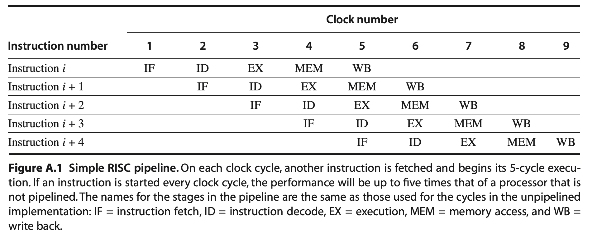
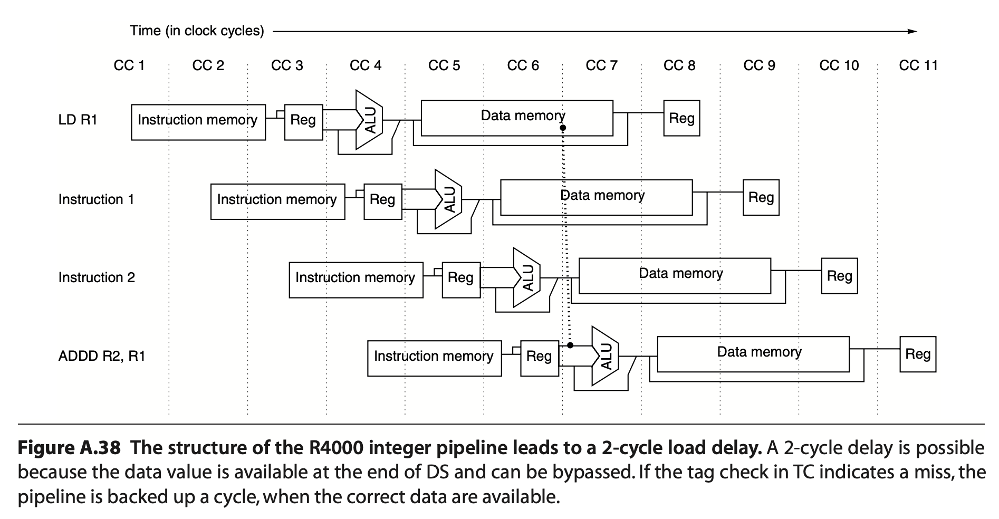
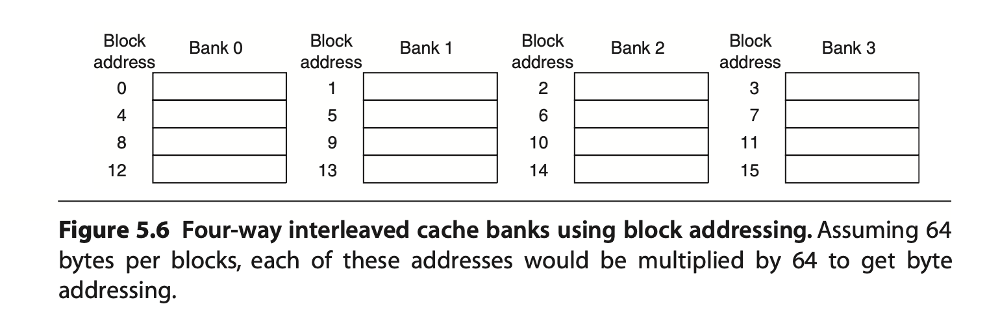

.. _sec-controlflow:

Control flow statements
=======================

.. contents::
   :local:
   :depth: 4

This chapter illustrates the corresponding IR for control flow statements, such
as **“if-else”**, **“while”**, and **“for”** loop statements in C. It also
explains how to translate these LLVM IR control flow statements into Cpu0
instructions in *Section I*.

In 
:ref:`section Cpu0 Backend Optimization: Remove Useless JMP <remove-useless-jmp>`, 
a control flow optimization pass for the
backend is introduced. It serves as a simple tutorial program to help readers
understand how to add and implement a backend optimization pass.

:ref:`Section Conditional Instruction <conditional-instruction>` includes 
handling for conditional
instructions, since Clang generates specific IR instructions, `select` and
`select_cc`, to support control flow optimizations in the backend.

Pipeline architecture
---------------------

The following figures are from the book *Computer Architecture: A Quantitative
Approach, Fourth Edition*.

.. _ctrl_pipeline:

  5 stages of pipeline

- **IF**: Instruction Fetch cycle  
- **ID**: Instruction Decode/Register Fetch cycle  
- **EX**: Execution/Effective Address cycle  
- **MEM**: Memory Access cycle  
- **WB**: Write-Back cycle

.. _ctrl-super_pipeline:

  Super pipeline

Multibanked caches (see :numref:`ctrlflow-cache_banks`) are used to increase
cache bandwidth.

.. _ctrlflow-cache_banks:

  Interleaved cache banks

The block size in L1 cache is usually between 16 and 256 bytes. Equipped with
multibanked caches, a system can support super-pipelined
(:numref:`ctrl-super_pipeline`) and superscalar (multi-issue pipeline)
architectures, allowing the fetch of
`(4 * block_size / instruction_size)` instructions per cycle.

Control flow statement
-----------------------

Running `ch8_1_1.cpp` with Clang will produce the following result:

.. rubric:: lbdex/input/ch8_1_1.cpp
.. literalinclude:: ../lbdex/input/ch8_1_1.cpp
    :start-after: /// start

.. code-block:: llvm

    ...
    %0 = load i32* %a, align 4
    %cmp = icmp eq i32 %0, 0
    br i1 %cmp, label %if.then, label %if.end

  ; <label>:3:                                      ; preds = %0
    %1 = load i32* %a, align 4
    %inc = add i32 %1, 1
    store i32 %inc, i32* %a, align 4
    br label %if.end
    ...

The **“icmp ne”** stands for *integer compare NotEqual*, **“slt”** stands for
*Set Less Than*, and **“sle”** stands for *Set Less or Equal*.

Run version `Chapter8_1/` with the ``llc -view-isel-dags`` or ``-debug`` option.
You will see that the **if** statement is translated into the form:

::

  br (brcond (%1, setcc(%2, Constant<c>, setne)), BasicBlock_02), BasicBlock_01

If we ignore `%1`, it simplifies to:

::

  br (brcond (setcc(%2, Constant<c>, setne)), BasicBlock_02), BasicBlock_01

For explanation, the corresponding IR DAG is listed as follows:

.. code-block:: console
  
  Optimized legalized selection DAG: BB#0 '_Z11test_ifctrlv:entry'
    SelectionDAG has 12 nodes:
      ...
      t5: i32,ch = load<Volatile LD4[%a]> t4, FrameIndex:i32<0>, undef:i32
          t16: i32 = setcc t5, Constant:i32<0>, setne:ch
        t11: ch = brcond t5:1, t16, BasicBlock:ch<if.end 0x10305a338>
      t13: ch = br t11, BasicBlock:ch<if.then 0x10305a288>
    
We want to translate them into Cpu0 instruction DAGs as follows:

.. code-block:: console

    addiu %3, ZERO, Constant<c>
    cmp %2, %3
    jne BasicBlock_02
    jmp BasicBlock_01

For the last IR `br`, we translate the unconditional branch 
(`br BasicBlock_01`) into `jmp BasicBlock_01` using the following pattern
definition:

.. rubric:: lbdex/chapters/Chapter8_1/Cpu0InstrInfo.td
.. literalinclude:: ../lbdex/Cpu0/Cpu0InstrInfo.td
    :start-after: //#if CH >= CH8_1 3
    :end-before: //#endif

.. code-block:: console

    ...
    def JMP     : UncondBranch<0x26, "jmp">;

The pattern ``[(br bb:$imm24)]`` in class `UncondBranch` is translated into the
`jmp` machine instruction.

The translation for the pair of Cpu0 instructions, **cmp** and **jne**, has not
been handled prior to this chapter.

To support this chained IR-to-machine-instruction translation, we define the
following pattern:

.. rubric:: lbdex/chapters/Chapter8_1/Cpu0InstrInfo.td
.. code:: c++

  // brcond patterns
  multiclass BrcondPatsCmp<RegisterClass RC, Instruction JEQOp, Instruction JNEOp, 
    Instruction JLTOp, Instruction JGTOp, Instruction JLEOp, Instruction JGEOp, 
    Instruction CMPOp> {
  ...
  def : Pat<(brcond (i32 (setne RC:$lhs, RC:$rhs)), bb:$dst),
            (JNEOp (CMPOp RC:$lhs, RC:$rhs), bb:$dst)>;
  ...
  def : Pat<(brcond RC:$cond, bb:$dst),
            (JNEOp (CMPOp RC:$cond, ZEROReg), bb:$dst)>;
  ...
  }

Since the above `BrcondPats` pattern uses RC (Register Class) as an operand,
the following `ADDiu` pattern defined in Chapter 2 will generate the
instruction **addiu** before the **cmp** instruction for the first IR,
**setcc(%2, Constant<c>, setne)**, as shown above.

.. rubric:: lbdex/chapters/Chapter2/Cpu0InstrInfo.td
.. literalinclude:: ../lbdex/Cpu0/Cpu0InstrInfo.td
    :start-after: //#if CH >= CH2 17
    :end-before: //#endif

The definition of `BrcondPats` supports `setne`, `seteq`, `setlt`, and other
register operand compares, as well as `setult`, `setugt`, and others for
unsigned integer types.

In addition to `seteq` and `setne`, we define `setueq` and `setune` by referring
to MIPS code, although we have not found how to generate `setune` IR from C
language.

We have tried to define unsigned int types, but Clang still generates `setne`
instead of `setune`.

The order of pattern search follows their order of appearance in the context.

The last pattern

::

  (brcond RC:$cond, bb:$dst)

means branch to `$dst` if `$cond != 0`. Therefore, we set the corresponding
translation to:

::

  (JNEOp (CMPOp RC:$cond, ZEROReg), bb:$dst)

The `CMP` instruction sets the result to register `SW`, and then `JNE` checks
the condition based on the `SW` status as shown in :numref:`ctrlflow-f1`.

Since `SW` belongs to a different register class, the translation remains
correct even if an instruction is inserted between `CMP` and `JNE`, as follows:

.. _ctrlflow-f1:
.. figure:: ../Fig/ctrlflow/1.png
  :width: 446 px
  :height: 465 px
  :scale: 50 %
  :align: center

  JNE (CMP $r2, $r3),

.. code-block:: console

    cmp %2, %3
    addiu $r1, $r2, 3   // $r1 register never be allocated to $SW because in 
                        //  class ArithLogicI, GPROut is the output register 
                        //  class and the GPROut is defined without $SW in 
                        //  Cpu0RegisterInforGPROutForOther.td
    jne BasicBlock_02

The reserved registers are set by the following function code that we defined
previously:

.. rubric:: lbdex/chapters/Chapter3_1/Cpu0RegisterInfo.cpp
.. literalinclude:: ../lbdex/chapters/Chapter3_1/Cpu0RegisterInfo.cpp
    :start-after: //@getReservedRegs {
    :end-before: //@eliminateFrameIndex {

Although the following definition in `Cpu0RegisterInfo.td` has no real effect
on reserved registers, it is better to comment the reserved registers in it
for readability.

Setting `SW` in both register classes `CPURegs` and `SR` allows access to `SW`
by RISC instructions like ``andi``, and also lets programmers use traditional
assembly instructions like ``cmp``.

The `copyPhysReg()` function is called when both `DestReg` and `SrcReg` belong
to different register classes.

.. rubric:: lbdex/chapters/Chapter2/Cpu0RegisterInfo.td
.. literalinclude:: ../lbdex/Cpu0/Cpu0RegisterInfo.td
    :start-after: //@Register Classes
    :end-before: //#if CH >= CH4_1 2
.. literalinclude:: ../lbdex/Cpu0/Cpu0RegisterInfo.td
    :start-after: //@Status Registers class
    :end-before: //@Co-processor 0 Registers class
  

.. rubric:: lbdex/chapters/Chapter2/Cpu0RegisterInfoGPROutForOther.td
.. literalinclude:: ../lbdex/Cpu0/Cpu0RegisterInfoGPROutForOther.td

Chapter8_1/ includes support for control flow statements.
Run it along with the following ``llc`` option to generate the object file.
Dump its content using `gobjdump` or `hexdump` as shown below:

.. code-block:: console

    118-165-79-206:input Jonathan$ /Users/Jonathan/llvm/test/
    build/bin/llc -march=cpu0 -mcpu=cpu032I -relocation-model=pic 
    -filetype=asm ch8_1_1.bc -o -
    ...
    ld  $4, 36($fp)
    cmp $sw, $4, $3
    jne $BB0_2
    jmp $BB0_1
  $BB0_1:                                 # %if.then
    ld  $4, 36($fp)
    addiu $4, $4, 1
    st  $4, 36($fp)
  $BB0_2:                                 # %if.end
    ld  $4, 32($fp)
    ...

.. code-block:: console
    
    118-165-79-206:input Jonathan$ /Users/Jonathan/llvm/test/
    build/bin/llc -march=cpu0 -mcpu=cpu032I -relocation-model=pic 
    -filetype=obj ch8_1_1.bc -o ch8_1_1.cpu0.o

    118-165-79-206:input Jonathan$ hexdump ch8_1_1.cpu0.o 
        // jmp offset is 0x10=16 bytes which is correct
    0000080 ...................................... 10 43 00 00
    0000090 31 00 00 10 36 00 00 00 ..........................

The immediate value of `jne` (opcode 0x31) is 16. The offset between `jne` and 
`$BB0_2` is 20 bytes (5 words = 5 * 4 bytes). Suppose the address of `jne` is X, 
then the label `$BB0_2` is located at X + 20.

Cpu0's instruction set is designed as a RISC CPU with a 5-stage pipeline, 
similar to the MIPS architecture. Cpu0 executes branch instructions at the 
decode stage, just like MIPS.

After the `jne` instruction is fetched, the Program Counter (PC) is updated to 
X + 4, since Cpu0 updates the PC during the fetch stage. The address of `$BB0_2` 
is equal to PC + 16, because the `jne` instruction executes at the decode stage.

This can be listed and explained again as follows:

.. code-block:: console

                // Fetch instruction stage for jne instruction. The fetch stage 
                // can be divided into 2 cycles. First cycle fetch the 
                // instruction. Second cycle adjust PC = PC+4. 
    jne $BB0_2  // Do jne compare in decode stage. PC = X+4 at this stage. 
                // When jne immediate value is 16, PC = PC+16. It will fetch 
                //  X+20 which equal to label $BB0_2 instruction, ld $4, 32($sp). 
    nop
  $BB0_1:                                 # %if.then
    ld  $4, 36($fp)
    addiu $4, $4, 1
    st  $4, 36($fp)
  $BB0_2:                                 # %if.end
    ld  $4, 32($fp)

If Cpu0 performs the **"jne"** instruction in the execution stage, then we should 
set `PC = PC + 12`, which equals the offset of `($BB0_2 - jne)` minus 8, 
in this example.

In reality, conditional branches are critical to CPU performance. According to 
benchmark data, on average, one branch instruction occurs every seven 
instructions.

The `cpu032I` requires two instructions for a conditional branch: 
`jne(cmp...)`. In contrast, `cpu032II` uses a single instruction (`bne`) 
as follows:

.. code-block:: console

  JonathantekiiMac:input Jonathan$ /Users/Jonathan/llvm/test/
  build/bin/llc -march=cpu0 -mcpu=cpu032I -relocation-model=pic 
  -filetype=asm ch8_1_1.bc -o -
    ...
  	cmp	$sw, $4, $3
  	jne	$sw, $BB0_2
  	jmp	$BB0_1
  $BB0_1:
  
  JonathantekiiMac:input Jonathan$ /Users/Jonathan/llvm/test/
  build/bin/llc -march=cpu0 -mcpu=cpu032II -relocation-model=pic 
  -filetype=asm ch8_1_1.bc -o -
    ...
  	bne	$4, $zero, $BB0_2
  	jmp	$BB0_1
  $BB0_1:

Besides the `brcond` explained in this section, the code above also includes 
the DAG opcode **br_jt** and label **JumpTable**, which appear during DAG 
translation for certain types of programs.

The file `ch8_1_ctrl.cpp` includes examples of control flow statements such as 
**“nested if”**, **“for loop”**, **“while loop”**, **“continue”**, 
**“break”**, and **“goto”**.

The file `ch8_1_br_jt.cpp` is used to test **br_jt** and **JumpTable** behavior.

The file `ch8_1_blockaddr.cpp` is for testing **blockaddress** and 
**indirectbr** instructions.

You can run these examples if you want to explore more control flow features.

List the control flow statements of C, corresponding LLVM IR, DAG nodes, and 
Cpu0 instructions in the following table.

.. table:: Control flow statements of C, IR, DAG and Cpu0 instructions

  ==================  ============================================================
  C                   if, else, for, while, goto, switch, break
  IR                  (icmp + (eq, ne, sgt, sge, slt, sle)0 + br
  DAG                 (seteq, setne, setgt, setge, setlt, setle) + brcond, 
  -                   (setueq, setune, setugt, setuge, setult, setule) + brcond
  cpu032I             CMP + (JEQ, JNE, JGT, JGE, JLT, JLE)
  cpu032II            (SLT, SLTu, SLTi, SLTiu) + (BEG, BNE)
  ==================  ============================================================

Long branch support
---------------------

As explained in the last section, `cpu032II` uses `beq` and `bne` instructions 
to improve performance. However, this change reduces the jump offset 
from 24 bits to 16 bits. If a program contains a branch that exceeds the 16-bit 
offset range, `cpu032II` will fail to generate valid code.

The MIPS backend has a solution to this limitation, and `Cpu0` adopts a 
similar approach.

To support long branches, the following code was added in Chapter8_1.

.. rubric:: lbdex/chapters/Chapter8_2/CMakeLists.txt
.. literalinclude:: ../lbdex/Cpu0/CMakeLists.txt
    :start-after: #if CH >= CH8_2 //3
    :end-before: #endif

.. rubric:: lbdex/chapters/Chapter8_2/Cpu0.h
.. literalinclude:: ../lbdex/Cpu0/Cpu0.h
    :start-after: #if CH >= CH8_2 //3
    :end-before: #endif

.. rubric:: lbdex/chapters/Chapter8_2/MCTargetDesc/Cpu0MCCodeEmitter.cpp
.. literalinclude:: ../lbdex/Cpu0/MCTargetDesc/Cpu0MCCodeEmitter.cpp
    :start-after: //@getJumpTargetOpValue {
    :end-before: #if CH >= CH8_1 //3
.. literalinclude:: ../lbdex/Cpu0/MCTargetDesc/Cpu0MCCodeEmitter.cpp
    :start-after: #elif CH >= CH8_2 //1
    :end-before: #else

.. code-block:: c++

    ...
  }

.. rubric:: lbdex/chapters/Chapter8_2/Cpu0AsmPrinter.h
.. literalinclude:: ../lbdex/Cpu0/Cpu0AsmPrinter.h
    :start-after: #if CH >= CH8_2 //1
    :end-before: #endif

.. rubric:: lbdex/chapters/Chapter8_2/Cpu0AsmPrinter.cpp
.. literalinclude:: ../lbdex/Cpu0/Cpu0AsmPrinter.cpp
    :start-after: //@EmitInstruction {
    :end-before: //@EmitInstruction body {
.. literalinclude:: ../lbdex/Cpu0/Cpu0AsmPrinter.cpp
    :start-after: #if CH >= CH8_2 //1
    :end-before: #else
	
.. code-block:: c++

    ...
  }

.. literalinclude:: ../lbdex/Cpu0/Cpu0AsmPrinter.cpp
    :start-after: #if CH >= CH8_2 //2
    :end-before: #endif

.. rubric:: lbdex/chapters/Chapter8_2/Cpu0InstrInfo.h
.. literalinclude:: ../lbdex/Cpu0/Cpu0InstrInfo.h
    :start-after: #if CH >= CH8_2 //1
    :end-before: #endif

.. rubric:: lbdex/chapters/Chapter8_2/Cpu0InstrInfo.td
.. literalinclude:: ../lbdex/Cpu0/Cpu0InstrInfo.td
    :start-after: //#if CH >= CH8_2 1
    :end-before: //#endif
.. literalinclude:: ../lbdex/Cpu0/Cpu0InstrInfo.td
    :start-after: //@ long branch support //1
    :end-before: //#endif

.. rubric:: lbdex/chapters/Chapter8_2/Cpu0LongBranch.cpp
.. literalinclude:: ../lbdex/Cpu0/Cpu0LongBranch.cpp

.. rubric:: lbdex/chapters/Chapter8_2/Cpu0MCInstLower.h
.. literalinclude:: ../lbdex/Cpu0/Cpu0MCInstLower.h
    :start-after: #if CH >= CH8_2 //1
    :end-before: #endif

.. rubric:: lbdex/chapters/Chapter8_2/Cpu0MCInstLower.cpp
.. literalinclude:: ../lbdex/Cpu0/Cpu0MCInstLower.cpp
    :start-after: #if CH >= CH8_2 //1
    :end-before: #endif
	
.. code-block:: c++

  void Cpu0MCInstLower::Lower(const MachineInstr *MI, MCInst &OutMI) const {

.. literalinclude:: ../lbdex/Cpu0/Cpu0MCInstLower.cpp
    :start-after: #if CH >= CH8_2 //2
    :end-before: #endif
	
.. code-block:: c++

    ...
  }

.. rubric:: lbdex/chapters/Chapter8_2/Cpu0SEInstrInfo.h
.. literalinclude:: ../lbdex/Cpu0/Cpu0SEInstrInfo.h
    :start-after: #if CH >= CH8_2 //1
    :end-before: #endif

.. rubric:: lbdex/chapters/Chapter8_2/Cpu0SEInstrInfo.cpp
.. literalinclude:: ../lbdex/Cpu0/Cpu0SEInstrInfo.cpp
    :start-after: #if CH >= CH8_2 //1
    :end-before: #endif

.. rubric:: lbdex/chapters/Chapter8_2/Cpu0TargetMachine.cpp
.. literalinclude:: ../lbdex/Cpu0/Cpu0TargetMachine.cpp
    :start-after: #if CH >= CH8_2 //1
    :end-before: #endif
.. literalinclude:: ../lbdex/Cpu0/Cpu0TargetMachine.cpp
    :start-after: #if CH >= CH8_2 //2
    :end-before: //@8_2 1{
.. literalinclude:: ../lbdex/Cpu0/Cpu0TargetMachine.cpp
    :start-after: //@8_2 2}
    :end-before: #endif

The code of Chapter8_2 will compile the following example as follows:

.. rubric:: lbdex/input/ch8_2_longbranch.cpp
.. literalinclude:: ../lbdex/input/ch8_2_longbranch.cpp
    :start-after: /// start

.. code-block:: console

  118-165-78-10:input Jonathan$ ~/llvm/test/build/bin/llc 
  -march=cpu0 -mcpu=cpu032II -relocation-model=pic -filetype=asm 
  -force-cpu0-long-branch ch8_2_longbranch.bc -o -
    ...
	  .text
	  .section .mdebug.abiO32
	  .previous
	  .file	"ch8_2_longbranch.bc"
	  .globl	_Z15test_longbranchv
	  .align	2
	  .type	_Z15test_longbranchv,@function
	  .ent	_Z15test_longbranchv    # @_Z15test_longbranchv
  _Z15test_longbranchv:
	  .frame	$fp,16,$lr
	  .mask 	0x00001000,-4
	  .set	noreorder
	  .set	nomacro
  # BB#0:
	  addiu	$sp, $sp, -16
	  st	$fp, 12($sp)            # 4-byte Folded Spill
	  move	 $fp, $sp
	  addiu	$2, $zero, 1
	  st	$2, 8($fp)
	  addiu	$3, $zero, 2
	  st	$3, 4($fp)
	  addiu	$3, $zero, 0
	  st	$3, 0($fp)
	  ld	$3, 8($fp)
	  ld	$4, 4($fp)
	  slt	$3, $3, $4
	  bne	$3, $zero, .LBB0_3
	  nop
  # BB#1:
	  addiu	$sp, $sp, -8
	  st	$lr, 0($sp)
	  lui	$1, %hi(.LBB0_4-.LBB0_2)
	  addiu	$1, $1, %lo(.LBB0_4-.LBB0_2)
	  bal	.LBB0_2
  .LBB0_2:
	  addu	$1, $lr, $1
	  ld	$lr, 0($sp)
	  addiu	$sp, $sp, 8
	  jr	$1
	  nop
  .LBB0_3:
	  st	$2, 0($fp)
  .LBB0_4:
	  ld	$2, 0($fp)
	  move	 $sp, $fp
	  ld	$fp, 12($sp)            # 4-byte Folded Reload
	  addiu	$sp, $sp, 16
	  ret	$lr
	  nop
	  .set	macro
	  .set	reorder
	  .end	_Z15test_longbranchv
  $func_end0:
	  .size	_Z15test_longbranchv, ($func_end0)-_Z15test_longbranchv

.. _remove-useless-jmp:

Cpu0 Backend Optimization: Remove Useless JMP
---------------------------------------------

LLVM uses functional passes in both code generation and optimization. Following
the three-tier architecture of a compiler, LLVM performs most optimizations in
the middle tier, working on the LLVM IR in SSA form.

Beyond middle-tier optimizations, there are opportunities for backend-specific
optimizations that depend on target architecture features. For example, "fill
delay slot" in the Mips backend is a backend optimization used in pipelined RISC
machines. You can port this technique from Mips if your backend also supports
pipeline RISC with delay slots.

In this section, we implement the "remove useless jmp" optimization in the Cpu0
backend. This algorithm is simple and effective, making it a perfect tutorial
for learning how to add an optimization pass. Through this example, you can
understand how to introduce an optimization pass and implement a more complex
optimization algorithm tailored for your backend in a real-world project.

The `Chapter8_2/` directory supports the "remove useless jmp" optimization
algorithm and includes the added code as follows:

.. rubric:: lbdex/chapters/Chapter8_2/CMakeLists.txt
.. literalinclude:: ../lbdex/Cpu0/CMakeLists.txt
    :start-after: #if CH >= CH8_2 //2
    :end-before: #endif
  
.. rubric:: lbdex/chapters/Chapter8_2/Cpu0.h
.. literalinclude:: ../lbdex/Cpu0/Cpu0.h
    :start-after: #if CH >= CH8_2 //2
    :end-before: #endif
  
.. rubric:: lbdex/chapters/Chapter8_2/Cpu0TargetMachine.cpp
.. literalinclude:: ../lbdex/Cpu0/Cpu0TargetMachine.cpp
    :start-after: #if CH >= CH8_2 //2
    :end-before: //@8_2 1{
.. literalinclude:: ../lbdex/Cpu0/Cpu0TargetMachine.cpp
    :start-after: //@8_2 1{
    :end-before: //@8_2 1}

.. code-block:: c++

  }

.. rubric:: lbdex/chapters/Chapter8_2/Cpu0DelUselessJMP.cpp
.. literalinclude:: ../lbdex/Cpu0/Cpu0DelUselessJMP.cpp

As the above code shows, except for Cpu0DelUselessJMP.cpp, other files are 
changed to register the class DelJmp as a functional pass. 

As the comment in the code explains, MBB is the current basic block, and MBBN 
is the next block. For each last instruction of every MBB, we check whether it 
is a JMP instruction and if its operand is the next basic block.

Using getMBB() in MachineOperand, you can get the address of the MBB. For more 
information about the member functions of MachineOperand, please check the file
include/llvm/CodeGen/MachineOperand.h.

Now, let's run Chapter8_2/ with ch8_2_deluselessjmp.cpp for further explanation.

.. rubric:: lbdex/input/ch8_2_deluselessjmp.cpp
.. literalinclude:: ../lbdex/input/ch8_2_deluselessjmp.cpp
    :start-after: /// start

.. code-block:: console

  118-165-78-10:input Jonathan$ clang -target mips-unknown-linux-gnu 
  -c ch8_2_deluselessjmp.cpp -emit-llvm -o ch8_2_deluselessjmp.bc
  118-165-78-10:input Jonathan$ /Users/Jonathan/llvm/test/build/
  bin/llc -march=cpu0 -relocation-model=static -filetype=asm -stats 
  ch8_2_deluselessjmp.bc -o -
    ...
	  cmp	$sw, $4, $3
	  jne	$sw, $BB0_2
	  nop
  # BB#1:
    ...
	  cmp	$sw, $3, $2
	  jlt	$sw, $BB0_8
	  nop
  # BB#7:
  ...
  ===-------------------------------------------------------------------------===
                            ... Statistics Collected ...
  ===-------------------------------------------------------------------------===
   ...
   2 del-jmp        - Number of useless jmp deleted
   ...

The terminal displays "Number of useless jmp deleted" when running with the 
``llc -stats`` option, because we set the 
``STATISTIC(NumDelJmp, "Number of useless jmp deleted")`` in the code. It 
deletes 2 jmp instructions from block ``# BB#0`` and ``$BB0_6``.

You can verify this by using the ``llc -enable-cpu0-del-useless-jmp=false`` 
option to compare with the non-optimized version.

If you run with ch8_1_1.cpp, you will find 10 jmp instructions are deleted from 
120 lines of assembly code. This implies about 8% improvement in both speed and 
code size [#cache-speed]_.

Fill Branch Delay Slot
-----------------------

Cpu0 instruction set is designed to be a classical RISC pipeline machine. 
Classical RISC machines have many ideal features [#Quantitative]_ 
[#wiki-pipeline]_.

I modified the Cpu0 backend to support a 5-stage classical RISC pipeline with 
one delay slot, similar to some Mips models. (The original Cpu0 backend from 
its author used a 3-stage pipeline.)

With this change, the backend needs to insert a NOP instruction in the branch 
delay slot.

To keep this tutorial simple, the Cpu0 backend does not attempt to fill the 
delay slot with useful instructions for optimization. Readers can refer to 
``MipsDelaySlotFiller.cpp`` for an example of how to do this kind of backend 
optimization.

The following code was added in Chapter8_2 for NOP insertion in the branch 
delay slot.

.. rubric:: lbdex/chapters/Chapter8_2/CMakeLists.txt
.. literalinclude:: ../lbdex/Cpu0/CMakeLists.txt
    :start-after: #if CH >= CH8_2 //1
    :end-before: #endif
  
.. rubric:: lbdex/chapters/Chapter8_2/Cpu0.h
.. literalinclude:: ../lbdex/Cpu0/Cpu0.h
    :start-after: #if CH >= CH8_2 //1
    :end-before: #endif

.. rubric:: lbdex/chapters/Chapter8_2/Cpu0TargetMachine.cpp
.. literalinclude:: ../lbdex/Cpu0/Cpu0TargetMachine.cpp
    :start-after: #if CH >= CH8_2 //2
    :end-before: //@8_2 1{
.. literalinclude:: ../lbdex/Cpu0/Cpu0TargetMachine.cpp
    :start-after: //@8_2 1}
    :end-before: //@8_2 2}

.. code-block:: c++

  }

.. rubric:: lbdex/chapters/Chapter8_2/Cpu0DelaySlotFiller.cpp
.. literalinclude:: ../lbdex/Cpu0/Cpu0DelaySlotFiller.cpp

To ensure the basic block label remains unchanged, the statement 
``MIBundleBuilder()`` must be inserted after the ``BuildMI(..., NOP)`` 
statement in ``Cpu0DelaySlotFiller.cpp``.

``MIBundleBuilder()`` bundles the branch instruction and the NOP into a single 
instruction unit. The first part is the branch instruction, and the second part 
is the NOP.

.. rubric:: lbdex/chapters/Chapter3_2/Cpu0AsmPrinter.cpp
.. literalinclude:: ../lbdex/Cpu0/Cpu0AsmPrinter.cpp
    :start-after: //@EmitInstruction {
    :end-before: //@EmitInstruction body {
.. literalinclude:: ../lbdex/Cpu0/Cpu0AsmPrinter.cpp
    :start-after: //@print out instruction:
    :end-before: #if CH >= CH9_1
.. literalinclude:: ../lbdex/Cpu0/Cpu0AsmPrinter.cpp
    :start-after: #if CH >= CH8_2 //1
    :end-before: #else
.. literalinclude:: ../lbdex/Cpu0/Cpu0AsmPrinter.cpp
    :start-after: #endif //#if CH >= CH8_2 //1
    :end-before: //@EmitInstruction }

In order to print the NOP, the ``Cpu0AsmPrinter.cpp`` of Chapter3_2 prints all
bundle instructions in a loop. Without the loop, only the first part of the
bundle instruction (branch instruction only) is printed.

In LLVM 3.1, the basic block label remains the same even if you do not bundle
after it. But for some reason, this behavior changed in a later LLVM version,
and now you need to perform the "bundle" to keep the block label unchanged in
later LLVM phases.

.. _conditional-instruction:

Conditional Instruction
------------------------

.. rubric:: lbdex/input/ch8_2_select.cpp
.. literalinclude:: ../lbdex/input/ch8_2_select.cpp
    :start-after: /// start

Run Chapter8_1 with ``ch8_2_select.cpp`` will get the following result.

.. code-block:: console

  114-37-150-209:input Jonathan$ clang -O1 -target mips-unknown-linux-gnu 
  -c ch8_2_select.cpp -emit-llvm -o ch8_2_select.bc
  114-37-150-209:input Jonathan$ ~/llvm/test/build/bin/
  llvm-dis ch8_2_select.bc -o -
  ...
  ; Function Attrs: nounwind uwtable
  define i32 @_Z11test_movx_1v() #0 {
    %a = alloca i32, align 4
    %c = alloca i32, align 4
    store volatile i32 1, i32* %a, align 4
    store i32 0, i32* %c, align 4
    %1 = load volatile i32* %a, align 4
    %2 = icmp ne i32 %1, 0
    %3 = xor i1 %2, true
    %4 = select i1 %3, i32 1, i32 3
    store i32 %4, i32* %c, align 4
    %5 = load i32* %c, align 4
    ret i32 %5
  }

  ; Function Attrs: nounwind uwtable
  define i32 @_Z11test_movx_2v() #0 {
    %a = alloca i32, align 4
    %c = alloca i32, align 4
    store volatile i32 1, i32* %a, align 4
    store i32 0, i32* %c, align 4
    %1 = load volatile i32* %a, align 4
    %2 = icmp ne i32 %1, 0
    %3 = select i1 %2, i32 1, i32 3
    store i32 %3, i32* %c, align 4
    %4 = load i32* %c, align 4
    ret i32 %4
  }
  ...

  114-37-150-209:input Jonathan$ ~/llvm/test/build/bin/llc 
  -march=cpu0 -mcpu=cpu032I -relocation-model=static -filetype=asm 
  ch8_2_select.bc -o -
  ...
  LLVM ERROR: Cannot select: 0x39f47c0: i32 = select_cc ...

As shown in the above LLVM IR from ch8_2_select.bc, Clang generates a **select**
IR for small control blocks (e.g., an if-statement containing only one
assignment). This **select** IR is the result of an optimization for CPUs that
support conditional instructions.

From the error message above, it is clear that the IR **select** is transformed
into **select_cc** during the DAG (Directed Acyclic Graph) optimization stage.

Chapter8_2 supports **select** with the following code added and changed.

.. rubric:: lbdex/chapters/Chapter8_2/Cpu0InstrInfo.td
.. literalinclude:: ../lbdex/Cpu0/Cpu0InstrInfo.td
    :start-after: //#if CH >= CH8_2 2
    :end-before: //#endif

.. rubric:: lbdex/chapters/Chapter8_2/Cpu0CondMov.td
.. literalinclude:: ../lbdex/Cpu0/Cpu0CondMov.td

.. rubric:: lbdex/chapters/Chapter8_2/Cpu0ISelLowering.h
.. literalinclude:: ../lbdex/Cpu0/Cpu0ISelLowering.h
    :start-after: #if CH >= CH8_2
    :end-before: #endif

.. rubric:: lbdex/chapters/Chapter8_2/Cpu0ISelLowering.cpp
.. literalinclude:: ../lbdex/Cpu0/Cpu0ISelLowering.cpp
    :start-after: //@Cpu0TargetLowering {
    :end-before: #if CH >= CH3_2
.. literalinclude:: ../lbdex/Cpu0/Cpu0ISelLowering.cpp
    :start-after: #if CH >= CH8_2 //1
    :end-before: #endif
.. literalinclude:: ../lbdex/Cpu0/Cpu0ISelLowering.cpp
    :start-after: #if CH >= CH8_2 //2
    :end-before: #endif

.. code-block:: c++

  }

.. literalinclude:: ../lbdex/Cpu0/Cpu0ISelLowering.cpp
    :start-after: #if CH >= CH6_1 //3
    :end-before: #if CH >= CH8_1 //6
.. literalinclude:: ../lbdex/Cpu0/Cpu0ISelLowering.cpp
    :start-after: #if CH >= CH8_2 //3
    :end-before: #endif

.. code-block:: c++

    }
    ...
  }

.. literalinclude:: ../lbdex/Cpu0/Cpu0ISelLowering.cpp
    :start-after: #if CH >= CH8_2 //4
    :end-before: #endif

Setting `ISD::SELECT_CC` to "Expand" prevents LLVM from optimizing by merging
`setcc` and `select` into a single IR instruction `select_cc` [#wb]_.

Next, the `LowerOperation()` function directly returns the opcode for
`ISD::SELECT`. Finally, the pattern defined in `Cpu0CondMov.td` translates the
**select** IR into conditional instructions, **movz** or **movn**.

Let's run Chapter8_2 with `ch8_2_select.cpp` to get the following result.

Again, `cpu032II` uses **slt** instead of **cmp**, resulting in a slight
reduction in instruction count.

.. code-block:: console

  114-37-150-209:input Jonathan$ ~/llvm/test/build/bin/llc 
  -march=cpu0 -mcpu=cpu032I -relocation-model=static -filetype=asm ch8_2_select.bc -o -
  ...
	.type	_Z11test_movx_1v,@function
	...
	addiu	$2, $zero, 3
	movz	$2, $3, $4
	...
	.type	_Z11test_movx_2v,@function
	...
	addiu	$2, $zero, 3
	movn	$2, $3, $4
	...

Clang uses the **select** IR in small basic blocks to reduce branch costs in
pipeline machines, as branches can cause pipeline stalls. However, this
optimization requires support for conditional instructions [#Quantitative]_.

If your backend lacks conditional instruction support but still needs to compile
with Clang optimization level **-O1** or higher, you can modify Clang to force it
to generate traditional branching blocks instead of the **select** IR.

RISC CPUs were originally designed to take advantage of pipelining, and over
time, they have incorporated more instructions. For example, MIPS provides only
**movz** and **movn**, while ARM supports a wider range of conditional
instructions.

We created the Cpu0 instruction set as a simple RISC pipeline machine for
educational use in compiler toolchain tutorials. Although Cpu0 includes a **cmp**
instruction, which many programmers are familiar with (as used in ARM), the
**slt** instruction is more efficient in a RISC pipeline.

If you are designing a backend for high-level languages like C/C++, it may be
better to use **slt** instead of **cmp**, since assembly is rarely used directly,
and professional assembly programmers can easily adapt to **slt**.

File `ch8_2_select2.cpp` will generate the **select** IR if compiled with
``clang -O1``.

.. rubric:: lbdex/input/ch8_2_select2.cpp
.. literalinclude:: ../lbdex/input/ch8_2_select2.cpp
    :start-after: /// start

List the conditional statements of C, IR, DAG and Cpu0 instructions as the 
following table.

.. table:: Conditional statements of C, IR, DAG and Cpu0 instructions

  ==================  ============================================================
  C                   if (a < b) c = 1; else c = 3;
  -                   c = a ? 1:3;
  IR                  icmp + (eq, ne, sgt, sge, slt, sle) + br
  DAG                 ((seteq, setne, setgt, setge, setlt, setle) + setcc) + select
  Cpu0                movz, movn
  ==================  ============================================================

The file `ch8_2_select_global_pic.cpp`, mentioned in the chapter "Global
Variables", can now be tested as follows:

.. rubric:: lbdex/input/ch8_2_select_global_pic.cpp
.. literalinclude:: ../lbdex/input/ch8_2_select_global_pic.cpp
    :start-after: /// start

.. code-block:: console
  
  JonathantekiiMac:input Jonathan$ clang -O1 -target mips-unknown-linux-gnu 
  -c ch8_2_select_global_pic.cpp -emit-llvm -o ch8_2_select_global_pic.bc
  JonathantekiiMac:input Jonathan$ ~/llvm/test/build/bin/
  llvm-dis ch8_2_select_global_pic.bc -o -
  ...
  @a1 = global i32 1, align 4
  @b1 = global i32 2, align 4
  @gI1 = global i32 100, align 4
  @gJ1 = global i32 50, align 4
  
  ; Function Attrs: nounwind
  define i32 @_Z18test_select_globalv() #0 {
    %1 = load volatile i32* @a1, align 4, !tbaa !1
    %2 = load volatile i32* @b1, align 4, !tbaa !1
    %3 = icmp slt i32 %1, %2
    %gI1.val = load i32* @gI1, align 4
    %gJ1.val = load i32* @gJ1, align 4
    %.0 = select i1 %3, i32 %gI1.val, i32 %gJ1.val
    ret i32 %.0
  }
  ...
  JonathantekiiMac:input Jonathan$ ~/llvm/test/build/bin/
  llc -march=cpu0 -mcpu=cpu032I -relocation-model=pic -filetype=asm ch8_2_select_global_pic.bc -o -
    .section .mdebug.abi32
    .previous
    .file "ch8_2_select_global_pic.bc"
    .text
    .globl  _Z18test_select_globalv
    .align  2
    .type _Z18test_select_globalv,@function
    .ent  _Z18test_select_globalv # @_Z18test_select_globalv
  _Z18test_select_globalv:
    .frame  $sp,0,$lr
    .mask   0x00000000,0
    .set  noreorder
    .cpload $t9
    .set  nomacro
  # BB#0:
    lui $2, %got_hi(a1)
    addu  $2, $2, $gp
    ld  $2, %got_lo(a1)($2)
    ld  $2, 0($2)
    lui $3, %got_hi(b1)
    addu  $3, $3, $gp
    ld  $3, %got_lo(b1)($3)
    ld  $3, 0($3)
    cmp $sw, $2, $3
    andi  $2, $sw, 1
    lui $3, %got_hi(gJ1)
    addu  $3, $3, $gp
    ori $3, $3, %got_lo(gJ1)
    lui $4, %got_hi(gI1)
    addu  $4, $4, $gp
    ori $4, $4, %got_lo(gI1)
    movn  $3, $4, $2
    ld  $2, 0($3)
    ld  $2, 0($2)
    ret $lr
    .set  macro
    .set  reorder
    .end  _Z18test_select_globalv
  $tmp0:
    .size _Z18test_select_globalv, ($tmp0)-_Z18test_select_globalv
  
    .type a1,@object              # @a1
    .data
    .globl  a1
    .align  2
  a1:
    .4byte  1                       # 0x1
    .size a1, 4
  
    .type b1,@object              # @b1
    .globl  b1
    .align  2
  b1:
    .4byte  2                       # 0x2
    .size b1, 4
  
    .type gI1,@object             # @gI1
    .globl  gI1
    .align  2
  gI1:
    .4byte  100                     # 0x64
    .size gI1, 4
  
    .type gJ1,@object             # @gJ1
    .globl  gJ1
    .align  2
  gJ1:
    .4byte  50                      # 0x32
    .size gJ1, 4

Phi node
---------

Since the phi node is widely used in SSA form [#ssa-wiki]_, LLVM applies phi 
nodes in its IR for optimization purposes as well. Phi nodes are used for 
**live variable analysis**. An example in C can be found here [#phi-ex]_.

As mentioned on the referenced wiki page, the compiler determines where to 
insert phi functions by computing **dominance frontiers**.

The following input demonstrates the benefits of using phi nodes:

.. rubric:: lbdex/input/ch8_2_phinode.cpp
.. literalinclude:: ../lbdex/input/ch8_2_phinode.cpp
    :start-after: /// start

Compile it with a debug build of Clang using the `-O3` optimization level as follows:

.. code-block:: console
  
  114-43-212-251:input Jonathan$ ~/llvm/debug/build/bin/clang  
  -O3 -target mips-unknown-linux-gnu -c ch8_2_phinode.cpp -emit-llvm -o 
  ch8_2_phinode.bc
  114-43-212-251:input Jonathan$ ~/llvm/test/build/bin/llvm-dis 
  ch8_2_phinode.bc -o -
  ...
  define i32 @_Z12test_phinodeiii(i32 signext %a, i32 signext %b, i32 signext %c) local_unnamed_addr #0 {
  entry:
    %cmp = icmp eq i32 %a, 0
    br i1 %cmp, label %if.end7, label %if.else
  
  if.else:                                          ; preds = %entry
    %cmp1 = icmp eq i32 %b, 0
    br i1 %cmp1, label %if.else3, label %if.then2
  
  if.then2:                                         ; preds = %if.else
    %dec = add nsw i32 %a, -1
    br label %if.end7
  
  if.else3:                                         ; preds = %if.else
    %cmp4 = icmp eq i32 %c, 0
    %add = add nsw i32 %a, 2
    %add.a = select i1 %cmp4, i32 %add, i32 %a
    br label %if.end7
  
  if.end7:                                          ; preds = %entry, %if.else3, %if.then2
    %a.addr.0 = phi i32 [ %dec, %if.then2 ], [ %add.a, %if.else3 ], [ 1, %entry ]
    %add8 = add nsw i32 %a.addr.0, %b
    ret i32 %add8
  }

Because of SSA form, the LLVM IR must use different names for the destination
variable `a` in different basic blocks (e.g., *if-then*, *else*). But how is
the source variable `a` in the statement `d = a + b;` named?

In SSA form, the basic block containing `a = a - 1;` uses `%dec` as the destination
variable, and the one containing `a = a + 2;` uses `%add`. Since the source value
for `a` in `d = a + b;` comes from different basic blocks, a `phi` node is used
to resolve this.

The `phi` structure merges values from different control flow paths to produce a
single value for use in subsequent instructions.

When compiled with optimization level `-O0`, Clang does not apply `phi` nodes.
Instead, it uses memory operations like `store` and `load` to handle variable
values across different basic blocks.
  
.. code-block:: console
  
  114-43-212-251:input Jonathan$ ~/llvm/debug/build/bin/clang 
  -O0 -target mips-unknown-linux-gnu -c ch8_2_phinode.cpp -emit-llvm -o 
  ch8_2_phinode.bc
  114-43-212-251:input Jonathan$ ~/llvm/test/build/bin/llvm-dis 
  ch8_2_phinode.bc -o -
  ...
  define i32 @_Z12test_phinodeiii(i32 signext %a, i32 signext %b, i32 signext %c) #0 {
  entry:
    %a.addr = alloca i32, align 4
    %b.addr = alloca i32, align 4
    %c.addr = alloca i32, align 4
    %d = alloca i32, align 4
    store i32 %a, i32* %a.addr, align 4
    store i32 %b, i32* %b.addr, align 4
    store i32 %c, i32* %c.addr, align 4
    store i32 2, i32* %d, align 4
    %0 = load i32, i32* %a.addr, align 4
    %cmp = icmp eq i32 %0, 0
    br i1 %cmp, label %if.then, label %if.else
  
  if.then:                                          ; preds = %entry
    %1 = load i32, i32* %a.addr, align 4
    %inc = add nsw i32 %1, 1
    store i32 %inc, i32* %a.addr, align 4
    br label %if.end7
  
  if.else:                                          ; preds = %entry
    %2 = load i32, i32* %b.addr, align 4
    %cmp1 = icmp ne i32 %2, 0
    br i1 %cmp1, label %if.then2, label %if.else3
  
  if.then2:                                         ; preds = %if.else
    %3 = load i32, i32* %a.addr, align 4
    %dec = add nsw i32 %3, -1
    store i32 %dec, i32* %a.addr, align 4
    br label %if.end6
  
  if.else3:                                         ; preds = %if.else
    %4 = load i32, i32* %c.addr, align 4
    %cmp4 = icmp eq i32 %4, 0
    br i1 %cmp4, label %if.then5, label %if.end
  
  if.then5:                                         ; preds = %if.else3
    %5 = load i32, i32* %a.addr, align 4
    %add = add nsw i32 %5, 2
    store i32 %add, i32* %a.addr, align 4
    br label %if.end
  
  if.end:                                           ; preds = %if.then5, %if.else3
    br label %if.end6
  
  if.end6:                                          ; preds = %if.end, %if.then2
    br label %if.end7
  
  if.end7:                                          ; preds = %if.end6, %if.then
    %6 = load i32, i32* %a.addr, align 4
    %7 = load i32, i32* %b.addr, align 4
    %add8 = add nsw i32 %6, %7
    store i32 %add8, i32* %d, align 4
    %8 = load i32, i32* %d, align 4
    ret i32 %8
  }

  
When compiled with ``clang -O3``, the compiler generates `phi` functions.
The `phi` function assigns a virtual register value directly from multiple
basic blocks.

In contrast, compiling with ``clang -O0`` does not generate `phi` nodes.
Instead, it assigns the virtual register value by loading from a stack slot,
which is written in each of the multiple basic blocks.

In this example, the pointer `%a.addr` points to the stack slot. The store
instructions:
  
  - ``store i32 %inc, i32* %a.addr, align 4`` in label `if.then:`
  - ``store i32 %dec, i32* %a.addr, align 4`` in label `if.then2:`
  - ``store i32 %add, i32* %a.addr, align 4`` in label `if.then5:`

These instructions show that three `store`s are needed in the ``-O0`` version.

With optimization, the compiler may determine that the condition `a == 0` is
always true. In such cases, the `phi` node version may produce better results,
since the ``-O0`` version uses `load` and `store` with the pointer `%a.addr`,
which can hinder further optimization.

Compiler textbooks discuss how the Control Flow Graph (CFG) analysis uses
dominance frontier calculations to determine where to insert `phi` nodes.
After inserting `phi` nodes, the compiler performs global optimization on the
CFG and eventually removes the `phi` nodes by replacing them with `load` and
`store` instructions.

If you are interested in more technical details beyond what's provided in the
wiki reference, see [#phi-book]_ for `phi` node coverage, or refer to
[#dominator-dragonbooks]_ for dominator tree analysis if you have the book.

Phi In Optimization
-------------------

Optimization in SSA φ-Nodes and LLVM Passes

This section introduces the theoretical foundations of φ-nodes in SSA
form, explains how φ-nodes enable compiler optimizations, and surveys
LLVM passes that manipulate, simplify, or rely on φ-nodes. The material
is suitable for compiler courses, backend engineering documentation, or
LLVM-based curriculum modules.

1. Introduction

Static Single Assignment (SSA) form is one of the most influential
intermediate representations in modern compilers. By enforcing that each
variable is assigned exactly once, SSA enables precise data-flow
reasoning and exposes opportunities for aggressive optimization.

At the center of SSA lies the **φ-node**, a pseudo-instruction that
merges values coming from different control-flow paths. Although simple
in concept, φ-nodes are essential for:

- constant propagation
- redundancy elimination
- control-flow simplification
- loop optimization
- value numbering and equivalence reasoning

This chapter covers:

- the theory behind φ-nodes and SSA construction
- optimizations enabled by φ-nodes
- LLVM passes that manipulate or depend on φ-nodes
- practical considerations for implementing φ-aware transformations

2. Theoretical Foundations of φ-Nodes

2.1 SSA Form and the Need for φ-Nodes

SSA requires that each variable have a single static assignment. When
control flow merges, multiple reaching definitions may exist. A φ-node
resolves this ambiguity:

.. code-block:: llvm

   %x3 = phi i32 [ %x1, %P1 ], [ %x2, %P2 ]

This means:

- if control arrives from predecessor ``P1`` → use ``x1``
- if control arrives from predecessor ``P2`` → use ``x2``

The φ-node is a compile-time abstraction, not a runtime instruction.

2.2 Dominance and Placement of φ-Nodes

The classical Cytron et al. algorithm inserts φ-nodes at dominance
frontiers. A φ-node for variable ``v`` is placed in block ``B`` if:

- ``B`` is in the dominance frontier of a block that assigns ``v``
- ``B`` is reachable from multiple definitions of ``v``

This produces *minimal SSA form*.

2.3 Properties of φ-Nodes Relevant to Optimization

Key properties include:

- **Value identity**: each φ defines a new SSA name.
- **Equivalence exposure**: identical incoming values imply redundancy.
- **Unreachable path detection**: dead predecessors simplify φ-nodes.
- **Loop structure representation**: induction variables naturally use φ-nodes.

3. Optimizations Enabled by φ-Nodes

3.1 Constant Propagation and Folding

If all incoming values are constants, the φ-node collapses:

.. code-block:: llvm

   %x = phi i32 [ 3, %A ], [ 3, %B ];   →   x = 3

This enables:

- dead code elimination
- branch simplification
- further constant folding

3.2 Copy and Redundancy Elimination

If all incoming SSA names are identical:

.. code-block:: llvm

   %x = phi i32 [ %a, %A ], [ %a, %B ];   →   x = a

This reduces renaming noise and simplifies data flow.

3.3 Dead φ-Node Elimination

A φ-node is dead if:

- its result is unused, or
- all incoming edges are dead

Dead φ-nodes often cascade, enabling further cleanup.

3.4 Control-Flow Simplification

When branches become constant, φ-nodes collapse:

.. code-block:: llvm

   %x = phi i32 [ %a, %A ], [ %b, %B ];   →   x = a

This supports:

- jump threading
- block merging
- CFG simplification

3.5 Loop Optimizations

φ-nodes identify:

- induction variables
- loop-carried dependencies
- reduction patterns

This enables:

- Loop-Invariant Code Motion (LICM)
- strength reduction
- induction variable simplification
- loop unrolling and vectorization

4. LLVM Passes Related to φ-Nodes

LLVM contains many passes that either manipulate φ-nodes directly or
depend on them for analysis.

4.1 Passes That Directly Modify or Simplify φ-Nodes

**mem2reg (PromoteMemoryToRegisterPass)**

- Converts stack variables to SSA registers.
- Inserts φ-nodes using dominance frontiers.

**SROA (Scalar Replacement of Aggregates)**

- Breaks aggregates into scalars.
- Introduces new φ-nodes for scalarized fields.

**InstCombine**

- Simplifies φ-nodes.
- Removes redundant φ-nodes.
- Folds constant φ-nodes.

**SimplifyCFG**

- Removes unreachable predecessors.
- Updates φ-nodes accordingly.
- Merges blocks and merges φ-nodes.

**CorrelatedValuePropagation**

- Uses branch correlation to simplify φ-nodes.

4.2 Passes That Use φ-Nodes for Analysis

**GVN (Global Value Numbering)**

- Uses φ-translation to compare values across blocks.
- Detects equivalent expressions.

**SCCP (Sparse Conditional Constant Propagation)**

- Tracks constant values through φ-nodes.
- Eliminates dead branches and simplifies φ-nodes.

**LICM (Loop-Invariant Code Motion)**

- Identifies loop invariants via φ-nodes.
- Moves invariant code out of loops.

**LoopSimplify**

- Normalizes loop structure.
- Ensures canonical induction φ-nodes exist.

**IndVarSimplify**

- Rewrites induction φ-nodes into canonical form.
- Enables strength reduction and vectorization.

4.3 Passes That Remove or Rewrite φ-Nodes

**DemotePHIToStack**

- Converts φ-nodes back to memory operations.
- Used in lowering or debugging.

**SSAUpdater (utility)**

- Rewrites SSA form during transformations.
- Inserts or removes φ-nodes as needed.

5. Practical Considerations for φ-Aware Optimizations

5.1 Maintaining SSA Consistency

Transformations must ensure:

- each φ-node has one incoming value per predecessor
- predecessor order matches CFG edge order
- removing edges updates φ-nodes

5.2 Avoiding Critical Edges

Some optimizations require splitting critical edges to maintain valid
φ-node semantics.

5.3 Handling Cyclic φ-Nodes

Loops often produce mutually recursive φ-nodes. Optimizations must detect:

- induction variables
- loop-carried dependencies
- reduction patterns

5.4 φ-Translation

Analyses such as GVN and PRE require translating values across control
flow by following φ-node edges. This is essential for correctness.

6. Summary

φ-nodes are a structural backbone of SSA form. They:

- represent merged values across control flow
- enable precise data-flow reasoning
- support loop analysis and transformation
- are manipulated by many LLVM optimization passes

Understanding φ-nodes is essential for designing compiler optimizations,
implementing SSA-based transformations, and working effectively with
LLVM IR.

LLVM IR φ-Node Optimization Examples
------------------------------------

This section presents LLVM IR examples *before* and *after* key φ-node
optimizations. Each transformation illustrates how SSA form enables
simplification, redundancy elimination, and loop optimization.

All code blocks use LLVM IR syntax.

1. Constant Propagation and Folding

1.1 Constant Folding of a φ with Identical Constants

**Before:**

.. code-block:: llvm

   define i32 @example_const_phi(i1 %cond) {
   entry:
     br i1 %cond, label %then, label %else

   then:
     br label %merge

   else:
     br label %merge

   merge:
     %x = phi i32 [ 3, %then ], [ 3, %else ]
     ret i32 %x
   }

**After:**

.. code-block:: llvm

   define i32 @example_const_phi(i1 %cond) {
   entry:
     br i1 %cond, label %then, label %else

   then:
     br label %merge

   else:
     br label %merge

   merge:
     ret i32 3
   }

1.2 Constant Propagation into a φ

**Before:**

.. code-block:: llvm

   define i32 @example_sccp(i1 %cond) {
   entry:
     br i1 %cond, label %then, label %else

   then:
     br label %merge

   else:
     br label %merge

   merge:
     %x = phi i32 [ 42, %then ], [ 13, %else ]
     %y = add i32 %x, 1
     ret i32 %y
   }

**After SCCP (assuming %cond is always true):**

.. code-block:: llvm

   define i32 @example_sccp(i1 %cond) {
   entry:
     br label %merge

   merge:
     ret i32 43
   }

2. Redundant φ Elimination

2.1 φ with Identical SSA Names

**Before:**

.. code-block:: llvm

   define i32 @example_redundant_phi(i32 %a, i1 %cond) {
   entry:
     br i1 %cond, label %then, label %else

   then:
     %v_then = add i32 %a, 0
     br label %merge

   else:
     %v_else = add i32 %a, 0
     br label %merge

   merge:
     %v = phi i32 [ %v_then, %then ], [ %v_else, %else ]
     ret i32 %v
   }

**After InstCombine:**

.. code-block:: llvm

   define i32 @example_redundant_phi(i32 %a, i1 %cond) {
   entry:
     br label %merge

   merge:
     ret i32 %a
   }

2.2 Collapsing Copy φ-Chains

**Before:**

.. code-block:: llvm

   define i32 @example_copy_phi(i32 %a, i32 %b, i1 %cond) {
   entry:
     br i1 %cond, label %then, label %else

   then:
     %x = phi i32 [ %a, %entry ]
     br label %merge

   else:
     %x2 = phi i32 [ %b, %entry ]
     br label %merge

   merge:
     %y = phi i32 [ %x, %then ], [ %x2, %else ]
     ret i32 %y
   }

**After Simplification:**

.. code-block:: llvm

   define i32 @example_copy_phi(i32 %a, i32 %b, i1 %cond) {
   entry:
     br i1 %cond, label %then, label %else

   then:
     br label %merge

   else:
     br label %merge

   merge:
     %y = phi i32 [ %a, %then ], [ %b, %else ]
     ret i32 %y
   }

3. Dead φ-Node Elimination

3.1 Unused φ

**Before:**

.. code-block:: llvm

   define i32 @example_dead_phi(i32 %a, i32 %b, i1 %cond) {
   entry:
     br i1 %cond, label %then, label %else

   then:
     br label %merge

   else:
     br label %merge

   merge:
     %x = phi i32 [ %a, %then ], [ %b, %else ]
     ret i32 0
   }

**After DCE:**

.. code-block:: llvm

   define i32 @example_dead_phi(i32 %a, i32 %b, i1 %cond) {
   entry:
     br i1 %cond, label %then, label %else

   then:
     br label %merge

   else:
     br label %merge

   merge:
     ret i32 0
   }

3.2 Cascading Dead φs

**Before:**

.. code-block:: llvm

   define i32 @example_cascade_dead_phi(i32 %a, i32 %b, i1 %cond) {
   entry:
     br i1 %cond, label %then, label %else

   then:
     br label %merge

   else:
     br label %merge

   merge:
     %x = phi i32 [ %a, %then ], [ %b, %else ]
     %y = add i32 %x, 0
     ret i32 1
   }

**After DCE + InstCombine:**

.. code-block:: llvm

   define i32 @example_cascade_dead_phi(i32 %a, i32 %b, i1 %cond) {
   entry:
     br i1 %cond, label %then, label %else

   then:
     br label %merge

   else:
     br label %merge

   merge:
     ret i32 1
   }

4. Control-Flow Simplification and φ

4.1 Branch Known Constant → φ Collapse

**Before:**

.. code-block:: llvm

   define i32 @example_simplifycfg(i32 %a) {
   entry:
     %cmp = icmp eq i32 %a, 0
     br i1 %cmp, label %zero, label %nonzero

   zero:
     br label %merge

   nonzero:
     br label %merge

   merge:
     %x = phi i32 [ 0, %zero ], [ 1, %nonzero ]
     ret i32 %x
   }

**After SimplifyCFG:**

.. code-block:: llvm

   define i32 @example_simplifycfg(i32 %a) {
   entry:
     br label %merge

   merge:
     ret i32 0
   }

4.2 Block Merging

**Before:**

.. code-block:: llvm

   define i32 @example_block_merge(i32 %a, i1 %cond) {
   entry:
     br i1 %cond, label %then, label %else

   then:
     %x1 = add i32 %a, 1
     br label %merge

   else:
     %x2 = add i32 %a, 1
     br label %merge

   merge:
     %x = phi i32 [ %x1, %then ], [ %x2, %else ]
     ret i32 %x
   }

**After SimplifyCFG + InstCombine:**

.. code-block:: llvm

   define i32 @example_block_merge(i32 %a, i1 %cond) {
   entry:
     %x = add i32 %a, 1
     ret i32 %x
   }

5. Loop Optimizations Using φ-Nodes

5.1 Canonical Induction Variable

**Before:**

.. code-block:: llvm

   define i32 @sum(i32* %arr, i32 %n) {
   entry:
     br label %loop

   loop:
     %i = phi i32 [ 0, %entry ], [ %i.next, %loop ]
     %sum = phi i32 [ 0, %entry ], [ %sum.next, %loop ]

     %inbounds = icmp slt i32 %i, %n
     br i1 %inbounds, label %body, label %exit

   body:
     %ptr = getelementptr inbounds i32, i32* %arr, i32 %i
     %val = load i32, i32* %ptr
     %sum.next = add i32 %sum, %val
     %i.next = add i32 %i, 1
     br label %loop

   exit:
     ret i32 %sum
   }

**After IndVarSimplify (conceptual):**

.. code-block:: llvm

   define i32 @sum(i32* %arr, i32 %n) {
   entry:
     br label %loop

   loop:
     %iv = phi i64 [ 0, %entry ], [ %iv.next, %loop ]
     %sum = phi i32 [ 0, %entry ], [ %sum.next, %loop ]

     %iv.trunc = trunc i64 %iv to i32
     %inbounds = icmp slt i32 %iv.trunc, %n
     br i1 %inbounds, label %body, label %exit

   body:
     %ptr = getelementptr inbounds i32, i32* %arr, i64 %iv
     %val = load i32, i32* %ptr
     %sum.next = add i32 %sum, %val
     %iv.next = add i64 %iv, 1
     br label %loop

   exit:
     ret i32 %sum
   }

5.2 Loop-Invariant Code Motion (LICM)

**Before:**

.. code-block:: llvm

   define void @example_licm(i32* %p, i32* %q, i32 %n) {
   entry:
     br label %loop

   loop:
     %i = phi i32 [ 0, %entry ], [ %i.next, %loop ]
     %inb = icmp slt i32 %i, %n
     br i1 %inb, label %body, label %exit

   body:
     %c = load i32, i32* %q
     %ptr = getelementptr inbounds i32, i32* %p, i32 %i
     store i32 %c, i32* %ptr
     %i.next = add i32 %i, 1
     br label %loop

   exit:
     ret void
   }

**After LICM:**

.. code-block:: llvm

   define void @example_licm(i32* %p, i32* %q, i32 %n) {
   entry:
     %c = load i32, i32* %q
     br label %loop

   loop:
     %i = phi i32 [ 0, %entry ], [ %i.next, %loop ]
     %inb = icmp slt i32 %i, %n
     br i1 %inb, label %body, label %exit

   body:
     %ptr = getelementptr inbounds i32, i32* %p, i32 %i
     store i32 %c, i32* %ptr
     %i.next = add i32 %i, 1
     br label %loop

   exit:
     ret void
   }

6. mem2reg: Introducing φ-Nodes

6.1 Before mem2reg

.. code-block:: llvm

   define i32 @example_mem2reg(i1 %cond) {
   entry:
     %x = alloca i32, align 4
     store i32 0, i32* %x
     br i1 %cond, label %then, label %else

   then:
     store i32 1, i32* %x
     br label %merge

   else:
     store i32 2, i32* %x
     br label %merge

   merge:
     %x.load = load i32, i32* %x
     ret i32 %x.load
   }

6.2 After mem2reg

.. code-block:: llvm

   define i32 @example_mem2reg(i1 %cond) {
   entry:
     br i1 %cond, label %then, label %else

   then:
     br label %merge

   else:
     br label %merge

   merge:
     %x.promoted = phi i32 [ 1, %then ], [ 2, %else ]
     ret i32 %x.promoted
   }

RISC CPU knowledge
------------------

As mentioned in the previous section, Cpu0 is a RISC (Reduced Instruction Set
Computer) CPU with a 5-stage pipeline. RISC CPUs dominate the world today.
Even the x86 architecture, traditionally classified as CISC (Complex Instruction
Set Computer), internally translates its complex instructions into
micro-instructions that are pipelined like RISC.

Understanding RISC concepts can be very helpful and rewarding for compiler
design.

Below are two excellent and popular books we have read and recommend for
reference. Although there are many books on computer architecture, these two
stand out for their clarity and depth:

- *Computer Organization and Design: The Hardware/Software Interface*
  (The Morgan Kaufmann Series in Computer Architecture and Design)

- *Computer Architecture: A Quantitative Approach*
  (The Morgan Kaufmann Series in Computer Architecture and Design)

The book *Computer Organization and Design* (available in 4 editions at the
time of writing) serves as an introductory text, while *Computer Architecture:
A Quantitative Approach* (with 5 editions) explores more advanced and
in-depth topics in CPU architecture.

Both books use the MIPS CPU as a reference example, since MIPS is more
RISC-like than many other commercial CPUs.

.. [#cache-speed] On a platform with cache and DRAM, the cache miss costs 
       serveral tens time of instruction cycle. 
       Usually, the compiler engineers who work in the vendor of platform 
       solution are spending much effort of trying to reduce the cache miss for 
       speed. Reduce code size will decrease the cache miss frequency too.

.. [#wb] http://llvm.org/docs/WritingAnLLVMBackend.html#expand

.. [#Quantitative] See book Computer Architecture: A Quantitative Approach (The 
       Morgan Kaufmann Series in Computer Architecture and Design) 

.. [#wiki-pipeline] http://en.wikipedia.org/wiki/Classic_RISC_pipeline

.. [#ssa-wiki] https://en.wikipedia.org/wiki/Static_single_assignment_form

.. [#phi-ex] http://stackoverflow.com/questions/11485531/what-exactly-phi-instruction-does-and-how-to-use-it-in-llvm

.. [#phi-book] Section 8.11 of Muchnick, Steven S. (1997). Advanced Compiler Design and Implementation. Morgan Kaufmann. ISBN 1-55860-320-4.

.. [#dominator-dragonbooks] Refer chapter 9 of book Compilers: Principles, 
    Techniques, and Tools (2nd Edition) 
