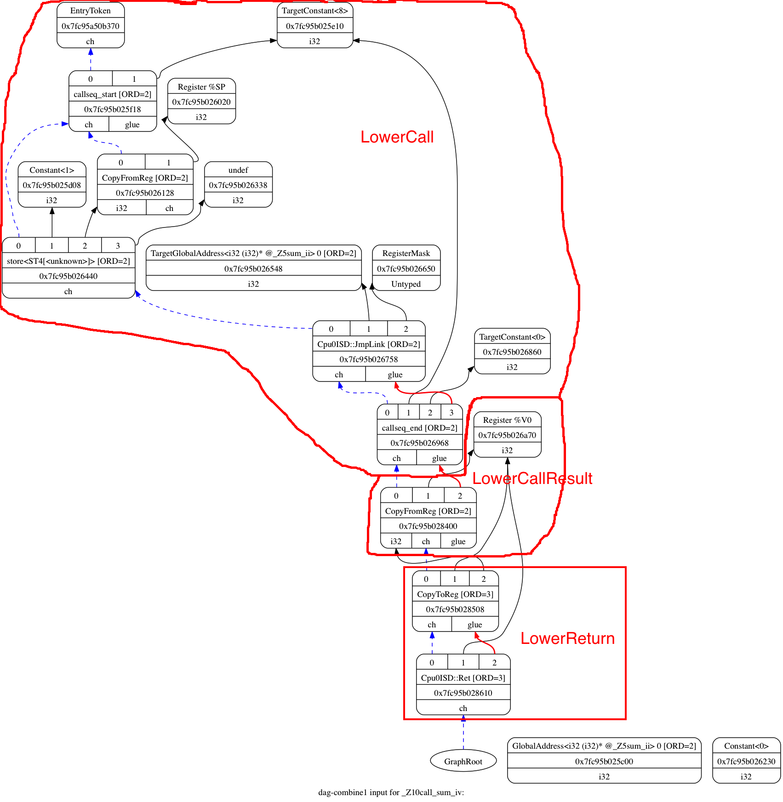
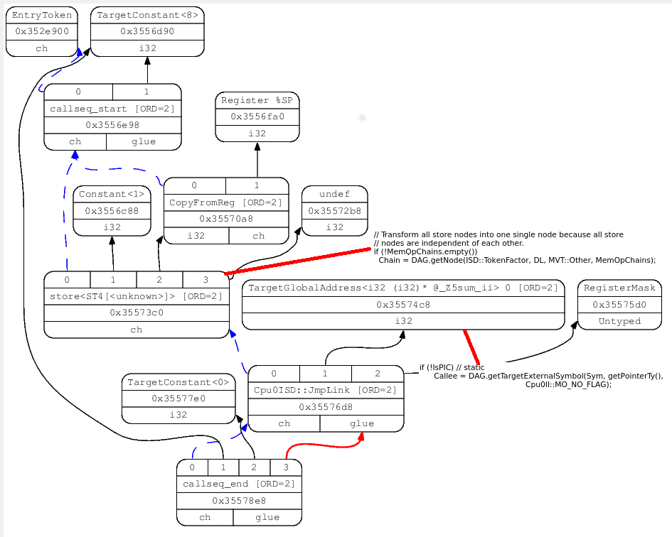
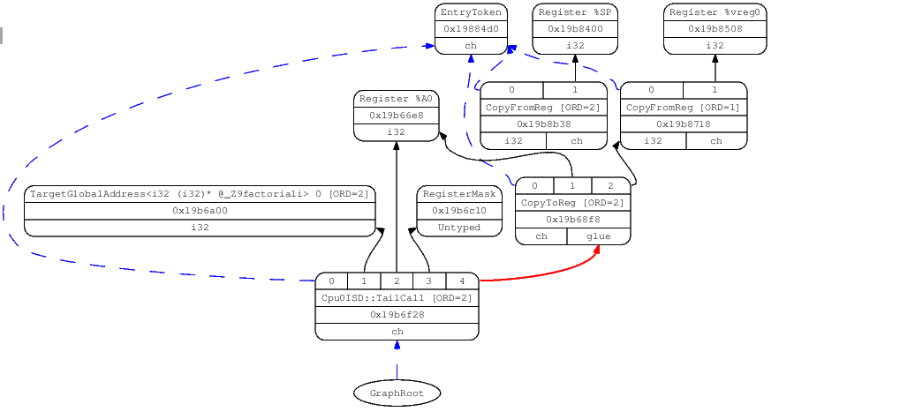
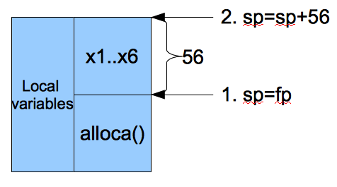
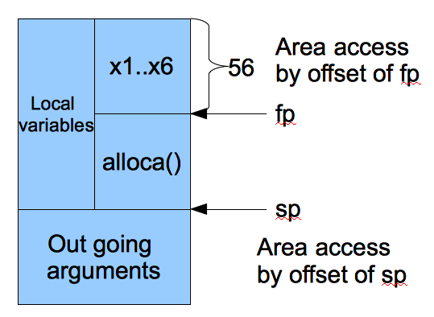

.. _sec-funccall:

Function call
==============

.. contents::
   :local:
   :depth: 4

The subroutine/function call of backend translation is supported in this 
chapter. 
A lot of code needed in function call. They are added according llvm 
supplied interface for easy to explanation. 
This chapter starts from introducing the Mips stack frame structure since we 
borrow many part of ABI from it. 
Although each CPU has it's own ABI, most of RISC CPUs ABI are similar. 
In addition to support fixed number of arguments in function call, Cpu0 
supports variable number of arguments either since C/C++ support this feature. 
Supply Mips ABI and assemble language manual on internet link in this chapter 
for your reference. 
The section “4.5 DAG Lowering” of tricore_llvm.pdf contains knowledge 
about Lowering process. Section “4.5.1 Calling Conventions” of tricore_llvm.pdf 
is the related materials you can reference furth.

This chapter is more complicate than any of the previous chapters. 
It include stack frame and the related ABI support. 
If you have problem in reading the stack frame illustrated in the first three 
sections of this chapter, you can read the appendix B of “Procedure Call
Convention” of book “Computer Organization and Design, 1st Edition” which listed 
in section “RISC CPU knowledge” of chapter “Control flow statement” [#]_, 
“Run Time Memory” of compiler book, or “Function Call Sequence”  and 
“Stack Frame” of Mips ABI.

Mips stack frame
-----------------

The first thing for design the Cpu0 function call is deciding how to pass 
arguments in function call. There are two options. 
The first is pass arguments all in stack. 
Second is pass arguments in the registers which are reserved for function 
arguments, and put the other arguments in stack if it over the number of 
registers reserved for function call. For example, Mips pass the first 4 
arguments in register $a0, $a1, $a2, $a3, and the other arguments in stack 
if it over 4 arguments. :num:`Figure #funccall-f1` is the Mips stack frame.

.. _funccall-f1:
.. figure:: ../Fig/funccall/1.png
    :height: 531 px
    :width: 688 px
    :scale: 50 %
    :align: center

    Mips stack frame
    
Run ``llc -march=mips`` for ch9_1.bc, you will get the following result. 
See comment **"//"**.

.. rubric:: lbdex/input/ch9_1.cpp
.. literalinclude:: ../lbdex/input/ch9_1.cpp
    :start-after: /// start

.. code-block:: bash

  118-165-78-230:input Jonathan$ clang -target mips-unknown-linux-gnu -c 
  ch9_1.cpp -emit-llvm -o ch9_1.bc
  118-165-78-230:input Jonathan$ /Users/Jonathan/llvm/test/cmake_debug_build/
  Debug/bin/llc -march=mips -relocation-model=pic -filetype=asm ch9_1.bc -o 
  ch9_1.mips.s
  118-165-78-230:input Jonathan$ cat ch9_1.mips.s 
    .section .mdebug.abi32
    .previous
    .file "ch9_1.bc"
    .text
    .globl  _Z5sum_iiiiiii
    .align  2
    .type _Z5sum_iiiiiii,@function
    .set  nomips16                # @_Z5sum_iiiiiii
    .ent  _Z5sum_iiiiiii
  _Z5sum_iiiiiii:
    .cfi_startproc
    .frame  $sp,32,$ra
    .mask   0x00000000,0
    .fmask  0x00000000,0
    .set  noreorder
    .set  nomacro
    .set  noat
  # BB#0:
    addiu $sp, $sp, -32
  $tmp1:
    .cfi_def_cfa_offset 32
    sw  $4, 28($sp)
    sw  $5, 24($sp)
    sw  $t9, 20($sp)
    sw  $7, 16($sp)
    lw  $1, 48($sp) // load argument 5
    sw  $1, 12($sp)
    lw  $1, 52($sp) // load argument 6
    sw  $1, 8($sp)
    lw  $2, 24($sp)
    lw  $3, 28($sp)
    addu  $2, $3, $2
    lw  $3, 20($sp)
    addu  $2, $2, $3
    lw  $3, 16($sp)
    addu  $2, $2, $3
    lw  $3, 12($sp)
    addu  $2, $2, $3
    addu  $2, $2, $1
    sw  $2, 4($sp)
    jr  $ra
    addiu $sp, $sp, 32
    .set  at
    .set  macro
    .set  reorder
    .end  _Z5sum_iiiiiii
  $tmp2:
    .size _Z5sum_iiiiiii, ($tmp2)-_Z5sum_iiiiiii
    .cfi_endproc
  
    .globl  main
    .align  2
    .type main,@function
    .set  nomips16                # @main
    .ent  main
  main:
    .cfi_startproc
    .frame  $sp,40,$ra
    .mask   0x80000000,-4
    .fmask  0x00000000,0
    .set  noreorder
    .set  nomacro
    .set  noat
  # BB#0:
    lui $2, %hi(_gp_disp)
    ori $2, $2, %lo(_gp_disp)
    addiu $sp, $sp, -40
  $tmp5:
    .cfi_def_cfa_offset 40
    sw  $ra, 36($sp)            # 4-byte Folded Spill
  $tmp6:
    .cfi_offset 31, -4
    addu  $gp, $2, $25
    sw  $zero, 32($sp)
    addiu $1, $zero, 6
    sw  $1, 20($sp) // Save argument 6 to 20($sp)
    addiu $1, $zero, 5
    sw  $1, 16($sp) // Save argument 5 to 16($sp)
    lw  $25, %call16(_Z5sum_iiiiiii)($gp)
    addiu $4, $zero, 1    // Pass argument 1 to $4 (=$a0)
    addiu $5, $zero, 2    // Pass argument 2 to $5 (=$a1)
    addiu $t9, $zero, 3
    jalr  $25
    addiu $7, $zero, 4
    sw  $2, 28($sp)
    lw  $ra, 36($sp)            # 4-byte Folded Reload
    jr  $ra
    addiu $sp, $sp, 40
    .set  at
    .set  macro
    .set  reorder
    .end  main
  $tmp7:
    .size main, ($tmp7)-main
    .cfi_endproc

From the mips assembly code generated as above, we know it save the first 4 
arguments to $a0..$a3 and last 2 arguments to 16($sp) and 20($sp). 
:num:`Figure #funccall-f2` is the arguments location for example code 
ch9_1.cpp. 
It loads argument 5 from 48($sp) in sum_i() since the argument 5 is saved to 
16($sp) in main(). 
The stack size of sum_i() is 32, so 16+32($sp) is the location of incoming 
argument 5.

.. _funccall-f2:
.. figure:: ../Fig/funccall/2.png
    :height: 577 px
    :width: 740 px
    :scale: 50 %
    :align: center

    Mips arguments location in stack frame

The 007-2418-003.pdf in here [#]_ is the Mips assembly language manual. 
Here [#]_ is Mips Application Binary Interface which include the 
:num:`Figure #funccall-f1`.

Load incoming arguments from stack frame
-----------------------------------------

From last section, to support function call, we need implementing the arguments 
pass mechanism with stack frame. Before do that, let's run the old version of 
code Chapter8_2/ with ch9_1.cpp and see what happens.

.. code-block:: bash

  118-165-79-31:input Jonathan$ /Users/Jonathan/llvm/test/
  cmake_debug_build/Debug/bin/llc -march=cpu0 -relocation-model=pic -filetype=asm 
  ch9_1.bc -o ch9_1.cpu0.s
  Assertion failed: (InVals.size() == Ins.size() && "LowerFormalArguments didn't 
  emit the correct number of values!"), function LowerArguments, file /Users/
  Jonathan/llvm/test/src/lib/CodeGen/SelectionDAG/
  SelectionDAGBuilder.cpp, ...
  ...
  0.  Program arguments: /Users/Jonathan/llvm/test/cmake_debug_build/
  Debug/bin/llc -march=cpu0 -relocation-model=pic -filetype=asm ch9_1.bc -o 
  ch9_1.cpu0.s 
  1.  Running pass 'Function Pass Manager' on module 'ch9_1.bc'.
  2.  Running pass 'CPU0 DAG->DAG Pattern Instruction Selection' on function 
  '@_Z5sum_iiiiiii'
  Illegal instruction: 4

Since Chapter8_2/ define the LowerFormalArguments() with empty, we get the error 
message as above. 
Before define LowerFormalArguments(), we have to choose how to pass arguments 
in function call.
For demonstration, Cpu0 pass arguments first two arguments in registers as 
default setting of ``llc -cpu0-s32-calls=false``. 
When ``llc -cpu0-s32-calls=true``, Cpu0 pass all it's arguments in stack.

Function LowerFormalArguments() is in charge of incoming arguments creation. 
We define it as follows,

.. rubric:: lbdex/chapters/Chapter9_1/Cpu0ISelLowering.h
.. literalinclude:: ../lbdex/Cpu0/Cpu0ISelLowering.h
    :start-after: //@class Cpu0TargetLowering
    :end-before: public:
.. literalinclude:: ../lbdex/Cpu0/Cpu0ISelLowering.h
    :start-after: //@CH3_4 1 {
    :end-before: public:
.. literalinclude:: ../lbdex/Cpu0/Cpu0ISelLowering.h
    :start-after: #if CH >= CH9_1 //1
    :end-before: #endif
.. literalinclude:: ../lbdex/Cpu0/Cpu0ISelLowering.h
    :start-after: #if CH >= CH9_1 //2
    :end-before: #endif
.. literalinclude:: ../lbdex/Cpu0/Cpu0ISelLowering.h
    :start-after: #if CH >= CH9_1 //3
    :end-before: #endif
.. literalinclude:: ../lbdex/Cpu0/Cpu0ISelLowering.h
    :start-after: #if CH >= CH9_1 //4
    :end-before: #endif
.. literalinclude:: ../lbdex/Cpu0/Cpu0ISelLowering.h
    :start-after: #if CH >= CH9_1 //5
    :end-before: #endif

.. code-block:: c++

    };
    ...

.. literalinclude:: ../lbdex/Cpu0/Cpu0ISelLowering.h
    :start-after: #if CH >= CH9_1 //6
    :end-before: #endif
.. literalinclude:: ../lbdex/Cpu0/Cpu0ISelLowering.h
    :start-after: #if CH >= CH9_1 //7
    :end-before: #endif
.. literalinclude:: ../lbdex/Cpu0/Cpu0ISelLowering.h
    :start-after: #if CH >= CH9_1 //8
    :end-before: #endif

.. code-block:: c++

    ...
  }

.. rubric:: lbdex/chapters/Chapter9_1/Cpu0ISelLowering.cpp
.. literalinclude:: ../lbdex/Cpu0/Cpu0ISelLowering.cpp
    :start-after: #if CH >= CH9_1 //2
    :end-before: #endif
.. literalinclude:: ../lbdex/Cpu0/Cpu0ISelLowering.cpp
    :start-after: #if CH >= CH9_1 //3
    :end-before: #endif
.. literalinclude:: ../lbdex/Cpu0/Cpu0ISelLowering.cpp
    :start-after: #if CH >= CH9_1 //4
    :end-before: #endif
.. literalinclude:: ../lbdex/Cpu0/Cpu0ISelLowering.cpp
    :start-after: #if CH >= CH9_1 //5
    :end-before: #if CH >= CH9_2
.. literalinclude:: ../lbdex/Cpu0/Cpu0ISelLowering.cpp
    :start-after: #if CH >= CH9_1 //5
    :end-before: #if CH >= CH9_2
.. literalinclude:: ../lbdex/Cpu0/Cpu0ISelLowering.cpp
    :start-after: #else // CH >= CH9_2
    :end-before: #endif

.. code-block:: c++

  }

.. literalinclude:: ../lbdex/chapters/Chapter9_1/Cpu0ISelLowering.cpp
    :start-after: //@            Formal Arguments Calling Convention Implementation
    :end-before: //@              Return Value Calling Convention Implementation
.. literalinclude:: ../lbdex/Cpu0/Cpu0ISelLowering.cpp
    :start-after: #if CH >= CH9_1 //7
    :end-before: #endif // #if CH >= CH9_1
.. literalinclude:: ../lbdex/Cpu0/Cpu0ISelLowering.cpp
    :start-after: #if CH >= CH9_1 //8
    :end-before: #endif // #if CH >= CH9_1
.. literalinclude:: ../lbdex/Cpu0/Cpu0ISelLowering.cpp
    :start-after: #if CH >= CH9_1 //9
    :end-before: #endif // #if CH >= CH9_1
.. literalinclude:: ../lbdex/Cpu0/Cpu0ISelLowering.cpp
    :start-after: #if CH >= CH9_1 //10
    :end-before: #endif

Refresh "section Global variable" [#]_, we handled global 
variable translation by create the IR DAG in LowerGlobalAddress() first, and 
then finish the Instruction Selection according their corresponding machine 
instruction DAGs in Cpu0InstrInfo.td. 
LowerGlobalAddress() is called when ``llc`` meets the global variable access. 
LowerFormalArguments() work in the same way. 
It is called when function is entered. 
It get incoming arguments information by CCInfo(CallConv,..., ArgLocs, ...) 
before enter **“for loop”**. In ch9_1.cpp, there are 6 arguments in sum_i(...) 
function call. 
So ArgLocs.size() is 6, each argument information is in ArgLocs[i]. 
When VA.isRegLoc() is true, meaning the arguement pass in register. On the 
contrary, when VA.isMemLoc() is true, meaning the arguement pass in memory stack.
When pass in register, it mark the register "live in" and copy directly from the
register.
When pass in memory stack, it creates stack offset for this frame index object 
and load node with the created stack offset, and then puts the load node into 
vector InVals. 

When ``llc -cpu0-s32-calls=false`` it pass first two arguments registers
and the other arguments in stack frame. When ``llc -cpu0-s32-calls=true`` it 
pass first all arguments in stack frame.

Before take care the arguemnts as above, it call analyzeFormalArguments().
In analyzeFormalArguments() it call fixedArgFn() which return the function 
pointer of CC_Cpu0O32() or CC_Cpu0S32(). 
ArgFlags.isByVal() will be true if when meet "struct pointer byval" keyword
such as "%struct.S* byval" in tailcall.ll.
When ``llc -cpu0-s32-calls=false`` the stack offset begin from 8 (in case the 
arguement registers need spill out) while ``llc -cpu0-s32-calls=true`` stack 
offset begin from 0.
 
For instance of example code ch9_1.cpp with ``llc -cpu0-s32-calls=true`` (use 
memory stack only to pass arguments), LowerFormalArguments() 
will be called twice. First time is for sum_i() which will create 6 load DAGs 
for 6 incoming arguments passing into this function. 
Second time is for main() which won't create any load DAG for no incoming 
argument passing into main(). 
In addition to LowerFormalArguments() which creates the load DAG, we need 
loadRegFromStackSlot() (defined in the early chapter) to issue the machine 
instruction 
**“ld $r, offset($sp)”** to load incoming arguments from stack frame offset.
GetMemOperand(..., FI, ...) return the Memory location of the frame index 
variable, which is the offset.

For input ch9_incoming.cpp as below, LowerFormalArguments() will generate the 
red circled parts of DAG nodes as :num:`Figure #funccall-f-incoming-arg1` and 
:num:`Figure #funccall-f-incoming-arg2` for ``llc -cpu0-s32-calls=true`` and 
``llc -cpu0-s32-calls=false``, respectively.
The root node at bottom is created by

.. rubric:: lbdex/input/ch9_incoming.cpp
.. literalinclude:: ../lbdex/input/ch9_incoming.cpp
    :start-after: /// start
    
.. code-block:: bash
  
  JonathantekiiMac:input Jonathan$ clang -O3 -target mips-unknown-linux-gnu -c 
  ch9_incoming.cpp -emit-llvm -o ch9_incoming.bc
  JonathantekiiMac:input Jonathan$ /Users/Jonathan/llvm/test/cmake_debug_build/
  Debug/bin/llvm-dis ch9_incoming.bc -o -
  ...
  define i32 @_Z5sum_iiii(i32 %x1, i32 %x2, i32 %x3) #0 {
    %1 = add nsw i32 %x2, %x1
    %2 = add nsw i32 %1, %x3
    ret i32 %2
  }

.. _funccall-f-incoming-arg1:
.. figure:: ../Fig/funccall/incoming-arg-S32.png
    :height: 1148 px
    :width: 999 px
    :scale: 70 %
    :align: center

    Incoming arguments DAG created for ch9_incoming.cpp with -cpu0-s32-calls=true

.. _funccall-f-incoming-arg2:
.. figure:: ../Fig/funccall/incoming-arg-O32.png
    :height: 1148 px
    :width: 871 px
    :scale: 70 %
    :align: center

    Incoming arguments DAG created for ch9_incoming.cpp with -cpu0-s32-calls=false

In addition to Calling Convention and LowerFormalArguments(), Chapter9_1/ adds
the following code for the instruction selection and printing of Cpu0 
instructions **swi** (Software Interrupt), **jsub** and **jalr** (function call).
    
.. rubric:: lbdex/chapters/Chapter9_1/Cpu0InstrInfo.td
.. literalinclude:: ../lbdex/Cpu0/Cpu0InstrInfo.td
    :start-after: #if CH >= CH9_1 //1
    :end-before: #endif
.. literalinclude:: ../lbdex/Cpu0/Cpu0InstrInfo.td
    :start-after: #if CH >= CH9_1 //2
    :end-before: #endif
.. literalinclude:: ../lbdex/Cpu0/Cpu0InstrInfo.td
    :start-after: #if CH >= CH9_1 //4
    :end-before: #endif
.. literalinclude:: ../lbdex/Cpu0/Cpu0InstrInfo.td
    :start-after: #if CH >= CH9_1 //5
    :end-before: #endif
.. literalinclude:: ../lbdex/Cpu0/Cpu0InstrInfo.td
    :start-after: #if CH >= CH9_1 //6
    :end-before: //@class TailCall
.. literalinclude:: ../lbdex/Cpu0/Cpu0InstrInfo.td
    :start-after: #if CH >= CH9_1 //7
    :end-before: #endif
.. literalinclude:: ../lbdex/Cpu0/Cpu0InstrInfo.td
    :start-after: #if CH >= CH9_1 //8
    :end-before: #endif
.. literalinclude:: ../lbdex/Cpu0/Cpu0InstrInfo.td
    :start-after: #if CH >= CH9_1 //10
    :end-before: //@Pat<Cpu0TailCall>

.. code-block:: c++

  }
    
.. rubric:: lbdex/chapters/Chapter9_1/Cpu0MCInstLower.cpp
.. literalinclude:: ../lbdex/Cpu0/Cpu0MCInstLower.cpp
    :start-after: //@LowerSymbolOperand {
    :end-before: default:                   llvm_unreachable("Invalid target flag!");
.. literalinclude:: ../lbdex/Cpu0/Cpu0MCInstLower.cpp
    :start-after: #if CH >= CH9_1 //1
    :end-before: #endif

.. code-block:: c++

    ...
    }
    switch (MOTy) {
  . ...

.. literalinclude:: ../lbdex/Cpu0/Cpu0MCInstLower.cpp
    :start-after: #if CH >= CH9_1 //2
    :end-before: #endif

.. code-block:: c++

    ...
    }
    ...
  }

.. literalinclude:: ../lbdex/Cpu0/Cpu0MCInstLower.cpp
    :start-after: //@LowerOperand {
    :end-before: default: llvm_unreachable("unknown operand type");
.. literalinclude:: ../lbdex/Cpu0/Cpu0MCInstLower.cpp
    :start-after: #if CH >= CH9_1 //3
    :end-before: #endif
.. literalinclude:: ../lbdex/Cpu0/Cpu0MCInstLower.cpp
    :start-after: //@1
    :end-before: #endif

.. code-block:: c++

    ...
    }
    ...
  }

.. rubric:: lbdex/chapters/Chapter9_1/InstPrinter/Cpu0InstPrinter.cpp
.. literalinclude:: ../lbdex/Cpu0/InstPrinter/Cpu0InstPrinter.cpp
    :start-after: //@printExpr {
    :end-before: //@printExpr body {

.. code-block:: c++

  . ...
    switch (Kind) {
    ...

.. literalinclude:: ../lbdex/Cpu0/InstPrinter/Cpu0InstPrinter.cpp
    :start-after: #if CH >= CH9_1
    :end-before: #endif

.. code-block:: c++

    ...
    }
    ...
  }

.. rubric:: lbdex/chapters/Chapter9_1/MCTargetDesc/Cpu0AsmBackend.cpp
.. literalinclude:: ../lbdex/Cpu0/MCTargetDesc/Cpu0AsmBackend.cpp
    :start-after: //@adjustFixupValue {
    :end-before: default:
.. literalinclude:: ../lbdex/Cpu0/MCTargetDesc/Cpu0AsmBackend.cpp
    :start-after: #if CH >= CH9_1
    :end-before: #endif

.. code-block:: c++

    ...
    }
    ...
  }

.. rubric:: lbdex/chapters/Chapter9_1/MCTargetDesc/Cpu0ELFObjectWriter.cpp
.. literalinclude:: ../lbdex/Cpu0/MCTargetDesc/Cpu0ELFObjectWriter.cpp
    :start-after: //@GetRelocType {
    :end-before: default:
.. literalinclude:: ../lbdex/Cpu0/MCTargetDesc/Cpu0ELFObjectWriter.cpp
    :start-after: #if CH >= CH9_1
    :end-before: #endif

.. code-block:: c++

    ...
    }
    ...
  }

.. rubric:: lbdex/chapters/Chapter9_1/MCTargetDesc/Cpu0FixupKinds.h
.. literalinclude:: ../lbdex/Cpu0/MCTargetDesc/Cpu0FixupKinds.h
    :start-after: //@Fixups {
    :end-before: //@ Pure upper 32 bit fixup resulting in - R_CPU0_32.
.. literalinclude:: ../lbdex/Cpu0/MCTargetDesc/Cpu0FixupKinds.h
    :start-after: #if CH >= CH9_1
    :end-before: #endif

.. code-block:: c++

      ...
  . }

.. rubric:: lbdex/chapters/Chapter9_1/MCTargetDesc/Cpu0MCCodeEmitter.cpp
.. literalinclude:: ../lbdex/Cpu0/MCTargetDesc/Cpu0MCCodeEmitter.cpp
    :start-after: //@getJumpTargetOpValue {
    :end-before: #if CH >= CH8_1 //3
.. literalinclude:: ../lbdex/Cpu0/MCTargetDesc/Cpu0MCCodeEmitter.cpp
    :start-after: #if CH >= CH9_1 //1
    :end-before: #else
.. literalinclude:: ../lbdex/Cpu0/MCTargetDesc/Cpu0MCCodeEmitter.cpp
    :start-after: #endif //#if CH >= CH9_1 //1
    :end-before: else

.. code-block:: c++

    ...
  }

.. literalinclude:: ../lbdex/Cpu0/MCTargetDesc/Cpu0MCCodeEmitter.cpp
    :start-after: //@getExprOpValue {
    :end-before: //@getExprOpValue body {
.. literalinclude:: ../lbdex/Cpu0/MCTargetDesc/Cpu0MCCodeEmitter.cpp
    :start-after: //@switch {
    :end-before: //@switch }
.. literalinclude:: ../lbdex/Cpu0/MCTargetDesc/Cpu0MCCodeEmitter.cpp
    :start-after: #if CH >= CH9_1 //2
    :end-before: #endif

.. code-block:: c++

    ...
    }
  ...
  }
 
.. rubric:: lbdex/chapters/Chapter9_1/Cpu0MachineFunction.h
.. literalinclude:: ../lbdex/Cpu0/Cpu0MachineFunction.h
    :start-after: //@1 {
    :end-before: #if CH >= CH3_4 //1
.. literalinclude:: ../lbdex/Cpu0/Cpu0MachineFunction.h
    :start-after: #if CH >= CH9_1 //1
    :end-before: #endif
.. literalinclude:: ../lbdex/Cpu0/Cpu0MachineFunction.h
    :start-after: #if CH >= CH9_1 //2
    :end-before: #endif
.. literalinclude:: ../lbdex/Cpu0/Cpu0MachineFunction.h
    :start-after: #if CH >= CH9_1 //3
    :end-before: #if CH >= CH9_3
.. literalinclude:: ../lbdex/Cpu0/Cpu0MachineFunction.h
    :start-after: #endif //#if CH >= CH9_3
    :end-before: #endif
.. literalinclude:: ../lbdex/Cpu0/Cpu0MachineFunction.h
    :start-after: #if CH >= CH9_1 //4
    :end-before: #endif
.. literalinclude:: ../lbdex/Cpu0/Cpu0MachineFunction.h
    :start-after: #if CH >= CH9_1 //5
    :end-before: #endif

.. code-block:: c++

    ...
  };

.. rubric:: lbdex/chapters/Chapter9_1/Cpu0SEFrameLowering.h
.. literalinclude:: ../lbdex/Cpu0/Cpu0SEFrameLowering.h
    :start-after: #if CH >= CH9_1
    :end-before: #endif

.. rubric:: lbdex/chapters/Chapter9_1/Cpu0SEFrameLowering.cpp
.. literalinclude:: ../lbdex/Cpu0/Cpu0SEFrameLowering.cpp
    :start-after: #if CH >= CH9_1 //1
    :end-before: #endif

The JSUB and JALR defined in Cpu0InstrInfo.td as above all use Cpu0JmpLink
node. They are distinguishable since JSUB use "imm" operand while
JALR uses register operand.

.. rubric:: lbdex/chapters/Chapter9_1/Cpu0InstrInfo.td
.. literalinclude:: ../lbdex/Cpu0/Cpu0InstrInfo.td
    :start-after: //#if CH >= CH9_1 //10
    :end-before: //@Pat<Cpu0TailCall>

The code tells TableGen generating pattern match code that matching the "imm" for
"tglobaladdr" pattern first. If it fails then trying to match "texternalsym" next.
The function you declared belongs to "tglobaladdr", (for instance the function 
sum_i(...) defined in ch9_1.cpp belong to "tglobaladdr"); the function which 
implicitly used by llvm belongs to "texternalsym" (for instance the function 
"memcpy" belongs to "texternalsym"). The "memcpy" will be generated when 
defining a long string. The ch9_1_2.cpp is an example for generating "memcpy"
function call. It will be shown in next section with Chapter9_2 example code.
The Cpu0GenDAGISel.inc contains the TablGen
generated information about JSUB and JALR pattern match information as follows,

.. code-block:: c++

            /*SwitchOpcode*/ 74,  TARGET_VAL(Cpu0ISD::JmpLink),// ->734
  /*660*/     OPC_RecordNode,   // #0 = 'Cpu0JmpLink' chained node
  /*661*/     OPC_CaptureGlueInput,
  /*662*/     OPC_RecordChild1, // #1 = $target
  /*663*/     OPC_Scope, 57, /*->722*/ // 2 children in Scope
  /*665*/       OPC_MoveChild, 1,
  /*667*/       OPC_SwitchOpcode /*3 cases */, 22,  TARGET_VAL(ISD::Constant),
  // ->693
  /*671*/         OPC_MoveParent,
  /*672*/         OPC_EmitMergeInputChains1_0,
  /*673*/         OPC_EmitConvertToTarget, 1,
  /*675*/         OPC_Scope, 7, /*->684*/ // 2 children in Scope
  /*684*/         /*Scope*/ 7, /*->692*/
  /*685*/           OPC_MorphNodeTo, TARGET_VAL(Cpu0::JSUB), 0|OPFL_Chain|
  OPFL_GlueInput|OPFL_GlueOutput|OPFL_Variadic1,
                        0/*#VTs*/, 1/*#Ops*/, 2, 
                    // Src: (Cpu0JmpLink (imm:iPTR):$target) - Complexity = 6
                    // Dst: (JSUB (imm:iPTR):$target)
  /*692*/         0, /*End of Scope*/
                /*SwitchOpcode*/ 11,  TARGET_VAL(ISD::TargetGlobalAddress),// ->707
  /*696*/         OPC_CheckType, MVT::i32,
  /*698*/         OPC_MoveParent,
  /*699*/         OPC_EmitMergeInputChains1_0,
  /*700*/         OPC_MorphNodeTo, TARGET_VAL(Cpu0::JSUB), 0|OPFL_Chain|
  OPFL_GlueInput|OPFL_GlueOutput|OPFL_Variadic1,
                      0/*#VTs*/, 1/*#Ops*/, 1, 
                  // Src: (Cpu0JmpLink (tglobaladdr:i32):$dst) - Complexity = 6
                  // Dst: (JSUB (tglobaladdr:i32):$dst)
                /*SwitchOpcode*/ 11,  TARGET_VAL(ISD::TargetExternalSymbol),// ->721
  /*710*/         OPC_CheckType, MVT::i32,
  /*712*/         OPC_MoveParent,
  /*713*/         OPC_EmitMergeInputChains1_0,
  /*714*/         OPC_MorphNodeTo, TARGET_VAL(Cpu0::JSUB), 0|OPFL_Chain|
  OPFL_GlueInput|OPFL_GlueOutput|OPFL_Variadic1,
                      0/*#VTs*/, 1/*#Ops*/, 1, 
                  // Src: (Cpu0JmpLink (texternalsym:i32):$dst) - Complexity = 6
                  // Dst: (JSUB (texternalsym:i32):$dst)
                0, // EndSwitchOpcode
  /*722*/     /*Scope*/ 10, /*->733*/
  /*723*/       OPC_CheckChild1Type, MVT::i32,
  /*725*/       OPC_EmitMergeInputChains1_0,
  /*726*/       OPC_MorphNodeTo, TARGET_VAL(Cpu0::JALR), 0|OPFL_Chain|
  OPFL_GlueInput|OPFL_GlueOutput|OPFL_Variadic1,
                    0/*#VTs*/, 1/*#Ops*/, 1, 
                // Src: (Cpu0JmpLink CPURegs:i32:$rb) - Complexity = 3
                // Dst: (JALR CPURegs:i32:$rb)
  /*733*/     0, /*End of Scope*/

After above changes, you can run Chapter9_1/ with ch9_1.cpp and see what happens 
in the following,

.. code-block:: bash

  118-165-79-83:input Jonathan$ /Users/Jonathan/llvm/test/
  cmake_debug_build/Debug/bin/llc -march=cpu0 -relocation-model=pic -filetype=asm 
  ch9_1.bc -o ch9_1.cpu0.s
  Assertion failed: ((CLI.IsTailCall || InVals.size() == CLI.Ins.size()) && 
  "LowerCall didn't emit the correct number of values!"), function LowerCallTo, 
  file /Users/Jonathan/llvm/test/src/lib/CodeGen/SelectionDAG/SelectionDAGBuilder.
  cpp, ...
  ...
  0.  Program arguments: /Users/Jonathan/llvm/test/cmake_debug_build/
  Debug/bin/llc -march=cpu0 -relocation-model=pic -filetype=asm ch9_1.bc -o 
  ch9_1.cpu0.s 
  1.  Running pass 'Function Pass Manager' on module 'ch9_1.bc'.
  2.  Running pass 'CPU0 DAG->DAG Pattern Instruction Selection' on function 
  '@main'
  Illegal instruction: 4
  
Now, the LowerFormalArguments() has the correct number, but LowerCall() has not  
the correct number of values!

Store outgoing arguments to stack frame
----------------------------------------

:num:`Figure #funccall-f2` depicts two steps to take care arguments passing. 
One is store outgoing arguments in caller function, and the other is load 
incoming arguments in callee function. 
We defined LowerFormalArguments() for **“load incoming arguments”** in callee 
function last section. 
Now, we will finish **“store outgoing arguments”** in caller function. 
LowerCall() is responsible to do this. The implementation as follows,

.. rubric:: lbdex/chapters/Chapter9_2/Cpu0MachineFunction.h
.. literalinclude:: ../lbdex/Cpu0/Cpu0MachineFunction.h
    :start-after: #if CH >= CH9_2
    :end-before: #endif

.. rubric:: lbdex/chapters/Chapter9_2/Cpu0MachineFunction.cpp
.. literalinclude:: ../lbdex/Cpu0/Cpu0MachineFunction.cpp
    :start-after: #if CH >= CH9_2
    :end-before: #endif

.. rubric:: lbdex/chapters/Chapter9_2/Cpu0ISelLowering.h
.. literalinclude:: ../lbdex/Cpu0/Cpu0ISelLowering.h
    :start-after: #if CH >= CH9_2 //1
    :end-before: #endif
.. literalinclude:: ../lbdex/Cpu0/Cpu0ISelLowering.h
    :start-after: //@CH3_4 1 {
    :end-before: public:
.. literalinclude:: ../lbdex/Cpu0/Cpu0ISelLowering.h
    :start-after: #if CH >= CH9_2 //2
    :end-before: #endif

.. code-block:: c++

  .  };

.. literalinclude:: ../lbdex/Cpu0/Cpu0ISelLowering.h
    :start-after: #if CH >= CH9_2 //3
    :end-before: #endif
.. literalinclude:: ../lbdex/Cpu0/Cpu0ISelLowering.h
    :start-after: #if CH >= CH9_2 //4
    :end-before: #endif
.. literalinclude:: ../lbdex/Cpu0/Cpu0ISelLowering.h
    :start-after: #if CH >= CH9_2 //5
    :end-before: #endif
.. literalinclude:: ../lbdex/Cpu0/Cpu0ISelLowering.h
    :start-after: #if CH >= CH9_2 //6
    :end-before: #endif
.. literalinclude:: ../lbdex/Cpu0/Cpu0ISelLowering.h
    :start-after: #if CH >= CH9_2 //7
    :end-before: #endif

.. rubric:: lbdex/chapters/Chapter9_2/Cpu0ISelLowering.cpp
.. literalinclude:: ../lbdex/Cpu0/Cpu0ISelLowering.cpp
    :start-after: #if CH >= CH9_2 //1
    :end-before: #endif // #if CH >= CH9_2 //1
.. literalinclude:: ../lbdex/chapters/Chapter9_2/Cpu0ISelLowering.cpp
    :start-after: //@LowerCall {
    :end-before: //@LowerCall }
.. literalinclude:: ../lbdex/Cpu0/Cpu0ISelLowering.cpp
    :start-after: #if CH >= CH9_2 //3
    :end-before: #endif
.. literalinclude:: ../lbdex/Cpu0/Cpu0ISelLowering.cpp
    :start-after: #if CH >= CH9_2 //4
    :end-before: #endif
.. literalinclude:: ../lbdex/Cpu0/Cpu0ISelLowering.cpp
    :start-after: #if CH >= CH9_2 //5
    :end-before: #endif
.. literalinclude:: ../lbdex/chapters/Chapter9_2/Cpu0ISelLowering.cpp
    :start-after: //@#if CH >= CH9_2 //6 {
    :end-before: //@#if CH >= CH9_2 //6 }

Just like load incoming arguments from stack frame, we call 
CCInfo(CallConv,..., ArgLocs, ...) to get outgoing arguments information before 
enter **“for loop”** and set stack alignment with 8 bytes. 
They're almost same in **“for loop”** with LowerFormalArguments(), except 
LowerCall() creates store DAG vector instead of load DAG vector. 
After the **“for loop”**, it create **“ld $t9, %call16(_Z5sum_iiiiiii)($gp)”** 
and jalr $t9 for calling subroutine (the $6 is $t9) in PIC mode.

Like load incoming arguments, we need to implement storeRegToStackSlot() at
early chapter.

Pseudo hook instruction ADJCALLSTACKDOWN and ADJCALLSTACKUP
~~~~~~~~~~~~~~~~~~~~~~~~~~~~~~~~~~~~~~~~~~~~~~~~~~~~~~~~~~~~

DAG.getCALLSEQ_START() and DAG.getCALLSEQ_END() are set before and after the 
**“for loop”**, respectively, they insert 
CALLSEQ_START, CALLSEQ_END, and translate them into pseudo machine instructions 
!ADJCALLSTACKDOWN, !ADJCALLSTACKUP later according Cpu0InstrInfo.td definition 
as follows.

.. rubric:: lbdex/chapters/Chapter9_2/Cpu0InstrInfo.td
.. literalinclude:: ../lbdex/Cpu0/Cpu0InstrInfo.td
    :start-after: #if CH >= CH9_2 //1
    :end-before: #endif
.. literalinclude:: ../lbdex/Cpu0/Cpu0InstrInfo.td
    :start-after: #if CH >= CH9_2 //2
    :end-before: #endif
.. literalinclude:: ../lbdex/Cpu0/Cpu0InstrInfo.td
    :start-after: #if CH >= CH9_2 //3
    :end-before: #endif

With below definition, eliminateCallFramePseudoInstr() will be called when 
llvm meets pseudo instructions ADJCALLSTACKDOWN and ADJCALLSTACKUP. 
It just discard these 2 pseudo instructions, and llvm will add offset to
stack. 

.. rubric:: lbdex/chapters/Chapter9_2/Cpu0InstrInfo.cpp
.. literalinclude:: ../lbdex/Cpu0/Cpu0InstrInfo.cpp
    :start-after: //@Cpu0InstrInfo {
    :end-before: #if CH >= CH9_2
.. literalinclude:: ../lbdex/Cpu0/Cpu0InstrInfo.cpp
    :start-after: #if CH >= CH9_2
    :end-before: #endif
  
.. rubric:: lbdex/chapters/Chapter9_2/Cpu0SEFrameLowering.h
.. literalinclude:: ../lbdex/Cpu0/Cpu0SEFrameLowering.h
    :start-after: #if CH >= CH9_2
    :end-before: #endif

.. rubric:: lbdex/chapters/Chapter9_2/Cpu0SEFrameLowering.cpp
.. literalinclude:: ../lbdex/Cpu0/Cpu0SEFrameLowering.cpp
    :start-after: #if CH >= CH9_2
    :end-before: #endif

Read Lowercall() with Graphivz's help
~~~~~~~~~~~~~~~~~~~~~~~~~~~~~~~~~~~~~~~

The whole DAGs created for outgoing arguments as 
:num:`Figure #funccall-f-outgoing-arg` for ch9_outgoing.cpp with cpu032I.
LowerCall() will generate the DAG nodes as 
:num:`Figure #funccall-f-outgoing-arg-lowercal` 
for ch9_outgoing.cpp with cpu032I. The corresponding code of DAGs Store and 
TargetGlobalAddress are listed in the figure, user can match the other DAGs
to function LowerCall() easy.
Through Graphivz tool with llc option -view-dag-combine1-dags, you can design
a small input C or llvm IR source code and check the DAGs to understand the 
code in LowerCall() and LowerFormalArguments(). In later section of this chapter, 
there are variable arguments and dynamic stack allocation support. You can design
the input example with this features and check the DAGs with these two function
again to make sure you know the code in these two function. About Graphivz,
please reference section "Display llvm IR nodes with Graphviz" of chapter 4, 
Arithmetic and logic instructions.
The DAGs diagram can be got by llc option as follows, 

.. rubric:: lbdex/input/ch9_outgoing.cpp
.. literalinclude:: ../lbdex/input/ch9_outgoing.cpp
    :start-after: /// start
    
.. code-block:: bash
  
  JonathantekiiMac:input Jonathan$ clang -O3 -target mips-unknown-linux-gnu -c 
  ch9_outgoing.cpp -emit-llvm -o ch9_outgoing.bc
  JonathantekiiMac:input Jonathan$ /Users/Jonathan/llvm/test/cmake_debug_build/
  Debug/bin/llvm-dis ch9_outgoing.bc -o -
  ...
  define i32 @_Z10call_sum_iv() #0 {
    %1 = tail call i32 @_Z5sum_ii(i32 1)
    ret i32 %1
  }
  JonathantekiiMac:input Jonathan$ /Users/Jonathan/llvm/test/cmake_debug_build/
  Debug/bin/llc -march=cpu0 -mcpu=cpu032I -view-dag-combine1-dags -relocation-
  model=static -filetype=asm ch9_outgoing.bc -o -
  	.text
  	.section .mdebug.abiS32
  	.previous
  	.file	"ch9_outgoing.bc"
  Writing '/var/folders/rf/8bgdgt9d6vgf5sn8h8_zycd00000gn/T/dag._Z10call_sum_iv-
  0dfaf1.dot'...  done. 
  Running 'Graphviz' program...

.. _funccall-f-outgoing-arg:

    Outgoing arguments DAG created for ch9_outgoing.cpp with -cpu0-s32-calls=true

.. _funccall-f-outgoing-arg-lowercal:

    Outgoing arguments DAG created by LowerCall() for ch9_outgoing.cpp with -cpu0-s32-calls=true

Mentioned in last section, ``llc -cpu0-s32-calls=true`` uses S32 calling 
convention which pass all arguements at registers while 
``llc -cpu0-s32-calls=false`` uses O32 pass first two arguments at 
registers and other arguments at stack. The result as follows,

.. code-block:: bash

  118-165-78-230:input Jonathan$ /Users/Jonathan/llvm/test/cmake_debug_build/
  Debug/bin/llc -march=cpu0 -mcpu=cpu032I -cpu0-s32-calls=true 
  -relocation-model=pic -filetype=asm ch9_1.bc -o -
	  .text
	  .section .mdebug.abiS32
	  .previous
	  .file	"ch9_1.bc"
	  .globl	_Z5sum_iiiiiii
	  .align	2
	  .type	_Z5sum_iiiiiii,@function
	  .ent	_Z5sum_iiiiiii          # @_Z5sum_iiiiiii
  _Z5sum_iiiiiii:
	  .frame	$fp,32,$lr
	  .mask 	0x00000000,0
	  .set	noreorder
	  .cpload	$t9
	  .set	nomacro
  # BB#0:
	  addiu	$sp, $sp, -32
	  ld	$2, 52($sp)
	  ld	$3, 48($sp)
	  ld	$4, 44($sp)
	  ld	$5, 40($sp)
	  ld	$t9, 36($sp)
	  ld	$7, 32($sp)
	  st	$7, 28($sp)
	  st	$t9, 24($sp)
	  st	$5, 20($sp)
	  st	$4, 16($sp)
	  st	$3, 12($sp)
	  lui	$3, %got_hi(gI)
	  addu	$3, $3, $gp
	  st	$2, 8($sp)
	  ld	$3, %got_lo(gI)($3)
	  ld	$3, 0($3)
	  ld	$4, 28($sp)
	  addu	$3, $3, $4
	  ld	$4, 24($sp)
	  addu	$3, $3, $4
	  ld	$4, 20($sp)
	  addu	$3, $3, $4
	  ld	$4, 16($sp)
	  addu	$3, $3, $4
	  ld	$4, 12($sp)
	  addu	$3, $3, $4
	  addu	$2, $3, $2
	  st	$2, 4($sp)
	  addiu	$sp, $sp, 32
	  ret	$lr
	  nop
	  .set	macro
	  .set	reorder
	  .end	_Z5sum_iiiiiii
  $tmp0:
	  .size	_Z5sum_iiiiiii, ($tmp0)-_Z5sum_iiiiiii

	  .globl	main
	  .align	2
	  .type	main,@function
	  .ent	main                    # @main
  main:
	  .frame	$fp,40,$lr
	  .mask 	0x00004000,-4
	  .set	noreorder
	  .cpload	$t9
	  .set	nomacro
  # BB#0:
	  addiu	$sp, $sp, -40
	  st	$lr, 36($sp)            # 4-byte Folded Spill
	  addiu	$2, $zero, 0
	  st	$2, 32($sp)
	  addiu	$2, $zero, 6
	  st	$2, 20($sp)
	  addiu	$2, $zero, 5
	  st	$2, 16($sp)
	  addiu	$2, $zero, 4
	  st	$2, 12($sp)
	  addiu	$2, $zero, 3
	  st	$2, 8($sp)
	  addiu	$2, $zero, 2
	  st	$2, 4($sp)
	  addiu	$2, $zero, 1
	  st	$2, 0($sp)
	  ld	$t9, %call16(_Z5sum_iiiiiii)($gp)
	  jalr	$t9
	  nop
	  st	$2, 28($sp)
	  ld	$lr, 36($sp)            # 4-byte Folded Reload
	  addiu	$sp, $sp, 40
	  ret	$lr
	  nop
	  .set	macro
	  .set	reorder
	  .end	main
  $tmp1:
	  .size	main, ($tmp1)-main

	  .type	gI,@object              # @gI
	  .data
	  .globl	gI
	  .align	2
  gI:
	  .4byte	100                     # 0x64
	  .size	gI, 4

  118-165-78-230:input Jonathan$ /Users/Jonathan/llvm/test/cmake_debug_build/
  Debug/bin/llc -march=cpu0 -mcpu=cpu032II -cpu0-s32-calls=false 
  -relocation-model=pic -filetype=asm ch9_1.bc -o -
    ...
	  .globl	main
	  .align	2
	  .type	main,@function
	  .ent	main                    # @main
  main:
	  .frame	$fp,40,$lr
	  .mask 	0x00004000,-4
	  .set	noreorder
	  .cpload	$t9
	  .set	nomacro
  # BB#0:
	  addiu	$sp, $sp, -40
	  st	$lr, 36($sp)            # 4-byte Folded Spill
	  addiu	$2, $zero, 0
	  st	$2, 32($sp)
	  addiu	$2, $zero, 6
	  st	$2, 20($sp)
	  addiu	$2, $zero, 5
	  st	$2, 16($sp)
	  addiu	$2, $zero, 4
	  st	$2, 12($sp)
	  addiu	$2, $zero, 3
	  st	$2, 8($sp)
	  ld	$t9, %call16(_Z5sum_iiiiiii)($gp)
	  addiu	$4, $zero, 1
	  addiu	$5, $zero, 2
	  jalr	$t9
	  nop
	  st	$2, 28($sp)
	  ld	$lr, 36($sp)            # 4-byte Folded Reload
	  addiu	$sp, $sp, 40
	  ret	$lr
	  nop
	  .set	macro
	  .set	reorder
	  .end	main

Long and short string initialization
~~~~~~~~~~~~~~~~~~~~~~~~~~~~~~~~~~~~~~

The last section mentioned the "JSUB texternalsym" pattern. Run Chapter9_2 with
ch9_1_2.cpp to get the result as below. For long string, llvm call memcpy() to
initialize string (char str[81] = "Hello world" in this case). For short string,
the "call memcpy" is translated into "store with contant" in stages of
optimization.

.. rubric:: lbdex/input/ch9_1_2.cpp
.. literalinclude:: ../lbdex/input/ch9_1_2.cpp
    :start-after: /// start

.. code-block:: bash

  JonathantekiiMac:input Jonathan$ llvm-dis ch9_1_2.bc -o -
  ; ModuleID = 'ch9_1_2.bc'
  ...
  @_ZZ4mainE3str = private unnamed_addr constant [81 x i8] c"Hello world\00\00\00\
  00\00\00\00\00\00\00\00\00\00\00\00\00\00\00\00\00\00\00\00\00\00\00\00\00\00\00
  \00\00\00\00\00\00\00\00\00\00\00\00\00\00\00\00\00\00\00\00\00\00\00\00\00\00\0
  0\00\00\00\00\00\00\00\00\00\00\00\00\00", align 1
  @_ZZ4mainE1s = private unnamed_addr constant [6 x i8] c"Hello\00", align 1
  
  ; Function Attrs: nounwind
  define i32 @main() #0 {
  entry:
    %retval = alloca i32, align 4
    %str = alloca [81 x i8], align 1
    store i32 0, i32* %retval
    %0 = bitcast [81 x i8]* %str to i8*
    call void @llvm.memcpy.p0i8.p0i8.i32(i8* %0, i8* getelementptr inbounds 
    ([81 x i8]* @_ZZ4mainE3str, i32 0, i32 0), i32 81, i32 1, i1 false)
    %1 = bitcast [6 x i8]* %s to i8*
    call void @llvm.memcpy.p0i8.p0i8.i32(i8* %1, i8* getelementptr inbounds 
    ([6 x i8]* @_ZZ4mainE1s, i32 0, i32 0), i32 6, i32 1, i1 false)
  
    ret i32 0
  }
  
  JonathantekiiMac:input Jonathan$ clang -target mips-unknown-linux-gnu -c 
  ch9_1_2.cpp -emit-llvm -o ch9_1_2.bc
  JonathantekiiMac:input Jonathan$ /Users/Jonathan/llvm/test/cmake_debug_build
  /Debug/bin/llc -march=cpu0 -mcpu=cpu032II -cpu0-s32-calls=true
  -relocation-model=static -filetype=asm ch9_1_2.bc -o -
    .section .mdebug.abi32
    ...
	  lui	$2, %hi($_ZZ4mainE3str)
	  ori	$2, $2, %lo($_ZZ4mainE3str)
	  st	$2, 4($sp)
	  addiu	$2, $sp, 24
	  st	$2, 0($sp)
	  jsub	memcpy
	  nop
	  lui	$2, %hi($_ZZ4mainE1s)
	  ori	$2, $2, %lo($_ZZ4mainE1s)
	  lbu	$3, 4($2)
	  shl	$3, $3, 8
	  lbu	$4, 5($2)
	  or	$3, $3, $4
	  sh	$3, 20($sp)
	  lbu	$3, 2($2)
	  shl	$3, $3, 8
	  lbu	$4, 3($2)
	  or	$3, $3, $4
	  lbu	$4, 1($2)
	  lbu	$2, 0($2)
	  shl	$2, $2, 8
	  or	$2, $2, $4
	  shl	$2, $2, 16
	  or	$2, $2, $3
	  st	$2, 16($sp)
    ...
	.type	$_ZZ4mainE3str,@object  # @_ZZ4mainE3str
	.section	.rodata,"a",@progbits
  $_ZZ4mainE3str:
	  .asciz	"Hello world\000\000\000\000\000\000\000\000\000\000\000\000\000\000
    \000\000\000\000\000\000\000\000\000\000\000\000\000\000\000\000\000\000\000
    \000\000\000\000\000\000\000\000\000\000\000\000\000\000\000\000\000\000\000
    \000\000\000\000\000\000\000\000\000\000\000\000\000\000\000\000\000"
	  .size	$_ZZ4mainE3str, 81

	  .type	$_ZZ4mainE1s,@object    # @_ZZ4mainE1s
	  .section	.rodata.str1.1,"aMS",@progbits,1
  $_ZZ4mainE1s:
	  .asciz	"Hello"
	  .size	$_ZZ4mainE1s, 6

The "call memcpy" for short string is optimized by llvm before "DAG->DAG Pattern 
Instruction Selection" stage and translates it into "store with contant" as
follows,

.. code-block:: bash

  JonathantekiiMac:input Jonathan$ /Users/Jonathan/llvm/test/cmake_debug_build
  /Debug/bin/llc -march=cpu0 -mcpu=cpu032II -cpu0-s32-calls=true 
  -relocation-model=static -filetype=asm ch9_1_2.bc -debug -o -
  
  Initial selection DAG: BB#0 'main:entry'
  SelectionDAG has 35 nodes:
    ...
          0x7fd909030810: <multiple use>
          0x7fd909030c10: i32 = Constant<1214606444>  // 1214606444=0x48656c6c="Hell"
  
          0x7fd909030910: <multiple use>
          0x7fd90902d810: <multiple use>
        0x7fd909030d10: ch = store 0x7fd909030810, 0x7fd909030c10, 0x7fd909030910, 
        0x7fd90902d810<ST4[%1]>
  
          0x7fd909030810: <multiple use>
          0x7fd909030e10: i16 = Constant<28416>      // 28416=0x6f00="o\0"
  
          ...
  
          0x7fd90902d810: <multiple use>
        0x7fd909031210: ch = store 0x7fd909030810, 0x7fd909030e10, 0x7fd909031010, 
        0x7fd90902d810<ST2[%1+4](align=4)>
    ...

The incoming arguments is the formal arguments defined in compiler and program 
language books. The outgoing arguments is the actual arguments.
Summary as Table: Callee incoming arguments and caller outgoing arguments.

.. table:: Callee incoming arguments and caller outgoing arguments

  ========================  ===========================================    ===============================
  Description               Callee                                         Caller   
  ========================  ===========================================    ===============================
  Charged Function          LowerFormalArguments()                         LowerCall()
  Charged Function Created  Create load vectors for incoming arguments     Create store vectors for outgoing arguments
  ========================  ===========================================    ===============================

Structure type support
-----------------------

Ordinary struct type
~~~~~~~~~~~~~~~~~~~~~~~

The following code in Chapter9_1/ and Chapter3_4/ support the ordinary 
structure type in function call. 

.. rubric:: lbdex/chapters/Chapter9_1/Cpu0ISelLowering.cpp
.. literalinclude:: ../lbdex/Cpu0/Cpu0ISelLowering.cpp
    :start-after: //@LowerFormalArguments {
    :end-before: #if CH >= CH3_4
.. literalinclude:: ../lbdex/Cpu0/Cpu0ISelLowering.cpp
    :start-after: //@Ordinary struct type: 1 {
    :end-before: //@Ordinary struct type: 1 }

.. code-block:: c++

  }

.. literalinclude:: ../lbdex/Cpu0/Cpu0ISelLowering.cpp
    :start-after: #if CH >= CH3_1 //LowerReturn
    :end-before: #if CH >= CH3_4 //in LowerReturn
.. literalinclude:: ../lbdex/Cpu0/Cpu0ISelLowering.cpp
    :start-after: //@Ordinary struct type: 2 {
    :end-before: //@Ordinary struct type: 2 }

.. code-block:: c++

  }

In addition to above code, we had defined the calling convention in early 
chapter as follows,

.. rubric:: lbdex/chapters/Chapter3_4/Cpu0CallingConv.td
.. literalinclude:: ../lbdex/Cpu0/Cpu0CallingConv.td
    :start-after: //#if CH >= CH3_4 1
    :end-before: //#endif

It meaning for the return value, we keep it in registers V0, V1, A0, A1 if the return 
value didn't over 4 registers size; If it over 4 registers size, cpu0 will save 
them with pointer.
For explanation, let's run Chapter9_2/ with ch9_2_1.cpp and explain with this 
example.

.. rubric:: lbdex/input/ch9_2_1.cpp
.. literalinclude:: ../lbdex/input/ch9_2_1.cpp
    :start-after: /// start

.. code-block:: bash

  JonathantekiiMac:input Jonathan$ /Users/Jonathan/llvm/test/cmake_debug_build/
  Debug/bin/llc -march=cpu0 -mcpu=cpu032I -relocation-model=pic -filetype=asm 
  ch9_2_1.bc -o -
    .section .mdebug.abi32
    .previous
    .file "ch9_2_1.bc"
    .text
    .globl  _Z7getDatev
    .align  2
    .type _Z7getDatev,@function
    .ent  _Z7getDatev             # @_Z7getDatev
  _Z7getDatev:
    .cfi_startproc
    .frame  $sp,0,$lr
    .mask   0x00000000,0
    .set  noreorder
    .cpload $t9
    .set  nomacro
  # BB#0:
	  lui	$2, %got_hi(gDate)
	  addu	$2, $2, $gp
	  ld	$3, %got_lo(gDate)($2)
	  ld	$2, 0($sp)
    ld  $4, 20($3)        // save gDate contents to 212..192($sp)
    st  $4, 20($2)
    ld  $4, 16($3)
    st  $4, 16($2)
    ld  $4, 12($3)
    st  $4, 12($2)
    ld  $4, 8($3)
    st  $4, 8($2)
    ld  $4, 4($3)
    st  $4, 4($2)
    ld  $3, 0($3)
    st  $3, 0($2)
    ret $lr
    nop
    .set  macro
    .set  reorder
    .end  _Z7getDatev
  $tmp0:
    .size _Z7getDatev, ($tmp0)-_Z7getDatev
    .cfi_endproc
    ...
    .globl  _Z20test_func_arg_structv
    .align  2
    .type _Z20test_func_arg_structv,@function
    .ent  _Z20test_func_arg_structv                    # @main
  _Z20test_func_arg_structv:
    .cfi_startproc
    .frame  $sp,248,$lr
    .mask   0x00004180,-4
    .set  noreorder
    .cpload $t9
    .set  nomacro
    # BB#0:
	  addiu	$sp, $sp, -200
	  st	$lr, 196($sp)           # 4-byte Folded Spill
	  st	$8, 192($sp)            # 4-byte Folded Spill
	  ld	$2, %got($_ZZ20test_func_arg_structvE5time1)($gp)
	  ori	$2, $2, %lo($_ZZ20test_func_arg_structvE5time1)
	  ld	$3, 8($2)
	  st	$3, 184($sp)
	  ld	$3, 4($2)
	  st	$3, 180($sp)
	  ld	$2, 0($2)
	  st	$2, 176($sp)
	  addiu	$8, $sp, 152
	  st	$8, 0($sp)
	  ld	$t9, %call16(_Z7getDatev)($gp) // copy gDate contents to date1, 176..152($sp)
	  jalr	$t9
	  nop
	  ld	$gp, 176($sp)
	  ld	$2, 172($sp)
	  st	$2, 124($sp)
	  ld	$2, 168($sp)
	  st	$2, 120($sp)
	  ld	$2, 164($sp)
	  st	$2, 116($sp)
	  ld	$2, 160($sp)
	  st	$2, 112($sp)
	  ld	$2, 156($sp)
	  st	$2, 108($sp)
	  ld	$2, 152($sp)
	  st	$2, 104($sp)
    ...

The ch9_2_2.cpp include C++ class "Date" implementation. 
It can be translated into cpu0 backend too since the front end (clang in this 
example) translate them into C language form.
If you mark the "if hasStructRetAttr()" part from both of above functions, 
the output cpu0 code for ch9_2_1.cpp will use $3 instead of $2 as return 
register as follows,

.. code-block:: bash

	  .text
	  .section .mdebug.abiS32
	  .previous
	  .file	"ch9_2_1.bc"
	  .globl	_Z7getDatev
	  .align	2
	  .type	_Z7getDatev,@function
	  .ent	_Z7getDatev             # @_Z7getDatev
  _Z7getDatev:
	  .frame	$fp,0,$lr
	  .mask 	0x00000000,0
	  .set	noreorder
	  .cpload	$t9
	  .set	nomacro
  # BB#0:
	  lui	$2, %got_hi(gDate)
	  addu	$2, $2, $gp
	  ld	$2, %got_lo(gDate)($2)
	  ld	$3, 0($sp)
	  ld	$4, 20($2)
	  st	$4, 20($3)
	  ld	$4, 16($2)
	  st	$4, 16($3)
	  ld	$4, 12($2)
	  st	$4, 12($3)
	  ld	$4, 8($2)
	  st	$4, 8($3)
	  ld	$4, 4($2)
	  st	$4, 4($3)
	  ld	$2, 0($2)
	  st	$2, 0($3)
	  ret	$lr
	  nop
    ...

Mips ABI ask return struct varaible address at $2.

byval struct type
~~~~~~~~~~~~~~~~~~~

The following code in Chapter9_1/ and Chapter9_2/ support the byval structure 
type in function call. 

.. rubric:: lbdex/chapters/Chapter9_1/Cpu0ISelLowering.cpp
.. literalinclude:: ../lbdex/Cpu0/Cpu0ISelLowering.cpp
    :start-after: #if CH >= CH9_1 //11
    :end-before: #endif
.. literalinclude:: ../lbdex/Cpu0/Cpu0ISelLowering.cpp
    :start-after: //@LowerFormalArguments {
    :end-before: #if CH >= CH3_4
.. literalinclude:: ../lbdex/Cpu0/Cpu0ISelLowering.cpp
    :start-after: //@2 {
    :end-before: //@2 }
.. literalinclude:: ../lbdex/Cpu0/Cpu0ISelLowering.cpp
    :start-after: //@byval pass {
    :end-before: //@byval pass }

.. code-block:: c++

      ...
  . }

.. literalinclude:: ../lbdex/Cpu0/Cpu0ISelLowering.cpp
    :start-after: //@Ordinary struct type: 1 {
    :end-before: //@Ordinary struct type: 1 }

.. code-block:: c++

    ...
  }

.. rubric:: lbdex/chapters/Chapter9_2/Cpu0ISelLowering.cpp
.. literalinclude:: ../lbdex/Cpu0/Cpu0ISelLowering.cpp
    :start-after: #if CH >= CH9_2 //7
    :end-before: #endif // #if CH >= CH9_2 //7
.. literalinclude:: ../lbdex/Cpu0/Cpu0ISelLowering.cpp
    :start-after: //@LowerCall {
    :end-before: #if CH >= CH9_2 //2
.. literalinclude:: ../lbdex/Cpu0/Cpu0ISelLowering.cpp
    :start-after: //@1 {
    :end-before: //@1 }
.. literalinclude:: ../lbdex/Cpu0/Cpu0ISelLowering.cpp
    :start-after: //@ByVal Arg {
    :end-before: //@ByVal Arg }

.. code-block:: c++

      ...
    }
    ...
  }

In LowerCall(), Flags.isByVal() will be true if it meets **byval** for struct 
type in caller function as follows,

.. rubric:: lbdex/input/tailcall.ll
.. code-block:: c++

  define internal fastcc i32 @caller9_1() nounwind noinline {
  entry:
    ...
    %call = tail call i32 @callee9(%struct.S* byval @gs1) nounwind
    ret i32 %call
  }

In LowerFormalArguments(), Flags.isByVal() will be true if it meet **byval** 
for in callee function as follows,

.. rubric:: lbdex/input/tailcall.ll
.. code-block:: c++

  define i32 @caller12(%struct.S* nocapture byval %a0) nounwind {
  entry:
    ...
  }

At this point, I don't know how to create a make clang to generate byval IR with
C language.

Function call optiomization
---------------------------

Tail call optimization
~~~~~~~~~~~~~~~~~~~~~~

Tail call optimization is used in some situation of function call. For some 
situation, the caller and callee stack can share the same memory stack.
When this situation applied in recursive function call, it often asymptotically 
reduces stack space requirements from linear, or O(n), to constant, or O(1) 
[#]_. LLVM IR supports tailcall here [#]_.

The **tailcall** appeared in Cpu0ISelLowering.cpp and Cpu0InstrInfo.td are used 
to make tail call optimization. 

.. rubric:: lbdex/input/ch9_2_3_tailcall.cpp
.. literalinclude:: ../lbdex/input/ch9_2_3_tailcall.cpp
    :start-after: /// start

Run Chapter9_2/ with ch9_2_3_tailcall.cpp will get the following result.

.. code-block:: bash

  JonathantekiiMac:input Jonathan$ clang -O1 -target mips-unknown-linux-gnu -c 
  ch9_2_3_tailcall.cpp -emit-llvm -o ch9_2_3_tailcall.bc
  JonathantekiiMac:input Jonathan$ ~/llvm/test/cmake_debug_build/bin/
  llvm-dis ch9_2_3_tailcall.bc -o -
  ...
  ; Function Attrs: nounwind readnone
  define i32 @_Z9factoriali(i32 %x) #0 {
    %1 = icmp sgt i32 %x, 0
    br i1 %1, label %tailrecurse, label %tailrecurse._crit_edge

  tailrecurse:                                      ; preds = %tailrecurse, %0
    %x.tr2 = phi i32 [ %2, %tailrecurse ], [ %x, %0 ]
    %accumulator.tr1 = phi i32 [ %3, %tailrecurse ], [ 1, %0 ]
    %2 = add nsw i32 %x.tr2, -1
    %3 = mul nsw i32 %x.tr2, %accumulator.tr1
    %4 = icmp sgt i32 %2, 0
    br i1 %4, label %tailrecurse, label %tailrecurse._crit_edge

  tailrecurse._crit_edge:                           ; preds = %tailrecurse, %0
    %accumulator.tr.lcssa = phi i32 [ 1, %0 ], [ %3, %tailrecurse ]
    ret i32 %accumulator.tr.lcssa
  }

  ; Function Attrs: nounwind readnone
  define i32 @_Z13test_tailcalli(i32 %a) #0 {
    %1 = tail call i32 @_Z9factoriali(i32 %a)
    ret i32 %1
  }
  ...
  JonathantekiiMac:input Jonathan$ ~/llvm/test/cmake_debug_build/bin/
  llc -march=cpu0 -mcpu=cpu032II -relocation-model=static -filetype=asm 
  -enable-cpu0-tail-calls ch9_2_3_tailcall.bc -stats -o -
	  .text
	  .section .mdebug.abi32
	  .previous
	  .file	"ch9_2_3_tailcall.bc"
	  .globl	_Z9factoriali
	  .align	2
	  .type	_Z9factoriali,@function
	  .ent	_Z9factoriali           # @_Z9factoriali
  _Z9factoriali:
	  .frame	$sp,0,$lr
	  .mask 	0x00000000,0
	  .set	noreorder
	  .set	nomacro
  # BB#0:
	  addiu	$2, $zero, 1
	  slt	$3, $4, $2
	  bne	$3, $zero, $BB0_2
	  nop
  $BB0_1:                                 # %tailrecurse
                                          # =>This Inner Loop Header: Depth=1
	  mul	$2, $4, $2
	  addiu	$4, $4, -1
	  addiu	$3, $zero, 0
	  slt	$3, $3, $4
	  bne	$3, $zero, $BB0_1
	  nop
  $BB0_2:                                 # %tailrecurse._crit_edge
	  ret	$lr
	  nop
	  .set	macro
	  .set	reorder
	  .end	_Z9factoriali
  $tmp0:
	  .size	_Z9factoriali, ($tmp0)-_Z9factoriali

	  .globl	_Z13test_tailcalli
	  .align	2
	  .type	_Z13test_tailcalli,@function
	  .ent	_Z13test_tailcalli      # @_Z13test_tailcalli
  _Z13test_tailcalli:
	  .frame	$sp,0,$lr
	  .mask 	0x00000000,0
	  .set	noreorder
	  .set	nomacro
  # BB#0:
	  jmp	_Z9factoriali
	  nop
	  .set	macro
	  .set	reorder
	  .end	_Z13test_tailcalli
  $tmp1:
	  .size	_Z13test_tailcalli, ($tmp1)-_Z13test_tailcalli

  ===-------------------------------------------------------------------------===
                            ... Statistics Collected ...
  ===-------------------------------------------------------------------------===

   ...
   1 cpu0-lower        - Number of tail calls
   ...

The tail call optimization is applied in cpu032II only for this example (it use
"jmp	_Z9factoriali" instead of "jsub _Z9factoriali").
Tail call share caller and callee stack but cpu032I (pass all arguments in
stack) not satisify the following statement, NextStackOffset <= 
FI.getIncomingArgSize() in isEligibleForTailCallOptimization(), and return 
false for this function as follows,

.. rubric:: lbdex/chapters/Chapter9_2/Cpu0SEISelLowering.cpp
.. literalinclude:: ../lbdex/Cpu0/Cpu0SEISelLowering.cpp
    :start-after: #if CH >= CH9_1
    :end-before: #endif

.. rubric:: lbdex/chapters/Chapter9_2/Cpu0ISelLowering.cpp
.. literalinclude:: ../lbdex/Cpu0/Cpu0ISelLowering.cpp
    :start-after: //@LowerCall {
    :end-before: #if CH >= CH9_2 //2
.. literalinclude:: ../lbdex/Cpu0/Cpu0ISelLowering.cpp
    :start-after: //@TailCall 1 {
    :end-before: //@TailCall 1 }
.. literalinclude:: ../lbdex/Cpu0/Cpu0ISelLowering.cpp
    :start-after: //@TailCall 2 {
    :end-before: //@TailCall 2 }
.. literalinclude:: ../lbdex/Cpu0/Cpu0ISelLowering.cpp
    :start-after: //@TailCall 3 {
    :end-before: //@TailCall 3 }

.. code-block:: c++

    ...
  }

Since tailcall optimization will translate jmp instruction directly instead of
jsub. The callseq_start, callseq_end, and the DAGs of LowerCallResult() and 
LowerReturn() created are needless. It creates DAGs as 
:num:`Figure #funccall-f-outgoing-arg-tailcall` for ch9_2_3_tailcall.cpp as 
follows,

.. _funccall-f-outgoing-arg-tailcall:

    Outgoing arguments DAG created for ch9_2_3_tailcall.cpp

Finally, the tail call DAG process as the following table.

.. table:: tail call DAG translation

  =============================  =================  =============
  Stage                          DAG                Function
  =============================  =================  =============
  Backend lowering               Cpu0ISD::TailCall  LowerCall()
  Instruction selection          TAILCALL           note 1
  Instruction Print              JMP                note 2
  =============================  =================  =============

note 1: by Cpu0InstrInfo.td as follows,

.. rubric:: lbdex/chapters/Chapter9_1/Cpu0InstrInfo.td
.. literalinclude:: ../lbdex/Cpu0/Cpu0InstrInfo.td
    :start-after: #if CH >= CH9_1 //3
    :end-before: #endif
.. literalinclude:: ../lbdex/Cpu0/Cpu0InstrInfo.td
    :start-after: //@Pat<Cpu0TailCall>
    :end-before: }

note 2: by Cpu0InstrInfo.td and emitPseudoExpansionLowering() of 
Cpu0AsmPrinter.cpp as follows,

.. rubric:: lbdex/chapters/Chapter9_1/Cpu0InstrInfo.td
.. literalinclude:: ../lbdex/Cpu0/Cpu0InstrInfo.td
    :start-after: //@class TailCall
    :end-before: } // let Predicates = [Ch9_1]
.. literalinclude:: ../lbdex/Cpu0/Cpu0InstrInfo.td
    :start-after: #if CH >= CH9_1 //9
    :end-before: #endif

.. rubric:: lbdex/chapters/Chapter9_1/Cpu0AsmPrinter.h
.. literalinclude:: ../lbdex/Cpu0/Cpu0AsmPrinter.h
    :start-after: #if CH >= CH9_1
    :end-before: #endif

.. rubric:: lbdex/chapters/Chapter9_1/Cpu0AsmPrinter.cpp
.. literalinclude:: ../lbdex/chapters/Chapter9_1/Cpu0AsmPrinter.cpp
    :start-after: //@EmitInstruction {
    :end-before: //@EmitInstruction }

Function emitPseudoExpansionLowering() is generated by TableGen and exists
in Cpu0GenMCPseudoLowering.inc.

Recursion optimization
~~~~~~~~~~~~~~~~~~~~~~

As last section, cpu032I cannot do tail call optimization in 
ch9_2_3_tailcall.cpp since the limitation of arguments size not satisfied. 
If run with ``clang -O3`` option, it can get the same or better performance 
than tail call as follows,

.. code-block:: bash

  JonathantekiiMac:input Jonathan$ clang -O1 -target mips-unknown-linux-gnu -c 
  ch9_2_3_tailcall.cpp -emit-llvm -o ch9_2_3_tailcall.bc
  JonathantekiiMac:input Jonathan$ ~/llvm/test/cmake_debug_build/bin/
  llvm-dis ch9_2_3_tailcall.bc -o -
  ...
  ; Function Attrs: nounwind readnone
  define i32 @_Z9factoriali(i32 %x) #0 {
    %1 = icmp sgt i32 %x, 0
    br i1 %1, label %tailrecurse.preheader, label %tailrecurse._crit_edge

  tailrecurse.preheader:                            ; preds = %0
    br label %tailrecurse

  tailrecurse:                                      ; preds = %tailrecurse, 
  %tailrecurse.preheader
    %x.tr2 = phi i32 [ %2, %tailrecurse ], [ %x, %tailrecurse.preheader ]
    %accumulator.tr1 = phi i32 [ %3, %tailrecurse ], [ 1, %tailrecurse.preheader ]
    %2 = add nsw i32 %x.tr2, -1
    %3 = mul nsw i32 %x.tr2, %accumulator.tr1
    %4 = icmp sgt i32 %2, 0
    br i1 %4, label %tailrecurse, label %tailrecurse._crit_edge.loopexit

  tailrecurse._crit_edge.loopexit:                  ; preds = %tailrecurse
    %.lcssa = phi i32 [ %3, %tailrecurse ]
    br label %tailrecurse._crit_edge

  tailrecurse._crit_edge:                           ; preds = %tailrecurse._crit
    _edge.loopexit, %0
    %accumulator.tr.lcssa = phi i32 [ 1, %0 ], [ %.lcssa, %tailrecurse._crit_edge
    .loopexit ]
    ret i32 %accumulator.tr.lcssa
  }

  ; Function Attrs: nounwind readnone
  define i32 @_Z13test_tailcalli(i32 %a) #0 {
    %1 = icmp sgt i32 %a, 0
    br i1 %1, label %tailrecurse.i.preheader, label %_Z9factoriali.exit

  tailrecurse.i.preheader:                          ; preds = %0
    br label %tailrecurse.i

  tailrecurse.i:                                    ; preds = %tailrecurse.i, 
    %tailrecurse.i.preheader
    %x.tr2.i = phi i32 [ %2, %tailrecurse.i ], [ %a, %tailrecurse.i.preheader ]
    %accumulator.tr1.i = phi i32 [ %3, %tailrecurse.i ], [ 1, %tailrecurse.i.
    preheader ]
    %2 = add nsw i32 %x.tr2.i, -1
    %3 = mul nsw i32 %accumulator.tr1.i, %x.tr2.i
    %4 = icmp sgt i32 %2, 0
    br i1 %4, label %tailrecurse.i, label %_Z9factoriali.exit.loopexit

  _Z9factoriali.exit.loopexit:                      ; preds = %tailrecurse.i
    %.lcssa = phi i32 [ %3, %tailrecurse.i ]
    br label %_Z9factoriali.exit

  _Z9factoriali.exit:                               ; preds = %_Z9factoriali.
    exit.loopexit, %0
    %accumulator.tr.lcssa.i = phi i32 [ 1, %0 ], [ %.lcssa, %_Z9factoriali.
    exit.loopexit ]
    ret i32 %accumulator.tr.lcssa.i
  }
  ...
  JonathantekiiMac:input Jonathan$ ~/llvm/test/cmake_debug_build/bin/
  llc -march=cpu0 -mcpu=cpu032I -relocation-model=static -filetype=asm 
  ch9_2_3_tailcall.bc -o -
	  .text
	  .section .mdebug.abiS32
	  .previous
	  .file	"ch9_2_3_tailcall.bc"
	  .globl	_Z9factoriali
	  .align	2
	  .type	_Z9factoriali,@function
	  .ent	_Z9factoriali           # @_Z9factoriali
  _Z9factoriali:
	  .frame	$sp,0,$lr
	  .mask 	0x00000000,0
	  .set	noreorder
	  .set	nomacro
  # BB#0:
	  addiu	$2, $zero, 1
	  ld	$3, 0($sp)
	  cmp	$sw, $3, $2
	  jlt	$sw, $BB0_2
	  nop
  $BB0_1:                                 # %tailrecurse
                                          # =>This Inner Loop Header: Depth=1
	  mul	$2, $3, $2
	  addiu	$3, $3, -1
	  addiu	$4, $zero, 0
	  cmp	$sw, $3, $4
	  jgt	$sw, $BB0_1
	  nop
  $BB0_2:                                 # %tailrecurse._crit_edge
	  ret	$lr
	  nop
	  .set	macro
	  .set	reorder
	  .end	_Z9factoriali
  $tmp0:
	  .size	_Z9factoriali, ($tmp0)-_Z9factoriali

	  .globl	_Z13test_tailcalli
	  .align	2
	  .type	_Z13test_tailcalli,@function
	  .ent	_Z13test_tailcalli      # @_Z13test_tailcalli
  _Z13test_tailcalli:
	  .frame	$sp,0,$lr
	  .mask 	0x00000000,0
	  .set	noreorder
	  .set	nomacro
  # BB#0:
	  addiu	$2, $zero, 1
	  ld	$3, 0($sp)
	  cmp	$sw, $3, $2
	  jlt	$sw, $BB1_2
	  nop
  $BB1_1:                                 # %tailrecurse.i
                                          # =>This Inner Loop Header: Depth=1
	  mul	$2, $2, $3
	  addiu	$3, $3, -1
	  addiu	$4, $zero, 0
	  cmp	$sw, $3, $4
	  jgt	$sw, $BB1_1
	  nop
  $BB1_2:                                 # %_Z9factoriali.exit
	  ret	$lr
	  nop
	  .set	macro
	  .set	reorder
	  .end	_Z13test_tailcalli
  $tmp1:
	  .size	_Z13test_tailcalli, ($tmp1)-_Z13test_tailcalli

According above llvm IR, ``clang -O3`` option remove recursion into loop by 
inline the callee recursion function. This is a front end optimization through
cross over function analysis.

Cpu0 doesn't support fastcc [#callconv]_ but it can pass the fastcc keyword of 
IR.
Mips supports fastcc by using as more registers as possible without following
ABI specification.

Other features supporting
-------------------------

This section support features of $gp register caller saved register in PIC 
addressing mode, variable number of arguments and dynamic stack allocation.

Run Chapter9_2/ with ch9_3.cpp to get the following error,

.. rubric:: lbdex/input/ch9_3.cpp
.. literalinclude:: ../lbdex/input/ch9_3.cpp
    :start-after: /// start

.. code-block:: bash

  118-165-78-230:input Jonathan$ clang -target mips-unknown-linux-gnu -c 
  ch9_3.cpp -emit-llvm -o ch9_3.bc
  118-165-78-230:input Jonathan$ /Users/Jonathan/llvm/test/cmake_debug_build/
  Debug/bin/llc -march=cpu0 -relocation-model=pic -filetype=asm ch9_3.bc -o -
  ...
  LLVM ERROR: Cannot select: 0x7f8b6902fd10: ch = vastart 0x7f8b6902fa10, 
  0x7f8b6902fb10, 0x7f8b6902fc10 [ORD=9] [ID=22]
    0x7f8b6902fb10: i32 = FrameIndex<5> [ORD=7] [ID=9]
  In function: _Z5sum_iiz

.. rubric:: lbdex/input/ch9_4.cpp
.. literalinclude:: ../lbdex/input/ch9_4.cpp
    :start-after: /// start

Run Chapter9_3 with ch9_4.cpp will get the following error.

.. code-block:: bash

  118-165-72-242:input Jonathan$ clang -target mips-unknown-linux-gnu -I/
  Applications/Xcode.app/Contents/Developer/Platforms/MacOSX.platform/Developer/
  SDKs/MacOSX10.8.sdk/usr/include/ -c ch9_4.cpp -emit-llvm -o ch9_4.bc
  118-165-72-242:input Jonathan$ /Users/Jonathan/llvm/test/cmake_debug_build/
  Debug/bin/llc -march=cpu0 -relocation-model=pic -filetype=asm ch9_4.bc -o -
  ...
  LLVM ERROR: Cannot select: 0x7ffd8b02ff10: i32,ch = dynamic_stackalloc 
  0x7ffd8b02f910:1, 0x7ffd8b02fe10, 0x7ffd8b02c010 [ORD=12] [ID=48]
    0x7ffd8b02fe10: i32 = and 0x7ffd8b02fc10, 0x7ffd8b02fd10 [ORD=12] [ID=47]
      0x7ffd8b02fc10: i32 = add 0x7ffd8b02fa10, 0x7ffd8b02fb10 [ORD=12] [ID=46]
        0x7ffd8b02fa10: i32 = shl 0x7ffd8b02f910, 0x7ffd8b02f510 [ID=45]
          0x7ffd8b02f910: i32,ch = load 0x7ffd8b02ee10, 0x7ffd8b02e310, 
          0x7ffd8b02b310<LD4[%1]> [ID=44]
            0x7ffd8b02e310: i32 = FrameIndex<1> [ORD=3] [ID=10]
            0x7ffd8b02b310: i32 = undef [ORD=1] [ID=2]
          0x7ffd8b02f510: i32 = Constant<2> [ID=25]
        0x7ffd8b02fb10: i32 = Constant<7> [ORD=12] [ID=16]
      0x7ffd8b02fd10: i32 = Constant<-8> [ORD=12] [ID=17]
    0x7ffd8b02c010: i32 = Constant<0> [ORD=12] [ID=8]
  In function: _Z5sum_iiiiiii

The $gp register caller saved register in PIC addressing mode
~~~~~~~~~~~~~~~~~~~~~~~~~~~~~~~~~~~~~~~~~~~~~~~~~~~~~~~~~~~~~~~

According the original cpu0 web site information, it only support **“jsub”** 
bits address range access. 
We add **“jalr”** to cpu0 and expand it to 32 bit address. We did this change for 
two reasons. One is cpu0 can be expanded to 32 bit address space by only adding 
this instruction. 
The other is cpu0 as well as this book are designed for teaching purpose. 
We reserve **“jalr”** as PIC mode for dynamic linking function to demonstrates: 

1. How caller handle the caller saved register $gp in calling the function

2. How the code in the shared libray function use $gp to access global variable 
   address. 

3. The jalr for dynamic linking function is easier in implementation and faster. 
   As we have depicted in section "pic mode" of chapter "Global variables, structs 
   and arrays, other type". This solution is popular in reality and deserve change 
   cpu0 official design as a compiler book. 

In chapter "Global variable", we mentioned two link 
type, the static link and dynamic link. 
The option -relocation-model=static is for static link function while option 
-relocation-model=pic is for dynamic link function.
One example of dynamic link function is used in share library. 
Share library include a lots of dynamic link functions usually can be loaded 
at run time. 
Since share library can be loaded in different memory address, the global 
variable address it access cannot be decided at link time. 
Even so, we still can caculate the distance between the global variable address 
and the start address of shared library function when it be loaded.

Let's run Chapter9_3/ with ch9_gprestore.cpp to get the following result. 
We putting the comments in the result for explanation.

.. rubric:: lbdex/input/ch9_gprestore.cpp
.. literalinclude:: ../lbdex/input/ch9_gprestore.cpp
    :start-after: /// start

.. code-block:: bash

  118-165-78-230:input Jonathan$ /Users/Jonathan/llvm/test/cmake_debug_build/
  Debug/bin/llc -march=cpu0 -mcpu=cpu032II-cpu0-s32-calls=true
  -relocation-model=pic -filetype=asm ch9_gprestore.bc -o -
  ...
	  .cpload	$t9
	  .set	nomacro
  # BB#0:                                 # %entry
	  addiu	$sp, $sp, -24
  $tmp0:
	  .cfi_def_cfa_offset 24
	  st	$lr, 12($sp)            # 4-byte Folded Spill
	  st	$fp, 16($sp)              # 4-byte Folded Spill
  $tmp1:
	  .cfi_offset 14, -4
  $tmp2:
	  .cfi_offset 12, -8
	  .cprestore	8    // save $gp to 8($sp)
	  ld	$t9, %call16(_Z5sum_ii)($gp)
	  addiu	$4, $zero, 1
	  jalr	$t9
	  nop
	  ld	$gp, 8($sp)  // restore $gp from 8($sp)
	  add	$8, $zero, $2
	  ld	$t9, %call16(_Z5sum_ii)($gp)
	  addiu	$4, $zero, 2
	  jalr	$t9
	  nop
	  ld	$gp, 8($sp)  // restore $gp from 8($sp)
	  addu	$2, $2, $8
	  ld	$8, 8($sp)              # 4-byte Folded Reload
	  ld	$lr, 12($sp)            # 4-byte Folded Reload
	  addiu	$sp, $sp, 16
	  ret	$lr
	  nop

As above code comment, **“.cprestore 8”** is a pseudo instruction for saving 
**$gp** to **8($sp)** while Instruction **“ld $gp, 8($sp)”** restore 
the $gp, reference Table 8-1 of "MIPSpro TM Assembly Language Programmer’s 
Guide" [#]_. 
In other word, $gp is a caller saved register, so main() need to save/restore 
$gp before/after call the shared library _Z5sum_ii() function. 
In llvm Mips 3.5, it removed the .cprestore in mode PIC which meaning $gp
is not a caller saved register in PIC anymore. Anyway, it is keeped in Cpu0 and
make this feature can be removed by not define it in Cpu0Config.h.
The #ifdef ENABLE_GPRESTORE part of code in Cpu0 can be removed but it come with
the cost of reserve $gp register as a specific register and cannot be allocated
for the program variable in PIC mode. As explained in early chapter Gloabal 
variable, the PIC is rare and the performance advantage can be ignored in
dynamic link, so we keep this feature in Cpu0 and provide readers this feature. 
Even with this point, I really prefer to reserve $gp as a specific register in
PIC. It will save a lot of trouble in programming.
When reserve $gp, .cpload can be disabled by option "-cpu0-reserve-gp". 
The .cpload is need even reserve $gp. Consider prgrammer implement a boot code
function with C and assembly mixed, programmer can set $gp value through .cpload
issue.

If enable "-cpu0-no-cpload", and undefine ENABLE_GPRESTORE or enable 
"-cpu0-reserve-gp", .cpload and $gp save/restore won't be issue as follow,

.. code-block:: bash

  118-165-78-230:input Jonathan$ /Users/Jonathan/llvm/test/cmake_debug_build/
  Debug/bin/llc -march=cpu0 -mcpu=cpu032II-cpu0-s32-calls=true 
  -relocation-model=pic -filetype=asm ch9_gprestore.bc -cpu0-no-cpload
  -cpu0-reserve-gp -o -
  ...
  # BB#0:
	  addiu	$sp, $sp, -24
  $tmp0:
	  .cfi_def_cfa_offset 24
	  st	$lr, 20($sp)            # 4-byte Folded Spill
	  st	$fp, 16($sp)            # 4-byte Folded Spill
  $tmp1:
	  .cfi_offset 14, -4
  $tmp2:
	  .cfi_offset 12, -8
	  move	 $fp, $sp
  $tmp3:
	  .cfi_def_cfa_register 12
	  ld	$t9, %call16(_Z5sum_ii)($gp)
	  addiu	$4, $zero, 1
	  jalr	$t9
	  nop
	  st	$2, 12($fp)
	  addiu	$4, $zero, 2
	  ld	$t9, %call16(_Z5sum_ii)($gp)
	  jalr	$t9
	  nop
	  ld	$3, 12($fp)
	  addu	$2, $3, $2
	  st	$2, 12($fp)
	  move	 $sp, $fp
	  ld	$fp, 16($sp)            # 4-byte Folded Reload
	  ld	$lr, 20($sp)            # 4-byte Folded Reload
	  addiu	$sp, $sp, 24
	  ret	$lr
	  nop

LLVM Mips 3.1 issues the .cpload and .cprestore and Cpu0 borrow it from that 
version. But now, llvm Mips replace .cpload with real instructions and remove 
.cprestore. It treats $gp as reserved register in PIC mode. Since the Mips
assembly document I reference say $gp is caller save register, Cpu0 stay and
follow this document at this point and supply reserve $gp register as option.

.. code-block:: bash

  118-165-78-230:input Jonathan$ /Users/Jonathan/llvm/test/cmake_debug_build/
  Debug/bin/llc -march=mips -relocation-model=pic -filetype=asm ch9_gprestore.bc 
  -o -
  ...
  # BB#0:                                 # %entry
	  lui	$2, %hi(_gp_disp)
	  ori	$2, $2, %lo(_gp_disp)
	  addiu	$sp, $sp, -32
  $tmp0:
	  .cfi_def_cfa_offset 32
	  sw	$ra, 28($sp)            # 4-byte Folded Spill
	  sw	$fp, 24($sp)            # 4-byte Folded Spill
	  sw	$16, 20($sp)            # 4-byte Folded Spill
  $tmp1:
	  .cfi_offset 31, -4
  $tmp2:
	  .cfi_offset 30, -8
  $tmp3:
	  .cfi_offset 16, -12
	  move	 $fp, $sp
  $tmp4:
	  .cfi_def_cfa_register 30
	  addu	$16, $2, $25
	  lw	$25, %call16(_Z5sum_ii)($16)
	  addiu	$4, $zero, 1
	  jalr	$25
	  move	 $gp, $16
	  sw	$2, 16($fp)
	  lw	$25, %call16(_Z5sum_ii)($16)
	  jalr	$25
	  addiu	$4, $zero, 2
	  lw	$1, 16($fp)
	  addu	$2, $1, $2
	  sw	$2, 16($fp)
	  move	 $sp, $fp
	  lw	$16, 20($sp)            # 4-byte Folded Reload
	  lw	$fp, 24($sp)            # 4-byte Folded Reload
	  lw	$ra, 28($sp)            # 4-byte Folded Reload
	  jr	$ra
	  addiu	$sp, $sp, 32

The following code added in Chapter9_3/ to issue **“.cprestore”** or the 
corresponding machine code before the first time of PIC function call.

.. rubric:: lbdex/chapters/Chapter9_3/Cpu0ISelLowering.cpp
.. literalinclude:: ../lbdex/Cpu0/Cpu0ISelLowering.cpp
    :start-after: //@LowerCall {
    :end-before: #if CH >= CH9_2 //2
.. literalinclude:: ../lbdex/Cpu0/Cpu0ISelLowering.cpp
    :start-after: #if CH >= CH9_3 //6
    :end-before: #endif //#if CH >= CH9_3 //6

.. code-block:: c++

  ...
  }

.. rubric:: lbdex/chapters/Chapter9_3/Cpu0MachineFunction.h
.. literalinclude:: ../lbdex/Cpu0/Cpu0MachineFunction.h
    :start-after: #if CH >= CH9_3
    :end-before: #endif //#if CH >= CH9_3

.. rubric:: lbdex/chapters/Chapter9_3/Cpu0SEFrameLowering.cpp
.. literalinclude:: ../lbdex/Cpu0/Cpu0SEFrameLowering.cpp
    :start-after: //@emitPrologue {
    :end-before: #if CH >= CH3_5 //1
.. literalinclude:: ../lbdex/Cpu0/Cpu0SEFrameLowering.cpp
    :start-after: //@ENABLE_GPRESTORE {
    :end-before: //@ENABLE_GPRESTORE }
	
.. code-block:: c++

  }

.. rubric:: lbdex/chapters/Chapter9_3/Cpu0RegisterInfo.cpp
.. literalinclude:: ../lbdex/Cpu0/Cpu0RegisterInfo.cpp
    :start-after: //@eliminateFrameIndex {
    :end-before: #if CH >= CH3_4
.. literalinclude:: ../lbdex/Cpu0/Cpu0RegisterInfo.cpp
    :start-after: #if CH >= CH9_3 //1
    :end-before: #endif //#if CH >= CH9_3 //1
	
.. code-block:: c++

    ...
  }

.. rubric:: lbdex/chapters/Chapter9_3/Cpu0InstrInfo.td
.. literalinclude:: ../lbdex/Cpu0/Cpu0InstrInfo.td
    :start-after: //@def CPRESTORE {
    :end-before: } // let Predicates = [Ch9_2]
  
.. rubric:: lbdex/chapters/Chapter9_3/Cpu0AsmPrinter.cpp
.. literalinclude:: ../lbdex/Cpu0/Cpu0AsmPrinter.cpp
    :start-after: #if CH >= CH9_3 //1
    :end-before: #endif //#if CH >= CH9_3 //1
.. literalinclude:: ../lbdex/Cpu0/Cpu0AsmPrinter.cpp
    :start-after: //@EmitInstruction {
    :end-before: //@EmitInstruction body {
.. literalinclude:: ../lbdex/Cpu0/Cpu0AsmPrinter.cpp
    :start-after: #if CH >= CH9_3 //2
    :end-before: #endif //#if CH >= CH9_3 //2
	
.. code-block:: c++

    ...
  }
  
.. rubric:: lbdex/chapters/Chapter9_3/Cpu0MCInstLower.h
.. literalinclude:: ../lbdex/Cpu0/Cpu0MCInstLower.h
    :start-after: #if CH >= CH9_3
    :end-before: #endif //#if CH >= CH9_3

.. rubric:: lbdex/chapters/Chapter9_3/Cpu0MCInstLower.cpp
.. literalinclude:: ../lbdex/Cpu0/Cpu0MCInstLower.cpp
    :start-after: #if CH >= CH9_3
    :end-before: #endif //#if CH >= CH9_3

The added code of Cpu0AsmPrinter.cpp as above will call the LowerCPRESTORE() when 
user run with ``llc -filetype=obj``. 
The added code of Cpu0MCInstLower.cpp as above takes care the .cprestore machine 
instructions.

.. code-block:: bash

  118-165-76-131:input Jonathan$ /Users/Jonathan/llvm/test/
  cmake_debug_build/Debug/bin/llc -march=cpu0 -relocation-model=pic -filetype=
  obj ch9_1.bc -o ch9_1.cpu0.o
  118-165-76-131:input Jonathan$ hexdump  ch9_1.cpu0.o
  ...
  // .cprestore machine instruction “ 01 ad 00 18”
  00000d0 01 ad 00 18 09 20 00 00 01 2d 00 40 09 20 00 06
  ...
  
  118-165-67-25:input Jonathan$ cat ch9_1.cpu0.s
  ...
    .ent  _Z5sum_iiiiiii          # @_Z5sum_iiiiiii
  _Z5sum_iiiiiii:
  ...
    .cpload $t9 // assign $gp = $t9 by loader when loader load re-entry function 
                // (shared library) of _Z5sum_iiiiiii
    .set  nomacro
  # BB#0:
  ...
    .ent  main                    # @main
  ...
    .cprestore  24  // save $gp to 24($sp)
  ...

Run ``llc -static`` will call jsub instruction instead of jalr as follows,

.. code-block:: bash

  118-165-76-131:input Jonathan$ /Users/Jonathan/llvm/test/
  cmake_debug_build/Debug/bin/llc -march=cpu0 -relocation-model=static -filetype=
  asm ch9_1.bc -o ch9_1.cpu0.s
  118-165-76-131:input Jonathan$ cat ch9_1.cpu0.s
  ...
    jsub  _Z5sum_iiiiiii
  ...

Run with ``llc -filetype=obj``, you can find the Cx of **“jsub Cx”** is 0 since 
the Cx is calculated by linker as below. 
Mips has the same 0 in it's jal instruction. 
The ch9_1_3.cpp and ch9_1_4.cpp are example code more for test. 

.. code-block:: bash

  // jsub _Z5sum_iiiiiii translate into 2B 00 00 00
  00F0: 2B 00 00 00 01 2D 00 34 00 ED 00 3C 09 DD 00 40 

The following code will emit "ld $gp, ($gp save slot on stack)" after jalr by 
create file Cpu0EmitGPRestore.cpp which run as a function pass.

.. rubric:: lbdex/chapters/Chapter9_3/CMakeLists.txt
.. literalinclude:: ../lbdex/Cpu0/CMakeLists.txt
    :start-after: #if CH >= CH9_3
    :end-before: #endif
  
.. rubric:: lbdex/chapters/Chapter9_3/Cpu0TargetMachine.cpp
.. literalinclude:: ../lbdex/Cpu0/Cpu0TargetMachine.cpp
    :start-after: //@Cpu0PassConfig {
    :end-before: public:
.. literalinclude:: ../lbdex/Cpu0/Cpu0TargetMachine.cpp
    :start-after: #if CH >= CH9_3 //1
    :end-before: #endif //#if CH >= CH9_3 //1
.. literalinclude:: ../lbdex/Cpu0/Cpu0TargetMachine.cpp
    :start-after: #if CH >= CH9_3 //2
    :end-before: #endif //#if CH >= CH9_3 //2

  
.. rubric:: lbdex/chapters/Chapter9_3/Cpu0.h
.. literalinclude:: ../lbdex/Cpu0/Cpu0.h
    :start-after: #if CH >= CH9_3
    :end-before: #endif //#if CH >= CH9_3
  
.. rubric:: lbdex/chapters/Chapter9_3/Cpu0EmitGPRestore.cpp
.. literalinclude:: ../lbdex/Cpu0/Cpu0EmitGPRestore.cpp

Variable number of arguments
~~~~~~~~~~~~~~~~~~~~~~~~~~~~~

Until now, we support fixed number of arguments in formal function definition 
(Incoming Arguments). 
This subsection support variable number of arguments since C language support 
this feature.

Run Chapter9_3/ with ch9_3.cpp as well as clang option, 
**clang -target mips-unknown-linux-gnu**, to get the following result,

.. code-block:: bash

  118-165-76-131:input Jonathan$ clang -target mips-unknown-linux-gnu -c 
  ch9_3.cpp -emit-llvm -o ch9_3.bc
  118-165-76-131:input Jonathan$ /Users/Jonathan/llvm/test/
  cmake_debug_build/Debug/bin/llc -march=cpu0 -mcpu=cpu032I -cpu0-s32-calls=false 
  -relocation-model=pic -filetype=asm ch9_3.bc -o ch9_3.cpu0.s
  118-165-76-131:input Jonathan$ cat ch9_3.cpu0.s
    .section .mdebug.abi32
    .previous
    .file "ch9_3.bc"
    .text
    .globl  _Z5sum_iiz
    .align  2
    .type _Z5sum_iiz,@function
    .ent  _Z5sum_iiz              # @_Z5sum_iiz
  _Z5sum_iiz:
    .frame  $fp,24,$lr
    .mask   0x00001000,-4
    .set  noreorder
    .set  nomacro
  # BB#0:
    addiu $sp, $sp, -24
    st  $fp, 20($sp)            # 4-byte Folded Spill
    move    $fp, $sp
    ld  $2, 24($fp)     // amount
    st  $2, 16($fp)     // amount
    addiu $2, $zero, 0
    st  $2, 12($fp)     // i
    st  $2, 8($fp)     // val
    st  $2, 4($fp)      // sum
    addiu $3, $fp, 28
    st  $3, 0($fp)      // arg_ptr = 2nd argument = &arg[1], 
                // since &arg[0] = 24($sp)
    st  $2, 12($fp)
  $BB0_1:                                 # =>This Inner Loop Header: Depth=1
    ld  $2, 16($fp)
    ld  $3, 12($fp)
    cmp $sw, $3, $2        // compare(i, amount)
    jge $BB0_4
    nop
    jmp $BB0_2
    nop
  $BB0_2:                                 #   in Loop: Header=BB0_1 Depth=1 
                // i < amount
    ld  $2, 0($fp)
    addiu $3, $2, 4   // arg_ptr  + 4
    st  $3, 0($fp)  
    ld  $2, 0($2)     // *arg_ptr
    st  $2, 8($fp)
    ld  $3, 4($fp)      // sum
    add $2, $3, $2      // sum += *arg_ptr
    st  $2, 4($fp)
  # BB#3:                                 #   in Loop: Header=BB0_1 Depth=1
                // i >= amount
    ld  $2, 12($fp)
    addiu $2, $2, 1   // i++
    st  $2, 12($fp)
    jmp $BB0_1
    nop
  $BB0_4:
    ld  $2, 4($fp)
    move    $sp, $fp
    ld  $fp, 20($sp)            # 4-byte Folded Reload
    addiu $sp, $sp, 24
    ret $lr
    .set  macro
    .set  reorder
    .end  _Z5sum_iiz
  $tmp1:
    .size _Z5sum_iiz, ($tmp1)-_Z5sum_iiz
  
    .globl  _Z11test_varargv
    .align  2
    .type _Z11test_varargv,@function
    .ent  _Z11test_varargv                    # @_Z11test_varargv
  _Z11test_varargv:
    .frame  $sp,88,$lr
    .mask   0x00004000,-4
    .set  noreorder
    .cpload $t9
    .set  nomacro
  # BB#0:
    addiu $sp, $sp, -48
    st  $lr, 44($sp)            # 4-byte Folded Spill
    st  $fp, 40($sp)            # 4-byte Folded Spill
    move    $fp, $sp
    .cprestore  32
    addiu $2, $zero, 5
    st  $2, 24($sp)
    addiu $2, $zero, 4
    st  $2, 20($sp)
    addiu $2, $zero, 3
    st  $2, 16($sp)
    addiu $2, $zero, 2
    st  $2, 12($sp)
    addiu $2, $zero, 1
    st  $2, 8($sp)
    addiu $2, $zero, 0
    st  $2, 4($sp)
    addiu $2, $zero, 6
    st  $2, 0($sp)
    ld  $t9, %call16(_Z5sum_iiz)($gp)
    jalr  $t9
    nop
    ld  $gp, 28($fp)
    st  $2, 36($fp)
    move    $sp, $fp
    ld  $fp, 40($sp)            # 4-byte Folded Reload
    ld  $lr, 44($sp)            # 4-byte Folded Reload
    addiu $sp, $sp, 48
    ret $lr
    nop
    .set  macro
    .set  reorder
    .end  _Z11test_varargv
  $tmp1:
    .size _Z11test_varargv, ($tmp1)-_Z11test_varargv

The analysis of output ch9_3.cpu0.s as above in comment. 
As above code, in # BB#0, we get the first argument **“amount”** from 
**“ld $2, 24($fp)”** since the stack size of the callee function 
**“_Z5sum_iiz()”** is 24. And then set argument pointer, arg_ptr, to 0($fp), 
&arg[1]. 
Next, check i < amount in block $BB0_1. If  i < amount, than enter into $BB0_2. 
In $BB0_2, it do sum += \*arg_ptr as well as arg_ptr+=4.
In # BB#3, do i+=1.

To support variable number of arguments, the following code needed to 
add in Chapter9_3/. 
The ch9_3_2.cpp is C++ template example code, it can be translated into cpu0 
backend code too.

.. rubric:: lbdex/chapters/Chapter9_3/Cpu0ISelLowering.h
.. literalinclude:: ../lbdex/Cpu0/Cpu0ISelLowering.h
    :start-after: //@class Cpu0TargetLowering
    :end-before: public:
.. literalinclude:: ../lbdex/Cpu0/Cpu0ISelLowering.h
    :start-after: //@CH3_4 1 {
    :end-before: public:
.. literalinclude:: ../lbdex/Cpu0/Cpu0ISelLowering.h
    :start-after: #if CH >= CH9_3 //1
    :end-before: #endif
	
.. code-block:: c++

        ...
  .   };

.. literalinclude:: ../lbdex/Cpu0/Cpu0ISelLowering.h
    :start-after: #if CH >= CH9_3 //2
    :end-before: #endif
	
.. literalinclude:: ../lbdex/Cpu0/Cpu0ISelLowering.h
    :start-after: #if CH >= CH9_3 //3
    :end-before: #endif
	
.. code-block:: c++

      ...
  . };

.. rubric:: lbdex/chapters/Chapter9_3/Cpu0ISelLowering.cpp
.. literalinclude:: ../lbdex/Cpu0/Cpu0ISelLowering.cpp
    :start-after: //@Cpu0TargetLowering {
    :end-before: #if CH >= CH3_2
.. literalinclude:: ../lbdex/Cpu0/Cpu0ISelLowering.cpp
    :start-after: #if CH >= CH9_3 //1
    :end-before: #endif
.. literalinclude:: ../lbdex/Cpu0/Cpu0ISelLowering.cpp
    :start-after: //@vararg 1 {
    :end-before: #endif
	
.. code-block:: c++

    ...
  }

.. literalinclude:: ../lbdex/Cpu0/Cpu0ISelLowering.cpp
    :start-after: #if CH >= CH6_1 //3
    :end-before: #if CH >= CH8_1 //6
.. literalinclude:: ../lbdex/Cpu0/Cpu0ISelLowering.cpp
    :start-after: #if CH >= CH9_3 //4
    :end-before: #endif //#if CH >= CH9_3 //4
.. literalinclude:: ../lbdex/Cpu0/Cpu0ISelLowering.cpp
    :start-after: #endif //#if CH >= CH12_1 //7
    :end-before: #endif
.. literalinclude:: ../lbdex/Cpu0/Cpu0ISelLowering.cpp
    :start-after: #if CH >= CH9_3 //5
    :end-before: #endif
.. literalinclude:: ../lbdex/Cpu0/Cpu0ISelLowering.cpp
    :start-after: //@LowerFormalArguments {
    :end-before: #if CH >= CH3_4
.. literalinclude:: ../lbdex/Cpu0/Cpu0ISelLowering.cpp
    :start-after: #if CH >= CH9_3 //7
    :end-before: #endif
	
.. code-block:: c++

    ...
  }

.. literalinclude:: ../lbdex/Cpu0/Cpu0ISelLowering.cpp
    :start-after: //@#if CH >= CH9_2 //6 {
    :end-before: //@analyzeCallOperands body {
.. literalinclude:: ../lbdex/Cpu0/Cpu0ISelLowering.cpp
    :start-after: #if CH >= CH9_3 //8
    :end-before: #endif
.. literalinclude:: ../lbdex/Cpu0/Cpu0ISelLowering.cpp
    :start-after: //@3 {
    :end-before: //@3 }
.. literalinclude:: ../lbdex/Cpu0/Cpu0ISelLowering.cpp
    :start-after: #if CH >= CH9_3 //9
    :end-before: #endif
	
.. code-block:: c++

      ...
    }
    ...
  }
  
.. literalinclude:: ../lbdex/Cpu0/Cpu0ISelLowering.cpp
    :start-after: #if CH >= CH9_3 //10
    :end-before: #endif

.. literalinclude:: ../lbdex/Cpu0/Cpu0ISelLowering.cpp
    :start-after: #if CH >= CH9_3 //11
    :end-before: #endif // #if CH >= CH9_3

.. rubric:: lbdex/input/ch9_3_2.cpp
.. literalinclude:: ../lbdex/input/ch9_3_2.cpp
    :start-after: /// start

Mips qemu reference [#]_, you can download and run it with gcc to verify the 
result with printf() function at this point. 
We will verify the code correction in chapter 
"Run backend" through the CPU0 Verilog language machine.

Dynamic stack allocation support
~~~~~~~~~~~~~~~~~~~~~~~~~~~~~~~~~~

Even though C language very rare to use dynamic stack allocation, there are
languages use it frequently. The following C example code use it.

Chapter9_3 support dynamic stack allocation with the following code added.

.. rubric:: lbdex/chapters/Chapter9_3/Cpu0SEFrameLowering.cpp
.. literalinclude:: ../lbdex/Cpu0/Cpu0SEFrameLowering.cpp
    :start-after: //@emitPrologue {
    :end-before: #if CH >= CH3_5 //1
.. literalinclude:: ../lbdex/Cpu0/Cpu0SEFrameLowering.cpp
    :start-after: #if CH >= CH9_3 //1
    :end-before: #endif
.. literalinclude:: ../lbdex/Cpu0/Cpu0SEFrameLowering.cpp
    :start-after: #if CH >= CH9_3 //2
    :end-before: //@ENABLE_GPRESTORE {
.. literalinclude:: ../lbdex/Cpu0/Cpu0SEFrameLowering.cpp
    :start-after: #endif // #if CH >= CH3_5 //1
    :end-before: //}
.. literalinclude:: ../lbdex/Cpu0/Cpu0SEFrameLowering.cpp
    :start-after: //@emitEpilogue {
    :end-before: #if CH >= CH3_5 //2
.. literalinclude:: ../lbdex/Cpu0/Cpu0SEFrameLowering.cpp
    :start-after: #if CH >= CH9_3 //3
    :end-before: #endif
.. literalinclude:: ../lbdex/Cpu0/Cpu0SEFrameLowering.cpp
    :start-after: #endif // #if CH >= CH3_5 //2
    :end-before: //}
.. literalinclude:: ../lbdex/Cpu0/Cpu0SEFrameLowering.cpp
    :start-after: #if CH >= CH9_3 //5
    :end-before: //@callsEhReturn

.. rubric:: lbdex/chapters/Chapter9_3/Cpu0ISelLowering.cpp
.. literalinclude:: ../lbdex/Cpu0/Cpu0ISelLowering.cpp
    :start-after: //@Cpu0TargetLowering {
    :end-before: #if CH >= CH3_2
.. literalinclude:: ../lbdex/Cpu0/Cpu0ISelLowering.cpp
    :start-after: #if CH >= CH9_3 //2
    :end-before: //@vararg 1 {
.. literalinclude:: ../lbdex/Cpu0/Cpu0ISelLowering.cpp
    :start-after: #if CH >= CH9_3 //3
    :end-before: #endif

.. code-block:: c++

  }

.. rubric:: lbdex/chapters/Chapter9_3/Cpu0RegisterInfo.cpp
.. literalinclude:: ../lbdex/Cpu0/Cpu0RegisterInfo.cpp
    :start-after: //@getReservedRegs {
    :end-before: //@getReservedRegs body {
.. literalinclude:: ../lbdex/Cpu0/Cpu0RegisterInfo.cpp
    :start-after: #if CH >= CH9_3 //2
    :end-before: #endif
.. literalinclude:: ../lbdex/Cpu0/Cpu0RegisterInfo.cpp
    :start-after: //@eliminateFrameIndex {
    :end-before: #if CH >= CH3_4
.. literalinclude:: ../lbdex/Cpu0/Cpu0RegisterInfo.cpp
    :start-after: #ifdef ENABLE_GPRESTORE //2
    :end-before: #endif
	
.. code-block:: c++

  }

Run Chapter9_3 with ch9_4.cpp will get the following correct result.

.. code-block:: bash

  118-165-72-242:input Jonathan$ clang -I/Applications/Xcode.app/Contents/
  Developer/Platforms/MacOSX.platform/Developer/SDKs/MacOSX10.9.sdk/usr/include/ 
  -c ch9_4.cpp -emit-llvm -o ch9_4.bc
  118-165-72-242:input Jonathan$ llvm-dis ch9_4.bc -o ch9_4.ll
  118-165-72-242:input Jonathan$ cat ch9_4.ll
  ; ModuleID = 'ch9_4.bc'
  target datalayout = "e-p:64:64:64-i1:8:8-i8:8:8-i16:16:16-i32:32:32-i64:64:64-
  f32:32:32-f64:64:64-v64:64:64-v128:128:128-a0:0:64-s0:64:64-f80:128:128-n8:16:
  32:64-S128"
  target triple = "x86_64-apple-macosx10.8.0"
  
  define i32 @_Z5sum_iiiiiii(i32 %x1, i32 %x2, i32 %x3, i32 %x4, i32 %x5, i32 %x6)
   nounwind uwtable ssp {
    ...
    %10 = alloca i8, i64 %9	// int *b = (int*)alloca(sizeof(int) * x1);
    %11 = bitcast i8* %10 to i32*
    store i32* %11, i32** %b, align 8
    %12 = load i32** %b, align 8
    store i32 1111, i32* %12, align 4	// *b = 1111;
    ...
  }
  ...

  118-165-72-242:input Jonathan$ /Users/Jonathan/llvm/test/cmake_debug_build/
  Debug/bin/llc -march=cpu0 -mcpu=cpu032I -cpu0-s32-calls=false 
  -relocation-model=pic -filetype=asm ch9_4.bc -o ch9_4.cpu0.s
  118-165-72-242:input Jonathan$ cat ch9_4.cpu0.s 
  ...
  _Z10weight_sumiiiiii:
  	.cfi_startproc
  	.frame	$fp,80,$lr
  	.mask 	0x00004080,-4
  	.set	noreorder
  	.cpload	$t9
  	.set	nomacro
  # BB#0:
  	addiu	$sp, $sp, -80
  $tmp6:
  	.cfi_def_cfa_offset 80
  	st	$lr, 76($sp)            # 4-byte Folded Spill
  	st	$7, 72($sp)             # 4-byte Folded Spill
  $tmp7:
  	.cfi_offset 14, -4
  $tmp8:
  	.cfi_offset 7, -8
  	move	$sp, $fp
  $tmp9:
  	.cfi_def_cfa_register 11
  	.cprestore	24
  	ld	$7, %got(__stack_chk_guard)($gp)
  	ld	$2, 0($7)
  	st	$2, 68($fp)
  	ld	$2, 80($fp)
  	st	$2, 64($fp)
  	ld	$2, 84($fp)
  	st	$2, 60($fp)
  	ld	$2, 88($fp)
  	st	$2, 56($fp)
  	ld	$2, 92($fp)
  	st	$2, 52($fp)
  	ld	$2, 96($fp)
  	st	$2, 48($fp)
  	ld	$2, 100($fp)
  	st	$2, 44($fp)
  	ld	$2, 64($fp)	// int *b = (int*)alloca(sizeof(int) * x1);
  	shl	$2, $2, 2
  	addiu	$2, $2, 7
  	addiu	$3, $zero, -8
  	and	$2, $2, $3
  	subu	$2, $sp, $2
  	add	$sp, $zero, $2	// set sp to the bottom of alloca area
  	st	$2, 40($fp)
  	addiu	$3, $zero, 1111
  	st	$3, 0($2)
  	ld	$2, 64($fp)
  	ld	$3, 60($fp)
  	ld	$4, 56($fp)
  	ld	$5, 52($fp)
  	ld	$t9, 48($fp)
  	ld	$t0, 44($fp)
  	st	$t0, 20($sp)
  	shl	$t9, $t9, 1
  	st	$t9, 16($sp)
  	st	$5, 12($sp)
  	st	$4, 8($sp)
  	st	$3, 4($sp)
  	addiu	$3, $zero, 6
  	mul	$2, $2, $3
  	st	$2, 0($sp)
  	ld	$t9, %call16(_Z3sumiiiiii)($gp)
  	jalr	$t9
  	ld	$gp, 24($fp)
  	st	$2, 36($fp)
  	ld	$3, 0($7)
  	ld	$4, 68($fp)
  	bne	$3, $4, $BB1_2
    nop
  # BB#1:                                 # %SP_return
  	move	$fp, $sp
  	ld	$7, 72($sp)             # 4-byte Folded Reload
  	ld	$lr, 76($sp)            # 4-byte Folded Reload
  	addiu	$sp, $sp, 80
  	ret	$2
    nop
  $BB1_2:                                 # %CallStackCheckFailBlk
  	ld	$t9, %call16(__stack_chk_fail)($gp)
  	jalr	$t9
    nop
  	ld	$gp, 24($fp)
  	.set	macro
  	.set	reorder
  	.end	_Z10weight_sumiiiiii
  $tmp10:
  	.size	_Z10weight_sumiiiiii, ($tmp10)-_Z10weight_sumiiiiii
  	.cfi_endproc
  ...

As you can see, the dynamic stack allocation needs frame pointer register **fp**
support. As :num:`Figure #funccall-f4`, the sp is adjusted to (sp - 56) when it 
entered the function as usual by instruction **addiu $sp, $sp, -56**. 
Next, the fp is set to sp where is the position just above alloca() spaces area 
when meet instruction **addu $fp, $sp, $zero**. 
After that, the sp is changed to the area just below of alloca().
Remind, the alloca() area which the b point to, 
**"*b = (int*)alloca(sizeof(int) * x1)"**, is 
allocated at run time since the spaces is variable size which depend on x1 
variable and cannot be calculated at link time. 

:num:`Figure #funccall-f5` depicted how the stack pointer changes back to the 
caller stack bottom. As above, the **fp** is set to the address just above of 
alloca(). 
The first step is changing the sp to fp by instruction **addu $sp, $fp, $zero**.
Next, sp is changed back to caller stack bottom by instruction 
**addiu $sp, $sp, 56**.

.. _funccall-f4:
.. figure:: ../Fig/funccall/4.png
    :height: 279 px
    :width: 535 px
    :scale: 50 %
    :align: center

    Frame pointer changes when enter function

.. _funccall-f5:

    Stack pointer changes when exit function
    
.. _funccall-f6:

    fp and sp access areas

Use fp to keep the old stack pointer value is not the only solution. 
Actually, we can keep the alloca() spaces size on a specific memory address 
and the sp can back to the the old sp by add the alloca() spaces size. 
Most ABI like Mips
and ARM access the above area of alloca() by fp and the below area of alloca()
by sp, as :num:`Figure #funccall-f6` depicted. The reason for this definition 
is the speed for local variable access. Since the RISC CPU use immediate offset
for load and store as below, using fp and sp for access both areas of
local variables have better performance compare to use the sp only.

.. code-block:: bash

  	ld	$2, 64($fp)
  	st	$3, 4($sp)
  	
Cpu0 use fp and sp to access the above and below areas of alloca() too. 
As ch9_4.cpu0.s, it access local variable (above of alloca()) by fp offset
and outgoing arguments (below of alloca()) by sp offset.

Finally, the "move $sp, $fp" is the alias instruction of "addu $fp, $sp, $zero".
The machine code is the latter, and the former is only for easy understand by
user only. This alias come from added code in Chapter3_2 and Chapter3_4 as 
follows,

.. rubric:: lbdex/chapters/Chapter3_2/InstPrinter/Cpu0InstPrinter.cpp
.. literalinclude:: ../lbdex/Cpu0/InstPrinter/Cpu0InstPrinter.cpp
    :start-after: //@1 {
    :end-before: //@1 }

.. rubric:: lbdex/chapters/Chapter3_5/Cpu0InstrInfo.td
.. literalinclude:: ../lbdex/Cpu0/Cpu0InstrInfo.td
    :start-after: //#if CH >= CH3_4 1
    :end-before: //#endif
.. literalinclude:: ../lbdex/Cpu0/Cpu0InstrInfo.td
    :start-after: //#if CH >= CH3_4 13
    :end-before: //#endif

File ch9_7.cpp which is for type "long long shift operations" support can be 
tested now as follows. 

.. rubric:: lbdex/input/ch9_7.cpp
.. literalinclude:: ../lbdex/input/ch9_7.cpp
    :start-after: /// start

.. code-block:: bash

  114-37-150-209:input Jonathan$ clang -O0 -target mips-unknown-linux-gnu 
  -c ch9_7.cpp -emit-llvm -o ch9_7.bc
  
  114-37-150-209:input Jonathan$ ~/llvm/test/cmake_debug_build/Debug/bin/
  llvm-dis ch8_4.bc -o -
  ...
  ; Function Attrs: nounwind
  define i64 @_Z19test_longlong_shiftv() #0 {
    %a = alloca i64, align 8
    %b = alloca i64, align 8
    %c = alloca i64, align 8
    %d = alloca i64, align 8
    store i64 4, i64* %a, align 8
    store i64 18, i64* %b, align 8
    %1 = load i64* %b, align 8
    %2 = load i64* %a, align 8
    %3 = ashr i64 %1, %2
    store i64 %3, i64* %c, align 8
    %4 = load i64* %b, align 8
    %5 = load i64* %a, align 8
    %6 = shl i64 %4, %5
    store i64 %6, i64* %d, align 8
    %7 = load i64* %c, align 8
    %8 = load i64* %d, align 8
    %9 = add nsw i64 %7, %8
    ret i64 %9
  }
  ...
  114-37-150-209:input Jonathan$ ~/llvm/test/cmake_debug_build/Debug/bin/llc 
  -march=cpu0 -mcpu=cpu032I -relocation-model=static -filetype=asm ch9_7.bc -o -
    .text
    .section .mdebug.abi32
    .previous
    .file "ch9_7.bc"
    .globl  _Z20test_longlong_shift1v
    .align  2
    .type _Z20test_longlong_shift1v,@function
    .ent  _Z20test_longlong_shift1v # @_Z20test_longlong_shift1v
  _Z20test_longlong_shift1v:
    .frame  $fp,56,$lr
    .mask   0x00005000,-4
    .set  noreorder
    .set  nomacro
  # BB#0:
    addiu $sp, $sp, -56
    st  $lr, 52($sp)            # 4-byte Folded Spill
    st  $fp, 48($sp)            # 4-byte Folded Spill
    move   $fp, $sp
    addiu $2, $zero, 4
    st  $2, 44($fp)
    addiu $4, $zero, 0
    st  $4, 40($fp)
    addiu $5, $zero, 18
    st  $5, 36($fp)
    st  $4, 32($fp)
    ld  $2, 44($fp)
    st  $2, 8($sp)
    jsub  __lshrdi3
    nop
    st  $3, 28($fp)
    st  $2, 24($fp)
    ld  $2, 44($fp)
    st  $2, 8($sp)
    ld  $4, 32($fp)
    ld  $5, 36($fp)
    jsub  __ashldi3
    nop
    st  $3, 20($fp)
    st  $2, 16($fp)
    ld  $4, 28($fp)
    addu  $4, $4, $3
    cmp $sw, $4, $3
    andi  $3, $sw, 1
    addu  $2, $3, $2
    ld  $3, 24($fp)
    addu  $2, $3, $2
    addu  $3, $zero, $4
    move   $sp, $fp
    ld  $fp, 48($sp)            # 4-byte Folded Reload
    ld  $lr, 52($sp)            # 4-byte Folded Reload
    addiu $sp, $sp, 56
    ret $lr
    nop
    .set  macro
    .set  reorder
    .end  _Z20test_longlong_shift1v
  $tmp0:
    .size _Z20test_longlong_shift1v, ($tmp0)-_Z20test_longlong_shift1v
  
    .globl  _Z20test_longlong_shift2v
    .align  2
    .type _Z20test_longlong_shift2v,@function
    .ent  _Z20test_longlong_shift2v # @_Z20test_longlong_shift2v
  _Z20test_longlong_shift2v:
    .frame  $fp,48,$lr
    .mask   0x00005000,-4
    .set  noreorder
    .set  nomacro
  # BB#0:
    addiu $sp, $sp, -48
    st  $lr, 44($sp)            # 4-byte Folded Spill
    st  $fp, 40($sp)            # 4-byte Folded Spill
    move   $fp, $sp
    addiu $2, $zero, 48
    st  $2, 36($fp)
    addiu $2, $zero, 0
    st  $2, 32($fp)
    addiu $5, $zero, 10
    st  $5, 28($fp)
    lui $2, 22
    ori $4, $2, 26214
    st  $4, 24($fp)
    ld  $2, 36($fp)
    st  $2, 8($sp)
    jsub  __lshrdi3
    nop
    st  $3, 20($fp)
    st  $2, 16($fp)
    move   $sp, $fp
    ld  $fp, 40($sp)            # 4-byte Folded Reload
    ld  $lr, 44($sp)            # 4-byte Folded Reload
    addiu $sp, $sp, 48
    ret $lr
    nop
    .set  macro
    .set  reorder
    .end  _Z20test_longlong_shift2v
  $tmp1:
    .size _Z20test_longlong_shift2v, ($tmp1)-_Z20test_longlong_shift2v

Variable sized array support
~~~~~~~~~~~~~~~~~~~~~~~~~~~~

LLVM support variable sized arrays in C99 [#stacksave]_. The following code 
added with this support. Set them to expand, meaning llvm uses other DAGs 
replace them.

.. rubric:: lbdex/chapters/Chapter9_3/Cpu0ISelLowering.cpp
.. literalinclude:: ../lbdex/Cpu0/Cpu0ISelLowering.cpp
    :start-after: #if CH >= CH6_1 //3
    :end-before: #if CH >= CH8_1 //6
.. literalinclude:: ../lbdex/Cpu0/Cpu0ISelLowering.cpp
    :start-after: //@llvm.stacksave
    :end-before: #endif

.. code-block:: c++

      ...
    }
    ...
  }

.. rubric:: lbdex/input/ch9_3_stacksave.cpp
.. literalinclude:: ../lbdex/input/ch9_3_stacksave.cpp
    :start-after: /// start

.. code-block:: bash
  
  JonathantekiiMac:input Jonathan$ clang -target mips-unknown-linux-gnu -c 
  ch9_3_stacksave.cpp -emit-llvm -o ch9_3_stacksave.bc
  JonathantekiiMac:input Jonathan$ llvm-dis ch9_3_stacksave.bc -o -
  
  define i32 @_Z21test_stacksaverestorej(i32 zeroext %x) #0 {
    %1 = alloca i32, align 4
    %2 = alloca i8*
    %3 = alloca i32
    store i32 %x, i32* %1, align 4
    %4 = load i32, i32* %1, align 4
    %5 = call i8* @llvm.stacksave()
    store i8* %5, i8** %2
    %6 = alloca i8, i32 %4, align 1
    %7 = load i32, i32* %1, align 4
    %8 = getelementptr inbounds i8, i8* %6, i32 %7
    store i8 5, i8* %8, align 1
    %9 = load i32, i32* %1, align 4
    %10 = getelementptr inbounds i8, i8* %6, i32 %9
    %11 = load i8, i8* %10, align 1
    %12 = sext i8 %11 to i32
    store i32 1, i32* %3
    %13 = load i8*, i8** %2
    call void @llvm.stackrestore(i8* %13)
    ret i32 %12
  }

  JonathantekiiMac:input Jonathan$ ~/llvm/test/cmake_debug_build/Debug/bin/llc 
  -march=cpu0 -mcpu=cpu032I -relocation-model=static -filetype=asm 
  ch9_3_stacksave.bc -o -
  ...

frameaddress, returnaddress and eh.return support
~~~~~~~~~~~~~~~~~~~~~~~~~~~~~~~~~~~~~~~~~~~~~~~~~~

I think these llvm instinsic IRs are for exception handling implementation
[#excepthandle]_ [#returnaddr]. With these IRs, programmer can recording the
frame address and return address to be used in implementing program of 
exception handler by C++ as the example below. In order to support these llvm
intrinsic IRs, the following code added to Cpu0 backend.

.. rubric:: lbdex/chapters/Chapter9_3/Cpu0ISelLowering.cpp
.. literalinclude:: ../lbdex/Cpu0/Cpu0ISelLowering.cpp
    :start-after: //@Cpu0TargetLowering {
    :end-before: #if CH >= CH3_2
.. literalinclude:: ../lbdex/Cpu0/Cpu0ISelLowering.cpp
    :start-after: #if CH >= CH9_3 //0.5
    :end-before: #endif
    
.. code-block:: c++

    ...
  }

.. literalinclude:: ../lbdex/Cpu0/Cpu0ISelLowering.cpp
    :start-after: #if CH >= CH6_1 //3
    :end-before: #if CH >= CH8_1 //6
.. literalinclude:: ../lbdex/Cpu0/Cpu0ISelLowering.cpp
    :start-after: #if CH >= CH9_3 //4.5
    :end-before: #endif

.. code-block:: c++

      ...
    }
    ...
  }

.. literalinclude:: ../lbdex/Cpu0/Cpu0ISelLowering.cpp
    :start-after: #if CH >= CH9_3 //5.5
    :end-before: #endif
    
Run with the following input to get the following result.

.. rubric:: lbdex/input/ch9_3_frame_return_addr.cpp
.. literalinclude:: ../lbdex/input/ch9_3_frame_return_addr.cpp
    :start-after: /// start

.. code-block:: bash
  
  JonathantekiiMac:input Jonathan$ ~/llvm/test/cmake_debug_build/Debug/bin/
  llvm-dis ch9_3_frame_return_addr.bc -o -
  ...
  ; Function Attrs: nounwind
  define i32 @_Z20display_frameaddressv() #0 {
    %1 = call i8* @llvm.frameaddress(i32 0)
    %2 = ptrtoint i8* %1 to i32
    ret i32 %2
  }
  
  ; Function Attrs: nounwind readnone
  declare i8* @llvm.frameaddress(i32) #1
  
  define i32 @_Z22display_returnaddressv() #2 {
    %a = alloca i32, align 4
    %1 = call i8* @llvm.returnaddress(i32 0)
    %2 = ptrtoint i8* %1 to i32
    store i32 %2, i32* %a, align 4
    %3 = call i32 @_Z2fnv()
    %4 = load i32, i32* %a, align 4
    ret i32 %4
  }
  
  JonathantekiiMac:input Jonathan$ ~/llvm/test/cmake_debug_build/Debug/bin/llc 
  -march=cpu0 -relocation-model=static -filetype=asm ch9_3_frame_return_addr.bc 
  -o -
  	.text
  	.section .mdebug.abiO32
  	.previous
  	.file "ch9_3_frame_return_addr.bc"
  	.globl	_Z20display_frameaddressv
  	.align	2
  	.type _Z20display_frameaddressv,@function
  	.ent	_Z20display_frameaddressv # @_Z20display_frameaddressv
  _Z20display_frameaddressv:
  	.frame	$fp,8,$lr
  	.mask		0x00001000,-4
  	.set	noreorder
  	.set	nomacro
  # BB#0:
  	addiu $sp, $sp, -8
  	st	$fp, 4($sp)							# 4-byte Folded Spill
  	move	 $fp, $sp
  	addu	$2, $zero, $fp
  	move	 $sp, $fp
  	ld	$fp, 4($sp)							# 4-byte Folded Reload
  	addiu $sp, $sp, 8
  	ret $lr
  	nop
  	.set	macro
  	.set	reorder
  	.end	_Z20display_frameaddressv
  $func_end0:
  	.size _Z20display_frameaddressv, ($func_end0)-_Z20display_frameaddressv
  
  	.globl	_Z22display_returnaddress1v
  	.align	2
  	.type _Z22display_returnaddress1v,@function
  	.ent	_Z22display_returnaddress1v # @_Z22display_returnaddress1v
  _Z22display_returnaddress1v:
  	.cfi_startproc
  	.frame	$fp,24,$lr
  	.mask		0x00005000,-4
  	.set	noreorder
  	.set	nomacro
  # BB#0:
  	addiu $sp, $sp, -24
  $tmp0:
  	.cfi_def_cfa_offset 24
  	st	$lr, 20($sp)						# 4-byte Folded Spill
  	st	$fp, 16($sp)						# 4-byte Folded Spill
  $tmp1:
  	.cfi_offset 14, -4
  $tmp2:
  	.cfi_offset 12, -8
  	move	 $fp, $sp
  $tmp3:
  	.cfi_def_cfa_register 12
  	st	$lr, 12($fp)
  	jsub	_Z2fnv
  	nop
  	ld	$2, 12($fp)
  	move	 $sp, $fp
  	ld	$fp, 16($sp)						# 4-byte Folded Reload
  	ld	$lr, 20($sp)						# 4-byte Folded Reload
  	addiu $sp, $sp, 24
  	ret $lr
  	nop
  	.set	macro
  	.set	reorder
  	.end	_Z22display_returnaddress1v
  $func_end1:
  	.size _Z22display_returnaddress1v, ($func_end1)-_Z22display_returnaddress1v
  	.cfi_endproc

The asm "ld	$2, 12($fp)" in function _Z22display_returnaddress1v reload $lr 
to $2 after "jsub _Z3fnv". Cpu0 doesn't produce "addiu $2, $zero, $lr" because
if _Z3fnv change $lr value without following ABI then it will get the wrong $lr
to $2. The following code kills $lr register and make the reference to $lr by
loading from stack slot rather than uses register directly. 

.. rubric:: lbdex/chapters/Chapter9_3/Cpu0SEFrameLowering.cpp
.. code-block:: c++
  
  bool Cpu0SEFrameLowering::
  spillCalleeSavedRegisters(MachineBasicBlock &MBB,
                            MachineBasicBlock::iterator MI,
                            const std::vector<CalleeSavedInfo> &CSI,
                            const TargetRegisterInfo *TRI) const { 
    ...
    for (unsigned i = 0, e = CSI.size(); i != e; ++i) {
      // Add the callee-saved register as live-in. Do not add if the register is
      // LR and return address is taken, because it has already been added in
      // method Cpu0TargetLowering::LowerRETURNADDR.
      // It's killed at the spill, unless the register is LR and return address
      // is taken.
      unsigned Reg = CSI[i].getReg();
      bool IsRAAndRetAddrIsTaken = (Reg == Cpu0::LR)
          && MF->getFrameInfo()->isReturnAddressTaken();
      if (!IsRAAndRetAddrIsTaken)
        EntryBlock->addLiveIn(Reg);
  
      // Insert the spill to the stack frame.
      bool IsKill = !IsRAAndRetAddrIsTaken;
      const TargetRegisterClass *RC = TRI->getMinimalPhysRegClass(Reg);
      TII.storeRegToStackSlot(*EntryBlock, MI, Reg, IsKill,
                              CSI[i].getFrameIdx(), RC, TRI);
    }
    ...
  }

The following code is for the eh.return supporting only, and it can run with 
input ch9_3_detect_exception.cpp as below.

.. rubric:: lbdex/chapters/Chapter9_3/Cpu0SEFrameLowering.cpp
.. literalinclude:: ../lbdex/Cpu0/Cpu0SEFrameLowering.cpp
    :start-after: //@emitPrologue {
    :end-before: #if CH >= CH3_5 //1
.. literalinclude:: ../lbdex/Cpu0/Cpu0SEFrameLowering.cpp
    :start-after: #if CH >= CH9_3 //1.5
    :end-before: #endif
    
.. code-block:: c++

    ...
  }

.. literalinclude:: ../lbdex/Cpu0/Cpu0SEFrameLowering.cpp
    :start-after: //@emitEpilogue {
    :end-before: #if CH >= CH3_5 //2
.. literalinclude:: ../lbdex/Cpu0/Cpu0SEFrameLowering.cpp
    :start-after: #if CH >= CH9_3 //4
    :end-before: #endif
    
.. code-block:: c++

    ...
  }

.. literalinclude:: ../lbdex/Cpu0/Cpu0SEFrameLowering.cpp
    :start-after: //@determineCalleeSaves {
    :end-before: //@determineCalleeSaves-body
.. literalinclude:: ../lbdex/Cpu0/Cpu0SEFrameLowering.cpp
    :start-after: //@callsEhReturn
    :end-before: #endif
    
.. code-block:: c++

    ...
  }

.. rubric:: lbdex/chapters/Chapter9_3/Cpu0InstrInfo.td
.. literalinclude:: ../lbdex/Cpu0/Cpu0InstrInfo.td
    :start-after: //#if CH >= CH9_3 //3
    :end-before: //#endif

.. rubric:: lbdex/chapters/Chapter9_3/Cpu0SEInstrInfo.h
.. literalinclude:: ../lbdex/Cpu0/Cpu0SEInstrInfo.h
    :start-after: #if CH >= CH9_3
    :end-before: #endif

.. rubric:: lbdex/chapters/Chapter9_3/Cpu0SEInstrInfo.cpp
.. literalinclude:: ../lbdex/Cpu0/Cpu0SEInstrInfo.cpp
    :start-after: //@expandPostRAPseudo
    :end-before: //@expandPostRAPseudo-body
.. literalinclude:: ../lbdex/Cpu0/Cpu0SEInstrInfo.cpp
    :start-after: #if CH >= CH9_3 //1
    :end-before: #endif
    
.. code-block:: c++

    ...
  }
  
.. literalinclude:: ../lbdex/Cpu0/Cpu0SEInstrInfo.cpp
    :start-after: #if CH >= CH9_3 //2
    :end-before: #endif

.. rubric:: lbdex/input/ch9_3_detect_exception.cpp
.. literalinclude:: ../lbdex/input/ch9_3_detect_exception.cpp
    :start-after: /// start

.. code-block:: bash
  
  114-37-150-48:input Jonathan$ clang -target mips-unknown-linux-gnu -c 
  ch9_3_detect_exception.cpp -emit-llvm -o ch9_3_detect_exception.bc
  114-37-150-48:input Jonathan$ ~/llvm/test/cmake_debug_build/Debug/bin/llvm-dis 
  ch9_3_detect_exception.bc -o -
  ; ModuleID = 'ch9_3_detect_exception.bc'
  target datalayout = "E-m:m-p:32:32-i8:8:32-i16:16:32-i64:64-n32-S64"
  target triple = "mips-unknown-linux-gnu"
  
  @exceptionOccur = global i8 0, align 1
  @returnAddr = global i8* null, align 4
  
  ; Function Attrs: nounwind
  define void @_Z17exception_handlerv() #0 {
    %frameaddr = alloca i32, align 4
    store i8 1, i8* @exceptionOccur, align 1
    %1 = call i8* @llvm.frameaddress(i32 0)
    %2 = ptrtoint i8* %1 to i32
    store i32 %2, i32* %frameaddr, align 4
    %3 = load i8*, i8** @returnAddr, align 4
    call void @llvm.eh.return.i32(i32 0, i8* %3)
    unreachable
                                                    ; No predecessors!
    ret void
  }
  
  ; Function Attrs: nounwind readnone
  declare i8* @llvm.frameaddress(i32) #1
  
  ; Function Attrs: nounwind
  declare void @llvm.eh.return.i32(i32, i8*) #2
  
  define weak i32 @_Z21test_detect_exceptionb(i1 zeroext %exception) #3 {
    %1 = alloca i8, align 1
    %handler = alloca i8*, align 4
    %2 = zext i1 %exception to i8
    store i8 %2, i8* %1, align 1
    store i8 0, i8* @exceptionOccur, align 1
    store i8* bitcast (void ()* @_Z17exception_handlerv to i8*), i8** %handler, align 4
    %3 = load i8, i8* %1, align 1
    %4 = trunc i8 %3 to i1
    br i1 %4, label %5, label %8
  
  ; <label>:5                                       ; preds = %0
    %6 = call i8* @llvm.returnaddress(i32 0)
    store i8* %6, i8** @returnAddr, align 4
    %7 = load i8*, i8** %handler, align 4
    call void @llvm.eh.return.i32(i32 0, i8* %7)
    unreachable
  
  ; <label>:8                                       ; preds = %0
    ret i32 0
  }
  
  ; Function Attrs: nounwind readnone
  declare i8* @llvm.returnaddress(i32) #1
  
  attributes #0 = { nounwind ... }
  attributes #1 = { nounwind readnone }
  attributes #2 = { nounwind }
  attributes #3 = { "less-precise-fpmad"="false" ... }
  ...
  
  114-37-150-48:input Jonathan$ ~/llvm/test/cmake_debug_build/Debug/bin/llc 
  -march=cpu0 -mcpu=cpu032II -relocation-model=pic -filetype=asm 
  ch9_3_detect_exception.bc -o -
    .text
    .section .mdebug.abiO32
    .previous
    .file "ch9_3_detect_exception.bc"
    .globl  _Z17exception_handlerv
    .align  2
    .type _Z17exception_handlerv,@function
    .ent  _Z17exception_handlerv  # @_Z17exception_handlerv
  _Z17exception_handlerv:
    .frame  $fp,16,$lr
    .mask   0x00001000,-4
    .set  noreorder
    .cpload $t9
    .set  nomacro
  # BB#0:
    addiu $sp, $sp, -16
    st  $fp, 12($sp)            # 4-byte Folded Spill
    st  $4, 4($fp)
    st  $5, 0($fp)
    move   $fp, $sp
    lui $2, %got_hi(exceptionOccur)
    addu  $2, $2, $gp
    ld  $2, %got_lo(exceptionOccur)($2)
    addiu $3, $zero, 1
    sb  $3, 0($2)
    st  $fp, 8($fp)
    lui $2, %got_hi(returnAddr)
    addu  $2, $2, $gp
    ld  $2, %got_lo(returnAddr)($2)
    ld  $2, 0($2)
    addiu $3, $zero, 0
    move   $sp, $fp
    ld  $4, 4($fp)
    ld  $5, 0($fp)
    ld  $fp, 12($sp)            # 4-byte Folded Reload
    addiu $sp, $sp, 16
    move   $t9, $2
    move   $lr, $2
    addu  $sp, $sp, $3
    ret $lr
    nop
    .set  macro
    .set  reorder
    .end  _Z17exception_handlerv
  $func_end0:
    .size _Z17exception_handlerv, ($func_end0)-_Z17exception_handlerv
  
    .weak _Z21test_detect_exceptionb
    .align  2
    .type _Z21test_detect_exceptionb,@function
    .ent  _Z21test_detect_exceptionb # @_Z21test_detect_exceptionb
  _Z21test_detect_exceptionb:
    .cfi_startproc
    .frame  $fp,24,$lr
    .mask   0x00001000,-4
    .set  noreorder
    .cpload $t9
    .set  nomacro
  # BB#0:
    addiu $sp, $sp, -24
  $tmp0:
    .cfi_def_cfa_offset 24
    st  $fp, 20($sp)            # 4-byte Folded Spill
  $tmp1:
    .cfi_offset 12, -4
    st  $4, 8($fp)
    st  $5, 4($fp)
  $tmp2:
    .cfi_offset 4, -16
  $tmp3:
    .cfi_offset 5, -20
    move   $fp, $sp
  $tmp4:
    .cfi_def_cfa_register 12
    sb  $4, 16($fp)
    lui $2, %got_hi(exceptionOccur)
    addu  $2, $2, $gp
    ld  $2, %got_lo(exceptionOccur)($2)
    addiu $3, $zero, 0
    sb  $3, 0($2)
    lui $2, %got_hi(_Z17exception_handlerv)
    addu  $2, $2, $gp
    ld  $2, %got_lo(_Z17exception_handlerv)($2)
    st  $2, 12($fp)
    lbu $2, 16($fp)
    andi  $2, $2, 1
    beq $2, $zero, .LBB1_2
    nop
    jmp .LBB1_1
    nop
  .LBB1_2:
    addiu $2, $zero, 0
    move   $sp, $fp
    ld  $4, 8($fp)
    ld  $5, 4($fp)
    ld  $fp, 20($sp)            # 4-byte Folded Reload
    addiu $sp, $sp, 24
    ret $lr
    nop
  .LBB1_1:
    lui $2, %got_hi(returnAddr)
    addu  $2, $2, $gp
    ld  $2, %got_lo(returnAddr)($2)
    st  $lr, 0($2)
    ld  $2, 12($fp)
    addiu $3, $zero, 0
    move   $sp, $fp
    ld  $4, 8($fp)
    ld  $5, 4($fp)
    ld  $fp, 20($sp)            # 4-byte Folded Reload
    addiu $sp, $sp, 24
    move   $t9, $2
    move   $lr, $2
    addu  $sp, $sp, $3
    ret $lr
    nop
    .set  macro
    .set  reorder
    .end  _Z21test_detect_exceptionb
  $func_end1:
    .size _Z21test_detect_exceptionb, ($func_end1)-_Z21test_detect_exceptionb
    .cfi_endproc
  
    .type exceptionOccur,@object  # @exceptionOccur
    .bss
    .globl  exceptionOccur
  exceptionOccur:
    .byte 0                       # 0x0
    .size exceptionOccur, 1
  
    .type returnAddr,@object      # @returnAddr
    .globl  returnAddr
    .align  2
  returnAddr:
    .4byte  0
    .size returnAddr, 4
    ...

If you disable "__attribute__ ((weak))" in the c file, then the IR will has
"nounwind" in attributes \#3. The side effect in asm output is "No .cfi_offset
issued" like function exception_handler().

This example code of exception handler implementation can get frame, return and
call exception handler by call __builtin_xxx in clang in C language, without 
introduces any assembly instruction. 
And this example can be verified in the Chapter "Cpu0 ELF linker" of my the other 
book "llvm tool chain for Cpu0" [#cpu0lld]_.
Through global variable, exceptionOccur, is true or false, whether the control 
flow to exception_handler() or not can be identified.

Summary
-------
 
Now, Cpu0 backend code now can take care the integer function call and control 
statement just like the llvm front end tutorial example code. 
It can translate some of the C++ OOP language into Cpu0 instructions also 
without much effort in backend,
because the most complex things in language, such as C++ syntex, is handled by 
front end. 
LLVM is a real structure following the compiler theory, any backend of LLVM can 
benefit from this structure.
The best part of 3 tiers compiler structure is the backend will grow up 
automatically through the front end support languages more and more if the 
front end has not add any new IR for a new language.

.. [#] http://jonathan2251.github.io/lbd/ctrlflow.html#risc-cpu-knowledge

.. [#] https://www.dropbox.com/sh/2pkh1fewlq2zag9/OHnrYn2nOs/doc/MIPSproAssemblyLanguageProgrammerGuide 

.. [#] http://www.linux-mips.org/pub/linux/mips/doc/ABI/mipsabi.pdf

.. [#] http://jonathan2251.github.io/lbd/globalvar.html#global-variable

.. [#] http://en.wikipedia.org/wiki/Tail_call

.. [#] http://llvm.org/docs/CodeGenerator.html#tail-call-optimization

.. [#callconv] http://llvm.org/docs/LangRef.html#calling-conventions

.. [#] http://math-atlas.sourceforge.net/devel/assembly/007-2418-003.pdf

.. [#] http://developer.mips.com/clang-llvm/

.. [#stacksave] http://www.llvm.org/docs/LangRef.html#llvm-stacksave-intrinsic

.. [#excepthandle] http://llvm.org/docs/ExceptionHandling.html#overview

.. [#returnaddr] http://llvm.org/docs/LangRef.html#llvm-returnaddress-intrinsic

.. [#cpu0lld] http://jonathan2251.github.io/lbt/lld.html

