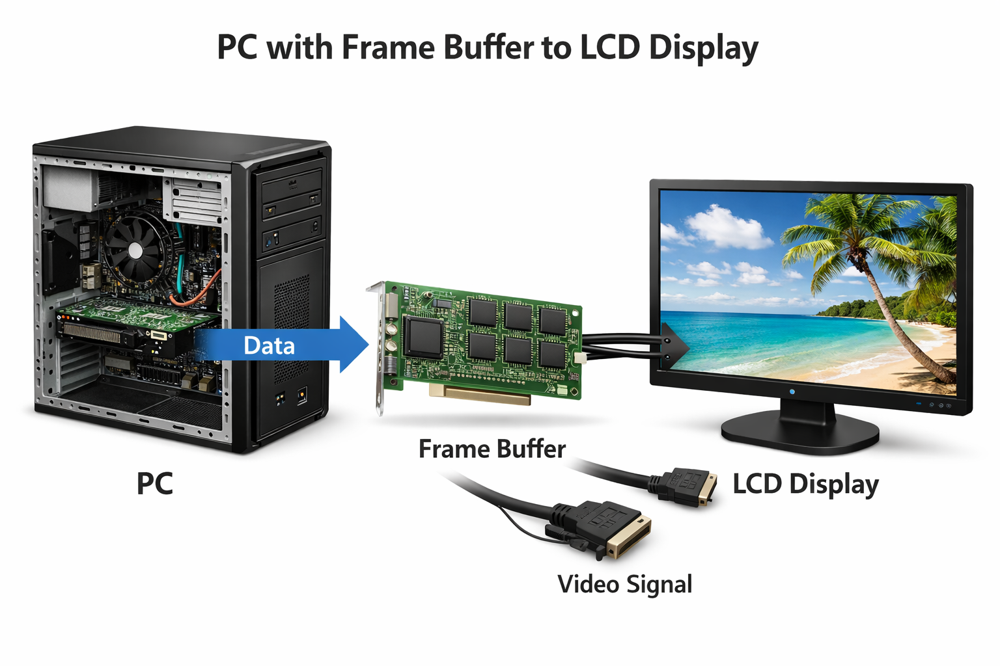
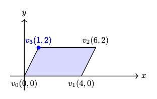
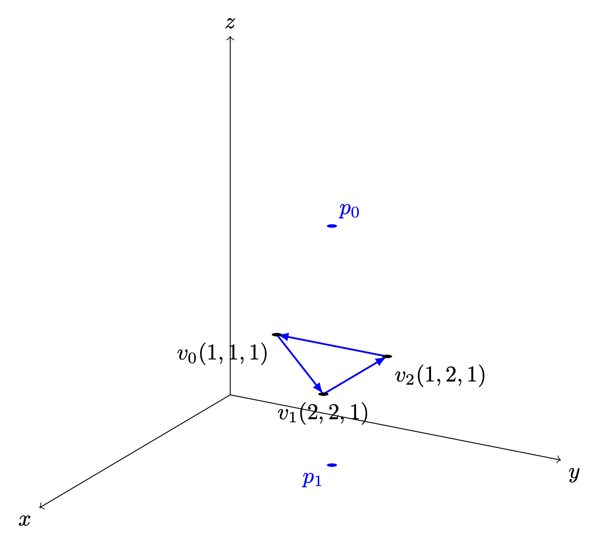
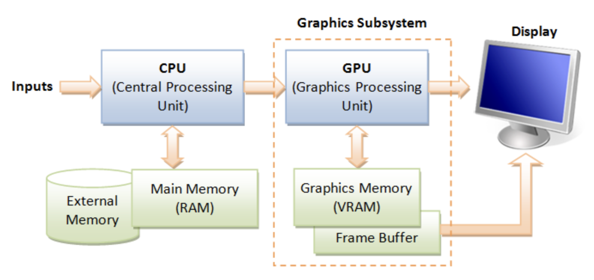
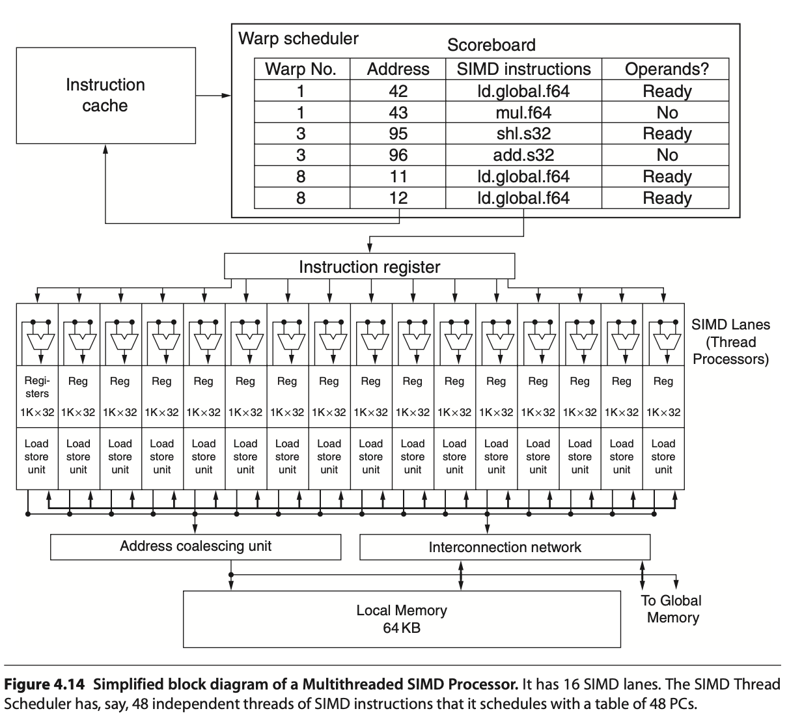
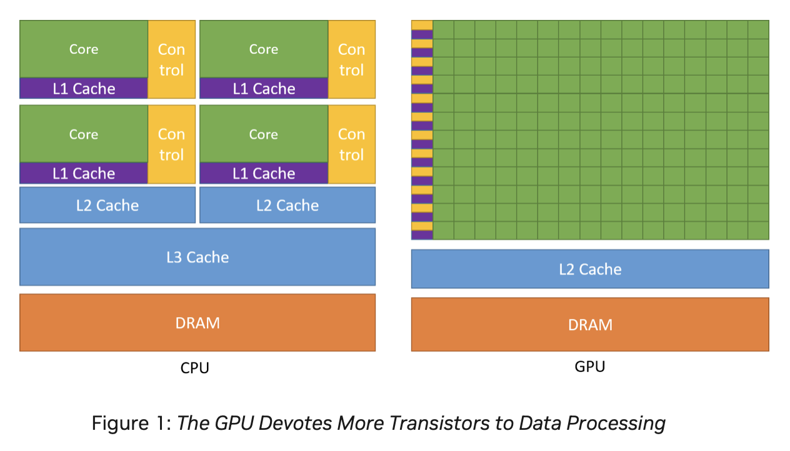

.. _sec-gpu:

The Concept of GPU Compiler
===========================

.. contents::
   :local:
   :depth: 4

Basically, a CPU is a SISD (Single Instruction Single Data) architecture in each
core. The multimedia instructions in CPUs are smaller-scale forms of SIMD (Single
Instruction Multiple Data), while GPUs are large-scale SIMD processors, capable of
coloring millions of image pixels in just a few milliseconds.

Since 2D and 3D graphic processing offers great potential for parallel data
processing, GPU hardware typically includes tens of thousands of functional units
per chip, as seen in products by NVIDIA and other manufacturers.

This chapter provides an overview of how 3D animation is created and executed on
a CPU+GPU system. Following that, it introduces GPU compilers and hardware
features relevant to graphics applications. Finally, it explains how GPUs have
taken on more computational tasks traditionally handled by CPUs, through the
GPGPU (General-Purpose computing on Graphics Processing Units) concept and the
emergence of related standards.

Website: Basic Theory of 3D Graphics with OpenGL [#cg_basictheory]_.

Concept in Graphics and Systems
-------------------------------

.. _three-d-model:

3D Modeling
***********

By creating 3D models with triangles or quads on a surface, the model is formed
using a polygon mesh [#polygon]_. This mesh consists of all the vertices shown in
the first image as :numref:`modeling1`.

.. _modeling1: 
.. figure:: ../Fig/gpu/modeling1.png
  :align: center
  :scale: 80 %

  Creating 3D model and texturing

After applying smooth shading [#polygon]_, the vertices and edge lines are
covered with color (or the edges are visually removed — **edges never actually 
have black outlines**). As a result, the model appears much smoother 
[#shading]_.

Furthermore, after texturing (texture mapping), the model looks even more
realistic [#texturemapping]_.

.. _animation:

Animation
^^^^^^^^^

★ Animation Layers: High → Low

This breakdown organizes animation systems from the **highest gameplay
logic** down to the **lowest GPU skinning**, and clearly marks which
parts are controlled by the **user** and which parts are handled by the
**3D engine**.

1. Gameplay Animation Logic (High Level): set by user (game developer)

See video here [#animation-state-video]_.

**Examples**

- Play "walk" when speed > 0.1
- Trigger "jump" on button press
- Switch to "attack" when enemy detected
- Blend run when velocity increases

**Where it lives**

Live in **gameplay scripts** (C#, Blueprints, GDScript, Python)

- Unity: C# scripts
- Unreal: Blueprints or C++
- Godot: GDScript
- ThinMatrix: Java (no scripting layer)

This layer decides *when* animations should play.

2. Animation State Machine / Animation Graph: set by user (game developer)

**Examples**

- Idle → Walk → Run transitions
- Blend trees
- Animation layers (upper body, lower body)
- Animation parameters (speed, grounded, direction)

**Where it lives**

- Unity: Animator Controller
- Unreal: Animation Blueprint
- Godot: AnimationTree
- ThinMatrix: *Does not have this layer*

This layer controls *which* animation clip is active and how transitions
occur.

3. Animation Clip Playback Layer: user chooses

An **animation clip** is **a sequence of keyframes** over a period of time that 
represents a **motion or action**.

**Examples**

- Play animation clip
- Loop animation
- Set animation speed
- Crossfade between clips
- Blend two clips together

**Who sets it?**  
User chooses which clip to play.

**Who implements it?**  
Engine handles blending, timing, and playback.

**Where it lives**

- Unity: Mecanim runtime
- Unreal: AnimInstance
- Godot: AnimationPlayer
- ThinMatrix: Java engine code (Animator.java)

This layer executes the user’s choices.

4. Skeleton Animation System (Low Level): 3D engine implements it

**Examples**

- Bone hierarchy
- Keyframe interpolation
- Joint transforms
- Matrix palette generation
- Pose calculation

**Who sets it?**  
Engine

**Who uses it?**  
User indirectly, by playing animations.

**Where it lives**

- Unity: C++ engine core
- Unreal: C++ engine core
- Godot: C++ engine core
- ThinMatrix: Java engine code (he writes this manually)

This layer performs the mathematical work of animation.

5. GPU Skinning (Lowest Level): 3D engine implements it

**Examples**

- Vertex shader skinning
- Applying bone matrices
- Weighted vertex deformation
- Sending matrices to GPU

**Who sets it?**  
Engine

**Who uses it?**  
User never touches this layer directly (except in custom engines).

**Where it lives**

- Unity: C++ + HLSL
- Unreal: C++ + HLSL
- Godot: C++ + GLSL
- ThinMatrix: GLSL shader he writes manually

This is the final stage where the GPU deforms the mesh.

Full Hierarchy (Summary)

::

    HIGH LEVEL (User)
    ──────────────────────────────────────────────
    1. Gameplay Animation Logic
    2. Animation State Machine / Animation Graph
    3. Animation Clip Playback

    LOW LEVEL (Engine)
    ──────────────────────────────────────────────
    4. Skeleton Animation System
    5. GPU Skinning

Developers only write the highest‑level animation logic and designed 
transitions & blends as shown in :numref:`animation-levels`.
The engine automatically handles all lower‑level animation work.
Like the video [#animation-state-video]_, Jason’s tutorials operate only in 
Level 1 and Level 2:

✔ Level 1 — Scripts

He writes code like:

.. code-block:: c++

   animator.SetFloat("Speed", speed);

✔ Level 2 — State Machine

He configures transitions and parameters.

.. _animation-levels: 
.. graphviz:: ../Fig/gpu/animation-levels.gv
  :caption: Animation levels

ThinMatrix’s engine collapses the top three layers into Java because it
has **no scripting layer** and **no animation graph**, so the user must
modify the engine code directly.

According to the video on ThinMatrix’s skeleton animation [#animation1]_, 
he is sampling the animation clip at different times.
The animation clip already contains: keyframes, bone transforms, timestamps, 
interpolation curves.
All of this comes from Blender’s exported .dae file.
Joints are positioned at different poses at specific times (keyframes), as 
illustrated in :numref:`animationfigure`.

.. _animationfigure: 
.. figure:: ../Fig/gpu/animation.png
  :align: center
  :scale: 50 %

  Get time points at keyframes

Although most of 3D game engines are written C++, **ThinMatrix’s engine** is 
100% Java.
In this series of videos, you will see that he writes new Java engine modules, 
edits existing engine code, loads animation data from Blender, interpolates 
keyframes, updates bone matrices and sends them to the GPU.
Because ThinMatrix's engine is **tiny and educational** for engine programmer or
game developer, does not provide Scripting Layer (such as C#, Python, GDScript, 
Blueprints) most commercial 3D engines.
Instead, he modifies ThinMatrix’s Java engine directly, which differs from most
other 3D engines operate.

**Animation flow**

Every modern 3D animation tool comes with its own **built‑in render engine**, 
and often more than one. In 3D game design, **game engines (Unity, Unreal, 
Godot) use real‑time engines** for real-time animation.

**Pipeline: Blender → Engine → OpenGL**

.. code-block:: text

    +------------------+
    |     Blender      |
    |  (Modeling Tool) |
    +------------------+
              |
              |  Exports assets:
              |  - Meshes (.obj, .fbx, .gltf)
              |  - Armatures / bones
              |  - Animations (keyframes)
              |  - Textures (PNG, EXR, TGA)
              v
    +---------------------------+
    |       Game Engine         |
    | (Unity, Unreal, Godot,    |
    |  LWJGL, JOGL, Custom)     |
    +---------------------------+
              |
              |  Engine loads assets:
              |  - Parses mesh data
              |  - Loads skeletons
              |  - Loads animation curves
              |  - Loads materials/shaders
              |
              |  Engine code you write:
              |  - Java (JOGL/LWJGL)
              |  - C++ (custom engine)
              |  - C# (Unity)
              |  - GDScript/C++ (Godot)
              |
              |  Engine compiles shaders:
              |  - GLSL (OpenGL)
              |  - HLSL (DirectX)
              |  - SPIR-V (Vulkan)
              v
    +---------------------------+
    |         Renderer          |
    |    (OpenGL / Vulkan /     |
    |     DirectX / Metal)      |
    +---------------------------+
              |
              |  GPU receives:
              |  - Vertex buffers
              |  - Index buffers
              |  - Textures
              |  - Uniforms (matrices, bones)
              |  - Compiled shaders
              v
    +---------------------------+
    |            GPU            |
    | (Vertex Shader → Raster → |
    |  Fragment Shader → Frame) |
    +---------------------------+
              |
              v
    +---------------------------+
    |        Final Image        |
    |     (On your screen)      |
    +---------------------------+

.. note::

   3D modeling tools do store animation and movement data 
     — but they do NOT store any rendering or API‑specific code. 

   Game engines do store animation data
     — but programmers still write the logic that plays, blends, 
     and controls those animations.

.. _movement:

**Animation Data vs. Movement Speed in Games**

List the animation types in a table for inclusion in this book.

.. list-table:: Animation Types
   :header-rows: 1
   :widths: 20 25 35 20

   * - **Animation Type**
     - What Moves
     - Description
     - GPU Requirement
   * - **Transform Animation**
     - Object transform
     - The entire mesh moves as a rigid body using
       position, rotation, and scale. No vertex-level
       deformation occurs.
     - Optional (fixed-function or shaders)
   * - **Skinning**
     - Vertex positions
     - Vertices are blended by bone matrices to deform
       the mesh (arms bending, legs walking). Requires
       per-vertex matrix blending.
     - Requires shaders
   * - **Morph Target Animation**
     - Vertex positions
     - Vertices blend between multiple stored shapes
       (facial expressions, muscle bulges). Uses morph
       weights to interpolate.
     - Requires shaders
   * - **Procedural Deformation**
     - Vertex positions
     - Vertices are modified by mathematical functions
       (wind, waves, noise, squash-and-stretch). Driven
       by time or simulation parameters.
     - Requires shaders

**Example: Walking Animation: Skinning + Transform Animation**

When a character walks in a game, the animation is produced by two
different systems working together:

1. **Skinning (Bone Animation)**
   Skinning is responsible for deforming the mesh. It drives the motion
   of limbs such as legs, arms, spine, and feet. Without skinning, the
   character would move as a rigid statue with no bending or articulation.

2. **Transform Animation (Rigid-Body Movement)**
   Transform animation moves the entire character through the world.
   This includes translation, rotation, and root motion. Without transform
   animation, the character would walk in place without actually moving
   forward.

   - Root bone: the bone that represents the entire object’s transform — 
     the top‑most parent of the hierarchy. An example of person:

.. code-block:: text

    Root
     └─ Pelvis
         ├─ Spine
         │   ├─ Chest
         │   │   ├─ Neck
         │   │   │   └─ Head
         │   │   └─ Shoulders
         │   │       ├─ Arm_L
         │   │       └─ Arm_R
         ├─ Leg_L
         └─ Leg_R

Both systems are required to create a complete walking animation:

- **Skinning** provides the internal limb motion.
- **Transform animation** provides the external world-space movement.

Together, they produce the final effect of a character walking naturally
through the environment.

The following explains what animation data 3D modeling tools store, what
game engines store, and what programmers must implement manually. It also
clarifies the relationship between animation curves, movement speed, and
gameplay logic.

1. What 3D Modeling Tools Actually Store

3D modeling and animation tools such as Blender, Maya, and 3ds Max store
**animation data**, not gameplay logic.

They **do store**:

- Keyframes (frame 0, frame 10, frame 24, etc.)
- Bone transforms at each keyframe
- Interpolation curves (Bezier, linear, quaternion)
- Animation duration (e.g., 1.2 seconds)
- Frame rate (e.g., 24 fps)
- Skeleton hierarchy
- Skin weights (vertex-to-bone influences)
- Optional root bone motion (displacement over time)

Modeling tools produce **data**, not rendering code and not gameplay rules in 
OpenGL/DirectX code.

Example:

.. code-block:: text

  Bone "Arm" rotation at frame 0 = (0°, 0°, 0°)
  Bone "Arm" rotation at frame 10 = (45°, 0°, 0°)

2. What Game Engines Actually Store

The **engine’s built‑in C++ renderer handles all OpenGL/Vulkan/Metal calls 
automatically**.
Game engines such as Unity, Unreal Engine, Godot, or custom engines store
and manage animation data, but still do not define gameplay movement speed.

They **do store**:

- Animation clips
- State machines (Idle → Walk → Run)
- Blend trees
- Transition rules
- Animation events
- Curves for rotation, scaling, and root motion

Again: data, not OpenGL/DirectX code.

Example:

.. code-block:: text

  If speed < 0.1 → Idle
  If speed > 0.1 → Walk
  If speed > 4.0 → Run

This is engine logic, not GPU code.

Game engines interpret animation data but rely on programmer logic to
control how characters move in the world.

3. What Programmers Must Implement

Programmers write the **logic** that uses animation data to move objects.

Examples:

In Unity (C#)

.. code-block:: csharp

  animator.SetFloat("speed", playerVelocity);
  ...
  float speed = 3.5f;
  transform.position += direction * speed * Time.deltaTime;

In a custom engine (C++/OpenGL)

.. code-block:: c++

  shader.setMatrix("boneMatrices[0]", boneMatrix);
  ...
  float velocity = 3.5f;
  position += velocity * deltaTime;

In JOGL/LWJGL (Java)

.. code-block:: java

  glUniformMatrix4fv(boneLocation, false, boneMatrixBuffer);
  ...
  float velocity = 3.5f;
  position += velocity * deltaTime;

Programmers write:

Programmers implement:

- Movement speed

  - E.g. **Set the value for speed or velocity as the code above.**

- Acceleration and deceleration
- Physics integration
- AI movement
- Player input
- Animation blending logic
- Uploading bone matrices to the GPU
- GLSL shader code for skinning

Animation data is *used* by code, not replaced by it.

4. Root Motion vs. Movement Speed

Some animations include **root motion**, where the root bone moves forward
during a walk cycle. Modeling tools export this as bone displacement over
time, but they still do **not** define speed.

Example:

If the root bone moves 1 meter in 0.5 seconds, the engine can compute:

::

    speed = 1m / 0.5s = 2 m/s

However:

- Blender does not store "2 m/s"
- The engine derives speed from displacement
- Programmers decide whether to use root motion or in-place animation

5. Summary Table

+------------------------+----------------------+----------------------+---------------------------+
| Concept                | Stored in Blender?   | Stored in Engine?    | Controlled by Programmer? |
+========================+======================+======================+===========================+
| Keyframes              | Yes                  | Yes                  | No                        |
+------------------------+----------------------+----------------------+---------------------------+
| Bone transforms        | Yes                  | Yes                  | No                        |
+------------------------+----------------------+----------------------+---------------------------+
| Animation length       | Yes                  | Yes                  | No                        |
+------------------------+----------------------+----------------------+---------------------------+
| Movement speed         | No                   | Yes (derived)        | Yes                       |
+------------------------+----------------------+----------------------+---------------------------+
| Physics movement       | No                   | Yes                  | Yes                       |
+------------------------+----------------------+----------------------+---------------------------+
| AI movement            | No                   | Yes                  | Yes                       |
+------------------------+----------------------+----------------------+---------------------------+

6. Final Clarification

- **3D modeling tools store animation timing, not gameplay speed.**
- **Game engines store animation clips, not movement speed.**
- **Programmers control movement speed, physics, and gameplay behavior.**
- **No tool generates JOGL/OpenGL/Vulkan/DirectX code.**
- **All rendering API calls are written by engine developers or by you in a 
  custom engine.**

**Example for accelerating playing**

Animation Speed vs Engine Rendering (5× Speed)

The following table shows how animation playback, movement speed, and GPU
rendering interact when the gameplay speed is multiplied by five. The
animation remains 24 fps internally, but its playback time advances five
times faster. The GPU continues to render at 60 fps and samples the
animation at the current time.

+--------------------------+----------------------+---------------------------+
| Property                 | Original Value       | After 5× Speed            |
+==========================+======================+===========================+
| Animation FPS (baked)    | 24 fps               | 24 fps (unchanged)        |
+--------------------------+----------------------+---------------------------+
| Animation Playback Speed | 1×                   | 5×                        |
+--------------------------+----------------------+---------------------------+
| Steps per Second         | 6 steps/sec          | 30 steps/sec              |
+--------------------------+----------------------+---------------------------+
| Movement Speed           | 6 m/sec              | 30 m/sec                  |
+--------------------------+----------------------+---------------------------+
| GPU Rendering FPS        | 60 fps               | 60 fps                    |
+--------------------------+----------------------+---------------------------+
| Engine Playing Frames    | Samples animation    | Samples animation at      |
| (What GPU Displays)      | at 60 fps            | 60 fps (skips/interpolates|
|                          |                      | intermediate animation    |
|                          |                      | frames)                   |
+--------------------------+----------------------+---------------------------+

Summary:

- The animation does **not** become 120 fps; it is simply played 5× faster.
- The runner appears to take **30 steps per second** and move **30 meters per
  second**.
- The GPU still renders **60 frames per second**.
- The engine **samples** the animation at each rendered frame, so it
  effectively displays every fifth animation sample, using interpolation
  for smoothness. For this case, it may display **1 out of 2 animation frames**
  from 3D modeling.

.. _node-editor:

Node-Editor (shaders generator)
^^^^^^^^^^^^^^^^^^^^^^^^^^^^^^^

-  3D animation tools (Blender, Maya, Houdini) use render engines and node 
   editors for materials, lighting, and effects.
-  Game engines (Unity, Unreal, Godot) use real‑time engines and node editors 
   for shaders, VFX, and sometimes logic.

A node editor defines the **entire material** that is applied to the
surface of a 3D object. The shader generated from the node graph runs on
**every pixel** (fragment) of the object's surface. In this sense, the
node editor controls the **whole surface**, not only a specific region.

However, the node graph can include **masks**, **textures**, **vertex
colors**, or **procedural patterns** that allow the artist to specify
which *parts* of the surface receive a particular effect. These masks do
not limit the shader to only part of the surface; instead, they instruct
the shader how to behave differently across different regions.

Node-Editor
"""""""""""

**Example**

Let’s say you want:

•  rust only on the edges
•  metal everywhere else

In the node editor:

1.  Load a rust texture
2.  Load a metal texture
3.  Use a mask (curvature or hand-painted)
4.  Mix them using a Mix node

The shader still runs on the whole surface, but the mask tells it:

•  “Use rust here”
•  “Use metal here”

In summary:

- The node editor defines the **full material** for the **entire
  surface**.
- Artists can use masks or textures to **target specific areas** within
  that surface.
- The shader still executes globally, but its **output varies** based on
  the mask inputs.

Thus, a node editor controls the whole surface, while masks determine how
different parts of that surface are shaded.

For 3D video game engines,
the only case where mask data is inside the model file is vertex colors.
Everything else lives in textures or material/shader assets.

**Procedural Rust on Edges Using Shader Nodes**

To demonstrate how to create a **rust-on-edges** material using Blender's shader 
node editor as shown in :numref:`node_editor_ex1`. 
The goal is to reproduce the effect commonly used on metal containers: clean 
metal on flat surfaces and rust accumulation along exposed edges.

.. _node_editor_ex1: 
.. figure:: ../Fig/gpu/node-editor-ex1.png
   :align: center
   :scale: 50%
   :alt: Full-width image

   An example to Rust on Edges Using Shader Nodes [#node-editor-web1]_.

The technique relies on three core ideas:

1. Detecting edges using the *Bevel* or *Pointiness* attribute.
2. Creating a mask that isolates only the worn edges.
3. Blending a rust material with a metal material using that mask.

This workflow is fully procedural and does not require painting or
external textures.

Procedural Edge Wear Node Graph (ASCII Diagram) to create 
:numref:`node_editor_ex1` in video [#node-editor-web1]_ includes 
1. edge detection, 2. mask breakup, 3. material creation, and 4. final blending 
as follows:

::

    +================================================================+
    |                    1.  EDGE DETECTION BLOCK                    |
    |                     (Generating an Edge-Wear Mask)             |
    +================================================================+

       Geometry Node
            |
            |----> Pointiness (Cycles only)
            |
       Bevel Node (Eevee/Cycles)
            Radius = 0.01–0.03
            |
            v
       ColorRamp (Sharpen edge highlight)
            |
            v
       Edge Mask (base convex-edge detection)

    +================================================================+
    |              2. MASK BREAKUP / RANDOMIZATION BLOCK             |
    |               (Refining the Mask With Noise Textures)          |
    +================================================================+

       Noise Texture (Scale 5–15)
            |
            v
       ColorRamp (optional shaping)
            |
            v
       Multiply Node  <---------------- Edge Mask
            |
            v
       ColorRamp (final threshold control)
            |
            v
       Final Edge Wear Mask

    material creation
    +================================================================+
    |                      3. MATERIAL BLOCK                         |
    |                       (Base Material Structure)                |
    +================================================================+

       METAL MATERIAL:
            Principled BSDF
            Metallic = 1.0
            Roughness = 0.2–0.4

       RUST MATERIAL:
            Principled BSDF
            Base Color = orange/brown
            Roughness = 0.7–1.0
            Optional Noise → color variation
            Optional Bump → rust height

    +================================================================+
    |                      4. BLENDING BLOCK                         |
    |                       (Blending Metal and Rust Materials)      |
    +================================================================+

       Metal BSDF ----------------------+
                                        |
                                        v
                                   Mix Shader ----> Material Output
                                        ^
                                        |
       Rust BSDF -----------------------+
                                        |
                                        |
                             Final Edge Wear Mask (Fac)

Code Generation from Node-Editor
"""""""""""""""""""""""""""""""""

Node-based shader editors are visual tools used in modern game engines
and DCC (Digital Content Creation) software. They allow users to build
shaders by connecting nodes instead of writing GLSL, HLSL, or Metal code
manually. These editors **do generate shader code automatically**.

1. Node-Based Editors Do Generate Shader Code

Node-based shader editors such as:

- Unity Shader Graph
- Unreal Engine Material Editor
- Godot Visual Shader Editor
- Blender Shader Nodes (for Eevee/Cycles)

all **compile the visual node graph into real shader code**.

Depending on the engine, the generated code may be:

- GLSL (OpenGL / Vulkan)
- HLSL (DirectX)
- MSL (Metal)
- SPIR-V (Vulkan intermediate format)

The generated code is usually not shown to the user, but it is compiled
and sent to the GPU at runtime.

2. How Users Generate Shader Code with Nodes

The workflow for generating shader code through a node editor typically
looks like this:

1. The user opens the shader editor.
2. The user creates nodes representing:

   - math operations (add, multiply, dot product)
   - texture sampling

     - Determine FS.

   - lighting functions
   - color adjustments
   - UV transformations

3. The user connects nodes visually to define the shader logic.

   - Defines surface color,lighting, and texture sampling → **determine FS**.
   - For simple deformations (waves, wind, dissolve) → **determine the VS**.
   - Generate both **TCS and TES** code for **displacement and subdivision 
     control**.
   - **GS** code is typically **written manually** by  graphics programmers
     since **primitives culling and clipping** are not related with model 
     resolution and texture materials.

4. The engine converts the node graph into an internal shader
   representation.
5. The engine compiles this representation into platform-specific shader
   code (GLSL, HLSL, MSL, or SPIR-V).
6. The compiled shader is sent to the GPU and used for rendering.

The user never writes the shader code directly; the editor generates it
automatically.

3. Who Is the "User" of Node-Based Editors?

The typical users of node-based shader editors are:

**Graphics Designers / Technical Artists**
    - Primary users.
    - They create visual effects, materials, and surface shaders.
    - They usually do not write GLSL or HLSL manually.
    - Node editors allow them to work visually without programming.

**Software Programmers / Graphics Programmers**
    - Secondary users.
    - They may create custom nodes or extend the shader system.
    - They write low-level shader code when needed.
    - They integrate the generated shaders into the rendering pipeline.

In most workflows:

- **Graphics designers** build the shader visually.
- **The engine** generates the shader code.
- **Programmers** handle advanced logic, optimization, or custom nodes.

4. Summary

- Node-based shader editors **do generate shader code** automatically.
- Users generate shaders by connecting visual nodes rather than writing
  GLSL/HLSL manually.
- The primary "user" is the **graphics designer or technical artist**.
- Programmers support the system by writing custom nodes or low-level
  shaders when needed.

The shaders introduction is illustrated in the next section :ref:`opengl`.

3D Modeling Tools
^^^^^^^^^^^^^^^^^

Every CAD software manufacturer, such as AutoDesk and Blender, has their own
proprietary format. To solve interoperability problems, neutral or open source
formats were created as intermediate formats to convert between proprietary
formats.

Naturally, these neutral formats have become very popular. Two famous examples
are STL (with a `.STL` extension) and COLLADA (with a `.DAE` extension). Below
is a list showing 3D file formats along with their types.

.. table:: 3D file formats [#3dfmt]_

  ==============  ==================
  3D file format  Type
  ==============  ==================
  STL             Neutral
  OBJ             ASCII variant is neutral, binary variant is proprietary
  FBX             Proprietary
  COLLADA         Neutral
  3DS             Proprietary
  IGES            Neutral
  STEP            Neutral
  VRML/X3D        Neutral
  ==============  ==================

The four key features a 3D file can store include the model’s geometry, the 
model’s surface texture, scene details, and animation of the model [#3dfmt]_.

Specifically, they can store details about four key features of a 3D model, 
though it’s worth bearing in mind that you may not always take advantage of 
all four features in all projects, and not all file formats support all four 
features!

3D printer applications do not to support animation. CAD and CAM such as
designing airplane does not need feature of scene details.

DAE (Collada) appeared in the video animation above.
Collada files  belong to a neutral format used heavily in the video game and 
film industries. It’s managed by the non-profit technology consortium, the 
Khronos Group.

The file extension for the Collada format is .dae.
The Collada format stores data using the XML mark-up language.

The original intention behind the Collada format was to become a standard among 
3D file formats. Indeed, in 2013, it was adopted by ISO as a publicly available 
specification, ISO/PAS 17506. As a result, many 3D modeling programs support 
the Collada format.

That said, the consensus is that the Collada format hasn’t kept up with the 
times. It was once used heavily as an interchange format for Autodesk Max/Maya 
in film production, but the industry has now shifted more towards OBJ, FBX, 
and Alembic [#3dfmt]_.

.. _ghast:

Graphics HW and SW Stack
************************

This section provides a more detailed illustration of animation accross the 
software and hardware stacks on both CPU and GPU, and explains how data flows 
between the CPU, the GPU, and each layer of the software stack.

In the previous section :ref:`three-d-model`, described what information 3D 
models store and how this information is used to perform animation.

In the incoming section :ref:`sw-stack` will describe **how each frame is 
generated** to display the **movement animation or skinning effects** using the 
small animation parameters stored in 3D model and sent from CPU.

The the incoming section :ref:`Role and Purpose of Shaders <role-shaders>` will
explain different visual effects can be achieved by **switching shaders** to 
shapplying different materials across frames. 

Reference:

- https://en.wikipedia.org/wiki/Free_and_open-source_graphics_device_driver

HW Block Diagram
^^^^^^^^^^^^^^^^

The block diagram of the Graphic Processing Unit (GPU) is shown in
:numref:`gpu_block_diagram`.

.. _gpu_block_diagram: 
.. figure:: ../Fig/gpu/gpu-block-diagram.png
  :align: center
  :scale: 50 %

  Components of a GPU: GPU has accelerated video decoding and encoding 
  [#wiki-gpu]_

The roles of the CPU and GPU in graphic animation are illustrated in
:numref:`graphic_cpu_gpu`.

.. _graphic_cpu_gpu: 
.. figure:: ../Fig/gpu/graphic-cpu-gpu.png
  :align: center
  :scale: 70 %

  OpenGL and Vulkan are both rendering APIs. In both cases, the GPU executes 
  shaders, while the CPU executes everything else [#ogl-cpu-gpu]_.

- GPU can't directly read user input from, say, keyboard, mouse, gamepad, or 
  play audio, or load files from a hard drive, or anything like that. In this
  situation, cannot let GPU handle the animation work [#cpu-gpu-role]_. 

- A graphics driver consists of an implementation of the OpenGL state machine 
  and a compilation stack to compile the shaders into the GPU's machine language. 
  This compilation, as well as pretty much anything else, is executed on the CPU, 
  then the compiled shaders are sent to the GPU and are executed by it. 
  (SDL = Simple DirectMedia Layer) [#mesawiki]_.

.. _graphic_gpu_csf: 
.. figure:: ../Fig/gpu/graphic-gpu-csf.png
  :align: center
  :scale: 70 %

  MCU and specific HW circuits to speedup the processing of CSF 
  (Command Stream Fronted) [#csf]_.

The GPU driver write command and data from CPU to GPU's system memory through 
PCIe. These commands are called Command Stream Fronted (CSF) in the memory of 
GPU. A chipset of GPU includes tens of SIMD processors (cores). In order to
speedup the GPU driver's processing, the CSF is designed to a simpler form.
As result, GPU chipset include MCU (Micro Chip Unit) and specfic HW to transfer
the CSF into individual data structure for each SIMD processor to execute as 
:numref:`graphic_gpu_csf`. The firmware version of MCU is updated by MCU itself
usually.

.. _sw-stack:

SW Stack and Data Flow
^^^^^^^^^^^^^^^^^^^^^^

The driver runs on the CPU side as shown in :numref:`graphic_sw_stack`.  
The OpenGL API eventually calls the driver's functions, and the driver  
executes these functions by issuing commands to the GPU hardware and/or  
sending data to the GPU.  

Even so, the GPU’s rendering work, which uses data such as 3D vertices and  
colors sent from the CPU and stored in GPU or shared memory, consumes  
more computing power than the CPU.

.. _graphic_sw_stack: 
.. graphviz:: ../Fig/gpu/graphic-sw-stack.gv
  :caption: Graphic SW Stack and data flow in initializing graphic model

✅  As section :ref:`animation` and :numref:`graphic_sw_stack`. 
The **game engine’s built‑in C++ renderer handles all OpenGL/Vulkan/Metal 
calls automatically**. 
Users set the value for speed, velocity, ..., etc, customize the animation
logic.

After the user creates a skeleton and textures  
for each model and sets keyframe times using a 3D modeling tool, users can  
write **gameplay scripts** (**Java code**, C#, Blueprints, GDScript, Python, 
etc.) to tell the engine to play animations [#joglwiki]_.

As section :ref:`node-editor`, the skin materials created by Graphics Designers 
/ Technical Artists and secondly created by Software Programmers / Graphics 
Programmers using the tool Node-Editor (shaders generator).
As result, shaders generated from tool Node-Editor (shaders generator).

Shaders may call built-in functions written in Compute Shaders, SPIR-V, or  
LLVM-IR. LLVM `libclc` is a project for OpenCL built-in functions, which can  
also be used in OpenGL [#libclc]_. Like CPU built-ins, new GPU ISAs or  
architectures must implement their own built-ins or port them from open source  
projects like `libclc`.

The 3D model on the CPU performs these animations in movement and others by 
computing each frame from the stored keyframes, as illustrated in animation 
section :ref:`animation`.

.. _graphic_sw_stack-2: 
.. graphviz:: ../Fig/gpu/graphic-sw-stack-2.gv
  :caption: Graphic SW Stack and data flow in rendering

The per-frame data is not the full set of vertices, but rather a small set of
animation parameters named **Uniform Updates** as appeared in 
:numref:`graphic_sw_stack-2`, which are described later.

.. note::

   **Bone matrices** determine the positions of triangles within a 3D model 
   during animation.
   This bone transformation data is much **smaller** than the complete mesh of 
   the 3D model.
   We will provide an example and explain this in more detail in the 
   :ref:`animation-ex` section.
   Because this transformation data is small and constant across all shader 
   pipeline stages, it is stored in the GPU’s global memory and can be cached in 
   the **uniform/constant cache** for performance, as illustrated in 
   :numref:`mem-hierarchy` of :ref:`sec-mem-hierarchy` section.
 
The CPU updates only these small animation parameters and issues draw command to 
the GPU server side. 

.. _in-out-rendering: 
.. graphviz:: ../Fig/gpu/in-out-rendering.gv
  :caption: The input and output for GPU rendering

Next, the 3D Rendering-pipeline is illustrated in :numref:`in-out-rendering`.

The shape of object data are stored in the form of VAOs (Vertex Array Objects) in  
OpenGL. This will be explained in a later :ref:`section OpenGL <opengl>`.
Additionally, OpenGL provides VBOs (Vertex Buffer Objects), which allow  
vertex array data to be stored in high-performance graphics memory on the  
server side GPU and enable efficient data transfer [#vbo]_ [#classorvbo]_.

After GPU receives the **Uniform Updates** from CPU, it performs the 
computationally intensive per‑vertex work within the rendering pipeline to 
generate the **final pixel values** for **each frame** displayed on screen.
These final pixel values are collectively referred to the 
**Rendered Image**.

✅  “**Rendered Image**” = the final per‑frame output written into the 
framebuffer.
The **Uniform Updates** will be described in detail later.

✅ CPU only updates small animation parameters named **Uniform Updates** as
appeared in :numref:`graphic_sw_stack-2`; GPU computes the heavy per‑vertex work.

As mentioned in the previous section on :ref:`animation movement <movement>`, 
3D modeling tools store Keyframes, bone transforms at each keyframe and related 
data, and perform animation based on this information. 

The CPU updates only the **bone** transformation data ..., rather than updating 
the entire vertex or mesh data for each animation frame.
These updates are very small—on the order of kilobytes rather than megabytes.
For each rendered frame, the CPU sends these small updates to the GPU, and the 
**GPU takes over the animation work from the CPU**.
This type of movement animation is called **skinning**, and is illustrated as 
follows:

**Skinning**

Skinning is a vertex deformation technique used to animate a mesh by attaching
its vertices to a hierarchical skeleton (bones). Each vertex stores one or more
bone indices and corresponding weights that describe how strongly each bone
influences that vertex.

During animation, the application updates the bone transformation matrices.
The vertex shader then computes the final vertex position by blending the
transformed positions according to the stored weights. This allows the mesh to
bend, twist, and deform smoothly as the skeleton moves.

Skinning does not create new geometry or smooth the surface topology. It only
transforms the existing vertices of the mesh. Examples include bending an arm,
flapping a wing, or deforming a flexible tube as its bones rotate.

CPU only update high‑level animation state, such as:

-  Current animation time
-  **Bone matrices (small)**
-  **Morph weights**
-  Material parameters
-  Particle emitter settings
-  Global uniforms (camera, lights, etc.)

These are tiny updates — kilobytes, not megabytes.

.. math::

   finalPosition =
   \sum_{i=0}^{N-1}
   \mathbf{weight}_i \left( \mathbf{boneMatrix}_i \cdot originalPosition \right)

In practice (real engines): the weights are normalized so the sum = 1.0 
:math:`\Rightarrow \sum_{i=0}^{N-1}\mathbf{weight}_i = 1.0`

Example: Bending an Arm

Imagine a character’s arm mesh.  
Each vertex in the elbow area has weights like:

-  70% influenced by upper‑arm bone
-  30% influenced by lower‑arm bone

When the elbow bends:

-  Upper‑arm bone rotates
-  Lower‑arm bone rotates
-  GPU blends the influence
-  The elbow area deforms smoothly

This is skinning.

✅  After the GPU animation, the color pixels are write to framebuffer 
(video memory). The display device (monitor, LCD, OLED, etc.) fetches these 
pixels and displays them on the screen. The interface between framebuffer and 
display device is explained in the next section :ref:`display`.

.. _display:

Pixels Displaying
^^^^^^^^^^^^^^^^^

The interface between frame buffer and displaying device is shown as 
:numref:`pc-lcd`.

.. _pc-lcd: 

  PC with Frame Buffer to LCD Display

GPU and screen (monitor, LCD, OLED, etc.) use **VSync, NVIDIA G-SYNC or AMD 
FreeSync** to prevent **screen tearing**, as described below:

.. raw:: latex

   \clearpage

.. _db-vsync: 
.. figure:: ../Fig/gpu/db-vsync.png
  :align: center
  :scale: 50 %

  VSync

.. rubric:: VSync
.. code-block:: text

  No tearing occurs when the GPU and display operate at the same refresh rate,  
  since the GPU refreshes faster than the display as shown below.

                A    B

  GPU      | ----| ----|

  Display  |-----|-----|

              B      A

  Tearing occurs when the GPU has exact refresh cycles but VSync takes  
  one more cycle than the display as shown below.

                A

  GPU      | -----|

  Display  |-----|-----|

              B      A

  To avoid tearing, the GPU runs at half the refresh rate of the display,  
  as shown below.

                A          B

  GPU      | -----|    | -----|

  Display  |-----|-----|-----|-----|

              B      B    A     A

- Double Buffering

  While the display is reading from the frame buffer to display the current 
  frame, we might be updating its contents for the next frame (not necessarily 
  in raster-scan manner). This would result in the so-called tearing, in which 
  the screen shows parts of the old frame and parts of the new frame.
  This could be resolved by using so-called double buffering. Instead of using 
  a single frame buffer, modern GPU uses two of them: a front buffer and a back 
  buffer. The display reads from the front buffer, while we can write the next 
  frame to the back buffer. When we finish, we signal to GPU to swap the front 
  and back buffer (known as buffer swap or page flip).

- VSync

  Double buffering alone does not solve the entire problem, as the buffer swap 
  might occur at an inappropriate time, for example, while the display is in 
  the middle of displaying the old frame. This is resolved via the so-called 
  vertical synchronization (or VSync) at the end of the raster-scan. 
  When we signal to the GPU to do a buffer swap, the GPU will wait till the next
  VSync to perform the actual swap, after the entire current frame is displayed.

  As above text digram.
  The most important point is: When the VSync buffer-swap is enabled, you cannot 
  refresh the display faster than the refresh rate of the display!!! 
  If GPU is capable of producing higher frame rates than the display's 
  refresh rate, then GPU can use fast rate without tearing.
  If GPU has same or less frame rates then display's and you application 
  refreshes at a fixed rate, the resultant refresh rate is 
  likely to be an integral factor of the display's refresh rate, i.e., 1/2, 1/3, 
  1/4, etc. Otherwise it will cause tearing [#cg_basictheory]_.

- NVIDIA G-SYNC and AMD FreeSync

  If your monitor and graphics card both in your customer computer support 
  NVIDIA G-SYNC, you’re in luck. With this technology, a special chip in the 
  display communicates with the graphics card. This lets the monitor vary the 
  refresh rate to match the frame rate of the NVIDIA GTX graphics card, up to 
  the maximum refresh rate of the display. This means that the frames are 
  displayed as soon as they are rendered by the GPU, eliminating screen tearing 
  and reducing stutter for when the frame rate is both higher and lower than 
  the refresh rate of the display. This makes it perfect for situations where 
  the frame rate varies, which happens a lot when gaming. 
  Today, you can even find G-SYNC technology in gaming laptops!

  AMD has a similar solution called FreeSync. However, this doesn’t require a 
  proprietary chip in the monitor. 
  In FreeSync, the AMD Radeon driver, and the display firmware handle the 
  communication. 
  Generally, FreeSync monitors are less expensive than their G-SYNC counterparts,
  but gamers generally prefer G-SYNC over FreeSync as the latter may cause 
  ghosting, where old images leave behind artifacts [#g-sync]_.

.. _role-shaders:

The Role and Purpose of Shaders
^^^^^^^^^^^^^^^^^^^^^^^^^^^^^^^

The flow for 3D/2D graphic processing is shown in :numref:`opengl_flow`.

.. _opengl_flow: 
.. graphviz:: ../Fig/gpu/opengl-flow.gv
  :caption: OpenGL Flow

The compiled shaders are sent to the GPU when you call glLinkProgram().  
That is the moment the driver uploads the compiled shader binaries into 
GPU‑executable form.

The glLinkProgram() is called when you finish preparing a shader program — 
**not when creating a mesh, and not when issuing a draw command**.

When a game actually call `glLinkProgram()` to re-link the shader, the shader 
need to be compiled and load to GPU.

Usually it is happend in game startup, level load, or creating a new shader 
variant (e.g., enabling shadows, fog, skinning).

Games switch shaders constantly — sometimes hundreds of times per frame — 
but they do not re‑link them.

When playing a video game, different materials, effects and rendering passes 
will applying to difference shaders.

Examples of switching shaders:

- When the player enters a snowy biome, ice meshes use the ice shader. 
- The axe blade uses a metal PBR shader. 
  Sparks fly when the axe blade hits stone it switch to particle shader.

Basic geometry in computer graphics
***********************************

This section introduces the fundamental geometry mathematics used in computer 
graphics.  
As discussed in the previous sections, 3D animation primarily based on 
geometric representations such as meshes (vertices) and surface discriptions
including textures, materials, shaders, and lighting models created in 3D 
content creation tools.
Consequently, vertex tranformations and lighting-based color computations form 
the mathematical foundation of modern computer graphics and animation.

The complete concept can be found in the book *Computer Graphics: Principles  
and Practice, 3rd Edition*, authored by John F. et al. However, the book  
contains over a thousand pages.

It is very comprehensive and may take considerable time to understand all the  
details.

Color
^^^^^

- Additive colors in light are shown in :numref:`additive-colors`  
  [#additive-colors-wiki]_ [#additive-colors-ytube]_.

- In the case of paints, additive colors produce shades and become light gray  
  due to the addition of darker pigments [#additive-colors-shade]_.

.. _additive-colors: 
.. figure:: ../Fig/gpu/additive-colors.png
  :align: center
  :scale: 50 %

  Additive colors in light

.. note:: **Additive colors**

   I know it doesn't match human intuition. However, additive RGB colors in  
   light combine to produce white light, while additive RGB in paints result in  
   light gray paint. This makes sense because light has no shade. This result  
   stems from the way human eyes perceive color. Without light, no color can be  
   sensed by the eyes.

   Computer engineers should understand that exploring the underlying reasons  
   falls into the realms of physics or the biology of the human eye structure.

.. _transformation:

Transformation
^^^^^^^^^^^^^^

Overview

The tranformation matrices have been taught in high school and college.
However this mathematical details are not always retained clearly in memory.
The following section reviews the parts relevant to graphics rendering.

In both 2D and 3D graphics, every object transformation is performed by
multiplying the object's vertex coordinates by one or more **transformation
matrices**. Modern OpenGL uses **homogeneous coordinates** and **4×4 matrices**
to unify translation, rotation, scaling, projection, and even animation
(skinning) into a single mathematical framework.

A vertex in 3D is represented as:

.. math::

   \mathbf{v} =
   \begin{bmatrix}
   x \\ y \\ z \\ 1
   \end{bmatrix}

A transformation is applied by matrix multiplication:

.. math::

   \mathbf{v}' = M \mathbf{v}

Multiple transformations are combined by multiplying matrices:

.. math::

   \mathbf{v}' = P \, V \, M \, \mathbf{v}

Where:

- ``M`` = Model matrix (object → world)
- ``V`` = View matrix (world → camera)
- ``P`` = Projection matrix (camera → clip space)

This is the core of the OpenGL rendering pipeline, as shown in 
:numref:`trans_steps`.

.. _trans_steps: 
.. figure:: ../Fig/gpu/trans-steps.png
  :align: center
  :scale: 50 %

  Cooridinates Transform Pipeline [#cg_basictheory]_

- Model space: The is the vertices position mentioned under :ref:`Root bone in 
  Animation flow <movement>`. All vertex coordinates are calcuated relative to the
  root bone.
- Model Rranform: ``M`` = Model matrix (object → world). This represents the 
  vertex positions mentioned under :ref:`Transform Animation in Animation flow 
  <movement>`.

Details for :numref:`trans_steps` can be found on "4.  Vertex Processing" of 
the website [#cg_basictheory]_.

Transformation Matrices [#wiki-transformation]_

- Translation: Moves an object in 3D space.

  :math:`T(x,y,z)=\begin{bmatrix}1&0&0&x\\0&1&0&y\\0&0&1&z\\0&0&0&1\end{bmatrix}
  \begin{bmatrix}X\\Y\\Z\\1\end{bmatrix}
  =
  \begin{bmatrix}X+x\\Y+y\\Z+z\\1\end{bmatrix}`

- Scaling: Resizes an object.

  :math:`S(s_x,s_y,s_z)=\begin{bmatrix}s_x&0&0&0\\0&s_y&0&0\\0&0&s_z&0\\0&0&0&1\end{bmatrix}
  \begin{bmatrix}X\\Y\\Z\\1\end{bmatrix}
  =
  \begin{bmatrix}s_x X\\s_y Y\\s_z Z\\1\end{bmatrix}`

- Rotation X: Rotates around the X-axis.

  :math:`R_x(\theta)=\begin{bmatrix}1&0&0&0\\0&\cos\theta&-\sin\theta&0\\0&\sin\theta&\cos\theta&0\\0&0&0&1\end{bmatrix}
  \begin{bmatrix}X\\Y\\Z\\1\end{bmatrix}
  =
  \begin{bmatrix}X\\Y\cos\theta - Z\sin\theta\\Y\sin\theta + Z\cos\theta\\1\end{bmatrix}`

- Rotation Y: Rotates around the Y-axis.

  :math:`R_y(\theta)=\begin{bmatrix}\cos\theta&0&\sin\theta&0\\0&1&0&0\\-\sin\theta&0&\cos\theta&0\\0&0&0&1\end{bmatrix}
  \begin{bmatrix}X\\Y\\Z\\1\end{bmatrix}
  =
  \begin{bmatrix}X\cos\theta + Z\sin\theta\\Y\\-X\sin\theta + Z\cos\theta\\1\end{bmatrix}`

- Rotation Z: Rotates around the Z-axis.

  :math:`R_z(\theta)=\begin{bmatrix}\cos\theta&-\sin\theta&0&0\\\sin\theta&\cos\theta&0&0\\0&0&1&0\\0&0&0&1\end{bmatrix}
  \begin{bmatrix}X\\Y\\Z\\1\end{bmatrix}
  =
  \begin{bmatrix}X\cos\theta - Y\sin\theta\\X\sin\theta + Y\cos\theta\\Z\\1\end{bmatrix}`

- Shear in X: - Skews geometry along axis X.
 
  :math:`\text{Shear}_X(a,b)=
  \begin{bmatrix}1&a&b&0\\0&1&0&0\\0&0&1&0\\0&0&0&1\end{bmatrix}
  \begin{bmatrix}X\\Y\\Z\\1\end{bmatrix}
  =
  \begin{bmatrix}X + aY + bZ\\Y\\Z\\1\end{bmatrix}`

- Shear in Y: Skews geometry along axis Y.

  :math:`\text{Shear}_Y(c,d)=
  \begin{bmatrix}1&0&0&0\\c&1&d&0\\0&0&1&0\\0&0&0&1\end{bmatrix}
  \begin{bmatrix}X\\Y\\Z\\1\end{bmatrix}
  =
  \begin{bmatrix}X\\cX + Y + dZ\\Z\\1\end{bmatrix}`

- Shear in Z: Skews geometry along axis Z.

  :math:`\text{Shear}_Z(e,f)=
  \begin{bmatrix}1&0&0&0\\0&1&0&0\\e&f&1&0\\0&0&0&1\end{bmatrix}
  \begin{bmatrix}X\\Y\\Z\\1\end{bmatrix}
  =
  \begin{bmatrix}X\\Y\\eX + fY + Z\\1\end{bmatrix}`

- Reflection: Mirrors across a plane.

  :math:`\text{Reflect}_{XY},\ \text{Reflect}(\mathbf{n})`

The "4.2  Model Transform (or Local Transform, or World Transform)" of on the 
website [#cg_basictheory]_ provides conceptual coverage of transformations.
List the websites that provide proofs of the non-obvious transformation 
formulas below.

**Rotation** 

The mathematical proof is given below.

1. https://en.wikipedia.org/wiki/Rotation_matrix

- Prove the 2D formula and then intutively extend it to 3D along the X, Y, and 
  Z axes [#wiki-rotation]_.

2. Proof in greater details:

https://austinmorlan.com/posts/rotation_matrices/

**Shear (Skew)**

Shear is a skewing transformation as shown in :numref:`shear`.

.. _shear: 
.. figure:: ../Fig/gpu/shear.png
  :align: center
  :scale: 20 %

  3D shear

Shear in X:
plane x = 0 (the YZ‑plane), slides points parallel to the X‑axis.

The mathematical proof is given below.

https://en.wikipedia.org/wiki/Shear_mapping

**Reflection**

Reflection is nothing but a mirror image of an object. 

Reflection across the XY-plane:

.. math::

   \text{Reflect}_{XY} =
   \begin{bmatrix}
   1 & 0 & 0 & 0 \\
   0 & 1 & 0 & 0 \\
   0 & 0 & -1 & 0 \\
   0 & 0 & 0 & 1
   \end{bmatrix}

Reflection across an arbitrary plane with unit normal :math:`\mathbf{n}`:

.. math::

   R = I - 2 \mathbf{n}\mathbf{n}^T

The mathematical proof is given below.

https://www.geeksforgeeks.org/computer-graphics/computer-graphics-reflection-transformation-in-3d/

The following Quaternion Product (Hamilton product) is from the wiki  
[#wiki-quaternion]_ since it is not covered in the book.

.. math::

  \mathbf ij = -ji = k, jk = -kj = i, ki = -ik = j.

.. _cross-product:

Cross Product
^^^^^^^^^^^^^

Both triangles and quads are polygons. So, objects can be formed with  
polygons in both 2D and 3D. The transformation in 2D or 3D is well covered in  
almost every computer graphics book. This section introduces the most  
important concept and method for **determining inner and outer planes**. Then,
a **point or object can be checked for visibility** during 2D or 3D rendering.

Any **area** of a polygon can be calculated by dividing it into triangles or  
quads. The area of a triangle or quad can be calculated using the cross  
product in 3D.

✅ The role of cross product:

In 2D geometry mathematics, :math:`v_0, v_1 and v_2` can form the area of a 
parallelogram as shown in :numref:`rectangle-2d`.
The fourth vertex, :math:`\mathbf{v}_3`, can then be determined to complete the 
parallelogram.

.. _rectangle-2d:

   The area determined by :math:`v_0, v_1, v_2` in 2D

The area of the parallelogram is given by: 

.. math::

  \mathbf a = v_1-v_0, \mathbf b = v_2-v_0

  \Vert \mathbf a \mathsf x \mathbf b \Vert = \Vert a \Vert \Vert b \Vert | 
  sin(\Theta) |

The area of a parallelogram is same in both 2D and 3D.
To extend the definition of the corss product to 3D, all we must additionally 
consider the orientation of the plane, since a plane has two possible faces.

.. math::

  \mathbf a \mathsf x \mathbf b = \Vert a \Vert \Vert b \Vert sin(\Theta) n

- :math:`n` is a unit vector perpendicular to the plane. 
  :math:`\Rightarrow` direction.

As shown in :numref:`parallelogram-3d:left`, the plane determined by 
:math:`v_0, v_1, v_2` with CCW ordering defines a unique orientation. 

The area of the parallelogram remains unchanged after rotation as shown in
:numref:`parallelogram-3d:right`, which means the 
area and plane face determined by extending the definition of cross product from
2D to 3D correctly.

.. list-table::
   :widths: 50 50
   :align: center

   * - .. _parallelogram-3d:left:
       .. figure:: ../Fig/gpu/parallelogram-3d.png
          :scale: 100 %

          The area and plane face determined by :math:`v_0, v_1, v_2` with CCW 
          ordering before rotation :math:`z` axis.

     - .. _parallelogram-3d:right: 
       .. figure:: ../Fig/gpu/parallelogram-3d-2.png
          :scale: 100 %

          The area and plane face determined by :math:`v_0, v_1, v_2` with CCW 
          ordering after rotation :math:`z` axis.

.. _triangle-area:

The area of the triangle is obtained by dividing the parallelogram by 2:

.. math::

  \frac{1}{2} \Vert \mathbf a \mathsf x \mathbf b \Vert \quad \text{... 
  (triangle area)}

✅ Matrix Notation for Cross Product:

The cross product in **2D** is defined by a formula and can be represented  
with matrix notation, as proven here  
[#cross-product-2d-proof]_ [#cross-product-2d-proof2]_.

The cross product in **2D** is defined by a formula and can be represented  
with matrix notation, as proven here  
[#cross-product-2d-proof]_ [#cross-product-2d-proof2]_.

.. math::

  \mathbf a \mathsf x \mathbf b = \Vert a \Vert \Vert b \Vert sin(\Theta)

.. math::

  \mathbf a \mathsf x \mathbf b = 
  \begin{vmatrix}
  \mathbf i & \mathbf j& \mathbf k\\ 
  a_1& a_2& 0\\ 
  b_1& b_2& 0 
  \end{vmatrix} =
  \begin{bmatrix}
  a_1& a_2 \\
  b_1& b_2
  \end{bmatrix}

After the above matrix form is proven, the antisymmetry property  
may be demonstrated as follows:

.. math::

  a \mathsf x b = \mathsf x&
  \begin{bmatrix}
  a \\ 
  b 
  \end{bmatrix} =
  \begin{bmatrix}
  a_1& a_2 \\ 
  b_1& b_2 
  \end{bmatrix} =
  a_1b_2 - a_2b_1 = 

.. math::

  -b_1a_2 - (-b_2a_1) = 
  \begin{bmatrix}
  - b_1& - b_2 \\ 
  a_1& a_2 
  \end{bmatrix} =
  \mathsf x&
  \begin{bmatrix}
  -b \\ 
  a 
  \end{bmatrix} =
  -b \mathsf x a 

✅ Determine the area in a plane:

As described earlier of in this section, three vertices form a parallelogram or
triangle and the area in the plane can be determined since the angle between
:math:`v_1 - v_0` and :math:`v_2 - v_1` satisfied :math:`0 < \Theta < 180^\circ` 
under CCW orientation.
In fact **one single vector :math:`v_1 - v_0` is sufficient** to determine the 
area.
We describle this below.

In 2D, any two points :math:`\text{from } P_i \text{ to } P_{i+1}` can form a  
vector and determine the inner or outer side.  

For example, as shown in :numref:`inward-edge-normals`, :math:`\Theta` is the  
angle from :math:`P_iP_{i+1}` to :math:`P_iP'_{i+1} = 180^\circ`.  

Using the right-hand rule and counter-clockwise order, any vector  
:math:`P_iQ` between :math:`P_iP_{i+1}` and :math:`P_iP'_{i+1}`, with angle  
:math:`\theta` such that :math:`0^\circ < \theta < 180^\circ`, indicates the  
inward direction.

.. _inward-edge-normals: 
.. figure:: ../Fig/gpu/inward-edge-normals.png
  :align: center
  :scale: 50 %

  Inward edge normals

.. _2d-vector-inward: 
.. figure:: ../Fig/gpu/2d-vector-inward.png
  :align: center
  :scale: 50 %

  Inward and outward in 2D for a vector.

Based on this observation, the rule for inward and outward vectors is shown in  
:numref:`inward-edge-normals`. Facing the same direction as a specific vector,  
the left side is inward and the right side is outward, as shown in  
:numref:`2d-vector-inward`.

For each edge :math:`P_i - P_{i+1}`, the inward edge normal is the vector  
:math:`\mathsf{x} \; v_i`; the outward edge normal is  
:math:`- \; \mathsf{x} \; v_i`, where :math:`\mathsf{x} \; v_i` is the  
cross-product of :math:`v_i`, as shown in :numref:`inward-edge-normals`.

A polygon can be created from a set of vertices. Suppose  
:math:`(P_0, P_1, ..., P_n)` defines a polygon. The line segments  
:math:`P_0P_1, P_1P_2`, etc., are the polygon’s edges. The vectors  
:math:`v_0 = P_1 - P_0, v_1 = P_2 - P_1, ..., v_n = P_0 - P_n` represent those  
edges.

Using counter-clockwise ordering, the left side is considered inward. 
Thus, the inward region of a polygon can be determined, as shown in 
:numref:`convex:left` and :numref:`convex:middle`.

.. list-table::
   :widths: 33 34 33
   :align: center

   * - .. _convex:left:
       .. figure:: ../Fig/gpu/triangle-ccw.png
          :scale: 50 %

          Triangle with CCW

     - .. _convex:middle: 
       .. figure:: ../Fig/gpu/hexagon-ccw.png
          :scale: 30 %

          Hexagon with CCW

     - .. _convex:right:
       .. figure:: ../Fig/gpu/triangle-cw.png
          :scale: 50 %

          Triangle with CW

For a convex polygon with vertices listed in counter-clockwise order, the  
inward edge normals point toward the interior of the polygon, and the outward  
edge normals point toward the unbounded exterior. This matches our usual  
intuition.

However, if the polygon vertices are listed in clockwise (CW) order, the interior  
and exterior definitions are reversed. :numref:`convex:right` shows an example
where :math:`P_0, P_1, P_2` are arranged in CW order.

This cross product has an important property: going from :math:`v` to  
:math:`\times v` involves a 90° rotation in the same direction as the  
rotation from the positive x-axis to the positive y-axis.

.. _in-polygon: 
.. figure:: ../Fig/gpu/polygon.png
  :align: center
  :scale: 50 %

  Draw a polygon with vectices counter clockwise

As shown in :numref:`in-polygon`, when drawing a polygon with vectors (lines)  
in counter-clockwise order, the polygon will be formed, and the two sides of  
each vector (line) can be identified [#cgpap]_.

Furthermore, whether a point is inside or outside the polygon can be  
determined.

One simple method to test whether a point lies inside or outside a simple  
polygon is to cast a ray from the point in any fixed direction and count how  
many times it intersects the edges of the polygon.

If the point is outside the polygon, the ray will intersect its edges an even  
number of times. If the point is inside the polygon, it will intersect the  
edges an odd number of times [#wiki-point-in-polygon]_.

.. _3d-cross-product: 
.. figure:: ../Fig/gpu/3d-cross-product.png
  :align: center
  :scale: 50 %

  Cross product definition in 3D

In the same way, by following the counter-clockwise direction to create a  
2D polygon step by step, a 3D polygon can be constructed.

As shown in :numref:`3d-cross-product` from the wiki  
[#cross-product-wiki]_, the inward direction is determined by  
:math:`a \times b < 0`, and the outward direction is determined by  
:math:`a \times b > 0` in OpenGL.

Replacing :math:`a` and :math:`b` with :math:`x` and :math:`y`, as shown in  
:numref:`ogl-pointing-outwards`, the positive Z-axis (:math:`z+`) represents  
the outer surface, while the negative Z-axis (:math:`z-`) represents the  
inner surface [#ogl-point-outwards]_.

.. _ogl-pointing-outwards: 
.. figure:: ../Fig/gpu/ogl-pointing-outwards.png
  :align: center
  :scale: 50 %

  OpenGL pointing outwards, indicating the outer surface (z axis is +)

.. _in-3d-polygon: 
.. figure:: ../Fig/gpu/3d-polygon.png
  :align: center
  :scale: 50 %

  3D polygon with directions on each plane

Reposition each triangle in front of camera and construct it using triangle 
with CCW ordering, as shown in :numref:`convex:left`.
By building every triangle with CCW ordering, we can defined a consistent outer 
surface (front face).
The :numref:`in-3d-polygon` shows an example of a 3D polygon created from 2D  
triangles. The direction of the plane (triangle) is given by the line  
perpendicular to the plane.

Cast a ray from the 3D point along the X-axis and count how many intersections  
with the outer object occur. Depending on the number of intersections along  
each axis (even or odd), you can understan if **the point (or the camara) is i
nside or outside** [#point-in-3d-object]_.

An odd number means inside, and an even number means outside. As shown in  
:numref:`in-3d-object`, points on the line passing through the object satisfy  
this rule.

.. _in-3d-object: 
.. figure:: ../Fig/gpu/in-3d-object.png
  :align: center
  :scale: 50 %

  Point is inside or outside of 3D object

✅ Summary:

Based on these description of this section, this means:

✔️  Each mesh (triangle or primitive) has a fixed “outer” and “inner” side,
determined by CCW ordering in object space.

✔️  By reading these CCW-ordered vertices sequentially, the shape and surface 
orientation of the 3D model can be constructed.

✔️  There is no need to wait for the entire mesh to be received; once three 
CCW-ordered vertices are available, each triangle can be processed correctly
as shown in :numref:`construct-triangle` from the camera position :math:`p_0`.

.. _construct-triangle: 

  A triangle can be constructed as soon as three vertices are received

✔️  When the camera moves to the :math:`p_1` inside an object: CCW ↔ CW 
flips as shown in :numref:`construct-triangle`.

✔️  As shown in :ref:`Trangle Area Calculation <triangle-area>` when
:math:`0 < \Theta < 180^\circ` under CCW orientation, the area of a triangle 
area is given by:

.. math::

   \frac{1}{2} \mathbf \Vert (v_1-v_0) \mathsf x \mathbf (v_2-v_0) \Vert =
   \frac{1}{2} \Vert (v_1-v_0) \Vert \Vert (v_2-v_0) \Vert sin(\Theta)

✔️  Though each triangle can be correctly identified and processed using its
CCW ordering.
As mentioned in :numref:`trans_steps` of section :ref:`transformation`,
the Cooridinates Transform Pipeline maps geometry from Camera Space to 
Clipping Space (Clipping Volume). 
This tranformation significantly simplifies the calculation required
for discarding and clipping triangles, as will be desribed in the next
section :ref:`projection`.

How does OpenGL render (draw) the inner face of a triangle?

OpenGL does NOT determine front/back in world space.

When the camera moves to the inner space of a object:

-  The projection changes
-  The triangle’s screen‑space orientation changes
-  CCW ↔ CW flips
-  So the GPU flips front/back classification

.. rubric:: OpenGL uses counter clockwise and pointing outwards as default [#vbo]_.
.. code-block:: c++

  // unit cube      
  // A cube has 6 sides and each side has 4 vertices, therefore, the total number
  // of vertices is 24 (6 sides * 4 verts), and 72 floats in the vertex array
  // since each vertex has 3 components (x,y,z) (= 24 * 3)
  //    v6----- v5  
  //   /|      /|   
  //  v1------v0|   
  //  | |     | |   
  //  | v7----|-v4  
  //  |/      |/    
  //  v2------v3    

  // vertex position array
  GLfloat vertices[]  = {
     .5f, .5f, .5f,  -.5f, .5f, .5f,  -.5f,-.5f, .5f,  .5f,-.5f, .5f, // v0,v1,v2,v3 (front)
     .5f, .5f, .5f,   .5f,-.5f, .5f,   .5f,-.5f,-.5f,  .5f, .5f,-.5f, // v0,v3,v4,v5 (right)
     .5f, .5f, .5f,   .5f, .5f,-.5f,  -.5f, .5f,-.5f, -.5f, .5f, .5f, // v0,v5,v6,v1 (top)
    -.5f, .5f, .5f,  -.5f, .5f,-.5f,  -.5f,-.5f,-.5f, -.5f,-.5f, .5f, // v1,v6,v7,v2 (left)
    -.5f,-.5f,-.5f,   .5f,-.5f,-.5f,   .5f,-.5f, .5f, -.5f,-.5f, .5f, // v7,v4,v3,v2 (bottom)
     .5f,-.5f,-.5f,  -.5f,-.5f,-.5f,  -.5f, .5f,-.5f,  .5f, .5f,-.5f  // v4,v7,v6,v5 (back)
  };

From the code above, we can see that OpenGL uses counter-clockwise and  
pointing outwards as the default. However, OpenGL provides  
``glFrontFace(GL_CW)`` for clockwise winding [#ogl_frontface]_.

For a group of objects, a scene graph provides better animation support and  
saves memory [#scene-graph-wiki]_.

.. _dot-product:

Dot Product
^^^^^^^^^^^

Dot Product

- Ray–plane (line–plane) intersection
- Determining angles between vectors
- Lighting (Lambertian shading)
- Solving for a point on the intersection line of two planes  
  (because plane equations use dot products)

Described in wiki here:

https://en.wikipedia.org/wiki/Dot_product

✅ As described in the previous section :ref:`cross-product`,
the cross-product is:

.. math::

  \mathbf a = v_1-v_0, \mathbf b = v_2-v_0

  \mathbf a \mathsf x \mathbf b = \Vert a \Vert \Vert b \Vert sin(\Theta) n

- :math:`n` is a unit vector perpendicular to the plane 
  :math:`\Rightarrow` direction.

The dot product definition is:

.. math::

  \mathbf a \mathsf \cdot \mathbf b = \Vert a \Vert \Vert b \Vert cos(\Theta)

✅ Since :math:`n` is the outward normal vector for a CCW-ordered triangle, we 
have:

- :math:`(\mathbf p - v_0) \mathsf \cdot \mathbf n > 0 \Rightarrow \mathbf p` 
  lies on the front (outer) side of the plane.

- :math:`(\mathbf p - v_0) \mathsf \cdot \mathbf n = 0 \Rightarrow \mathbf p` 
  lies on the plane. 

- :math:`(\mathbf p - v_0) \mathsf \cdot \mathbf n < 0 \Rightarrow \mathbf p` 
  lies on the back (inner) side of the plane.

✅ A plane is represented by:

.. math::

   \mathbf{n} \cdot (\mathbf{x}_1 - \mathbf{x}_0) = 0

where:

- :math:`n` is the plane’s normal vector
- :math:`x_0, x_1` are any points on the plane

.. math::

   \mathbf{n} \cdot (\mathbf{x}_1 - \mathbf{x}_0) = 0

   \Rightarrow \mathbf{n} \cdot \mathbf{x}_1 - \mathbf{n} \cdot \mathbf{x}_0 = 0

   \Rightarrow \mathbf{n} \cdot \mathbf{x}_1 = \mathbf{n} \cdot \mathbf{x}_0

Let's define the scalar constant :math:`d` by:

.. math::

   d = -\,\mathbf{n} \cdot \mathbf{x}_0

Thus, the set of all points :math:`\mathbf{p}` satisfying

.. math::

   \mathbf{n} \cdot \mathbf{p} + d = 0

✅ Ray–plane (line–plane) intersection

For an edge between vertices :math:`\mathbf{p}_0` and :math:`\mathbf{p}_1`,
parameterized as:

.. math::

   \mathbf{p}(t) = \mathbf{p}_0 + t(\mathbf{p}_1 - \mathbf{p}_0)

the intersection with a clipping plane is found by solving:

.. math::

   \mathbf{n} \cdot \mathbf{p}(t) + d = 0

This yields:

.. math::

   t = \frac{- (\mathbf{n} \cdot \mathbf{p}_0 + d)}
   {\mathbf{n} \cdot (\mathbf{p}_1 - \mathbf{p}_0)}

.. _projection:

Projection
^^^^^^^^^^

.. _ViewFrustum: 
.. figure:: ../Fig/gpu/ViewFrustum.png
  :align: center
  :scale: 15 %

  Clipping-Volume Cuboid

Only objects within the cone between near and far planes are projected to 2D  
in perspective projection.

Perspective and orthographic projections (used in CAD tools) from 3D to 2D  
can be represented by transformation matrices as described in wiki here 
[#wiki-prospective-projection]_.

The "4.4  Projection Transform - Perspective Projection"  of on the
website [#cg_basictheory]_ provides conceptual coverage of projections.

**Camera Space Setup**

Assume a right-handed camera coordinate system as shown in :numref:`ViewFrustum`:

* The camera is located at the origin.
* The camera looks down the negative :math:`z` axis.
* The near plane is located at :math:`z = -n`.
* The far plane is located at :math:`z = -f`.
* The view frustum bounds on the near plane are:
  
  * left: :math:`l`
  * right: :math:`r`
  * bottom: :math:`b`
  * top: :math:`t`

A point in camera space is represented as:

.. math::

   (x, y, z, 1), \quad z < 0

The position on the near plane is:

.. math::

   (x_n, y_n, -n) \quad with \quad x_n = \frac{n}{-z}x, \quad \frac{n}{-z}y

✅ Reason:

As described in the previous section :ref:`cross-product`,
each mesh (triangle or primitive) has a fixed “outer” and “inner” side, 
determined by CCW ordering in object space.
By reading these CCW-ordered vertices sequentially, the shape and surface 
orientation of the 3D model can be constructed, and hidden primitives
can be clipped or discarded.

However primitive clipping and discarding can be performed much
more efficiently by mapping the view frustum to **clip space**, where the GPU 
can **easily clip or discard primitives**, as shown :numref:`trans_steps_2` 
from the earlier section :ref:`transformation` again for clarity. 
Performing clipping and discarding in **world space** would be significantly 
more **difficult**.

.. _trans_steps_2: 
.. figure:: ../Fig/gpu/trans-steps.png
  :align: center
  :scale: 50 %

  Cooridinates Transform Pipeline [#cg_basictheory]_

Perspective projection :math:`P_{\text{persp}}` (general form): 
Converts 3D → clip space with depth

.. math::

   P =
   \begin{bmatrix}
   \frac{2n}{r-l} & 0 & \frac{r+l}{r-l} & 0 \\
   0 & \frac{2n}{t-b} & \frac{t+b}{t-b} & 0 \\
   0 & 0 & -\frac{f+n}{f-n} & -\frac{2fn}{f-n} \\
   0 & 0 & -1 & 1
   \end{bmatrix}

by a homogeneous point

.. math::

   \mathbf{p} =
   \begin{bmatrix} x \\ y \\ z \\ 1 \end{bmatrix}

Converting from camera space to cliping space produces a
homogeneous coordinate of the form :math:`[x, y, z, w_c]`:

.. math::

   P \mathbf{p} =
   \begin{bmatrix}
   \frac{2n}{r-l} x + \frac{r+l}{r-l} z \\
   \frac{2n}{t-b} y + \frac{t+b}{t-b} z \\
   -\frac{f+n}{f-n} z - \frac{2fn}{f-n} \\
   -z
   \end{bmatrix}
   =
   \begin{bmatrix} x_c \\ y_c \\ z_c \\ w_c \end{bmatrix}

After transforming to **ciip space**, each vertex corrodinate is expressed in 
**homogeneous** form, and the **view frustum boundaries are encoded in the 
coordinate values**.
A vertex lies inside the view frustum if the following conditions are satisfied:

.. math::

   -w_c \le x_c \le w_c \
   -w_c \le y_c \le w_c \
   -w_c \le z_c \le w_c

The **near plane** is located at :math:`z = -n`. 
When :math:`w_c = -n`, the geometry is mapped to the normalized device 
coordinates (NDC) on the **screen**.

After **perspective division** ---- that is, dividing clip-space coordinates by 
:math:`w_c = -n` ---- the resulting NDC are:

.. math::

   w_c = -z

   x_{ndc} = \frac{x_c}{w_c} = 
      \frac{\frac{2n}{r-l} x + \frac{r+l}{r-l} z}{-z}
      = \frac{2n}{r-l} \frac{x}{-z} + \frac{r+l}{r-l}, 

   \quad
   y_{ndc} = \frac{y_c}{w_c} = 
      \frac{\frac{2n}{t-b} y + \frac{t+b}{t-b} z}{-z}
      = \frac{2n}{t-b} \frac{y}{-z} + \frac{t+b}{t-b}, 

   \quad
   z_{ndc} = \frac{z_c}{w_c} =
      \frac{-\frac{f+n}{f-n} z - \frac{2fn}{f-n}}{-z}
      = \frac{f+n}{f-n} + \frac{2fn}{(f-n) z}

This matrix maps the view frustum in camera space to the normalized cube
in NDC after homogeneous division.

✅ Comparsion for clipping and discarding in World Space and Clipping Space

When a triangle intersects the view frustum, it must be clipped so that only the
portion inside the frustum is rasterized. Although the clipping procedure is
conceptually similar in world space and clip space, the mathematical complexity
differs significantly. Clipping and discarding in clip space will saves **85%** 
in instructions.

**1A. Discarding in world space**:

As described in the section :ref:`dot-product`:

The definition of Dot Product is:

.. math::

  \mathbf a = v_1-v_0, \mathbf b = v_2-v_0

  \mathbf a \mathsf \cdot \mathbf b = \Vert a \Vert \Vert b \Vert cos(\Theta)

When :math:`(\mathbf p - v_0) \mathsf \cdot \mathbf n < 0 \Rightarrow \mathbf p` 
lies on the back (inner) side of the plane.

For the ray–plane (line–plane) 
intersection, the :math:`d_i` can be obtained by choosing any point 
:math:`\mathbf{p}_0` on the plane with normal vector :math:`\mathbf{n}_i`.

.. math::

   d_i = -\,\mathbf{n}_i \cdot \mathbf{p}_0

In world (or view) space, the view frustum is bounded by six arbitrary planes,
each defined by a normal vector :math:`\mathbf{n}` and distance :math:`d`.

For each vertex :math:`\mathbf{p}`, discarding requires testing against all
planes:

.. math::

   (\mathbf p - p_0) \mathsf \cdot \mathbf n_i < 0 

   \Rightarrow 
   \mathbf{n}_i \cdot \mathbf{p} + d_i < 0
   \quad \text{for any } i \in [1,6]

Cost per vertex

  - 6 dot products (each ≈ 3 multiplications + 2 additions)
  - 6 additions with plane constants
  - 6 comparisons

Approximate arithmetic cost:

  - 18 multiplications
  - 18 additions
  - 6 comparisons

**1B. Discarding in clip space**:

In clip space, vertices are represented in homogeneous coordinates
:math:`(x_c, y_c, z_c, w_c)`.
The view frustum becomes an axis-aligned volume defined by:

.. math::

   -w_c \le x_c \le w_c \
   -w_c \le y_c \le w_c \
   -w_c \le z_c \le w_c

Approximate arithmetic cost:

  - 6 comparisons

Overall arithmetic instruction reduction **85% ~ 95%**.

**2A. Clipping in World Space**:

Edge–plane intersection

As described in the section :ref:`dot-product`, the ray–plane (line–plane) 
intersection can be derived as follows:

.. math::

   t = \frac{- (\mathbf{n} \cdot \mathbf{p}_0 + d)}
   {\mathbf{n} \cdot (\mathbf{p}_1 - \mathbf{p}_0)}

Each frustum plane requires a separate equation and dot-product evaluation.

Triangle reconstruction

After computing all intersection points:

  - New vertices are inserted along intersecting edges
  - The original triangle is split into one or more triangles
  - Perspective projection is applied afterward

Care must be taken to preserve perspective correctness during interpolation.

**2B. Clipping in Clip Space**:

Edge–plane intersection

Edges are interpolated linearly in homogeneous space:

.. math::

   \mathbf{v}(t) = \mathbf{v}_0 + t(\mathbf{v}_1 - \mathbf{v}_0)

Intersection with a clipping boundary is found by solving equations such as:

.. math::

   x(t) = \pm w(t), \quad y(t) = \pm w(t), \quad z(t) = \pm w(t)

Each case reduces to a single scalar equation for :math:`t`.

.. math::

   x(t) = x_0 + t(x_1 - x_0) \
   w(t) = w_0 + t(w_1 - w_0)

   x(t) = w(t) \rightarrow

   x_0 + t(x_1 - x_0) = w_0 + t(w_1 - w_0)

   x_0 - w_0 = t \bigl[(w_1 - w_0) - (x_1 - x_0)\bigr]

   t = \frac{x_0 - w_0}{(x_0 - w_0) - (x_1 - w_1)}

Compare :math:`t = \frac{x_0 - w_0}{(x_0 - w_0) - (x_1 - w_1)}` and the 
equation from world space :math:`t = \frac{- (\mathbf{n} \cdot \mathbf{p}_0 
+ d)}{\mathbf{n} \cdot (\mathbf{p}_1 - \mathbf{p}_0)}`, it saves **85%** for 
reducing two dot operations and more opertions.

Triangle reconstruction

After clipping:

  - New vertices remain in homogeneous coordinates
  - Perspective division is deferred
  - Linear interpolation remains perspective-correct

The final step applies the perspective divide:

.. math::

   (x_c, y_c, z_c, w_c) \rightarrow
   \left( \frac{x_c}{w_c}, \frac{y_c}{w_c}, \frac{z_c}{w_c} \right)

4.3 Comparison and Practical Implications

  - World-space clipping and discarding uses general plane equations and 
    complex geometry.
  - Clip-space clipping and discarding uses axis-aligned bounds and simple 
    interpolation.
  - Perspective correctness is naturally preserved in clip space.
  - GPU hardware can implement clip-space clipping and discarding efficiently.

For these reasons, modern graphics pipelines perform triangle clipping and 
discarding in clip space, not in world space.

✅ Perspective Projection Matrix Derivation

This section derives the perspective projection matrix by mapping a view
frustum in camera space to Normalized Device Coordinates (NDC).

A vertex is kept
only if it satisfies the following inequalities:

.. math::

   -w_c \le x_c \le w_c

.. math::

   -w_c \le y_c \le w_c

.. math::

   -w_c \le z_c \le w_c

These inequalities define the **view frustum in homogeneous coordinates**.

If a vertex violates any of these conditions, it lies outside the view
frustum (left, right, top, bottom, near, or far plane) and is clipped or
discarded.

The goal is to map this frustum to Normalized Device Coordinates (NDC):

.. math::

   x_{ndc}, y_{ndc}, z_{ndc} \in [-1, 1]

**Homogeneous Perspective Divide**

After projection, homogeneous division is applied:

.. math::

   x_{ndc} = \frac{x_c}{w_c}, \quad
   y_{ndc} = \frac{y_c}{w_c}, \quad
   z_{ndc} = \frac{z_c}{w_c}

To achieve perspective foreshortening, the homogeneous coordinate must satisfy:

.. math::

   w_c = -z

This requirement determines the last row of the projection matrix.

**X Coordinate Mapping**

.. math::

   A_x = \frac{2}{r-l}, \quad
   B_x = -\frac{r+l}{r-l}

By similar triangles, the projected x-coordinate on the near plane is:

.. math::

   x_n = \frac{n}{-z} x

The near-plane bounds map to NDC as follows:

.. math::

   x = l \Rightarrow x_{ndc} = -1
   \qquad
   x = r \Rightarrow x_{ndc} = +1

Assume a linear mapping:

.. math::

   x_{ndc} = A_x x_n + B_x

Applying the near constraints: substituting :math:`x_n = l\ and\ x_{ndc} = -1`:

.. math::

   -1 = A_x l + B_x
   \qquad ...(1)

Applying the far constraints: substituting :math:`x_n = r\ and\ x_{ndc} = 1`:

.. math::

   1 = A_x r + B_x
   \qquad ...(2)

Solving equations (1) and (2) to get :math:`A_x`:

.. math::

  2 = A_x (r-l) \Rightarrow A_x = \frac{2}{r-l} 
  \qquad ...(3)

Substituting equation (3) to (2):

.. math::

  1 = A_x r + B_x \Rightarrow 1 = \frac{2}{r-l}r + B_x 
  \Rightarrow B_x = \frac{r-l-2r}{r-1} = -\frac{r+l}{r-l} \qquad ...(4)

From (3) and (4):
Solving for :math:`A_x` and :math:`B_x` yields:

.. math::

   A_x = \frac{2}{r-l}, \quad
   B_x = -\frac{r+l}{r-l}

Substituting :math:`x_n` gives the resulting mapping is:

.. math::

   x_{ndc}
   = \frac{2n}{r-l} \frac{x}{-z}
     + \frac{r+l}{r-l}

**Y Coordinate Mapping**:

Using the same derivation for the y-axis:

.. math::

   y_n = \frac{n}{-z} y

The resulting mapping is:

.. math::

   A_y = \frac{2}{t-b}, \quad
   B_y = -\frac{t+b}{t-b}

   y_{ndc}
   = \frac{2n}{t-b} \frac{y}{-z}
     + \frac{t+b}{t-b}

**Z Coordinate Mapping**

Depth is mapped linearly such that:

.. math::

   z = -n \Rightarrow z_{ndc} = -1
   \qquad
   z = -f \Rightarrow z_{ndc} = +1

Assume:

.. math::

   z_c = A_z z + B_z

Then:

.. math::

   z_{ndc} = \frac{A_z z + B_z}{-z}

Applying the near constraints: substituting :math:`z = -n\ and\ z_{ndc} = -1`:

.. math::

   -1 = \frac{A_z(-n) + B_z}{-(-n)} \Rightarrow -n = {A_z(-n) + B_z} 
   \qquad ...(1)

Applying the far constraints: substituting :math:`z = -f\ and\ z_{ndc} = 1`:

.. math::

   1 = \frac{A_z(-f) + B_z}{-(-f)} \Rightarrow  f = {A_z(-f) + B_z} 
   \qquad ...(2)

Solving equations (1) and (2) to get :math:`A_z`:

.. math::

  -n-f = {A_z(-n+f)} \Rightarrow {A_z} = \frac{-n-f}{-n+f} = -\frac{f+n}{f-n}
  \qquad ...(3)

Substituting equation (3) to (2):

.. math::

  f = {A_z(-f) + B_z} \Rightarrow f = {-\frac{f+n}{f-n}(-f) + B_z} 

  \Rightarrow {B_z} = f+\frac{f+n}{f-n}(-f) = \frac{(f^2-fn)+(-f^2-fn)}{f-n} = 
  -\frac{2fn}{f-n} \qquad ...(4)

From (3) and (4):

.. math::

   A_z = -\frac{f+n}{f-n}, \quad
   B_z = -\frac{2fn}{f-n}

**Perspective Projection Matrix**

Combining all components, the perspective projection matrix is:

.. math::

   P =
   \begin{bmatrix}
   \frac{2n}{r-l} & 0 & \frac{r+l}{r-l} & 0 \\
   0 & \frac{2n}{t-b} & \frac{t+b}{t-b} & 0 \\
   0 & 0 & -\frac{f+n}{f-n} & -\frac{2fn}{f-n} \\
   0 & 0 & -1 & 0
   \end{bmatrix}

Projection: The explanation and mathematical proof is given below also.

https://www.cse.unr.edu/~bebis/CS791E/Notes/PerspectiveProjection.pdf?copilot_analytics_metadata=eyJldmVudEluZm9fY2xpY2tTb3VyY2UiOiJjaXRhdGlvbkxpbmsiLCJldmVudEluZm9fbWVzc2FnZUlkIjoiY21HdnpMWDdSd3lxeFdzWjJWVUNxIiwiZXZlbnRJbmZvX2NvbnZlcnNhdGlvbklkIjoiOUNxcXFVdDhhRnBCbVFrS3RWTXNKIiwiZXZlbnRJbmZvX2NsaWNrRGVzdGluYXRpb24iOiJodHRwczpcL1wvd3d3LmNzZS51bnIuZWR1XC9+YmViaXNcL0NTNzkxRVwvTm90ZXNcL1BlcnNwZWN0aXZlUHJvamVjdGlvbi5wZGYifQ%3D%3D

Reference:

1. Every computer graphics book covers the topic of transformation of objects 
and
their positions in space. Chapter 4 of the *Blue Book: OpenGL SuperBible, 7th  
Edition* provides a concise yet useful 40-page overview of transformation 
concepts and is good material for gaining a deeper understanding of transformations.
description of transformation.

2. Chapter 7 of Red book covers the tranformations and projections.

3. https://en.wikipedia.org/wiki/3D_projection

.. _opengl:

OpenGL
------

Example of OpenGL program
*************************

The following example is from the OpenGL Red Book and its example code  
[#redbook]_ [#redbook-examples]_.

.. rubric:: References/triangles.vert
.. literalinclude:: ../References/triangles.vert

.. rubric:: References/triangles.frag
.. literalinclude:: ../References/triangles.frag

.. rubric:: References/01-triangles.cpp
.. literalinclude:: ../References/01-triangles.cpp
   :language: c++
   :linenos:

Init(): 

- Generate Vertex Array VAOs and bind VAOs[0].

  (glGenVertexArrays(NumVAOs, VAOs);  
  glBindVertexArray(VAOs[Triangles]);  
  glCreateBuffers(NumBuffers, Buffers);)

  A vertex-array object holds various data related to a collection of vertices.  
  Those data are stored in buffer objects and managed by the currently bound  
  vertex-array object.

  - glBindBuffer(GL_ARRAY_BUFFER, Buffers[ArrayBuffer]);

    Because there are many different places where buffer objects can be in  
    OpenGL, when we bind a buffer, we need to specify what we’d like to use it  
    for. In our example, because we’re storing vertex data into the buffer,  
    we use GL_ARRAY_BUFFER. The place where the buffer is bound is known as the  
    binding target.

- According to the counter-clockwise rule in the previous section, triangle  
  primitives are defined in variable `vertices`. After binding OpenGL  
  VBO Buffers[0] to `vertices`, vertex data will be sent to the memory of  
  the server (GPU).  

  Think of the "active" buffer as just a global variable, and there are a bunch  
  of functions that use the active buffer instead of taking using a parameter.  
  These global state variables are the ugly side of OpenGL [#vao-vbo-binding]_  
  and can be replaced with `glVertexArrayVertexBuffer()`,  
  `glVertexArrayAttribFormat()`, etc. Then call `glBindVertexArray(vao)` before  
  drawing in OpenGL 4.5 [#ogl-vavb]_ [#ogl-bluebook-p152]_.

- glVertexAttribPointer(vPosition, 2, GL_FLOAT, GL_FALSE, 0, BUFFER_OFFSET(0)):

  During GPU rendering, each vertex position will be held in `vPosition` and  
  passed to the "triangles.vert" shader through the `LoadShaders(shaders)`  
  function.

glfwSwapBuffers(window):

- You’ve already used double buffering for animation. Double buffering is done  
  by making the main color buffer have two parts: a front buffer that’s  
  displayed in your window; and a back buffer, which is where you render the  
  new image. When you swap the buffers (by calling `glfwSwapBuffers()`, for  
  example), the front and back buffers are exchanged  
  [#redbook-colorbuffer]_.

display():

- Bind VAOs[0], set render mode to GL_TRIANGLES and send vertex data to Buffer
  (gpu memory, OpenGL pipeline). Next, GPU will do rendering pipeline descibed
  in next section.

The triangles.vert has input vPosition and no output variable, so using 
gl_Position default varaible without declaration. The triangles.frag has not 
defined input variable and has defined output variable fColor instead of using
gl_FragColor.

The "in" and "out" in shaders above are "type qualifier". 
A type qualifier is used in the OpenGL Shading Language (GLSL) to modify the 
storage or behavior of global and locally defined variables. These qualifiers 
change particular aspects of the variable, such as where they get their data 
from and so forth [#ogl-qualifier]_. 

Though attribute and varying are removed from later version 1.4 of OpenGL,
many materials in website using them [#ogl-qualifier-deprecate]_ 
[#github-attr-varying-depr]_. 
It's better to use "in" and "out" to replace
them as the following code.
OpenGL has a few ways to binding API's variable with shader's variable.
glVertexAttrib* as the following code and glBindAttribLocation() 
[#ogl-layout-q]_, ...

.. rubric:: replace attribute and varying with in and out
.. code-block:: c++

  uniform float scale;
  layout (location = 0) attribute vec2 position;
  // layout (location = 0) in vec2 position;
  layout (location = 1) attribute vec4 color;
  // layout (location = 1) in vec4 color;
  varying vec4 v_color;
  // out v_color

  void main()
  {
    gl_Position = vec4(position*scale, 0.0, 1.0);
    v_color = color;
  }

.. code-block:: c++

  // OpenGL API
  GLfloat attrib[] = { x * 0.5f, x * 0.6f, x* 0.4f, 0.0f };
  // Update the value of input attribute 1 : layout (location = 1) in vec4 color
  glVertexAttrib4fv(1, attrib);

.. code-block:: c++

  varying vec4 v_color;
  // in vec4 v_color;

  void main()
  {
    gl_FragColor = v_color;
  }

An OpenGL program is made of two shaders [#monstar-lab-opengl]_ 
[#glumpy-shaders]_:

- The vertex shader is (commonly) executed once for every vertex we want to 
  draw. It receives some attributes as input, computes the position of this 
  vertex in space and returns it in a variable called gl_Position. It also 
  defines some varyings.

- The fragment shader is executed once for each pixel to be rendered. It 
  receives some varyings as input, computes the color of this pixel and 
  returns it in a variable called fColor.

Since we have 6 vertices in our buffer, this shader will be executed 6 times by 
the GPU (once per vertex)! We can also expect all 6 instances of the shader to 
be executed in parallel, since a GPU have so many cores.

.. _rendering3d:

3D Rendering
************

3D animation is the process of creating moving images by manipulating digital 
objects within a three‑dimensional space.
3D rendering is the process of converting 3D models into 2D images on a  
computer [#3drendering_wiki]_.

Based on the previous section of 3D modeling, the 3D modeling tool will  
generate a 3D vertex model and OpenGL code. Then, programmers may manually  
modify the OpenGL code and add or update shaders. 

In section :ref:`sw-stack`, we mentioned the GPU will generate the rendering
image for each frame according the 3D Inforamtion and Uniform Updates sent from
CPU, and write each of the final frame of data in the form of color pixels to 
framebuffer (video memory) as :numref:`in-out-rendering`.

.. _animation-parameters:

Animation Parameters
^^^^^^^^^^^^^^^^^^^^

✅ CPU only updates small animation parameters named **Uniform Updates** as
appeared in :numref:`graphic_sw_stack-2`; GPU computes the heavy per‑vertex work.

The 3D animation will  
trigger the 3D rendering process for each 2D image drawing accoriding the
**Uniform Updates**.

The “small animation parameters” updated by the CPU are formally called:

✔ Uniform updates

✔ Constant buffer updates

✔ Per‑frame / per‑draw constants

✔ Bone matrix palette updates (for skinning)

✔ Morph weight updates (for morphing)

These are the correct technical terms used in modern graphics pipelines.

⚓ The Proper Term: “Uniform Updates”

The most accurate and universal name is:

✅ Uniform updates

or

✅ Updating uniform buffers

Because the CPU is updating uniform data that the GPU reads during shading.

Examples of uniform data:

•  bone matrices
•  morph weights
•  animation time
•  material parameters
•  camera matrices
•  light parameters

These are small, constant‑for‑the‑draw values.

⚓ More Specific Terms Used in Game Engines

1. Animation Parameters

Used in animation systems:

- “animation parameters”
- “skinning parameters”
- “bone palette”
- “morph weights”

2. Per‑Frame Constants

Used in engine architecture:

- “frame constants”
- “per‑frame constant buffer”
- “global shader constants”

3. Per‑Draw Constants

Used in render pipelines:

- “per‑draw uniform block”
- “per‑object constant buffer”
- “material constant buffer”

⚓ In Modern APIs (GL, Vulkan, DirectX)

OpenGL

- Uniforms
- Uniform Buffer Objects (UBOs)
- Shader Storage Buffer Objects (SSBOs)

DirectX

- Constant Buffers (CBuffers)

Vulkan

- Descriptor sets
- Uniform buffers

All refer to the same concept:  
small CPU‑updated data that the GPU reads during shading.

.. _three-d-rendering-pipeline:

3D Rendering Pipeline
^^^^^^^^^^^^^^^^^^^^^

The steps are shown in :numref:`short_rendering_pipeline`.

.. _short_rendering_pipeline: 
.. figure:: ../Fig/gpu/short-rendering-pipeline.png
  :align: center
  :scale: 50 %

  3D Graphics Rendering Pipeline [#cg_basictheory]_

- A fragment can be treated as a pixel in 3D spaces, which is aligned with the 
  pixel grid, with attributes such as position, color, normal and texture.

From the previous :numref:`graphic_sw_stack-2` and :numref:`in-out-rendering` 
in section :ref:`sw-stack`, we introduce the 3D anmiation data are classified 
as follows:

-  **Vertex Data = 3D model information** (the mesh (geometry), such as VBO/VAO)
-  **Animation Parameters = per‑frame uniform updates** (transforms, bone 
   matrices, camera, materials, ...)

The complete steps of 3D Rendering pipeline, **excluding animation** are shown 
in the :numref:`rp:left` from the OpenGL website [#rendering]_ and 
in the :numref:`rp:right`. 
The website also provides a description for each stage.
To clarify the modern GPU pipeline, :numref:`gpu-pipeline` shows the use of 
Primitive Assembly (fixed-function) and Primitive Setup (fixed-function).

.. list-table::
   :widths: 30 70
   :align: center

   * - .. _rp:left:
       .. figure:: ../Fig/gpu/rendering_pipeline.png
          :scale: 50 %

          Diagram of the Rendering Pipeline. The blue boxes are programmable 
          shader stages. Shaders with dashed outlines indicate optional shader 
          stages.

     - .. _rp:right: 
       .. figure:: ../Fig/gpu/OpenGL-pipeline.png
          :scale: 30 %

          OpenGL pipeline in blue book

.. _gpu-pipeline: 
.. graphviz:: ../Fig/gpu/gpu-pipeline.gv
  :caption: Modern GPU Pipeline

As shown in :numref:`gpu-pipeline`:

- Vertex Shader and Tessellation: processing and transform for **vertices** 
  data.
- Primitive Processing: processing and transform for **primitives** data.
- Rasterizer: **Primitives → Fragment**.
- Fragment Shader: **Fragment → Colored Fragment**.

As illustred in :ref:`cross-product` section, 

✔️  Each mesh (triangle or primitive) has a fixed “outer” and “inner” side,
determined by CCW ordering in object space.

✔️  By reading these CCW-ordered vertices sequentially, the shape and surface 
orientation of the 3D model can be constructed.

✔️  There is no need to wait for the entire mesh to be received; once three 
CCW-ordered vertices are available, each triangle can be processed correctly.

✔️  When the camera moves to the inside an object: CCW ↔ CW flips.

This means:

✔️  Vertex Shader and Tessellation: **may processing each vertex independently**
as long as the vertex order is preserved.

✔️  Once **three CCW-ordered vertices are available**, Primitive Assembly can 
convert them into a triangle and pass it to the next pipeline stage.

   - For example: once v0,v1,v2,v3 are available, Primitive Assembly outputs:

     Triangle A (v0,v1,v2)

     Triangle B (v2,v3,v0)

After vertices are assembled into
primitives (such as triangles), the front-facing and back-facing surfaces can 
be determined, and the hidden primitives can be removed.

The Red Book and Blue Book show only **Vertex Specification** and 
**Vertex Data** in the rendering flow because 
they **never show Animation Parameters as part of the rendering flow**.
The animation flow from CPU to GPU is shown in
:numref:`short-rendering-pipeline-shaders-cpu-gpu`, based on 
:numref:`short_rendering_pipeline`.

.. _short-rendering-pipeline-shaders-cpu-gpu: 
.. graphviz:: ../Fig/gpu/short-rendering-pipeline-shaders-cpu-gpu.gv
  :caption: CPU and GPU Pipeline For Shaders

Each draw call may correspond to:

- one mesh
- one submesh
- one meshlet (in mesh‑shader pipelines)
- or many meshes batched together

Although the Rendering Pipeline shown in :numref:`rp:left` and
:numref:`rp:right` do not explicitly include per-frame animation flow—
because the inputs are labeled **Vertex Specification** and **Vertex Data** and
they do not show Animation Parameters as part of the rendering process—the 
pipeline is still applicable.

However the following table from OpenGL rendering pipeline Figure 1.2 and its 
stages from the book *OpenGL Programming Guide, 9th Edition* [#redbook]_ is 
broad enough to cover animation.

.. list-table:: OpenGL rendering pipeline from page 10 and page 36 of book
   "OpenGL Programming Guide 9th Edition" [#redbook]_ and [#rendering]_.
   :widths: 20 60
   :header-rows: 1

   * - Stage.
     - Description
   * - Vertex Shading
     - **Vertex → Vertex and other data such as color for later passes.**
       For each vertex issued by a drawing command, a vertex shader processes
       the data associated with that vertex.
       **Vertex Shader:** provides the Vertex → Vertex transformation effects
       controlled by the users.
   * - Tessellation Shading
     - **Create more detail on demand when zoomed in.**
       After the vertex shader processes each vertex, the tessellation shader
       stage (if active) continues processing.
       The tessellation stage is actually divided into two shaders known as the 
       **tessellation control shader** and the **tessellation evaluation 
       shader**. A single patch from Tesslation Control Shader (TCS) and 
       Tesslation Evaluation Shader (TVS) can generate **millions of 
       micro‑triangles**. See reference below.
   * - Primitive Assembly
     - This is a fixed‑function hardware stage: forms triangles/lines/points.
   * - Geometry Shader
     - **Primitive Transformation**: output zero primitives (cull), output one 
       primitive (pass‑through), output many primitives (amplify) and output 
       different topology (e.g., point → quad)
       Allows additional processing of geometric primitives.
       This stage may create new primitives before rasterization. 
       The Geometry shading stage is another optional stage that can modify 
       entire geometric primitives within the OpenGL pipeline. This stage 
       operates on individual geometric primitives allowing each to be modified. 
       In this stage, you might generate more geometry from the input primitive, 
       change the type of geometric primitive (e.g., converting triangles to 
       lines), or discard the geometry altogether.
   * - Culling
     - **Remove entire primitives** that are hidden or outside the viewport.
   * - Clipping
     - **Clip the hidden portions** of the primitive, separating it into visible 
       and hidden parts and discarding the hidden portions.
   * - Primitive Setup (rasterization preparation)
     - This stage: takes the final primitive (after GS), computes edge 
       equations, computes barycentric interpolation coefficients, determine 
       rasterization rules and prepare for triangle traversal.
   * - Rasterization
     - **Geometric Primitives → Fragment**.
       The job of the rasterizer is to determine which 
       screen locations are **covered** by a particular piece of geometry (point, 
       line, or triangle). Knowing those locations, along with the input vertex 
       data, the rasterizer linearly **interpolates** the data values for each 
       varying variable in the fragment shader and sends those values as inputs 
       into your fragment shader. A fragment can be treated as a pixel in 3D 
       spaces, which is aligned with the pixel grid, with attributes such as 
       position, color, normal and texture.
       Early Depth and Stencil Tests (**Early‑Z**): reject hidden fragments 
       before shading.
   * - Fragment Shading
     - **Fragment → Colored Fragment**. **Determine color for each pixel.** 
       In this stage, a fragment’s **color and depth** values are computed and 
       then sent for further processing in the **fragment-testing** and 
       **blending** parts of the pipeline.
       The final stage where you have programmable control over the color of 
       a screen location is fragment shading. In this shader stage, you use a 
       shader to determine the fragment’s final color (although the next stage, 
       per-fragment operations, can modify the color one last time) and 
       potentially its depth value. Fragment shaders are very powerful, as they 
       often employ texture mapping to augment the colors provided by the 
       vertex processing stages. A fragment shader may also terminate 
       processing a fragment if it determines the fragment shouldn’t be drawn; 
       this process is called fragment discard. A helpful way of thinking about 
       the difference between shaders that deal with vertices and fragment 
       shaders is this: vertex shading (including tessellation and geometry 
       shading) determines where on the screen a primitive is, while fragment 
       shading uses that information to determine what color that fragment will 
       be.

.. list-table:: Continue OpenGL rendering pipeline from page 10 and page 36 of 
   book "OpenGL Programming Guide 9th Edition" [#redbook]_ and [#rendering]_.
   :widths: 20 60
   :header-rows: 1

   * - Stage.
     - Description
   * - Per-Fragment Operations
     - During this stage, a **fragment’s visibility** is determined using depth 
       testing (also commonly known as z-buffering) and stencil testing. 
       If a fragment successfully makes it through all of the enabled tests, 
       it may be written directly to the framebuffer, updating the color 
       (and possibly depth value) of its pixel, or 
       **if blending is enabled, the fragment’s color will be combined with 
       the pixel’s current color to generate a new color that is written into 
       the framebuffer.**
   * - Compute shading stage
     - **Compute shader:** may be applied in any stage.
       This is not part of the graphical pipeline like the stages above, but 
       stands on its own as the only stage in a program. A compute shader 
       processes generic work items, driven by an application-chosen range, 
       rather than by graphical inputs like vertices and fragments. 
       Compute shaders can process buffers created and consumed by other shader 
       programs in your application. 
       This includes framebuffer post-processing effects or really anything you 
       want. Compute shaders are described in Chapter 12 of Red Book, 
       “Compute Shaders” [#redbook-p36]_.

**Tessllation**

- Tessellation Shading: 
  The core problem that Tessellation deals with is the static nature of 3D models
  in terms of their detail and polygon count. The thing is that when we look at 
  a complex model such as a human face up close we prefer to use a highly 
  detailed model that will bring out the tiny details (e.g. skin bumps, etc). 
  A highly detailed model automatically translates to more triangles and more 
  compute power required for processing. ... 
  One possible way to solve this problem using the existing features of OpenGL 
  is to generate the same model at multiple levels of detail (LOD). For example, 
  highly detailed, average and low. We can then select the version to use based 
  on the distance from the camera. This, however, will require more artist 
  resources and often will not be flexible enough. ...
  Let's take a look at how Tessellation has been implemented in the graphics 
  pipeline. The core components that are responsible for Tessellation are two 
  new shader stages and in between them a **fixed function** stage that can be 
  configured to some degree but does not run a shader. The first shader stage 
  is called **Tessellation Control Shader (TCS)**, the **fixed function** stage 
  is called the **Primitive Generator (PG)**, and the second shader stage is 
  called **Tessellation Evaluation Shader (TES)**. 
  Some GPU havn't this fixed function stage implemented in HW and even havn't
  provide these TCS, TES and Gemoetry Shader. User can write 
  **Compute Shaders** instead for this on-fly detail display.
  This surface is usually defined by some **polynomial formula** and the idea 
  is that moving a **CP** has an effect on the entire surface. ...
  The group of CPs is usually called a **Patch** [#ts-tu30]_.
  The data flow in Tessllation Stage between TCS, Fixed-Function Tessellator 
  and TES is illustrated in :numref:`imr-rendering-pipeline-1`.
  Chapter 9 of Red Book [#redbook]_ has details. 
  The next section :ref:`tessellation-ex` describes the details for the 
  Tessallation with an example.

- Tessellation **cannot** decrease the resolution of vertices from the VS.
  The Geometry Shader can **reduce geometry** (by discarding primitives), but it
  **cannot** reduce the number of input vertices coming from VS/TES.
  The rasterizer can **reduce fragments**, but it cannot reduce vertices.

**Data Flow**

Sumarize the OpenGL Rendering Pipeline as shown in the 
:numref:`imr-rendering-pipeline-1` and 
:numref:`imr-rendering-pipeline-2`.

.. _imr-rendering-pipeline-1: 
.. graphviz:: ../Fig/gpu/imr-rendering-pipeline-1.gv
  :caption: The part 1 of GPU Rendering Pipeline Stages

.. _imr-rendering-pipeline-2: 
.. graphviz:: ../Fig/gpu/imr-rendering-pipeline-2.gv
  :caption: The part 2 of GPU Rendering Pipeline Stages

.. raw:: latex

   \clearpage

The data flow through the OpenGL Shader and the details flow
in TCS, Fixed-Function Tessellator and TES are described in below.

.. list-table:: Data Flow Through the OpenGL Shader Pipeline
   :widths: 20 35 35 45
   :header-rows: 1

   * - Shader Stage
     - Input Data (from CPU or previous stage)
     - Output Data (to next stage)
     - How GPU Hardware Uses These Data (with Stage Name)

   * - Vertex Shader
     - - Per-vertex attributes:

         - Positions (vec3/vec4)
         - Normals, tangents
         - Texture coordinates
         - Vertex colors
         - Skinning weights/indices

       - Uniforms and UBOs
       - Textures / samplers
     - - gl_Position (clip-space)

       - Varyings
       - Optional point size

     - - **Vertex Processing Stage**:

         - ALUs transform vertices
         - Writes positions into Primitive Assembly
         - Stores varyings in interpolation registers

   * - Tessellation Control Shader (TCS)
     - - Patch control points
       - Uniforms
       - Per-patch attributes
     - - **Modified control points**: gl_out
       - **Tessellation levels**: gl_TessLevelInner, gl_TessLevelOuter
     - - **Tessellation Control Stage**:

         - Writes tessellation levels to fixed-function tessellator
         - Stores control points in patch memory

   * - Fixed‑Function Tessellator (TS)
     - - Modified control points: gl_out
       - Tessellation levels:  gl_TessLevelInner, gl_TessLevelOuter
       - Per-patch attribute (triangles, quads, isolines)
       - Partitioning mode (integer, fractional_even, fractional_odd)
       - Winding order
     - - **Tessellated coordinates (u,v,w)**: gl_TessCoord
       - Bypass modified Control Points
     - - **Fixed‑Function Tessellator (TS)**, also name as **Primitive Generator (PG)**:

         - Generates tessellated domain coordinates (u,v,w) to TES

   * - Tessellation Evaluation Shader (TES)
     - - Tessellated coordinates (u,v,w): gl_TessCoord
       - modified Control Points
       - Uniforms
       - gl_PrimitiveID
     - - **Tessellated Vertices**: gl_Position
       - Any per‑vertex **varyings** for GS or rasterizer
       - Optional custom attributes
     - - **Tessellation Evaluation Stage**:

         - ALUs compute final vertex positions
         - Outputs to Primitive Assembly
         - Sends varyings to interpolation hardware

   * - Geometry Shader
     - - Assembled primitives
       - All varyings
     - - Zero or more primitives
       - New varyings
       - New gl_Position
     - - **Geometry Processing Stage**:

         - Allocates per-primitive scratch memory
         - Emits new primitives
         - Expands or reduces geometry

.. list-table:: Data Flow Through the OpenGL Shader Pipeline Continue
   :widths: 20 35 35 45
   :header-rows: 1

   * - Shader Stage
     - Input Data (from CPU or previous stage)
     - Output Data (to next stage)
     - How GPU Hardware Uses These Data (with Stage Name)

   * - Rasterizer (Fixed Function)
     - - Primitives (triangles/lines/points)
       - Per-vertex varyings
     - - Fragments
       - Interpolated varyings
       - gl_FragCoord
     - - **Rasterization Stage**:

         - Barycentric units interpolate varyings
         - Generates fragments
         - Sends fragments to fragment shader cores

   * - Fragment Shader
     - - Interpolated varyings
       - Textures / samplers
       - Uniforms
       - gl_FragCoord
     - - gl_FragColor or user-defined outputs
       - Depth override (optional)
     - - **Fragment Processing Stage**:

         - ALUs compute pixel color
         - Texture units fetch texels
         - Outputs color/depth to ROP

   * - Output Merger / ROP (Fixed Function)
     - - Fragment shader outputs
       - Depth/stencil values
       - Blending state
     - - Final framebuffer color
       - Updated depth/stencil buffers
     - - **Output Merger Stage**:

         - Performs depth/stencil tests
         - Applies blending
         - Writes final pixels to framebuffer memory
         - Handles MSAA resolve

**Varying**

A varying is a piece of data that:

-  Comes out of the vertex shader
-  Gets interpolated by the rasterizer
-  Arrives as input to the fragment shader

It is called **varying** because its value **varies across the surface of a 
triangle**.

.. list-table:: Examples of Common Varyings
   :widths: 20 30 40
   :header-rows: 1

   * - Varying Name
     - Meaning
     - Why It Varies Across the Primitive

   * - vNormal
     - Surface normal at each vertex
     - Lighting requires a smoothly changing normal across the triangle
       so per-pixel shading can compute correct diffuse and specular terms

   * - vUV
     - Texture coordinates
     - Each pixel needs its own UV to sample the correct texel from the texture

   * - vColor
     - Vertex color (per-vertex material tint)
     - Enables smooth color gradients or per-vertex painting effects

   * - vWorldPos
     - World-space position of the vertex
     - Used for per-pixel lighting, reflections, shadows, and screen-space effects;
       must be interpolated so each fragment knows its own world position

For 2D animation, the model is created by 2D only (1 face only), so it only can be 
viewed from the same face of model. If you want to display different faces of model,
multiple 2D models need to be created and switch these 2D models from face(flame) to 
face(flame) from time to time [#2danimation]_.

.. _tessellation-ex:

Tessellation Example
^^^^^^^^^^^^^^^^^^^^

In Chapter 9 (Tessellation), the Red Book [#redbook]_ focuses on:

- gl_TessLevelOuter[]
- gl_TessLevelInner[]

It never mentioned to gnerate modified CPs in TCS.
The following example give the output for  (TCS → TS → TES) in patching a
single rectangle.

**An example for Inflated 4×4 Bézier Patch (TCS → TS → TES)**

The following diagram illustrates the complete OpenGL tessellation
pipeline for a **4×4** bicubic Bézier patch on **1 single rectangle**. 
Only the four interior control points (5, 6, 9, 10) are lifted off the plane, 
producing a smooth inflated surface.

**Tessellation Control Shader (TCS)**: output:

- **modified Control Points (CPs, Patch)**: gl_out
- **Tessellation level**: gl_TessLevelInner, gl_TessLevelOuter

Another name for **CPs** is **Patch**.

The TCS outputs 16 CPs arranged in a 4×4 grid.  
Only CPs 5, 6, 9, and 10 are elevated to create curvature.

.. code-block:: glsl

   #version 450 core
   layout(vertices = 16) out;

   void main()
   {
       // Copy all CPs
       gl_out[gl_InvocationID].gl_Position =
           gl_in[gl_InvocationID].gl_Position;

       // Inflate interior CPs
       if (gl_InvocationID == 5 ||
           gl_InvocationID == 6 ||
           gl_InvocationID == 9 ||
           gl_InvocationID == 10)
       {
           gl_out[gl_InvocationID].gl_Position +=
               vec4(0.0, 0.0, 1.0, 0.0);
       }

       // Tessellation levels
       if (gl_InvocationID == 0) {
           gl_TessLevelOuter[0] = 4.0;
           gl_TessLevelOuter[1] = 4.0;
           gl_TessLevelOuter[2] = 4.0;
           gl_TessLevelOuter[3] = 4.0;

           gl_TessLevelInner[0] = 4.0;
           gl_TessLevelInner[1] = 4.0;
       }
   }

**Fixed-Function Tessellator (TS)**, also name as **Primitive Generator 
(PG)**: output:

- **Tessellated coordinates (u,v,w)**: gl_TessCoord

The PG takes the TLs and based on their values generates a **set of points** 
inside the triangle. Each point is defined by its own barycentric coordinate.
The set of points named **Tessellated coordinates**.

The grid size depends on tessellation levels:

- If gl_TessLevelOuter[0..3] = 4.0 and gl_TessLevelInner[0..1] = 4.0 → you 
  get a 5×5 grid, **Tessellated coordinates (u,v,w)**
- If you set 8.0 → you get a 9×9 grid
- If you set 2.0 → you get a 3×3 grid

The fixed‑function tessellator generates a 5×5 evaluation grid
for tessellation level 4.0.  
No shading language code is written for this stage.

**Tessellation Evaluation Shader (TES)**: output:

- **Tessellated Vertices**: gl_Position

For each ``(u, v)``, the TES computes the surface point ``P(u, v)`` as:

.. math::

   P(u, v)
   \;=\;
   \sum_{i=0}^{3} \sum_{j=0}^{3}
   B_i(u)\, B_j(v)\, P_{ij}

where the Bernstein basis functions are:

.. math::

   B_0(t) = (1 - t)^3,\qquad
   B_1(t) = 3t(1 - t)^2,\qquad
   B_2(t) = 3t^2(1 - t),\qquad
   B_3(t) = t^3.

The TES evaluates the Bézier surface at each tessellated (u, v)
coordinate using the 16 CPs.

.. code-block:: glsl

   #version 450 core
   layout(quads, equal_spacing, cw) in;

   float B(int i, float t) {
       if (i == 0) return (1 - t) * (1 - t) * (1 - t);
       if (i == 1) return 3 * t * (1 - t) * (1 - t);
       if (i == 2) return 3 * t * t * (1 - t);
       return t * t * t;
   }

   void main()
   {
       float u = gl_TessCoord.x;
       float v = gl_TessCoord.y;

       vec4 p = vec4(0.0);
       int idx = 0;

       for (int i = 0; i < 4; ++i) {
           float bu = B(i, u);
           for (int j = 0; j < 4; ++j) {
               float bv = B(j, v);
               p += gl_in[idx].gl_Position * (bu * bv);
               idx++;
           }
       }

       gl_Position = p;
   }

**Result**

The output for (TCS → TS → TES) in patching a single rectangle as the 
following table. 

Inflated Bézier Patch: Control Points and Evaluated Surface (vec4)

All control points use homogeneous coordinates (x, y, z, w = 1.0).
Evaluated surface points P(u,v) are also vec4.

.. list-table::
   :header-rows: 1
   :widths: 10 20 30 30

   * - **CP Index**
     - **Grid Position (i, j)**
     - **Control Point (x, y, z, w)**
     - **Evaluated P(u,v) = vec4**
   * - 0
     - (0, 0)
     - (0, 0, 0, 1)
     - (0.0, 0.0, 0.0, 1)
   * - 1
     - (1, 0)
     - (1, 0, 0, 1)
     - (1.0, 0.0, 0.0, 1)
   * - 2
     - (2, 0)
     - (2, 0, 0, 1)
     - (2.0, 0.0, 0.0, 1)
   * - 3
     - (3, 0)
     - (3, 0, 0, 1)
     - (3.0, 0.0, 0.0, 1)
   * - 4
     - (0, 1)
     - (0, 1, 0, 1)
     - (0.0, 1.0, 0.0, 1)
   * - 5
     - (1, 1)
     - (1, 1, 1, 1)
     - (1.0, 1.0, 0.5625, 1)
   * - 6
     - (2, 1)
     - (2, 1, 1, 1)
     - (2.0, 1.0, 0.5625, 1)
   * - 7
     - (3, 1)
     - (3, 1, 0, 1)
     - (3.0, 1.0, 0.0, 1)
   * - 8
     - (0, 2)
     - (0, 2, 0, 1)
     - (0.0, 2.0, 0.0, 1)
   * - 9
     - (1, 2)
     - (1, 2, 1, 1)
     - (1.0, 2.0, 0.5625, 1)
   * - 10
     - (2, 2)
     - (2, 2, 1, 1)
     - (2.0, 2.0, 0.5625, 1)
   * - 11
     - (3, 2)
     - (3, 2, 0, 1)
     - (3.0, 2.0, 0.0, 1)
   * - 12
     - (0, 3)
     - (0, 3, 0, 1)
     - (0.0, 3.0, 0.0, 1)
   * - 13
     - (1, 3)
     - (1, 3, 0, 1)
     - (1.0, 3.0, 0.0, 1)
   * - 14
     - (2, 3)
     - (2, 3, 0, 1)
     - (2.0, 3.0, 0.0, 1)
   * - 15
     - (3, 3)
     - (3, 3, 0, 1)
     - (3.0, 3.0, 0.0, 1)

.. list-table::
   :widths: 50 50
   :align: center

   * - .. _ts-ex:left:
       .. figure:: ../Fig/gpu/ts-ex.png
          :scale: 50 %

          The final rendering result for 5×5 tessellated mesh.

     - .. _ts-ex:right: 
       .. figure:: ../Fig/gpu/ts-gs-ex.png
          :scale: 50 %

          Geometry Shader (GS) can expand a 5×5 tessellated grid into a 6×6 mesh

The following TCS glsl from the Red Book can patch high or low resolution of 
CPs at runtime according the distance of the squre vertices.

Specifying Tessellation Level Factors Using Perimeter Edge Centers.

.. code-block:: glsl

   #version 450 core

   // Each patch has four precomputed edge centers:
   //   edgeCenter[0] = left edge center
   //   edgeCenter[1] = bottom edge center
   //   edgeCenter[2] = right edge center
   //   edgeCenter[3] = top edge center
   struct EdgeCenters {
       vec4 edgeCenter[4];
   };

   // Array of edge-center data, one entry per patch
   uniform EdgeCenters patch[];

   // Camera position in world space
   uniform vec3 EyePosition;

   layout(vertices = 16) out;

   void main()
   {
       // Pass through control points unchanged
       gl_out[gl_InvocationID].gl_Position =
           gl_in[gl_InvocationID].gl_Position;

       // Synchronize all invocations
       barrier();

       // Only invocation 0 computes tessellation levels
       if (gl_InvocationID == 0)
       {
           // Loop over the four perimeter edges
           for (int i = 0; i < 4; ++i)
           {
               // Distance from eye to this edge center
               float d = distance(
                   patch[gl_PrimitiveID].edgeCenter[i],
                   vec4(EyePosition, 1.0)
               );

               // Scale factor controlling how quickly tessellation increases
               const float lodScale = 2.5;

               // Convert distance to tessellation level
               float tessLOD = mix(
                   0.0,
                   gl_MaxTessGenLevel,
                   d * lodScale
               );

               gl_TessLevelOuter[i] = tessLOD;
           }
       #if 1
           // Compute the inner tessellation as the average of opposing outer 
           // edges: differently from Red Book.
           // It’s what most engines (Unreal, Unity HDRP, Vulkan samples) do.
           // Inner tessellation is the average of outer levels
           float inner = 0.5 *
               (gl_TessLevelOuter[0] + gl_TessLevelOuter[2]);

           inner = clamp(inner, 0.0, gl_MaxTessGenLevel);
           gl_TessLevelInner[0] = inner;
           gl_TessLevelInner[1] = inner;
       #else
           // The Red Book computes outer tessellation levels first, then 
           // derives the inner levels from the last computed tessLOD.
           tessLOD = clamp(0.5 * tessLOD, 0.0, gl_MaxTessGenLevel);
           gl_TessLevelInner[0] = tessLOD;
           gl_TessLevelInner[1] = tessLOD;
       #endif
       }
   }

The texture function with the argument DisplacementMap in the Red Book, as 
shown in the following code, does not return color data as in the Fragment 
Shader. 
It returns the vertex position data for displacement, such as a roughness map 
or anything related to surface appearance.

.. code-block:: glsl

  p += texture(DisplacementMap, gl_TessCoord.xy);

Mobile GPU 3D Rendering
^^^^^^^^^^^^^^^^^^^^^^^

The traditional desktop GPUs is **IMR — Immediate‑Mode Rendering**:
Cache misses dominate bandwidth.

**TBDR — Tile‑Based Deferred Rendering**:
Cache misses are nearly eliminated.

.. note:: 

   **Idea:**

   1. TBDR divides the whole frame into small tiles that fit entirely into 
   on‑chip **SRAM**. 

   2. Remove stages of Tessellation Control Shader (TCS), Tessellation 
   Evaluation Shader (TES) and Geometry Shader (GS) since they are optional stages 
   are shown in :numref:`rp:right`.
   Instead, developers use **compute shaders** before the graphics pipeline to 
   generate meshlets, perform LOD selection, or add extra geometric detail for 
   close‑up **room-in** effects is shown as 
   :numref:`mobile-mesh-to-meshlets-to-render`. 

★ TBDR reduces **cache‑miss** rate by roughly **10×–50×** compared to IMR, 
because all intermediate color/depth/stencil traffic stays in on‑chip 
tile memory instead of going to L2/DRAM.

★ Desktop GPUs adopt IMR partly because GS/Tess/Mesh Shaders cannot run 
efficiently on TBDR.
In addition, desktop GPUs adopt IMR because they have the **power**, 
**bandwidth**, and architectural freedom to **support unpredictable 
geometry pipelines** and massive workloads that would break TBDR’s 
tile‑based constraints.

TBDR — Tile‑Based Deferred Rendering
""""""""""""""""""""""""""""""""""""

⚠️  For **low power** mobile device, mobile GPUs use **tile-based** 
rendering to **reduce the traffice to DRAM** as 
described below:

The traditional desktop GPUs is IMR — Immediate‑Mode Rendering:

1. IMR: “Draw call arrives → render immediately”

CPU issues DrawCall #1

→ GPU transforms vertices

→ GPU rasterizes fragments

→ GPU writes to DRAM

It never waits to see the rest of the frame.

2. TBDR: “Draw call arrives → store geometry, don’t render yet”. 
TBDR processes it into two phases as follows:

**Phase 1 — Binning** (Full‑Frame Geometry Processing) is shown as 
:numref:`tbdr-pipeline`.

.. _tbdr-pipeline: 
.. graphviz:: ../Fig/gpu/tbdr-pipeline.gv
  :caption: TBDR Pipeline 

When a draw call arrives on a TBDR GPU:

→ It runs the vertex shader

→ It transforms all triangles

→ It determines which tiles each triangle touches

→ It stores triangle references in **per‑tile lists** is shown as follows:

.. rubric:: Example of per‑tile lists
.. code-block:: text

   Tile 0 → triangles: [T1, T7, T8, T20]
   Tile 1 → triangles: [T2, T3, T7]
   Tile 2 → triangles: [T4, T5, T6, T9, T10]
   ...

**Phase 2 — Tile Rendering** (Deferred Shading)

For each tile:

→ Load tile’s triangle list

→ Rasterize only those triangles

→ Shade only visible fragments

→ Keep all intermediate buffers in on‑chip **SRAM**

→ Write final tile to DRAM once

★ As you can see, tile is a small part of rendering frame. 
In Phase 2 — Tile Rendering, GPU rendering each tile and
keep the rendering result of each **tile in SRAM**.

TBDR Rendering
""""""""""""""

✅ Rendering flow: 

   - Vertax Shader → Primitive Setup → **Tile-Based Culling and Clipping** → 
     Rasterization → Fragment Shader

TBDR architectures depend on:

- predictable geometry counts,
- small on-chip tile memory,
- minimal external memory traffic.

⚠️  As described in section :ref:`three-d-rendering-pipeline`,
Geometry Shader (GS) can generate both more vertices and more 
primitives than it receives. 
A single patch from Tesslation Control Shader (TCS) and Tesslation Evaluation 
Shader (TVS) can generate millions of micro‑triangles.
GS and Tessellation introduce **unbounded geometry amplification**, which
breaks these assumptions and forces expensive DRAM spills for TBDR as shown in 
:numref:`mobile-tile-base-pipeline`,

.. _mobile-tile-base-pipeline: 
.. graphviz:: ../Fig/gpu/mobile-tile-base-pipeline.gv
  :caption: CPU and GPU Pipeline For Shaders in Mobile Device

This is why Mali,
PowerVR, Apple, and Adreno mobile GPUs all omit these stages [#arm-gs]_
[#img-gs]_.

Developers manually invoke **compute shaders** to generate meshlets or 
additional geometry, adding extra geometric detail for close-up **zoom-in** 
effects.
Both Mali and PowerVR GPUs then run the standard vertex shader on the generated 
results.

✔ Step 1 — Developer dispatches a compute shader

This compute shader can do things like:

- break a **big mesh** into **meshlets** as 
  :numref:`mobile-mesh-to-meshlets-to-render`.
  The mesh and meshlets are described in the :ref:`mesh-shader` next 
  section.
- generate **more vertices** for detail (subdivision, displacement)
- perform **LOD** selection
- cull invisible meshlets
- generate new index/vertex buffers

This is developer‑controlled, not automatic.

.. _mobile-mesh-to-meshlets-to-render: 
.. graphviz:: ../Fig/gpu/mobile-mesh-to-meshlets-to-render.gv
  :caption: CPU and GPU Pipeline For Shader`s in Mobile Device

The compute shader writes results into:

- SSBOs
- vertex buffers
- index buffers

These buffers now contain the final geometry you want to render.

✔ Step 2 — Developer issues a normal draw call

The Mali and PowerVR's rendering flow is illustrated as
:numref:`mobile-rendering-pipeline-shaders-cpu-gpu`.

.. _mobile-rendering-pipeline-shaders-cpu-gpu: 
.. graphviz:: ../Fig/gpu/mobile-rendering-pipeline-shaders-cpu-gpu.gv
  :caption: CPU and GPU Pipeline For Shaders in Mobile Device

- Modern mobile engines instead use **compute shaders** for culling, LOD,
  meshlet prep, and procedural geometry.

✅ Geometry Shaders are notoriously inefficient even on desktop GPUs.
GPU vendors (NVIDIA + AMD + Intel) designed the mesh‑shader pipeline described
in the section :ref:`mesh-shader`.

.. _mesh-shader:

Mesh-Shader Pipeline
^^^^^^^^^^^^^^^^^^^^

A single 3D object can contain 1 mesh, multiple meshes or hundreds of meshes 
(complex characters, vehicles, weapons).

**Reasons**

The purpose of converting **a mesh into small clusters (meshlets)** is 
to give the GPU **small, coherent**, cullable, cache‑friendly work units 
that dramatically improve parallelism, memory locality, and LOD efficiency.

Raw meshes can have anywhere from thousands to millions of vertices/triangles, 
while meshlets intentionally restrict clusters to ~32–128 vertices and 
~32–256 triangles to maximize GPU efficiency.

**Motivation**

NVIDIA, AMD, and Intel all needed:

- a compute‑like geometry pipeline
- meshlet‑based processing
- better culling
- GPU‑driven rendering
- a **replacement** for VS → TCS → TES → GS
- TCS → Fixed-Function Tessellator → TES: geometry amplification.

  - Fixed‑Function Tessellator: subdivides the patch, generates new domain 
    coordinates and creates the tessellated grid.

  - Mesh-Shader replaces the fixed‑function tessellator with compute‑like 
    geometry pipeline.

So the vendors co‑designed the hardware pipeline.

✔ Microsoft and Khronos (Vulkan) each standardized it in their own APIs

✅ **Solution**: As shown in :numref:`meshlet-offline-to-render`.

.. _meshlet-offline-to-render: 
.. graphviz:: ../Fig/gpu/meshlet-offline-to-render.gv
  :caption: Meshlet Offline To Render

**Rendering Pipeline**

✔ GPU vendors (NVIDIA + AMD + Intel) designed the mesh‑shader pipeline:

3D Modeling Tool Output (big mesh)

→ CPU Meshlet Generator Tool (offline) 

  - Converting **big mesh** into **small clusters (meshlets)** to maximize GPU 
    efficiency.

→ Precomputed meshlets (static clusters)

→ Task Shader (optional)

→ Mesh Shader

3D modeling tools do NOT generate meshlets.  
Meshlets are always generated later, using specialized meshlet‑generation 
→ tools, most commonly:

- NVIDIA meshlet generator (NV_mesh_shader ecosystem)
- meshoptimizer (Khronos‑recommended, open source)
- Engine‑specific meshlet builders (Unreal, Frostbite, etc.)

So the meshlet conversion happens after the model is exported — not inside 
Blender, Maya, 3ds Max, etc.

The animation flow from CPU to GPU for **Traditional**, **Compute Shader** 
based and **Mesh Shader** are 
shown in :numref:`short-rendering-pipeline-shaders-cpu-gpu-2`,
:numref:`short-mobile-rendering-pipeline-shaders-cpu-gpu` and 
:numref:`short-mesh-rendering-pipeline-shaders-cpu-gpu`. 

Mesh shading (Vulkan VK_EXT_mesh_shader, similarly in NV mesh shader) replaces 
the fixed vertex-input + VS + optional tess/GS stages with a compute-like 
geometry pipeline:

.. _short-rendering-pipeline-shaders-cpu-gpu-2: 
.. graphviz:: ../Fig/gpu/short-rendering-pipeline-shaders-cpu-gpu-2.gv
  :caption: CPU and GPU **Traditional** Pipeline For Shaders

.. _short-mobile-rendering-pipeline-shaders-cpu-gpu: 
.. graphviz:: ../Fig/gpu/short-mobile-rendering-pipeline-shaders-cpu-gpu.gv
  :caption: CPU and GPU **Mobile** Pipeline For Shaders

.. _short-mesh-rendering-pipeline-shaders-cpu-gpu: 
.. graphviz:: ../Fig/gpu/short-mesh-rendering-pipeline-shaders-cpu-gpu.gv
  :caption: CPU and GPU **Mesh Shader** Pipeline For Shaders

As in :numref:`short-mesh-rendering-pipeline-shaders-cpu-gpu`,
NVIDIA/AMD desktop provide mesh‑shader to do the following pipeline.

**Task Shader Responsibilities**

The **Task Shader** acts as a coarse-grained work distributor.

Key responsibilities:

- Perform coarse culling at the meshlet or instance level.
- Select appropriate **LODs** for distant geometry.

  - But it does not create new detail like the Tessellation Shaders.

- Build a compact list of meshlets to be processed.
- Determine how many mesh shader workgroups to launch.
- Pass a payload (task data) to mesh shader workgroups.

The task shader does *not* emit vertices or primitives.

**Mesh Shader Responsibilities**

The **mesh shader** replaces the vertex shader, tessellation, and often
the geometry shader. It operates on meshlets inside workgroups.

Key responsibilities:

- Load meshlet vertices and indices from GPU memory.
- Apply transforms, skinning, morphing, and procedural deformation.
- Mesh Shader outputs exactly what the meshlet contains usually, unless you 
  code it manually.
  
  - Custom procedural code inside a Mesh Shader can generate more vertices,
    subdivide triangles, procedurally generate detail, amplify geometry.
    Mesh Shaders replace Vertex Shader, Geometry Shader and Tessellation 
    (optional). But they do not perform automatic tessellation.
    They simply take a meshlet, run a workgroup and output the triangles 
    inside that meshlet.

- Perform fine-grained culling:
  - frustum culling
  - backface culling
  - small triangle culling
  - cluster-level culling
- Generate the final set of vertices and primitives.
- Emit primitives directly to the rasterizer.

Because mesh shaders run in workgroups, they can use shared memory and
synchronize threads, enabling efficient reuse of vertex data.

**Why Meshlets Fit GPU Architecture Well**

Meshlets align naturally with GPU hardware for several reasons:

- **Workgroup-Friendly:**  
  Each meshlet maps cleanly to a single workgroup, keeping memory usage
  predictable and minimizing divergence.

- **Cache Efficiency:**  
  Meshlets maximize vertex reuse and reduce memory bandwidth by grouping
  spatially local geometry.

- **Hierarchical Culling:**  
  - Task shader: coarse culling of entire meshlets.  
  - Mesh shader: fine culling of individual primitives.

- **Reduced CPU Overhead:**  
  The GPU can perform culling, LOD selection, and primitive generation
  without CPU intervention, enabling GPU-driven rendering.

- **Scalable Parallelism:**  
  Each meshlet is processed independently, allowing thousands of
  workgroups to run in parallel across GPU SMs.

Both Mobile GPU and Mesh-Shader GPU convert big mesh to small meshlets and
render them efficiently using GPU SIMT executation and memory hierarchy. 
The comparsion is shown in the following table.

**Comparsion: Mobile GPU (Compute-Shader Based) vs Desktop Mesh-Shader GPU**

The **Mesh Shader** is similar to the previous section of **Mobile 
Compute Shader** based Meshlets as the following table:

.. list-table:: Mobile GPU vs Desktop Mesh-Shader GPU -- **Concept Comparison**
   :header-rows: 1
   :widths: 25 35 35

   * - Concept
     - Mobile GPU (Compute-Shader Based)
     - Desktop Mesh-Shader GPU

   * - **Meshlet generation**
     - **Compute Shader** generates meshlets at runtime
     - **CPU Meshlet Generator Tool** (offline)

   * - Tile-based
     - Yes
     - No

   * - Work distribution
     - Compute Shader dispatch groups handle distribution
     - Task Shader distributes meshlet workloads

   * - Meshlet expansion
     - Vertex Shader processes vertices after compute pre-processing
     - Mesh Shader expands meshlets and emits triangles

   * - Culling & LOD
     - Compute Shader performs culling and LOD before raster
     - Task + Mesh Shader perform culling and LOD selection

   * - Draw submission
     - Compute Shader writes indirect draw commands
     - Mesh Shader emits primitives directly to rasterizer

   * - Pipeline family
     - Traditional Pipeline (VS → Raster → FS)
     - Mesh-Shader Pipeline (Task → Mesh → Raster → FS)

**Summary**

Meshlets and the mesh-shader pipeline transform geometry processing into
a compute-like workflow. By organizing geometry into small, cache-friendly
clusters and distributing work across task and mesh shaders, modern GPUs
achieve higher throughput, better culling efficiency, and reduced CPU
overhead compared to the traditional vertex-processing pipeline.

.. _animation-ex:

Animation Example
^^^^^^^^^^^^^^^^^

The skinning formula is described in :ref:`sw-stack` section as follows:

.. math::

   finalPosition =
   \sum_{i=0}^{N-1}
   \mathbf{weight}_i \left( \mathbf{boneMatrix}_i \cdot originalPosition \right)

The following code implements the formula shown above.

.. rubric:: GLSL Vertex Shader
.. code-block:: c++
   :caption: Example GPU skinning

   layout(location = 0) in vec3 position;
   layout(location = 1) in uvec4 boneIndex;
   layout(location = 2) in vec4 boneWeights;

   // Simple Uniforms (non-UBO)
   uniform mat4 boneMatrices[100];
   uniform mat4 model;
   uniform mat4 view;
   uniform mat4 projection;

   vec4 skinnedPos = vec4(0.0);
   for (int i = 0; i < 4; ++i) {
       skinnedPos += boneMatrices[boneIndex[i]] * vec4(position, 1.0) * boneWeight[i];
   }
   gl_Position = projection * view * model * skinnedPos;

Here:

- **position, boneIndex, boneWeight = vertex attributes**
- **boneMatrices, model, view, projection = uniforms**
- The OpenGL code used to pass these varaibles to GLSL will be shown in 
  :ref:`OpenGL API Commands That Trigger GPU Skinning <opengl-uniform>` later.
  The OpenGL API sets position, boneIndex and boneWeight to locations 0, 1 and 
  2, respectively, using **glVertexAttribPointer**.

  - void glVertexAttribPointer(**GLuint index, GLint size, GLenum type**, 
    GLboolean normalized, GLsizei stride, const GLvoid * pointer);

    Examples:

    - glBindBuffer(GL_ARRAY_BUFFER, vboPositions);

      glVertexAttribPointer(**0, 3, GL_FLOAT, GL_FALSE**, stride, offset); →
      layout(**location = 0**) in **vec3** position;

    - glBindBuffer(GL_ARRAY_BUFFER, vboBoneIndex);

      glVertexAttribIPointer(**1, 4, GL_UNSIGNED_BYTE**, stride, offset); →
      layout(**location = 1**) in **uvec4** boneIndex;

      - Bone indices are small integers (0–255), so storing them as 
        GL_UNSIGNED_BYTE: OpenGL will automatically zero‑extend 8‑bit 
        unsigned integers into 32‑bit unsigned integers inside the shader.

✔ Why boneIndex[] and boneWeight[] are 3D Model Information

These two arrays describe how the mesh is bound to the skeleton.

They are part of the static mesh data, created during rigging in Blender/Maya/etc.

boneIndex[] → tells which bone

- For each vertex: which bones influence it
- Example: { 3, 7, 12, 0 }

boneWeight[] → tells how much

-  For each vertex: how much each bone influences it
-  Example: { 0.5, 0.3, 0.2, 0.0 }

These values never change during animation.  
They are baked into the mesh and stored in the VBO as vertex attributes.

✔ Why boneMatrices[] is Animation Parameters

boneMatrices[] → tells where the bone is this frame

- Example: boneMatrices[3] (upper arm bone this frame)

[ 0.87  -0.49   0.00   0.12 ]
[ 0.49   0.87   0.00   0.03 ]
[ 0.00   0.00   1.00   0.00 ]
[ 0.00   0.00   0.00   1.00 ]

This matrix might represent:

- a 30° rotation of the upper arm
- plus a small translation (0.12, 0.03, 0.0)

Animation Parameters are dynamic per‑frame data, such as:

- bone matrices
- animation time
- morph weights
- blend factors
- procedural animation inputs

These change every frame.

.. _opengl-uniform:

✔ OpenGL API Commands That Trigger GPU Skinning

Overview

In OpenGL, animation is not built into the API. Instead, animation occurs
because the application updates *Animation Parameters* (such as bone
matrices) and the *vertex shader* interprets them. The GPU performs the
animation math during the draw call.

The following sections describe the exact OpenGL commands involved in
triggering GPU-based vertex animation.

1. Updating Animation Parameters (Uniforms or UBOs)

Animation Parameters such as ``boneMatrices[]`` are updated every frame.
They are supplied to the vertex shader as uniforms or through a uniform
buffer object (UBO).

**Uniform array example:**

.. code-block:: c

   // Matrix Uniforms
   GLint locModel = glGetUniformLocation(program, "model");
   GLint locView  = glGetUniformLocation(program, "view");
   GLint locProj  = glGetUniformLocation(program, "proj");

   glUniformMatrix4fv(locModel, 1, GL_FALSE, glm::value_ptr(modelMatrix));
   glUniformMatrix4fv(locView,  1, GL_FALSE, glm::value_ptr(viewMatrix));
   glUniformMatrix4fv(locProj,  1, GL_FALSE, glm::value_ptr(projMatrix));

   // Bone Matrix Array
   GLint loc = glGetUniformLocation(program, "boneMatrices");
   glUniformMatrix4fv(loc, boneCount, GL_FALSE, boneMatrixData);

**Uniform Buffer Object example:**

.. code-block:: c

   glBindBuffer(GL_UNIFORM_BUFFER, boneUBO);
   glBufferSubData(GL_UNIFORM_BUFFER, 0, size, boneMatrixData);
   glBindBufferBase(GL_UNIFORM_BUFFER, bindingPoint, boneUBO);

These commands send the per-frame animation data to the GPU.

2. Binding Vertex Data (Mesh Information)

Static mesh data such as positions, normals, ``boneIndex[]`` and
``boneWeight[]`` is stored in vertex buffer objects (VBOs) and attached
to a vertex array object (VAO).

.. code-block:: c

   glBindVertexArray(vao);

   glBindBuffer(GL_ARRAY_BUFFER, vboPositions);
   glVertexAttribPointer(0, 3, GL_FLOAT, GL_FALSE, stride, offset);

   // Activate attribute location 1, then ehe shader’s layout(location = 1) 
   // input receives real data.
   glEnableVertexAttribArray(0);

   glBindBuffer(GL_ARRAY_BUFFER, vboBoneIndex);
   glVertexAttribIPointer(1, 4, GL_UNSIGNED_BYTE, stride, offset);
   glEnableVertexAttribArray(1);

   glBindBuffer(GL_ARRAY_BUFFER, vboBoneWeight);
   glVertexAttribPointer(2, 4, GL_FLOAT, GL_FALSE, stride, offset);
   glEnableVertexAttribArray(2);

These commands provide the static 3D model information to the vertex
shader.

3. Activating the Shader Program

The vertex shader containing the skinning logic must be activated before
drawing.

.. code-block:: c

   glUseProgram(program);

This step ensures that the GPU will execute the correct vertex shader
when the draw call is issued.

4. Issuing the Draw Call (Animation Trigger)

The draw call is the moment when the GPU executes the vertex shader for
each vertex. This is where animation actually happens.

.. code-block:: c

   glDrawElements(GL_TRIANGLES, indexCount, GL_UNSIGNED_INT, 0);

or:

.. code-block:: c

   glDrawArrays(GL_TRIANGLES, 0, vertexCount);

The vertex shader runs once per vertex, combining:

- vertex attributes (``position``, ``boneIndex[]``, ``boneWeight[]``)
- animation parameters (``boneMatrices[]``)

to compute the animated vertex position.

Summary Table

.. list-table::
   :header-rows: 1
   :widths: 22 25 28 25

   * - Purpose
     - Data Type
     - OpenGL API
     - Static or Dynamic
   * - Mesh data (positions, bone indices, bone weights)
     - Vertex Attributes
     - ``glVertexAttribPointer``  
       ``glEnableVertexAttribArray``
     - Static (stored in VBO)
   * - Animation Parameters (bone matrices)
     - Uniforms / UBO
     - ``glUniformMatrix4fv``  
       ``glBufferSubData``
     - Dynamic (updated every frame)
   * - Activate shader program
     - Shader Program
     - ``glUseProgram``
     - Per draw
   * - Trigger animation
     - Draw Call
     - ``glDrawElements`` / ``glDrawArrays``
     - Per frame

Conclusion

OpenGL does not provide a built-in animation system. Instead, animation
occurs because the application updates Animation Parameters each frame
and the vertex shader applies animation math during the draw call. The
GPU performs the animation only when the draw command is issued.

GLSL (GL Shader Language)
*************************

OpenGL is a standard specification for designing 2D and 3D graphics and animation
in computer graphics. To support advanced animation and rendering, OpenGL provides
a large set of APIs (functions) for graphics processing. Popular 3D modeling and
animation tools—such as Maya, Blender, and others—can utilize these APIs to handle
3D-to-2D projection and rendering directly on the computer.

The hardware-specific implementation of these APIs is provided by GPU manufacturers,
ensuring that rendering is optimized for the underlying hardware.

Background
^^^^^^^^^^

In the previous section :ref:`sw-stack` described **how each frame is 
generated** to display the **movement animation or skinning effects** using the 
small animation parameters stored in 3D model and sent from CPU.

Based on description of section :ref:`sw-stack`, we know the animation can
be implemented using **fixed‑function skinning**.
The following are the animation examples for **shader-less era**.

✔ Some consoles and mobile GPUs did have fixed‑function skinning.

✔ In those systems, you could upload bone matrices and let hardware animate 
vertices.

❌ **But you could not change the formulas — only use the built‑in ones.**

The following console GPUs did have fixed‑function skinning:

PlayStation 2 (PS2) — VU0/VU1 Microcode

PS2 had fixed hardware instructions for:

-  skinning
-  morphing
-  matrix blending

Developers could upload bone matrices and let the hardware do the blending.  
No shaders existed yet.

Nintendo GameCube / Wii — XF Unit

The GameCube GPU had a fixed‑function transform unit that supported:

-  matrix palette skinning (up to 10 matrices)
-  per‑vertex weighted blending

Again, no shaders — but hardware skinning existed.

The previous :ref:`section Role and Purpose of Shaders <role-shaders>` also 
explained different visual effects can be achieved by **switching shaders** to 
shapplying different materials across frames. 

❌ However **the fixed‑function pipeline (OpenGL 1.x / early 2.x without 
shaders)** has:

-  no per‑vertex programmable math
-  no access to bone matrices
-  no ability to blend multiple positions
-  no ability to apply time‑based deformation
-  no ability to read custom vertex attributes
-  no ability to modify vertex positions except via the model‑view matrix

❌ As result the shader-less (fixed-function) pipeline in early OpenGL did not 
support GPU-based skinning.
Skinning had to be implemented on the CPU, which imposed limitations on both 
**animation capability and performance**, as described below:

**Major Disadvantages of a Shader-less (Fixed-Function) Pipeline**

- **No GPU-side animation**

  - Cannot perform skinning, morphing, or procedural deformation on the GPU.
  - All animation must be computed on the CPU, causing performance bottlenecks.

- **Limited lighting and materials**

  - Only fixed-function lighting is available.
  - No custom BRDFs, PBR workflows, toon shading, or stylized effects.

- **No procedural or time-based effects**

  - Cannot implement UV animation, distortion, dissolve, holograms, or particle effects.
  - No access to noise functions or time-driven logic in the pipeline.

- **No post-processing**

  - Motion blur, bloom, depth of field, color grading, and screen-space effects are impossible.

- **Rigid data flow**

  - Cannot define custom vertex attributes, varyings, or uniform buffers.
  - Material and animation systems cannot be data-driven.

- **Poor scalability and performance**

  - CPU must update all animated geometry every frame.
  - GPU parallelism is unused, limiting scene complexity.

- **Deprecated and non-portable**

  - Fixed-function pipeline is removed in modern OpenGL core profiles.
  - Not compatible with contemporary engines or hardware.

✔ **All modern consoles** (PS5, PS5 Pro, PS6‑class hardware of Sony, Switch 2 of
Nintendo) use **programmable shader architectures** rather than fixed‑function 
animation hardware. Fixed-function animation is now **obsolete**.

  - Sony’s current and upcoming GPUs are based on AMD RDNA architectures, which 
    are fully programmable shader GPUs.
  - Nintendo’s upcoming Switch 2 uses a custom Nvidia Ampere GPU.

Examples
^^^^^^^^

An OpenGL program typically follows a structure like the example below:

.. rubric:: Vertex shader
.. code-block:: c++

  #version 330 core
  layout (location = 0) in vec3 aPos; // the position variable has attribute position 0
    
  out vec4 vertexColor; // specify a color output to the fragment shader
  
  void main()
  {
      gl_Position = vec4(aPos, 1.0); // see how we directly give a vec3 to vec4's constructor
      vertexColor = vec4(0.5, 0.0, 0.0, 1.0); // set the output variable to a dark-red color
  }

.. rubric:: Fragment shader
.. code-block:: c++

  #version 330 core
  out vec4 FragColor;
    
  in vec4 vertexColor; // the input variable from the vertex shader (same name and same type)  
  
  void main()
  {
      FragColor = computeColorOfThisPixel(...);
  } 
  
.. rubric:: OpenGL user program
.. code-block:: c++

  int main(int argc, char ** argv)
  {
    // init window, detect user input and do corresponding animation by calling opengl api
    ...
  }

The last `main()` function in an OpenGL application is written by the user, as expected. 
Now, let’s explain the purpose of the first two main components of the OpenGL pipeline.

As discussed in the *Concepts of Computer Graphics* textbook, OpenGL provides a 
rich set of APIs that allow programmers to render 3D objects onto a 2D computer screen.
The general rendering process follows these steps:

1. The user sets up lighting, textures, and object materials.
2. The system calculates the position of each vertex in 3D space.
3. The GPU and rendering pipeline automatically determine the color of each pixel 
   based on lighting, textures, and interpolation.
4. The final image is displayed on the screen by writing pixel colors to the framebuffer.

To give programmers the flexibility to add custom effects or visual enhancements—such 
as modifying vertex positions for animation or applying unique coloring—OpenGL provides
two programmable stages in the graphics pipeline:

- **Vertex Shader:** Allows the user to customize how vertex coordinates are 
  transformed and processed.
- **Fragment Shader:** Allows the user to define how each pixel (fragment) is shaded 
  and colored, enabling effects like lighting, textures, and transparency.

These shaders are written by the user and compiled at runtime, providing powerful 
control over the rendering process.

OpenGL uses fragment shader instead of pixel is : "Fragment shaders are a more 
accurate name for the same functionality as Pixel shaders. They aren’t pixels 
yet, since the output still has to past several tests (depth, alpha, stencil) 
as well as the fact that one may be using antialiasing, which renders 
one-fragment-to-one-pixel non-true [#fragmentshader_reason]_.
Programmer is allowed to add their converting functions that compiler translate them 
into GPU instructions running on GPU processor. With these two shaders, new 
features have been added to allow for increased flexibility in the rendering 
pipeline at the vertex and fragment level [#shaderswiki]_.
Unlike the shaders example here [#shadersex]_, some converting functions 
for coordinate in vertex shader or for color in fragment shade are more 
complicated according the scenes of 
animation. Here is an example [#glsleffect]_.
In wiki shading page [#shading]_, Gourand and Phong shading methods make the
surface of object more smooth by glsl. Example glsl code of Gourand 
and Phong shading on OpenGL api are here [#smoothshadingex]_.
Since the hardware of graphic card and software graphic driver can be replaced, 
the compiler is run on-line meaning driver will compile the shaders program when 
it is run at first time and kept in cache after compilation [#on-line]_.

The shaders program is C-like syntax and can be compiled in few mini-seconds, 
add up this few mini-seconds of on-line compilation time in running OpenGL 
program is a good choice for dealing the cases of driver software or gpu 
hardware replacement [#onlinecompile]_. 

Goals
^^^^^

Goals of GLSL Shader Language:

GLSL was designed for real-time graphics using programmable GPUs.

1. Programmable Pipeline:

- Custom control over vertex, fragment, and other pipeline stages
- Enables dynamic effects, lighting, animation, and transformations

2. GPU Acceleration

- Executes on GPU cores for massive parallel performance
- Optimized for matrix and vector operations common in graphics

3. Cross-Platform Compatibility:

- Runs consistently across OSes and hardware via OpenGL
- Avoids vendor lock-in for portable shader code

4. C-Like Syntax

- Familiar syntax for developers used to C-style languages
- Supports functions, loops, conditionals, and custom types

5. Fine-Grained Rendering Control

- Direct access to geometry, color, texture, lighting parameters
- Enables advanced effects like shadows, fog, reflections

6. Real-Time Interactivity

- Responds to user input, time, and animations at runtime
- Suitable for games, simulations, and creative tools

7. Minimal Host Dependency

- Executes within the graphics driver context
- No need for external libraries, file I/O, or system calls

GLSL vs. C: Feature Overview
^^^^^^^^^^^^^^^^^^^^^^^^^^^^

GLSL expands upon C for GPU-based graphics programming.

**Additions to C:**

1. Specialized Data Types

- vec2, vec3, vec4: float vectors
- mat2, mat3, mat4: float matrices
- bvec, ivec, uvec, dvec: boolean and integer vectors
- sampler2D, samplerCube: texture samplers

.. _pipeline-qualifier:

2. Pipeline Qualifiers

- attribute, varying (legacy)
- in, out, inout: stage and parameter I/O
- **uniform:** uniform variables are set externally by the host application 
  (e.g., OpenGL) and remain constant across all shader invocations for 
  a draw call.
- **layout(location = x)**: set GPU variable locations. See :ref:`animation-ex` 
  section. 
- precision qualifiers: lowp, mediump, highp

3. Built-in Functions

- texture(), reflect(), refract(), normalize()
- mix(), smoothstep(): interpolation and blending
- dot(), cross(), transpose(), inverse(): math ops
- dFdx(), dFdy(), fwidth(): pixel derivatives

4. Swizzling

- .xyzw, .rgba, .stpq access vector components
- e.g., vec4 pos = vec3(1, 2, 3).xyzx

5. Shader-Specific Keywords

- discard: drop fragments early
- gl_Position, gl_FragColor, gl_VertexID: built-ins
- subroutine, patch, sample: advanced pipeline control

**Removals and Restrictions:**

1. No Pointers or Memory Access

- No * or & operators
- No malloc, free

2. No File I/O or Standard C Libs

- No stdio.h, printf(), fopen()

3. No Recursion

- Recursive functions not allowed

4. No #include Support

- Files can't be included via preprocessor

5. Limited Control Flow

- goto not allowed
- Loops must be statically determinable in many cases for compiler optimization as follows:

.. rubric:: Example for loops must be statically determinable in many cases
.. code-block:: c++

  const int MAX_LIGHTS = 10;
  for (int i = 0; i < MAX_LIGHTS; ++i) {
    // Safe: MAX_LIGHTS is a compile-time constant
  }

6. Restricted C Keywords

- typedef, union, enum, class, namespace, inline, etc.
- Reserved or disallowed

**Notes:**

- Changes help GPU execute safely in parallel
- Designed for real-time, interactive graphics

GLSL Qualifiers by Shader Stage
^^^^^^^^^^^^^^^^^^^^^^^^^^^^^^^

The CPU and GPU Pipeline For Shaders is introduced in section 
:ref:`three-d-rendering-pipeline`.
The :numref:`shaders-pipeline-in-out` is the summary of GLSL Qualifiers below.

.. _shaders-pipeline-in-out: 
.. graphviz:: ../Fig/gpu/shaders-pipeline-in-out.gv
  :caption: Shaders input and output

**Vertex Shader:**

- in: Receives per-vertex attributes from buffer objects, it is 
  **3D Model Information** described in :numref:`shaders-pipeline-in-out`.
- out: Passes data to next stage (e.g., fragment shader)
- **uniform**: Global parameters like matrices or lighting, it is 
  **Animation Parameters**, also referred to as **Uniform Updates** described 
  in :numref:`shaders-pipeline-in-out`. 
  The :ref:`animation-ex` section provides an example in Vertex Shader (VS) that
  demostrates animation using both the 3D model information and Uniform Updates.
  
- **layout(location = x)**: Binds input/output to attribute index. See 
  :ref:`animation-ex` section.
- const: Compile-time constants
- Cannot use interpolation qualifiers on inputs

**Fragment Shader:**

- in: Receives **interpolated data** from previous stage as shown in
  :numref:`shaders-pipeline-in-out`.
- out: Writes **Final Fragement Color** to FrameBuffer
- uniform: Global parameters like **textures** or **lighting** as shown in
  :numref:`shaders-pipeline-in-out`. 
  **Uniform data remains unchanged** across all pipeline stages and is shared by
  all shaders in the pipeline.
  This means that uniform data represents global parameters for 3D GPU rendering.
- flat: Disables interpolation; uses provoking vertex
- smooth: Enables perspective-correct interpolation (default)
- noperspective: Linear interpolation in screen space
- centroid: Samples within primitive area (for multisampling)
- sample: Per-sample interpolation (GLSL 4.0+)
- discard: Terminates fragment processing early

**Compute Shader:**

- layout(local_size_x = x): Defines workgroup size
- uniform: Input parameters from host
- buffer: Shader storage buffer access
- shared: Shared memory among invocations in a workgroup
- image2D, image3D: Direct image access
- coherent, volatile, restrict: Memory access control
- readonly, writeonly: Access mode for image/buffer
- Compute shader: **may be applied in any stage** as described in section
  :ref:`three-d-rendering-pipeline`.

**Common Across Stages:**

- const: Immutable values
- uniform: Host-set global parameters
- layout(binding = x): Bind uniform/buffer/image to index
- precise: Ensures consistent computation
- invariant: Prevents variation across shader executions

**Notes:**

- attribute and varying are deprecated (use in/out instead)
- Interpolation qualifiers only affect fragment shader inputs
- Uniforms are shared across all stages and remain constant

.. rubric:: Examples of GLSL Qualifiers by Shader Stage
.. code-block:: c++

  // ==============================================
  // Vertex Shader: Qualifier Summary (GLSL)
  // ==============================================

  // Vertex inputs
  layout(location = 0) in vec3 aPosition;   // in: per-vertex attribute
  layout(location = 1) in vec3 aNormal;

  // Outputs to fragment shader
  out vec3 vNormal;                         // out: passes to next stage

  // Uniforms
  uniform mat4 uModelMatrix;               // uniform: global parameter
  uniform mat4 uViewProjectionMatrix;

  // Constants
  const float PI = 3.14159265;             // const: compile-time constant

  void main() {
    vNormal = aNormal;
    gl_Position = uViewProjectionMatrix * uModelMatrix * vec4(aPosition, 1.0);
  }

  // ==============================================
  // Fragment Shader: Qualifier Summary (GLSL)
  // ==============================================

  // Inputs from vertex shader
  in vec3 vNormal;                          // in: interpolated input

  // Output to framebuffer
  out vec4 fragColor;                       // out: final pixel color

  // Uniforms
  uniform vec3 uLightDirection;            // uniform: shared global input
  uniform vec3 uBaseColor;

  // Interpolation control
  // flat in vec3 vFlatColor;              // flat: no interpolation
  // smooth in vec3 vSmoothColor;         // smooth: default interpolation
  // noperspective in vec3 vLinearColor;  // noperspective: screen-space linear

  void main() {
    float brightness = max(dot(normalize(vNormal), uLightDirection), 0.0);
    fragColor = vec4(uBaseColor * brightness, 1.0);
  }

  // ==============================================
  // Compute Shader: Qualifier Summary (GLSL)
  // ==============================================

  #version 430

  // Workgroup size
  layout(local_size_x = 16, local_size_y = 16) in;

  // Shared memory
  shared float tileData[256];              // shared: intra-group memory

  // Uniforms
  uniform float uTime;                     // uniform: global input

  // Buffer access
  layout(std430, binding = 0) buffer DataBuffer {
    float values[];
  };

  // Image access
  layout(binding = 1, rgba32f) uniform image2D uImage;

  // Memory qualifiers
  // coherent, volatile, restrict, readonly, writeonly

  void main() {
    uint idx = gl_GlobalInvocationID.x;
    values[idx] += sin(uTime);           // buffer write
    imageStore(uImage, ivec2(idx, 0), vec4(values[idx])); // image write
  }

.. _opengl-shader-compiler:

OpenGL Shader Compiler
**********************

The OpenGL standard is defined in [#openglspec]_. OpenGL is primarily designed for 
desktop computers and servers, whereas OpenGL ES is a subset tailored for embedded systems 
[#opengleswiki]_.

Although shaders represent only a small part of the entire OpenGL software/hardware 
stack, implementing a compiler for them is still a significant undertaking. This is 
because a large number of APIs need to be supported. For instance, there are over 80 
texture-related APIs alone [#textureapi]_.

A practical approach to implementing such a compiler involves generating LLVM extended 
intrinsic functions from the shader frontend (parser and AST generator). These intrinsics 
can then be lowered into GPU-specific instructions in the LLVM backend. The overall 
workflow is illustrated as follows:

.. rubric:: Fragment shader
.. code-block:: c++

  #version 320 es
  uniform sampler2D x;
  out vec4 FragColor;
  
  void main()
  {
      FragColor = texture(x, uv_2d, bias);
  }
  
.. rubric:: llvm-ir
.. code-block:: text

  ...
  !1 = !{!"sampler_2d"}
  !2 = !{i32 SAMPLER_2D} ; SAMPLER_2D is integer value for sampler2D, for example: 0x0f02
  ; A named metadata.
  !x_meta = !{!1, !2}

  define void @main() #0 {
      ...
      %1 = @llvm.gpu0.texture(metadata !x_meta, %1, %2, %3); ; %1: %sampler_2d, %2: %uv_2d, %3: %bias
      ...
  }
  
.. rubric:: asm of gpu
.. code-block:: asm

  ...
  // gpu machine code
  load $1, tex_a;
  sample2d_inst $1, $2, $3 // $1: tex_a, $2: %uv_2d, $3: %bias

  .tex_a // Driver set the index of gpu descriptor regsters here

As shown at the end of the code above, the `.tex_a` memory address contains the Texture 
Object, which is bound by the driver during online compilation and linking. By binding 
a Texture Object (software representation) to a Texture Unit (hardware resource) via 
OpenGL API calls, the GPU can access and utilize Texture Unit hardware efficiently. 
This binding mechanism ensures that texture sampling and mapping are executed with 
minimal overhead during rendering.

For more information about LLVM extended intrinsic functions, please refer to 
[#intrinsiccpu0]_.

.. code-block:: c++

  gvec4 texture(gsampler2D sampler, vec2 P, [float bias]);

GPUs provide *Texture Units* to accelerate texture access in fragment shaders. 
However, *Texture Units* are expensive hardware resources, and only a limited number 
are available on a GPU. To manage this limitation, the OpenGL driver can associate 
a *Texture Unit* with a `sampler` variable using OpenGL API calls. This association 
can be updated or switched between shaders as needed. The following statements 
demonstrate how to bind and switch *Texture Units* across shaders:

.. _sampling: 
.. figure:: ../Fig/gpu/sampling_diagram.png
  :align: center
  :scale: 60 %

  Relationships between the texturing concept [#textureobject]_.

As shown in :numref:`sampling`, the texture object is not bound directly to a shader 
(where sampling operations occur). Instead, it is bound to a *texture unit*, and the 
index of this texture unit is passed to the shader. This means the shader accesses 
the texture object through the assigned texture unit. Most GPUs support multiple 
texture units, though the exact number depends on the hardware capabilities 
[#textureobject]_.

A *texture unit*—also known as a *Texture Mapping Unit (TMU)* or *Texture Processing Unit (TPU)*—
is a dedicated hardware component in the GPU that performs texture sampling operations.

The `sampler` argument in the texture sampling function refers to a `sampler2D` (or similar)
uniform variable. This variable represents the texture unit index used to access the 
associated texture object [#textureobject]_.

**Sampler Uniform Variables**:

OpenGL provides a set of special uniform variables for texture sampling, named according to 
the texture target: `sampler1D`, `sampler2D`, `sampler3D`, `samplerCube`, etc.

You can create as many *sampler uniform variables* as needed and assign each one to a 
specific texture unit index using OpenGL API calls. Whenever a sampling function is 
invoked with a sampler uniform, the GPU uses the texture unit (and its bound texture object) 
associated with that sampler [#textureobject]_.

.. _sampling_binding: 
.. figure:: ../Fig/gpu/sampling_diagram_binding.png
  :align: center

  Binding sampler variables [#tpu]_.

For Java programmers, JOGL provides same level of API in Java for wrapping to 
OpenGL C API.
As shown in :numref:`sampling_binding`, the JOGL `gl.bindTexture()` 
binds a *Texture Object* to a specific *Texture Unit*. Then, using 
**gl.getUniformLocation() and gl.uniform1i()**, you **associate** the 
**Texture Unit** with a *sampler uniform variable* in the shader.

For example, **gl.uniform1i(xLoc, 1)** assigns **Texture Unit 1** to the 
sampler variable at location **xLoc**. 
Similarly, passing `2` would refer to *Texture Unit 2*, and so on 
[#tpu]_.

The following :numref:`driver-sampler-table` illustrates how the OpenGL driver 
reads metadata from a compiled GLSL object, how the OpenGL API **links** 
**sampler uniform variables** to **Texture Units**, 
and how the GPU **executes** the corresponding **texture instructions**.

.. _driver-sampler-table: 
.. graphviz:: ../Fig/gpu/driver-sampler-table.gv
  :caption: Binding Sampler Variables to Texture Instructions

Explaining the detailed steps for the figure above:

1. To enable the GPU driver to bind the *texture unit*, the frontend compiler 
   must pass metadata for each *sampler uniform variable* 
   (e.g., `sampler_2d_var` in this example) [#samplervar]_ to the backend. 
   The backend then allocates and embeds this metadata in the compiled binary 
   file [#metadata]_.

2. During the link stage of on-line compilation of the GLSL shader, the GPU 
   driver reads this metadata from the compiled binary file. 
   It constructs an internal 
   table mapping each *sampler uniform variable* to its attributes, such as 
   `{name, type, location}`. This mapping allows the driver to properly 
   populate the *Texture Descriptor* in the GPU’s memory, linking the variable 
   to a specific *texture unit*.

3. API:

.. code-block:: c++

   xLoc = gl.getUniformLocation(prog, "x"); // prog: GLSL program, xLoc: location of sampler variable "x"

This API call queries the location of the `sampler uniform variable` named `"x"` 
from the internal table that the driver created after parsing the shader metadata.

The returned `xLoc` value corresponds to the location field associated with `"x"`, 
which will later be used to bind a specific *texture unit* to this sampler variable 
via `gl.uniform1i(xLoc, unit_index)`.

`SAMPLER_2D` is the internal representation (usually an integer) that identifies 
a `sampler2D` type in the shader.

4. API:

.. code-block:: c++

   gl.uniform1i(xLoc, 1);

This API call binds the sampler uniform variable `x` (located at `xLoc`) to 
**Texture Unit 1**. It works by writing the integer value `1` to the internal 
GLSL program memory at the location of the sampler variable `x`, as indicated 
by `xLoc`.

.. code-block:: console

   {xLoc, 1} : 1 is 'Texture Unit 1', xLoc is the memory address of 'sampler uniform variable' x

After this call, the OpenGL driver updates the **Texture Descriptor** table in GPU 
memory with this `{xLoc, 1}` information.

Next, the driver associates the memory address or index of the GPU's texture descriptor 
with a hardware register or pointer used during fragment shader execution. For example, 
as shown in the diagram, the driver may write a pointer `k` to the `.tex_a` field in memory.

This `.tex_a` address is used by the GPU to locate the correct **Texture Unit** 
and access the texture object during shader execution.
  
5.

.. code-block:: console

  // gpu machine code
  load $1, tex_a;
  sample2d_inst $1, $2, $3 // $1: tex_a, $2: %uv_2d, $3: %bias

  .tex_a // Driver set the index of gpu descriptor regsters here at step 4
      
When executing the texture instructions from glsl binary file on gpu, the 
corresponding 'Texture Unit 1' on gpu will being executed through texture 
descriptor in gpu's memory because .tex_a: {xLoc, 1}. Driver may set
texture descriptor in gpu's texture desciptors if gpu provides specific
texture descriptors in architecture [#descriptorreg]_.

For instance, Nvidia texture instruction as follow,

.. code-block:: console

  // the content of tex_a bound to texture unit as step 5 above
  tex.3d.v4.s32.s32  {r1,r2,r3,r4}, [tex_a, {f1,f2,f3,f4}];

  .tex_a

The content of tex_a bound to texture unit set by driver as the end of step 4.
The pixel of coordinates (x,y,z) is given by (f1,f2,f3) user input.
The f4 is skipped for 3D texture.

Above tex.3d texture instruction load the calculated color of pixel (x,y,z) from 
texture image into GPRs (r1,r2,r3,r4)=(R,G,B,A). 
And fragment shader can re-calculate the color of this pixel with the color of
this pixel at texture image [#ptxtex]_. 

If it is 1d texture instruction, the tex.1d as follows,

5. GPU Execution of Texture Instruction

.. code-block:: console

   // GPU machine code
   load $1, tex_a;
   sample2d_inst $1, $2, $3  // $1: tex_a, $2: %uv_2d, $3: %bias

   .tex_a // Set by driver to index of GPU descriptor at step 4

When the GPU executes the texture sampling instruction (e.g., `sample2d_inst`), it uses 
the `.tex_a` address, which was assigned by the driver in step 4, to access the appropriate 
**Texture Descriptor** from GPU memory. This descriptor corresponds to **Texture Unit 1** 
because of the earlier API call:

.. code-block:: c++

   gl.uniform1i(xLoc, 1);

If the GPU hardware provides dedicated **texture descriptor registers** or memory structures, 
the driver maps `.tex_a` to those structures [#descriptorreg]_.

**Example (NVIDIA PTX texture instruction):**

.. code-block:: console

   // The content of tex_a is bound to a texture unit, as in step 4
   tex.3d.v4.s32.s32 {r1,r2,r3,r4}, [tex_a, {f1,f2,f3,f4}];

   .tex_a

Here, the `.tex_a` register holds the texture binding information set by the driver. 
The vector `{f1, f2, f3}` represents the 3D coordinates (x, y, z) provided by the shader 
or program logic. The `f4` value is ignored for 3D textures.

This `tex.3d` instruction performs a texture fetch from the bound 3D texture and loads 
the resulting color values into general-purpose registers:

- `r1`: Red
- `r2`: Green
- `r3`: Blue
- `r4`: Alpha

The **fragment shader** can then use or modify this color value based on further calculations 
or blending logic [#ptxtex]_.

If a 1D texture is used instead, the texture instruction would look like:

.. code-block:: console

  // For compatibility with prior versions of PTX, the square brackets are not 
  // required and .v4 coordinate vectors are allowed for any geometry, with 
  // the extra elements being ignored.
  tex.1d.v4.s32.f32  {r1,r2,r3,r4}, [tex_a, {f1}];

Since the 'Texture Unit' is a limited hardware accelerator on the GPU, OpenGL  
provides APIs that allow user programs to bind 'Texture Units' to 'Sampler  
Variables'. As a result, user programs can balance the use of 'Texture Units'  
efficiently through OpenGL APIs without recompiling GLSL. Fast texture sampling  
is one of the key requirements for good GPU performance [#tpu]_.

In addition to the API for binding textures, OpenGL provides the  
``glTexParameteri`` API for texture wrapping [#texturewrapper]_. Furthermore, the  
texture instruction for some GPUs may include S# and T# values in the operands.  
Similar to associating 'Sampler Variables' to 'Texture Units', S# and T# are  
memory locations associated with texture wrapping descriptor registers. This  
allows user programs to change wrapping options without recompiling GLSL.

Even though the GLSL frontend compiler always expands function calls into inline  
functions, and LLVM intrinsic extensions provide an easy way to generate code  
through LLVM's target description (TD) files, the GPU backend compiler is still  
somewhat more complex than the CPU backend.

(However, considering the effort required for the CPU frontend compiler such as  
Clang, or toolchains like the linker and GDB/LLDB, the overall difficulty of  
building a CPU compiler is not necessarily less than that of a GPU compiler.)

Here is the software stack of the 3D graphics system for OpenGL on Linux  
[#mesawiki]_. The Mesa open source project website is here [#mesa]_.

GPU Architecture
----------------

.. _cg-hw: 

  Computer Graphics Hardware (figure from book [#cg_basictheory]_)

GPU Hardware Units
******************

A GPU (graphics processing unit) is built as a massively generic parallel 
processor of SIMD/SIMT architecture with several specialized processing units 
inside shown as :numref:`gpu_block_diagram_2` from the 
:ref:`section Graphics HW and SW Stack <ghast>`.

.. _gpu_block_diagram_2: 
.. figure:: ../Fig/gpu/gpu-block-diagram.png
  :align: center
  :scale: 50 %

  Components of a GPU: GPU has accelerated video decoding and encoding 
  [#wiki-gpu]_

From compiler's view, GPU is shown as :numref:`gpu-hw`.

.. _gpu-hw: 
.. graphviz:: ../Fig/gpu/gpu-hw.gv
  :caption: Components of a GPU: SIMD/SIMT + several specialized processing units

 
A GPU is not just “many cores” — it’s a mix of general-purpose ompute clusters, 
specialized units, and the memory subsystem. It corresponds to the block 
diagram graph shown in :numref:`gpu-hw`. 

The stages of the OpenGL rendering pipeline and the GPU hardware units
that accelerate them as shown in :numref:`ogl-pipeline-hw`:

.. _ogl-pipeline-hw: 
.. graphviz:: ../Fig/gpu/ogl-pipeline-hw.gv
  :caption: The stages of OpenGL pipeline and GPU's acceleration components

**Compute Cluster**

- **Role:**  
  Provide large-scale data-parallel execution. Each GPU contains many
  Streaming Multiprocessors (SMs) or Compute Units (CUs), each capable
  of executing thousands of threads in parallel.

- **Components:**

  * **Warp Scheduler** – Schedules groups of threads (Warps/Wavefronts),
    issues instructions in SIMT (Single Instruction, Multiple Threads) fashion.
  * **Registers** – Per-thread private storage, the fastest memory level.
  * **Shared Memory / L1 Cache** – On-chip memory close to the SM.
    Shared Memory is explicitly managed by the programmer for cooperation
    across threads, while L1 acts as a transparent cache.
  * **ALUs (FP/INT)** – Execute floating-point and integer arithmetic.
    They form the bulk of compute resources inside an SM.
  * **SFUs (Special Function Units)** – Execute transcendental functions
    such as sin, cos, exp, and reciprocal approximations.
  * **Load/Store Units** – Handle global, local, and shared memory access,
    interact with coalescing and caching logic.
  * **RegLess Staging Operands (RSO)** – Temporary operand buffers used
    to hide instruction and memory latencies.

- **Usage:**  

  * Run programmable shaders (vertex, fragment, geometry, compute).  
  * Perform general-purpose compute workloads (GPGPU).  
  * Issue texture fetch requests to TMUs.  
  * Interact with memory hierarchy via load/store units.  
  * Offload certain operations to Tensor or Ray-Tracing units.  

**Specialized Units**

- **Role:**  
  Accelerate fixed-function or specialized stages of the graphics and
  compute pipeline that are inefficient to run purely in SMs.

- **Components and Usage:**

  * **Geometry Units** –  
    Assemble input vertices into primitives (points, lines, triangles).
    Perform tessellation (subdivide patches into smaller primitives),
    clipping (discard geometry outside view), and geometry shading.  

    *Usage:* Corresponds to the geometry/tessellation stage in the graphics pipeline.

  * **Rasterization Units** –  
    Convert vector-based primitives into fragments (potential pixels).
    Interpolate per-vertex attributes (texture coordinates, normals, colors)
    across the surface of each primitive.  

    *Usage:* Bridge between geometry and fragment stages; produces fragments
    for SM fragment shading.

  * **Texture Mapping Units (TMUs)** –  
    Fetch texture data from memory, apply filtering (bilinear, trilinear,
    anisotropic), and compute texel addresses (wrap, clamp).  

    *Usage:* Invoked during fragment shading inside SMs to provide sampled
    texture values.

  * **Render Output Units (ROPs)** –  
    Handle late-stage pixel processing. Perform blending operations
    (alpha, additive), depth and stencil tests, and write final pixel values
    to the framebuffer in VRAM.  

    *Usage:* Final step of the graphics pipeline before display scanout.

  * **Tensor / Matrix Cores** –  
    Perform fused-multiply-add (FMA) on large matrix tiles.
    Designed for machine learning, AI inference, and linear algebra.  

    *Usage:* Accelerate deep learning workloads or matrix-heavy compute kernels.

  * **Ray-Tracing Units (RT Cores)** –  
    Traverse bounding volume hierarchies (BVH) and perform ray–primitive
    intersection tests in hardware.  

    *Usage:* Enable real-time ray tracing [#wiki-ray-tracing]_ by offloading 
    intersection work from SMs.

  * **Video Engines** –  
    Dedicated ASICs for video codec operations such as H.264/H.265/AV1 encode
    and decode.  

    *Usage:* Media playback, streaming, and video encoding without occupying SMs.

  * **Display Controller** –  
    Reads final framebuffer images from VRAM and drives display interfaces
    like HDMI and DisplayPort.  

    *Usage:* Outputs rendered frames to monitors or VR headsets.

**Memory Subsystem**

- **Role:**  
  Deliver high-bandwidth data access to thousands of threads while
  minimizing latency through caching and access optimization.

- **Components:**

  * **L1 / Shared Memory** –  
    Closest to SMs. Shared Memory is explicitly used by programs for
    intra-block communication, while L1 acts as an automatic cache.  

    *Usage:* Boosts performance by keeping frequently accessed data
    close to execution units.

  * **L2 Cache** –  
    Shared across all SMs. Reduces redundant traffic to VRAM and
    improves latency for reused data.  

    *Usage:* Provides intermediate caching layer for both compute and graphics.

  * **VRAM (GDDR / HBM)** –  
    External high-bandwidth DRAM. Stores textures, framebuffers,
    vertex/index buffers, and large compute datasets.  

    *Usage:* The main memory backing for all GPU workloads.

  * **Interconnect / Memory Controller** –  
    Orchestrates memory requests, manages access to VRAM,
    and ensures fairness between SMs.  

    *Usage:* Handles scheduling and distribution of memory transactions.

  * **Memory Coalescing Unit** –  
    Combines multiple per-thread memory requests from a Warp into fewer,
    wider transactions. Most effective for contiguous access patterns.  

    *Usage:* Improves memory bandwidth efficiency and reduces wasted cycles.

  * **Gather–Scatter Unit** –  
    Handles irregular or sparse memory accesses where coalescing is not possible.
    May break requests into multiple smaller transactions.  

    *Usage:* Supports workloads such as sparse matrix operations, graph traversal,
    or irregular data structures.

**Data Flow Highlights**

- **Graphics pipeline path:**  
  Vertex data → Geometry Units → Rasterization Units → Fragment Shading (SMs)
  → TMUs (texture fetch) → ROPs (blend/depth/stencil) → VRAM (framebuffer).

- **Compute path:**  
  SMs execute general-purpose kernels → optional offload to Tensor or RT cores
  → interact with caches → VRAM.

- **Memory behavior:**  
  SMs issue memory requests → Coalescing Unit optimizes if possible → L2 cache →
  VRAM. For irregular access (e.g., sparse data), Gather–Scatter generates
  multiple VRAM transactions.

- **Display path:**  
  Final framebuffer stored in VRAM → Display Controller → HDMI / DP scanout.

**All Together**

**GPU provides the following hardware to accelerate graphics rendering pipeline as follows:**

✅ Simplified Flow (OpenGL → Hardware)
	1.	Vertex Fetch → VRAM & Memory Controllers.
	2.	Vertex Shader → SM cores + Geometry Units.
	3.	Geometry/Tessellation → SM core + Geometry Units.
	4.	Rasterization → Rasterization units.
	5.	Fragment Shader → SM cores + TMUs (texture sampling).
	6.	Depth/Stencil/Blending → ROPs.
	7.	Framebuffer Write → L2 cache & VRAM → Display Controller.

**Variable Rate Shading (VRS) Support**

By utilizing certain GPU units as outlined below, Variable Rate Shading (VRS) can be 
supported [#vrs]_.

- Rasterizer (Rasterization Units):

  - Decides how many fragments per pixel (or group of pixels) will actually be shaded.
  - Instead of generating 1 fragment per pixel, it may shade 1 fragment for a 2×2 or 4×4 block and reuse that result.

- Fragment Shader Cores (SMs/CUs):

  - Still run the shading code, but at a reduced frequency (fewer fragment invocations).

- ROPs (and pipeline integration):

  - Apply results to the framebuffer, handling blending/depth as usual.

SM (SIMT)
*********

Single instruction, multiple threads (SIMT) is an execution model used in 
parallel computing where a single central "Control Unit" broadcasts an 
instruction to multiple "Processing Units" for them to all optionally perform 
simultaneous synchronous and fully-independent parallel execution of that one 
instruction. **Each PU has its own independent data and address registers, its 
own independent Memory, but no PU in the array has a Program counter** 
[#simt-wiki]_.

Summary:

- Each Control Unit has a Program Counter (PC) and  has tens of Processor Unit 
  (PU).

- Each Processor Unit (PU) has it's General Purpose Register Set (GPR) and stack
  memory.

- The PU is a pipleline execution unit compared to CPU architecture.

SM Hardware
^^^^^^^^^^^

The leading NVIDIA GPU architecture is illustrated in :numref:`gpu-sched`, 
**where the scoreboard is shown without the mask field**. 
This represents a SIMT pipeline with a scoreboard.

.. _gpu-sched: 

  Simplified block diagram of a Multithreaded SIMD Processor. (figure from book 
  [#Quantitative-threads-lanes]_)

.. note:: A SIMD Thread executed by SIMD Processor, a.k.a. SM, has 16 Lanes.

.. raw:: latex

   \clearpage

.. list-table::
   :widths: 60 40
   :align: center

   * - .. _sm:left:
       .. figure:: ../Fig/gpu/sm.png
          :scale: 50 %

          Streaming Multiprocessor SM figure from book [#Quantitative-gpu-sm]_.

     - .. _sm:right:
       .. figure:: ../Fig/gpu/sm2.png
          :scale: 15 %

          SM figure from websites [#cuda-sm]_ [#fermi]_.
 
- Streaming Multiprocessor SM has two 16-way SIMD units and four special 
  function units.
  Fermi has 32 SIMD Lanes and Cuda cores. 
  SM has L1 and Read Only Cache (Uniform Cache)
  GTX480 has 48 SMs. 

- In Fermi,
  ALUs run at twice the clock rate of rest of chip. So each 
  decoded instruction runs on 32 pieces of data on the 16 ALUs over two ALU 
  clocks [#chime]_. However after Fermi, the ALUs run at the same clock rate
  of rest of chip.

- As :numref:`sm:left` in Fermi and Volta, it can dual-issue "float + integer" or 
  "integer + load/store" but cannot dual-issue "float + float" or "int + int".

- Uniform cache: used for storing constant variables in OpenGL (see 
  :ref:`uniform of Pipeline Qualifiers <pipeline-qualifier>`) and in OpenCL/CUDA.

.. _cfg-warps:

**Configurable maximum resident warps and allocated registers per thread** as 
follows:

- Example: Fermi SM (SM 2.x)

  - Hawdware limit:

    - Total registers per SM = 32,768 × 32-bit
    - Max Warps per SM = 48
    - Max threads per SM = 1536
    - Max registers/thread = 63

  - Configuration: If each thread uses R registers:

    - Max resident threads = floor(32768 / R)
    - Max resident Warps   = floor(Max resident threads / 32)
    - E.g. **R=32: Max resident threads = 32768/32 = 1024, Max resident Warps = 
      1024/32 = 32.**

- After Fermi, the hardware limit for Maxwell, Pascal, Volta and Ampere are:

  - Hawdware limit:

    - Each SM includes 32 Cuda cores and Lanes → 32 active threads. 
    - Total registers per SM = 64K x 32-bit
    - Max Warps per SM = 64
    - Max threads per SM = 2048 (64 Warps x 32 threads)
    - Max registers/thread = 255

  - Notes:

    - Registers per thread: max number of registers **compiler can allocate to 
      a thread**.
    - The “registers per thread” limit (255) is a hardware/compiler limit, but 
      the actual number used depends on the kernel. 
      If a kernel uses too many registers per thread, occupancy drops (fewer 
      threads can be resident).
    - The “max threads per SM = 2048” is a theoretical upper limit; actual 
      resident threads will also depend on shared memory usage, number of 
      thread-blocks per SM, and register usage.

.. note::

   A SIMD thread executed by a Multithreaded SIMD processor, also known as an SM,
   processes 32 elements.  

   As configuation above, the 32,768 registers per SM can be configured to  each 
   thread alllocated 32 registers, Max resident Warps = 32.

   Fermi has a mode bit that offers the choice of using 64 KB of SRAM as 
   a 16 KB L1 cache with 48 KB of Local Memory or as a 48 KB L1 cache 
   with 16 KB of Local Memory [#Quantitative-gpu-l1]_.

.. list-table::
   :widths: 60 40
   :align: center

   * - .. _threadblock:
       .. figure:: ../Fig/gpu/threadblock.jpg 
          :scale: 50 %

          SM select Thread Blocks to run [#wiki-tbcp]_.

     - .. _threadblocks-map:
       .. figure:: ../Fig/gpu/threadblocks-map.png
          :scale: 50 %

          Mapping Thread Block to SMs [#mapping-blocks-to-sm]_.

 
SM Scheduling
^^^^^^^^^^^^^

- A GPU is built around an array of Streaming Multiprocessors (SMs). 
  A multithreaded program is partitioned into blocks of threads that execute 
  independently from each other, so that a GPU with more multiprocessors will 
  automatically execute the program in less time than a GPU with fewer 
  multiprocessors [#mapping-blocks-to-sm]_.

- Nvidia's GPUs:
 
  Fermi (2010), Kepler (2012), Maxwell (2014), Pascal (2016), Volta (2017), 
  Turing (2018), Ampere (2020), Ada Lovelace (2022), and Hopper (2022, for data 
  centers). 

- Two levels of scheduling:

  - Level 1: Thread Block Scheduler

    For Fermi/Kepler/Maxwell/Pascal (pre-Volta): Warp-synchronous SIMT
    (lock-step in Warp):

    A Warp includes 32 threads in Fermi GPU.
    Each Streaming Multiprocessor SM includes 32 Lanes in Fermi GPU, as shown 
    in :numref:`threadblock`, the Thread Block includes a Warp (32 threads).
    According :numref:`threadblocks-map`, more than one block can be assigned
    and run on a same SM.

    .. _l1-warp-sched:

    When an SM executes a Thread Block, all the threads within the block are  
    are executed at the same time. If any thread in a Warp is not ready due to 
    operand data dependencies, the scheduler switches context between Warps.  
    During a context switch, all the data of the current Warp remains in the  
    register file so it can resume quickly once its operands are ready  
    [#wiki-tbcp]_.

    Once a Thread Block is launched on a multiprocessor (SM), all
    of its Warps are **resident** until their execution finishes.
    Thus a new block is not launched on an SM until there is sufficient
    number of free registers for all Warps of the new block, and until there
    is enough free shared memory for the new block [#wiki-tbcp]_.

  - Level 2: Warp Scheduler

    Manages CUDA threads (resident threads) within the same Warp.

    A **resident thread** is a thread whose execution context has been
    allocated on an SM (registers, Warp slot, shared memory).  Once resident,
    the thread is always in exactly one of the following execution states.

    .. code-block:: text

        Resident Thread
        ├── Ready
        │     Thread is eligible to execute; no pending dependencies.
        │
        ├── Running
        │     Warp containing the thread is currently issued by the scheduler.
        │
        │     ├── Active (mask = 1)
        │     │     Thread participates in the current instruction.
        │     │
        │     └── Inactive (mask = 0)
        │           Thread is masked off due to branch divergence and
        │           will re-activate at a reconvergence point.
        │
        ├── Stalled
        │     Warp cannot issue due to memory latency, synchronization,
        │     or scoreboard dependency.
        │
        └── Exited
              Thread has completed execution but its Warp has not yet been
              released from the SM.

    Threads retain their registers and per-thread local memory during the 
    stalled state. 
    Therefore, **the context switch incurs almost no overhead compared to CPU 
    threads**.

    - No pipeline flush: illustrate below.
    - No register save/restore
    - No stack frame swapping
    - **No OS involvement**
    - Takes roughly **1 cycle**
    
    No pipeline flush because:

    For Fermi/Kepler/Maxwell/Pascal (pre-Volta): Warp-synchronous SIMT 
    (lock-step in Warp):

    - No data is saved/restored when switching to another Warp
    - Switching Warps = selecting a different Warp in the Warp scheduler
    - No pipeline flush

      On an NVIDIA GPU, no pipeline flush occurs when a Warp stalls because
      the Warp’s next instruction is **never issued until its operands are 
      ready** as illustrated in 
      :ref:`Warp scheduling in Level 1 <l1-warp-sched>`. 
      The stalled Warp simply stops issuing instructions, and its 
      pipeline slot is taken by another ready Warp. 
      When the stall condition clears, the Warp re-enters the pipeline by 
      issuing the stalled instruction anew. No state is saved or restored.

    For Volta, Turing, Ampere, Hopper: Independent Thread Scheduling:

    - No pipeline flush

      - Stalled threads simply do not issue instructions. 
      - Other threads in the same warp continue issuing independently.
      - No pipeline flush needed and No data is saved/restored because 
        instructions are tracked per thread, not per warp.

SIMT and SPMD Pipelines
^^^^^^^^^^^^^^^^^^^^^^^

This section illustrates the difference between SIMT and SPMD
pipelines using the same pipeline stages: Fetch (F), Decode (D),
Execute (E), Memory (M), and Writeback (W).

A GPU contains many SMs. 
The execution model between SMs is MIMD (Multiple Instructions, Multiple Data) 
when running different programs, or SPMD (Single Program, Multiple Data). 
However, within a single SM, the execution model is SIMD/SIMT.”

Low-end GPUs implement SIMD in their pipelines, where all instructions are 
executed in lockstep. High-end GPUs, however, approximate SPMD in their 
pipelines, meaning that instructions are interleaved within the pipeline, as 
shown below.

**SPMD Programming Model vs SIMD/SIMT Execution**

In the SISD of CPU, a thread is a single pipeline execution unit which can be 
issued at any specific address.
 
**In a multi-core CPU running SPMD, each core can schedule and execute 
instructions at any program counter (PC)**. For example, core-1 may execute 
I(1–10), while core-2 executes I(31–35).
**For GPU, however, within an SM, it is not possible to schedule thread-1 to 
execute I(1–10) while thread-2 executes I(31–35)**.

As result,
**there is no mainstream GPU that is truly hardware-SPMD** (where each thread 
has its own independent pipeline).
All modern GPUs (NVIDIA, AMD, Intel) implement SPMD as a programming model, but 
under the hood they execute in SIMD lock-step groups (Warps or Wavefronts).
GPUs expose an **SPMD programming model** (each thread runs the same kernel on
different data). However, the hardware actually executes instructions in
**SIMD/SIMT lock-step groups**.

.. rubric:: An example to illustrate the difference between Pascal SIMT, Volta 
            SIMT and SPMD.
.. code-block:: 

  Divergent Kernel Example:
  -------------------------
  if (tid % 2 == 0) {         // even threads: long loop
    for (...) { loop_body } // many iterations
  } else {                    // odd threads: short path
    C[tid] = A[tid] + B[tid];
  }

  Legend: F=Fetch, D=Decode, E=Execute, M=Memory, W=Writeback
          S=Stall/masked-off, "..." = loop continues

  ===================================================================
  Pascal (lock-step SIMT with SIMT stack)
  -------------------------------------------------------------------
  Cycle →   0   1   2   3   4   5   6   7   8   9  10  11  12 ...
  T0 even:  F   D   E   M   W   F   D   E   M   W   F   D  ...
  T1 odd :  S   S   S   S   S   S   S   S   S   S   S   S  ...
            (Odd threads wait until even path completes, then:)
            ... F D E M W → done

  ===================================================================
  Volta (SIMT with independent thread scheduling)
  -------------------------------------------------------------------
  Cycle →   0   1   2   3   4   5   6   7   8   9  10  11 ...
  T0 even:  F   D   E   M   W   F   D   E   M   W   F   D  ...
  T1 odd :      F   D   E   M   W   done
            (Odd thread issues its short path early,
             interleaved with even loop instructions)

  ===================================================================
  True SPMD (CPU-like, fully independent threads)
  -------------------------------------------------------------------
  Cycle →   0   1   2   3   4   5   6   7   8   9 ...
  T0 even:  F   D   E   M   W   F   D   E   M   W  ...
  T1 odd :  F   D   E   M   W   done
            (Threads fetch/execute independently —
             odd thread finishes immediately)

.. note:: **SPMD and MIMD**
 
   When run a single program across all cores, SPMD and MIMD pipelines look the 
   same. 

:ref:`The subection Mapping data in GPU <mapping-data-in-gpu>` includes more 
details in Lanes masked.

**Scoreboard purpose:**

- GPU scoreboard = in-order issue, out-of-order completion

- CPU reorder buffer (ROB) = out-of-order issue + completion, but retire in-order
  - CPUs use a ROB to support out-of-order issue and retirement.

**Comparsion of Volta and Pascal**

In a lock-step GPU without divergence support, the scoreboard entries include 
only {Warp-ID, PC (Instruction Address), …}. With divergence support (as in 
real-world GPUs), the scoreboard entries expand to {Warp-ID, PC, mask, …}. 

**Volta (Cuda thread/SIMD Lane with PC, Program Couner and Call Stack)**

**GPU scoreboard = in-order issue, out-of-order completion**

	•	SIMT GPU before Volta = scoreboard contains: { Warp ID + PC + Active Mask }
	•	Volta = scoreboard contains: { Warp ID + PC per thread (+ readiness per thread) }

**Example for mutex** [#Volta]_

.. code:: c++ 

  // 
  __device__ void insert_after(Node *a, Node *b)
  {
    Node *c;
    lock(a); lock(a->next);
    ...
    unlock(c); unlock(a);
  }

Assume that the mutex is contended across SMs but not within the same SM. On 
average, each thread spends 10 cycles executing the insert_after operation 
without resource contention, and 20 cycles when accounting for contention.  
Therefore, the average total execution time for 32 threads in an SM is:

•  Volta: 20 cycles
•  Pascal: 640 cycles (20 cycles × 32 threads, due to lack of independent 
   progress inside a Warp)

.. _sec-mem-hierarchy:

Processor Units and Memory Hierarchy in NVIDIA GPU [#chatgpt-pumh]_
*******************************************************************

.. _gpu-mem: 
.. figure:: ../Fig/gpu/memory.png
  :align: center
  :scale: 60 %

  GPU memory (figure from book [#Quantitative-gpu-mem]_). 

.. _mem-hierarchy: 
.. graphviz:: ../Fig/gpu/mem-hierarchy.gv
  :caption: Processor Units and Memory Hierarchy in NVIDIA GPU
            **Local Memory is shared by all threads and Cached in L1 and L2.**
            In addition, the **Shared Memory is provided to use per-SM, not 
            cacheable**.

Illustrate L1, L2 and Global Memory used by SM and whole chip of GPU as 
:numref:`l1-l2`.

.. _l1-l2: 

  
  **L1 Cache: Per-SM, Coherent across all 16 Lanes in the same SM.**
  L2 Cache: Coherent across all SMs and GPCs.
  Global Memory (DRAM: HBM/GDDR). Both HBM and GDDR are DRAM.
  GDDR (Graphics DDR) – optimized for GPUs (GDDR5, GDDR6, GDDR6X).
  HBM (High Bandwidth Memory) – 3D-stacked DRAM connected via TSVs 
  (Through-Silicon Vias) for extremely high bandwidth and wide buses 
  [#mapping-blocks-to-sm]_.

The :numref:`mem-hierarchy` **illustrates the memory hierarchy in NVIDIA GPU**.
The Cache flow for 3D Model Information, Animation Parameters, and GLSL Variables
is as follows:

3D Model Information:
  - VBO/IBO → Global → L2 → L1 → Registers
  - Material constants → Uniform Cache → Registers

Animation Parameters:
  - Bone matrices → Uniform Cache → Registers
  - Morph targets → Global → L2 → L1 → Registers
  - Shared bone data (compute) → Shared Memory

GLSL Variables:
  - uniform → Uniform Cache
  - in (vertex attributes) → Global → L2 → L1
  - out (varyings) → Registers → Interpolators
  - buffer (SSBO) → Global → L2 → L1
  - shared → Shared Memory
  - local arrays → Registers or Local Memory

More details of the NVIDIA GPU memory hierarchy are described as follows:

- **Registers**

  - Per-thread, fastest memory, located in CUDA cores, as illustrated also in 
    :numref:`sm:left`.
  - :ref:`Configurable maximum resident warps and 
    allocated registers per thread <cfg-warps>` following 
    :numref:`sm:left`.
  - Latency: ~1 cycle.

- **Uniform / Constant cache**

  - Stored constant variables in OpenGL and OpenCL/CUDA, as illustrated in 
    :numref:`sm:left`.

- **Local Memory**

  - Per-thread, stored in global DRAM.
  - Cached in L1 and L2.
  - Latency: high, depends on cache hit/miss.

- **Shared Memory**

  - **Per-SM, shared across threads in a Thread Block as shown in** 
    :numref:`sm:left`.
  - **On-chip, programmer-controlled.**
  - Latency: ~20 cycles.

- **L1 Cache**

  - Per-SM, unified with shared memory.
  - Hardware-managed.
  - Latency: ~20 cycles.

- **L2 Cache**

  - Shared across the entire GPU chip.
  - **Coherent across all SMs and GPCs as shown in** :numref:`l1-l2`.

- **Global Memory (DRAM: HBM/GDDR)**

  - Visible to all SMs across all GPCs.
  - Highest latency (~400–800 cycles).

**GPU Hierarchy Context**

- **GigaThread Engine (chip-wide scheduler)**

  - Contains multiple GPCs.

    - Fermi (2010): up to 4 GPCs per chip.
    - Pascal GP100 (Tesla P100): 6 GPCs.
    - Volta GV100 (Tesla V100): 6 GPCs.

  - Distributes Thread Blocks to all GPCs.

- **GPC (Graphics Processing Cluster)**

  - Contains multiple TPCs.

- **TPC (Texture Processing Cluster)**

  - Groups 1–2 SMs.

- **SM (Streaming Multiprocessor)**

  - Contains CUDA cores, registers, shared memory, L1 cache.

- **CUDA Cores**

  - Execute threads with registers and access the memory hierarchy.

.. _gpu-terms: 
.. figure:: ../Fig/gpu/gpu-terms.png
  :align: center
  :scale: 50 %

  Terms in Nvidia's gpu (figure from book [#Quantitative-gpu-terms]_)

.. _Warp-sched-pipeline: 
.. graphviz:: ../Fig/gpu/Warp-sched-pipeline.gv
  :caption: In **dual-issue mode**, Chime A carries floating-point data while Chime 
            B carries integer data—both issued by the same CUDA thread. 
            In contrast, under **time-sliced execution**, Chime A and Chime B carry 
            either floating-point or integer data independently, and are 
            assigned to separate CUDA threads.

- A Warp of 32 threads is mapped across 16 Lanes. If each Lane has 2 Chimes, 
  it may support dual-issue or time-sliced execution as 
  :numref:`Warp-sched-pipeline`.

In the following matrix multiplication code, the 8096 elements of matrix 
A = B × C are mapped to Thread Blocks, SIMD Threads, Lanes, and Chimes as 
illustrated in the :numref:`grid`. In this example, it run on 
**time-sliced execution**.

.. _matmul-cuda:

.. code-block:: c++
   :caption: MATMUL CUDA Example

   // Invoke MATMUL with 256 threads per Thread Block
   __host__
   int nblocks = (n + 255) / 512;
   matmul<<<nblocks, 255>>>(n, A, B, C);
   // MATMUL in CUDA
   __device__
   void matmul(int n, double A, double *B, double *C) {
     int i = blockIdx.x*blockDim.x + threadIdx.x;
     if (i < n) A[i] = B[i] + C[i];
   }

.. _grid: 
.. figure:: ../Fig/gpu/grid.png
  :align: center
  :scale: 50 %

  Mapping 8192 elements of matrix multiplication for Nvidia's GPU  
  (figure from [#Quantitative-grid]_).  
  SIMT: 16 SIMD threads in one Thread Block.

Explain the mapping and execution in :numref:`grid` for :ref:`matmul-cuda` using the terminology from 
:numref:`gpu-terms` and the previous sections of this book, presented in the 
table below.
 
.. list-table:: Summary terms for GPU.
  :widths: 10 15 50
  :header-rows: 1

  * - Terms
    - Structure
    - Description
  * - Grid, Giga Thread Engine
    - Each loop (Grid) consists of multiple Thread Blocks.  
    - Grid is Vectorizable Loop as :numref:`gpu-terms`.
      The hardware scheduler Guda Thread Engine schedules the Thread Blocks to
      SMs.
  * - Thread Block
    - In this example, each Grid has 16 Giga Thread [#Quantitative-gpu-threadblock]_.
    - Each Thread Block is assigned 512 elements of the vectors to 
      work on.
      As :numref:`grid`, it assigns 16 Thread Block to 16 SMs.
      Giga Thread is the name of the scheduler that distributes Thread Blocks 
      to Multiprocessors, each of which has its own SIMD Thread Scheduler
      [#Quantitative-gpu-threadblock]_.
      More than one Block can be mapped to a same SM as the explanation in 
      "Level 1: Thread Block Scheduler" for :numref:`threadblocks-map`.
  * - Streaming Multiprocessor, **SM**, GPU Core (Warp) [#gpu-core]_
    - Each SIMD Processor has 16 SIMD Threads. 
    - Each SIMD processor includes local memory, as in :numref:`gpu-mem`. Local
      memory is shared among SIMD Lanes within a SIMD processor but not across
      different SIMD processors. A Warp has its own PC and may correspond to a
      whole function or part of a function. Compiler and runtime may assign
      functions to the same or different Warps [#Quantitative-gpu-warp]_.
  * - Cuda core
    - Fermi has 32 Cuda cores in a SM as :numref:`sm:right`.
    - A CUDA core is the scalar execution unit inside an SM. 
      It is capable of executing one integer or floating-point instruction from 
      one Lane of a Warp. 
      The CUDA core is analogous to an ALU pipeline stage in a CPU.
  * - Cuda Thread
    - Each SM can configure to have different number of resident threads.
    - Fermi can configure Max resident threads = 32768/32 = 1024 for 32 
      registers/per thread in a SM as memtioned eariler.
      A CUDA thread is the basic unit of execution defined in CUDA’s programming 
      model. 
      Each thread executes the kernel code independently with its own registers, 
      program counter (PC), and per-thread local memory.
      Each Thread has its TLR
      (Thread Level Registers) allocated from Register file (32768 x
      32-bit) by SIMD Processor (SM) as :numref:`sm:left`.
  * - SIMD Lane
    - Each SIMD Thread has 32 Lanes.
    - A vertical cut of a thread of SIMD instructions corresponding to 
      one element executed by one SIMD Lane. It is a vector instruction with 
      processing 32-elements.
      A Warp of 32 threads is mapped across 32 Lanes. 
      Lane = per-thread execution slot inside a Warp.
      If each Lane has 2 Chimes, it may support dual-issue or time-sliced 
      execution as :numref:`Warp-sched-pipeline`.
  * - Chime
    - Each Lane has 2 Chimes.
    - A Chime represents one “attempt” or opportunity for issuing instructions 
      from Warps.
      In Fermi (SM2.x): Each SM has 2 Warp schedulers. Each Warp scheduler has 2 
      dispatch units (dual-issue, but with constraints, it can issue "float + 
      load/store" for "fadd and load C[i]" in this example).

References

- `NVIDIA GPU Architecture Overview <https://developer.nvidia.com/blog/nvidia-ampere-architecture-in-depth/>`_
- `Understanding Warps and Threads <https://docs.nvidia.com/cuda/cuda-c-programming-guide/index.html#Warps>`_

Memory Subsystem
****************

Address Coalescing and Gather-scatter
^^^^^^^^^^^^^^^^^^^^^^^^^^^^^^^^^^^^^

Brief description is shown in :numref:`coalescing-gather`.

.. _coalescing-gather: 
.. graphviz:: ../Fig/gpu/coalescing-gather.gv
  :caption: Coalescing and Gather-scatter

The Load/Store Units (LD/ST) is important because memory latency is huge 
compared to ALU ops.
Some GPUs provide Address Coalescing and gather-scatter to accelerate memory 
access.

- Address Coalescing: **Memory coalescing is the process of merging memory 
  requests from threads in a Warp (NVIDIA: 32 threads, AMD: 64 threads) into as 
  few memory transactions as possible.**

  - Cache miss (global memory/DRAM): Coalescing = big performance improvement.
  - Cache hit (L1/L2): Coalescing = smaller benefit, since cache line fetch 
    already amortizes cost.

  - Note that unlike vector architectures, GPUs don’t have separate instructions 
    for sequential data transfers, strided data transfers, and gather-scatter 
    data transfers. All data transfers are gather-scatter! To regain the 
    efficiency of sequential (unit-stride) data transfers, GPUs include special 
    Address Coalescing hardware to recognize when the SIMD Lanes within a thread 
    of SIMD instructions are collectively issuing sequential addresses. That 
    runtime hardware then notifies the Memory Interface Unit to request a block 
    transfer of 32 sequential words. To get this important performance 
    improvement, the GPU programmer must ensure that adjacent CUDA Threads access
    nearby addresses at the same time that can be coalesced into one or a 
    few memory or cache blocks, which our example does [#Quantitative-gpu-ac]_.

- Gather-scatter data transfer: **HW support sparse vector access is called 
  gather-scatter.** The VMIPS instructions are LVI (load vector indexed or gather) 
  and SVI (store vector indexed or scatter) [#Quantitative-gpu-gs]_. 

**1. Address Coalescing in GPU Memory Transactions**

**Definition:**
Memory coalescing is the process of merging memory requests from threads
in a Warp (NVIDIA: 32 threads, AMD: 64 threads) into as few memory
transactions as possible.

**How It Works:**

- If threads access **contiguous and aligned addresses**, the hardware
  combines them into a single memory transaction.
- If threads access **strided or random addresses**, the GPU must issue
  multiple transactions, wasting bandwidth.

**Examples:**

- *Coalesced (efficient):*

  .. code-block:: c

     // Each thread accesses consecutive elements
     value = A[threadId];

  → One transaction for 32 threads.

- *Non-coalesced (inefficient):*

  .. code-block:: c

     // Each thread accesses strided elements
     value = A[threadId * 100];

  → Many transactions required due to striding.

**2. Gather–Scatter in Sparse Matrix Access**

**Definition:**
Gather–scatter refers to memory operations where each GPU thread in a Warp
loads from or stores to irregular memory addresses. This is common in sparse
matrix operations, where non-zero elements are stored in compressed formats.

**Sparse Matrix Example (CSR format):**

- *CSR (Compressed Sparse Row)* stores three arrays:

  - ``values[]``: non-zero entries of the matrix
  - ``colIndex[]``: column indices for each non-zero
  - ``rowPtr[]``: index into ``values[]`` for each row

- Sparse matrix-vector multiplication (SpMV):

  .. code-block:: c

     for row in matrix:
         for idx = rowPtr[row] to rowPtr[row+1]:
             col = colIndex[idx];      // gather index
             val = values[idx];        // gather nonzero
             y[row] += val * x[col];   // scatter result

**Characteristics:**

- **Gather:** Each thread loads from potentially scattered locations
  (``values[idx]`` or ``x[col]``).
- **Scatter:** Results may be written back to irregular output locations
  (``y[row]``).
- **Challenge: These accesses often break memory coalescing, leading to
  multiple memory transactions. An example is shown as follows:**

**Summary:**

- Gather–scatter is fundamental for sparse matrix access but typically
  results in non-coalesced memory patterns.
- Address coalescing is critical for high GPU throughput; restructuring
  data to improve coalescing often provides significant performance gains.

VRAM dGPU
^^^^^^^^^

.. _mem: 
.. graphviz:: ../Fig/gpu/mem.gv
  :caption: iGPU versus dGPU

**Reason:**

**1. Since CPU and GPU have different requirements, a shared memory design cannot 
match the performance of dedicated GPU memory.**

**2. In systems with shared memory (like integrated GPUs), both the CPU and GPU 
access the same physical memory (DRAM). This leads to several forms of 
contention:**

  - a. Cache Coherency Overhead

  - b. DMA Contention

  - c. Bus & Memory Controller Bottleneck

**Advantages:**

A discrete GPU has its own dedicated memory (VRAM) while an integrated GPU (iGPU)
shares memory with the CPU as shown in :numref:`mem`.

Dedicated GPU memory (VRAM) outperforms shared CPU-GPU memory due to
higher bandwidth, lower latency, parallel access optimization, and no
contention with CPU resources.

+----------------------+-----------------------------+------------------------------+
| Feature              | Shared Memory (CPU + iGPU)  | Dedicated GPU Memory (dGPU)  |
+======================+=============================+==============================+
| Bandwidth            | Lower (DDR/LPDDR)           | Higher (GDDR/HBM)            |
+----------------------+-----------------------------+------------------------------+
| Latency              | Higher                      | Lower                        |
+----------------------+-----------------------------+------------------------------+
| Parallel Access      | Limited                     | Optimized for many threads   |
+----------------------+-----------------------------+------------------------------+
| Cache Coherency      | Required (with CPU)         | Not required                 |
+----------------------+-----------------------------+------------------------------+
| DMA Bandwidth        | Shared with CPU             | GPU has exclusive DMA access |
+----------------------+-----------------------------+------------------------------+
| Memory Contention    | Yes                         | No                           |
+----------------------+-----------------------------+------------------------------+
| Performance          | Lower:                      | Higher:                      |
|                      | Bandwidth bottlenecks,      | Wide memory bandwidth,       |
|                      | CPU-GPU interference and    | Parallel thread access and   |
|                      | Cache/DMA conflicts         | Low latency memory access    |
+----------------------+-----------------------------+------------------------------+

Dedicated memory allows the GPU to run high-throughput workloads without
interference from the CPU. It provides **(1). wide bandwidth, (2). optimized
parallel access, and (3). low-latency paths**, avoiding cache and DMA
conflicts for superior performance.**

**(1). Wide bandwidth:** Dedicated GPU memory (VRAM) is often based on GDDR6, 
GDDR6X, or HBM2/3, which are much faster than standard system RAM (DDR4/DDR5).

  Typical bandwidths:

    - GDDR6: ~448–768 GB/s

    - HBM2: up to 1 TB/s+

    - DDR5 (shared memory): ~50–80 GB/s

  Impact: Faster access to textures, vertex buffers, and framebuffers—critical for rendering and compute tasks.

**(2). Optimized parallel access:**

  - VRAM is optimized for the massively parallel architecture of GPUs.

  - It allows thousands of threads to access memory simultaneously without stalling.

  Shared system memory is optimized for CPU access patterns, not thousands of GPU threads.

**(3). Low-latency paths:**

  - Dedicated memory is physically closer to the GPU die.

  - No need to traverse the PCIe bus like discrete GPUs accessing system RAM.

  In shared memory systems (like integrated GPUs), memory access may have to go through a memory controller shared with the CPU, adding delay.

RegLess-style architectures [#reg-less]_
^^^^^^^^^^^^^^^^^^^^^^^^^^^^^^^^^^^^^^^^

.. note::

  **RegLess remains a research concept, not (as far as public evidence shows) a 
  commercial design in shipping GPUs.**

**Difference:** Add **Staging Buffer** between Register Files and Execution Unit.

This section outlines the transition from traditional GPU operand coherence 
using a monolithic register file and L1 data cache, to a RegLess-style 
architecture that employs operand staging and register file-local coherence.

✅ Operand Delivery in Traditional GPU: :numref:`no-regless`:

.. _no-regless: 
.. graphviz:: ../Fig/gpu/no-regless.gv
  :caption: **Operand Delivery in Traditional GPU 
            (Traditional Model: Register File + L1 Cache)**

**Architecture**:
   - Large monolithic register file per SM (e.g., 256KB, Maxwell, Pascal, Volta 
     and Ampere have 64K x 32-bit register file per SM, see 
     :ref:`Configurable maximum resident warps and allocated registers per 
     thread <cfg-warps>`)
   - Coherent with L1 data cache via write-through or write-back policies

**Challenges**:
   - High energy cost due to cache coherence traffic
   - Complex invalidation and synchronization logic
   - Register pressure limits Warp occupancy (limit the number of ative Warps)
   - Redundant operand tracking across register file and cache

**Example**::

   v1 = normalize(N)
   v2 = normalize(L)
   v3 = dot(v1, v2)
   v4 = max(v3, 0.0)
   v5 = mul(v4, color)

   # All operands reside in register file and may be cached in L1

✅ Operand Delivery in RegLess GPU (with L1 Cache in LD Path): :numref:`regless`:

.. _regless: 
.. graphviz:: ../Fig/gpu/regless.gv
  :caption: **Operand Delivery in RegLess GPU (with L1 Cache in LD Path)**

Description

- **Global Memory**: Source of all operands and data.
- **L1 Cache**: Participates in memory hierarchy; may serve LD requests.
- **Register File**: Receives operands via LD; stages them into Staging Buffer 
  for Transient Operands.
- **Staging Buffer**: Holds transient operands for immediate execution.
- **Execution Unit**: Consumes operands from Staging Buffer for Transient 
  Operands and Register File for Persistent Operands.

Notes

- **L1 Cache is not part of staging**—it only serves LDs.
- **Dashed arrows**: Compiler-controlled operand movement.
- **Solid arrows**: Operand delivery to execution.
- **Green self-loop**: Internal coherence within Register File.

RegLess Model: Staging-Aware Register File

**Architecture**:
   - Smaller register file (e.g., 64–128KB per SM)
   - For Transient Operands, no L1 cache coherence required
   - Operands staged dynamically based on lifetime

**Key Concepts**:
   - Region slicing: compiler divides computation into operand regions
   - Operand tagging: transient, intermediate, persistent
   - Metadata compression: region-level hints, not per-instruction lifetimes

**Benefits**:
   - ~75% reduction in register file size
   - ~11% energy savings
   - Simplified coherence model
   - Improved Warp occupancy

**Example with Operand Staging**::

   v1 = normalize(N)         # transient
   v2 = normalize(L)         # transient
   v3 = dot(v1, v2)          # intermediate
   v4 = max(v3, 0.0)         # intermediate
   v5 = mul(v4, color)       # persistent

   # v1 and v2 staged briefly, v3–v4 may be staged or registered, v5 fully 
   # registered

Compiler-Hardware Interface

**Compiler Responsibilities**:
   - Emit structured IR with operand usage hints
   - Slice computation graph into regions
   - Avoid explicit staging register allocation

**Hardware Responsibilities**:
   - Interpret operand lifetime metadata
   - Dynamically stage operands or allocate registers
   - For Transient Operands, eliminate L1 cache coherence logic

**Metadata Compression Techniques**:
   - Region-level tagging
   - Operand class encoding
   - Profile-guided optimization
   - Off-chip metadata tables (e.g., DEER)

Conclusion

The move to RegLess-style coherence simplifies GPU operand management, reduces 
energy,
and enables more efficient shader execution. Compiler-guided operand staging and
region slicing allow hardware to dynamically optimize operand placement without
burdening the instruction stream with excessive metadata.

Specialized Units
*****************

As shown in `section GPU Hardware Units`,
the stages of the OpenGL rendering pipeline and the GPU hardware units
that accelerate them as shown in :numref:`ogl-pipeline-hw2`:

.. _ogl-pipeline-hw2: 
.. graphviz:: ../Fig/gpu/ogl-pipeline-hw.gv
  :caption: The stages of OpenGL pipeline and GPU's acceleration components

We now explain how these GPU hardware acceleration units—Geometry Units, 
Rasterization Units, Texture Mapping Units (TMUs), and Render Output Units (ROPs) 
—- work together with SMs to provide GPU-ISA instructions that accelerate the 
graphics pipeline illustrated in :numref:`short_rendering_pipeline2` of
section :ref:`rendering3d`. 

.. rubric:: Figure illustrated in section 3D Rendering
.. _short_rendering_pipeline2: 
.. figure:: ../Fig/gpu/short-rendering-pipeline.png
  :align: center
  :scale: 50 %

  3D Graphics Rendering Pipeline [#cg_basictheory]_

Geometry Units
^^^^^^^^^^^^^^

**Function:**

::

  Raw Vertices & Primitives → Transformed Vertices & Primitives

Suppose the GLSL geometry shader looks like this:

.. rubric:: An example of GLSL geometry shader
.. code-block:: c++

  #version 450
  layout(triangles) in;
  layout(line_strip, max_vertices = 2) out;

  void main() {
    gl_Position = gl_in[0].gl_Position;
    EmitVertex();

    gl_Position = gl_in[1].gl_Position;
    EmitVertex();

    EndPrimitive();
  }

The corresponding PTX instructions and pipeline flow as :numref:`sm-geometry`.

.. _sm-geometry:
.. graphviz:: ../Fig/gpu/sm-geometry.gv
  :caption: Fetch a sequence of Geometry instructions and pass to Geometry Unit

The **Geometry Unit** in a GPU is a collection of fixed-function and programmable stages
responsible for transforming assembled primitives (points, lines, triangles, patches)
into screen-space primitives ready for rasterization.  
The emit and cut are compiler intrinsics that map to control messages to the 
Geometry Unit.
When we say emit and cut in NVIDIA PTX (or HLSL/GLSL geometry shaders), they’re 
not ALU instructions that run in the SM like add or mul. Instead, they act like 
special control instructions that tell the GPU’s fixed-function Geometry Unit 
what to do with the vertex data currently in the SM’s output registers 
illustrated in :numref:`emit-cut-flow`.

.. _emit-cut-flow:
.. graphviz:: ../Fig/gpu/emit-cut-flow.gv
  :caption: Micro-level flow: SM → Geometry Unit via Emit/Cut

Unlike GLSL textures, which are converted into a specific hardware ISA, the 
Geometry Shader in :numref:`ogl-pipeline-hw2` maps directly to the Geometry 
Units instead of the SMs.

Geometry Unit bridges the **vertex shading** stage and the **rasterization** 
stage as shown in :numref:`geometry-unit`.

.. _geometry-unit:
.. graphviz:: ../Fig/gpu/geometry-unit.gv
  :caption: Geometry Unit with its sub-functions (assembly, tessellation, 
            clipping, viewport transform, etc.) 

Role

* Organize and process geometry data after vertex shading.
* Perform primitive-level operations such as assembly, tessellation, clipping,
  viewport transform, and primitive setup.
* Provide hardware acceleration for geometry amplification or reduction
  before rasterization.

Components

* **Primitive Assembly (Input Assembler)**
  
  - Groups vertices into primitives (triangles, lines, patches).
  - Fetches indices and vertex attributes from memory.
  - Prepares data structures for downstream geometry stages.

* **Tessellation Engine (optional, OpenGL 4.0+ / DirectX 11+)**
  
  - Subdivides patches into finer primitives.
  - Contains Tessellation Control Shader, Primitive Generator, and
    Tessellation Evaluation Shader.
  - Used in terrain rendering, displacement mapping, and adaptive LOD.

* **Geometry Shader (optional, programmable stage)**
  
  - Can generate new primitives or discard existing ones.
  - Enables shadow volume extrusion, point sprite expansion, or procedural geometry.
  - High flexibility but often limited in performance due to amplification.

* **Culling & Clipping**
  
  - Removes back-facing or out-of-view primitives.
  - Clips primitives against the view frustum or user-defined clipping planes.
  - Optimizes rendering by reducing fragment processing workload.

* **Viewport Transform**
  
  - Maps Normalized Device Coordinates (NDC) to screen-space pixel coordinates.
  - Applies viewport scaling, offset, and depth range mapping.

* **Primitive Setup**
  
  - Converts screen-space primitives into edge equations and interpolation rules.
  - Prepares slopes and barycentric coefficients for attribute interpolation in rasterization.
  - Ensures that per-fragment attributes (e.g., texture coordinates, normals)
    are interpolated correctly.

Usage

* Reduces workload on the fragment stage by culling invisible primitives.
* Provides tessellation and geometry shaders for advanced rendering effects.
* Ensures efficient and accurate rasterization setup.
* Works closely with specialized GPU fixed-function blocks such as
  **PolyMorph Engines** (NVIDIA) or **Geometry Processors** (AMD).

References

* Wikipedia – `Graphics pipeline <https://en.wikipedia.org/wiki/Graphics_pipeline>`_
* NVIDIA – `DirectX 11 GPU Architecture (Geometry and PolyMorph Engine) <https://developer.nvidia.com/content/directx-11-gpu-architecture>`_
* Intel – `3D Pipeline Overview (including Geometry Stage) <https://www.intel.com/content/www/us/en/developer/articles/technical/introduction-to-3d-pipeline.html>`_
* LearnOpenGL – `Geometry Shader <https://learnopengl.com/Advanced-OpenGL/Geometry-Shader>`_
* Microsoft Docs – `Tessellation and Geometry Pipeline <https://learn.microsoft.com/en-us/windows/win32/direct3d11/overviews-direct3d-11-graphics-pipeline>`_

Rasterization Units [#raster-unit]_
^^^^^^^^^^^^^^^^^^^^^^^^^^^^^^^^^^^

**Function:**

::

  Transformed Vertices & Primitives → Fragments

Overview

The rasterization unit is a critical component of the graphics pipeline in 
modern GPUs. It converts geometric primitives (typically triangles) into 
fragments that correspond to pixels on the screen. This process is essential 
for rendering 3D scenes into 2D images.

The pipeline flow for Rasterization Units is shown as 
:numref:`rasterization-pipeline`.

.. _rasterization-pipeline:
.. graphviz:: ../Fig/gpu/rasterization-pipeline.gv
  :caption: Rasterization pipeline

Key Functions

- **Triangle Setup**: Computes edge equations and bounding boxes for each 
  triangle.
- **Scan Conversion**: Determines which pixels are covered by the triangle.
- **Attribute Interpolation**: Calculates interpolated values (e.g., texture 
  coordinates, depth) for each fragment.
- **Fragment Generation**: Produces fragment data for downstream shading and 
  blending stages.

Hardware Architecture

Modern GPUs implement rasterization in highly parallel hardware blocks to 
maximize throughput. A simplified block diagram includes:

- **Primitive Assembly Unit**: Groups vertices into triangles.
- **Triangle Setup Engine**: Prepares edge equations and bounding boxes.
- **Rasterizer Core**: Performs scan conversion and fragment generation.
- **Early-Z Unit**: Performs early depth testing to discard hidden fragments.
- **Fragment Queue**: Buffers fragments for shading.

Optimization Techniques

- **Tile-Based Rasterization**: Divides the screen into tiles to reduce memory 
  bandwidth.
- **Early-Z Culling**: Discards fragments before shading if they fail depth 
  tests.
- **Compression**: Reduces data transfer costs between pipeline stages.

Use Cases

- Real-time rendering in games and simulations.
- 3D Gaussian Splatting acceleration for AI-based rendering.
- Mobile GPUs with power-efficient rasterization pipelines.

References

- `GauRast: Enhancing GPU Triangle Rasterizers 
  <https://arxiv.org/html/2503.16681v1>`_
- `NVIDIA Ada GPU Architecture PDF 
  <https://images.nvidia.com/aem-dam/Solutions/geforce/ada/nvidia-ada-gpu-architecture.pdf>`_
- `Stanford CS248A Lecture on Rasterization 
  <https://gfxcourses.stanford.edu/cs248a/winter23content/media/gpuhardware/19_mobilegpu.pdf>`_

Texture Mapping Units (TMUs) [#tpu]_
^^^^^^^^^^^^^^^^^^^^^^^^^^^^^^^^^^^^

**Function:**

::

  Fragments → Processed Fragments

Overview

A Texture Mapping Unit (TMU) is a fixed-function hardware block inside a GPU 
responsible for *fetching, filtering, and preparing texture data* that shaders 
(sampled in fragment or compute stages) use during rendering.  

As explained in previous 
:ref:`section OpenGL Shader Compiler <opengl-shader-compiler>`, the texture 
instruction using TMU to accelerate calculation as the following explanation 
with :numref:`texture-fetch`.

TMUs sit between the shader cores (SMs/CUs) and the memory subsystem. 
They provide high-performance, specialized texture access operations that 
would be too slow or costly to emulate in general-purpose ALUs is shown as
:numref:`texture-fetch`.

.. _texture-fetch: 
.. graphviz:: ../Fig/gpu/texture-fetch.gv
  :caption: The flow of issuing texture instruction from SM to TMU.

Pipeline Role

- In the **OpenGL / Direct3D graphics pipeline**, TMUs are mainly used in the 
  *fragment shading stage*, where textured surfaces are shaded with data 
  from 2D/3D textures.
- In **compute shaders**, TMUs are also used for image load/store operations 
  and texture sampling.

Key Responsibilities

1. Texture Addressing

   * Compute the correct texture coordinate for a given fragment or pixel.
   * Handle the following wrapping modes are shown as :numref:`texture-wrap-2`
     and as :numref:`texture-wrap`:

     Texture coordinates usually range from (0,0) to (1,1) but what happens if 
     we specify coordinates outside this range? OpenGL provides the following
     wrapping modes for outside this range.

     - Clamp-to-border (GL_CLAMP_TO_BORDER)

       - When a texture coordinate falls outside the [0,1] range, the GPU 
         does not sample the nearest texel.
       - Instead, it returns a user-defined border color for that texture.
       - This is useful for effects like shadow maps, where sampling outside 
         the valid area should produce a consistent value.

     - Repeat (GL_REPEAT): Wraps coordinates around (tiles the texture).
     - Clamp-to-edge (GL_CLAMP_TO_EDGE): Uses the edge texel when coordinates 
       are out of range. 
     - Mirrored repeat (GL_MIRRORED_REPEAT): Mirrors the texture each repetition.

       - For the middle row (t(V) in the range 0.0 to 1.0), the mirroring 
         operation applies only a left-right swap. For the top and bottom rows, 
         the mirroring includes both left-right and up-down swaps.

     .. _texture-wrap-2: 
     .. figure:: ../Fig/gpu/texture-wrap-2.png
       :align: center
       :scale: 40 %

       Texture Warpping

     .. _texture-wrap: 
     .. figure:: ../Fig/gpu/texture-wrap.png
       :align: center
       :scale: 40 %

       Texture Warpping [#texturewrapper]_

   * Convert normalized texture coordinates into actual memory addresses.

2. Texture Fetching

   * Retrieve texels (texture elements) from texture memory (L1 texture cache, 
     then L2/VRAM on miss).

   * Handle different texture layouts:
     - 1D, 2D, 3D textures
     - Cubemaps
     - Texture arrays

   * Support compressed texture formats (e.g., DXT, ASTC, ETC2).

3. Texture Filtering

   Give a Texture coordinates, OpenGL has to figure out which **texture pixel 
   (also known as a texel)** to map the texture coordinate to.

   * Perform *interpolation* between texels to produce smooth visual results.
   * Filtering requires multiple texel reads + weighted average calculations.
   * Common filtering modes as the following are shown as 
     :numref:`texture-filter`:

     - Nearest-neighbor (point sampling) (GL_NEAREST)

       - When set to GL_NEAREST, OpenGL selects the color of the texel that 
         center is closest to the texture coordinate shown as the example in 
         :numref:`nearest`. '+' is the coordinates of texel.
         'Returns' is the color of result.

         .. _nearest: 
         .. figure:: ../Fig/gpu/nearest.png
           :align: center
           :scale: 40 %

           GL_NEAREST [#texturewrapper]_

     - Bilinear (GL_LINEAR)

       - The return color is the mix of four neighboring pixels. The smaller 
         the distance from the texture coordinate to a texel's center, the more 
         that texel's color contributes to the sampled color shown as the 
         example in :numref:`linear`.

         .. _linear: 
         .. figure:: ../Fig/gpu/linear.png
           :align: center
           :scale: 40 %

           GL_LINEAR [#texturewrapper]_

     - Trilinear (with mipmaps)
     - Anisotropic filtering (for angled surfaces)

     - Let's see how these methods work when using a texture with a low 
       resolution on a large object (texture is therefore scaled upwards and 
       individual texels are noticeable). The GL_NEAREST and GL_LINEAR as the 
       following :numref:`texture-filter`. 
       As result, GL_LINEAR produces a more blurred color and smooth edge's 
       output.

       .. _texture-filter: 
       .. figure:: ../Fig/gpu/texture-filter.png
         :align: center
         :scale: 100 %

         Texture Filter: GL_NEAREST has sharp color and jagged edge 
         [#texturewrapper]_

4. Mipmap Level of Detail (LOD) Selection

   * Choose the correct mipmap level based on screen-space derivatives of 
     texture coordinates.
   * Prevent aliasing and improve cache efficiency.
   * Optionally blend between mip levels for trilinear filtering.

5. Texture Caching

   * TMUs have a **dedicated texture cache** optimized for 2D/3D spatial 
     locality.
   * Neighboring threads in a Warp often fetch adjacent texels, improving cache 
     hits.
   * Caches reduce memory latency and improve bandwidth utilization.

6. Specialized Operations

   * Texture gather: fetch 4 neighboring texels around a coordinate.
   * Shadow mapping: compare fetched depth texel against reference value.
   * Multisample textures: fetch per-sample data for MSAA.
   * Border color application for out-of-bounds accesses.

Microarchitecture Aspects

- Each **Streaming Multiprocessor (SM)** or **Compute Unit (CU)** is paired 
  with several TMUs.  
- The number of TMUs is a key spec in GPU datasheets (e.g., "64 TMUs").
- TMU throughput is often measured in **texels per clock cycle**.  
- Modern GPUs balance **TMUs per ALU** to ensure shading and texture workloads 
  are not bottlenecked.

Performance Considerations

- **Bandwidth-limited**: TMUs rely heavily on memory bandwidth. Mipmapping 
  and caches reduce this pressure.
- **Latency hiding**: texture fetches may take hundreds of cycles, so GPUs 
  rely on massive multithreading to hide stalls.
- **Workload dependent**: texture-heavy games or rendering pipelines are 
  often limited by TMU throughput.

Summary

TMUs are highly specialized GPU units that:

- Translate texture coordinates into addresses.
- Fetch texels efficiently with dedicated caches.
- Perform filtering and LOD computations in hardware.
- Deliver high throughput for texture operations that are essential 
  in realistic rendering.

Without TMUs, all these operations would fall on general-purpose ALUs, 
resulting in drastically lower performance and efficiency.

Render Output Units (ROPs) [#rops]_
^^^^^^^^^^^^^^^^^^^^^^^^^^^^^^^^^^^

**Function:**

::

  Processed Fragments → Pixels

Overview

Render Output Units (ROPs), also known as Raster Operations Pipelines, are the 
final stage in the GPU graphics pipeline before pixel data is written to the 
framebuffer. ROPs handle pixel-level operations such as blending, depth and 
stencil testing, multisample resolve, and writing to memory. They are crucial 
for assembling the final image that appears on screen.

Pipeline Responsibilities

- **Fragment Reception**: Accepts shaded fragments from the pixel shader.
- **Depth and Stencil Testing**: Compares fragment depth/stencil values against 
  buffers.
- **Blending**: Combines fragment color with existing framebuffer data.
- **Multisample Resolve**: Merges multiple samples into a final pixel (for MSAA).
- **Framebuffer Write**: Commits final pixel data to memory for display.

The pipeline flow is shown as :numref:`render_output_pipeline`.

.. _render_output_pipeline:
.. graphviz:: ../Fig/gpu/render_output_pipeline.gv
  :caption: The pipeline for Render Output Units (ROPs)

Performance Considerations

- **ROP Count**: More ROPs can increase pixel throughput, especially at high 
  resolutions.
- **Memory Bandwidth**: ROPs are tightly coupled with memory controllers; 
  bandwidth limits can bottleneck performance.
- **Antialiasing Support**: Hardware MSAA and resolve operations are often 
  implemented in ROPs.
- **Compression**: Some GPUs use framebuffer compression to reduce bandwidth 
  usage.

Vendor-Specific Notes

- **NVIDIA**: Refers to these units as ROPs; tightly integrated with memory 
  partitions.
- **AMD**: Calls them Render Backends (RBs); RDNA architecture decouples ROPs 
  from shader engines.
- **Intel & ARM**: Implement simplified ROPs for power-efficient mobile 
  rendering.

References

- `Render Output Unit - Wikipedia 
  <https://en.wikipedia.org/wiki/Render_output_unit>`_
- `What is a ROP on a GPU? - CORSAIR 
  <https://www.corsair.com/us/en/explorer/gamer/gaming-pcs/what-is-a-rop-on-a-gpu/>`_
- `TechPowerUp Forums: ROPs and TMUs 
  <https://www.techpowerup.com/forums/threads/rops-and-tmus-what-is-it.227596/>`_

System Features -- Buffers
**************************

CPU and GPU provides different 
Buffers to speedup OpenGL pipeline rendering [#buffers-redbook]_.

.. list-table:: Graphics Buffers
   :widths: 20 10 14 16 20 20
   :header-rows: 1

   * - Buffer Type
     - Access
     - Location
     - API/Usage
     - Function
     - Description
   * - Vertex Buffer (VBO)
     - Read
     - GPU
     - OpenGL, Vulkan
     - Store vertex attributes
     - Holds data like position, normal, and texture coords for drawing geometry.
   * - Index Buffer (IBO/EBO)
     - Read
     - GPU
     - OpenGL, Vulkan
     - Reuse vertex data
     - Stores indices into the vertex buffer to avoid duplication.
   * - Uniform Buffer (UBO)
     - Read
     - GPU or Shared
     - OpenGL, Vulkan
     - Constant input data
     - Shares transformation matrices, lighting, or material data across shaders.
   * - Shader Storage Buffer (SSBO)
     - Read/Write
     - GPU or Shared
     - OpenGL, Vulkan
     - General data exchange
     - Flexible, large buffers accessible for structured shader I/O.
   * - Constant Buffer
     - Read
     - GPU or Shared
     - DirectX, Vulkan
     - Fast uniform access
     - Optimized for fast access to frequently read small data.
   * - Image / Texture Buffer
     - Read/Write
     - GPU
     - OpenGL, Vulkan
     - Sample/store pixels
     - Stores image data for sampling or read/write image operations in shaders.
   * - Color Buffer
     - Write
     - GPU
     - OpenGL, Vulkan
     - Store final pixel color
     - Stores output of fragment shaders; used for display or post-processing.
   * - Depth Buffer (Z-Buffer)
     - Write/Read
     - GPU
     - OpenGL, Vulkan
     - Visibility testing
     - Stores per-pixel depth values for hidden surface removal.
   * - Frame Buffer
     - Write
     - GPU
     - OpenGL, Vulkan
     - Store render output
     - Holds final color, depth, or other rendered output.
   * - Stencil Buffer
     - Read/Write
     - GPU
     - OpenGL, Vulkan
     - Pixel masking
     - Used to conditionally discard or preserve pixels in the pipeline.

- Color buffer

  They contain the RGB or sRGB color data and may also contain alpha values for 
  each pixel in the framebuffer. There may be multiple color buffers in a 
  framebuffer.
  You’ve already used double buffering for animation. Double buffering is done 
  by making the main color buffer have two parts: a front buffer that’s displayed 
  in your window; and a back buffer, which is where you render the new image 
  [#redbook-p155]_.

- Depth buffer (Z buffer)

  Depth is measured in terms of distance to the eye, so pixels with larger 
  depth-buffer values are overwritten by pixels with smaller values 
  [#redbook-p156]_ [#z-buffer-wiki]_ [#depthstencils-ogl]_.

- Frame Buffer

  OpenGL offers: the color, depth and stencil buffers. 
  This combination of buffers is known as the default framebuffer and as you've 
  seen, a framebuffer is an area in memory that can be rendered to 
  [#framebuffers-ogl]_. 

- Stencil Buffer

  In the simplest case, the stencil buffer is used to limit the area of 
  rendering (stenciling) [#stencils-buffer-wiki]_ [#depthstencils-ogl]_.  

.. list-table:: Compute Buffers
   :widths: 20 10 14 16 20 20
   :header-rows: 1

   * - Buffer Type
     - Access
     - Location
     - API/Usage
     - Function
     - Description
   * - Compute Buffer
     - Read/Write
     - GPU or Shared
     - OpenCL, Vulkan, CUDA
     - Parallel compute data
     - Buffers used in compute kernels or shaders for general processing.
   * - Atomic Buffer
     - Read/Write (Atomic)
     - GPU
     - OpenGL, Vulkan
     - Shared counters/data
     - Used with atomic ops for synchronization or accumulation.
   * - Acceleration Structure Buffer
     - Read
     - GPU
     - Vulkan RT, DXR
     - Ray tracing acceleration
     - Holds spatial hierarchy (BVH) for ray traversal efficiency.
   * - Indirect Draw Buffer
     - Read
     - GPU
     - Vulkan, DirectX
     - GPU-issued draw
     - Stores draw/dispatch args to issue commands without CPU.

- DXR: DirectX Raytracing — a D3D12 extension for real-time ray tracing using 
  GPU acceleration.

- Indirect Draw Buffer: A GPU-side buffer holding draw parameters so that GPU 
  (not CPU) can issue rendering work dynamically.
 

.. list-table:: System-Level and Utility Buffers
   :widths: 20 10 14 16 20 20
   :header-rows: 1

   * - Buffer Type
     - Access
     - Location
     - API/Usage
     - Function
     - Description
   * - Command Buffer
     - Write (CPU) / Read (GPU)
     - Host → GPU
     - Vulkan, DirectX12
     - Submit work
     - Encapsulates commands like draw, dispatch, and memory ops.
   * - Parking / Staging Buffer
     - Read/Write
     - Host-visible
     - Vulkan, CUDA
     - Temporary transfer
     - Temporary CPU-visible buffer for uploading/downloading GPU data.

Software Structure
------------------

As the previous section illustrated, GPU is a SIMT (SIMD) for data parallel
application.
This section introduces the GPU evolved from Graphics GPU to the General 
purpose GPU (GPGPU) and the software architecture of GPUs and explores AI 
software frameworks designed for GPUs, NPUs, and CPUs.

General purpose GPU
*******************

Since GLSL shaders provide a general way for writing C code in them, if applying
a software frame work instead of OpenGL API, then the system can run some data
parallel computation on GPU for speeding up and even get CPU and GPU executing 
simultaneously. Furthmore, any language that allows the code running on the CPU to poll 
a GPU shader for return values, can create a GPGPU framework [#gpgpuwiki]_.

.. _mapping-data-in-gpu:

Mapping data in GPU
^^^^^^^^^^^^^^^^^^^

As described in the previous section on GPUs, the subset of the array
calculation `y[] = a * x[] + y[]` is shown as follows:

.. code:: text

  // Invoke DAXPY with 256 threads per Thread Block
  __host__
  int nblocks = (n+255) / 256;
  daxpy<<<nblocks, 256>>>(n, 2.0, x, y);
  // DAXPY in CUDA
  __device__
  void daxpy(int n, double a, double *x, double *y) {
    int i = blockIdx.x*blockDim.x + threadIdx.x;
    if (i < n) y[i] = a*x[i] + y[i];
  }

- name<<<dimGrid, dimBlock>>>(... parameter list ...): 

  - dimGrid: Number of Blocks in Grid

  - dimBlock: 256 Threads in Block

.. rubric:: Assembly code of PTX (from page 300 of Quantitative book)
.. code:: text

  // code to set VLR, Vector Length Register, to (n % 256)
  //   ...
  // 
  shl.u32 R8, blockIdx, 9	; Thread Block ID * Block size (512)
  add.u32 R8, R8, threadIdx	; R8 = i = my CUDA Thread ID
  shl.u32 R8, R8, 3		; byte offset
  setp.neq.s32 P1, RD8, RD3	; RD3 = n, P1 is predicate register 1
  ld.global.f64 RD0, [X+R8]	; RD0 = X[i]
  ld.global.f64 RD2, [Y+R8]	; RD2 = Y[i]
  mul.f64 RD0, RD0, RD4		; Product in RD0 = RD0 * RD4 (scalar a)
  add.f64 RD0, RD0, RD2		; SuminRD0 = RD0 + RD2 (Y[i])
  st.global.f64 [Y+R8], RD0	; Y[i] = sum (X[i]*a + Y[i])

- Need to set VLR if PTX has this instruction. Otherwise, set lane-mask in 
  the similar way of the code below.

.. code:: text

  __device__
  void lane-mask-ex( double *X, double *Y, double *Z) {
    if (X[i] != 0)
      X[i] = X[i] – Y[i];
    else X[i] = Z[i];
  }

.. rubric:: Assembly code of Vector Processor
.. code:: asm

  LV V1,Rx         ;load vector X into V1
  LV V2,Ry         ;load vector Y
  L.D F0,#0        ;load FP zero into F0
  SNEVS.D V1,F0    ;sets VM(i) to 1 if V1(i)!=F0
  SUBVV.D V1,V1,V2 ;subtract under vector mask 
  SV V1,Rx         ;store the result in X

.. rubric:: Assembly code of PTX (modified code from refering page 208 - 302 of 
            Quantitative book)
.. code:: text

  ld.global.f64 RD0, [X+R9]	; RD0 = X[i]
  setp.neq.s32 P1, RD0, #0	; P1 is predicate register 1
  @!P1, bra ELSE1, *Push	; Push old mask, set new mask bits
                          	; if P1 false, go to ELSE1
  ld.global.f64 RD2, [Y+R8]	; RD2 = Y[i]
  sub.f64 RD0, RD0, RD2		; Difference in RD0
  st.global.f64 [X+R8], RD0	; X[i]=RD0
  ELSE1: 
  ld.global.f64 RD0, [Z+R8]	; RD0 = Z[i]
  st.global.f64 [X+R8], RD0	; X[i] = RD0
  ENDIF1: 
  ret, *Pop			; pop to restore old mask

- For Lane Mask, refer to [#VMR]_ [#Quantitative-gpu-asm-daxpy]_.

The following table explains how the elements of `saxpy()` are mapped to the
Lanes of a SIMD Thread (Warp), which belongs to a Thread Block (Core) within
a Grid.

.. list-table:: Mapping saxpy code to :numref:`grid`.
  :widths: 8 17 55
  :header-rows: 1

  * - saxpy(()
    - Instance in :numref:`grid`
    - Description
  * - blockDim.x
    - The index of Thread Block
    - blockDim: in this example configured as :numref:`grid` is 16(Thread Blocks) * 16(SIDM Threads) = 256
  * - blockIdx.x
    - The index of SIMD Thread
    - blockIdx: the index of Thread Block within the Grid
  * - threadIdx.x
    - The index of elements
    - threadIdx: the index of the SIMD Thread within its Thread Block

- With Fermi, each 32-wide thread of SIMD instructions is mapped to 16 physical 
  SIMD Lanes, so each SIMD instruction in a thread of SIMD instructions takes 
  two clock cycles to complete.

- You could say that it has 16 Lanes, the vector length would be 32, and the 
  Chime is 2 clock cycles.

- The mape of `y[0..31] = a * x[0..31] * y[0..31]` to `<Core, Warp, Cuda Thread>`
  of GPU as the following table. `x[0..31]` map to 32 Cuda Threads; **two Cuda
  Threads map to one SIMD Lane** as :numref:`Warp-sched-pipeline`..

.. table:: Map `<Core, Warp>` to saxpy

  ============  =================================================  =================================================  =======  ===========================================
  -             Warp-0                                             Warp-1                                             ...      Warp-15
  ============  =================================================  =================================================  =======  ===========================================
  Core-0        y[0..31] = a * x[0..31] * y[0..31]                 y[32..63] = a * x[32..63] + y[32..63]              ...      y[480..511] = a * x[480..511] + y[480..511] 
  ...           ...                                                ...                                                ...      ...
  Core-15       y[7680..7711] = a * ...                            ...                                                ...      y[8160..8191] = a * x[8160..8191] + y[8160..8191] 
  ============  =================================================  =================================================  =======  ===========================================

- Each Cuda Thread runs the GPU function code `saxpy`. Fermi has a register file  
  of size 32768 x 32-bit.  
  As shown in :numref:`sm:left`, the number of registers in a Thread Block is:  
  16 (SM) * 32 (Cuda Threads) * 64 (TLR, Thread Level Register) =  
  32768 x 32-bit (Register file).

- When mapping to fragments/pixels in a graphics GPU, `x[0..15]` corresponds to  
  a two-dimensional tile of fragments/pixels at `pixel[0..3][0..3]`, since images  
  use tile-based grouping to cluster similar colors together.

Work between CPU and GPU in Cuda
^^^^^^^^^^^^^^^^^^^^^^^^^^^^^^^^

The previous `daxpy()` GPU code did not include the host (CPU) side code that  
triggers the GPU function.

The following example shows the host (CPU) side of a CUDA program that calls  
`saxpy` on the GPU [#cudaex]_:

.. code-block:: c++

  #include <stdio.h>

  __global__
  void saxpy(int n, float a, float * x, float * y)
  {
    int i = blockIdx.x*blockDim.x + threadIdx.x;
    if (i < n) y[i] = a*x[i] + y[i];
  }
  
  int main(void)
  {
    ...
    cudaMemcpy(d_x, x, N*sizeof(float), cudaMemcpyHostToDevice);
    cudaMemcpy(d_y, y, N*sizeof(float), cudaMemcpyHostToDevice);
    ...
    saxpy<<<(N+255)/256, 256>>>(N, 2.0, d_x, d_y);
    ...
    cudaMemcpy(y, d_y, N*sizeof(float), cudaMemcpyDeviceToHost);
    ...
  }

The `main()` function runs on the CPU, while `saxpy()` runs on the GPU.  
The CPU copies data from `x` and `y` to the corresponding device arrays `d_x`  
and `d_y` using `cudaMemcpy`.

The `saxpy` kernel is launched with the following statement:

.. code-block:: c++

   saxpy<<<(N+255)/256, 256>>>(N, 2.0, d_x, d_y);

This launches the kernel with Thread Blocks containing 256 threads, and uses  
integer arithmetic to determine the number of Thread Blocks needed to process  
all `N` elements in the arrays. The expression `(N+255)/256` ensures full  
coverage of the input data.

Using `cudaMemcpyHostToDevice` and `cudaMemcpyDeviceToHost`, the CPU can pass  
data in `x` and `y` to the GPU, and retrieve the results back to `y`.

Since both memory transfers are handled by DMA and do not require CPU operation,  
the performance can be improved by running CPU and GPU independently, each  
accessing their own cache.

After the DMA copy from CPU memory to GPU memory, the GPU performs the full  
matrix operation loop for `y[] = a * x[] + y[];` using a single Grid of threads.

DMA `memcpy` maps the data in CPU memory to each L1 cache of a core on GPU  
memory.

Many GPUs support scatter and gather operations to access DRAM efficiently  
for stream processing tasks [#Quantitative-gpu-sparse-matrix]_ [#gpgpuwiki]_  
[#shadingl1]_.

When the GPU function is dense computation in array such as MPEG4 encoder or
deep learning for tuning weights, it may get much speed up [#mpeg4speedup]_. 
However when GPU function is matrix addition and CPU will idle for waiting 
GPU's result. It may slow down than doing matrix addition by CPU only.
Arithmetic intensity is defined as the number of operations performed per word of 
memory transferred. It is important for GPGPU applications to have high arithmetic 
intensity else the memory access latency will limit computational speedup 
[#gpgpuwiki]_. 

Wiki here [#gpuspeedup]_ includes GPU-accelerated applications for speedup  
as follows:

General Purpose Computing on GPU, has found its way into fields as diverse as 
machine learning, oil exploration, scientific image processing, linear algebra,
statistics, 3D reconstruction and even stock options pricing determination.
In addition, section "GPU accelerated video decoding and encoding" for video 
compressing [#gpuspeedup]_ gives the more applications for GPU acceleration.

.. table:: The differences for speedup in architecture of CPU and GPU

  ============  ================================  =========
  Item          CPU                               GPU
  ============  ================================  =========
  Application   Non-data parallel                 Data parallel
  Architecture  SISD, small vector (eg.4*32bits)  Large SIMD (eg.16*32bits)
  Cache         Smaller and faster                Larger and slower (ref. The following Note)
  ILP           Pipeline                          Pipeline
   -            Superscalar, SMT                  SIMT
   -            Super-pipeline
  Core          Smaller threads for SMT (2 or 4)  Larger threads (16 or 32)
  Branch        Conditional-instructions          Mask & conditional-instructions
  ============  ================================  =========
                             
.. note:: **GPU-Cache**
 
  In theory, for data-parallel applications using GPU's SMT, the GPU can schedule  
  more threads and aims for throughput rather than speedup of a single thread,  
  as seen in SISD on CPUs.  
  
  However, in practice, GPUs provide only a small L1 cache, similar to CPUs,  
  and handle cache misses by scheduling another thread.  
  
  As a result, GPUs often lack L2 and L3 caches, which are common in CPUs with  
  deeper cache hierarchies.

OpenCL, Vulkan and spir-v
*************************

.. _spirv: 
.. graphviz:: ../Fig/gpu/spirv-lang-layers.gv
  :caption: OpenCL and GLSL(OpenGL)

.. table:: OpenCL and OpenGL SW system

  ==========   ============  =====================
  Name of SW   GPU language  Level of GPU language
  ==========   ============  =====================
  OpenCL       OpenCL        C99 dialect (with C pointer, ...)
  OpenGL       GLSL          C-like (no C pointer, ...)
  Vulkan       SPIR-V        IR
  ==========   ============  =====================

.. _opencl_to_spirv: 
.. figure:: ../Fig/gpu/opencl-to-spirv-offine-compilation.png
  :align: center
  :scale: 40 %

  Offline Compilation of OpenCL Kernels into SPIR-V Using Open Source Tooling [#opencl-to-spirv]_

- clang: Compile OpenCL to spirv for runtime+driver. Or compile OpenCL to llvm, then
  "SPIR-V LLVM Translator" translate llvm to spirv for runtime+driver.

- clspv: Compile OpenCL to spirv directly.

.. _gpu_compiler_toolchain: 
.. graphviz:: ../Fig/gpu/gpu-compiler-toolchain.gv
  :caption: GPU Compiler Components and Flow

The flow and relationships among GLSL, OpenCL, SPIR-V (Vulkan/OpenCL), LLVM IR, 
and the GPU compiler are shown in the :numref:`spirv`, 
:numref:`opencl_to_spirv` and :numref:`gpu_compiler_toolchain`.
As shown in :numref:`gpu_compiler_toolchain`, OpenCL-C to SPIR-V (OpenCL) can
be compiled using **clang + llvm-spirv** tools or a proprietary converter. 

As shown in :numref:`gpu_compiler_toolchain`, both GLSL and OpenCL use frontend 
tools to generate SPIR-V. 
The driver can invoke either the GLSL or OpenCL compiler based on metadata 
fields in the SPIR-V, as illustrated in :numref:`spirv_deploy` and the 
following figures, which describe offline compilation from GLSL/OpenCL to 
SPIR-V and online execution using the generated SPIR-V files.

.. _spirv_deploy: 
.. graphviz:: ../Fig/gpu/spirv-deploy.gv
  :caption: Compiling and Deploying GPU Code from GLSL, Vulkan, and OpenCL

Based on the flows above, the public standards OpenGL and OpenCL provide 
tools for transferring these data format, as illustrated in 
:numref:`glsl_spirv`. 
The corresponding LLVM IR and SPIR-V formats are listed below.

.. _glsl_spirv: 
.. graphviz:: ../Fig/gpu/glsl-spirv.gv
  :caption: Convertion between GLSL, OpenCL C, SPIRV-V and LLVM-IR

.. rubric:: References/add-matrix.ll
.. literalinclude:: ../References/add-matrix.ll

.. rubric:: References/add-matrix.spvasm
.. literalinclude:: ../References/add-matrix.spvasm

.. rubric:: Convert between spirv and llvm-ir
.. code-block:: console

   % pwd
   $HOME/git/lbd/References
   % llvm-as -o add-matrix.bc add-matrix.ll
   % llvm-spirv -o add-matrix.spv add-matrix.bc
   % spirv-dis -o add-matrix.spvasm add-matrix.spv
   // Convert spirv to llvm-ir again and check the converted llvm-ir is same 
   // with origin.
   % llvm-spirv -r add-matrix.spv -o add-matrix.spv.bc
   % llvm-dis add-matrix.spv.bc -o add-matrix.spv.bc.ll
   % diff add-matrix.ll add-matrix.spv.bc.ll
   1c1
   < ; ModuleID = 'add-matrix.ll'
   ---
   > ; ModuleID = 'add-matrix.spv.bc'

.. rubric:: Install llvm-spriv and llvm with Brew-install
.. code-block:: console

   % brew install spirv-llvm-translator
   % brew install llvm

**The following explains how the driver identifies whether the SPIR-V source is 
from GLSL or OpenCL.**

SPIR-V binaries contain metadata that can help identify whether they
were generated from OpenCL, GLSL, or another language.

- Execution Model

  Defined by the `OpEntryPoint` instruction. It is a strong indicator
  of the source language.
  
  +----------------+----------------------+-------------------------------+
  | ExecutionModel | Typical Source       | Notes                         |
  +================+======================+===============================+
  | Kernel         | OpenCL               | Used only by OpenCL C         |
  +----------------+----------------------+-------------------------------+
  | GLCompute      | GLSL or HLSL         | Used in compute shaders       |
  +----------------+----------------------+-------------------------------+
  | Fragment       | GLSL or HLSL         | For pixel shaders             |
  +----------------+----------------------+-------------------------------+
  | Vertex         | GLSL or HLSL         | For vertex shaders            |
  +----------------+----------------------+-------------------------------+

- Capabilities
  
  Declared using `OpCapability`. They provide clues about the SPIR-V's
  execution model and source.
  
  +----------------+------------------------+
  | Capability     | Likely Source          |
  +================+========================+
  | Kernel         | OpenCL                 |
  +----------------+------------------------+
  | Addresses      | OpenCL                 |
  +----------------+------------------------+
  | Linkage        | OpenCL                 |
  +----------------+------------------------+
  | Shader         | GLSL or HLSL           |
  +----------------+------------------------+

- Extensions
  
  Declared using `OpExtension`. Some are tied to specific compilers
  or languages.
  
  +----------------------------------------+---------------------------+
  | Extension                              | Likely Source             |
  +========================================+===========================+
  | SPV_KHR_no_integer_wrap_decoration     | OpenCL                    |
  +----------------------------------------+---------------------------+
  | SPV_INTEL_unified_shared_memory        | OpenCL (Intel)            |
  +----------------------------------------+---------------------------+
  | SPV_AMD_shader_ballot                  | GLSL (graphics)           |
  +----------------------------------------+---------------------------+

- Memory Model

  Defined by `OpMemoryModel`.
  
  - `OpenCL`    → OpenCL source
  - `GLSL450`   → GLSL or HLSL source

- How to Inspect

  Use the `spirv-dis` tool to disassemble SPIR-V to human-readable form:

  .. code-block:: bash

     spirv-dis kernel.spv -o kernel.spvasm

  Look for these at the top of the file:

  Example (GLSL):

  .. code-block:: none

     OpCapability Shader
     OpMemoryModel Logical GLSL450
     OpEntryPoint GLCompute %main "main"

  Example (OpenCL):
  
  .. code-block:: none

     OpCapability Kernel
     OpCapability Addresses
     OpMemoryModel Logical OpenCL
     OpEntryPoint Kernel %foo "foo"

Summary
^^^^^^^

+--------------------------+------------------+
| Feature                  | Indicates        |
+==========================+==================+
| OpEntryPoint Kernel      | OpenCL           |
+--------------------------+------------------+
| OpCapability Shader      | GLSL or HLSL     |
+--------------------------+------------------+
| OpMemoryModel OpenCL     | OpenCL           |
+--------------------------+------------------+
| OpMemoryModel GLSL450    | GLSL or HLSL     |
+--------------------------+------------------+

- Comparsion for OpenCL and OpenGL's compute shader.

  - Same:

    Both are for General Computing of GPU.

  - Difference:

    OpenCL include GPU and other accelerate device/processor.
    OpenCL is C language on Device and C++ on Host based on OpenCL runtime. 
    Compute shader is GLSL shader language run on OpenGL graphic enviroment and
    integrate and access data of OpenGL API easily [#diff-compute-shader-opencl]_.

- OpenGL/GLSL vs Vulkan/spir-v.

  - High level of API and shader: OpenGL, GLSL.

  - Low level of API and shader: Vulkan, spir-v.

Though OpenGL api existed in higher level with many advantages from sections
above, sometimes it cannot compete in efficience with direct3D providing 
lower levels api for operating memory by user program [#vulkanapiwiki]_. 
Vulkan api is lower level's C/C++ api to fill the gap allowing user program to 
do these things in OpenGL to compete against Microsoft direct3D. 
Here is an example [#vulkanex]_. Meanwhile glsl is C-like language. The vulkan 
infrastructure provides tool, glslangValidator [#spirvtoolchain]_, to compile 
glsl into an Intermediate Representation 
Form (IR) called spir-v off-line. 
As a result, it saves part of compilation time from glsl to gpu instructions 
on-line
since spir-v is an IR of level closing to llvm IR [#spirvwiki]_. 
In addition, vulkan api reduces gpu drivers efforts in optimization and code 
generation [#vulkanapiwiki]_. These standards provide user programmer option to 
using vulkan/spir-v instead of OpenGL/glsl, and allow them pre-compiling glsl 
into spir-v off-line to saving part of on-line compilation time.

With vulkan and spir-v standard, the gpu can be used in OpenCL for Parallel 
Programming of Heterogeneous Systems [#opencl]_ [#computekernelwiki]_.
Similar with Cuda, a OpenCL example for fast Fourier transform (FFT) is here 
[#openclexfft]_.
Once OpenCL grows into a popular standard when more computer languages or 
framework supporting OpenCL language, GPU will take more jobs from CPU 
[#opencl-wiki-supported-lang]_.

Most GPUs have 16 or 32 Lanes in a SIMD processor (Warp), vulkan provides 
Subgroup operations to data parallel programming on Lanes of SIMD processor 
[#vulkan-subgroup]_.

Subgroup operations provide a fast way for moving data between Lanes intra Warp.
Assuming each Warp has eight Lanes.
The following table lists result of reduce, inclusive and exclusive operations.

.. table:: Lists each Lane's value after **Reduce**, **Inclusive** and 
  **Exclusive** operations repectively

  ================  ============  ============  ============  ============
  Lane              0             1             2             3           
  ================  ============  ============  ============  ============
  Initial value     a             b             c             d           
  Reduce            OP(abcd)      OP(abcd)      OP(abcd)      OP(abcd)
  Inclusive         OP(a)         OP(ab)        OP(abc)       OP(abcd)    
  Exclusive         not define    OP(a)         OP(ab)        OP(abc)     
  ================  ============  ============  ============  ============

- Reduce: e.g. subgroupAdd. Inclusive: e.g. subgroupInclusiveAdd. Exclusive: 
  e.g. subgroupExclusiveAdd.

- For examples: 

  - ADD operation: OP(abcd) = a+b+c+d.

  - MAX operation: OP(abc) = MAX(a,b,c).

- When Lane i is inactive, it is value is none.

  - For instance of Lane 0 is inactive, then MUL operation: OP(abcd) = b*c*d.

The following is a code example.

.. rubric:: An example of subgroup operations in glsl for vulkan
.. code-block:: c++

  vec4 sum = vec4(0, 0, 0, 0);
  if (gl_SubgroupInvocationID < 16u) {
    sum += subgroupAdd(in[gl_SubgroupInvocationID]);
  }
  else {
    sum += subgroupInclusiveMul(in[gl_SubgroupInvocationID]);
  }
  subgroupMemoryBarrier();

- Nvidia's GPU provides __syncWarp() for subgroupMemoryBarrier() or compiler to
  sync for the Lanes in the same Warp.

In order to let Lanes in the same SIMD processor work efficently, data unifomity
analysis will provide many optimization opporturnities in register allocation,
transformation and code generation [#llvm-uniformity]_.

LLVM IR expansion from CPU to GPU is becoming increasingly influential. 
In fact, LLVM IR has been expanding steadily from version 3.1 until now, 
as I have observed.

Unified IR Conversion Flows
***************************

Graphics and OpenCL Compilation
^^^^^^^^^^^^^^^^^^^^^^^^^^^^^^^

This section outlines the intermediate representation (IR) flows for graphics 
(Microsoft DirectX, OpenGL) and OpenCL compilation across major GPU vendors: 
NVIDIA, AMD, ARM, Imagination Technologies, and Apple.

Graphics Compilation Flow (Microsoft DirectX & OpenGL)
^^^^^^^^^^^^^^^^^^^^^^^^^^^^^^^^^^^^^^^^^^^^^^^^^^^^^^

Graphics shaders are compiled from high-level languages (HLSL, GLSL) into 
vendor-specific GPU binaries via intermediate representations like DXIL and 
SPIR-V.

.. rubric:: ✅ Each node in the graph is color-coded to indicate its category 
            or role within the structure.
.. graphviz::

    digraph G {
        node [shape=box, style=filled];
        PUIR [label="Public standard of IRs", fillcolor=lightyellow];
        PRIR [label="Private IRs", fillcolor=lightgray];
        VD [label="Vendor Driver", shape=oval, fillcolor=lightgreen];
        GPU [label="GPU", fillcolor=lightblue];
    }

- **Vendor Driver will call Vendor Compiler** for on-line compilation.

.. _ogl-ocl-flow:
.. graphviz:: ../Fig/gpu/ogl-ocl-flow.gv
  :caption: Graphics and OpenCL Compiler IR Conversion Flow

- OpenCL C is the device side code in C language while Host side code is C/C++.

- OpenCL C is compiled to SPIR-V in later versions of OpenCL, while earlier 
  versions used SPIR. 
  SPIR-V has now largely replaced SPIR as the standard intermediate 
  representation.

.. list-table:: Comparison of PTX, GCN IR, Burst IR, and Metal IR
   :header-rows: 1
   :widths: 20 40 40

   * - IR Layer
     - Abstraction Level
     - Register Model
   * - PTX (NVIDIA)
     - Virtual ISA; portable across GPU generations; hides hardware scheduling
     - **Virtual registers (%r, %f); mapped to physical registers during SASS 
       lowering**
   * - GCN IR (AMD)
     - Machine IR; tightly coupled to GCN/RDNA architecture; exposes Wavefront 
       semantics
     - Explicit vector (vN) and scalar (sN) registers; register pressure affects 
       occupancy.
       **AMD’s compiler backend can lower vector operations to scalar 
       instructions on low-end GPUs, while preserving vector operations on 
       high-end architectures**.
   * - Burst IR (Imagination)
     - Power-aware IR; optimized for burst-core scheduling and latency hiding
     - **Operand staging model; abstracted register usage; mapped late to USC 
       ISA**
   * - Metal IR (Apple)
     - LLVM-inspired IR; abstracted from developers; tuned for tile shading and 
       threadgroup fusion
     - **Region-based register allocation; dynamic renaming; not exposed as 
       physical register model**

✅ NVIDIA, AMD, ARM and Imagination all have exposed LLVM IR and convert SPIR-V IR to LLVM IR.
  - SPIR:

    - For OpenCL development, the IR started from SPIR (LLVM-based IR). 
    - SPIRV's Limitation: tightly coupled to specific LLVM versions, making it 
      brittle across.

  - SPIR-V:

    - A complete redesign: binary format, not tied to LLVM.
    - Designed for Vulkan, but also supports OpenCL and OpenGL.
    - Enables cross-vendor portability, shader reflection, and custom extensions.
    - Used in graphics and compute pipelines, including ML workloads via Vulkan compute.
    - A Vulkan shader written in GLSL is compiled to SPIR-V, then passed to the GPU driver.
    - An OpenCL kernel written in C can be compiled to SPIR-V, then lowered to LLVM IR internally by vendors like AMD or NVIDIA.

⚠️  Apple

•  Uses LLVM IR Partially. Apple supports SPIR-V in Metal and OpenCL, but 
   LLVM IR is not always exposed.
•  Metal shaders are compiled via MetalIR, which is LLVM-inspired but not 
   standard LLVM IR. Metal 
   IR is not standard LLVM IR and is not exposed to developers.
•  Apple’s ML compiler stack may use LLVM IR internally, but it’s 
   abstracted from developers.
•  Apple is not a vendor of GPU IP, so it does not expose LLVM IR in its ML 
   or graphics APIs for the reasons below:

   •  Security: opaque compilation prevents tampering
   •  Performance tuning: Apple controls the entire stack for optimal hardware use
   •  Developer simplicity: high-level APIs reduce friction

Notes:

- **HLSL → DXIL → DirectX** is Microsoft’s graphics pipeline, used on Windows and Xbox.
- **GLSL → SPIR-V → OpenGL/Vulkan** is cross-platform and supported by all vendors.
- Final GPU ISA varies by vendor:

  - NVIDIA: PTX → SASS
  - AMD: LLVM IR → GCN/RDNA
  - ARM: Mali ISA
  - Imagination: USC ISA
  - Apple: Metal GPU ISA

Notes:

- **OpenCL C → SPIR → Vendor Driver → GPU ISA** is the standard compilation path.
- Some vendors (e.g., AMD, NVIDIA) may bypass SPIR and compile directly to LLVM IR or PTX.
- Apple deprecated OpenCL in favor of Metal, but legacy support remains.

References
""""""""""

- OpenCL Specification: https://www.khronos.org/opencl/
- SPIR-V Specification: https://www.khronos.org/spir
- DirectX Shader Compiler: https://github.com/microsoft/DirectXShaderCompiler
- Imagination E-Series GPU: https://www.imaginationtech.com/
- Apple Metal API: https://developer.apple.com/metal/

ML and GPU Compilation
^^^^^^^^^^^^^^^^^^^^^^

This section outlines the intermediate representation (IR) flows used by 
NVIDIA, AMD, and ARM in machine learning and GPU compilation pipelines. 
It includes both inference engines and compiler toolchains.

.. rubric:: ✅ Each node in the graph is color-coded to indicate its category 
            or role within the structure. In AI, usually use runtime 
            instead of driver for graphics.
.. graphviz::

    digraph G {
        node [shape=box, style=filled];
        PUIR [label="Public standard of IRs", fillcolor=lightyellow];
        PRIR [label="Private IRs", fillcolor=lightgray];
        VDLR [label="Vendor Driver,\nLibrary or Runtime", shape=oval, fillcolor=lightgreen];
        MA [label="Machine", fillcolor=lightblue];
    }

NVIDIA IR Conversion Flow
"""""""""""""""""""""""""

NVIDIA supports both TensorRT-based inference and MLIR-based compilation 
targeting CUDA GPUs is shown as :numref:`nvidia-flow`.

.. _nvidia-flow:
.. graphviz:: ../Fig/gpu/nvidia-flow.gv
  :caption: NVIDIA IR Conversion Flow

- SASS stands for Streaming ASSembler, and it represents the native instruction 
  set architecture (ISA) for NVIDIA GPUs.
- TensorRT is a C++ library and runtime developed by NVIDIA for deep learning 
  inference—the phase where trained models make predictions.

  - It works with models trained in frameworks like TensorFlow, PyTorch, and 
    ONNX, converting them into highly optimized engines for execution on NVIDIA 
    hardware [#tensor-rt-nvidia]_ [#tensor-rt-geeks]_.

- **CUDA Kernel IR** is a bridge between LLVM IR and PTX/SASS, or a direct 
  output from TensorRT.
- **LLVM IR** is foundational in many flows, but **TensorRT may skip it** and 
  directly emit CUDA kernels.
- Although MLIR dialects may be publicly available, they are typically 
  hardware-dependent and tailored to specific vendors' GPU architectures. 
  As a result, their applicability is limited to the corresponding hardware 
  platforms.
- MLIR GPU Dialects is public but it is for Nvidia's GPU.

AMD IR Conversion Flow
""""""""""""""""""""""

AMD uses ROCm and MIOpen for ML workloads, with LLVM-based compilation targeting 
GCN or RDNA architectures is shown as :numref:`amd-flow`.

.. _amd-flow:
.. graphviz:: ../Fig/gpu/amd-flow.gv
  :caption: AMD IR Conversion Flow

- **ROCm** is not just a compiler or driver — it includes a full runtime stack that 
  enables AMD GPUs to execute compute workloads across HIP 
  (Heterogeneous-compute Interface for Portability), OpenCL, and ML frameworks. 
  It’s **analogous to NVIDIA’s CUDA runtime** but built around open standards like 
  HSA (Heterogeneous System Architecture) [#hsa]_  and LLVM.
- **MIOpen Graph IR** includes different form and structure. **(Pre-MLIR) and 
  (Post-GCN)** are different.

  - Developers interact with MIOpen via high-level APIs 
    (e.g., miopenConvolutionForward) — not via direct IR manipulation.
  - While MIOpen itself is open source (GitHub repo), its graph IR format and 
    transformation passes are internal.

ARM IR Conversion Flow
""""""""""""""""""""""

ARM supports both CPU/NPU deployment (e.g., Ethos-U/N) and GPU execution (e.g., 
Mali via Vulkan). The IR flow diverges depending on the target is shown as 
:numref:`arm-flow`.

.. _arm-flow:
.. graphviz:: ../Fig/gpu/arm-flow.gv
  :caption: ARM IR Conversion Flow

- Node **"Mali GPU (Vulkan)"** is the SPIR-V compilation flow that illustrated in
  the previous section.

- **Ethos-N** is ARM's NPU. **Cortex-M** is ARM's CPU.

**ARM Codegen** generally emits instructions for CPU/NPU execution, but for 
certain NN operations (especially those requiring vendor-specific acceleration),
it may generate function calls into the Ethos-N driver, which then orchestrates 
execution on the NPU.

✅ Common Case: Direct NPU/CPU Instruction Generation

•  For operations that are well-supported by the NPU or CPU, the codegen backend 
   emits hardware-specific instructions or IR directly.
•  These are scheduled for execution on the CPU or passed to the Ethos-N via its 
   driver stack.

⚙️ Special Case: Function Calls to Ethos-N Driver

•  For complex or fused neural network operations (e.g., custom activation 
   functions, quantized convolutions, or optimized memory layouts), the codegen 
   may emit calls **(LLVM-IR `call`)** to precompiled driver functions.
•  These function calls act as entry points into the Ethos-N runtime, which 
   handles:

   -  Memory management
   -  Scheduling
   -  Firmware-level execution
   -  Hardware-specific optimizations

Imagination Technologies IR Conversion Flow
"""""""""""""""""""""""""""""""""""""""""""

.. _imagination-flow:
.. graphviz:: ../Fig/gpu/imagination-flow.gv
  :caption: Imagination Technologies IR Conversion Flow

Notes:

- E-Series GPUs support up to **200 TOPS INT8/FP8** for edge AI workloads [B](https://www.techpowerup.com/336545/imagination-announces-e-series-gpu-ip-with-burst-processors-and-up-to-200-tops?copilot_analytics_metadata=eyJldmVudEluZm9fY29udmVyc2F0aW9uSWQiOiJMSlNQWjRaWjY5Y2ZuN0VnWnJEVzEiLCJldmVudEluZm9fbWVzc2FnZUlkIjoidVZhb2U4blgyYVVQb1pQdWlKZ0FzIiwiZXZlbnRJbmZvX2NsaWNrRGVzdGluYXRpb24iOiJodHRwczpcL1wvd3d3LnRlY2hwb3dlcnVwLmNvbVwvMzM2NTQ1XC9pbWFnaW5hdGlvbi1hbm5vdW5jZXMtZS1zZXJpZXMtZ3B1LWlwLXdpdGgtYnVyc3QtcHJvY2Vzc29ycy1hbmQtdXAtdG8tMjAwLXRvcHMiLCJldmVudEluZm9fY2xpY2tTb3VyY2UiOiJjaXRhdGlvbkxpbmsifQ%3D%3D&citationMarker=9F742443-6C92-4C44-BF58-8F5A7C53B6F1).
- The architecture is **programmable**, supporting **graphics and AI** workloads simultaneously.
- Developers can target the GPU using **OpenCL**, **Apache TVM**, or **oneAPI**.
- The **Burst Processor IR** optimizes power efficiency and memory locality.
- Final execution occurs on **Neural Cores**, deeply integrated into the GPU.

Comparison Summary
""""""""""""""""""

+----------------------+----------------------+----------------------+------------------------+------------------------+
| Vendor               | High-Level IR        | Mid-Level IR         | Low-Level IR           | Libraries / Runtimes   |
+======================+======================+======================+========================+========================+
| NVIDIA               | ONNX, TensorRT IR    | MLIR GPU Dialects    | PTX → SASS             | TensorRT               |
+----------------------+----------------------+----------------------+------------------------+------------------------+
| AMD                  | ONNX, MIOpen IR      | MLIR Dialects        | LLVM IR → GCN ISA      | MIOpen, ROCm           |
+----------------------+----------------------+----------------------+------------------------+------------------------+
| ARM                  | ONNX, TFLite         | TOSA, MLIR Dialects  | LLVM IR / SPIR-V       | Ethos-N Driver, Vulkan |
+----------------------+----------------------+----------------------+------------------------+------------------------+
| Imagination          | ONNX, TFLite         | E-Series Compiler IR | Burst IR → Neural Core | OpenCL, TVM, oneAPI    |
+----------------------+----------------------+----------------------+------------------------+------------------------+

References
""""""""""

- NVIDIA TensorRT: https://developer.nvidia.com/tensorrt
- AMD ROCm: https://rocm.docs.amd.com/
- ARM ML Toolchain: https://developer.arm.com/solutions/machine-learning
- Imagination:

  - Imagination E-Series GPU IP: https://www.imaginationtech.com/
  - TechPowerUp E-Series Launch: https://www.techpowerup.com/336545/imagination-announces-e-series-gpu-ip-with-burst-processors-and-up-to-200 [A](https://www.imaginationtech.com/?copilot_analytics_metadata=eyJldmVudEluZm9fY29udmVyc2F0aW9uSWQiOiJMSlNQWjRaWjY5Y2ZuN0VnWnJEVzEiLCJldmVudEluZm9fY2xpY2tTb3VyY2UiOiJjaXRhdGlvbkxpbmsiLCJldmVudEluZm9fY2xpY2tEZXN0aW5hdGlvbiI6Imh0dHBzOlwvXC93d3cuaW1hZ2luYXRpb250ZWNoLmNvbVwvIiwiZXZlbnRJbmZvX21lc3NhZ2VJZCI6InVWYW9lOG5YMmFVUG9aUHVpSmdBcyJ9&citationMarker=9F742443-6C92-4C44-BF58-8F5A7C53B6F1)-tops [B](https://www.techpowerup.com/336545/imagination-announces-e-series-gpu-ip-with-burst-processors-and-up-to-200-tops?copilot_analytics_metadata=eyJldmVudEluZm9fY2xpY2tTb3VyY2UiOiJjaXRhdGlvbkxpbmsiLCJldmVudEluZm9fbWVzc2FnZUlkIjoidVZhb2U4blgyYVVQb1pQdWlKZ0FzIiwiZXZlbnRJbmZvX2NsaWNrRGVzdGluYXRpb24iOiJodHRwczpcL1wvd3d3LnRlY2hwb3dlcnVwLmNvbVwvMzM2NTQ1XC9pbWFnaW5hdGlvbi1hbm5vdW5jZXMtZS1zZXJpZXMtZ3B1LWlwLXdpdGgtYnVyc3QtcHJvY2Vzc29ycy1hbmQtdXAtdG8tMjAwLXRvcHMiLCJldmVudEluZm9fY29udmVyc2F0aW9uSWQiOiJMSlNQWjRaWjY5Y2ZuN0VnWnJEVzEifQ%3D%3D&citationMarker=9F742443-6C92-4C44-BF58-8F5A7C53B6F1)

- MLIR Project: https://mlir.llvm.org/
- Vulkan API: https://www.khronos.org/vulkan/
- Apache TVM: https://tvm.apache.org/
- oneAPI: https://www.oneapi.io/

Accelerate ML/DL on OpenCL/SYCL
*******************************

.. _opengl_ml_graph: 
.. figure:: ../Fig/gpu/opencl_ml_graph.png
  :align: center
  :scale: 50 %

  Implement ML graph scheduler both on compiler and runtime

As shown in :numref:`opengl_ml_graph`, the Device, such as a GPU or a CPU+NPU, 
is capable of running the entire ML graph. However, if the Device has only 
an NPU, then operations like Avg-Pool, which require CPU support, must run 
on the Host side. This introduces communication overhead between the Host 
and the Device.

Similar to OpenGL shaders, the "kernel" function may be compiled either 
on-line or off-line and then sent to the GPU as a programmable function.

In order to run ML (Machine Learning) efficiently, all platforms for ML on 
GPU/NPU implement scheduling SW both on graph compiler and runtime. 
**If OpenCL can extend to support ML graph, then graph compiler such as TVM or 
Runtime from Open Source have chance to leverage the effort of scheduling SW from 
programmers** [#paper-graph-on-opencl]_. Cuda graph is an idea  like this 
[#cuda-graph-blog]_ [#cuda-graph-pytorch]_ .

- SYCL: Using C++ templates to optimize and genertate code for OpenCL and Cuda.
  Provides a consistent language, APIs, and ecosystem in which to write and tune 
  code for different accelerator architecture, CPUs, GPUs, and FPGAs [#sycl]_.

  - SYCL uses generic programming with templates and generic lambda functions to 
    enable higher-level application software to be cleanly coded with optimized 
    acceleration of kernel code across an extensive range of acceleration backend 
    APIs, such as OpenCL and CUDA [#sycl-cuda]_.

.. _sycl-role: 
.. figure:: ../Fig/gpu/sycl.png
  :align: center
  :scale: 50 %

  SYCL = C++ template and compiler for Data Parallel Applications on AI on CPUs, 
  GPUs and HPGAs.

- DPC++ (OneDPC) compiler: Based on SYCL, DPC++ can compile the DPC++ language 
  for both CPU host and GPU device. DPC++ (Data Parallel C++) is a language 
  developed by Intel and may be adopted into standard C++. The GPU-side 
  (kernel code) is written in C++ but does not support exception handling 
  [#dpcpp]_ [#dpcpp-book]_.

  - Features of Kernel Code:
    
    - Not supported: 

      Dynamic polymorphism, dynamic memory allocations (therefore no object 
      management using new or delete operators), static variables, function 
      pointers, runtime type information (RTTI), and **exception handling**. 
      No virtual member functions, and no variadic functions, are allowed to 
      be called from kernel code. Recursion is not allowed within kernel code.

    - Supported: 

      Lambdas, operator overloading, templates, classes, and static polymorphism
      [#dpcpp-features]_.

Open Sources
------------

- https://registry.khronos.org/OpenGL-Refpages/

- https://www.mesa3d.org

- https://www.opengl.org/sdk/, https://www.opengl.org/sdk/libs/

.. [#cg_basictheory] https://www3.ntu.edu.sg/home/ehchua/programming/opengl/CG_BasicsTheory.html

.. [#polygon] https://www.quora.com/Which-one-is-better-for-3D-modeling-Quads-or-Tris

.. [#shading] https://en.wikipedia.org/wiki/Shading

.. [#texturemapping] https://en.wikipedia.org/wiki/Texture_mapping

.. [#animation-state-video] https://www.youtube.com/watch?v=7QIcd6_TTys

.. [#animation1] https://www.youtube.com/watch?v=f3Cr8Yx3GGA

.. [#joglwiki] https://en.wikipedia.org/wiki/Java_OpenGL

.. [#node-editor-web1] https://odysee.com/@jsabbott:d/how-to-make-procedural-edge-wear-in:2

.. [#3dfmt] https://all3dp.com/3d-file-format-3d-files-3d-printer-3d-cad-vrml-stl-obj/

.. [#wiki-gpu] https://en.wikipedia.org/wiki/Graphics_processing_unit

.. [#ogl-cpu-gpu] https://en.wikipedia.org/wiki/Vulkan

.. [#cpu-gpu-role] https://stackoverflow.com/questions/47426655/cpu-and-gpu-in-3d-game-whos-doing-what

.. [#mesawiki] <https://en.wikipedia.org/wiki/Mesa_(computer_graphics)>

.. [#csf] https://developer.arm.com/documentation/102813/0107/GPU-activity

.. [#libclc] https://libclc.llvm.org

.. [#vbo] http://www.songho.ca/opengl/gl_vbo.html

.. [#classorvbo] If your models will be rigid, meaning you will not change each vertex individually, and you will render many frames with the same model, you will achieve the best performance not by storing the models in your class, but in vertex buffer objects (VBOs) https://gamedev.stackexchange.com/questions/19560/what-is-the-best-way-to-store-meshes-or-3d-models-in-a-class

.. [#g-sync] https://www.avadirect.com/blog/frame-rate-fps-vs-hz-refresh-rate/

.. [#additive-colors-wiki] https://en.wikipedia.org/wiki/RGB_color_model

.. [#additive-colors-ytube] https://www.youtube.com/watch?v=kEnz_3miiAc

.. [#additive-colors-shade] https://www.tiktok.com/@tonesterpaints/video/7059565281227853102

.. [#wiki-transformation] https://en.wikipedia.org/wiki/Transformation_matrix

.. [#wiki-rotation] https://en.wikipedia.org/wiki/Rotation_matrix

.. [#wiki-quaternion] https://en.wikipedia.org/wiki/Quaternion

.. [#wiki-prospective-projection] https://en.wikipedia.org/wiki/3D_projection#Perspective_projection

.. [#cross-product-wiki] https://en.wikipedia.org/wiki/Cross_product

.. [#cross-product-2d-proof] https://www.xarg.org/book/linear-algebra/2d-perp-product/

.. [#cross-product-2d-proof2] https://www.nagwa.com/en/explainers/175169159270/

.. [#cgpap] Figure 7.19 of Book: Computer graphics principles and practice 3rd edition

.. [#wiki-point-in-polygon] https://en.wikipedia.org/wiki/Point_in_polygon

.. [#ogl-point-outwards] Normals are used to differentiate the front- and back-face, and for other processing such as lighting. Right-hand rule (or counter-clockwise) is used in OpenGL. The normal is pointing outwards, indicating the outer surface (or front-face). https://www3.ntu.edu.sg/home/ehchua/programming/opengl/CG_BasicsTheory.html

.. [#point-in-3d-object] https://stackoverflow.com/questions/63557043/how-to-determine-whether-a-point-is-inside-or-outside-a-3d-model-computationally

.. [#ogl_frontface] https://registry.khronos.org/OpenGL-Refpages/gl4/html/glFrontFace.xhtml

.. [#scene-graph-wiki] https://en.wikipedia.org/wiki/Scene_graph

.. [#3drendering_wiki] https://en.wikipedia.org/wiki/3D_rendering

.. [#rendering] https://www.khronos.org/opengl/wiki/Rendering_Pipeline_Overview

.. [#redbook] http://www.opengl-redbook.com

.. [#ts-tu30] https://ogldev.org/www/tutorial30/tutorial30.html

.. [#2danimation] https://tw.video.search.yahoo.com/search/video?fr=yfp-search-sb&p=2d+animation#id=12&vid=46be09edf57b960ae79e9cd077eea1ea&action=view

.. [#redbook-p36] Page 36 of book "OpenGL Programming Guide 9th Edition" [#redbook]_.

.. [#arm-gs] ARM Developer: *Why mobile GPUs avoid geometry shaders*  
   https://developer.arm.com/documentation/102476/latest/

.. [#img-gs] Imagination Technologies: *Why Geometry Shaders Are Not Supported*  
   https://www.imgtec.com/blog/why-powervr-does-not-support-geometry-shaders/

.. [#redbook-examples] https://github.com/openglredbook/examples

.. [#vao-vbo-binding] https://stackoverflow.com/questions/21652546/what-is-the-role-of-glbindvertexarrays-vs-glbindbuffer-and-what-is-their-relatio

.. [#ogl-vavb] https://registry.khronos.org/OpenGL-Refpages/gl4/html/glBindVertexBuffer.xhtml

.. [#ogl-bluebook-p152] Page 152 of Blue book: OpenGL SuperBible 7th Edition.

.. [#reg-less] https://cccp.eecs.umich.edu/papers/jklooste-micro17.pdf

.. chatgpt: "Do NVIDIA GPUs implement a 'RegLess-style architecture' to reduce 
   energy consumption and the size of register files?", 
   "Do any GPU vendors use RegLess? Is it primarily beneficial in mobile GPUs 
   for reducing power consumption?".

.. [#buffers-redbook] Page 155 - 185 of book "OpenGL Programming Guide 9th Edition" [#redbook]_.

.. [#monstar-lab-opengl] https://engineering.monstar-lab.com/en/post/2022/03/01/Introduction-To-GPUs-With-OpenGL/

.. [#glumpy-shaders] https://glumpy.github.io/modern-gl.html

.. [#ogl-qualifier] <https://www.khronos.org/opengl/wiki/Type_Qualifier_(GLSL)>

.. [#ogl-qualifier-deprecate] <https://www.khronos.org/opengl/wiki/Type_Qualifier_(GLSL)#Removed_qualifiers>

.. [#github-attr-varying-depr] https://github.com/vispy/vispy/issues/242

.. [#ogl-layout-q] <https://www.khronos.org/opengl/wiki/Layout_Qualifier_(GLSL)>

.. [#fragmentshader_reason] https://community.khronos.org/t/pixel-vs-fragment-shader/52838

.. [#shaderswiki] https://en.m.wikipedia.org/wiki/OpenGL_Shading_Language

.. [#shadersex] https://learnopengl.com/Getting-started/Shaders

.. [#glsleffect] https://www.youtube.com/watch?v=LyoSSoYyfVU at 5:25 from beginning: combine different textures.

.. [#smoothshadingex] https://github.com/ruange/Gouraud-Shading-and-Phong-Shading

.. [#on-line] Compiler and interpreter: (https://www.guru99.com/difference-compiler-vs-interpreter.html). AOT compiler: compiles before running; JIT compiler: compiles while running; interpreter: runs (reference https://softwareengineering.stackexchange.com/questions/246094/understanding-the-differences-traditional-interpreter-jit-compiler-jit-interp). Both online and offline compiler are AOT compiler. User call OpenGL api to run their program and the driver call call online compiler to compile user's shaders without user compiling their shader before running their program. When user run a CPU program of C language, he must compile C program before running the program. This is offline compiler.

.. [#onlinecompile] https://community.khronos.org/t/offline-glsl-compilation/61784

.. [#openglspec] https://www.khronos.org/registry/OpenGL-Refpages/

.. [#opengleswiki] https://en.wikipedia.org/wiki/OpenGL_ES

.. [#textureapi] All the api listed in section 8.9 of https://www.khronos.org/registry/OpenGL/specs/es/3.2/GLSL_ES_Specification_3.20.html#texture-functions

.. [#intrinsiccpu0] http://jonathan2251.github.io/lbd/funccall.html#add-specific-backend-intrinsic-function

.. [#textureobject] http://ogldev.atspace.co.uk/www/tutorial16/tutorial16.html

.. [#tpu] http://math.hws.edu/graphicsbook/c6/s4.html

.. [#metadata] This can be done by llvm metadata. http://llvm.org/docs/LangRef.html#namedmetadatastructure http://llvm.org/docs/LangRef.html#metadata

.. [#ptxtex] page 84: tex instruction, p24: texture memory https://www.nvidia.com/content/CUDA-ptx_isa_1.4.pdf

.. [#samplervar] The type of 'sampler uniform variable' called "sampler variables". http://math.hws.edu/graphicsbook/c6/s4.html

.. [#descriptorreg] When performing a texture fetch, the addresses to read pixel data from are computed by reading the GPRs that hold the texture descriptor and the GPRs that hold the texture coordinates. It's mostly just general purpose memory fetching. https://www.gamedev.net/forums/topic/681503-texture-units/ 

.. [#texturewrapper] https://learnopengl.com/Getting-started/Textures

.. [#mesa] https://www.mesa3d.org/

.. [#simt-wiki] https://en.wikipedia.org/wiki/Single_instruction,_multiple_threads

.. [#Quantitative-grid] Book Figure 4.13 of Computer Architecture: A Quantitative Approach 5th edition (The
       Morgan Kaufmann Series in Computer Architecture and Design)

.. [#mapping-blocks-to-sm] <https://docs.nvidia.com/cuda/cuda-c-programming-guide/index.html#warps>

.. [#cuda-sm] https://www.tomshardware.com/reviews/geforce-gtx-480,2585-18.html

.. [#fermi] https://www.nvidia.com/content/PDF/fermi_white_papers/NVIDIA_Fermi_Compute_architecture_Whitepaper.pdf?utm_source=chatgpt.com

.. [#chime] https://www.cs.cmu.edu/afs/cs/academic/class/15418-s12/www/lectures/02_multicore.pdf

.. [#Quantitative-threads-lanes] The SIMD Thread Scheduler includes a scoreboard that lets it know which threads of SIMD instructions are ready to run, and then it sends them off to a dispatch unit to be run on the multithreaded SIMD Processor. It is identical to a hardware thread scheduler in a traditional multithreaded processor (see Chapter 3), just that it is scheduling threads of SIMD instructions. Thus, GPU hardware has two levels of hardware schedulers: (1) the Thread Block Scheduler that assigns Thread Blocks (bodies of vectorized loops) to multi- threaded SIMD Processors, which ensures that Thread Blocks are assigned to the processors whose local memories have the corresponding data, and (2) the SIMD Thread Scheduler within a SIMD Processor, which schedules when threads of SIMD instructions should run. 
       Book Figure 4.14 of Computer Architecture: A Quantitative Approach 5th edition (The
       Morgan Kaufmann Series in Computer Architecture and Design) 

.. [#Quantitative-gpu-sm] Book Figure 4.20 of Computer Architecture: A Quantitative Approach 5th edition (The
       Morgan Kaufmann Series in Computer Architecture and Design)

.. [#chatgpt-pumh] chatgpt: Give me a memory hierarchy for L1, L2, local memory, 
       shared memory for these processing units of hierarchy in reST and 
       seperate dot graph.

.. [#Quantitative-gpu-mem] Book Figure 4.17 of Computer Architecture: A Quantitative Approach 5th edition (The
       Morgan Kaufmann Series in Computer Architecture and Design)

.. [#redbook-p155] Page 155 of book "OpenGL Programming Guide 9th Edition" [#redbook]_.

.. [#redbook-p156] Page 156 of book "OpenGL Programming Guide 9th Edition" [#redbook]_.

.. [#redbook-colorbuffer] Section of Color Buffer, page 222-223 of book "OpenGL Programming Guide 9th Edition" [#redbook]_.

..  [#z-buffer-wiki] https://en.wikipedia.org/wiki/Z-buffering

.. [#depthstencils-ogl] https://open.gl/depthstencils

.. [#stencils-buffer-wiki] https://en.wikipedia.org/wiki/Stencil_buffer

.. [#framebuffers-ogl] https://open.gl/framebuffers

.. [#gpgpuwiki] https://en.wikipedia.org/wiki/General-purpose_computing_on_graphics_processing_units

.. [#Quantitative-gpu-terms] Book Figure 4.12 of Computer Architecture: A Quantitative Approach 5th edition (The
       Morgan Kaufmann Series in Computer Architecture and Design)

.. [#Quantitative-gpu-l1] Page 306 of Computer Architecture: A Quantitative Approach 5th edition (The
       Morgan Kaufmann Series in Computer Architecture and Design)

.. [#cudaex] https://devblogs.nvidia.com/easy-introduction-cuda-c-and-c/

.. [#Quantitative-gpu-threadblock] Figure 4.15 Floor plan of the Fermi GTX 480 
       GPU of A Quantitative Approach 5th edition (The Morgan Kaufmann Series in
       Computer Architecture and Design). **Giga Thread** is the name of the 
       scheduler that distributes Thread Blocks to Multiprocessors, each of 
       which has its own SIMD Thread Scheduler.

.. [#wiki-ray-tracing] <https://en.wikipedia.org/wiki/Ray_tracing_(graphics)>

.. [#vrs] https://developer.nvidia.com/vrworks/graphics/variablerateshading

.. [#Quantitative-gpu-gs] Page 280 of Computer Architecture: A Quantitative Approach 5th edition (The
       Morgan Kaufmann Series in Computer Architecture and Design)

.. [#Quantitative-gpu-ac] Page 300 of Computer Architecture: A Quantitative Approach 5th edition (The
       Morgan Kaufmann Series in Computer Architecture and Design)

.. [#wiki-tbcp] <https://en.wikipedia.org/wiki/Thread_block_(CUDA_programming)>

.. [#gpu-core] Copilot: Is GPU core meaning SM in NVidia?
 
.. [#Quantitative-gpu-warp] Book Figure 4.14 and 4.24 of Computer Architecture: A Quantitative Approach 5th edition (The
       Morgan Kaufmann Series in Computer Architecture and Design)

.. [#Volta] See the same Figures from https://images.nvidia.com/content/volta-architecture/pdf/volta-architecture-whitepaper.pdf

.. [#VMR] subsection Vector Mask Registers: Handling IF Statements in Vector Loops of Computer Architecture: A Quantitative Approach 5th edition (The
       Morgan Kaufmann Series in Computer Architecture and Design)

.. [#Quantitative-gpu-asm-daxpy] Code written by refering page 208 - 302 of Computer Architecture: A Quantitative Approach 5th edition (The
       Morgan Kaufmann Series in Computer Architecture and Design)

.. [#Quantitative-gpu-sparse-matrix] Reference "Gather-Scatter: Handling Sparse Matrices in Vector Architectures": section 4.2 Vector Architecture of A Quantitative Approach 5th edition (The
       Morgan Kaufmann Series in Computer Architecture and Design)

.. [#shadingl1] The whole chip shares a single L2 cache, but the different units will have individual L1 caches. https://computergraphics.stackexchange.com/questions/355/how-does-texture-cache-work-considering-multiple-shader-units

.. [#mpeg4speedup] https://www.manchestervideo.com/2016/06/11/speed-h-264-encoding-budget-gpu/

.. [#gpuspeedup] https://en.wikipedia.org/wiki/Graphics_processing_unit

.. [#raster-unit] copilot: Please provide detailed information about the Rasterization Unit and its pipeline, including a separated dot graph and relevant website references in reStructuredText (reST) format.

.. [#rops] copilot: Please provide detailed information about the Render Output Units (ROPs) and its pipeline, including a dot graph and relevant website references in reStructuredText (reST) format.

.. [#diff-compute-shader-opencl] https://stackoverflow.com/questions/15868498/what-is-the-difference-between-opencl-and-opengls-compute-shader

.. [#opencl-to-spirv] https://www.khronos.org/blog/offline-compilation-of-opencl-kernels-into-spir-v-using-open-source-tooling

.. [#vulkanapiwiki] Vulkan offers lower overhead, more direct control over the GPU, and lower CPU usage... By allowing shader pre-compilation, application initialization speed is improved... A Vulkan driver only needs to do GPU specific optimization and code generation, resulting in easier driver maintenance... [#ogl-cpu-gpu]_ https://en.wikipedia.org/wiki/Vulkan#OpenGL_vs._Vulkan

.. [#vulkanex] https://github.com/SaschaWillems/Vulkan/blob/master/examples/triangle/triangle.cpp

.. [#spirvtoolchain] glslangValidator is the tool used to compile GLSL shaders into SPIR-V, Vulkan's shader format. https://vulkan.lunarg.com/doc/sdk/latest/windows/spirv_toolchain.html

.. [#spirvwiki] SPIR 2.0: LLVM IR version 3.4. SPIR-V 1.X: 100% Khronos defined Round-trip lossless conversion to llvm.  https://en.wikipedia.org/wiki/Standard_Portable_Intermediate_Representation

.. [#opencl] https://www.khronos.org/opencl/

.. [#computekernelwiki] https://en.wikipedia.org/wiki/Compute_kernel

.. [#openclexfft] https://en.wikipedia.org/wiki/OpenCL

.. [#opencl-wiki-supported-lang] The OpenCL standard defines host APIs for C and C++; third-party APIs exist for other programming languages and platforms such as Python,[15] Java, Perl[15] and .NET.[11]:15 https://en.wikipedia.org/wiki/OpenCL

.. [#vulkan-subgroup] https://www.khronos.org/blog/vulkan-subgroup-tutorial

.. [#llvm-uniformity] https://llvm.org/docs/ConvergenceAndUniformity.html

.. [#tensor-rt-nvidia] https://resources.nvidia.com/en-us-inference-resources/nvidia-tensorrt 

.. [#tensor-rt-geeks] https://www.geeksforgeeks.org/deep-learning/what-is-tensorrt/

.. [#hsa] HSA is an open standard developed to simplify programming across 
          heterogeneous systems — especially those combining CPUs and GPUs. 
          It defines:

          •  Agents: CPUs, GPUs, and other compute units treated uniformly
          •  Queues: Asynchronous command queues for dispatching kernels
          •  Memory model: Shared virtual memory across agents
          •  Signals: Lightweight synchronization primitives

.. [#paper-graph-on-opencl] https://easychair.org/publications/preprint/GjhX

.. [#cuda-graph-blog] https://developer.nvidia.com/blog/cuda-graphs/

.. [#cuda-graph-pytorch] https://pytorch.org/blog/accelerating-pytorch-with-cuda-graphs/

.. [#sycl] https://www.khronos.org/sycl/

.. [#sycl-cuda] https://github.com/codeplaysoftware/sycl-for-cuda/blob/cuda/sycl/doc/GetStartedWithSYCLCompiler.md

.. [#dpcpp] https://www.intel.com/content/www/us/en/developer/tools/oneapi/dpc-compiler.html#gs.cxolyy

.. [#dpcpp-book] https://link.springer.com/book/10.1007/978-1-4842-5574-2

.. [#dpcpp-features] Page 14 of DPC++ book.

