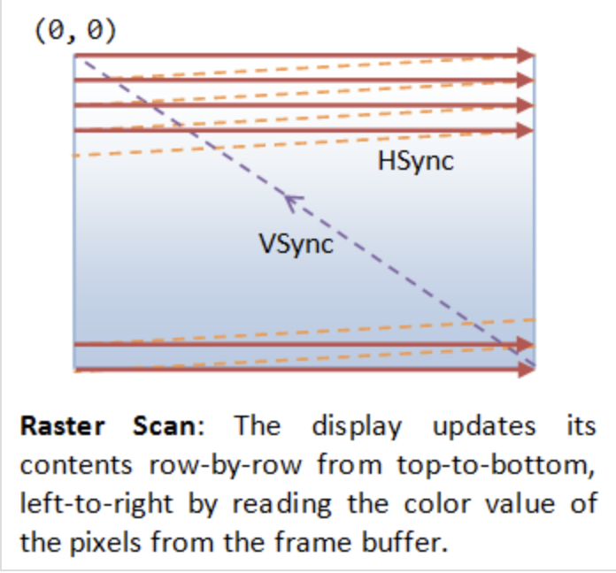

.. _sec-gpu:

The Concept of GPU Compiler
===========================

.. contents::
   :local:
   :depth: 4

Basically, a CPU is a SISD (Single Instruction Single Data) architecture in each
core. The multimedia instructions in CPUs are smaller-scale forms of SIMD (Single
Instruction Multiple Data), while GPUs are large-scale SIMD processors, capable of
coloring millions of image pixels in just a few milliseconds.

Since 2D and 3D graphic processing offers great potential for parallel data
processing, GPU hardware typically includes tens of thousands of functional units
per chip, as seen in products by NVIDIA and other manufacturers.

This chapter provides an overview of how 3D animation is created and executed on
a CPU+GPU system. Following that, it introduces GPU compilers and hardware
features relevant to graphics applications. Finally, it explains how GPUs have
taken on more computational tasks traditionally handled by CPUs, through the
GPGPU (General-Purpose computing on Graphics Processing Units) concept and the
emergence of related standards.

Website: Basic Theory of 3D Graphics with OpenGL [#cg_basictheory]_.

Concept in Graphics and Systems
-------------------------------

3D Modeling
~~~~~~~~~~~

By creating 3D models with triangles or quads on a surface, the model is formed
using a polygon mesh [#polygon]_. This mesh consists of all the vertices shown in
the first image as :numref:`modeling1`.

.. _modeling1: 
.. figure:: ../Fig/gpu/modeling1.png
  :align: center
  :scale: 80 %

  Creating 3D model and texturing

After applying smooth shading [#polygon]_, the vertices and edge lines are
covered with color (or the edges are visually removed—edges never actually have
black outlines). As a result, the model appears much smoother [#shading]_.

Furthermore, after texturing (texture mapping), the model looks even more
realistic [#texturemapping]_.

To understand how animation works for a 3D model, please refer to the video here
[#animation1]_. According to the video on skeleton animation, joints are positioned
at different poses and assigned timing (keyframes), as illustrated in
:numref:`animation`.

.. _animation: 
.. figure:: ../Fig/gpu/animation.png
  :align: center
  :scale: 50 %

  Set time point at keyframes

In this series of videos, you will see 3D modeling tools generating Java code
instead of C/C++ code calling OpenGL API and shaders. This is because Java can
call OpenGL API through a wrapper library [#joglwiki]_.

Every CAD software manufacturer, such as AutoDesk and Blender, has their own
proprietary format. To solve interoperability problems, neutral or open source
formats were created as intermediate formats to convert between proprietary
formats.

Naturally, these neutral formats have become very popular. Two famous examples
are STL (with a `.STL` extension) and COLLADA (with a `.DAE` extension). Below
is a list showing 3D file formats along with their types.

.. table:: 3D file formats [#3dfmt]_

  ==============  ==================
  3D file format  Type
  ==============  ==================
  STL             Neutral
  OBJ             ASCII variant is neutral, binary variant is proprietary
  FBX             Proprietary
  COLLADA         Neutral
  3DS             Proprietary
  IGES            Neutral
  STEP            Neutral
  VRML/X3D        Neutral
  ==============  ==================

The four key features a 3D file can store include the model’s geometry, the 
model’s surface texture, scene details, and animation of the model [#3dfmt]_.

Specifically, they can store details about four key features of a 3D model, 
though it’s worth bearing in mind that you may not always take advantage of 
all four features in all projects, and not all file formats support all four 
features!

3D printer applications do not to support animation. CAD and CAM such as
designing airplane does not need feature of scene details.

DAE (Collada) appeared in the video animation above.
Collada files  belong to a neutral format used heavily in the video game and 
film industries. It’s managed by the non-profit technology consortium, the 
Khronos Group.

The file extension for the Collada format is .dae.
The Collada format stores data using the XML mark-up language.

The original intention behind the Collada format was to become a standard among 
3D file formats. Indeed, in 2013, it was adopted by ISO as a publicly available 
specification, ISO/PAS 17506. As a result, many 3D modeling programs support 
the Collada format.

That said, the consensus is that the Collada format hasn’t kept up with the 
times. It was once used heavily as an interchange format for Autodesk Max/Maya 
in film production, but the industry has now shifted more towards OBJ, FBX, 
and Alembic [#3dfmt]_.

Graphic HW and SW Stack
~~~~~~~~~~~~~~~~~~~~~~~

- https://en.wikipedia.org/wiki/Free_and_open-source_graphics_device_driver

The block diagram of the Graphic Processing Unit (GPU) is shown in
:numref:`gpu_block_diagram`.

.. _gpu_block_diagram: 
.. figure:: ../Fig/gpu/gpu-block-diagram.png
  :align: center
  :scale: 50 %

  Components of a GPU: GPU has accelerated video decoding and encoding 
  [#wiki-gpu]_

The roles of the CPU and GPU in graphic animation are illustrated in
:numref:`graphic_cpu_gpu`.

.. _graphic_cpu_gpu: 
.. figure:: ../Fig/gpu/graphic-cpu-gpu.png
  :align: center
  :scale: 50 %

  OpenGL and Vulkan are both rendering APIs. In both cases, the GPU executes 
  shaders, while the CPU executes everything else [#ogl-cpu-gpu]_.

- GPU can't directly read user input from, say, keyboard, mouse, gamepad, or 
  play audio, or load files from a hard drive, or anything like that. In this
  situation, cannot let GPU handle the animation work [#cpu-gpu-role]_. 

- A graphics driver consists of an implementation of the OpenGL state machine 
  and a compilation stack to compile the shaders into the GPU's machine language. 
  This compilation, as well as pretty much anything else, is executed on the CPU, 
  then the compiled shaders are sent to the GPU and are executed by it. 
  (SDL = Simple DirectMedia Layer) [#mesawiki]_.

.. _graphic_gpu_csf: 
.. figure:: ../Fig/gpu/graphic-gpu-csf.png
  :align: center
  :scale: 50 %

  MCU and specific HW circuits to speedup the processing of CSF 
  (Command Stream Fronted) [#csf]_.

The GPU driver write command and data from CPU to GPU's system memory through 
PCIe. These commands are called Command Stream Fronted (CSF) in the memory of 
GPU. A chipset of GPU includes tens of SIMD processors (cores). In order to
speedup the GPU driver's processing, the CSF is designed to a simpler form.
As result, GPU chipset include MCU (Micro Chip Unit) and specfic HW to transfer
the CSF into individual data structure for each SIMD processor to execute as 
:numref:`graphic_gpu_csf`. The firmware version of MCU is updated by MCU itself
usually.

The driver runs on the CPU side as shown in :numref:`graphic_sw_stack`.  
The OpenGL API eventually calls the driver's functions, and the driver  
executes these functions by issuing commands to the GPU hardware and/or  
sending data to the GPU.  

Even so, the GPU’s rendering work, which uses data such as 3D vertices and  
colors sent from the CPU and stored in GPU or shared memory, consumes  
more computing power than the CPU.

.. _graphic_sw_stack: 
.. graphviz:: ../Fig/gpu/graphic-sw-stack.gv
  :caption: Graphic SW Stack

- According to the previous section, after the user creates a skeleton and skin  
  for each model and sets keyframe times using a 3D modeling tool, the tool can  
  either generate Java code that calls JOGL (Java OpenGL) [#joglwiki]_ or generate  
  OpenCL APIs directly. The frame data can be calculated by interpolating between  
  keyframes.

- As described above, for each animation frame, the client (CPU) program sets the  
  new positions of objects (vertices) and colors while the  
  server (driver and GPU) performs the 3D-to-2D rendering. Higher-level libraries  
  and frameworks on top of OpenGL provide animation frameworks and tools to  
  generate OpenGL APIs and shaders from 3D models.

- Shaders may call built-in functions written in Compute Shaders, SPIR-V, or  
  LLVM-IR. LLVM `libclc` is a project for OpenCL built-in functions, which can  
  also be used in OpenGL [#libclc]_. Like CPU built-ins, new GPU ISAs or  
  architectures must implement their own built-ins or port them from open source  
  projects like `libclc`.

- The 3D model (on CPU) performs rendering animations to generate each frame  
  between keyframes (poses), while the GPU executes the rendering pipeline  
  from each frame down to each pixel’s value.

- These frame data are stored in the form of VAOs (Vertex Array Objects) in  
  OpenGL. This will be explained in a later section: `OpenGL`_.

- Additionally, OpenGL provides VBOs (Vertex Buffer Objects), which allow  
  vertex array data to be stored in high-performance graphics memory on the  
  server side and enable efficient data transfer [#vbo]_ [#classorvbo]_.

- 3D animation software provides many built-in shaders. Programmers can also  
  write their own shaders for use in game engines.

The flow for 3D/2D graphic processing is shown in :numref:`opengl_flow`.

.. _opengl_flow: 
.. graphviz:: ../Fig/gpu/opengl-flow.gv
  :caption: OpenGL Flow

.. raw:: latex

   \clearpage

.. _db-vsync: 

  VSync

.. rubric:: VSync
.. code-block:: text

  No tearing occurs when the GPU and display operate at the same refresh rate,  
  since the GPU refreshes faster than the display as shown below.

                A    B

  GPU      | ----| ----|

  Display  |-----|-----|

              B      A

  Tearing occurs when the GPU has exact refresh cycles but VSync takes  
  one more cycle than the display as shown below.

                A

  GPU      | -----|

  Display  |-----|-----|

              B      A

  To avoid tearing, the GPU runs at half the refresh rate of the display,  
  as shown below.

                A          B

  GPU      | -----|    | -----|

  Display  |-----|-----|-----|-----|

              B      B    A     A

- Double Buffering

  While the display is reading from the frame buffer to display the current 
  frame, we might be updating its contents for the next frame (not necessarily 
  in raster-scan manner). This would result in the so-called tearing, in which 
  the screen shows parts of the old frame and parts of the new frame.
  This could be resolved by using so-called double buffering. Instead of using 
  a single frame buffer, modern GPU uses two of them: a front buffer and a back 
  buffer. The display reads from the front buffer, while we can write the next 
  frame to the back buffer. When we finish, we signal to GPU to swap the front 
  and back buffer (known as buffer swap or page flip).

- VSync

  Double buffering alone does not solve the entire problem, as the buffer swap 
  might occur at an inappropriate time, for example, while the display is in 
  the middle of displaying the old frame. This is resolved via the so-called 
  vertical synchronization (or VSync) at the end of the raster-scan. 
  When we signal to the GPU to do a buffer swap, the GPU will wait till the next
  VSync to perform the actual swap, after the entire current frame is displayed.

  As above text digram.
  The most important point is: When the VSync buffer-swap is enabled, you cannot 
  refresh the display faster than the refresh rate of the display!!! 
  If GPU is capable of producing higher frame rates than the display's 
  refresh rate, then GPU can use fast rate without tearing.
  If GPU has same or less frame rates then display's and you application 
  refreshes at a fixed rate, the resultant refresh rate is 
  likely to be an integral factor of the display's refresh rate, i.e., 1/2, 1/3, 
  1/4, etc. Otherwise it will cause tearing [#cg_basictheory]_.

- NVIDIA G-SYNC and AMD FreeSync

  If your monitor and graphics card both in your customer computer support 
  NVIDIA G-SYNC, you’re in luck. With this technology, a special chip in the 
  display communicates with the graphics card. This lets the monitor vary the 
  refresh rate to match the frame rate of the NVIDIA GTX graphics card, up to 
  the maximum refresh rate of the display. This means that the frames are 
  displayed as soon as they are rendered by the GPU, eliminating screen tearing 
  and reducing stutter for when the frame rate is both higher and lower than 
  the refresh rate of the display. This makes it perfect for situations where 
  the frame rate varies, which happens a lot when gaming. 
  Today, you can even find G-SYNC technology in gaming laptops!

  AMD has a similar solution called FreeSync. However, this doesn’t require a 
  proprietary chip in the monitor. 
  In FreeSync, the AMD Radeon driver, and the display firmware handle the 
  communication. 
  Generally, FreeSync monitors are less expensive than their G-SYNC counterparts,
  but gamers generally prefer G-SYNC over FreeSync as the latter may cause 
  ghosting, where old images leave behind artifacts [#g-sync]_.

Basic geometry in computer graphics
~~~~~~~~~~~~~~~~~~~~~~~~~~~~~~~~~~~

This section introduces the basic geometry math used in computer graphics.  
The complete concept can be found in the book *Computer Graphics: Principles  
and Practice, 3rd Edition*, authored by John F. et al. However, the book  
contains over a thousand pages.

It is very comprehensive and may take considerable time to understand all the  
details.

Color
+++++

- Additive colors in light are shown in :numref:`additive-colors`  
  [#additive-colors-wiki]_ [#additive-colors-ytube]_.

- In the case of paints, additive colors produce shades and become light gray  
  due to the addition of darker pigments [#additive-colors-shade]_.

.. _additive-colors: 

  Additive colors in light

.. note:: **Additive colors**

   I know it doesn't match human intuition. However, additive RGB colors in  
   light combine to produce white light, while additive RGB in paints result in  
   light gray paint. This makes sense because light has no shade. This result  
   stems from the way human eyes perceive color. Without light, no color can be  
   sensed by the eyes.

   Computer engineers should understand that exploring the underlying reasons  
   falls into the realms of physics or the biology of the human eye structure.

Transformation
++++++++++++++

Objects (Triangle/Quad) can be moved in 2D/3D using matrix representation, as  
explained in this wiki page [#wiki-transformation]_.

The rotation matrix used is derived from another wiki page  
[#wiki-rotation]_.

Every computer graphics book covers the topic of transformation of objects and  
their positions in space. Chapter 4 of the *Blue Book: OpenGL SuperBible, 7th  
Edition* provides a short but useful 40-page description of transformation  
concepts. It is a good material for understanding the basics.

The following Quaternion Product (Hamilton product) is from the wiki  
[#wiki-quaternion]_ since it is not covered in the book.

.. math::

  \mathbf ij = -ji = k, jk = -kj = i, ki = -ik = j.

.. _trans_steps: 
.. figure:: ../Fig/gpu/trans-steps.png
  :align: center
  :scale: 50 %

  Cooridinates Transform Pipeline [#cg_basictheory]_

Details for :numref:`trans_steps` can be found on the website
[#cg_basictheory]_.

Projection
++++++++++

.. _ViewFrustum: 
.. figure:: ../Fig/gpu/ViewFrustum.png
  :align: center
  :scale: 15 %

Only objects within the cone between near and far planes are projected to 2D  
in perspective projection.

Perspective and orthographic projections (used in CAD tools) from 3D to 2D  
can be represented by transformation matrices as described in the previous  
section [#wiki-prospective-projection]_.

Cross product
+++++++++++++

Both triangles and quads are polygons. So, objects can be formed with  
polygons in both 2D and 3D. The transformation in 2D or 3D is well covered in  
almost every computer graphics book. This section introduces the most  
important concept and method for determining inner and outer planes. Then,  
a point or object can be checked for visibility during 2D or 3D rendering.

Any **area** of a polygon can be calculated by dividing it into triangles or  
quads. The area of a triangle or quad can be calculated using the cross  
product in 3D.

The cross product in **3D** is defined by the formula and can be represented  
with matrix notation, as shown here [#cross-product-wiki]_.

.. math::

  \mathbf a \mathsf x \mathbf b = \Vert a \Vert \Vert b \Vert sin(\Theta) n

.. math::

  \mathbf a \mathsf x \mathbf b = 
  \begin{vmatrix}
  \mathbf i & \mathbf j& \mathbf k\\ 
  a_1& a_2& a_3\\ 
  b_1& b_2& b_3 
  \end{vmatrix}

The cross product in **2D** is defined by a formula and can be represented  
with matrix notation, as proven here  
[#cross-product-2d-proof]_ [#cross-product-2d-proof2]_.

.. math::

  \mathbf a \mathsf x \mathbf b = \Vert a \Vert \Vert b \Vert sin(\Theta)

.. math::

  \mathbf a \mathsf x \mathbf b = 
  \begin{vmatrix}
  \mathbf i & \mathbf j& \mathbf k\\ 
  a_1& a_2& 0\\ 
  b_1& b_2& 0 
  \end{vmatrix} =
  \begin{bmatrix}
  a_1& a_2 \\
  b_1& b_2
  \end{bmatrix}

After the above matrix form is proven, the antisymmetry property  
may be demonstrated as follows:

.. math::

  a \mathsf x b = \mathsf x&
  \begin{bmatrix}
  a \\ 
  b 
  \end{bmatrix} =
  \begin{bmatrix}
  a_1& a_2 \\ 
  b_1& b_2 
  \end{bmatrix} =
  a_1b_2 - a_2b_1 = 

.. math::

  -b_1a_2 - (-b_2a_1) = 
  \begin{bmatrix}
  - b_1& - b_2 \\ 
  a_1& a_2 
  \end{bmatrix} =
  \mathsf x&
  \begin{bmatrix}
  -b \\ 
  a 
  \end{bmatrix} =
  -b \mathsf x a 

In 2D, any two points :math:`\text{from } P_i \text{ to } P_{i+1}` can form a  
vector and determine the inner or outer side.  

For example, as shown in :numref:`inward-edge-normals`, :math:`\Theta` is the  
angle from :math:`P_iP_{i+1}` to :math:`P_iP'_{i+1} = 180^\circ`.  

Using the right-hand rule and counter-clockwise order, any vector  
:math:`P_iQ` between :math:`P_iP_{i+1}` and :math:`P_iP'_{i+1}`, with angle  
:math:`\theta` such that :math:`0^\circ < \theta < 180^\circ`, indicates the  
inward direction.

.. _inward-edge-normals: 
.. figure:: ../Fig/gpu/inward-edge-normals.png
  :align: center
  :scale: 50 %

  Inward edge normals

.. _2d-vector-inward: 
.. figure:: ../Fig/gpu/2d-vector-inward.png
  :align: center
  :scale: 50 %

  Inward and outward in 2D for a vector.

Based on this observation, the rule for inward and outward vectors is shown in  
:numref:`inward-edge-normals`. Facing the same direction as a specific vector,  
the left side is inward and the right side is outward, as shown in  
:numref:`2d-vector-inward`.

For each edge :math:`P_i - P_{i+1}`, the inward edge normal is the vector  
:math:`\mathsf{x} \; v_i`; the outward edge normal is  
:math:`- \; \mathsf{x} \; v_i`, where :math:`\mathsf{x} \; v_i` is the  
cross-product of :math:`v_i`, as shown in :numref:`inward-edge-normals`.

A polygon can be created from a set of vertices. Suppose  
:math:`(P_0, P_1, ..., P_n)` defines a polygon. The line segments  
:math:`P_0P_1, P_1P_2`, etc., are the polygon’s edges. The vectors  
:math:`v_0 = P_1 - P_0, v_1 = P_2 - P_1, ..., v_n = P_0 - P_n` represent those  
edges.

Using counter-clockwise ordering, the left side is inward. Thus, the inward  
region of a polygon can be determined.

For a convex polygon with vertices listed in counter-clockwise order, the  
inward edge normals point toward the interior of the polygon, and the outward  
edge normals point toward the unbounded exterior. This matches our usual  
intuition.

However, if the polygon vertices are listed in clockwise order, the interior  
and exterior definitions are reversed.

This cross product has an important property: going from :math:`v` to  
:math:`\times v` involves a 90° rotation in the same direction as the  
rotation from the positive x-axis to the positive y-axis.

.. _in-polygon: 
.. figure:: ../Fig/gpu/polygon.png
  :align: center
  :scale: 50 %

  Draw a polygon with vectices counter clockwise

As shown in :numref:`in-polygon`, when drawing a polygon with vectors (lines)  
in counter-clockwise order, the polygon will be formed, and the two sides of  
each vector (line) can be identified [#cgpap]_.

Furthermore, whether a point is inside or outside the polygon can be  
determined.

One simple method to test whether a point lies inside or outside a simple  
polygon is to cast a ray from the point in any fixed direction and count how  
many times it intersects the edges of the polygon.

If the point is outside the polygon, the ray will intersect its edges an even  
number of times. If the point is inside the polygon, it will intersect the  
edges an odd number of times [#wiki-point-in-polygon]_.

.. _3d-cross-product: 
.. figure:: ../Fig/gpu/3d-cross-product.png
  :align: center
  :scale: 50 %

  Cross product definition in 3D

In the same way, by following the counter-clockwise direction to create a  
2D polygon step by step, a 3D polygon can be constructed.

As shown in :numref:`3d-cross-product` from the wiki  
[#cross-product-wiki]_, the inward direction is determined by  
:math:`a \times b < 0`, and the outward direction is determined by  
:math:`a \times b > 0` in OpenGL.

Replacing :math:`a` and :math:`b` with :math:`x` and :math:`y`, as shown in  
:numref:`ogl-pointing-outwards`, the positive Z-axis (:math:`z+`) represents  
the outer surface, while the negative Z-axis (:math:`z-`) represents the  
inner surface [#ogl-point-outwards]_.

.. _ogl-pointing-outwards: 

  OpenGL pointing outwards, indicating the outer surface (z axis is +)

.. _in-3d-polygon: 
.. figure:: ../Fig/gpu/3d-polygon.png
  :align: center
  :scale: 50 %

  3D polygon with directions on each plane

The :numref:`in-3d-polygon` shows an example of a 3D polygon created from 2D  
triangles. The direction of the plane (triangle) is given by the line  
perpendicular to the plane.

Cast a ray from the 3D point along the X-axis and count how many intersections  
with the outer object occur. Depending on the number of intersections along  
each axis (even or odd), you can understan if the point is inside or outside  
[#point-in-3d-object]_.

An odd number means inside, and an even number means outside. As shown in  
:numref:`in-3d-object`, points on the line passing through the object satisfy  
this rule.

.. _in-3d-object: 

  Point is inside or outside of 3D object

.. rubric:: OpenGL uses counter clockwise and pointing outwards as default [#vbo]_.
.. code-block:: c++

  // unit cube      
  // A cube has 6 sides and each side has 4 vertices, therefore, the total number
  // of vertices is 24 (6 sides * 4 verts), and 72 floats in the vertex array
  // since each vertex has 3 components (x,y,z) (= 24 * 3)
  //    v6----- v5  
  //   /|      /|   
  //  v1------v0|   
  //  | |     | |   
  //  | v7----|-v4  
  //  |/      |/    
  //  v2------v3    

  // vertex position array
  GLfloat vertices[]  = {
     .5f, .5f, .5f,  -.5f, .5f, .5f,  -.5f,-.5f, .5f,  .5f,-.5f, .5f, // v0,v1,v2,v3 (front)
     .5f, .5f, .5f,   .5f,-.5f, .5f,   .5f,-.5f,-.5f,  .5f, .5f,-.5f, // v0,v3,v4,v5 (right)
     .5f, .5f, .5f,   .5f, .5f,-.5f,  -.5f, .5f,-.5f, -.5f, .5f, .5f, // v0,v5,v6,v1 (top)
    -.5f, .5f, .5f,  -.5f, .5f,-.5f,  -.5f,-.5f,-.5f, -.5f,-.5f, .5f, // v1,v6,v7,v2 (left)
    -.5f,-.5f,-.5f,   .5f,-.5f,-.5f,   .5f,-.5f, .5f, -.5f,-.5f, .5f, // v7,v4,v3,v2 (bottom)
     .5f,-.5f,-.5f,  -.5f,-.5f,-.5f,  -.5f, .5f,-.5f,  .5f, .5f,-.5f  // v4,v7,v6,v5 (back)
  };

From the code above, we can see that OpenGL uses counter-clockwise and  
pointing outwards as the default. However, OpenGL provides  
``glFrontFace(GL_CW)`` for clockwise winding [#ogl_frontface]_.

For a group of objects, a scene graph provides better animation support and  
saves memory [#scene-graph-wiki]_.

OpenGL
------

Example of OpenGL program
~~~~~~~~~~~~~~~~~~~~~~~~~

The following example is from the OpenGL Red Book and its example code  
[#redbook]_ [#redbook-examples]_.

.. rubric:: References/triangles.vert
.. literalinclude:: ../References/triangles.vert

.. rubric:: References/triangles.frag
.. literalinclude:: ../References/triangles.frag

.. rubric:: References/01-triangles.cpp
.. literalinclude:: ../References/01-triangles.cpp
   :language: c++
   :linenos:

Init(): 

- Generate Vertex Array VAOs and bind VAOs[0].

  (glGenVertexArrays(NumVAOs, VAOs);  
  glBindVertexArray(VAOs[Triangles]);  
  glCreateBuffers(NumBuffers, Buffers);)

  A vertex-array object holds various data related to a collection of vertices.  
  Those data are stored in buffer objects and managed by the currently bound  
  vertex-array object.

  - glBindBuffer(GL_ARRAY_BUFFER, Buffers[ArrayBuffer]);

    Because there are many different places where buffer objects can be in  
    OpenGL, when we bind a buffer, we need to specify what we’d like to use it  
    for. In our example, because we’re storing vertex data into the buffer,  
    we use GL_ARRAY_BUFFER. The place where the buffer is bound is known as the  
    binding target.

- According to the counter-clockwise rule in the previous section, triangle  
  primitives are defined in variable `vertices`. After binding OpenGL  
  VBO Buffers[0] to `vertices`, vertex data will be sent to the memory of  
  the server (GPU).  

  Think of the "active" buffer as just a global variable, and there are a bunch  
  of functions that use the active buffer instead of taking using a parameter.  
  These global state variables are the ugly side of OpenGL [#vao-vbo-binding]_  
  and can be replaced with `glVertexArrayVertexBuffer()`,  
  `glVertexArrayAttribFormat()`, etc. Then call `glBindVertexArray(vao)` before  
  drawing in OpenGL 4.5 [#ogl-vavb]_ [#ogl-bluebook-p152]_.

- glVertexAttribPointer(vPosition, 2, GL_FLOAT, GL_FALSE, 0, BUFFER_OFFSET(0)):

  During GPU rendering, each vertex position will be held in `vPosition` and  
  passed to the "triangles.vert" shader through the `LoadShaders(shaders)`  
  function.

glfwSwapBuffers(window):

- You’ve already used double buffering for animation. Double buffering is done  
  by making the main color buffer have two parts: a front buffer that’s  
  displayed in your window; and a back buffer, which is where you render the  
  new image. When you swap the buffers (by calling `glfwSwapBuffers()`, for  
  example), the front and back buffers are exchanged  
  [#redbook-colorbuffer]_.

display():

- Bind VAOs[0], set render mode to GL_TRIANGLES and send vertex data to Buffer
  (gpu memory, OpenGL pipeline). Next, GPU will do rendering pipeline descibed
  in next section.

The triangles.vert has input vPosition and no output variable, so using 
gl_Position default varaible without declaration. The triangles.frag has not 
defined input variable and has defined output variable fColor instead of using
gl_FragColor.

The "in" and "out" in shaders above are "type qualifier". 
A type qualifier is used in the OpenGL Shading Language (GLSL) to modify the 
storage or behavior of global and locally defined variables. These qualifiers 
change particular aspects of the variable, such as where they get their data 
from and so forth [#ogl-qualifier]_. 

Though attribute and varying are removed from later version 1.4 of OpenGL,
many materials in website using them [#ogl-qualifier-deprecate]_ 
[#github-attr-varying-depr]_. 
It's better to use "in" and "out" to replace
them as the following code.
OpenGL has a few ways to binding API's variable with shader's variable.
glVertexAttrib* as the following code and glBindAttribLocation() 
[#ogl-layout-q]_, ...

.. rubric:: replace attribute and varying with in and out
.. code-block:: c++

  uniform float scale;
  layout (location = 0) attribute vec2 position;
  // layout (location = 0) in vec2 position;
  layout (location = 1) attribute vec4 color;
  // layout (location = 1) in vec4 color;
  varying vec4 v_color;
  // out v_color

  void main()
  {
    gl_Position = vec4(position*scale, 0.0, 1.0);
    v_color = color;
  }

.. code-block:: c++

  // OpenGL API
  GLfloat attrib[] = { x * 0.5f, x * 0.6f, x* 0.4f, 0.0f };
  // Update the value of input attribute 1 : layout (location = 1) in vec4 color
  glVertexAttrib4fv(1, attrib);

.. code-block:: c++

  varying vec4 v_color;
  // in vec4 v_color;

  void main()
  {
    gl_FragColor = v_color;
  }

An OpenGL program is made of two shaders [#monstar-lab-opengl]_ 
[#glumpy-shaders]_:

- The vertex shader is (commonly) executed once for every vertex we want to 
  draw. It receives some attributes as input, computes the position of this 
  vertex in space and returns it in a variable called gl_Position. It also 
  defines some varyings.

- The fragment shader is executed once for each pixel to be rendered. It 
  receives some varyings as input, computes the color of this pixel and 
  returns it in a variable called fColor.

Since we have 6 vertices in our buffer, this shader will be executed 6 times by 
the GPU (once per vertex)! We can also expect all 6 instances of the shader to 
be executed in parallel, since a GPU have so many cores.

3D Rendering
~~~~~~~~~~~~

Based on the previous section of 3D modeling, the 3D modeling tool will  
generate a 3D vertex model and OpenGL code. Then, programmers may manually  
modify the OpenGL code and add or update shaders. The 3D animation will  
trigger the 3D rendering process for each 2D image drawing.

3D rendering is the process of converting 3D models into 2D images on a  
computer [#3drendering_wiki]_.

The steps are shown in :numref:`short_rendering_pipeline`.

.. _short_rendering_pipeline: 
.. figure:: ../Fig/gpu/short-rendering-pipeline.png
  :align: center
  :scale: 50 %

  3D Graphics Rendering Pipeline

- A fragment can be treated as a pixel in 3D spaces, which is aligned with the 
  pixel grid, with attributes such as position, color, normal and texture.

The complete steps are shown in :numref:`rendering_pipeline1`, from the OpenGL  
website [#rendering]_. The website also provides a description for each stage.

.. _rendering_pipeline1: 
.. figure:: ../Fig/gpu/rendering_pipeline.png
  :align: center
  :scale: 80 %

  Diagram of the Rendering Pipeline. The blue boxes are programmable shader stages.

In addition, list the OpenGL rendering pipeline Figure 1.2 and its stages  
from the book *OpenGL Programming Guide, 9th Edition* [#redbook]_ as follows:

.. _OpenGL_pipeline: 
.. figure:: ../Fig/gpu/OpenGL-pipeline.png
  :align: center
  :scale: 50 %

.. raw:: latex

   \clearpage

.. list-table:: OpenGL rendering pipeline from page 10 of book
   "OpenGL Programming Guide 9th Edition" [#redbook]_ and [#rendering]_.
   :widths: 20 60
   :header-rows: 1

   * - Stage.
     - Description
   * - Vertex Specification
     - After setting data as in the previous section, ``glDrawArrays()`` sends
       data to the GPU through buffer objects.
   * - Vertex Shading
     - **Vertex → Vertex and other data such as color for later passes.**
       For each vertex issued by a drawing command, a vertex shader processes
       the data associated with that vertex.
   * - Tessellation Shading
     - **Create more detail on demand when zoomed in.**
       After the vertex shader processes each vertex, the tessellation shader
       stage (if active) continues processing. See reference below.
   * - Geometry Shading
     - **Allows additional processing of geometric primitives.**
       This stage may create new primitives before rasterization. See Chapter 10
       of the Red Book [#redbook]_.
   * - Primitive Assembly
     - The previous shading stages all operate on vertices, with the information 
       about how those vertices are organized into geometric primitives being 
       carried along internal to OpenGL. 
       **The primitive assembly stage organizes the vertices into their 
       associated geometric primitives in preparation for clipping and 
       rasterization.**
   * - Clipping
     - **Clipping hidden parts.** Occasionally, vertices will be outside of the 
       viewport—the region of the window where you’re permitted to draw—and 
       cause the primitive associated with that vertex to be modified so none 
       of its pixels are outside of the viewport. 
       This operation is called clipping and is handled automatically by OpenGL.
   * - Rasterization
     - **Vertex -> Fragment.** The job of the rasterizer is to determine which 
       screen locations are covered by a particular piece of geometry (point, 
       line, or triangle). Knowing those locations, along with the input vertex 
       data, the rasterizer linearly interpolates the data values for each 
       varying variable in the fragment shader and sends those values as inputs 
       into your fragment shader. A fragment can be treated as a pixel in 3D 
       spaces, which is aligned with the pixel grid, with attributes such as 
       position, color, normal and texture.
   * - Fragment Shading
     - **Determine color for each pixel.** 
       The final stage where you have programmable control over the color of 
       a screen location is fragment shading. In this shader stage, you use a 
       shader to determine the fragment’s final color (although the next stage, 
       per-fragment operations, can modify the color one last time) and 
       potentially its depth value. Fragment shaders are very powerful, as they 
       often employ texture mapping to augment the colors provided by the 
       vertex processing stages. A fragment shader may also terminate 
       processing a fragment if it determines the fragment shouldn’t be drawn; 
       this process is called fragment discard. A helpful way of thinking about 
       the difference between shaders that deal with vertices and fragment 
       shaders is this: vertex shading (including tessellation and geometry 
       shading) determines where on the screen a primitive is, while fragment 
       shading uses that information to determine what color that fragment will 
       be.
   * - Per-Fragment Operations
     - During this stage, a fragment’s visibility is determined using depth 
       testing (also commonly known as z-buffering) and stencil testing. 
       If a fragment successfully makes it through all of the enabled tests, 
       it may be written directly to the framebuffer, updating the color 
       (and possibly depth value) of its pixel, or 
       **if blending is enabled, the fragment’s color will be combined with 
       the pixel’s current color to generate a new color that is written into 
       the framebuffer.**

- Tessellation Shading: 
  The core problem that Tessellation deals with is the static nature of 3D models
  in terms of their detail and polygon count. The thing is that when we look at 
  a complex model such as a human face up close we prefer to use a highly 
  detailed model that will bring out the tiny details (e.g. skin bumps, etc). 
  A highly detailed model automatically translates to more triangles and more 
  compute power required for processing. ... 
  One possible way to solve this problem using the existing features of OpenGL 
  is to generate the same model at multiple levels of detail (LOD). For example, 
  highly detailed, average and low. We can then select the version to use based 
  on the distance from the camera. This, however, will require more artist 
  resources and often will not be flexible enough. ...
  Let's take a look at how Tessellation has been implemented in the graphics 
  pipeline. The core components that are responsible for Tessellation are two 
  new shader stages and in between them a fixed function stage that can be 
  configured to some degree but does not run a shader. The first shader stage 
  is called Tessellation Control Shader (TCS), the fixed function stage is 
  called the Primitive Generator (PG), and the second shader stage is called 
  Tessellation Evaluation Shader (TES). 
  Some GPU havn't this fixed function stage implemented in HW and even havn't
  provide these TCS, TES and Gemoetry Shader. User can write Compute Shaders 
  instead for this on-fly detail display.
  This surface is usually defined by some polynomial formula and the idea is 
  that moving a CP has an effect on the entire surface. ...
  The group of CPs is usually called a Patch [#ts-tu30]_.
  Chapter 9 of Red Book [#redbook]_ has details.

For 2D animation, the model is created by 2D only (1 face only), so it only can be 
viewed from the same face of model. If you want to display different faces of model,
multiple 2D models need to be created and switch these 2D models from face(flame) to 
face(flame) from time to time [#2danimation]_.

GLSL (GL Shader Language)
~~~~~~~~~~~~~~~~~~~~~~~~~

OpenGL is a standard specification for designing 2D and 3D graphics and animation
in computer graphics. To support advanced animation and rendering, OpenGL provides
a large set of APIs (functions) for graphics processing. Popular 3D modeling and
animation tools—such as Maya, Blender, and others—can utilize these APIs to handle
3D-to-2D projection and rendering directly on the computer.

The hardware-specific implementation of these APIs is provided by GPU manufacturers,
ensuring that rendering is optimized for the underlying hardware.

An OpenGL program typically follows a structure like the example below:

.. rubric:: Vertex shader
.. code-block:: c++

  #version 330 core
  layout (location = 0) in vec3 aPos; // the position variable has attribute position 0
    
  out vec4 vertexColor; // specify a color output to the fragment shader
  
  void main()
  {
      gl_Position = vec4(aPos, 1.0); // see how we directly give a vec3 to vec4's constructor
      vertexColor = vec4(0.5, 0.0, 0.0, 1.0); // set the output variable to a dark-red color
  }

.. rubric:: Fragment shader
.. code-block:: c++

  #version 330 core
  out vec4 FragColor;
    
  in vec4 vertexColor; // the input variable from the vertex shader (same name and same type)  
  
  void main()
  {
      FragColor = computeColorOfThisPixel(...);
  } 
  
.. rubric:: OpenGl user program
.. code-block:: c++

  int main(int argc, char ** argv)
  {
    // init window, detect user input and do corresponding animation by calling opengl api
    ...
  }

The last `main()` function in an OpenGL application is written by the user, as expected. 
Now, let’s explain the purpose of the first two main components of the OpenGL pipeline.

As discussed in the *Concepts of Computer Graphics* textbook, OpenGL provides a 
rich set of APIs that allow programmers to render 3D objects onto a 2D computer screen.
The general rendering process follows these steps:

1. The user sets up lighting, textures, and object materials.
2. The system calculates the position of each vertex in 3D space.
3. The GPU and rendering pipeline automatically determine the color of each pixel 
   based on lighting, textures, and interpolation.
4. The final image is displayed on the screen by writing pixel colors to the framebuffer.

To give programmers the flexibility to add custom effects or visual enhancements—such 
as modifying vertex positions for animation or applying unique coloring—OpenGL provides
two programmable stages in the graphics pipeline:

- **Vertex Shader:** Allows the user to customize how vertex coordinates are 
  transformed and processed.
- **Fragment Shader:** Allows the user to define how each pixel (fragment) is shaded 
  and colored, enabling effects like lighting, textures, and transparency.

These shaders are written by the user and compiled at runtime, providing powerful 
control over the rendering process.

OpenGL uses fragment shader instead of pixel is : "Fragment shaders are a more 
accurate name for the same functionality as Pixel shaders. They aren’t pixels 
yet, since the output still has to past several tests (depth, alpha, stencil) 
as well as the fact that one may be using antialiasing, which renders 
one-fragment-to-one-pixel non-true [#fragmentshader_reason]_.
Programmer is allowed to add their converting functions that compiler translate them 
into GPU instructions running on GPU processor. With these two shaders, new 
features have been added to allow for increased flexibility in the rendering 
pipeline at the vertex and fragment level [#shaderswiki]_.
Unlike the shaders example here [#shadersex]_, some converting functions 
for coordinate in vertex shader or for color in fragment shade are more 
complicated according the scenes of 
animation. Here is an example [#glsleffect]_.
In wiki shading page [#shading]_, Gourand and Phong shading methods make the
surface of object more smooth by glsl. Example glsl code of Gourand 
and Phong shading on OpenGL api are here [#smoothshadingex]_.
Since the hardware of graphic card and software graphic driver can be replaced, 
the compiler is run on-line meaning driver will compile the shaders program when 
it is run at first time and kept in cache after compilation [#on-line]_.

The shaders program is C-like syntax and can be compiled in few mini-seconds, 
add up this few mini-seconds of on-line compilation time in running OpenGL 
program is a good choice for dealing the cases of driver software or gpu 
hardware replacement [#onlinecompile]_. 

OpenGL Shader compiler
~~~~~~~~~~~~~~~~~~~~~~

The OpenGL standard is defined in [#openglspec]_. OpenGL is primarily designed for 
desktop computers and servers, whereas OpenGL ES is a subset tailored for embedded systems 
[#opengleswiki]_.

Although shaders represent only a small part of the entire OpenGL software/hardware 
stack, implementing a compiler for them is still a significant undertaking. This is 
because a large number of APIs need to be supported. For instance, there are over 80 
texture-related APIs alone [#textureapi]_.

A practical approach to implementing such a compiler involves generating LLVM extended 
intrinsic functions from the shader frontend (parser and AST generator). These intrinsics 
can then be lowered into GPU-specific instructions in the LLVM backend. The overall 
workflow is illustrated as follows:

.. rubric:: Fragment shader
.. code-block:: c++

  #version 320 es
  uniform sampler2D x;
  out vec4 FragColor;
  
  void main()
  {
      FragColor = texture(x, uv_2d, bias);
  }
  
.. rubric:: llvm-ir
.. code-block:: text

  ...
  !1 = !{!"sampler_2d"}
  !2 = !{i32 SAMPLER_2D} ; SAMPLER_2D is integer value for sampler2D, for example: 0x0f02
  ; A named metadata.
  !x_meta = !{!1, !2}

  define void @main() #0 {
      ...
      %1 = @llvm.gpu0.texture(metadata !x_meta, %1, %2, %3); ; %1: %sampler_2d, %2: %uv_2d, %3: %bias
      ...
  }
  
.. rubric:: asm of gpu
.. code-block:: asm

  ...
  // gpu machine code
  load $1, tex_a;
  sample2d_inst $1, $2, $3 // $1: tex_a, $2: %uv_2d, $3: %bias

  .tex_a // Driver set the index of gpu descriptor regsters here

As shown at the end of the code above, the `.tex_a` memory address contains the Texture 
Object, which is bound by the driver during online compilation and linking. By binding 
a Texture Object (software representation) to a Texture Unit (hardware resource) via 
OpenGL API calls, the GPU can access and utilize Texture Unit hardware efficiently. 
This binding mechanism ensures that texture sampling and mapping are executed with 
minimal overhead during rendering.

For more information about LLVM extended intrinsic functions, please refer to 
[#intrinsiccpu0]_.

.. code-block:: c++

  gvec4 texture(gsampler2D sampler, vec2 P, [float bias]);

GPUs provide *Texture Units* to accelerate texture access in fragment shaders. 
However, *Texture Units* are expensive hardware resources, and only a limited number 
are available on a GPU. To manage this limitation, the OpenGL driver can associate 
a *Texture Unit* with a `sampler` variable using OpenGL API calls. This association 
can be updated or switched between shaders as needed. The following statements 
demonstrate how to bind and switch *Texture Units* across shaders:

.. _sampling: 
.. figure:: ../Fig/gpu/sampling_diagram.png
  :align: center
  :scale: 60 %

  Relationships between the texturing concept [#textureobject]_.

As shown in :numref:`sampling`, the texture object is not bound directly to a shader 
(where sampling operations occur). Instead, it is bound to a *texture unit*, and the 
index of this texture unit is passed to the shader. This means the shader accesses 
the texture object through the assigned texture unit. Most GPUs support multiple 
texture units, though the exact number depends on the hardware capabilities 
[#textureobject]_.

A *texture unit*—also known as a *Texture Mapping Unit (TMU)* or *Texture Processing Unit (TPU)*—
is a dedicated hardware component in the GPU that performs texture sampling operations.

The `sampler` argument in the texture sampling function refers to a `sampler2D` (or similar)
uniform variable. This variable represents the texture unit index used to access the 
associated texture object [#textureobject]_.

**Sampler Uniform Variables**:

OpenGL provides a set of special uniform variables for texture sampling, named according to 
the texture target: `sampler1D`, `sampler2D`, `sampler3D`, `samplerCube`, etc.

You can create as many *sampler uniform variables* as needed and assign each one to a 
specific texture unit index using OpenGL API calls. Whenever a sampling function is 
invoked with a sampler uniform, the GPU uses the texture unit (and its bound texture object) 
associated with that sampler [#textureobject]_.

.. _sampling_binding: 
.. figure:: ../Fig/gpu/sampling_diagram_binding.png
  :align: center

  Binding sampler variables [#tpu]_.

As shown in :numref:`sampling_binding`, the Java API function `gl.bindTexture()` 
binds a *Texture Object* to a specific *Texture Unit*. Then, using 
`gl.getUniformLocation()` and `gl.uniform1i()`, you associate the *Texture Unit* 
with a *sampler uniform variable* in the shader.

For example, `gl.uniform1i(xLoc, 1)` assigns *Texture Unit 1* to the sampler variable 
at location `xLoc`. Similarly, passing `2` would refer to *Texture Unit 2*, and so on 
[#tpu]_.

The following figure illustrates how the OpenGL driver reads metadata from a compiled 
GLSL object, how the OpenGL API links *sampler uniform variables* to *Texture Units*, 
and how the GPU executes the corresponding texture instructions.

.. _driverSamplerTable: 
.. figure:: ../Fig/gpu/driverSamplerTable.png
  :align: center

  Associating Sampler Variables and gpu executing texture instruction

Explaining the detailed steps for the figure above:

1. To enable the GPU driver to bind the *texture unit*, the frontend compiler 
   must pass metadata for each *sampler uniform variable* 
   (e.g., `sampler_2d_var` in this example) [#samplervar]_ to the backend. 
   The backend then allocates and embeds this metadata in the compiled binary 
   file [#metadata]_.

2. During the on-line compilation of the GLSL shader, the GPU driver reads 
   this metadata from the compiled binary file. It constructs an internal 
   table mapping each *sampler uniform variable* to its attributes, such as 
   `{name, type, location}`. This mapping allows the driver to properly 
   populate the *Texture Descriptor* in the GPU’s memory, linking the variable 
   to a specific *texture unit*.

3. API:

.. code-block:: c++

   xLoc = gl.getUniformLocation(prog, "x"); // prog: GLSL program, xLoc: location of sampler variable "x"

This API call queries the location of the `sampler uniform variable` named `"x"` 
from the internal table that the driver created after parsing the shader metadata.

The returned `xLoc` value corresponds to the location field associated with `"x"`, 
which will later be used to bind a specific *texture unit* to this sampler variable 
via `gl.uniform1i(xLoc, unit_index)`.

`SAMPLER_2D` is the internal representation (usually an integer) that identifies 
a `sampler2D` type in the shader.

4. API:

.. code-block:: c++

   gl.uniform1i(xLoc, 1);

This API call binds the sampler uniform variable `x` (located at `xLoc`) to 
**Texture Unit 1**. It works by writing the integer value `1` to the internal 
GLSL program memory at the location of the sampler variable `x`, as indicated 
by `xLoc`.

.. code-block:: console

   {xLoc, 1} : 1 is 'Texture Unit 1', xLoc is the memory address of 'sampler uniform variable' x

After this call, the OpenGL driver updates the **Texture Descriptor** table in GPU 
memory with this `{xLoc, 1}` information.

Next, the driver associates the memory address or index of the GPU's texture descriptor 
with a hardware register or pointer used during fragment shader execution. For example, 
as shown in the diagram, the driver may write a pointer `k` to the `.tex_a` field in memory.

This `.tex_a` address is used by the GPU to locate the correct **Texture Unit** 
and access the texture object during shader execution.
  
5.

.. code-block:: console

  // gpu machine code
  load $1, tex_a;
  sample2d_inst $1, $2, $3 // $1: tex_a, $2: %uv_2d, $3: %bias

  .tex_a // Driver set the index of gpu descriptor regsters here at step 4
      
When executing the texture instructions from glsl binary file on gpu, the 
corresponding 'Texture Unit 1' on gpu will being executed through texture 
descriptor in gpu's memory because .tex_a: {xLoc, 1}. Driver may set
texture descriptor in gpu's texture desciptors if gpu provides specific
texture descriptors in architecture [#descriptorreg]_.

For instance, Nvidia texture instruction as follow,

.. code-block:: console

  // the content of tex_a bound to texture unit as step 5 above
  tex.3d.v4.s32.s32  {r1,r2,r3,r4}, [tex_a, {f1,f2,f3,f4}];

  .tex_a

The content of tex_a bound to texture unit set by driver as the end of step 4.
The pixel of coordinates (x,y,z) is given by (f1,f2,f3) user input.
The f4 is skipped for 3D texture.

Above tex.3d texture instruction load the calculated color of pixel (x,y,z) from 
texture image into GPRs (r1,r2,r3,r4)=(R,G,B,A). 
And fragment shader can re-calculate the color of this pixel with the color of
this pixel at texture image [#ptxtex]_. 

If it is 1d texture instruction, the tex.1d as follows,

5. GPU Execution of Texture Instruction

.. code-block:: console

   // GPU machine code
   load $1, tex_a;
   sample2d_inst $1, $2, $3  // $1: tex_a, $2: %uv_2d, $3: %bias

   .tex_a // Set by driver to index of GPU descriptor at step 4

When the GPU executes the texture sampling instruction (e.g., `sample2d_inst`), it uses 
the `.tex_a` address, which was assigned by the driver in step 4, to access the appropriate 
**Texture Descriptor** from GPU memory. This descriptor corresponds to **Texture Unit 1** 
because of the earlier API call:

.. code-block:: c++

   gl.uniform1i(xLoc, 1);

If the GPU hardware provides dedicated **texture descriptor registers** or memory structures, 
the driver maps `.tex_a` to those structures [#descriptorreg]_.

**Example (NVIDIA PTX texture instruction):**

.. code-block:: console

   // The content of tex_a is bound to a texture unit, as in step 4
   tex.3d.v4.s32.s32 {r1,r2,r3,r4}, [tex_a, {f1,f2,f3,f4}];

   .tex_a

Here, the `.tex_a` register holds the texture binding information set by the driver. 
The vector `{f1, f2, f3}` represents the 3D coordinates (x, y, z) provided by the shader 
or program logic. The `f4` value is ignored for 3D textures.

This `tex.3d` instruction performs a texture fetch from the bound 3D texture and loads 
the resulting color values into general-purpose registers:

- `r1`: Red
- `r2`: Green
- `r3`: Blue
- `r4`: Alpha

The **fragment shader** can then use or modify this color value based on further calculations 
or blending logic [#ptxtex]_.

If a 1D texture is used instead, the texture instruction would look like:

.. code-block:: console

  // For compatibility with prior versions of PTX, the square brackets are not 
  // required and .v4 coordinate vectors are allowed for any geometry, with 
  // the extra elements being ignored.
  tex.1d.v4.s32.f32  {r1,r2,r3,r4}, [tex_a, {f1}];

Since the 'Texture Unit' is a limited hardware accelerator on the GPU, OpenGL  
provides APIs that allow user programs to bind 'Texture Units' to 'Sampler  
Variables'. As a result, user programs can balance the use of 'Texture Units'  
efficiently through OpenGL APIs without recompiling GLSL. Fast texture sampling  
is one of the key requirements for good GPU performance [#tpu]_.

In addition to the API for binding textures, OpenGL provides the  
``glTexParameteri`` API for texture wrapping [#texturewrapper]_. Furthermore, the  
texture instruction for some GPUs may include S# and T# values in the operands.  
Similar to associating 'Sampler Variables' to 'Texture Units', S# and T# are  
memory locations associated with texture wrapping descriptor registers. This  
allows user programs to change wrapping options without recompiling GLSL.

Even though the GLSL frontend compiler always expands function calls into inline  
functions, and LLVM intrinsic extensions provide an easy way to generate code  
through LLVM's target description (TD) files, the GPU backend compiler is still  
somewhat more complex than the CPU backend.

(However, considering the effort required for the CPU frontend compiler such as  
Clang, or toolchains like the linker and GDB/LLDB, the overall difficulty of  
building a CPU compiler is not necessarily less than that of a GPU compiler.)

Here is the software stack of the 3D graphics system for OpenGL on Linux  
[#mesawiki]_. The Mesa open source project website is here [#mesa]_.

GPU Architecture
----------------

.. _gpu-terms: 

  Terms in Nvidia's gpu (figure from book [#Quantitative-gpu-terms]_)

SIMT
~~~~

Single instruction, multiple threads (SIMT) is an execution model used in  
parallel computing, where single instruction, multiple data (SIMD) is combined  
with multithreading [#simt-wiki]_.

The leading GPU architecture of Nvidia GPUs is shown in the following figures.

.. _threadslanes: 

  Threads and lanes in gpu (figure from book [#Quantitative-threads-lanes]_)

.. note:: A SIMD Thread executed by SIMD Processor, a.k.a. SM, has 16 Lanes.
  
.. _sm: 
.. figure:: ../Fig/gpu/sm.png
  :align: center
  :scale: 50 %

  Streaming Multiprocessor SM has two -16-way SIMD units and four special 
  function units [#cuda-sm]_. SM has L1 and Read Only Cache (Uniform Cache)
  GTX480 has 48 SMs. **ALUs run at twice the clock rate of rest of chip. So each 
  decoded instruction runs on 32 pieces of data on the 16 ALUs over two ALU 
  clocks** [#chime]_.

.. _sm2: 
.. figure:: ../Fig/gpu/sm2.png
  :align: center
  :scale: 50 %

  Multithreaded SIMD Processor (Streaming Multiprocessor SM) figure from book 
  [#Quantitative-gpu-sm]_

.. note::

   A SIMD thread executed by a SIMD processor, also known as an SM, processes  
   32 elements.  

   Number of registers in a thread block =  
   16 (SMs) * 32 (CUDA threads) * 64 (TLRs, Thread-Level Registers) = 32,768  
   registers in the register file.
   Fermi has a mode bit that offers the choice of using 64 KB of SRAM as 
   a 16 KB L1 cache with 48 KB of Local Memory or as a 48 KB L1 cache 
   with 16 KB of Local Memory [#Quantitative-gpu-l1]_.

.. _threadblock: 
.. figure:: ../Fig/gpu/threadblock.jpg
  :align: center
  :scale: 50 %

  SM select Thread Blocks to run

- Two levels of scheduling:

  - Level 1: Thread Block Scheduler  
    When an SM executes a thread block, all the threads within the block are  
    are executed at the same time. If any thread in a warp is not ready due to 
    operand data dependencies, the scheduler switches context between warps.  
    During a context switch, all the data of the current warp remains in the  
    register file so it can resume quickly once its operands are ready  
    [#wiki-tbcp]_.

  - Level 2: Warp Scheduler  
    Manages CUDA threads within the same warp.

.. code:: c++

  // Invoke MATMUL with 256 threads per Thread Block
  __host__
  int nblocks = (n + 255) / 512;
  matmul<<<nblocks, 255>>>(n, A, B, C);
  // MATMUL in CUDA
  __device__
  void matmul(int n, double A, double *B, double *C) {
    int i = blockIdx.x*blockDim.x + threadIdx.x;
    if (i < n) A[i] = B[i] + C[i];
  }

.. _grid: 
.. figure:: ../Fig/gpu/grid.png
  :align: center
  :scale: 50 %

  Mapping 8192 elements of matrix multiplication for Nvidia's GPU  
  (figure from [#Quantitative-grid]_).  
  SIMT: 16 SIMD threads in one thread block.

.. _gpu-mem: 
.. figure:: ../Fig/gpu/memory.png
  :align: center
  :scale: 50 %

  GPU memory (figure from book [#Quantitative-gpu-mem]_)

.. raw:: latex

   \clearpage

Summarize as table below.
 
.. list-table:: More Descriptive Name for Cuda term in Fermi G:PU.
  :widths: 15 15 10 40
  :header-rows: 1

  * - More Desciptive Name
    - Cuda term
    - Structure
    - Description
  * - Grid
    - Grid
    - 
    - Grid is Vectorizable Loop as :numref:`gpu-terms`.
  * - Thread Block
    - Thread Block / GPU Core
    - Each Grid has 16 Thread Block.
    - Each Thread Block is assigned 512 elements of the vectors to 
      work on.
      SIMD Processors are full processors with separate PCs and are programmed using
      threads [#Quantitative-gpu-threadblock]_. 
      As :numref:`grid`, it assigns 16 Thread Block to 16 SIMD Processors.
      CPU Core is the processor which include multi-threads. A thread of CPU is 
      execution unit with its own PC (Program Counter). 
      Similarly, Once a thread block is launched on a multiprocessor (SM), all of its warps are resident until their execution finishes. Thus a new block is not launched on an SM until there is sufficient number of free registers for all warps of the new block, and until there is enough free shared memory for the new block.
      As this concept, GPU
      Core is the SIMD Processor includes several SIMD Thread (Warp). Each Warp
      has its PC [#wiki-tbcp]_.
  * - SIMD Thread (run by SIMD Processor)
    - Warp (run by Streaming Multiprocessor, SM)
    - Each SIMD Processor has 16 SIMD Threads. 
    - Each SIMD processor includes local memory, as in :numref:`gpu-mem`. Local
      memory is shared among SIMD lanes within a SIMD processor but not across
      different SIMD processors. A warp has its own PC and may correspond to a
      whole function or part of a function. Compiler and runtime may assign
      functions to the same or different warps
      [#Quantitative-gpu-warp]_.
  * - SIMD Lane
    - Cuda Thread
    - Each SIMD Thread has 16 Lanes..
    - A vertical cut of a thread of SIMD instructions corresponding to 
      one element executed by one SIMD Lane. It is a vector instruction with 
      processing 16-elements. SIMD Lane registers: each Lane has its TLR 
      (Thread Level Registers) allocated from Register file (32768 x 
      32-bit) by SM as :numref:`sm`.
  * - Chime
    - Chime
    - Each SIMD Lane has 2 chimes.
    - One clock rate of rest of chip executes 2 data elements on two Cuda-core 
      as in :numref:`sm`.
      Vector length is 32 (32 elements), SIMD Lanes = 16. Chime = 2. 
      Chimes refer to ALU cycles that run in "ping-pong" mode.
      As :numref:`grid` for the later Fermi-generation GPUs.

Vertex unit
~~~~~~~~~~~

VAR unit
++++++++

VAR Variable Rate Shading Unit [#var]_.

Texture unit
~~~~~~~~~~~~

As depicted in `section OpenGL Shader Compiler`_.

Speedup Features
~~~~~~~~~~~~~~~~

- Gather-scatter data transfer: HW support sparse vector access is called 
  gather-scatter. The VMIPS instructions are LVI (load vector indexed or gather) 
  and SVI (store vector indexed or scatter) [#Quantitative-gpu-gs]_. 

- Address Coalescing: This is a feature provided by the GPU, explained as follows.

  - Note that unlike vector architectures, GPUs don’t have separate instructions 
    for sequential data transfers, strided data transfers, and gather-scatter 
    data transfers. All data transfers are gather-scatter! To regain the 
    efficiency of sequential (unit-stride) data transfers, GPUs include special 
    Address Coalescing hardware to recognize when the SIMD Lanes within a thread of 
    SIMD instructions are col- lectively issuing sequential addresses 
    [#Quantitative-gpu-ac]_..

Buffers
~~~~~~~

In addition to texture units and instructions, GPU provides different Buffers
to speedup OpenGL pipeline rendering [#buffers-redbook]_.

- Color buffer

  They contain the RGB or sRGB color data and may also contain alpha values for 
  each pixel in the framebuffer. There may be multiple color buffers in a 
  framebuffer.
  You’ve already used double buffering for animation. Double buffering is done 
  by making the main color buffer have two parts: a front buffer that’s displayed 
  in your window; and a back buffer, which is where you render the new image 
  [#redbook-p155]_.

- Depth buffer (Z buffer)

  Depth is measured in terms of distance to the eye, so pixels with larger 
  depth-buffer values are overwritten by pixels with smaller values 
  [#redbook-p156]_ [#z-buffer-wiki]_ [#depthstencils-ogl]_.

- Stencil Buffer

  In the simplest case, the stencil buffer is used to limit the area of 
  rendering (stenciling) [#stencils-buffer-wiki]_ [#depthstencils-ogl]_.  

- Frame Buffer

  OpenGL offers: the color, depth and stencil buffers. 
  This combination of buffers is known as the default framebuffer and as you've 
  seen, a framebuffer is an area in memory that can be rendered to 
  [#framebuffers-ogl]_. 

General purpose GPU
--------------------

Since GLSL shaders provide a general way for writing C code in them, if applying
a software frame work instead of OpenGL API, then the system can run some data
parallel computation on GPU for speeding up and even get CPU and GPU executing 
simultaneously. Furthmore, any language that allows the code running on the CPU to poll 
a GPU shader for return values, can create a GPGPU framework [#gpgpuwiki]_.

Mapping data in GPU
~~~~~~~~~~~~~~~~~~~

As described in the previous section on GPUs, the subset of the array
calculation `y[] = a * x[] + y[]` is shown as follows:

.. code:: text

  // Invoke DAXPY with 256 threads per Thread Block
  __host__
  int nblocks = (n+255) / 256;
  daxpy<<<nblocks, 256>>>(n, 2.0, x, y);
  // DAXPY in CUDA
  __device__
  void daxpy(int n, double a, double *x, double *y) {
    int i = blockIdx.x*blockDim.x + threadIdx.x;
    if (i < n) y[i] = a*x[i] + y[i];
  }

- name<<<dimGrid, dimBlock>>>(... parameter list ...): 

  - dimGrid: Number of Blocks in Grid

  - dimBlock: 256 Threads in Block

.. rubric:: Assembly code of PTX (from page 300 of Quantitative book)
.. code:: text

  // code to set VLR, Vector Length Register, to (n % 256)
  //   ...
  // 
  shl.u32 R8, blockIdx, 9	; Thread Block ID * Block size (512)
  add.u32 R8, R8, threadIdx	; R8 = i = my CUDA Thread ID
  shl.u32 R8, R8, 3		; byte offset
  setp.neq.s32 P1, RD8, RD3	; RD3 = n, P1 is predicate register 1
  ld.global.f64 RD0, [X+R8]	; RD0 = X[i]
  ld.global.f64 RD2, [Y+R8]	; RD2 = Y[i]
  mul.f64 RD0, RD0, RD4		; Product in RD0 = RD0 * RD4 (scalar a)
  add.f64 RD0, RD0, RD2		; SuminRD0 = RD0 + RD2 (Y[i])
  st.global.f64 [Y+R8], RD0	; Y[i] = sum (X[i]*a + Y[i])

- Need to set VLR if PTX has this instruction. Otherwise, set lane-mask in 
  the similar way of the code below.

.. code:: text

  __device__
  void lane-mask-ex( double *X, double *Y, double *Z) {
    if (X[i] != 0)
      X[i] = X[i] – Y[i];
    else X[i] = Z[i];
  }

.. rubric:: Assembly code of Vector Processor
.. code:: asm

  LV V1,Rx         ;load vector X into V1
  LV V2,Ry         ;load vector Y
  L.D F0,#0        ;load FP zero into F0
  SNEVS.D V1,F0    ;sets VM(i) to 1 if V1(i)!=F0
  SUBVV.D V1,V1,V2 ;subtract under vector mask 
  SV V1,Rx         ;store the result in X

.. rubric:: Assembly code of PTX (modified code from refering page 208 - 302 of 
            Quantitative book)
.. code:: text

  ld.global.f64 RD0, [X+R9]	; RD0 = X[i]
  setp.neq.s32 P1, RD0, #0	; P1 is predicate register 1
  @!P1, bra ELSE1, *Push	; Push old mask, set new mask bits
                          	; if P1 false, go to ELSE1
  ld.global.f64 RD2, [Y+R8]	; RD2 = Y[i]
  sub.f64 RD0, RD0, RD2		; Difference in RD0
  st.global.f64 [X+R8], RD0	; X[i]=RD0
  ELSE1: 
  ld.global.f64 RD0, [Z+R8]	; RD0 = Z[i]
  st.global.f64 [X+R8], RD0	; X[i] = RD0
  ENDIF1: 
  ret, *Pop			; pop to restore old mask

- For Lane Mask, refer to [#VMR]_ [#Quantitative-gpu-asm-daxpy]_.

The following table explains how the elements of `saxpy()` are mapped to the
lanes of a SIMD Thread (Warp), which belongs to a Thread Block (Core) within
a Grid.

.. list-table:: Mapping saxpy code to :numref:`grid`.
  :widths: 8 17 55
  :header-rows: 1

  * - saxpy(()
    - Instance in :numref:`grid`
    - Description
  * - blockDim.x
    - The index of Thread Block
    - blockDim: in this example configured as :numref:`grid` is 16(Thread Blocks) * 16(SIDM Threads) = 256
  * - blockIdx.x
    - The index of SIMD Thread
    - blockIdx: the index of Thread Block within the Grid
  * - threadIdx.x
    - The index of elements
    - threadIdx: the index of the SIMD Thread within its Thread Block

- With Fermi, each 32-wide thread of SIMD instructions is mapped to 16 physical 
  SIMD Lanes, so each SIMD instruction in a thread of SIMD instructions takes 
  two clock cycles to complete.

- You could say that it has 16 lanes, the vector length would be 32, and the 
  chime is 2 clock cycles.

- The mape of `y[0..31] = a * x[0..31] * y[0..31]` to `<Core, Warp, Cuda Thread>`
  of GPU as the following table. `x[0..31]` map to 32 Cuda Threads; two Cuda
  Threads map to one SIMD lane.

.. table:: Map `<Core, Warp>` to saxpy

  ============  =================================================  =================================================  =======  ===========================================
  -             Warp-0                                             Warp-1                                             ...      Warp-15
  ============  =================================================  =================================================  =======  ===========================================
  Core-0        y[0..31] = a * x[0..31] * y[0..31]                 y[32..63] = a * x[32..63] + y[32..63]              ...      y[480..511] = a * x[480..511] + y[480..511] 
  ...           ...                                                ...                                                ...      ...
  Core-15       y[7680..7711] = a * ...                            ...                                                ...      y[8160..8191] = a * x[8160..8191] + y[8160..8191] 
  ============  =================================================  =================================================  =======  ===========================================

- Each Cuda Thread runs the GPU function code `saxpy`. Fermi has a register file  
  of size 32768 x 32-bit.  
  As shown in :numref:`sm`, the number of registers in a Thread Block is:  
  16 (SM) * 32 (Cuda Threads) * 64 (TLR, Thread Level Register) =  
  32768 x 32-bit (Register file).

- When mapping to fragments/pixels in a graphics GPU, `x[0..15]` corresponds to  
  a two-dimensional tile of fragments/pixels at `pixel[0..3][0..3]`, since images  
  use tile-based grouping to cluster similar colors together.

Work between CPU and GPU in Cuda
~~~~~~~~~~~~~~~~~~~~~~~~~~~~~~~~

The previous `daxpy()` GPU code did not include the host (CPU) side code that  
triggers the GPU function.

The following example shows the host (CPU) side of a CUDA program that calls  
`saxpy` on the GPU [#cudaex]_:

.. code-block:: c++

  #include <stdio.h>

  __global__
  void saxpy(int n, float a, float * x, float * y)
  {
    int i = blockIdx.x*blockDim.x + threadIdx.x;
    if (i < n) y[i] = a*x[i] + y[i];
  }
  
  int main(void)
  {
    ...
    cudaMemcpy(d_x, x, N*sizeof(float), cudaMemcpyHostToDevice);
    cudaMemcpy(d_y, y, N*sizeof(float), cudaMemcpyHostToDevice);
    ...
    saxpy<<<(N+255)/256, 256>>>(N, 2.0, d_x, d_y);
    ...
    cudaMemcpy(y, d_y, N*sizeof(float), cudaMemcpyDeviceToHost);
    ...
  }

The `main()` function runs on the CPU, while `saxpy()` runs on the GPU.  
The CPU copies data from `x` and `y` to the corresponding device arrays `d_x`  
and `d_y` using `cudaMemcpy`.

The `saxpy` kernel is launched with the following statement:

.. code-block:: c++

   saxpy<<<(N+255)/256, 256>>>(N, 2.0, d_x, d_y);

This launches the kernel with thread blocks containing 256 threads, and uses  
integer arithmetic to determine the number of thread blocks needed to process  
all `N` elements in the arrays. The expression `(N+255)/256` ensures full  
coverage of the input data.

Using `cudaMemcpyHostToDevice` and `cudaMemcpyDeviceToHost`, the CPU can pass  
data in `x` and `y` to the GPU, and retrieve the results back to `y`.

Since both memory transfers are handled by DMA and do not require CPU operation,  
the performance can be improved by running CPU and GPU independently, each  
accessing their own cache.

After the DMA copy from CPU memory to GPU memory, the GPU performs the full  
matrix operation loop for `y[] = a * x[] + y[];` using a single Grid of threads.

DMA `memcpy` maps the data in CPU memory to each L1 cache of a core on GPU  
memory.

Many GPUs support scatter and gather operations to access DRAM efficiently  
for stream processing tasks [#Quantitative-gpu-sparse-matrix]_ [#gpgpuwiki]_  
[#shadingl1]_.

When the GPU function is dense computation in array such as MPEG4 encoder or
deep learning for tuning weights, it may get much speed up [#mpeg4speedup]_. 
However when GPU function is matrix addition and CPU will idle for waiting 
GPU's result. It may slow down than doing matrix addition by CPU only.
Arithmetic intensity is defined as the number of operations performed per word of 
memory transferred. It is important for GPGPU applications to have high arithmetic 
intensity else the memory access latency will limit computational speedup 
[#gpgpuwiki]_. 

Wiki here [#gpuspeedup]_ includes GPU-accelerated applications for speedup  
as follows:

General Purpose Computing on GPU, has found its way into fields as diverse as 
machine learning, oil exploration, scientific image processing, linear algebra,
statistics, 3D reconstruction and even stock options pricing determination.
In addition, section "GPU accelerated video decoding and encoding" for video 
compressing [#gpuspeedup]_ gives the more applications for GPU acceleration.

.. table:: The differences for speedup in architecture of CPU and GPU

  ============  ================================  =========
  Item          CPU                               GPU
  ============  ================================  =========
  Application   Non-data parallel                 Data parallel
  Architecture  SISD, small vector (eg.4*32bits)  Large SIMD (eg.16*32bits)
  Cache         Smaller and faster                Larger and slower (ref. The following Note)
  ILP           Pipeline                          Pipeline
   -            Superscalar, SMT                  SIMT
   -            Super-pipeline
  Core          Smaller threads for SMT (2 or 4)  Larger threads (16 or 32)
  Branch        Conditional-instructions          Mask & conditional-instructions
  ============  ================================  =========
                             
.. note:: **GPU-Cache**
 
  In theory, for data-parallel applications using GPU's SMT, the GPU can schedule  
  more threads and aims for throughput rather than speedup of a single thread,  
  as seen in SISD on CPUs.  
  
  However, in practice, GPUs provide only a small L1 cache, similar to CPUs,  
  and handle cache misses by scheduling another thread.  
  
  As a result, GPUs often lack L2 and L3 caches, which are common in CPUs with  
  deeper cache hierarchies.

Volta (Cuda thread/SIMD lane with PC, Program Couner and Call Stack)
~~~~~~~~~~~~~~~~~~~~~~~~~~~~~~~~~~~~~~~~~~~~~~~~~~~~~~~~~~~~~~~~~~~~

One way the compiler handles this is by keeping executing instructions in order 
and if some threads don’t have to execute certain instructions it switches off 
those threads and turns them on their relevant instructions and switches off 
the other threads, this process is called masking.

.. _pre-volta-1: 

  SIMT Warp Execution Model of Pascal and Earlier GPUs [#Volta]_

.. _volta-1: 
.. figure:: ../Fig/gpu/volta-1.png
  :align: center
  :scale: 50 %

  Volta Warp with Per-Thread Program Counter and Call Stack [#Volta]_

- After Nvidia's Volta GPU, each thread in a warp has its own program counter  
  (PC), as shown in :numref:`volta-1`.

.. code:: text

  // 
  __device__ void insert_after(Node *a, Node *b)
  {
    Node *c;
    lock(a); lock(a->next);
    ...
    unlock(c); unlock(a);
  }

- Volta’s independent thread scheduling allows the GPU to yield execution of 
  any thread, either to make better use of execution resources or to allow 
  one thread to wait for data to be produced by another.
  As the above example [#Volta]_, each thread can progress with its own PC. 
  Therefore, different threads in the same warp can run  
  ``insert_after()`` independently without waiting for ``lock()``.

- Provide both thread in group efficency and independently thread progression.

  Beside each thread in same Warp can progress independently as above,
  To maximize parallel efficiency, Volta includes a schedule optimizer which 
  determines how to group active threads from the same warp together into SIMT 
  units. This retains the high throughput of SIMT execution as in prior NVIDIA 
  GPUs, but with much more flexibility: threads can now diverge and reconverge 
  at sub-warp granularity, while the convergence optimizer in Volta will still 
  group together threads which are executing the same code and run them in 
  parallel for maximum efficiency.
  In Cuda Applications, this feature provides more parallel opportunities with 
  __syncwarp() to user programmers as shown in :numref:`volta-2`.

.. _volta-2: 
.. figure:: ../Fig/gpu/volta-2.png
  :align: center
  :scale: 50 %

  Programs use Explicit Synchronization to Reconverge Threads in a Warp [#Volta]_

OpenCL, Vulkan and spir-v
-------------------------

.. _spirv: 
.. graphviz:: ../Fig/gpu/spirv-lang-layers.gv
  :caption: OpenCL and GLSL(OpenGL)

.. table:: OpenCL and OpenGL SW system

  ==========   ============  =====================
  Name of SW   GPU language  Level of GPU language
  ==========   ============  =====================
  OpenCL       OpenCL        C99 dialect (with C pointer, ...)
  OpenGL       GLSL          C-like (no C pointer, ...)
  Vulkan       SPIR-V        IR
  ==========   ============  =====================

.. _spirv_deploy: 
.. graphviz:: ../Fig/gpu/spirv-deploy.gv
  :caption: OpenCL and GLSL(OpenGL)

Identifying SPIR-V Source Language (OpenCL vs GLSL)
###################################################

SPIR-V binaries contain metadata that can help identify whether they
were generated from OpenCL, GLSL, or another language.

- Execution Model

  Defined by the `OpEntryPoint` instruction. It is a strong indicator
  of the source language.
  
  +----------------+----------------------+-------------------------------+
  | ExecutionModel | Typical Source       | Notes                         |
  +================+======================+===============================+
  | Kernel         | OpenCL               | Used only by OpenCL C         |
  +----------------+----------------------+-------------------------------+
  | GLCompute      | GLSL or HLSL         | Used in compute shaders       |
  +----------------+----------------------+-------------------------------+
  | Fragment       | GLSL or HLSL         | For pixel shaders             |
  +----------------+----------------------+-------------------------------+
  | Vertex         | GLSL or HLSL         | For vertex shaders            |
  +----------------+----------------------+-------------------------------+

- Capabilities
  
  Declared using `OpCapability`. They provide clues about the SPIR-V's
  execution model and source.
  
  +----------------+------------------------+
  | Capability     | Likely Source          |
  +================+========================+
  | Kernel         | OpenCL                 |
  +----------------+------------------------+
  | Addresses      | OpenCL                 |
  +----------------+------------------------+
  | Linkage        | OpenCL                 |
  +----------------+------------------------+
  | Shader         | GLSL or HLSL           |
  +----------------+------------------------+

- Extensions
  
  Declared using `OpExtension`. Some are tied to specific compilers
  or languages.
  
  +----------------------------------------+---------------------------+
  | Extension                              | Likely Source             |
  +========================================+===========================+
  | SPV_KHR_no_integer_wrap_decoration     | OpenCL                    |
  +----------------------------------------+---------------------------+
  | SPV_INTEL_unified_shared_memory        | OpenCL (Intel)            |
  +----------------------------------------+---------------------------+
  | SPV_AMD_shader_ballot                  | GLSL (graphics)           |
  +----------------------------------------+---------------------------+

- Memory Model

  Defined by `OpMemoryModel`.
  
  - `OpenCL`    → OpenCL source
  - `GLSL450`   → GLSL or HLSL source

- How to Inspect

  Use the `spirv-dis` tool to disassemble SPIR-V to human-readable form:

  .. code-block:: bash

     spirv-dis kernel.spv -o kernel.spvasm

  Look for these at the top of the file:

  Example (GLSL):

  .. code-block:: none

     OpCapability Shader
     OpMemoryModel Logical GLSL450
     OpEntryPoint GLCompute %main "main"

  Example (OpenCL):
  
  .. code-block:: none

     OpCapability Kernel
     OpCapability Addresses
     OpMemoryModel Logical OpenCL
     OpEntryPoint Kernel %foo "foo"

Summary
+++++++

+--------------------------+------------------+
| Feature                  | Indicates        |
+==========================+==================+
| OpEntryPoint Kernel      | OpenCL           |
+--------------------------+------------------+
| OpCapability Shader      | GLSL or HLSL     |
+--------------------------+------------------+
| OpMemoryModel OpenCL     | OpenCL           |
+--------------------------+------------------+
| OpMemoryModel GLSL450    | GLSL or HLSL     |
+--------------------------+------------------+

.. _opencl_to_spirv: 
.. figure:: ../Fig/gpu/opencl-to-spirv-offine-compilation.png
  :align: center
  :scale: 40 %

  Offline Compilation of OpenCL Kernels into SPIR-V Using Open Source Tooling [#opencl-to-spirv]_

- clang: Compile OpenCL to spirv for runtime+driver. Or compile OpenCL to llvm, then
  "SPIR-V LLVM Translator" translate llvm to spirv for runtime+driver.

- clspv: Compile OpenCL to spirv directly.

.. _glsl_spirv: 
.. graphviz:: ../Fig/gpu/glsl-spirv.gv
  :caption: Convertion between glsl and spirv

- Comparsion for OpenCL and OpenGL's compute shader.

  - Same:

    Both are for General Computing of GPU.

  - Difference:

    OpenCL include GPU and other accelerate device/processor.
    OpenCL is C language on Device and C++ on Host based on OpenCL runtime. 
    Compute shader is GLSL shader language run on OpenGL graphic enviroment and
    integrate and access data of OpenGL API easily [#diff-compute-shader-opencl]_.

- OpenGL/GLSL vs Vulkan/spir-v.

  - High level of API and shader: OpenGL, GLSL.

  - Low level of API and shader: Vulkan, spir-v.

Though OpenGL api existed in higher level with many advantages from sections
above, sometimes it cannot compete in efficience with direct3D providing 
lower levels api for operating memory by user program [#vulkanapiwiki]_. 
Vulkan api is lower level's C/C++ api to fill the gap allowing user program to 
do these things in OpenGL to compete against Microsoft direct3D. 
Here is an example [#vulkanex]_. Meanwhile glsl is C-like language. The vulkan 
infrastructure provides tool, glslangValidator [#spirvtoolchain]_, to compile 
glsl into an Intermediate Representation 
Form (IR) called spir-v off-line. 
As a result, it saves part of compilation time from glsl to gpu instructions 
on-line
since spir-v is an IR of level closing to llvm IR [#spirvwiki]_. 
In addition, vulkan api reduces gpu drivers efforts in optimization and code 
generation [#vulkanapiwiki]_. These standards provide user programmer option to 
using vulkan/spir-v instead of OpenGL/glsl, and allow them pre-compiling glsl 
into spir-v off-line to saving part of on-line compilation time.

With vulkan and spir-v standard, the gpu can be used in OpenCL for Parallel 
Programming of Heterogeneous Systems [#opencl]_ [#computekernelwiki]_.
Similar with Cuda, a OpenCL example for fast Fourier transform (FFT) is here 
[#openclexfft]_.
Once OpenCL grows into a popular standard when more computer languages or 
framework supporting OpenCL language, GPU will take more jobs from CPU 
[#opencl-wiki-supported-lang]_.

Most GPUs have 16 or 32 lanes in a SIMD processor (Warp), vulkan provides 
Subgroup operations to data parallel programming on lanes of SIMD processor 
[#vulkan-subgroup]_.

Subgroup operations provide a fast way for moving data between lanes intra Warp.
Assuming each Warp has eight lanes.
The following table lists result of reduce, inclusive and exclusive operations.

.. table:: Lists each lane's value after **Reduce**, **Inclusive** and 
  **Exclusive** operations repectively

  ================  ============  ============  ============  ============
  Lane              0             1             2             3           
  ================  ============  ============  ============  ============
  Initial value     a             b             c             d           
  Reduce            OP(abcd)      OP(abcd)      OP(abcd)      OP(abcd)
  Inclusive         OP(a)         OP(ab)        OP(abc)       OP(abcd)    
  Exclusive         not define    OP(a)         OP(ab)        OP(abc)     
  ================  ============  ============  ============  ============

- Reduce: e.g. subgroupAdd. Inclusive: e.g. subgroupInclusiveAdd. Exclusive: 
  e.g. subgroupExclusiveAdd.

- For examples: 

  - ADD operation: OP(abcd) = a+b+c+d.

  - MAX operation: OP(abc) = MAX(a,b,c).

- When lane i is inactive, it is value is none.

  - For instance of lane 0 is inactive, then MUL operation: OP(abcd) = b*c*d.

The following is a code example.

.. rubric:: An example of subgroup operations in glsl for vulkan
.. code-block:: c++

  vec4 sum = vec4(0, 0, 0, 0);
  if (gl_SubgroupInvocationID < 16u) {
    sum += subgroupAdd(in[gl_SubgroupInvocationID]);
  }
  else {
    sum += subgroupInclusiveMul(in[gl_SubgroupInvocationID]);
  }
  subgroupMemoryBarrier();

- Nvidia's GPU provides __syncwarp() for subgroupMemoryBarrier() or compiler to
  sync for the lanes in the same Warp.

In order to let lanes in the same SIMD processor work efficently, data unifomity
analysis will provide many optimization opporturnities in register allocation,
transformation and code generation [#llvm-uniformity]_.

LLVM IR expansion from CPU to GPU is becoming increasingly influential. 
In fact, LLVM IR has been expanding steadily from version 3.1 until now, 
as I have observed.

Accelerate ML/DL on OpenCL/SYCL
-------------------------------

.. _opengl_ml_graph: 
.. figure:: ../Fig/gpu/opencl_ml_graph.png
  :align: center
  :scale: 50 %

  Implement ML graph scheduler both on compiler and runtime

As shown in :numref:`opengl_ml_graph`, the Device, such as a GPU or a CPU+NPU, 
is capable of running the entire ML graph. However, if the Device has only 
an NPU, then operations like Avg-Pool, which require CPU support, must run 
on the Host side. This introduces communication overhead between the Host 
and the Device.

Similar to OpenGL shaders, the "kernel" function may be compiled either 
on-line or off-line and then sent to the GPU as a programmable function.

In order to run ML (Machine Learning) efficiently, all platforms for ML on 
GPU/NPU implement scheduling SW both on graph compiler and runtime. 
**If OpenCL can extend to support ML graph, then graph compiler such as TVM or 
Runtime from Open Source have chance to leverage the effort of scheduling SW from 
programmers** [#paper-graph-on-opencl]_. Cuda graph is an idea  like this 
[#cuda-graph-blog]_ [#cuda-graph-pytorch]_ .

- SYCL: Using C++ templates to optimize and genertate code for OpenCL and Cuda.
  Provides a consistent language, APIs, and ecosystem in which to write and tune 
  code for different accelerator architecture, CPUs, GPUs, and FPGAs [#sycl]_.

  - SYCL uses generic programming with templates and generic lambda functions to 
    enable higher-level application software to be cleanly coded with optimized 
    acceleration of kernel code across an extensive range of acceleration backend 
    APIs, such as OpenCL and CUDA [#sycl-cuda]_.

.. _sycl-role: 
.. figure:: ../Fig/gpu/sycl.png
  :align: center
  :scale: 50 %

  SYCL = C++ template and compiler for Data Parallel Applications on AI on CPUs, 
  GPUs and HPGAs.

- DPC++ (OneDPC) compiler: Based on SYCL, DPC++ can compile the DPC++ language 
  for both CPU host and GPU device. DPC++ (Data Parallel C++) is a language 
  developed by Intel and may be adopted into standard C++. The GPU-side 
  (kernel code) is written in C++ but does not support exception handling 
  [#dpcpp]_ [#dpcpp-book]_.

  - Features of Kernel Code:
    
    - Not supported: 

      Dynamic polymorphism, dynamic memory allocations (therefore no object 
      management using new or delete operators), static variables, function 
      pointers, runtime type information (RTTI), and **exception handling**. 
      No virtual member functions, and no variadic functions, are allowed to 
      be called from kernel code. Recursion is not allowed within kernel code.

    - Supported: 

      Lambdas, operator overloading, templates, classes, and static polymorphism
      [#dpcpp-features]_.

Open Sources
------------

- https://registry.khronos.org/OpenGL-Refpages/

- https://www.mesa3d.org

- https://www.opengl.org/sdk/, https://www.opengl.org/sdk/libs/

.. _section OpenGL:
  http://jonathan2251.github.io/lbd/gpu.html#opengl

.. _section OpenGL Shader Compiler:
  http://jonathan2251.github.io/lbd/gpu.html#opengl-shader-compiler

.. [#cg_basictheory] https://www3.ntu.edu.sg/home/ehchua/programming/opengl/CG_BasicsTheory.html

.. [#polygon] https://www.quora.com/Which-one-is-better-for-3D-modeling-Quads-or-Tris

.. [#shading] https://en.wikipedia.org/wiki/Shading

.. [#texturemapping] https://en.wikipedia.org/wiki/Texture_mapping

.. [#animation1] https://www.youtube.com/watch?v=f3Cr8Yx3GGA

.. [#joglwiki] https://en.wikipedia.org/wiki/Java_OpenGL

.. [#3dfmt] https://all3dp.com/3d-file-format-3d-files-3d-printer-3d-cad-vrml-stl-obj/

.. [#wiki-gpu] https://en.wikipedia.org/wiki/Graphics_processing_unit

.. [#ogl-cpu-gpu] https://en.wikipedia.org/wiki/Vulkan

.. [#cpu-gpu-role] https://stackoverflow.com/questions/47426655/cpu-and-gpu-in-3d-game-whos-doing-what

.. [#mesawiki] https://en.wikipedia.org/wiki/Mesa_(computer_graphics)

.. [#csf] https://developer.arm.com/documentation/102813/0107/GPU-activity

.. [#libclc] https://libclc.llvm.org

.. [#vbo] http://www.songho.ca/opengl/gl_vbo.html

.. [#classorvbo] If your models will be rigid, meaning you will not change each vertex individually, and you will render many frames with the same model, you will achieve the best performance not by storing the models in your class, but in vertex buffer objects (VBOs) https://gamedev.stackexchange.com/questions/19560/what-is-the-best-way-to-store-meshes-or-3d-models-in-a-class

.. [#g-sync] https://www.avadirect.com/blog/frame-rate-fps-vs-hz-refresh-rate/

.. [#additive-colors-wiki] https://en.wikipedia.org/wiki/RGB_color_model

.. [#additive-colors-ytube] https://www.youtube.com/watch?v=kEnz_3miiAc

.. [#additive-colors-shade] https://www.tiktok.com/@tonesterpaints/video/7059565281227853102

.. [#wiki-transformation] https://en.wikipedia.org/wiki/Transformation_matrix

.. [#wiki-rotation] https://en.wikipedia.org/wiki/Rotation_matrix

.. [#wiki-quaternion] https://en.wikipedia.org/wiki/Quaternion

.. [#wiki-prospective-projection] https://en.wikipedia.org/wiki/3D_projection#Perspective_projection

.. [#cross-product-wiki] https://en.wikipedia.org/wiki/Cross_product

.. [#cross-product-2d-proof] https://www.xarg.org/book/linear-algebra/2d-perp-product/

.. [#cross-product-2d-proof2] https://www.nagwa.com/en/explainers/175169159270/

.. [#cgpap] Figure 7.19 of Book: Computer graphics principles and practice 3rd edition

.. [#wiki-point-in-polygon] https://en.wikipedia.org/wiki/Point_in_polygon

.. [#ogl-point-outwards] Normals are used to differentiate the front- and back-face, and for other processing such as lighting. Right-hand rule (or counter-clockwise) is used in OpenGL. The normal is pointing outwards, indicating the outer surface (or front-face). https://www3.ntu.edu.sg/home/ehchua/programming/opengl/CG_BasicsTheory.html

.. [#point-in-3d-object] https://stackoverflow.com/questions/63557043/how-to-determine-whether-a-point-is-inside-or-outside-a-3d-model-computationally

.. [#ogl_frontface] https://registry.khronos.org/OpenGL-Refpages/gl4/html/glFrontFace.xhtml

.. [#scene-graph-wiki] https://en.wikipedia.org/wiki/Scene_graph

.. [#3drendering_wiki] https://en.wikipedia.org/wiki/3D_rendering

.. [#rendering] https://www.khronos.org/opengl/wiki/Rendering_Pipeline_Overview

.. [#ts-tu30] https://ogldev.org/www/tutorial30/tutorial30.html

.. [#2danimation] https://tw.video.search.yahoo.com/search/video?fr=yfp-search-sb&p=2d+animation#id=12&vid=46be09edf57b960ae79e9cd077eea1ea&action=view

.. [#redbook] http://www.opengl-redbook.com

.. [#redbook-examples] https://github.com/openglredbook/examples

.. [#vao-vbo-binding] https://stackoverflow.com/questions/21652546/what-is-the-role-of-glbindvertexarrays-vs-glbindbuffer-and-what-is-their-relatio

.. [#ogl-vavb] https://registry.khronos.org/OpenGL-Refpages/gl4/html/glBindVertexBuffer.xhtml

.. [#ogl-bluebook-p152] Page 152 of Blue book: OpenGL SuperBible 7th Edition.

.. [#buffers-redbook] Page 155 - 185 of book "OpenGL Programming Guide 9th Edition" [#redbook]_.

.. [#monstar-lab-opengl] https://engineering.monstar-lab.com/en/post/2022/03/01/Introduction-To-GPUs-With-OpenGL/

.. [#glumpy-shaders] https://glumpy.github.io/modern-gl.html

.. [#ogl-qualifier] https://www.khronos.org/opengl/wiki/Type_Qualifier_(GLSL)

.. [#ogl-qualifier-deprecate] https://www.khronos.org/opengl/wiki/Type_Qualifier_(GLSL)#Removed_qualifiers

.. [#github-attr-varying-depr] https://github.com/vispy/vispy/issues/242

.. [#ogl-layout-q] https://www.khronos.org/opengl/wiki/Layout_Qualifier_(GLSL)

.. [#fragmentshader_reason] https://community.khronos.org/t/pixel-vs-fragment-shader/52838

.. [#shaderswiki] https://en.m.wikipedia.org/wiki/OpenGL_Shading_Language

.. [#shadersex] https://learnopengl.com/Getting-started/Shaders

.. [#glsleffect] https://www.youtube.com/watch?v=LyoSSoYyfVU at 5:25 from beginning: combine different textures.

.. [#smoothshadingex] https://github.com/ruange/Gouraud-Shading-and-Phong-Shading

.. [#on-line] Compiler and interpreter: (https://www.guru99.com/difference-compiler-vs-interpreter.html). AOT compiler: compiles before running; JIT compiler: compiles while running; interpreter: runs (reference https://softwareengineering.stackexchange.com/questions/246094/understanding-the-differences-traditional-interpreter-jit-compiler-jit-interp). Both online and offline compiler are AOT compiler. User call OpenGL api to run their program and the driver call call online compiler to compile user's shaders without user compiling their shader before running their program. When user run a CPU program of C language, he must compile C program before running the program. This is offline compiler.

.. [#onlinecompile] https://community.khronos.org/t/offline-glsl-compilation/61784

.. [#openglspec] https://www.khronos.org/registry/OpenGL-Refpages/

.. [#opengleswiki] https://en.wikipedia.org/wiki/OpenGL_ES

.. [#textureapi] All the api listed in section 8.9 of https://www.khronos.org/registry/OpenGL/specs/es/3.2/GLSL_ES_Specification_3.20.html#texture-functions

.. [#intrinsiccpu0] http://jonathan2251.github.io/lbd/funccall.html#add-specific-backend-intrinsic-function

.. [#textureobject] http://ogldev.atspace.co.uk/www/tutorial16/tutorial16.html

.. [#tpu] http://math.hws.edu/graphicsbook/c6/s4.html

.. [#metadata] This can be done by llvm metadata. http://llvm.org/docs/LangRef.html#namedmetadatastructure http://llvm.org/docs/LangRef.html#metadata

.. [#ptxtex] page 84: tex instruction, p24: texture memory https://www.nvidia.com/content/CUDA-ptx_isa_1.4.pdf

.. [#samplervar] The type of 'sampler uniform variable' called "sampler variables". http://math.hws.edu/graphicsbook/c6/s4.html

.. [#descriptorreg] When performing a texture fetch, the addresses to read pixel data from are computed by reading the GPRs that hold the texture descriptor and the GPRs that hold the texture coordinates. It's mostly just general purpose memory fetching. https://www.gamedev.net/forums/topic/681503-texture-units/ 

.. [#texturewrapper] https://learnopengl.com/Getting-started/Textures

.. [#mesa] https://www.mesa3d.org/

.. [#simt-wiki] https://en.wikipedia.org/wiki/Single_instruction,_multiple_threads

.. [#Quantitative-grid] Book Figure 4.13 of Computer Architecture: A Quantitative Approach 5th edition (The
       Morgan Kaufmann Series in Computer Architecture and Design)

.. [#cuda-sm] https://www.tomshardware.com/reviews/geforce-gtx-480,2585-18.html

.. [#chime] https://www.cs.cmu.edu/afs/cs/academic/class/15418-s12/www/lectures/02_multicore.pdf

.. [#Quantitative-simd-processors] Book Figure 4.15 of Computer Architecture: A Quantitative Approach 5th edition (The
       Morgan Kaufmann Series in Computer Architecture and Design)

.. [#Quantitative-threads-lanes] The SIMD Thread Scheduler includes a scoreboard that lets it know which threads of SIMD instructions are ready to run, and then it sends them off to a dispatch unit to be run on the multithreaded SIMD Processor. It is identical to a hardware thread scheduler in a traditional multithreaded processor (see Chapter 3), just that it is scheduling threads of SIMD instructions. Thus, GPU hardware has two levels of hardware schedulers: (1) the Thread Block Scheduler that assigns Thread Blocks (bodies of vectorized loops) to multi- threaded SIMD Processors, which ensures that thread blocks are assigned to the processors whose local memories have the corresponding data, and (2) the SIMD Thread Scheduler within a SIMD Processor, which schedules when threads of SIMD instructions should run. 
       Book Figure 4.14 of Computer Architecture: A Quantitative Approach 5th edition (The
       Morgan Kaufmann Series in Computer Architecture and Design) 

.. [#Quantitative-gpu-sm] Book Figure 4.20 of Computer Architecture: A Quantitative Approach 5th edition (The
       Morgan Kaufmann Series in Computer Architecture and Design)

.. [#Quantitative-gpu-mem] Book Figure 4.17 of Computer Architecture: A Quantitative Approach 5th edition (The
       Morgan Kaufmann Series in Computer Architecture and Design)

.. [#redbook-p155] Page 155 of book "OpenGL Programming Guide 9th Edition" [#redbook]_.

.. [#redbook-p156] Page 156 of book "OpenGL Programming Guide 9th Edition" [#redbook]_.

.. [#redbook-colorbuffer] Section of Color Buffer, page 222-223 of book "OpenGL Programming Guide 9th Edition" [#redbook]_.

..  [#z-buffer-wiki] https://en.wikipedia.org/wiki/Z-buffering

.. [#depthstencils-ogl] https://open.gl/depthstencils

.. [#stencils-buffer-wiki] https://en.wikipedia.org/wiki/Stencil_buffer

.. [#framebuffers-ogl] https://open.gl/framebuffers

.. [#gpgpuwiki] https://en.wikipedia.org/wiki/General-purpose_computing_on_graphics_processing_units

.. [#Quantitative-gpu-terms] Book Figure 4.12 of Computer Architecture: A Quantitative Approach 5th edition (The
       Morgan Kaufmann Series in Computer Architecture and Design)

.. [#Quantitative-gpu-l1] Page 306 of Computer Architecture: A Quantitative Approach 5th edition (The
       Morgan Kaufmann Series in Computer Architecture and Design)

.. [#cudaex] https://devblogs.nvidia.com/easy-introduction-cuda-c-and-c/

.. [#Quantitative-gpu-threadblock] search these words from section 4.4 of A Quantitative Approach 5th edition (The
       Morgan Kaufmann Series in Computer Architecture and Design)

.. [#var] https://developer.nvidia.com/vrworks/graphics/variablerateshading

.. [#Quantitative-gpu-gs] Page 280 of Computer Architecture: A Quantitative Approach 5th edition (The
       Morgan Kaufmann Series in Computer Architecture and Design)

.. [#Quantitative-gpu-ac] Page 300 of Computer Architecture: A Quantitative Approach 5th edition (The
       Morgan Kaufmann Series in Computer Architecture and Design)

.. [#wiki-tbcp] `https://en.wikipedia.org/wiki/Thread_block_(CUDA_programming)`
 
.. [#Quantitative-gpu-warp] Book Figure 4.14 and 4.24 of Computer Architecture: A Quantitative Approach 5th edition (The
       Morgan Kaufmann Series in Computer Architecture and Design)

.. [#Volta] See the same Figures from https://images.nvidia.com/content/volta-architecture/pdf/volta-architecture-whitepaper.pdf

.. [#VMR] subsection Vector Mask Registers: Handling IF Statements in Vector Loops of Computer Architecture: A Quantitative Approach 5th edition (The
       Morgan Kaufmann Series in Computer Architecture and Design)

.. [#Quantitative-gpu-asm-daxpy] Code written by refering page 208 - 302 of Computer Architecture: A Quantitative Approach 5th edition (The
       Morgan Kaufmann Series in Computer Architecture and Design)

.. [#gpu-latency-tolerant] From section 2.3.2 of book "Heterogeneous Computing with OpenCL 2.0" 3rd edition. https://dahlan.unimal.ac.id/files/ebooks2/2015%203rd%20Heterogeneous%20Computing%20with%20OpenCL%202.0.pdf as follows, "These tasks and the pixels they process are highly parallel, which gives a substan- tial amount of independent work to process for devices with multiple cores and highly latency-tolerant multithreading."

.. [#Quantitative-gpu-sparse-matrix] Reference "Gather-Scatter: Handling Sparse Matrices in Vector Architectures": section 4.2 Vector Architecture of A Quantitative Approach 5th edition (The
       Morgan Kaufmann Series in Computer Architecture and Design)

.. [#shadingl1] The whole chip shares a single L2 cache, but the different units will have individual L1 caches. https://computergraphics.stackexchange.com/questions/355/how-does-texture-cache-work-considering-multiple-shader-units

.. [#mpeg4speedup] https://www.manchestervideo.com/2016/06/11/speed-h-264-encoding-budget-gpu/

.. [#gpuspeedup] https://en.wikipedia.org/wiki/Graphics_processing_unit

.. [#diff-compute-shader-opencl] https://stackoverflow.com/questions/15868498/what-is-the-difference-between-opencl-and-opengls-compute-shader

.. [#opencl-to-spirv] https://www.khronos.org/blog/offline-compilation-of-opencl-kernels-into-spir-v-using-open-source-tooling

.. [#vulkanapiwiki] Vulkan offers lower overhead, more direct control over the GPU, and lower CPU usage... By allowing shader pre-compilation, application initialization speed is improved... A Vulkan driver only needs to do GPU specific optimization and code generation, resulting in easier driver maintenance... [#ogl-cpu-gpu]_ https://en.wikipedia.org/wiki/Vulkan#OpenGL_vs._Vulkan

.. [#vulkanex] https://github.com/SaschaWillems/Vulkan/blob/master/examples/triangle/triangle.cpp

.. [#spirvtoolchain] glslangValidator is the tool used to compile GLSL shaders into SPIR-V, Vulkan's shader format. https://vulkan.lunarg.com/doc/sdk/latest/windows/spirv_toolchain.html

.. [#spirvwiki] SPIR 2.0: LLVM IR version 3.4. SPIR-V 1.X: 100% Khronos defined Round-trip lossless conversion to llvm.  https://en.wikipedia.org/wiki/Standard_Portable_Intermediate_Representation

.. [#opencl] https://www.khronos.org/opencl/

.. [#computekernelwiki] https://en.wikipedia.org/wiki/Compute_kernel

.. [#openclexfft] https://en.wikipedia.org/wiki/OpenCL

.. [#opencl-wiki-supported-lang] The OpenCL standard defines host APIs for C and C++; third-party APIs exist for other programming languages and platforms such as Python,[15] Java, Perl[15] and .NET.[11]:15 https://en.wikipedia.org/wiki/OpenCL

.. [#vulkan-subgroup] https://www.khronos.org/blog/vulkan-subgroup-tutorial

.. [#llvm-uniformity] https://llvm.org/docs/ConvergenceAndUniformity.html

.. [#paper-graph-on-opencl] https://easychair.org/publications/preprint/GjhX

.. [#cuda-graph-blog] https://developer.nvidia.com/blog/cuda-graphs/

.. [#cuda-graph-pytorch] https://pytorch.org/blog/accelerating-pytorch-with-cuda-graphs/

.. [#sycl] https://www.khronos.org/sycl/

.. [#sycl-cuda] https://github.com/codeplaysoftware/sycl-for-cuda/blob/cuda/sycl/doc/GetStartedWithSYCLCompiler.md

.. [#dpcpp] https://www.intel.com/content/www/us/en/developer/tools/oneapi/dpc-compiler.html#gs.cxolyy

.. [#dpcpp-book] https://link.springer.com/book/10.1007/978-1-4842-5574-2

.. [#dpcpp-features] Page 14 of DPC++ book.
