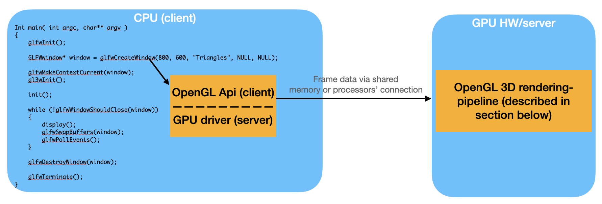
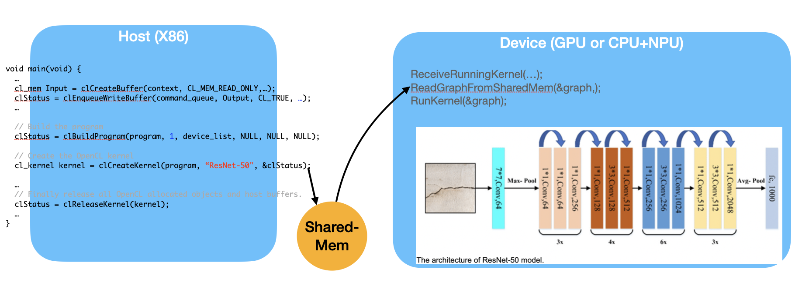

.. _sec-gpu:

The concept of GPU compiler
===========================

.. contents::
   :local:
   :depth: 4

Basicly CPU compiler is SISD (Single Instruction Single Data Architecture). 
The multimedia instructions in CPU are small scaled of SIMD
(Single Instruction Multiple Data) for 4 or 16 elements while GPU is a large 
scaled of SIMD processor coloring millions of pixels of image in few 
micro seconds.
Since the 2D or 3D graphic processing provides large opportunity in parallel
data processing, GPU hardware usually composed of thousands
of functional units in each core(grid) in N-Vidia processors.

The flow for 3D/2D graphic processing as the following diagram.

.. _opengl_flow: 

  OpenGL flow

The driver run on CPU side as :numref:`gpu_driver_role`. The OpenGL Api will call
driver's function eventually and driver finish the function's work via issuing
GPU-HW's command and/or sending data to GPU. GPU's firmware only manage clock,
voltage, power comsumption, ..., etc [#gpu-firmware-jobs]_.
Even so, GPU's rendor work from the data of 3D vertex, colors, ... sending from 
CPU and storing in GPU's memory or shared memory consume more computing power
than CPU.

.. _gpu_driver_role: 

  The role of GPU driver

This chapter is giving a concept for the flow above and focuses on shader compiler
for GPU. Furthermore, explaining how GPU has taking more applications from 
CPU through GPGPU concept and related standards emerged.

3D modeling
------------

Through creating 3D model with Triangles or Quads along on skin, the 3D model
is created with polygon mesh [#polygon]_ formed by all the vertices on the first image 
as follows,

.. _modeling1: 
.. figure:: ../Fig/gpu/modeling1.png
  :align: center
  :scale: 80 %

  Creating 3D model and texturing

After the next smooth shading [#polygon]_, the vertices and edge lines are covered 
with color (or remove edges), and model looks much more smooth [#shading]_. 
Further, after texturing (texture mapping), the model looks real more 
[#texturemapping]_.
 
To get to know how animation for a 3D modeling, please look video here [#animation1]_.
In this series of video, you find the 3D modeling tools creating Java instead of
C/C++ code calling OpenGL api and shaders. It's because Java can call OpenGL api
through a wrapper library [#joglwiki]_.

Every CAD software manufacturer such as AutoDesk and Blender has their own proprietary 
format. To solve the problem of interoperability, neutral or open source formats were 
invented as intermediate formats for converting between two proprietary formats. 
Naturally, these formats have become hugely popular now.
Two famous examples of neutral formats are STL (with a .STL extension) and COLLADA 
(with a .DAE extension). Here is the list, where the 3D file formats are marked 
with their type.

.. table:: 3D file formats [#3dfmt]_

  ==============  ==================
  3D file format  Type
  ==============  ==================
  STL             Neutral
  OBJ             ASCII variant is neutral, binary variant is proprietary
  FBX             Proprietary
  COLLADA         Neutral
  3DS             Proprietary
  IGES            Neutral
  STEP            Neutral
  VRML/X3D        Neutral
  ==============  ==================

Basic geometry in computer graphics
-----------------------------------

The complete concept can be found in
Book: "Computer graphics principles and practice 3rd editon, authors: JOHN F, 
..."

This book is very complete and may take much time to understand every detail.

Both Triangles or Quads are ploygon. So, objects can be formed with ploygon in
both 2D and 3D. About transfermation in 2D or 3D, almost every book of computer 
graphics has mentioned well already. This section introduces the most important 
concept and method for deciding Inner and Outer planes, then a point or object
can be checked for showing or hidding during 2D or 3D rendering.

The cross product in **3D** is defined by the formula and can be represented with 
matrix notation as proved here 
[#cross-product-wiki]_ [#sphinx-math]_ [#mathbase-latex]_.

.. math::

  \mathbf a \mathsf x \mathbf b = \Vert a \Vert \Vert b \Vert sin(\Theta) n

.. math::

  \mathbf a \mathsf x \mathbf b = 
  \begin{vmatrix}
  \mathbf i & \mathbf j& \mathbf k\\ 
  a_1& a_2& a_3\\ 
  b_1& b_2& b_3 
  \end{vmatrix}

The cross product in **2D** is defined by the formula and can be represented with matrix
notation as proved here 
[#cross-product-2d-proof]_ [#cross-product-2d-proof2]_.

.. math::

  \mathbf a \mathsf x \mathbf b = \Vert a \Vert \Vert b \Vert sin(\Theta)

.. math::

  \mathbf a \mathsf x \mathbf b = 
  \begin{vmatrix}
  \mathbf i & \mathbf j& \mathbf k\\ 
  a_1& a_2& 0\\ 
  b_1& b_2& 0 
  \end{vmatrix} =
  \begin{bmatrix}
  a_1& a_2 \\
  b_1& b_2
  \end{bmatrix}

After above matrix form is proved, the Antisymmetric may be proved as follows,

.. math::

  a \mathsf x b = \mathsf x&
  \begin{bmatrix}
  a \\ 
  b 
  \end{bmatrix} =
  \begin{bmatrix}
  a_1& a_2 \\ 
  b_1& b_2 
  \end{bmatrix} =
  a_1b_2 - a_2b_1 = 

.. math::

  -b_1a_2 - (-b_2a_1) = 
  \begin{bmatrix}
  - b_1& - b_2 \\ 
  a_1& a_2 
  \end{bmatrix} =
  \mathsf x&
  \begin{bmatrix}
  -b \\ 
  a 
  \end{bmatrix} =
  -b \mathsf x a 

In 2D, any two points :math:`\text{ from } P_i \text{ to } P_{i+1}` can form a 
vector and decide inner side or outer side.
For example, as :numref:`inward-edge-normals`, :math:`\Theta` is the angle
from :math:`P_iP_{i+1}` to :math:`P_iP'_{i+1} = 180^\circ`. 
So, with right-hand rule, counter clockwise order, any 
:math:`P_iQ` between :math:`P_iP_{i+1}` to :math:`P_iP'_{i+1}`, the angle of 
:math:`P_iP_{i+1}` to :math:`P_iQ = \theta, 0^\circ < \theta < 180^\circ` 
then the inward direction be decided. 

.. _inward-edge-normals: 
.. figure:: ../Fig/gpu/inward-edge-normals.png
  :align: center
  :scale: 50 %

  Inward edge normals

Polygon can be created from vertices. 
Suppose that :math:`(P_0, P_1, ..., P_n)` is a polygon. The line segments 
:math:`P_0P_1, P_1P_2`, etc., are the edges of the polygon; the vectors 
:math:`v_0 = P_1 - P_0, v_1 = P_2 - P_1, ..., v_n = P_0 - P_n` are the edges 
of the polygon.
For each edge :math:`P_i - P_{i+1}`, the inward edge normal is the vector 
:math:`\mathsf x\; v_i`; the outward edge normal is :math:`\; -\; \mathsf x\; v_i`.
Where :math:`\; \mathsf x\; v_i` is coss-product(:math:`\mathsf v_i`) as 
:numref:`inward-edge-normals`.
For a convex polygon whose vertices are listed in counterclockwise order, the 
inward edge normals point toward the interior of the polygon, and the outward 
edge normals point toward the unbounded exterior of the polygon, 
corresponding to our ordinary intuition. But if the vertices of a polygon are 
given in clockwise order, the interior and exterior swap roles. 

This cross product has an important property: Going from v to ×v involves a 
rotation by 90◦ in the same direction as the rotation that takes the positive 
x-axis to the positive y-axis.

.. _in-polygon: 
.. figure:: ../Fig/gpu/polygon.png
  :align: center
  :scale: 50 %

  Draw a polygon with vectices counter clockwise

As :numref:`in-polygon`, when drawing polygon with vectors(lines) counter 
clockwise, the ploygon will be created and the two sides of a vector(line) 
can be indentified [#cgpap]_. 
Further a point in polygon or out of polygon can be identified.
One simple way of finding whether the point is inside or outside a simple 
polygon is to test how many times a ray, starting from the point and going in 
any fixed direction, intersects the edges of the polygon. If the point is on 
the outside of the polygon the ray will intersect its edge an even number of 
times. If the point is on the inside of the polygon then it will intersect the 
edge an odd number of times [#wiki-point-in-polygon]_.

.. _3d-cross-product: 

  Cross product definition in 3D

.. _in-3d-polygon: 
.. figure:: ../Fig/gpu/3d-polygon.png
  :align: center
  :scale: 50 %

  3D polygon with directions on each plane

As the same way, through following the same direction counter clockwise to 
create 2D polygon one after one, then the 3D polygon will be created.
As :numref:`3d-cross-product`, the inward direction can be decided with a x b > 
0 and outward is a x b < 0 [#cross-product-wiki]_.
The :numref:`in-3d-polygon` is an example of 3D polygon created by 2D triangles.
The direction of plane (triangle) as the line perpendicular to the plane.

Cast a ray from the 3D point along X-axis and check how many intersections with 
outer object you find. Depending on the intersection number on each axis (even 
or odd) you can understand if your point is inside or outside 
[#point-in-3d-object]_.
Inside is odd and outside is even. As :numref:`in-3d-object`, points on the 
line going through the object satisfy this rule.

.. _in-3d-object: 
.. figure:: ../Fig/gpu/in-3d-object.png
  :align: center
  :scale: 50 %

  Point in or out 3D object

OpenGL
------

The following example from openGL redbook and example code [#redbook]_ 
[#redbook-examples]_.

.. rubric:: References/triangles.vert
.. literalinclude:: ../References/triangles.vert

.. rubric:: References/triangles.frag
.. literalinclude:: ../References/triangles.frag

.. rubric:: References/01-triangles.cpp
.. literalinclude:: ../References/01-triangles.cpp

Init(): 

- According counter clockwise rule in previous section, Triangle Primitives are
  defined in varaible vertices. After binding OpenGL 
  object Buffers[0] to vertices, vertices data will send to memory of 
  server(gpu).

- Generate Vertex Array VAOs and bind VAOs[0].

- glVertexAttribPointer( vPosition, 2, GL_FLOAT, GL_FALSE, 0, BUFFER_OFFSET(0) ):
  During gpu rendering, each vertex position will be held in vPosition and pass
  to "triangles.vert" shader because LoadShaders( shaders ).

display():

- Bind VAOs[0], set render mode to GL_TRIANGLES and send vertex data to Buffer
  (gpu memory, OpenGL pipeline). Next, GPU will do rendering pipeline descibed
  in next section.

The triangles.vert has input vPosition and no output variable, so using 
gl_Position default varaible without declaration. The triangles.frag has not 
defined input variable and has defined output variable fColor instead of using
gl_FragColor.

The "in" and "out" in shaders above are "type qualifier". 
A type qualifier is used in the OpenGL Shading Language (GLSL) to modify the 
storage or behavior of global and locally defined variables. These qualifiers 
change particular aspects of the variable, such as where they get their data 
from and so forth [#ogl-qualifier]_. 

Though attribute and varying are removed from later version 1.4 of OpenGL,
many materials in website using them [#ogl-qualifier-deprecate] 
[#github-attr-varying-depr]_. 
It's better to use "in" and "out" to replace
them as follows,

.. rubric:: replace attribute and varying with in and out
.. code-block:: c++

  uniform float scale;
  attribute vec2 position;
  // in vec2 position;
  attribute vec4 color;
  // in vec4 color;
  varying vec4 v_color;
  // out v_color

  void main()
  {
    gl_Position = vec4(position*scale, 0.0, 1.0);
    v_color = color;
  }

.. rubric:: replace attribute and varying with in and out
.. code-block:: c++

  varying vec4 v_color;
  // in vec4 v_color;

  void main()
  {
    gl_FragColor = v_color;
  }

An OpenGL program is made of two shaders [#monstar-lab-opengl]_ 
[#glumpy-shaders]_:

- The vertex shader is (commonly) executed once for every vertex we want to 
  draw. It receives some attributes as input, computes the position of this 
  vertex in space and returns it in a variable called gl_Position. It also 
  defines some varyings.

- The fragment shader is executed once for each pixel to be rendered. It 
  receives some varyings as input, computes the color of this pixel and 
  returns it in a variable called fColor.

Since we have 6 vertices in our buffer, this shader will be executed 6 times by 
the GPU (once per vertex)! We can also expect all 6 instances of the shader to 
be executed in parallel, since a GPU have so many cores.

3D Rendering
------------

3D rendering is the process of converting 3D models into 2D images on a computer 
[#3drendering_wiki]_. The steps as the following :numref:`rendering_pipeline1` 
from OpenGL website [#rendering]_ and the website has descripiton for each stage.

.. _rendering_pipeline1: 
.. figure:: ../Fig/gpu/rendering_pipeline.png
  :align: center
  :scale: 80 %

  Diagram of the Rendering Pipeline. The blue boxes are programmable shader stages.

In addition, list OpenGL rendering pipeline Figure 1.2 and stage from book 
"OpenGL Programming Guide 9th Edition" [#redbook]_ as follows,

.. _OpenGL_pipeline: 
.. figure:: ../Fig/gpu/OpenGL-pipeline.png
  :align: center
  :scale: 50 %

.. table:: OpenGL rendering pipeline from page 10 of book "OpenGL Programming Guide 9th Edition" [#redbook]_ and [#rendering]_.

  =======================  ===============
  stage                    description
  =======================  ===============
  Vertex Specification     After setting data as the example of previous section, glDrawArrays() will send data to gpu through buffer objects.
  Vertex Shading           For each vertex that is issued by a drawing command, a vertex shader will be called to process the data associated with that vertex.
  Tessellation Shading     After the vertex shader has processed each vertex’s associated data, the tessellation shader stage will continue processing that data, if it’s been activated.
  Geometry Shading         The next shader stage, geometry shading, allows additional processing of individual geometric primitives, including creating new ones, before rasterization. 
  Primitive Assembly       The previous shading stages all operate on vertices, with the information about how those vertices are organized into geometric primitives being carried along internal to OpenGL. The primitive assembly stage organizes the vertices into their associated geometric primitives in preparation for clipping and rasterization.
  Clipping                 Occasionally, vertices will be outside of the viewport—the region of the window where you’re permitted to draw—and cause the primitive associated with that vertex to be modified so none of its pixels are outside of the viewport. This operation is called clipping and is handled automatically by OpenGL.
  Rasterization            Vertex -> Fragment. The job of the rasterizer is to determine which screen locations are covered by a particular piece of geometry (point, line, or triangle). Knowing those locations, along with the input vertex data, the rasterizer linearly interpolates the data values for each varying variable in the fragment shader and sends those values as inputs into your fragment shader.
  Fragment Shading         Determine color for each pixel. The final stage where you have programmable control over the color of a screen location is fragment shading. In this shader stage, you use a shader to determine the fragment’s final color (although the next stage, per-fragment operations, can modify the color one last time) and potentially its depth value. Fragment shaders are very powerful, as they often employ texture mapping to augment the colors provided by the vertex processing stages. A fragment shader may also terminate processing a fragment if it determines the fragment shouldn’t be drawn; this process is called fragment discard. A helpful way of thinking about the difference between shaders that deal with vertices and fragment shaders is this: vertex shading (including tessellation and geometry shading) determines where on the screen a primitive is, while fragment shading uses that information to determine what color that fragment will be.
  Per-Fragment Operations  During this stage, a fragment’s visibility is determined using depth testing (also commonly known as z-buffering) and stencil testing. If a fragment successfully makes it through all of the enabled tests, it may be written directly to the framebuffer, updating the color (and possibly depth value) of its pixel, or if blending is enabled, the fragment’s color will be combined with the pixel’s current color to generate a new color that is written into the framebuffer.
  =======================  ===============

For 2D animation, the model is created by 2D only (1 face only), so it only can be 
viewed from the same face of model. If you want to display different faces of model,
multiple 2D models need to be created and switch these 2D models from face(flame) to 
face(flame) from time to time [#2danimation]_.

GLSL (GL Shader Language)
-------------------------

OpenGL is a standard for designing 2D/3D animation in computer graphic.
To do animation well, OpenGL provides a lots of api(functions) call for
graphic processing. The 3D model construction tools such as Maya, Blender, ..., etc,
only need to call this api to finish the 3D to 2D projecting function in computer.
Any GPU hardware dependent code in these api provided by GPU manufacturer.
An OpenGL program looks like the following,

.. code-block:: c++

  Vertex shader
  
  #version 330 core
  layout (location = 0) in vec3 aPos; // the position variable has attribute position 0
    
  out vec4 vertexColor; // specify a color output to the fragment shader
  
  void main()
  {
      gl_Position = vec4(aPos, 1.0); // see how we directly give a vec3 to vec4's constructor
      vertexColor = vec4(0.5, 0.0, 0.0, 1.0); // set the output variable to a dark-red color
  }
  Fragment shader
  
  #version 330 core
  out vec4 FragColor;
    
  in vec4 vertexColor; // the input variable from the vertex shader (same name and same type)  
  
  void main()
  {
      FragColor = computeColorOfThisPixel(...);
  } 
  
  // openGl user program
  int main(int argc, char ** argv)
  {
    // init window, detect user input and do corresponding animation by calling opengl api
    ...
  }

The last main() is programed by user obviously. Let's explain what the first two 
main() work for. 
As you know, the OpenGL is a lots of api to let programmer display the 3D object 
into 2D computer screen explained from book of concept of computer graphic.
3D graphic model can set light and object texture by user firstly, and calculating the 
postion of each vertex secondly, then color for each pixel automatically by 3D software 
and GPU thirdly, finally display the color of each pixel in computer screen.
But in order to let user/programmer add some special effect or decoration in 
coordinate for each vertex or in color for each pixel, OpenGL provides these two 
functions to do it. 
OpenGL uses fragment shader instead of pixel is : "Fragment shaders are a more 
accurate name for the same functionality as Pixel shaders. They aren’t pixels 
yet, since the output still has to past several tests (depth, alpha, stencil) 
as well as the fact that one may be using antialiasing, which renders 
one-fragment-to-one-pixel non-true [#fragmentshader_reason]_.
Programmer is allowed to add their converting functions that compiler translate them 
into GPU instructions running on GPU processor. With these two shaders, new 
features have been added to allow for increased flexibility in the rendering 
pipeline at the vertex and fragment level [#shaderswiki]_.
Unlike the shaders example here [#shadersex]_, some converting functions 
for coordinate in vertex shader or for color in fragment shade are more 
complicated according the scenes of 
animation. Here is an example [#glsleffect]_.
In wiki shading page [#shading]_, Gourand and Phong shading methods make the
surface of object more smooth by glsl. Example glsl code of Gourand 
and Phong shading on OpenGL api are here [#smoothshadingex]_.
Since the hardware of graphic card and software graphic driver can be replaced, 
the compiler is run on-line meaning driver will compile the shaders program when 
it is run at first time and kept in cache after compilation [#on-line]_.

The shaders program is C-like syntax and can be compiled in few mini-seconds, 
add up this few mini-seconds of on-line compilation time in running OpenGL 
program is a good choice for dealing the cases of driver software or gpu 
hardware replacement [#onlinecompile]_. 

In addition, OpenGL provides vertex buffer object (VBO) allowing 
vertex array data to be stored in high-performance graphics memory on the 
server side and promotes efficient data transfer [#vbo]_ [#classorvbo]_.

OpenGL Shader compiler
-----------------------

OpenGL standard is here [#openglspec]_. The OpenGL is for desktop computer or server
while the OpenGL ES is for embedded system [#opengleswiki]_. Though shaders are only
a small part of the whole OpenGL software/hardware system. It is still a large effort 
to finish the compiler implementation since there are lots of api need to be 
implemented.
For example, there are 80 related texture APIs [#textureapi]_.
This implementation can be done by generating llvm extended intrinsic functions 
from shader parser of frontend compiler as well as llvm backend converting those intrinsic 
to gpu instructions as follows,

.. code-block:: console

  #version 320 es
  uniform sampler2D x;
  out vec4 FragColor;
  
  void main()
  {
      FragColor = texture(x, uv_2d, bias);
  }
  
  ...
  !1 = !{!"sampler_2d"}
  !2 = !{i32 SAMPLER_2D} : SAMPLER_2D is integer value for sampler2D, for example: 0x0f02
  ; A named metadata.
  !x_meta = !{!1, !2}

  define void @main() #0 {
      ...
      %1 = @llvm.gpu0.texture(metadata !x_meta, %1, %2, %3); // %1: %sampler_2d, %2: %uv_2d, %3: %bias
      ...
  }
  
  ...
  // gpu machine code
  load $1, tex_a;
  sample2d_inst $1, $2, $3 // $1: tex_a, $2: %uv_2d, $3: %bias

  .tex_a // Driver set the index of gpu descriptor regsters here

As the bottom of code above, .tex_a memory address includes the Texture Object
which binding by driver in on-line compilation/linking. Through binding Texture
Object (SW) and Texture Unit (HW) with OpenGL API, gpu will uses Texture Unit HW
resources efficiently. Explaining it the following. 
      
About llvm intrinsic extended function, please refer this book here [#intrinsiccpu0]_.

.. code-block:: c++

  gvec4 texture(gsampler2D sampler, vec2 P, [float bias]);

GPU provides 'Texture Unit' to speedup fragment shader. However the 
‘Texture Unit’ HW is expensive resouce and only few of them in a GPU. 
Driver can associate ‘Texture Unit’ to sampler variable by OpenGL api 
and switch between shaders as the following statements.

.. _sampling: 
.. figure:: ../Fig/gpu/sampling_diagram.png
  :align: center
  :scale: 60 %

  Relationships between the texturing concept [#textureobject]_.

The :numref:`sampling` as above.
The texture object is not bound directly into the shader (where the actual 
sampling takes place). Instead, it is bound to a 'texture unit' whose index 
is passed to the shader. So the shader reaches the texture object by going 
through the texture unit. There are usually multiple texture units available 
and the exact number depends on the capability of your graphic card [#textureobject]_. 
A texture unit, also called a texture mapping unit (TMU) or a texture processing 
unit (TPU), is a hardware component in a GPU that does sampling operation.
The argument sampler in texture function as above is sampler_2d index from
'teuxture unit' for texture object [#textureobject]_. 

'sampler uniform variable':

There is a group of special uniform variables for that, according to the texture 
target: 'sampler1D', 'sampler2D', 'sampler3D', 'samplerCube', etc. 
You can create as many 'sampler uniform variables' as you want and assign the 
value of a texture unit to each one from the application. 
Whenever you call a sampling function on a 'sampler uniform variable' the 
corresponding texture unit (and texture object) will be used [#textureobject]_.

.. _sampling_binding: 
.. figure:: ../Fig/gpu/sampling_diagram_binding.png
  :align: center

  Binding sampler variables [#tpu]_.

As :numref:`sampling_binding`, the Java api
gl.bindTexture binding 'Texture Object' to 'Texture Unit'. 
The gl.getUniformLocation and gl.uniform1i associate 'Texture Unit' to
'sampler uniform variables'. 

gl.uniform1i(xLoc, 1): where 1 is 
'Texture Unit 1', 2 is 'Texture Unit 2', ..., etc [#tpu]_.

The following figure depicts how driver read metadata from compiled glsl obj,
OpenGL api associate 'Sample Variable' and gpu executing texture instruction.

.. _driverSamplerTable: 
.. figure:: ../Fig/gpu/driverSamplerTable.png
  :align: center

  Associating Sampler Variables and gpu executing texture instruction

Explaining the detail steps for figure above as the following.

1. In order to let the 'texture unit' binding by driver, frontend compiler must
pass the metadata of 'sampler uniform variable' (sampler_2d_var in this example) 
[#samplervar]_ to backend, and backend must 
allocate the metadata of 'sampler uniform variable' in the compiled 
binary file [#metadata]_. 

2. After gpu driver executing glsl on-line compiling,
driver read this metadata from compiled binary file and maintain a 
table of {name, type, location} for each 'sampler uniform variable'.
Driver also fill this information to Texture Desciptor in GPU's memory.

3. Api,

.. code-block:: c++

  xLoc = gl.getUniformLocation(prog, "x"); // prog: glsl program, xLoc
  
will get the location from the table for 'sampler uniform variable' x that
driver created.

SAMPLER_2D: is integer value for Sampler2D type.

4. Api,

.. code-block:: c++

  gl.uniform1i( xLoc, 1 );
  
will binding xLoc of 'sampler uniform variable' x to 
'Texture Unit 1' by writing 1 to the glsl binary metadata location of
'sampler uniform variable' x as follows,

.. code-block:: console

  {xLoc, 1} : 1 is 'Texture Unit 1', xLoc is the location(memory address) of 'sampler uniform variable' x
  
This api will set the texture descriptors in gpu with this {xLoc, 1} 
information.
Next, driver set the index or memory address of gpu texture descriptors to 
variable .tex_a of memory address. For example as diagram, driver set k to 
.tex_a.
  
5.

.. code-block:: console

  // gpu machine code
  load $1, tex_a;
  sample2d_inst $1, $2, $3 // $1: tex_a, $2: %uv_2d, $3: %bias

  .tex_a // Driver set the index of gpu descriptor regsters here at step 4
      
When executing the texture instructions from glsl binary file on gpu, the 
corresponding 'Texture Unit 1' on gpu will being executed through texture 
descriptor in gpu's memory because .tex_a: {xLoc, 1}. Driver may set
texture descriptor in gpu's texture desciptors if gpu provides specific
texture descriptors in architecture [#descriptorreg]_.

For instance, Nvidia texture instruction as follow,

.. code-block:: console

  // the content of tex_a bound to texture unit as step 5 above
  tex.3d.v4.s32.s32  {r1,r2,r3,r4}, [tex_a, {f1,f2,f3,f4}];

  .tex_a

The content of tex_a bound to texture unit set by driver as the end of step 4.
The pixel of coordinates (x,y,z) is given by (f1,f2,f3) user input.
The f4 is skipped for 3D texture.

Above tex.3d texture instruction load the calculated color of pixel (x,y,z) from 
texture image into GPRs (r1,r2,r3,r4)=(R,G,B,A). 
And fragment shader can re-calculate the color of this pixel with the color of
this pixel at texture image [#ptxtex]_. 

If it is 1d texture instruction, the tex.1d as follows,

.. code-block:: console

  tex.1d.v4.s32.f32  {r1,r2,r3,r4}, [tex_a, {f1}];

Since 'Texture Unit' is limited hardware accelerator on gpu, OpenGL
providing api to user program for binding 'Texture Unit' to 'Sampler Variables'.
As a result, user program is allowed doing load balance in using 'Texture Unit'
through OpenGL api without recompiling glsl. 
Fast texture sampling is one of the key requirements for good GPU performance 
[#tpu]_.

In addition to api for binding texture, OpenGL provides glTexParameteri api to
do Texture Wrapping [#texturewrapper]_. 
Furthmore the texture instruction for some gpu may including S# T# values in operands.
Same with associating 'Sampler Variables' to 'Texture Unit', S# and T# are
location of memory associated to Texture Wrapping descriptor registers allowing 
user program to change Wrapping option without re-compiling glsl.

Even glsl frontend compiler always expanding function call into inline function 
as well as llvm intrinsic extended function providing an easy way to do code 
generation through llvm td (Target Description) file written, 
GPU backend compiler is still a little complex than CPU backend. 
(But when considering the effort in frontend compier such as clang, or other 
toolchain such
as linker and gdb/lldb, of course, CPU compiler is not easier than
GPU compiler.)

Here is the software stack of 3D graphic system for OpenGL in linux [#mesawiki]_.
And mesa open source website is here [#mesa]_.

Architecture
------------

SIMT
~~~~

Single instruction, multiple threads (SIMT) is an execution model used in 
parallel computing where single instruction, multiple data (SIMD) is combined 
with multithreading [#simt-wiki]_.

The leading GPU architecture of Nvidia's gpu is as the following 
figures.

.. _grid: 
.. figure:: ../Fig/gpu/grid.png
  :align: center
  :scale: 100 %

  core(grid) in Nvidia gpu (figure from book [#Quantitative-grid]_)
 
.. _simd-processors: 
.. figure:: ../Fig/gpu/SIMD-processors.png
  :align: center
  :scale: 100 %

  SIMD processors (figure from book [#Quantitative-simd-processors]_)

.. _threadslanes: 
.. figure:: ../Fig/gpu/threads-lanes.png
  :align: center
  :scale: 100 %

  threads and lanes in gpu (figure from book [#Quantitative-threads-lanes]_)
  
  
.. _gpu-mem: 
.. figure:: ../Fig/gpu/memory.png
  :align: center
  :scale: 80 %

  core(grid) in Nvidia's gpu (figure from book [#Quantitative-gpu-mem]_)

Buffers
~~~~~~~

In addition the texture unit and instruction, GPU provides different Buffers
to speedup OpenGL pipeline rendering [#buffers-redbook]_.

- Color buffer

  They contain the RGB or sRGB color data and may also contain alpha values for 
  each pixel in the framebuffer. There may be multiple color buffers in a 
  framebuffer.
  You’ve already used double buffering for animation. Double buffering is done 
  by making the main color buffer have two parts: a front buffer that’s displayed 
  in your window; and a back buffer, which is where you render the new image 
  [#redbook-p155]_.

- Depth buffer (Z buffer)

  Depth is measured in terms of distance to the eye, so pixels with larger 
  depth-buffer values are overwritten by pixels with smaller values 
  [#redbook-p156]_ [#z-buffer-wiki]_ [#depthstencils-ogl]_.

- Stencil Buffer

  In the simplest case, the stencil buffer is used to limit the area of 
  rendering (stenciling) [#stencils-buffer-wiki]_ [#depthstencils-ogl]_.  

- Frame Buffer

  OpenGL offers: the color, depth and stencil buffers. 
  This combination of buffers is known as the default framebuffer and as you've 
  seen, a framebuffer is an area in memory that can be rendered to 
  [#framebuffers-ogl]_. 

General purpose GPU
--------------------

Since GLSL shaders provide a general way for writing C code in them, if applying
a software frame work instead of OpenGL api, then the system can run some data
parallel computation on GPU for speeding up and even get CPU and GPU executing 
simultaneously. Furthmore, any language that allows the code running on the CPU to poll 
a GPU shader for return values, can create a GPGPU framework [#gpgpuwiki]_.
The following is a CUDA example to run large data in array on GPU [#cudaex]_ 
as follows,

.. code-block:: c++

  __global__
  void saxpy(int n, float a, float * x, float * y)
  {
    int i = blockIdx.x*blockDim.x + threadIdx.x;
    if (i < n) y[i] = a*x[i] + y[i];
  }
  
  int main(void)
  {
    ...
    cudaMemcpy(d_x, x, N*sizeof(float), cudaMemcpyHostToDevice);
    cudaMemcpy(d_y, y, N*sizeof(float), cudaMemcpyHostToDevice);
    ...
    cudaMemcpy(y, d_y, N*sizeof(float), cudaMemcpyDeviceToHost);
    ...
  }

In the programming example saxpy() above,

- blockIdx is index of ThreadBlock

- threadIdx is index of SIMD Thread

- blockDim is the number of total Thread Blocks in a Grid

A GPU may has the HW structure and handle the subset of y[]=a*x[]+y[] array-calculation as follows,

- A Grid: has 16 Thread Blocks (Cores).

- A Core: has 16 Threads (Warps, Cuda Threads).

- A Thread: has 16 Lanes (vector instruction with processing 16-elements).

.. table:: Map (Core,Thread) to saxpy

  ============  =================================================  =================================================  =======  ===========================================
  -             Thread-0                                           Thread-1                                           ...      Thread-15
  ============  =================================================  =================================================  =======  ===========================================
  Core-0        y[0..31] = a * x[0..31] * y[0..31]                 y[32..63] = a * x[32..63] + y[32..63]              ...      y[480..511] = a * x[480..511] + y[480..511] 
  ...           ...                                                ...                                                ...      ...
  Core-15       y[7680..7711] = a * ...                            ...                                                ...      y[8160..8191] = a * x[8160..8191] + y[8160..8191] 
  ============  =================================================  =================================================  =======  ===========================================

- Grid is Vectorizable Loop [#Quantitative-gpu-griddef]_.

- Thread Block <-> SIMD Processor (Core). 
  Warp has it's own
  PC and TLR (Thread Level Registers). Warp may map to
  one whole function or part of function. Compiler and run time may assign
  them to the same Warp or different Warps [#Quantitative-gpu-warp]_.

- SIMD Processors are full processors with separate PCs and are programmed using
  threads [#Quantitative-gpu-threadblock]_. 
  As :numref:`simd-processors`, it assigns 16 Thread blocks to 16 SIMD Processors.
  
- As :numref:`grid`, 
  the maximum number of SIMD Threads that can execute simultaneously per Thread Block 
  (SIMD Processor) is 32 for the later Fermi-generation GPUs.
  Each SIMD Thread has 32 elements run as :numref:`threadslanes` on 
  16 SIMD lanes (number of functional units just same
  as in vector processor). So it takes 2 clock cycles to complete [#lanes]_, also
  known as "ping pong" cycles.

- Each thread handle 32 elements computing, assuming 4 registers for 1 element,
  then there are 4*32=128 Thread Level Registers, TLR, occupied in a thread to 
  support the SIMT computing. So, assume a GPU architecture allocating 256 TLR
  to a Thread (Warp), then it has sufficient TLR for more complicated statement,
  such as a*x[i]+b*[y]+c*[z] without spilling in register allocation. 16 lanes
  share the 256 TLR.

- Each Thread Block (Core/Warp) has 16 threads, so there are 16*256 = 4K TLR in 
  a Core.

- After Volta GPU of Nvidia, each thread in Warp has it's own PC [#Volta]_. In 
  Cuda Applications, this feature provides more parallel opportunities with 
  __syncwarp() to user programmers.

The main() run on CPU while the saxpy() run on GPU. Through 
cudaMemcpyHostToDevice and cudaMemcpyDeviceToHost, CPU can pass data in x and y
arrays to GPU and get result from GPU to y array. 
Since both of these memory transfers trigger the DMA functions without CPU operation,
it may speed up by running both CPU/GPU with their data in their own cache 
repectively.
After DMA memcpy from cpu's memory to gpu's, gpu operates the whole loop of matrix 
operation for "y[] = a*x[]+y[];"
instructions with one Grid. Furthermore liking vector processor, gpu provides
Vector Mask Registers to Handling IF Statements in Vector Loops as the following 
code [#VMR]_,

.. code:: text

  for(i=0;i<64; i=i+1)
    if (X[i] != 0)
      X[i] = X[i] – Y[i];

.. code:: asm

  LV V1,Rx         ;load vector X into V1
  LV V2,Ry         ;load vector Y
  L.D F0,#0        ;load FP zero into F0
  SNEVS.D V1,F0    ;sets VM(i) to 1 if V1(i)!=F0
  SUBVV.D V1,V1,V2 ;subtract under vector mask 
  SV V1,Rx         ;store the result in X

GPU persues throughput from SIMD application. Can hide cache-miss latence from 
SMT. As result GPU may hasn't L2 and L3 like CPU for each core since GPU is highly 
latency-tolerant multithreading for data parallel application [#gpu-latency-tolerant]_.
DMA memcpy map the data in cpu memory to each l1 cache of core on gpu memory.
Many gpu provides operations scatter and gather to access DRAM data for stream 
processing [#Quantitative-gpu-sparse-matrix]_ [#gpgpuwiki]_ [#shadingl1]_.

When the GPU function is dense computation in array such as MPEG4 encoder or
deep learning for tuning weights, it may get much speed up [#mpeg4speedup]_. 
However when GPU function is matrix addition and CPU will idle for waiting 
GPU's result. It may slow down than doing matrix addition by CPU only.
Arithmetic intensity is defined as the number of operations performed per word of 
memory transferred. It is important for GPGPU applications to have high arithmetic 
intensity else the memory access latency will limit computational speedup 
[#gpgpuwiki]_. 

Wiki here [#gpuspeedup]_ includes speedup applications for gpu as follows:

General Purpose Computing on GPU, has found its way into fields as diverse as 
machine learning, oil exploration, scientific image processing, linear algebra,
statistics, 3D reconstruction and even stock options pricing determination.
In addition, section "GPU accelerated video decoding and encoding" for video 
compressing [#gpuspeedup]_ gives the more applications for GPU acceleration.

.. table:: The differences for speedup in architecture of CPU and GPU

  ============  ================================  =========
  Item          CPU                               GPU
  ============  ================================  =========
  Application   Non-data parallel                 Data parallel
  Architecture  SISD, small vector (eg.4*32bits)  Large SIMD (eg.16*32bits)
  Cache         Smaller and faster                Larger and slower (ref. The following Note)
  ILP           Pipeline                          Pipeline
   -            Superscalar, SMT                  SIMT
   -            Super-pipeline
  Core          Smaller threads for SMT (2 or 4)  Larger threads (16 or 32)
  Branch        Conditional-instructions          Mask & conditional-instructions
  ============  ================================  =========
                             
.. note:: **GPU-Cache**
 
  In theory for data parallel application in GPU's SMT, GPU can schedule more
  threads and pursues throughput rather speedup for one single thread as SISD in
  CPU. However in reality, GPU provides small L1 cache like CPU's and fill the 
  cache-miss with scheduline another thread. So, GPU may has no L2 and L3 while
  CPU has deep level of caches.

Vulkan and spir-v
-----------------

.. _opencl_to_spirv: 
.. figure:: ../Fig/gpu/opencl-to-spirv-offine-compilation.png
  :align: center
  :scale: 40 %

  Offline Compilation of OpenCL Kernels into SPIR-V Using Open Source Tooling [#opencl-to-spirv]_

Difference between OpenCL and OpenGL's compute shader. [#diff-compute-shader-opencl]_

Though OpenGL api existed in higher level with many advantages from sections
above, sometimes it cannot compete in efficience with direct3D providing 
lower levels api for operating memory by user program [#vulkanapiwiki]_. 
Vulkan api is lower level's C/C++ api to fill the gap allowing user program to 
do these things in OpenGL to compete against Microsoft direct3D. 
Here is an example [#vulkanex]_. Meanwhile glsl is C-like language. The vulkan 
infrastructure provides tool, glslangValidator [#spirvtoolchain]_, to compile 
glsl into an Intermediate Representation 
Form (IR) called spir-v off-line. 
As a result, it saves part of compilation time from glsl to gpu instructions 
on-line
since spir-v is an IR of level closing to llvm IR [#spirvwiki]_. 
In addition, vulkan api reduces gpu drivers efforts in optimization and code 
generation [#vulkanapiwiki]_. These standards provide user programmer option to 
using vulkan/spir-v instead of OpenGL/glsl, and allow them pre-compiling glsl 
into spir-v off-line to saving part of on-line compilation time.

With vulkan and spir-v standard, the gpu can be used in OpenCL for Parallel 
Programming of Heterogeneous Systems [#opencl]_ [#computekernelwiki]_.
Similar with Cuda, a OpenCL example for fast Fourier transform (FFT) is here 
[#openclexfft]_.
Once OpenCL grows into a popular standard when more computer languages or 
framework supporting OpenCL language, GPU will take more jobs from CPU 
[#opencl-wiki-supported-lang]_.

Now, you find llvm IR expanding from cpu to gpu becoming influentially more and
more. And actually, llvm IR expanding from version 3.1 util now as I can feel.

Accelerate ML/DL on OpenCL/SYCL
-------------------------------

.. _opengl_ml_graph: 

  Implement ML graph scheduler both on compiler and runtime

As above figure, the Device of GPU or CPU+NPU is able to run the whole ML graph. 
However if the Device has NPU only, then the CPU operation such as Avg-Pool
has to run on Host side which add communication cost between Host and Device.

Like OpenGL's shader, the "kernel" function may be compiled on-line or off-line
and sending to GPU as programmable functions.
 
In order to run ML (Machine Learning) efficiently, all platforms for ML on 
GPU/NPU implement scheduling SW both on graph compiler and runtime. 
**If OpenCL can extend to support ML graph, then graph compiler such as TVM or 
Runtime from Open Source have chance to leverage the effort of scheduling SW from 
programmers** [#paper-graph-on-opencl]_. Cuda graph is an idea  like this 
[#cuda-graph-blog]_ [#cuda-graph-pytorch]_ .

.. [#gpu-firmware-jobs] https://antonelly.com.co/do-gpus-have-firmware/#:~:text=Providing%20access%20to%20new%20features,drivers%20during%20the%20boot%20process

.. [#polygon] https://www.quora.com/Which-one-is-better-for-3D-modeling-Quads-or-Tris

.. [#shading] https://en.wikipedia.org/wiki/Shading

.. [#texturemapping] https://en.wikipedia.org/wiki/Texture_mapping

.. [#animation1] https://www.youtube.com/watch?v=f3Cr8Yx3GGA

.. [#joglwiki] https://en.wikipedia.org/wiki/Java_OpenGL

.. [#sphinx-math] https://sphinx-rtd-trial.readthedocs.io/en/latest/ext/math.html#module-sphinx.ext.mathbase

.. [#mathbase-latex] https://mirrors.mit.edu/CTAN/info/short-math-guide/short-math-guide.pdf

.. [#cgpap] Figure 7.19 of Book: Computer graphics principles and practice 3rd edition

.. [#wiki-point-in-polygon] https://en.wikipedia.org/wiki/Point_in_polygon

.. [#cross-product-wiki] https://en.wikipedia.org/wiki/Cross_product

.. [#cross-product-2d-proof] https://www.xarg.org/book/linear-algebra/2d-perp-product/

.. [#cross-product-2d-proof2] https://www.nagwa.com/en/explainers/175169159270/

.. [#point-in-3d-object] https://stackoverflow.com/questions/63557043/how-to-determine-whether-a-point-is-inside-or-outside-a-3d-model-computationally

.. [#3dfmt] https://all3dp.com/3d-file-format-3d-files-3d-printer-3d-cad-vrml-stl-obj/

.. [#3drendering_wiki] https://en.wikipedia.org/wiki/3D_rendering

.. [#rendering] https://www.khronos.org/opengl/wiki/Rendering_Pipeline_Overview

.. [#2danimation] https://tw.video.search.yahoo.com/search/video?fr=yfp-search-sb&p=2d+animation#id=12&vid=46be09edf57b960ae79e9cd077eea1ea&action=view

.. [#redbook] http://www.opengl-redbook.com

.. [#redbook-examples] https://github.com/openglredbook/examples

.. [#monstar-lab-opengl] https://engineering.monstar-lab.com/en/post/2022/03/01/Introduction-To-GPUs-With-OpenGL/

.. [#glumpy-shaders] https://glumpy.github.io/modern-gl.html

.. [#ogl-qualifier] https://www.khronos.org/opengl/wiki/Type_Qualifier_(GLSL)

.. [#ogl-qualifier-deprecate] https://www.khronos.org/opengl/wiki/Type_Qualifier_(GLSL)#Removed_qualifiers

.. [#github-attr-varying-depr] https://github.com/vispy/vispy/issues/242

.. [#fragmentshader_reason] https://community.khronos.org/t/pixel-vs-fragment-shader/52838

.. [#shaderswiki] https://en.m.wikipedia.org/wiki/OpenGL_Shading_Language

.. [#shadersex] https://learnopengl.com/Getting-started/Shaders

.. [#glsleffect] https://www.youtube.com/watch?v=LyoSSoYyfVU at 5:25 from beginning: combine different textures.

.. [#smoothshadingex] https://github.com/ruange/Gouraud-Shading-and-Phong-Shading

.. [#on-line] Compiler and interpreter: (https://www.guru99.com/difference-compiler-vs-interpreter.html). AOT compiler: compiles before running; JIT compiler: compiles while running; interpreter: runs (reference https://softwareengineering.stackexchange.com/questions/246094/understanding-the-differences-traditional-interpreter-jit-compiler-jit-interp). Both online and offline compiler are AOT compiler. User call OpenGL api to run their program and the driver call call online compiler to compile user's shaders without user compiling their shader before running their program. When user run a CPU program of C language, he must compile C program before running the program. This is offline compiler.

.. [#onlinecompile] https://community.khronos.org/t/offline-glsl-compilation/61784

.. [#classorvbo] If your models will be rigid, meaning you will not change each vertex individually, and you will render many frames with the same model, you will achieve the best performance not by storing the models in your class, but in vertex buffer objects (VBOs) https://gamedev.stackexchange.com/questions/19560/what-is-the-best-way-to-store-meshes-or-3d-models-in-a-class

.. [#vbo] http://www.songho.ca/opengl/gl_vbo.html

.. [#openglspec] https://www.khronos.org/registry/OpenGL-Refpages/

.. [#opengleswiki] https://en.wikipedia.org/wiki/OpenGL_ES

.. [#textureapi] All the api listed in section 8.9 of https://www.khronos.org/registry/OpenGL/specs/es/3.2/GLSL_ES_Specification_3.20.html#texture-functions

.. [#intrinsiccpu0] http://jonathan2251.github.io/lbd/funccall.html#add-specific-backend-intrinsic-function

.. [#textureobject] http://ogldev.atspace.co.uk/www/tutorial16/tutorial16.html

.. [#tpu] http://math.hws.edu/graphicsbook/c6/s4.html

.. [#metadata] This can be done by llvm metadata. http://llvm.org/docs/LangRef.html#namedmetadatastructure http://llvm.org/docs/LangRef.html#metadata

.. [#ptxtex] page 84: tex instruction, p24: texture memory https://www.nvidia.com/content/CUDA-ptx_isa_1.4.pdf

.. [#samplervar] The type of 'sampler uniform variable' called "sampler variables". http://math.hws.edu/graphicsbook/c6/s4.html

.. [#descriptorreg] When performing a texture fetch, the addresses to read pixel data from are computed by reading the GPRs that hold the texture descriptor and the GPRs that hold the texture coordinates. It's mostly just general purpose memory fetching. https://www.gamedev.net/forums/topic/681503-texture-units/ 

.. [#texturewrapper] https://learnopengl.com/Getting-started/Textures

.. [#mesawiki] https://en.wikipedia.org/wiki/Mesa_(computer_graphics)

.. [#mesa] https://www.mesa3d.org/

.. [#simt-wiki] https://en.wikipedia.org/wiki/Single_instruction,_multiple_threads

.. [#Quantitative-grid] Book Figure 4.13 of Computer Architecture: A Quantitative Approach 5th edition (The
       Morgan Kaufmann Series in Computer Architecture and Design)

.. [#Quantitative-simd-processors] Book Figure 4.15 of Computer Architecture: A Quantitative Approach 5th edition (The
       Morgan Kaufmann Series in Computer Architecture and Design)

.. [#Quantitative-threads-lanes] The SIMD Thread Scheduler includes a scoreboard that lets it know which threads of SIMD instructions are ready to run, and then it sends them off to a dispatch unit to be run on the multithreaded SIMD Processor. It is identical to a hardware thread scheduler in a traditional multithreaded processor (see Chapter 3), just that it is scheduling threads of SIMD instructions. Thus, GPU hardware has two levels of hardware schedulers: (1) the Thread Block Scheduler that assigns Thread Blocks (bodies of vectorized loops) to multi- threaded SIMD Processors, which ensures that thread blocks are assigned to the processors whose local memories have the corresponding data, and (2) the SIMD Thread Scheduler within a SIMD Processor, which schedules when threads of SIMD instructions should run. 
       Book Figure 4.14 of Computer Architecture: A Quantitative Approach 5th edition (The
       Morgan Kaufmann Series in Computer Architecture and Design) 

.. [#Quantitative-gpu-mem] Book Figure 4.17 of Computer Architecture: A Quantitative Approach 5th edition (The
       Morgan Kaufmann Series in Computer Architecture and Design)

.. [#buffers-redbook] Page 155 - 185 of book "OpenGL Programming Guide 9th Edition" [#redbook]_.

.. [#redbook-p155] Page 155 of book "OpenGL Programming Guide 9th Edition" [#redbook]_.

.. [#redbook-p156] Page 156 of book "OpenGL Programming Guide 9th Edition" [#redbook]_.

..  [#z-buffer-wiki] https://en.wikipedia.org/wiki/Z-buffering

.. [#depthstencils-ogl] https://open.gl/depthstencils

.. [#stencils-buffer-wiki] https://en.wikipedia.org/wiki/Stencil_buffer

.. [#framebuffers-ogl] https://open.gl/framebuffers

.. [#Quantitative-gpu-griddef] Book Figure 4.12 of Computer Architecture: A Quantitative Approach 5th edition (The
       Morgan Kaufmann Series in Computer Architecture and Design)

.. [#Quantitative-gpu-warp] Book Figure 4.14 and 4.24 of Computer Architecture: A Quantitative Approach 5th edition (The
       Morgan Kaufmann Series in Computer Architecture and Design)

.. [#Quantitative-gpu-threadblock] search these words from section 4.4 of A Quantitative Approach 5th edition (The
       Morgan Kaufmann Series in Computer Architecture and Design)
       
.. [#lanes] "With Fermi, each 32-wide thread of SIMD instructions is mapped to 16 physical SIMD Lanes, so each SIMD instruction in a thread of SIMD instructions takes two clock cycles to complete" search these words from Page 296 of Computer Architecture: A Quantitative Approach 5th edition (The
       Morgan Kaufmann Series in Computer Architecture and Design).
       

.. [#gpgpuwiki] https://en.wikipedia.org/wiki/General-purpose_computing_on_graphics_processing_units

.. [#cudaex] https://devblogs.nvidia.com/easy-introduction-cuda-c-and-c/

.. [#Volta] Page 25 of https://images.nvidia.com/content/volta-architecture/pdf/volta-architecture-whitepaper.pdf

.. [#VMR] subsection Vector Mask Registers: Handling IF Statements in Vector Loops of Computer Architecture: A Quantitative Approach 5th edition (The
       Morgan Kaufmann Series in Computer Architecture and Design)

.. [#gpu-latency-tolerant] From section 2.3.2 of book "Heterogeneous Computing with OpenCL 2.0" 3rd edition. https://dahlan.unimal.ac.id/files/ebooks2/2015%203rd%20Heterogeneous%20Computing%20with%20OpenCL%202.0.pdf as follows, "These tasks and the pixels they process are highly parallel, which gives a substan- tial amount of independent work to process for devices with multiple cores and highly latency-tolerant multithreading."

.. [#Quantitative-gpu-sparse-matrix] Reference "Gather-Scatter: Handling Sparse Matrices in Vector Architectures": section 4.2 Vector Architecture of A Quantitative Approach 5th edition (The
       Morgan Kaufmann Series in Computer Architecture and Design)

.. [#shadingl1] The whole chip shares a single L2 cache, but the different units will have individual L1 caches. https://computergraphics.stackexchange.com/questions/355/how-does-texture-cache-work-considering-multiple-shader-units

.. [#mpeg4speedup] https://www.manchestervideo.com/2016/06/11/speed-h-264-encoding-budget-gpu/

.. [#gpuspeedup] https://en.wikipedia.org/wiki/Graphics_processing_unit

.. [#diff-compute-shader-opencl] https://stackoverflow.com/questions/15868498/what-is-the-difference-between-opencl-and-opengls-compute-shader

.. [#opencl-to-spirv] https://www.khronos.org/blog/offline-compilation-of-opencl-kernels-into-spir-v-using-open-source-tooling

.. [#vulkanapiwiki] Vulkan offers lower overhead, more direct control over the GPU, and lower CPU usage... By allowing shader pre-compilation, application initialization speed is improved... A Vulkan driver only needs to do GPU specific optimization and code generation, resulting in easier driver maintenance... https://en.wikipedia.org/wiki/Vulkan https://en.wikipedia.org/wiki/Vulkan#OpenGL_vs._Vulkan

.. [#vulkanex] https://github.com/SaschaWillems/Vulkan/blob/master/examples/triangle/triangle.cpp

.. [#spirvtoolchain] glslangValidator is the tool used to compile GLSL shaders into SPIR-V, Vulkan's shader format. https://vulkan.lunarg.com/doc/sdk/latest/windows/spirv_toolchain.html

.. [#spirvwiki] SPIR 2.0: LLVM IR version 3.4. SPIR-V 1.X: 100% Khronos defined Round-trip lossless conversion to llvm.  https://en.wikipedia.org/wiki/Standard_Portable_Intermediate_Representation

.. [#opencl] https://www.khronos.org/opencl/

.. [#computekernelwiki] https://en.wikipedia.org/wiki/Compute_kernel

.. [#openclexfft] https://en.wikipedia.org/wiki/OpenCL

.. [#opencl-wiki-supported-lang] The OpenCL standard defines host APIs for C and C++; third-party APIs exist for other programming languages and platforms such as Python,[15] Java, Perl[15] and .NET.[11]:15 https://en.wikipedia.org/wiki/OpenCL

.. [#paper-graph-on-opencl] https://easychair.org/publications/preprint/GjhX

.. [#cuda-graph-blog] https://developer.nvidia.com/blog/cuda-graphs/

.. [#cuda-graph-pytorch] https://pytorch.org/blog/accelerating-pytorch-with-cuda-graphs/
