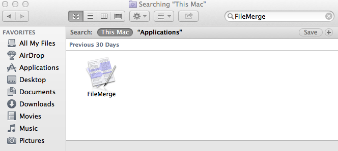
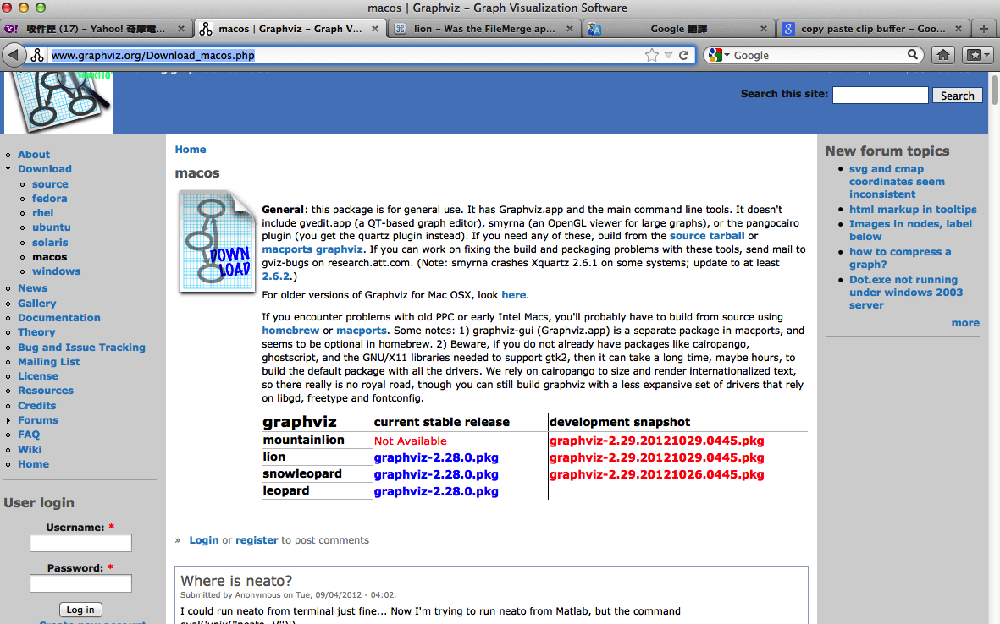

.. _sec-appendix-installing:

Appendix A: Getting Started: Installing LLVM and the Cpu0 example code
======================================================================

.. contents::
   :local:
   :depth: 4

Cpu0 example code, lbdex, can be found at near left bottom of this web site. Or 
here http://jonathan2251.github.io/lbd/lbdex.tar.gz.

In this chapter, we will run through how to set up LLVM using if you are using 
Mac OS X or Linux.
For information on using ``cmake`` to build LLVM, please refer to the "Building 
LLVM with CMake" [#llvm-cmake]_ documentation for further information. 

We will install two llvm directories in this chapter. One is the directory 
~/llvm/release/ which contains the clang and clang++ compiler we will use to 
translate the C/C++ input file into llvm IR. 
The other is the directory ~/llvm/test/ which contains our cpu0 backend 
program without clang and clang++.

This chapter details the installation of related software for this book.
If you are know well in llvm/clang installation or think it is too details, you
can run the bash script files after you install the Xcode and cmake as follows,

.. code-block:: bash

  118-165-78-111:test Jonathan$ pwd
  /Users/Jonathan/test
  118-165-78-111:test Jonathan$ cp /Users/Jonathan/Downloads/
  lbdex.tar.gz .
  118-165-78-111:test Jonathan$ tar -zxvf lbdex.tar.gz
  118-165-78-111:test Jonathan$ cd lbdex/install_llvm
  118-165-78-111:install_llvm Jonathan$ ls
  build-llvm-lbdex.sh	get-llvm.sh
  118-165-78-111:install_llvm Jonathan$ bash get-llvm.sh
  ...
  118-165-78-111:install_llvm Jonathan$ bash build-llvm-lbdex.sh
  ...

The contents of these two script files as follows,

.. rubric:: lbdex/install_llvm/get-llvm.sh
.. literalinclude:: ../lbdex/install_llvm/get-llvm.sh

.. rubric:: lbdex/install_llvm/build-llvm-lbdex.sh
.. literalinclude:: ../lbdex/install_llvm/build-llvm-lbdex.sh


Setting Up Your Mac
-------------------

The Xcode include clang and llvm already. The following three sub-sections are 
needless. List them just for readers who like to build clang and llvm with 
cmake GUI interface.

Installing Xcode and cmake
~~~~~~~~~~~~~~~~~~~~~~~~~~

.. todo:: Fix centering for figure captions.


Install Xcode from the Mac App Store. Then install cmake, which can be found 
here: [#cmake]_. 
Before installing cmake, ensure you can install applications you download 
from the Internet. 
Open :menuselection:`System Preferences --> Security & Privacy`. Click the 
**lock** to make changes, and under "Allow applications downloaded from:" select 
the radio button next to "Anywhere." See :num:`Figure #install-f2` below for an 
illustration. You may want to revert this setting after installing cmake.

.. _install-f2:
.. figure:: ../Fig/install/2.png
  :align: center

  Adjusting Mac OS X security settings to allow cmake installation.
  
Alternatively, you can mount the cmake .dmg image file you downloaded. Untar 
the latest cmake for Darwin, copy the cmake /Applications/ and set PATH as follows,

.. code-block:: bash
  
  114-43-208-90:cmake_release_build Jonathan$ cat ~/.profile
  export PATH=$PATH:/Applications/CMake.app/Contents/bin

.. stop 12/5/12 10PM (just a bookmark for me to continue from)

Install Icarus Verilog tool on iMac
~~~~~~~~~~~~~~~~~~~~~~~~~~~~~~~~~~~

Install Icarus Verilog tool by command ``brew install icarus-verilog`` as follows,

.. code-block:: bash

  JonathantekiiMac:~ Jonathan$ brew install icarus-verilog
  ==> Downloading ftp://icarus.com/pub/eda/verilog/v0.9/verilog-0.9.5.tar.gz
  ######################################################################## 100.0%
  ######################################################################## 100.0%
  ==> ./configure --prefix=/usr/local/Cellar/icarus-verilog/0.9.5
  ==> make
  ==> make installdirs
  ==> make install
  /usr/local/Cellar/icarus-verilog/0.9.5: 39 files, 12M, built in 55 seconds


Install other tools on iMac
~~~~~~~~~~~~~~~~~~~~~~~~~~~

These tools mentioned in this section is for coding and debug. 
You can work even without these tools. 
Files compare tools Kdiff3 came from web site [#kdiff3]_. 
FileMerge is a part of Xcode, you can type FileMerge in Finder – Applications 
as :num:`Figure #install-f11` and drag it into the Dock as 
:num:`Figure #install-f12`.

.. _install-f11:


  Type FileMerge in Finder – Applications

.. _install-f12:
.. figure:: ../Fig/install/12.png
  :align: center

  Drag FileMege into the Dock

Download tool Graphviz for display llvm IR nodes in debugging, 
[#graphviz-dm]_. 
We choose mountainlion as :num:`Figure #install-f13` since our iMac is Mountain 
Lion.

.. _install-f13:


  Download graphviz for llvm IR node display

After install Graphviz, please set the path to .profile. 
For example, we install the Graphviz in directory 
/Applications/Graphviz.app/Contents/MacOS/, so add this path to 
/User/Jonathan/.profile as follows,

.. code-block:: bash

  118-165-12-177:InputFiles Jonathan$ cat /Users/Jonathan/.profile
  export PATH=$PATH:/Applications/Xcode.app/Contents/bin:
  /Applications/Graphviz.app/Contents/MacOS/:/Users/Jonathan/llvm/release/
  cmake_release_build/Debug/bin

The Graphviz information for llvm is at section "SelectionDAG Instruction 
Selection Process" " of "The LLVM Target-Independent Code Generator" here 
[#isp]_  and at section "Viewing graphs while debugging code" of "LLVM 
Programmer’s Manual" here [#vgwdc]_.
TextWrangler is for edit file with line number display and dump binary file 
like the obj file, \*.o, that will be generated in chapter of Generating object 
files if you havn't gobjdump available. 
You can download from App Store. 
To dump binary file, first, open the binary file, next, select menu 
**“File – Hex Front Document”** as :num:`Figure #install-f14`. 
Then select **“Front document's file”** as :num:`Figure #install-f15`.

.. _install-f14:
.. figure:: ../Fig/install/14.png
  :align: center

  Select Hex Dump menu

.. _install-f15:
.. figure:: ../Fig/install/15.png
  :align: center

  Select Front document's file in TextWrangler
  
Install binutils by command ``brew install binutils`` as follows,

.. code-block:: bash

  118-165-77-214:~ Jonathan$ brew install binutils
  ==> Downloading http://ftpmirror.gnu.org/binutils/binutils-2.22.tar.gz
  ######################################################################## 100.0%
  ==> ./configure --program-prefix=g --prefix=/usr/local/Cellar/binutils/2.22 
  --infodir=/usr/loca
  ==> make
  ==> make install
  /usr/local/Cellar/binutils/2.22: 90 files, 19M, built in 4.7 minutes
  118-165-77-214:~ Jonathan$ ls /usr/local/Cellar/binutils/2.22
  COPYING     README      lib
  ChangeLog     bin       share
  INSTALL_RECEIPT.json    include       x86_64-apple-darwin12.2.0
  118-165-77-214:binutils-2.23 Jonathan$ ls /usr/local/Cellar/binutils/2.22/bin
  gaddr2line  gc++filt  gnm   gobjdump  greadelf  gstrings
  gar   gelfedit  gobjcopy  granlib gsize   gstrip

Installing clang
~~~~~~~~~~~~~~~~

Xcode include clang execution file to compile code already, but if the version 
of Xcode's clang is not as new as the llvm we want to install later, then we 
need to install and build the clang with llvm as this sub-section.

Please download LLVM latest release version 3.7 (llvm, clang) from 
the "LLVM Download Page" [#llvm-download]_. Then extract them using 
``tar -xvf {llvm-3.7.0.src.tar.xz, cfe-3.7.0.src.tar.xz}``,
and change the llvm source code root directory into src. 
After that, move the clang source code to src/tools/clang as shown as follows. 
The compiler-rt should not installed in iMac OS X 10.9 and Xcode 5.x. If you 
did as clang installation web document, it will has compiler error.

.. code-block:: bash

  118-165-78-111:Downloads Jonathan$ tar -xvf cfe-3.7.0.src.tar.xz 
  118-165-78-111:Downloads Jonathan$ tar -xvf llvm-3.7.0.src.tar.xz 
  118-165-78-111:Downloads Jonathan$ mv llvm-3.7.0.src src
  118-165-78-111:Downloads Jonathan$ mv cfe-3.7.0.src src/tools/clang
  118-165-78-111:Downloads Jonathan$ pwd
  /Users/Jonathan/Downloads
  118-165-78-111:Downloads Jonathan$ ls
  cfe-3.7.0.src.tar.xz        llvm-3.7.0.src.tar.xz
  src
  118-165-78-111:Downloads Jonathan$ ls src/tools/
  CMakeLists.txt  clang       llvm-as         llvm-dis        llvm-mcmarkup 
  llvm-readobj    llvm-stub   LLVMBuild.txt   gold            llvm-bcanalyzer 
  llvm-dwarfdump  llvm-nm     llvm-rtdyld     lto             Makefile  
  llc             llvm-config llvm-extract    llvm-objdump    llvm-shlib 
  macho-dump      bugpoint    lli             llvm-cov        llvm-link 
  llvm-prof       llvm-size   opt             bugpoint-passes llvm-ar 
  llvm-diff       llvm-mc     llvm-ranlib     llvm-stress


Next, copy the LLVM source to /Users/Jonathan/llvm/release/src by executing the 
terminal command 
``cp -rf /Users/Jonathan/Downloads/src /Users/Jonathan/llvm/release/.``.

Create LLVM.xcodeproj by terminal cmake command
~~~~~~~~~~~~~~~~~~~~~~~~~~~~~~~~~~~~~~~~~~~~~~~~

We installed llvm source code with clang on directory 
/Users/Jonathan/llvm/release/ in last section.
Now, will generate the LLVM.xcodeproj in this chapter.

.. code-block:: bash
  
  114-43-213-176:release Jonathan$ pwd
  /Users/Jonathan/llvm/release
  114-43-213-176:release Jonathan$ mkdir cmake_release_build
  114-43-213-176:release Jonathan$ cd cmake_release_build
  114-43-213-176:cmake_release_build Jonathan$ cmake -DCMAKE_CXX_COMPILER=clang++ 
  -DCMAKE_C_COMPILER=clang -DCMAKE_CXX_FLAGS=-std=c++11 -DCMAKE_BUILD_TYPE=Debug 
  -G "Xcode" ../src
  ...
  114-43-213-176:cmake_release_build Jonathan$ ls
  ... LLVM.xcodeproj
  

Build llvm by Xcode
~~~~~~~~~~~~~~~~~~~

Now, LLVM.xcodeproj is created. Open the cmake_release_build/LLVM.xcodeproj by 
Xcode and click menu **“Product – Build”** as :num:`Figure #install-f10`.

.. _install-f10:
.. figure:: ../Fig/install/10.png
  :align: center

  Click Build button to build LLVM.xcodeproj by Xcode

After few minutes of build, the clang, llc, llvm-as, ..., can be found in 
cmake_release_build/Debug/bin/ as follows.

.. code-block:: bash

  118-165-78-111:cmake_release_build Jonathan$ cd Debug/bin/
  118-165-78-111:bin Jonathan$ pwd
  /Users/Jonathan/llvm/release/cmake_release_build/Debug/bin
  118-165-78-111:bin Jonathan$ ls
  ...
  clang
  ...
  llc
  ...
  llvm-as
  ...

To access those execution files, edit .profile (if you .profile not exists, 
please create file .profile), save .profile to /Users/Jonathan/, and enable 
$PATH by command ``source .profile`` as follows. 
Please add path /Applications//Xcode.app/Contents/Developer/usr/bin to .profile 
if you didn't add it after Xcode download.

.. code-block:: bash

  118-165-65-128:~ Jonathan$ pwd
  /Users/Jonathan
  118-165-65-128:~ Jonathan$ cat .profile 
  export PATH=$PATH:/Applications/Xcode.app/Contents/Developer/usr/bin:/Applicatio
  ns/Xcode.app/Contents/Developer/Toolchains/XcodeDefault.xctoolchain/usr/bin/:/Ap
  plications/Graphviz.app/Contents/MacOS/:/Users/Jonathan/llvm/release/cmake_relea
  se_build/Debug/bin
  export WORKON_HOME=$HOME/.virtualenvs
  source /usr/local/bin/virtualenvwrapper.sh # where Homebrew places it
  export VIRTUALENVWRAPPER_VIRTUALENV_ARGS='--no-site-packages' # optional
  118-165-65-128:~ Jonathan$ 

Create LLVM.xcodeproj of supporting Cpu0 by terminal cmake command
~~~~~~~~~~~~~~~~~~~~~~~~~~~~~~~~~~~~~~~~~~~~~~~~~~~~~~~~~~~~~~~~~~~~~~

We have installed llvm with clang on directory llvm/release/. 
Now, we want to install llvm with our cpu0 backend code on directory 
llvm/test/ in this section.

This book is on the process of merging into llvm trunk but not finished 
yet.
The merged llvm trunk version on lbd git hub is LLVM 3.7 released version.
The lbd of Cpu0 example code is also based on llvm 3.7.
So, please install the llvm 3.7 debug version as the llvm release 3.7 
installation, but without clang since the clang will waste time in build the
Cpu0 backend tutorial code.
Steps as follows,
  
The details of installing Cpu0 backend example code as follows,

.. code-block:: bash

  118-165-78-111:llvm Jonathan$ mkdir test
  118-165-78-111:llvm Jonathan$ cd test
  118-165-78-111:test Jonathan$ pwd
  /Users/Jonathan/llvm/test
  118-165-78-111:test Jonathan$ cp /Users/Jonathan/Downloads/llvm-3.7.0.src.tar.xz .
  118-165-78-111:test Jonathan$ tar -xvf llvm-3.7.0.src.tar.xz 
  118-165-78-111:test Jonathan$ mv llvm-3.7.0.src src
  118-165-78-111:test Jonathan$ cp /Users/Jonathan/Downloads/
  lbdex.tar.gz .
  118-165-78-111:test Jonathan$ tar -zxvf lbdex.tar.gz
  118-165-78-111:test Jonathan$ cp -rf lbdex/src/modify/src/* src/.
  118-165-78-111:test Jonathan$ grep -R "Cpu0" src/include
  ...
  src/include/llvm/MC/MCExpr.h:    VK_Cpu0_GPREL,
  src/include/llvm/MC/MCExpr.h:    VK_Cpu0_GOT_CALL,
  src/include/llvm/MC/MCExpr.h:    VK_Cpu0_GOT16,
  src/include/llvm/MC/MCExpr.h:    VK_Cpu0_GOT,
  src/include/llvm/MC/MCExpr.h:    VK_Cpu0_ABS_HI,
  src/include/llvm/MC/MCExpr.h:    VK_Cpu0_ABS_LO,
  ...
  src/lib/MC/MCExpr.cpp:  case VK_Cpu0_GOT_PAGE: return "GOT_PAGE";
  src/lib/MC/MCExpr.cpp:  case VK_Cpu0_GOT_OFST: return "GOT_OFST";
  src/lib/Target/LLVMBuild.txt:subdirectories = ARM CellSPU CppBackend Hexagon 
  MBlaze MSP430 NVPTX Mips Cpu0 PowerPC Sparc X86 XCore
  118-165-78-111:test Jonathan$ 


Next, please copy Cpu0 example code according the following commands, 

.. code-block:: bash
  
  118-165-78-111:test Jonathan$ pwd
  /Users/Jonathan/llvm/test
  118-165-78-111:test Jonathan$ cp -rf lbdex/Cpu0 src/lib/Target/.
  118-165-78-111:test Jonathan$ ls src/lib/Target/Cpu0
  CMakeLists.txt		Cpu0InstrInfo.td	Cpu0TargetMachine.cpp	TargetInfo
  Cpu0.h			Cpu0RegisterInfo.td	ExampleCode		readme
  Cpu0.td			Cpu0Schedule.td		LLVMBuild.txt
  Cpu0InstrFormats.td	Cpu0Subtarget.h		MCTargetDesc
  118-165-80-55:Cpu0 Jonathan$ 


Now, it's ready for building llvm/test/src code by command ``cmake`` as follows. 

.. code-block:: bash

  118-165-78-111:test Jonathan$ pwd
  /Users/Jonathan/llvm/test
  118-165-78-111:test Jonathan$ ls
  src
  118-165-78-111:test Jonathan$ mkdir cmake_debug_build
  118-165-78-111:test Jonathan$ cd cmake_debug_build/
  118-165-78-111:cmake_debug_build Jonathan$ cmake -DCMAKE_CXX_COMPILER=clang++ 
  -DCMAKE_C_COMPILER=clang -DCMAKE_BUILD_TYPE=Debug -DLLVM_TARGETS_TO_BUILD=Cpu0 
  -G "Xcode" ../src/
  -- The C compiler identification is Clang 5.0
  -- The CXX compiler identification is Clang 5.0
  -- Check for working C compiler using: Xcode
  ...
  -- Targeting Cpu0
  ...
  -- Performing Test SUPPORTS_GLINE_TABLES_ONLY_FLAG
  -- Performing Test SUPPORTS_GLINE_TABLES_ONLY_FLAG - Success
  -- Performing Test SUPPORTS_NO_C99_EXTENSIONS_FLAG
  -- Performing Test SUPPORTS_NO_C99_EXTENSIONS_FLAG - Success
  -- Configuring done
  -- Generating done
  -- Build files have been written to: /Users/Jonathan/llvm/test/cmake_debug_build
  118-165-78-111:cmake_debug_build Jonathan$ 

Now, you can build this llvm build with Cpu0 backend only by Xcode.

On iMac, tt also can do cmake and make with ```cmake -G "Unix Makefiles"`` same 
as the Linux as the following section.

Since Xcode use clang compiler and lldb instead of gcc and gdb, we can run lldb 
debug as follows, 

.. code-block:: bash

  118-165-65-128:InputFiles Jonathan$ pwd
  /Users/Jonathan/lbdex/InputFiles
  118-165-65-128:InputFiles Jonathan$ clang -c ch3.cpp -emit-llvm -o ch3.bc
  118-165-65-128:InputFiles Jonathan$ /Users/Jonathan/llvm/test/
  cmake_debug_build/Debug/bin/llc -march=mips -relocation-model=pic -filetype=asm 
  ch3.bc -o ch3.mips.s
  118-165-65-128:InputFiles Jonathan$ lldb -- /Users/Jonathan/llvm/test/
  cmake_debug_build/Debug/bin/llc -march=mips -relocation-model=pic -filetype=
  asm ch3.bc -o ch3.mips.s
  Current executable set to '/Users/Jonathan/llvm/test/cmake_debug_build/bin/
  Debug/llc' (x86_64).
  (lldb) b MipsTargetInfo.cpp:19
  breakpoint set --file 'MipsTargetInfo.cpp' --line 19
  Breakpoint created: 1: file ='MipsTargetInfo.cpp', line = 19, locations = 1
  (lldb) run
  Process 6058 launched: '/Users/Jonathan/llvm/test/cmake_debug_build/Debug/bin/
  llc' (x86_64)
  Process 6058 stopped
  * thread #1: tid = 0x1c03, 0x000000010077f231 llc`LLVMInitializeMipsTargetInfo 
  + 33 at MipsTargetInfo.cpp:20, stop reason = breakpoint 1.1
    frame #0: 0x000000010077f231 llc`LLVMInitializeMipsTargetInfo + 33 at 
    MipsTargetInfo.cpp:20
     17   
     18   extern "C" void LLVMInitializeMipsTargetInfo() {
     19     RegisterTarget<Triple::mips,
  -> 20           /*HasJIT=*/true> X(TheMipsTarget, "mips", "Mips");
     21   
     22     RegisterTarget<Triple::mipsel,
     23           /*HasJIT=*/true> Y(TheMipselTarget, "mipsel", "Mipsel");
  (lldb) n
  Process 6058 stopped
  * thread #1: tid = 0x1c03, 0x000000010077f24f llc`LLVMInitializeMipsTargetInfo 
  + 63 at MipsTargetInfo.cpp:23, stop reason = step over
    frame #0: 0x000000010077f24f llc`LLVMInitializeMipsTargetInfo + 63 at 
    MipsTargetInfo.cpp:23
     20           /*HasJIT=*/true> X(TheMipsTarget, "mips", "Mips");
     21   
     22     RegisterTarget<Triple::mipsel,
  -> 23           /*HasJIT=*/true> Y(TheMipselTarget, "mipsel", "Mipsel");
     24   
     25     RegisterTarget<Triple::mips64,
     26           /*HasJIT=*/false> A(TheMips64Target, "mips64", "Mips64 
     [experimental]");
  (lldb) print X
  (llvm::RegisterTarget<llvm::Triple::ArchType, true>) $0 = {}
  (lldb) quit
  118-165-65-128:InputFiles Jonathan$ 

About the lldb debug command, please reference [#lldb-gdb]_ or lldb portal 
[#lldb]_. 


Setting Up Your Linux Machine
-----------------------------

Install Icarus Verilog tool on Linux
~~~~~~~~~~~~~~~~~~~~~~~~~~~~~~~~~~~~

Download the snapshot version of Icarus Verilog tool from web site, 
ftp://icarus.com/pub/eda/verilog/snapshots or go to http://iverilog.icarus.com/ 
and click snapshot version link. Follow the INSTALL file guide to install it. 


Install other tools on Linux
~~~~~~~~~~~~~~~~~~~~~~~~~~~~~~
Download Graphviz from [#graphviz-download]_ according your 
Linux distribution. Files compare tools Kdiff3 came from web site [#kdiff3]_. 


Install LLVM 3.7 release build on Linux
~~~~~~~~~~~~~~~~~~~~~~~~~~~~~~~~~~~~~~~

First, install the llvm release build by,

  1) Untar llvm source, rename llvm source with src.
  
  2) Untar clang and move it src/tools/clang.


Next, build with cmake command, ``cmake -DCMAKE_BUILD_TYPE=Release -DCLANG_BUILD
_EXAMPLES=ON -DLLVM_BUILD_EXAMPLES=ON -G "Unix Makefiles" ../src/``, as follows.

.. code-block:: bash

  [Gamma@localhost cmake_release_build]$ pwd
  /home/cschen/llvm/release/cmake_release_build
  [Gamma@localhost cmake_release_build]$ cmake -DCMAKE_BUILD_TYPE=Release 
  -DCLANG_BUILD_EXAMPLES=ON -DLLVM_BUILD_EXAMPLES=ON -G "Unix Makefiles" ../src/
  -- The C compiler identification is GNU 4.8.2
  ...
  -- Constructing LLVMBuild project information
  ...
  -- Targeting XCore
  -- Clang version: 3.7
  -- Found Subversion: /usr/bin/svn (found version "1.7.6") 
  -- Configuring done
  -- Generating done
  -- Build files have been written to: /home/cschen/llvm/release/cmake_release_build

After cmake, run command ``make``, then you can get clang, llc, llvm-as, ..., 
in cmake_release_build/bin/ after a few tens minutes of build. 
To speed up make process via SMP power, please check your core numbers by the 
following command then do make the next.

.. code-block:: bash

  [Gamma@localhost cmake_release_build]$ cat /proc/cpuinfo | grep processor | wc -l
  8
  [Gamma@localhost cmake_release_build]$ make -j8 -l8

Next, edit 
/home/Gamma/.bash_profile with adding /home/cschen/llvm/release/cmake_release_build/
bin to PATH to enable the clang, llc, ..., command search path, as follows,

.. code-block:: bash

  [Gamma@localhost ~]$ pwd
  /home/Gamma
  [Gamma@localhost ~]$ cat .bash_profile
  # .bash_profile
  
  # Get the aliases and functions
  if [ -f ~/.bashrc ]; then
    . ~/.bashrc
  fi
  
  # User specific environment and startup programs
  
  PATH=$PATH:/usr/local/sphinx/bin:~/llvm/release/cmake_release_build/bin:
  /opt/mips_linux_toolchain_clang/mips_linux_toolchain/bin:$HOME/.local/bin:
  $HOME/bin
  
  export PATH
  [Gamma@localhost ~]$ source .bash_profile
  [Gamma@localhost ~]$ $PATH
  bash: /usr/lib64/qt-3.3/bin:/usr/local/bin:/usr/bin:/bin:/usr/local/sbin:
  /usr/sbin:/usr/local/sphinx/bin:/home/Gamma/.local/bin:/home/Gamma/bin:
  /usr/local/sphinx/bin:/home/cschen/llvm/release/cmake_release_build/bin


Install Cpu0 debug build on Linux
~~~~~~~~~~~~~~~~~~~~~~~~~~~~~~~~~

This book is on the process of merging into llvm trunk but not finished 
yet.
The merged llvm trunk version on lbd git hub is LLVM 3.7 released version.
The Cpu0 example code is also based on llvm 3.7.
So, please install the llvm 3.7 debug version as the llvm release 3.7 
installation, but without clang since the clang will waste time in build the
Cpu0 backend tutorial code.
Steps as follows,

The details of installing Cpu0 backend example code according the following 
list steps, and the corresponding commands shown as below,

1) Enter ~/llvm/test/ and 
   get Cpu0 example code as well as the llvm 3.7.

2) Make dir Cpu0 in src/lib/Target and download example code.

3) Update llvm modified source files to support cpu0 by command
   ``cp -rf lbdex/src/modify/src/* src/.``.

4) Check step 3 is effective by command ,
   ``grep -R "Cpu0" . | more```. We add the Cpu0 backend support, so check with 
   grep.

5) Copy Cpu0 bakend code by command,
   ``cp -rf lbdex/Cpu0 src/lib/Target/.``.

6) Remove clang from ~/llvm/test/src/tools/clang, and mkdir 
   test/cmake_debug_build. Otherwise you will waste extra time for 
   command ``make`` in Cpu0 example code build with clang.

.. code-block:: bash

  [Gamma@localhost llvm]$ mkdir test
  [Gamma@localhost llvm]$ cd test
  [Gamma@localhost test]$ pwd
  /home/cschen/llvm/test
  [Gamma@localhost test]$ cp /home/Gamma/Downloads/llvm-3.7.0.src.tar.xz .
  [Gamma@localhost test]$ tar -xvf llvm-3.7.0.src.tar.xz 
  [Gamma@localhost test]$ mv llvm-3.7.0.src src
  [Gamma@localhost test]$ cp /Users/Jonathan/Downloads/
  lbdex.tar.gz .
  [Gamma@localhost test]$ tar -zxvf lbdex.tar.gz
  ...
  [Gamma@localhost test]$ cp -rf lbdex/src/modify/src/* src/.
  [Gamma@localhost test]$ grep -R "cpu0" src/include
  src/include//llvm/ADT/Triple.h:    cpu0,    // For Tutorial Backend Cpu0
  src/include//llvm/MC/MCExpr.h:    VK_Cpu0_GPREL,
  src/include//llvm/MC/MCExpr.h:    VK_Cpu0_GOT_CALL,
  ...
  [Gamma@localhost test]$ cp -rf lbdex/Cpu0 src/lib/Target/.
  [Gamma@localhost test]$ ls src/lib/Target/Cpu0
  AsmParser                 Cpu0RegisterInfoGPROutForAsm.td
  CMakeLists.txt            Cpu0RegisterInfoGPROutForOther.td
  ...

Now, create directory cmake_debug_build and do cmake just like build the 
llvm/release, except we do Debug build with Cpu0 backend only, and use clang as 
our compiler instead, as follows,

.. code-block:: bash

  [Gamma@localhost test]$ pwd
  /home/cschen/llvm/test
  [Gamma@localhost test]$ mkdir cmake_debug_build
  [Gamma@localhost test]$ cd cmake_debug_build/
  [Gamma@localhost cmake_debug_build]$ cmake -DCMAKE_CXX_COMPILER=clang++ 
  -DCMAKE_C_COMPILER=clang -DCMAKE_BUILD_TYPE=Debug -DLLVM_TARGETS_TO_BUILD=Cpu0 
  -G "Unix Makefiles" ../src/
  -- The C compiler identification is Clang 3.7.0
  -- The CXX compiler identification is Clang 3.7.0
  -- Check for working C compiler: /home/cschen/llvm/release/cmake_release_build/bin/
  clang
  -- Check for working C compiler: /home/cschen/llvm/release/cmake_release_build/bin/
  clang
   -- works
  -- Detecting C compiler ABI info
  -- Detecting C compiler ABI info - done
  -- Check for working CXX compiler: /home/cschen/llvm/release/cmake_release_build/
  bin/clang++
  -- Check for working CXX compiler: /home/cschen/llvm/release/cmake_release_build/
  bin/clang++
   -- works
  ...
  -- Targeting Mips
  -- Targeting Cpu0
  ...
  -- Configuring done
  -- Generating done
  -- Build files have been written to: /home/cschen/llvm/test/cmake_debug
  _build
  [Gamma@localhost cmake_debug_build]$

Then do make as follows,

.. code-block:: bash

  [Gamma@localhost cmake_debug_build]$ make -j8 -l8
  Scanning dependencies of target LLVMSupport
  [ 0%] Building CXX object lib/Support/CMakeFiles/LLVMSupport.dir/APFloat.cpp.o
  [ 0%] Building CXX object lib/Support/CMakeFiles/LLVMSupport.dir/APInt.cpp.o
  [ 0%] Building CXX object lib/Support/CMakeFiles/LLVMSupport.dir/APSInt.cpp.o
  [ 0%] Building CXX object lib/Support/CMakeFiles/LLVMSupport.dir/Allocator.cpp.o
  [ 1%] Building CXX object lib/Support/CMakeFiles/LLVMSupport.dir/BlockFrequency.
  cpp.o ...
  Linking CXX static library ../../lib/libgtest.a
  [100%] Built target gtest
  Scanning dependencies of target gtest_main
  [100%] Building CXX object utils/unittest/CMakeFiles/gtest_main.dir/UnitTestMain
  /
  TestMain.cpp.o Linking CXX static library ../../lib/libgtest_main.a
  [100%] Built target gtest_main
  [Gamma@localhost cmake_debug_build]$

Since clang invoke the ~/llvm/cmake_release_build/bin/clang where 
is built by ``cmake -DCMAKE_BUILD_TYPE=Release``, it is 4 times speed up more 
than ``make`` (default use 1 thread only). But if you make with debug 
clang build, it won't speed up too much.

Now, we are ready for the cpu0 backend development. We can run gdb debug
as follows. 
If your setting has anything about gdb errors, please follow the errors 
indication (maybe need to download gdb again). 
Finally, try gdb as follows.

.. code-block:: bash

  [Gamma@localhost InputFiles]$ pwd
  ~/llvm/test/src/lib/Target/Cpu0/ExampleCode/
  lbdex/InputFiles
  [Gamma@localhost InputFiles]$ clang -c ch3.cpp -emit-llvm -o ch3.bc
  [Gamma@localhost InputFiles]$ gdb -args ~/llvm/test/
  cmake_debug_build/bin/llc -march=cpu0 -relocation-model=pic -filetype=obj 
  ch3.bc -o ch3.cpu0.o
  GNU gdb (GDB) Fedora (7.4.50.20120120-50.fc17)
  Copyright (C) 2012 Free Software Foundation, Inc.
  License GPLv3+: GNU GPL version 3 or later <http://gnu.org/licenses/gpl.html>
  This is free software: you are free to change and redistribute it.
  There is NO WARRANTY, to the extent permitted by law.  Type "show copying"
  and "show warranty" for details.
  This GDB was configured as "x86_64-redhat-linux-gnu".
  For bug reporting instructions, please see:
  <http://www.gnu.org/software/gdb/bugs/>...
  Reading symbols from /home/cschen/llvm/test/cmake_debug_build/bin/llc.
  ..done.
  (gdb) break MipsTargetInfo.cpp:19
  Breakpoint 1 at 0xd54441: file /home/cschen/llvm/test/src/lib/Target/
  Mips/TargetInfo/MipsTargetInfo.cpp, line 19.
  (gdb) run
  Starting program: /home/cschen/llvm/test/cmake_debug_build/bin/llc 
  -march=cpu0 -relocation-model=pic -filetype=obj ch3.bc -o ch3.cpu0.o
  [Thread debugging using libthread_db enabled]
  Using host libthread_db library "/lib64/libthread_db.so.1".
  
  Breakpoint 1, LLVMInitializeMipsTargetInfo ()
    at /home/cschen/llvm/test/src/lib/Target/Mips/TargetInfo/MipsTargetInfo.cpp:20
  20          /*HasJIT=*/true> X(TheMipsTarget, "mips", "Mips");
  (gdb) next
  23          /*HasJIT=*/true> Y(TheMipselTarget, "mipsel", "Mipsel");
  (gdb) print X
  $1 = {<No data fields>}
  (gdb) quit
  A debugging session is active.
  
    Inferior 1 [process 10165] will be killed.
  
  Quit anyway? (y or n) y
  [Gamma@localhost InputFiles]$ 


.. [#llvm-cmake] http://llvm.org/docs/CMake.html?highlight=cmake

.. [#llvm-download] http://llvm.org/releases/download.html#3.7

.. [#cmake] http://www.cmake.org/cmake/resources/software.html

.. [#lldb-gdb] http://lldb.llvm.org/lldb-gdb.html

.. [#lldb] http://lldb.llvm.org/

.. [#test] http://llvm.org/docs/TestingGuide.html

.. [#kdiff3] http://kdiff3.sourceforge.net

.. [#graphviz-dm] http://www.graphviz.org/Download_macos.php

.. [#isp] http://llvm.org/docs/CodeGenerator.html#selectiondag-instruction-selection-process

.. [#vgwdc] http://llvm.org/docs/ProgrammersManual.html#viewing-graphs-while-debugging-code

.. [#graphviz-download] http://www.graphviz.org/Download.php
