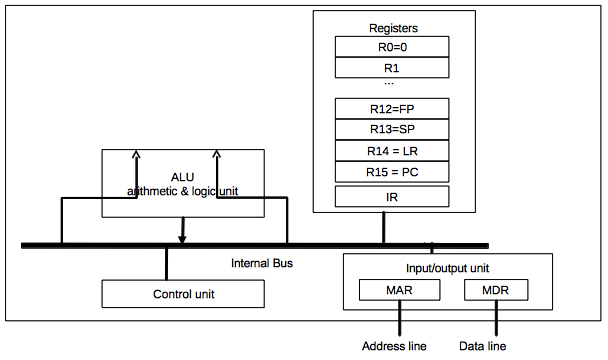
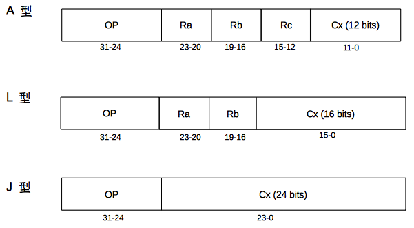
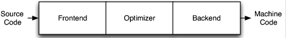
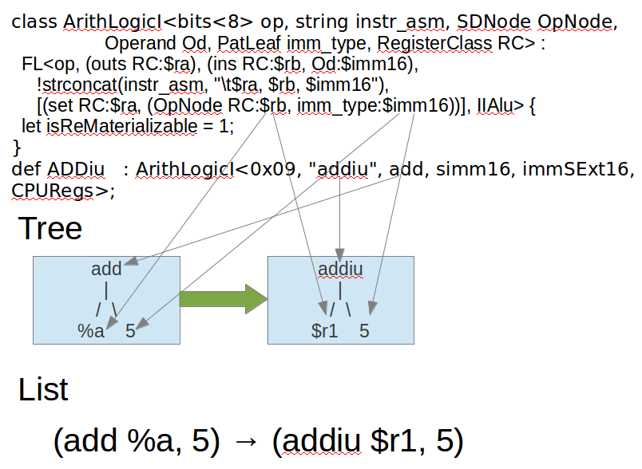

.. _sec-llvmstructure:

Cpu0 architecture and LLVM structure
=====================================

.. contents::
   :local:
   :depth: 4

Before you begin this tutorial, you should know that you can always try to 
develop your own backend by porting code from existing backends. 
The majority of the code you will want to investigate can be found in the 
/lib/Target directory of your root LLVM installation. 
As most major RISC instruction sets have some similarities, this may be the 
avenue you might try if you are an experienced programmer and knowledgable of 
compiler backends.

On the other hand, there is a steep learning curve and you may easily get stuck 
debugging your new backend. You can easily spend a lot of time tracing which 
methods are callbacks of some function, or which are calling some overridden 
method deep in the LLVM codebase - and with a codebase as large as LLVM, all of 
this can easily become difficult to keep track of. 
This tutorial will help you work through this process while learning the 
fundamentals of LLVM backend design. 
It will show you what is necessary to get your first backend functional and 
complete, and it should help you understand how to debug your backend when it 
produces incorrect machine code using output provided by the compiler.

This chapter details the Cpu0 instruction set and the structure of LLVM. 
The LLVM structure information is adapted from Chris Lattner's LLVM chapter of 
the Architecture of Open Source Applications book [#aosa-book]_. You can read 
the original article from the AOSA website if you prefer. 

At the end of this Chapter, you will begin to create a new LLVM backend by 
writing register and instruction definitions in the Target Description files 
which will be used in next chapter.

Finally, there are compiler knowledge like DAG (Directed-Acyclic-Graph) and 
instruction selection needed in llvm backend design, and they are explained 
here. 

Cpu0 Processor Architecture Details
-----------------------------------

This section is based on materials available here [#cpu0-chinese]_ (Chinese)
and here [#cpu0-english]_ (English).

Brief introduction
~~~~~~~~~~~~~~~~~~

Cpu0 is a 32-bit architecture. It has 16 general purpose registers (R0, ..., 
R15), co-processor registers (like Mips), and other special registers. Its 
structure is illustrated in :num:`Figure #llvmstructure-f1` below.

.. _llvmstructure-f1: 


  Architectural block diagram of the Cpu0 processor


The registers are used for the following purposes:

.. table:: Cpu0 general purpose registers (GPR)

  ============  ===========
  Register      Description
  ============  ===========
  R0            Constant register, value is 0
  R1-R10        General-purpose registers
  R11           Global Pointer register (GP)
  R12           Frame Pointer register (FP)
  R13           Stack Pointer register (SP)
  R14           Link Register (LR)
  R15           Status Word Register (SW)
  ============  ===========

.. table:: Cpu0 co-processor 0 registers (C0R)

  ============  ===========
  Register      Description
  ============  ===========
  0             Program Counter (PC)
  1             Error Program Counter (EPC)
  ============  ===========

.. table:: Cpu0 other registers

  ============  ===========
  Register      Description
  ============  ===========
  IR            Instruction register
  MAR           Memory Address Register (MAR)
  MDR           Memory Data Register (MDR)
  HI            High part of MULT result
  LO            Low part of MULT result
  ============  ===========

The Cpu0 Instruction Set
~~~~~~~~~~~~~~~~~~~~~~~~

The Cpu0 instruction set can be divided into three types: L-type instructions, 
which are generally associated with memory operations, A-type instructions for 
arithmetic operations, and J-type instructions that are typically used when 
altering control flow (i.e. jumps).  
:num:`Figure #llvmstructure-f2` illustrates how the bitfields are broken down 
for each type of instruction.

.. _llvmstructure-f2: 


  Cpu0's three instruction formats

The Cpu0 has two ISA, the first ISA-I is cpu032I which hired CMP instruction 
from ARM; the second ISA-II is cpu032II which hired SLT instruction from Mips. 
The cpu032II include all cpu032I instruction set and add SLT, BEQ, ..., 
instructions. The main purpose to add cpu032II is for instruction set design 
explanation. As you will see in later chapter (chapter Control flow statements), 
the SLT instruction will has better performance than CMP old style instruction.
The following table details the cpu032I instruction set:

- First column F\.: meaning Format.

.. list-table:: cpu032I Instruction Set
  :widths: 1 4 3 11 7 10
  :header-rows: 1

  * - F\.
    - Mnemonic
    - Opcode
    - Meaning
    - Syntax
    - Operation
  * - L
    - NOP
    - 00
    - No Operation
    - 
    - 
  * - L
    - LD
    - 01
    - Load word
    - LD Ra, [Rb+Cx]
    - Ra <= [Rb+Cx]
  * - L
    - ST
    - 02
    - Store word
    - ST Ra, [Rb+Cx]
    - [Rb+Cx] <= Ra
  * - L
    - LB
    - 03
    - Load byte
    - LB Ra, [Rb+Cx]
    - Ra <= (byte)[Rb+Cx] [#lb-note]_
  * - L
    - LBu
    - 04
    - Load byte unsigned
    - LBu Ra, [Rb+Cx]
    - Ra <= (byte)[Rb+Cx] [#lb-note]_
  * - L
    - SB
    - 05
    - Store byte
    - SB Ra, [Rb+Cx]
    - [Rb+Cx] <= (byte)Ra
  * - L
    - LH
    - 06
    - Load half word
    - LH Ra, [Rb+Cx]
    - Ra <= (2bytes)[Rb+Cx] [#lb-note]_
  * - L
    - LHu
    - 07
    - Load half word unsigned
    - LHu Ra, [Rb+Cx]
    - Ra <= (2bytes)[Rb+Cx] [#lb-note]_
  * - L
    - SH
    - 08
    - Store half word
    - SH Ra, [Rb+Cx]
    - [Rb+Cx] <= Ra
  * - L
    - ADDiu
    - 09
    - Add immediate
    - ADDiu Ra, Rb, Cx
    - Ra <= (Rb + Cx)
  * - L
    - ANDi
    - 0C
    - AND imm
    - ANDi Ra, Rb, Cx
    - Ra <= (Rb & Cx)
  * - L
    - ORi
    - 0D
    - OR
    - ORi Ra, Rb, Cx
    - Ra <= (Rb | Cx)
  * - L
    - XORi
    - 0E
    - XOR
    - XORi Ra, Rb, Cx
    - Ra <= (Rb \^ Cx)
  * - L
    - LUi
    - 0F
    - Load upper
    - LUi Ra, Cx
    - Ra <= (Cx << 16)
  * - A
    - CMP
    - 10
    - Compare
    - CMP Ra, Rb
    - SW <= (Ra cond Rb) [#cond-note]_
  * - A
    - ADDu
    - 11
    - Add unsigned
    - ADD Ra, Rb, Rc
    - Ra <= Rb + Rc [#u-note]_
  * - A
    - SUBu
    - 12
    - Sub unsigned
    - SUB Ra, Rb, Rc
    - Ra <= Rb - Rc [#u-note]_
  * - A
    - ADD
    - 13
    - Add
    - ADD Ra, Rb, Rc
    - Ra <= Rb + Rc [#u-note]_
  * - A
    - SUB
    - 14
    - Subtract
    - SUB Ra, Rb, Rc
    - Ra <= Rb - Rc [#u-note]_
  * - A
    - MUL
    - 17
    - Multiply
    - MUL Ra, Rb, Rc
    - Ra <= Rb * Rc
  * - A
    - AND
    - 18
    - Bitwise and
    - AND Ra, Rb, Rc
    - Ra <= Rb & Rc
  * - A
    - OR
    - 19
    - Bitwise or
    - OR Ra, Rb, Rc
    - Ra <= Rb | Rc
  * - A
    - XOR
    - 1A
    - Bitwise exclusive or
    - XOR Ra, Rb, Rc
    - Ra <= Rb ^ Rc
  * - A
    - ROL
    - 1B
    - Rotate left
    - ROL Ra, Rb, Cx
    - Ra <= Rb rol Cx
  * - A
    - ROR
    - 1C
    - Rotate right
    - ROR Ra, Rb, Cx
    - Ra <= Rb ror Cx
  * - A
    - SRA
    - 1D
    - Shift right
    - SRA Ra, Rb, Cx
    - Ra <= Rb '>> Cx [#sra-note]_
  * - A
    - SHL
    - 1E
    - Shift left
    - SHL Ra, Rb, Cx
    - Ra <= Rb << Cx
  * - A
    - SHR
    - 1F
    - Shift right
    - SHR Ra, Rb, Cx
    - Ra <= Rb >> Cx
  * - A
    - SRAV
    - 20
    - Shift right
    - SRAV Ra, Rb, Rc
    - Ra <= Rb '>> Rc [#sra-note]_
  * - A
    - SHLV
    - 21
    - Shift left
    - SHLV Ra, Rb, Rc
    - Ra <= Rb << Rc
  * - A
    - SHRV
    - 22
    - Shift right
    - SHRV Ra, Rb, Rc
    - Ra <= Rb >> Rc
  * - A
    - ROL
    - 23
    - Rotate left
    - ROL Ra, Rb, Rc
    - Ra <= Rb rol Rc
  * - A
    - ROR
    - 24
    - Rotate right
    - ROR Ra, Rb, Rc
    - Ra <= Rb ror Rc
  * - J
    - JEQ
    - 30
    - Jump if equal (==)
    - JEQ Cx
    - if SW(==), PC <= PC + Cx
  * - J
    - JNE
    - 31
    - Jump if not equal (!=)
    - JNE Cx
    - if SW(!=), PC <= PC + Cx
  * - J
    - JLT
    - 32
    - Jump if less than (<)
    - JLT Cx
    - if SW(<), PC <= PC + Cx
  * - J
    - JGT
    - 33
    - Jump if greater than (>)
    - JGT Cx
    - if SW(>), PC <= PC + Cx
  * - J
    - JLE
    - 34
    - Jump if less than or equals (<=)
    - JLE Cx
    - if SW(<=), PC <= PC + Cx
  * - J
    - JGE
    - 35
    - Jump if greater than or equals (>=)
    - JGE Cx
    - if SW(>=), PC <= PC + Cx
  * - J
    - JMP
    - 36
    - Jump (unconditional)
    - JMP Cx
    - PC <= PC + Cx
  * - J
    - JALR
    - 39
    - Indirect jump
    - JALR Rb
    - LR <= PC; PC <= Rb [#call-note]_
  * - J
    - JSUB
    - 3B
    - Jump to subroutine
    - JSUB Cx
    - LR <= PC; PC <= PC + Cx
  * - J
    - JR/RET
    - 3C
    - Return from subroutine
    - JR $1 or RET LR
    - PC <= LR [#jr-note]_
  * - A
    - MULT
    - 41
    - Multiply for 64 bits result
    - MULT Ra, Rb
    - (HI,LO) <= MULT(Ra,Rb)
  * - A
    - MULTU
    - 42
    - MULT for unsigned 64 bits
    - MULTU Ra, Rb
    - (HI,LO) <= MULTU(Ra,Rb)
  * - A
    - DIV
    - 43
    - Divide
    - DIV Ra, Rb
    - HI<=Ra%Rb, LO<=Ra/Rb
  * - A
    - DIVU
    - 44
    - Divide unsigned
    - DIVU Ra, Rb
    - HI<=Ra%Rb, LO<=Ra/Rb
  * - A
    - MFHI
    - 46
    - Move HI to GPR
    - MFHI Ra
    - Ra <= HI
  * - A
    - MFLO
    - 47
    - Move LO to GPR
    - MFLO Ra
    - Ra <= LO
  * - A
    - MTHI
    - 48
    - Move GPR to HI
    - MTHI Ra
    - HI <= Ra
  * - A
    - MTLO
    - 49
    - Move GPR to LO
    - MTLO Ra
    - LO <= Ra
  * - A
    - MFC0
    - 50
    - Move C0R to GPR
    - MFC0 Ra, Rb
    - Ra <= Rb
  * - A
    - MTC0
    - 51
    - Move GPR to C0R
    - MTC0 Ra, Rb
    - Ra <= Rb
  * - A
    - C0MOV
    - 52
    - Move C0R to C0R
    - C0MOV Ra, Rb
    - Ra <= Rb


The following table details the cpu032II instruction set added:

.. list-table:: cpu032II Instruction Set
  :widths: 1 4 3 11 7 10
  :header-rows: 1

  * - F\.
    - Mnemonic
    - Opcode
    - Meaning
    - Syntax
    - Operation
  * - L
    - SLTi
    - 26
    - Set less Then
    - SLTi Ra, Rb, Cx
    - Ra <= (Rb < Cx)
  * - L
    - SLTiu
    - 27
    - SLTi unsigned 
    - SLTiu Ra, Rb, Cx
    - Ra <= (Rb < Cx)
  * - A
    - SLT
    - 28
    - Set less Then
    - SLT Ra, Rb, Rc
    - Ra <= (Rb < Rc)
  * - A
    - SLTu
    - 29
    - SLT unsigned
    - SLTu Ra, Rb, Rc
    - Ra <= (Rb < Rc)
  * - L
    - BEQ
    - 37
    - Branch if equal
    - BEQ Ra, Rb, Cx
    - if (Ra==Rb), PC <= PC + Cx
  * - L
    - BNE
    - 38
    - Branch if not equal
    - BNE Ra, Rb, Cx
    - if (Ra!=Rb), PC <= PC + Cx
  * - J
    - BAL
    - 3A
    - Branch and link
    - BAL Cx
    - LR <= PC; PC <= PC + Cx

.. note:: **Cpu0 unsigned instructions**

  Like Mips, except DIVU, the mathematic unsigned instructions such as ADDu and 
  SUBu, are instructions of no overflow exception. 
  The ADDu and SUBu handle both signed and unsigned integers well. 
  For example, (ADDu 1, -2) is -1; (ADDu 0x01, 0xfffffffe) is 0xffffffff = (4G 
  - 1). 
  If you treat the result is negative then it is -1. 
  On the other hand, it's (+4G - 1) if you treat the result is positive.
  

Why not using ADD instead of SUB?
`````````````````````````````````

From text book of computer introduction, we know SUB can be replaced by 
ADD as follows,

- (A - B) = (A + (-B))

Since Mips uses 32 bits to represent int type of C language, if B is the 
value of -2G, then

- (A - (-2G)) = (A + (2G))

But the problem is value -2G can be represented in 32 bits machine while 2G 
cannot, 
since the range of 2's complement representation for 32 bits is (-2G .. 2G-1).
The 2's complement reprentation has the merit of fast computation in circuits
design, it is widely used in real CPU implementation.
That's why almost every CPU create SUB instruction, rather than using ADD 
instead of.


The Status Register
~~~~~~~~~~~~~~~~~~~

The Cpu0 status word register (SW) contains the state of the Negative (N), 
Zero (Z), Carry (C), Overflow (V), Debug (D), Mode (M), and Interrupt (I) flags.
The bit layout of the SW register is shown in :num:`Figure #llvmstructure-f3` 
below.

.. _llvmstructure-f3: 
.. figure:: ../Fig/llvmstructure/3.png
  :width: 684 px
  :height: 126 px
  :align: center

  Cpu0 status word (SW) register

When a CMP Ra, Rb instruction executes, the condition flags will change.
For example:

- If Ra > Rb, then N = 0, Z = 0
- If Ra < Rb, then N = 1, Z = 0
- If Ra = Rb, then N = 0, Z = 1

The direction (i.e. taken/not taken) of the conditional jump instructions JGT, 
JLT, JGE, JLE, JEQ, JNE is determined by the N and Z flags in the SW register.

Cpu0's Stages of Instruction Execution
~~~~~~~~~~~~~~~~~~~~~~~~~~~~~~~~~~~~~~

The Cpu0 architecture has a five-stage pipeline. The stages are instruction 
fetch (IF), instruction decode (ID), execute (EX), memory access (MEM) and 
write backe (WB).  
Here is a description of what happens in the processor for each stage:

1) Instruction fetch (IF)

- The Cpu0 fetches the instruction pointed to by the Program Counter (PC) into 
  the Instruction Register (IR): IR = [PC].
- The PC is then updated to point to the next instruction: PC = PC + 4.

2) Instruction decode (ID)

- The control unit decodes the instruction stored in IR, which routes necessary 
  data stored in registers to the ALU, and sets the ALU's operation mode based 
  on the current instruction's opcode.

3) Execute (EX)

- The ALU executes the operation designated by the control unit upon data in 
  registers. 
  Except load and store instructions, the result is stored in the destination 
  register after the ALU is done. 

4) Memory access (MEM)

- Read data from data cache to pipeline register MEM/WB if it is load 
  instruction; write data from register to data cache if it is strore 
  instruction.
  
5) Write-back (WB)

- Move data from pipeline register MEM/WB to Register if it is load instruction.


Cpu0's Interrupt Vector
~~~~~~~~~~~~~~~~~~~~~~~

.. table:: Cpu0's Interrupt Vector

  ========  ===========
  Address   type
  ========  ===========
  0x00      Reset
  0x04      Error Handle
  0x08      Interrupt
  ========  ===========


LLVM Structure
--------------

This section introduces the compiler data structure, algorithm and mechanism 
that llvm uses.

Three-phase design
~~~~~~~~~~~~~~~~~~

The text in this and the following sub-section comes from the AOSA chapter on 
LLVM written by Chris Lattner [#aosa-book]_.

The most popular design for a traditional static compiler (like most C 
compilers) is the three phase design whose major components are the front end, 
the optimizer and the back end, as seen in :num:`Figure #llvmstructure-f6`. 
The front end parses source code, checking it for errors, and builds a 
language-specific Abstract Syntax Tree (AST) to represent the input code. 
The AST is optionally converted to a new representation for optimization, and 
the optimizer and back end are run on the code.

.. _llvmstructure-f6: 


  Three Major Components of a Three Phase Compiler

The optimizer is responsible for doing a broad variety of transformations to 
try to improve the code's running time, such as eliminating redundant 
computations, and is usually more or less independent of language and target. 
The back end (also known as the code generator) then maps the code onto the 
target instruction set. 
In addition to making correct code, it is responsible for generating good code 
that takes advantage of unusual features of the supported architecture. 
Common parts of a compiler back end include instruction selection, register 
allocation, and instruction scheduling.

This model applies equally well to interpreters and JIT compilers. 
The Java Virtual Machine (JVM) is also an implementation of this model, which 
uses Java bytecode as the interface between the front end and optimizer.

The most important win of this classical design comes when a compiler decides 
to support multiple source languages or target architectures. 
If the compiler uses a common code representation in its optimizer, then a 
front end can be written for any language that can compile to it, and a back 
end can be written for any target that can compile from it, as shown in 
:num:`Figure #llvmstructure-f7`.

.. _llvmstructure-f7: 
.. figure:: ../Fig/llvmstructure/7.png
  :align: center
  :width: 837 px
  :height: 299 px
  :scale: 70 %

  Retargetablity

With this design, porting the compiler to support a new source language (e.g., 
Algol or BASIC) requires implementing a new front end, but the existing 
optimizer and back end can be reused. 
If these parts weren't separated, implementing a new source language would 
require starting over from scratch, so supporting N targets and M source 
languages would need N*M compilers.

Another advantage of the three-phase design (which follows directly from 
retargetability) is that the compiler serves a broader set of programmers than 
it would if it only supported one source language and one target. 
For an open source project, this means that there is a larger community of 
potential contributors to draw from, which naturally leads to more enhancements 
and improvements to the compiler. 
This is the reason why open source compilers that serve many communities (like 
GCC) tend to generate better optimized machine code than narrower compilers 
like FreePASCAL. 
This isn't the case for proprietary compilers, whose quality is directly 
related to the project's budget. 
For example, the Intel ICC Compiler is widely known for the quality of code it 
generates, even though it serves a narrow audience.

A final major win of the three-phase design is that the skills required to 
implement a front end are different than those required for the optimizer and 
back end. 
Separating these makes it easier for a "front-end person" to enhance and 
maintain their part of the compiler. 
While this is a social issue, not a technical one, it matters a lot in 
practice, particularly for open source projects that want to reduce the barrier 
to contributing as much as possible.

The most important aspect of its design is the LLVM Intermediate Representation 
(IR), which is the form it uses to represent code in the compiler. 
LLVM IR is designed to host mid-level analyses and transformations that you 
find in the optimizer chapter of a compiler. 
It was designed with many specific goals in mind, including supporting 
lightweight runtime optimizations, cross-function/interprocedural 
optimizations, whole program analysis, and aggressive restructuring 
transformations, etc. 
The most important aspect of it, though, is that it is itself defined as a 
first class language with well-defined semantics. 
To make this concrete, here is a simple example of a .ll file:

.. code-block:: c++

  define i32 @add1(i32 %a, i32 %b) {
  entry:
    %tmp1 = add i32 %a, %b
    ret i32 %tmp1
  }
  define i32 @add2(i32 %a, i32 %b) {
  entry:
    %tmp1 = icmp eq i32 %a, 0
    br i1 %tmp1, label %done, label %recurse
  recurse:
    %tmp2 = sub i32 %a, 1
    %tmp3 = add i32 %b, 1
    %tmp4 = call i32 @add2(i32 %tmp2, i32 %tmp3)
    ret i32 %tmp4
  done:
    ret i32 %b
  }
  // This LLVM IR corresponds to this C code, which provides two different ways to
  //  add integers:
  unsigned add1(unsigned a, unsigned b) {
    return a+b;
  }
  // Perhaps not the most efficient way to add two numbers.
  unsigned add2(unsigned a, unsigned b) {
    if (a == 0) return b;
    return add2(a-1, b+1);
  }

As you can see from this example, LLVM IR is a low-level RISC-like virtual 
instruction set. 
Like a real RISC instruction set, it supports linear sequences of simple 
instructions like add, subtract, compare, and branch. 
These instructions are in three address form, which means that they take some 
number of inputs and produce a result in a different register. 
LLVM IR supports labels and generally looks like a weird form of assembly 
language.

Unlike most RISC instruction sets, LLVM is strongly typed with a simple type 
system (e.g., i32 is a 32-bit integer, i32** is a pointer to pointer to 32-bit 
integer) and some details of the machine are abstracted away. 
For example, the calling convention is abstracted through call and ret 
instructions and explicit arguments. 
Another significant difference from machine code is that the LLVM IR doesn't 
use a fixed set of named registers, it uses an infinite set of temporaries 
named with a % character.

Beyond being implemented as a language, LLVM IR is actually defined in three 
isomorphic forms: the textual format above, an in-memory data structure 
inspected and modified by optimizations themselves, and an efficient and dense 
on-disk binary "bitcode" format. 
The LLVM Project also provides tools to convert the on-disk format from text to 
binary: llvm-as assembles the textual .ll file into a .bc file containing the 
bitcode goop and llvm-dis turns a .bc file into a .ll file.

The intermediate representation of a compiler is interesting because it can be 
a "perfect world" for the compiler optimizer: unlike the front end and back end 
of the compiler, the optimizer isn't constrained by either a specific source 
language or a specific target machine. 
On the other hand, it has to serve both well: it has to be designed to be easy 
for a front end to generate and be expressive enough to allow important 
optimizations to be performed for real targets.
  

LLVM's Target Description Files: .td
~~~~~~~~~~~~~~~~~~~~~~~~~~~~~~~~~~~~

The "mix and match" approach allows target authors to choose what makes sense 
for their architecture and permits a large amount of code reuse across 
different targets. 
This brings up another challenge: each shared component needs to be able to 
reason about target specific properties in a generic way. 
For example, a shared register allocator needs to know the register file of 
each target and the constraints that exist between instructions and their 
register operands. 
LLVM's solution to this is for each target to provide a target description 
in a declarative domain-specific language (a set of .td files) processed by the 
tblgen tool. 
The (simplified) build process for the x86 target is shown in 
:num:`Figure #llvmstructure-f8`.

.. _llvmstructure-f8: 
.. figure:: ../Fig/llvmstructure/8.png
  :align: center
  :width: 850 px
  :height: 428 px
  :scale: 70 %

  Simplified x86 Target Definition

The different subsystems supported by the .td files allow target authors to 
build up the different pieces of their target. 
For example, the x86 back end defines a register class that holds all of its 
32-bit registers named "GR32" (in the .td files, target specific definitions 
are all caps) like this:

.. code-block:: c++

  def GR32 : RegisterClass<[i32], 32,
    [EAX, ECX, EDX, ESI, EDI, EBX, EBP, ESP,
     R8D, R9D, R10D, R11D, R14D, R15D, R12D, R13D]> { ... }


LLVM Code Generation Sequence
~~~~~~~~~~~~~~~~~~~~~~~~~~~~~

Following diagram come from tricore_llvm.pdf.

.. _llvmstructure-f9: 
.. figure:: ../Fig/llvmstructure/9.png
  :width: 1030 px
  :height: 537 px
  :align: center

  tricore_llvm.pdf: Code generation sequence. On the path from LLVM code to 
  assembly code, numerous passes are run through and several data structures 
  are used to represent the intermediate results.

LLVM is a Static Single Assignment (SSA) based representation. 
LLVM provides an infinite virtual registers which can hold values of primitive 
type (integral, floating point, or pointer values). 
So, every operand can save in different virtual register in llvm SSA 
representation. 
Comment is “;” in llvm representation. 
Following is the llvm SSA instructions.

.. code-block:: c++

  store i32 0, i32* %a  ; store i32 type of 0 to virtual register %a, %a is
              ;  pointer type which point to i32 value
  store i32 %b, i32* %c ; store %b contents to %c point to, %b isi32 type virtual
              ;  register, %c is pointer type which point to i32 value.
  %a1 = load i32* %a    ; load the memory value where %a point to and assign the
              ;  memory value to %a1
  %a3 = add i32 %a2, 1  ; add %a2 and 1 and save to %a3

We explain the code generation process as below. 
If you don't feel comfortable, please check tricore_llvm.pdf section 4.2 first. 
You can read “The LLVM Target-Independent Code Generator” from here [#codegen]_ 
and “LLVM Language Reference Manual” from here [#langref]_ 
before go ahead, but we think the section 
4.2 of tricore_llvm.pdf is enough and suggesting you read the web site 
documents as above only when you are still not 
quite understand, even if you have read the articles of this section and 
next 2 sections for DAG and Instruction Selection.

1. Instruction Selection

.. code-block:: c++

  // In this stage, transfer the llvm opcode into machine opcode, but the operand
  //  still is llvm virtual operand.
      store i16 0, i16* %a // store 0 of i16 type to where virtual register %a
                           //  point to.
  =>  st i16 0, i32* %a    // Use Cpu0 backend instruction st instead of IR store.

2. Scheduling and Formation

.. code-block:: c++

  // In this stage, reorder the instructions sequence for optimization in
  //  instructions cycle or in register pressure.
      st i32 %a, i16* %b,  i16 5 // st %a to *(%b+5)
      st %b, i32* %c, i16 0
      %d = ld i32* %c
  
  // Transfer above instructions order as follows. In RISC CPU of Mips, the ld 
  //  %c uses the result of the previous instruction st %c. So it must waits 1
  //  cycle. Meaning the ld cannot follow st immediately.
  =>  st %b, i32* %c, i16 0
      st i32 %a, i16* %b,  i16 5
      %d = ld i32* %c, i16 0
  // If without reorder instructions, a instruction nop which do nothing must be
  //  filled, contribute one instruction cycle more than optimization. (Actually,
  //  Mips is scheduled with hardware dynamically and will insert nop between st
  //  and ld instructions if compiler didn't insert nop.)
      st i32 %a, i16* %b,  i16 5
      st %b, i32* %c, i16 0
      nop
      %d = ld i32* %c, i16 0
  
  // Minimum register pressure
  //  Suppose %c is alive after the instructions basic block (meaning %c will be
  //  used after the basic block), %a and %b are not alive after that.
  // The following no-reorder-version need 3 registers at least
      %a = add i32 1, i32 0
      %b = add i32 2, i32 0
      st %a,  i32* %c, 1
      st %b,  i32* %c, 2
  
  // The reorder version needs 2 registers only (by allocate %a and %b in the same
  //  register)
  => %a = add i32 1, i32 0
      st %a,  i32* %c, 1
      %b = add i32 2, i32 0
      st %b,  i32* %c, 2

3. SSA-based Machine Code Optimization

   For example, common expression remove, shown in next section DAG.
  
4. Register Allocation

   Allocate real register for virtual register.
  
5. Prologue/Epilogue Code Insertion

   Explain in section Add Prologue/Epilogue functions
  
6. Late Machine Code Optimizations

   Any “last-minute” peephole optimizations of the final machine code can be 
   applied during this phase. 
   For example, replace x = x * 2 by x = x < 1 for integer operand.
  
7. Code Emission

   Finally, the completed machine code is emitted. For static compilation, 
   the end result is an assembly code file; for JIT compilation, the opcodes 
   of the machine instructions are written into memory. 

The llvm code generation sequence also can be obtained by 
``llc -debug-pass=Structure`` as the following. The first 4 code generation 
sequences from :num:`Figure #llvmstructure-f9` are in the 
**'DAG->DAG Pattern Instruction Selection'** of the ``llc -debug-pass=Structure`` 
displayed. The order of Peephole Optimizations and Prologue/Epilogue Insertion
is inconsistent between :num:`Figure #llvmstructure-f9` and 
``llc -debug-pass=Structure`` (please check the * in the following). 
No need to be bothered with this since the the LLVM is under development and 
changed from time to time. 

.. code-block:: bash

  118-165-79-200:input Jonathan$ llc --help-hidden
  OVERVIEW: llvm system compiler
  
  USAGE: llc [options] <input bitcode>
  
  OPTIONS:
  ...
    -debug-pass                             - Print PassManager debugging information
      =None                                 -   disable debug output
      =Arguments                            -   print pass arguments to pass to 'opt'
      =Structure                            -   print pass structure before run()
      =Executions                           -   print pass name before it is executed
      =Details                              -   print pass details when it is executed
  
  118-165-79-200:input Jonathan$ llc -march=mips -debug-pass=Structure ch3.bc
  ...
  Target Library Information
  Target Transform Info
  Data Layout
  Target Pass Configuration
  No Alias Analysis (always returns 'may' alias)
  Type-Based Alias Analysis
  Basic Alias Analysis (stateless AA impl)
  Create Garbage Collector Module Metadata
  Machine Module Information
  Machine Branch Probability Analysis
    ModulePass Manager
      FunctionPass Manager
        Preliminary module verification
        Dominator Tree Construction
        Module Verifier
        Natural Loop Information
        Loop Pass Manager
          Canonicalize natural loops
        Scalar Evolution Analysis
        Loop Pass Manager
          Canonicalize natural loops
          Induction Variable Users
          Loop Strength Reduction
        Lower Garbage Collection Instructions
        Remove unreachable blocks from the CFG
        Exception handling preparation
        Optimize for code generation
        Insert stack protectors
        Preliminary module verification
        Dominator Tree Construction
        Module Verifier
        Machine Function Analysis
        Natural Loop Information
        Branch Probability Analysis
      * MIPS DAG->DAG Pattern Instruction Selection
        Expand ISel Pseudo-instructions
        Tail Duplication
        Optimize machine instruction PHIs
        MachineDominator Tree Construction
        Slot index numbering
        Merge disjoint stack slots
        Local Stack Slot Allocation
        Remove dead machine instructions
        MachineDominator Tree Construction
        Machine Natural Loop Construction
        Machine Loop Invariant Code Motion
        Machine Common Subexpression Elimination
        Machine code sinking
      * Peephole Optimizations
        Process Implicit Definitions
        Remove unreachable machine basic blocks
        Live Variable Analysis
        Eliminate PHI nodes for register allocation
        Two-Address instruction pass
        Slot index numbering
        Live Interval Analysis
        Debug Variable Analysis
        Simple Register Coalescing
        Live Stack Slot Analysis
        Calculate spill weights
        Virtual Register Map
        Live Register Matrix
        Bundle Machine CFG Edges
        Spill Code Placement Analysis
      * Greedy Register Allocator
        Virtual Register Rewriter
        Stack Slot Coloring
        Machine Loop Invariant Code Motion
      * Prologue/Epilogue Insertion & Frame Finalization
        Control Flow Optimizer
        Tail Duplication
        Machine Copy Propagation Pass
      * Post-RA pseudo instruction expansion pass
        MachineDominator Tree Construction
        Machine Natural Loop Construction
        Post RA top-down list latency scheduler
        Analyze Machine Code For Garbage Collection
        Machine Block Frequency Analysis
        Branch Probability Basic Block Placement
        Mips Delay Slot Filler
        Mips Long Branch
        MachineDominator Tree Construction
        Machine Natural Loop Construction
      * Mips Assembly Printer
        Delete Garbage Collector Information


SSA form
~~~~~~~~

SSA form says that each variable is assigned exactly once. 
LLVM IR is SSA form which has unbounded virtual registers (each variable is 
assigned exactly once and is keeped in different virtual register).
As the result, the optimization steps used in code generation sequence which 
include stages of **Instruction Selection**, **Scheduling and Formation** and 
**Register Allocation**, won't loss any optimization opportunity. 
For example, if using limited virtual registers to generate the following code,

.. code-block:: c++

    %a = add nsw i32 1, i32 0
    store i32 %a, i32* %c, align 4
    %a = add nsw i32 2, i32 0
    store i32 %a, i32* %c, align 4

  => %a = add i32 1, i32 0
      st %a,  i32* %c, 1
      %a = add i32 2, i32 0
      st %a,  i32* %c, 2

Above code must run in sequence. On the other hand, the SSA form as the 
following can be reodered and run in parallel with the following different 
version [#dragonbooks-10.2.3]_.

.. code-block:: c++

    %a = add nsw i32 1, i32 0
    store i32 %a, i32* %c, align 4
    %b = add nsw i32 2, i32 0
    store i32 %b, i32* %d, align 4

  // version 1
  => %a = add i32 1, i32 0
      st %a,  i32* %c, 0
      %b = add i32 2, i32 0
      st %b,  i32* %d, 0

  // version 2
  => %a = add i32 1, i32 0
      %b = add i32 2, i32 0
      st %a,  i32* %c, 0
      st %b,  i32* %d, 0

  // version 3
  => %b = add i32 2, i32 0
      st %b,  i32* %d, 0
      %a = add i32 1, i32 0
      st %a,  i32* %c, 0


DAG (Directed Acyclic Graph)
~~~~~~~~~~~~~~~~~~~~~~~~~~~~

Many important techniques for local optimization begin by transforming a basic 
block into DAG [#dragonbooks-8.5]_. 
For example, the basic block code and it's corresponding DAG as 
:num:`Figure #llvmstructure-f10`.

.. _llvmstructure-f10: 
.. figure:: ../Fig/llvmstructure/10.png
  :width: 474 px
  :height: 178 px
  :scale: 80 %
  :align: center

  DAG example

If b is not live on exit from the block, then we can do "common expression 
remove" as the following table.

.. table:: common expression remove process
  
  ====================================  ==================================================================
  Replace node b with node d             Replace b\ :sub:`0`\ , c\ :sub:`0`\ , d\ :sub:`0`\  with b, c, d
  ====================================  ==================================================================
  a = b\ :sub:`0`\  + c\ :sub:`0`\       a = b + c
  d = a – d\ :sub:`0`\                   d = a – d
  c = d + c                              c = d + c
  ====================================  ==================================================================

After remove b and traveling the DAGs from bottom to top (traverse binary tree 
by Depth-first In-order search) , the first column of above table to get. 
  
As you can imagine, the "common expression remove" can apply both in IR or 
machine code.

DAG likes a tree which opcode is the node and operand (register and 
const/immediate/offset) is leaf. 
It can also be represented by list as prefix order in tree. 
For example, (+ b, c), (+ b, 1) is IR DAG representation.

In addition to DAG optimization, the "kill" register has also mentioned in 
section 8.5.5 of the compiler book [#dragonbooks-8.5]_. This concept also 
used in llvm implementation.


Instruction Selection
~~~~~~~~~~~~~~~~~~~~~

The major function of backend is translating IR code into machine code at 
stage of Instruction Selection as :num:`Figure #llvmstructure-f11`.

.. _llvmstructure-f11: 
.. figure:: ../Fig/llvmstructure/11.png
  :width: 495 px
  :height: 116 px
  :scale: 70 %
  :align: center

  IR and it's corresponding machine instruction

For machine instruction selection, the best solution is representing IR and 
machine instruction by DAG. 
To simplify in view, the register leaf is skipped in 
:num:`Figure #llvmstructure-f12`. 
The r\ :sub:`j`\  + r\ :sub:`k`\  is IR DAG representation (for symbol 
notation, not llvm SSA form). 
ADD is machine instruction.

.. _llvmstructure-f12: 
.. figure:: ../Fig/llvmstructure/12.png
  :width: 986 px
  :height: 609 px
  :scale: 70 %
  :align: center

  Instruction DAG representation

The IR DAG and machine instruction DAG can also represented as list. 
For example, (+ r\ :sub:`i`\ , r\ :sub:`j`\ j) and (- r\ :sub:`i`\ , 1) are 
lists for IR DAG; (ADD r\ :sub:`i`\ , r\ :sub:`j`\ ) and 
(SUBI r\ :sub:`i`\ , 1) are lists for machine instruction DAG.

Now, let's check the ADDiu instruction defined in Cpu0InstrInfo.td as follows,

.. rubric:: lbdex/chapters/Chapter2/Cpu0InstrFormats.td
.. literalinclude:: ../lbdex/Cpu0/Cpu0InstrFormats.td
    :start-after: //@class FL {
    :end-before: //@class FL }

.. rubric:: lbdex/chapters/Chapter2/Cpu0InstrInfo.td
.. literalinclude:: ../lbdex/Cpu0/Cpu0InstrInfo.td
    :start-after: //#if CH >= CH2 6
    :end-before: #endif
.. literalinclude:: ../lbdex/Cpu0/Cpu0InstrInfo.td
    :start-after: //#if CH >= CH2 10
    :end-before: #endif
.. literalinclude:: ../lbdex/Cpu0/Cpu0InstrInfo.td
    :start-after: //#if CH >= CH2 14
    :end-before: #endif


:num:`Figure #llvmstructure-f13` shows how the pattern match work in the IR 
node **add** and instruction **ADDiu** both defined in Cpu0InstrInfo.td. In 
this example, IR node "add %a, 5" will be translated to "addiu $r1, 5" after %a 
is allcated to register $r1 in regiter allocation stage since the IR 
pattern[(set RC:$ra, (OpNode RC:$rb, imm_type:$imm16))] is set in ADDiu and the
2nd operand is signed immediate which matched "%a, 5". In addition to pattern 
match, the .td also set assembly string "addiu" and op code 0x09. 
With this information, the LLVM TableGen will generate instruction both in 
assembly and binary automatically (the binary instruction issued in obj file of 
ELF format which will be explained at later chapter). 
Similarly, the machine instruction DAG nodes LD and ST can be translated from IR 
DAG nodes **load** and **store**. Notice that the $r1 in this case is virtual 
register name (not machine register). 
 
.. _llvmstructure-f13: 


  Pattern match for ADDiu instruction and IR node add

From DAG instruction selection we mentioned, the leaf node must be a Data Node.
ADDiu is format L type which the last operand must fits in 16 bits range.
So, Cpu0InstrInfo.td define a PatLeaf type of immSExt16 to let llvm system know
the PatLeaf range. If the imm16 value is out of this range, 
**"isInt<16>(N->getSExtValue())"** will return false and this pattern won't use
ADDiu in instruction selection stage.

Some cpu/fpu (floating point processor) has multiply-and-add floating point 
instruction, fmadd. 
It can be represented by DAG list (fadd (fmul ra, rc), rb). 
For this implementation, we can assign fmadd DAG pattern to instruction td as 
follows,

.. code-block:: c++

  def FMADDS : AForm_1<59, 29,
            (ops F4RC:$FRT, F4RC:$FRA, F4RC:$FRC, F4RC:$FRB),
            "fmadds $FRT, $FRA, $FRC, $FRB",
            [(set F4RC:$FRT, (fadd (fmul F4RC:$FRA, F4RC:$FRC),
                         F4RC:$FRB))]>;

Similar with ADDiu, [(set F4RC:$FRT, (fadd (fmul F4RC:$FRA, F4RC:$FRC), 
F4RC:$FRB))] is the pattern which include nodes **fmul** and **fadd**.

Now, for the following basic block notation IR and llvm SSA IR code,

.. code-block:: c++

  d = a * c
  e = d + b
  ...
  
  %d = fmul %a, %c
  %e = fadd %d, %b
  ...

the Instruction Selection Process will translate this two IR DAG node 
(fmul %a, %c) (fadd %d, %b) into one machine instruction DAG node (**fmadd** 
%a, %c, %b), rather than translate them into two machine instruction nodes 
**fmul** and **fadd** if the FMADDS is appear before FMUL and FADD in your td 
file.

.. code-block:: c++

  %e = fmadd %a, %c, %b
  ...

As you can see, the IR notation representation is easier to read than llvm SSA 
IR form. 
So, this notation form is used in this book sometimes.

For the following basic block code,

.. code-block:: c++

  a = b + c   // in notation IR form
  d = a – d
  %e = fmadd %a, %c, %b // in llvm SSA IR form

We can apply :num:`Figure #llvmstructure-f8` Instruction Tree Patterns to get the 
following machine code,

.. code-block:: c++

  load  rb, M(sp+8); // assume b allocate in sp+8, sp is stack point register
  load  rc, M(sp+16);
  add ra, rb, rc;
  load  rd, M(sp+24);
  sub rd, ra, rd;
  fmadd re, ra, rc, rb;


Caller and callee saved registers
~~~~~~~~~~~~~~~~~~~~~~~~~~~~~~~~~~

.. rubric:: lbdex/input/ch9_caller_callee_save_registers.cpp
.. literalinclude:: ../lbdex/input/ch9_caller_callee_save_registers.cpp
    :start-after: /// start
    
Run Mips backend with above input will get the following result.

.. code-block:: bash

  JonathantekiiMac:input Jonathan$ ~/llvm/release/cmake_debug_build/Debug/bin/llc 
  -O0 -march=mips -relocation-model=static -filetype=asm 
  ch9_caller_callee_save_registers.bc -o -
  	.text
  	.abicalls
  	.option	pic0
  	.section	.mdebug.abi32,"",@progbits
  	.nan	legacy
  	.file	"ch9_caller_callee_save_registers.bc"
  	.text
  	.globl	_Z6callerv
  	.align	2
  	.type	_Z6callerv,@function
  	.set	nomicromips
  	.set	nomips16
  	.ent	_Z6callerv
  _Z6callerv:                             # @_Z6callerv
  	.cfi_startproc
  	.frame	$fp,32,$ra
  	.mask 	0xc0000000,-4
  	.fmask	0x00000000,0
  	.set	noreorder
  	.set	nomacro
  	.set	noat
  # BB#0:
  	addiu	$sp, $sp, -32
  $tmp0:
  	.cfi_def_cfa_offset 32
  	sw	$ra, 28($sp)            # 4-byte Folded Spill
  	sw	$fp, 24($sp)            # 4-byte Folded Spill
  $tmp1:
  	.cfi_offset 31, -4
  $tmp2:
  	.cfi_offset 30, -8
  	move	 $fp, $sp
  $tmp3:
  	.cfi_def_cfa_register 30
  	addiu	$1, $zero, 3
  	sw	$1, 20($fp)   # store t1 to 20($fp)
  	move	 $4, $1
  	jal	_Z4add1i
  	nop
  	sw	$2, 16($fp)   # $2 : the return vaule for fuction add1()
  	lw	$1, 20($fp)   # load t1 from 20($fp)
  	subu	$1, $2, $1
  	sw	$1, 16($fp)
  	move	 $2, $1     # move result to return register $2
  	move	 $sp, $fp
  	lw	$fp, 24($sp)            # 4-byte Folded Reload
  	lw	$ra, 28($sp)            # 4-byte Folded Reload
  	addiu	$sp, $sp, 32
  	jr	$ra
  	nop
  	.set	at
  	.set	macro
  	.set	reorder
  	.end	_Z6callerv
  $func_end0:
  	.size	_Z6callerv, ($func_end0)-_Z6callerv
  	.cfi_endproc

As above assembly output, Mips allocates t1 variable to register $1 and no need
to spill $1 since $1 is caller saved register. 
On the other hand, $ra is callee saved register, so it spills at beginning of 
the assembly output since jal uses $ra register. 
Cpu0 $lr is the same register as Mips $ra, so it calls setAliasRegs(MF, 
SavedRegs, Cpu0::LR) in determineCalleeSaves() of Cpu0SEFrameLowering.cpp when
the function has called another function.


Live in and live out register
~~~~~~~~~~~~~~~~~~~~~~~~~~~~~

As the example of last sub-section. The $ra is "live in" register since the 
return address is decided by caller. The $2 is "live out" register since the 
return value of the function is saved in this register, and caller can get the 
result by read it directly as the comment in above example. 
Through mark "live in" and "live out" registers, backend provides 
llvm middle layer information to remove useless instructions in variables 
access. 
Of course, llvm applies the DAG analysis mentioned in the previous sub-section 
to finish it. 
Since C supports seperate compilation for different functions, the "live in" 
and "out" information from backend provides the optimization opportunity to 
llvm. 
LLVM provides function addLiveIn() to mark "live in" register but no function 
addLiveOut() provided. 
For the "live out" register, Mips backend marks it by 
DAG=DAG.getCopyToReg(..., $2, ...) and return DAG instead, since all local 
varaiables are not exist after function exit.


Create Cpu0 backend
--------------------

From now on, the Cpu0 backend will be created from scratch step by step.
To make readers easily understanding the backend structure, Cpu0 
example code can be generated with chapter by chapter through command here 
[#chapters-ex]_.
Cpu0 example code, lbdex, can be found at near left bottom of this web site. Or 
here http://jonathan2251.github.io/lbd/lbdex.tar.gz.


Cpu0 backend machine ID and relocation records
~~~~~~~~~~~~~~~~~~~~~~~~~~~~~~~~~~~~~~~~~~~~~~

To create a new backend, there are some files in <<llvm root dir>> need to be 
modified. The added information include both the ID and name of machine, and 
relocation records. Chapter "ELF Support" include the relocation records 
introduction. The following files are modified to add Cpu0 backend as follows,

.. rubric:: lbdex/src/modify/src/config-ix.cmake
.. code-block:: c++
  
  ...
  elseif (LLVM_NATIVE_ARCH MATCHES "cpu0")
    set(LLVM_NATIVE_ARCH Cpu0)
  ...

.. rubric:: lbdex/src/modify/src/CMakeLists.txt
.. code-block:: c++
  
  set(LLVM_ALL_TARGETS
    ...
    Cpu0
    ...
    )

.. rubric:: lbdex/src/modify/src/include/llvm/ADT/Triple.h
.. code-block:: c++
  
  ...
  #undef mips
  #undef cpu0
  ...
  class Triple {
  public:
    enum ArchType {
      ...
      cpu0,       // For Tutorial Backend Cpu0
      cpu0el,
      ...
    };
    ...
  }
  
.. rubric:: lbdex/src/modify/src/include/llvm/MC/MCExpr.h
.. code-block:: c++
  
  class MCSymbolRefExpr : public MCExpr {
  public:
    enum VariantKind {
      ...
      VK_Cpu0_GPREL,
      VK_Cpu0_GOT_CALL,
      VK_Cpu0_GOT16,
      VK_Cpu0_GOT,
      VK_Cpu0_ABS_HI,
      VK_Cpu0_ABS_LO,
      VK_Cpu0_TLSGD,
      VK_Cpu0_TLSLDM,
      VK_Cpu0_DTP_HI,
      VK_Cpu0_DTP_LO,
      VK_Cpu0_GOTTPREL,
      VK_Cpu0_TP_HI,
      VK_Cpu0_TP_LO,
      VK_Cpu0_GPOFF_HI,
      VK_Cpu0_GPOFF_LO,
      VK_Cpu0_GOT_DISP,
      VK_Cpu0_GOT_PAGE,
      VK_Cpu0_GOT_OFST,
      VK_Cpu0_HIGHER,
      VK_Cpu0_HIGHEST,
      VK_Cpu0_GOT_HI16,
      VK_Cpu0_GOT_LO16,
      VK_Cpu0_CALL_HI16,
      VK_Cpu0_CALL_LO16,
      ...
    };
    ...
  };

.. rubric:: lbdex/src/modify/src/include/llvm/Object/ELFObjectFile.h
.. code-block:: c++
  
  ...
  template <class ELFT>
  StringRef ELFObjectFile<ELFT>::getFileFormatName() const {
    switch (EF.getHeader()->e_ident[ELF::EI_CLASS]) {
    case ELF::ELFCLASS32:
      switch (EF.getHeader()->e_machine) {
      ...
      case ELF::EM_CPU0:	// llvm-objdump -t -r
        return "ELF32-cpu0";
      ...
    }
    ...
  }
  ...
  template <class ELFT>
  unsigned ELFObjectFile<ELFT>::getArch() const {
    bool IsLittleEndian = ELFT::TargetEndianness == support::little;
    switch (EF.getHeader()->e_machine) {
    ...
    case ELF::EM_CPU0:	// llvm-objdump -t -r
      switch (EF.getHeader()->e_ident[ELF::EI_CLASS]) {
      case ELF::ELFCLASS32:
      return IsLittleEndian ? Triple::cpu0el : Triple::cpu0;
      default:
        report_fatal_error("Invalid ELFCLASS!");
      }
    ...
    }
  }

.. rubric:: lbdex/src/modify/src/include/llvm/Support/ELF.h
.. code-block:: c++
  
  enum {
    ...
    EM_CPU0          = 999  // Document LLVM Backend Tutorial Cpu0
  };
  ...
  // Cpu0 Specific e_flags
  enum {
    EF_CPU0_NOREORDER = 0x00000001, // Don't reorder instructions
    EF_CPU0_PIC       = 0x00000002, // Position independent code
    EF_CPU0_ARCH_32   = 0x50000000, // CPU032 instruction set per linux not elf.h
    EF_CPU0_ARCH      = 0xf0000000  // Mask for applying EF_CPU0_ARCH_ variant
  };
  
  // ELF Relocation types for Mips
  enum {
  #include "ELFRelocs/Cpu0.def"
  };
  ...

.. rubric:: lbdex/src/modify/src/lib/MC/MCELFStreamer.cpp
.. code-block:: c++
  
  void MCELFStreamer::fixSymbolsInTLSFixups(const MCExpr *expr) {
    ...
      case MCSymbolRefExpr::VK_Cpu0_TLSGD:
      case MCSymbolRefExpr::VK_Cpu0_GOTTPREL:
      case MCSymbolRefExpr::VK_Cpu0_TP_HI:
      case MCSymbolRefExpr::VK_Cpu0_TP_LO:
    ...
  }

.. rubric:: lbdex/src/modify/src/lib/MC/MCExpr.cpp
.. code-block:: c++
  
  StringRef MCSymbolRefExpr::getVariantKindName(VariantKind Kind) {
    switch (Kind) {
    ...
    case VK_Cpu0_GPREL: return "GPREL";
    case VK_Cpu0_GOT_CALL: return "GOT_CALL";
    case VK_Cpu0_GOT16: return "GOT16";
    case VK_Cpu0_GOT: return "GOT";
    case VK_Cpu0_ABS_HI: return "ABS_HI";
    case VK_Cpu0_ABS_LO: return "ABS_LO";
    case VK_Cpu0_TLSGD: return "TLSGD";
    case VK_Cpu0_TLSLDM: return "TLSLDM";
    case VK_Cpu0_DTP_HI: return "DTP_HI";
    case VK_Cpu0_DTP_LO: return "DTP_LO";
    case VK_Cpu0_GOTTPREL: return "GOTTPREL";
    case VK_Cpu0_TP_HI: return "TP_HI";
    case VK_Cpu0_TP_LO: return "TP_LO";
    case VK_Cpu0_GPOFF_HI: return "GPOFF_HI";
    case VK_Cpu0_GPOFF_LO: return "GPOFF_LO";
    case VK_Cpu0_GOT_DISP: return "GOT_DISP";
    case VK_Cpu0_GOT_PAGE: return "GOT_PAGE";
    case VK_Cpu0_GOT_OFST: return "GOT_OFST";
    case VK_Cpu0_HIGHER:   return "HIGHER";
    case VK_Cpu0_HIGHEST:  return "HIGHEST";
    case VK_Cpu0_GOT_HI16: return "GOT_HI16";
    case VK_Cpu0_GOT_LO16: return "GOT_LO16";
    case VK_Cpu0_CALL_HI16: return "CALL_HI16";
    case VK_Cpu0_CALL_LO16: return "CALL_LO16";
    ...
    }
  }

.. rubric:: lbdex/src/modify/src/lib/MC/MCSubtargetInfo.cpp
.. code-block:: c++
  
  bool Cpu0DisableUnreconginizedMessage = false;
  
  void MCSubtargetInfo::InitMCProcessorInfo(StringRef CPU, StringRef FS) {
    #if 1 // Disable reconginized processor message. For Cpu0
    if (TargetTriple.getArch() == llvm::Triple::cpu0 ||
        TargetTriple.getArch() == llvm::Triple::cpu0el)
      Cpu0DisableUnreconginizedMessage = true;
    #endif
    ...
  }
  ...
  const MCSchedModel &MCSubtargetInfo::getSchedModelForCPU(StringRef CPU) const {
    ...
      #if 1 // Disable reconginized processor message. For Cpu0
      if (TargetTriple.getArch() != llvm::Triple::cpu0 &&
          TargetTriple.getArch() != llvm::Triple::cpu0el)
      #endif
    ...
  }

.. rubric:: lbdex/src/modify/src/lib/MC/SubtargetFeature.cpp
.. code-block:: c++
  
  extern bool Cpu0DisableUnreconginizedMessage; // For Cpu0
  ...
  FeatureBitset
  SubtargetFeatures::ToggleFeature(FeatureBitset Bits, StringRef Feature,
                                   ArrayRef<SubtargetFeatureKV> FeatureTable) {
    ...
      if (!Cpu0DisableUnreconginizedMessage) // For Cpu0
    ...
  }
  
  FeatureBitset
  SubtargetFeatures::ApplyFeatureFlag(FeatureBitset Bits, StringRef Feature,
                                      ArrayRef<SubtargetFeatureKV> FeatureTable) {
    ...
      if (!Cpu0DisableUnreconginizedMessage) // For Cpu0
    ...
  }
  
  FeatureBitset
  SubtargetFeatures::getFeatureBits(StringRef CPU,
                                    ArrayRef<SubtargetFeatureKV> CPUTable,
                                    ArrayRef<SubtargetFeatureKV> FeatureTable) {
    ...
      if (!Cpu0DisableUnreconginizedMessage) // For Cpu0
    ...
  }


.. rubric:: lib/object/ELF.cpp
.. code-block:: c++

  ...

  StringRef getELFRelocationTypeName(uint32_t Machine, uint32_t Type) {
    switch (Machine) {
    ...
    case ELF::EM_CPU0:
      switch (Type) {
  #include "llvm/Support/ELFRelocs/Cpu0.def"
      default:
        break;
      }
      break;
    ...
    }

.. rubric:: include/llvm/Support/ELFRelocs/Cpu0.def
.. literalinclude:: ../lbdex/src/modify/src/include/llvm/Support/ELFRelocs/Cpu0.def

.. rubric:: lbdex/src/modify/src/lib/Support/Triple.cpp
.. code-block:: c++
  
  const char *Triple::getArchTypeName(ArchType Kind) {
    switch (Kind) {
    ...
    case cpu0:        return "cpu0";
    case cpu0el:      return "cpu0el";
    ...
    }
  }
  ...
  const char *Triple::getArchTypePrefix(ArchType Kind) {
    switch (Kind) {
    ...
    case cpu0:
    case cpu0el:      return "cpu0";
    ...
  }
  ...
  Triple::ArchType Triple::getArchTypeForLLVMName(StringRef Name) {
    return StringSwitch<Triple::ArchType>(Name)
      ...
      .Case("cpu0", cpu0)
      .Case("cpu0el", cpu0el)
      ...
  }
  ...
  static Triple::ArchType parseArch(StringRef ArchName) {
    return StringSwitch<Triple::ArchType>(ArchName)
      ...
      .Cases("cpu0", "cpu0eb", "cpu0allegrex", Triple::cpu0)
      .Cases("cpu0el", "cpu0allegrexel", Triple::cpu0el)
      ...
  }
  ...
  static Triple::ObjectFormatType getDefaultFormat(const Triple &T) {
    ...
    case Triple::cpu0:
    case Triple::cpu0el:
    ...
  }
  ...
  static unsigned getArchPointerBitWidth(llvm::Triple::ArchType Arch) {
    switch (Arch) {
    ...
    case llvm::Triple::cpu0:
    case llvm::Triple::cpu0el:
    ...
      return 32;
    }
  }
  ...
  Triple Triple::get32BitArchVariant() const {
    Triple T(*this);
    switch (getArch()) {
    ...
    case Triple::cpu0:
    case Triple::cpu0el:
    ...
      // Already 32-bit.
      break;
    }
    return T;
  }


Creating the Initial Cpu0 .td Files
~~~~~~~~~~~~~~~~~~~~~~~~~~~~~~~~~~~

As it has been discussed in the previous section, LLVM uses target description 
files (which uses the .td file extension) to describe various components of a 
target's backend. 
For example, these .td files may describe a target's register set, instruction 
set, scheduling information for instructions, and calling conventions.  
When your backend is being compiled, the tablegen tool that ships with LLVM 
will translate these .td files into C++ source code written to files that have 
a .inc extension.  
Please refer to [#tblgen]_ for more information regarding how to use tablegen.

Every backend has a .td which defines some target information, which including 
what other .td files are used by the backend. 
These files have a similar syntax to C++. For Cpu0, the target description file 
is called Cpu0Other.td, which is shown below:

.. code-block:: bash

.. rubric:: lbdex/chapters/Chapter2/Cpu0Other.td
.. literalinclude:: ../lbdex/chapters/Chapter2/Cpu0Other.td

Cpu0Other.td and Cpu0.td includes a few other .td files. 
Cpu0RegisterInfo.td (shown below) describes the Cpu0's set of registers. 
In this file, we see that registers have been given names, i.e. **"def PC"** 
indicates that there is a register called PC.  Beside of registers, it also 
define register classes. 
You may have multiple register classes such as CPURegs, SR, C0Regs and GPROut. 
GPROut defined in Cpu0RegisterInfoGPROutForOther.td which include CPURegs 
except SW, so SW won't be allocated as the output registers in register 
allocation stage.

.. rubric:: lbdex/chapters/Chapter2/Cpu0RegisterInfo.td
.. literalinclude:: ../lbdex/chapters/Chapter2/Cpu0RegisterInfo.td

.. rubric:: lbdex/chapters/Chapter2/Cpu0RegisterInfoGPROutForOther.td
.. literalinclude:: ../lbdex/chapters/Chapter2/Cpu0RegisterInfoGPROutForOther.td


In C++, class typically provides a structure to lay out some data and functions, 
while definitions are used to allocate memory for specific instances of a class. 
For example:

.. code-block:: c++

  class Date {  // declare Date
    int year, month, day;
  }; 
  Date birthday;  // define birthday, an instance of Date

The class **Date** has the members **year**, **month**, and **day**, however 
these do not yet belong to an actual object. 
By defining an instance of **Date** called **birthday**, you have allocated 
memory for a specific object, and can set the **year**, **month**, and 
**day** of this instance of the class.

In .td files, class describes the structure of how data is laid out, while 
definitions act as the specific instances of the class. 
If we look back at the Cpu0RegisterInfo.td file, we see a class called 
**Cpu0Reg** which is derived from the **Register** class provided 
by LLVM.  **Cpu0Reg** inherits all the fields that exist 
in the **Register** class. The "let HWEncoding = Enc" which meaning assign field 
HWEncoding from parameter Enc. Since Cpu0 reserve 4 bits for 16 registers in 
instruction format, the assigned value range is from 0 to 15. Assign the 0 to 15 
to HWEncoding, then the backend register number can be gotten from the function 
of llvm register class since TableGen will set this number correctly.

The **def** keyword is used to create instances of class. 
In the following line, the ZERO register is defined as a member of the 
**Cpu0GPRReg** class:

.. code-block:: c++

  def ZERO : Cpu0GPRReg< 0, "ZERO">, DwarfRegNum<[0]>;

The **def ZERO** indicates the name of this register.  **<0, "ZERO">** are the 
parameters used when creating this specific instance of the **Cpu0GPRReg** 
class, thus the field **Enc** is set to 0, and the string **n** is set 
to **ZERO**.

As the register lives in the **Cpu0** namespace, you can refer to the ZERO 
register in C++ code in a backend using **Cpu0::ZERO**.

Notice the use of the **let** expressions: these allow you to override values 
that are initially defined in a superclass. 
For example, **let Namespace = “Cpu0”** in the **Cpu0Reg** class will override 
the default namespace declared in **Register** class. 
The Cpu0RegisterInfo.td also defines that **CPURegs** is an instance of the 
class **RegisterClass**, which is an built-in LLVM class. 
A **RegisterClass** is a set of **Register** instances, thus **CPURegs** can be 
described as a set of registers.

The Cpu0 instructions td is named to Cpu0InstrInfo.td which contents as follows,

.. rubric:: lbdex/chapters/Chapter2/Cpu0InstrInfo.td
.. literalinclude:: ../lbdex/chapters/Chapter2/Cpu0InstrInfo.td

The Cpu0InstrFormats.td is included by Cpu0InstInfo.td as follows,

.. rubric:: lbdex/chapters/Chapter2/Cpu0InstrFormats.td
.. literalinclude:: ../lbdex/chapters/Chapter2/Cpu0InstrFormats.td

  
ADDiu is a instance of class ArithLogicI which inherited from FL, and can be 
expanded and get member value further as follows,

.. code-block:: c++

  def ADDiu   : ArithLogicI<0x09, "addiu", add, simm16, immSExt16, CPURegs>;
  
  /// Arithmetic and logical instructions with 2 register operands.
  class ArithLogicI<bits<8> op, string instr_asm, SDNode OpNode,
            Operand Od, PatLeaf imm_type, RegisterClass RC> :
    FL<op, (outs GPROut:$ra), (ins RC:$rb, Od:$imm16),
     !strconcat(instr_asm, "\t$ra, $rb, $imm16"),
     [(set GPROut:$ra, (OpNode RC:$rb, imm_type:$imm16))], IIAlu> {
    let isReMaterializable = 1;
  }
  
So,

.. code-block:: c++
  
  op = 0x09
  instr_asm = “addiu”
  OpNode = add
  Od = simm16
  imm_type = immSExt16
  RC = CPURegs

To expand the td, one principle is:

- let: meaning override the existed field from parent class.

  For instance: let isReMaterializable = 1; override the isReMaterializable 
  from class instruction of Target.td.

- declaration: meaning declare a new field for this class.

  For instance: bits<4>  ra; declare ra field for class FL.


The details of expanding as the following table:

.. table:: ADDiu expand part I

  =========  ======================  ========================================================
  ADDiu      ArithLogicI             FL                                                      
  =========  ======================  ========================================================
  0x09       op = 0x09               Opcode = 0x09;
  addiu      instr_asm = “addiu”     (outs GPROut:$ra);
                                     !strconcat("addiu", "\t$ra, $rb, $imm16");
  add        OpNode = add            [(set GPROut:$ra, (add CPURegs:$rb, immSExt16:$imm16))]
  simm16     Od = simm16             (ins CPURegs:$rb, simm16:$imm16);
  immSExt16  imm_type = immSExt16    Inst{15-0} = imm16;
  CPURegs    RC = CPURegs
             isReMaterializable=1;   Inst{23-20} = ra;
                                     Inst{19-16} = rb;
  =========  ======================  ========================================================

.. table:: ADDiu expand part II

  =============================================================  =====================
  Cpu0Inst                                                       instruction
  =============================================================  =====================
  Namespace = "Cpu0"                                             Uses = []; ...
  Inst{31-24} = 0x09;                                            Size = 0; ...
  OutOperandList = GPROut:$ra;
  InOperandList  = CPURegs:$rb,simm16:$imm16;
  AsmString = "addiu\t$ra, $rb, $imm16"
  pattern = [(set GPROut:$ra, (add RC:$rb, immSExt16:$imm16))]
  Itinerary = IIAlu
  TSFlags{3-0} = FrmL.value
  DecoderNamespace = "Cpu0"
  =============================================================  =====================
  
The td expanding is a lousy process.
Similarly, LD and ST instruction definition can be expanded in this way. 
Please notice the Pattern =  
[(set GPROut:$ra, (add RC:$rb, immSExt16:$imm16))] which include keyword 
**“add”**. 
The ADDiu with **“add”** is used in sub-section Instruction Selection of last
section. 

File Cpu0Schedule.td include the function units and pipeline stages information
as follows,

.. rubric:: lbdex/chapters/Chapter2/Cpu0Schedule.td
.. literalinclude:: ../lbdex/chapters/Chapter2/Cpu0Schedule.td


Write cmake file
~~~~~~~~~~~~~~~~

Target/Cpu0 directory has two files CMakeLists.txt and LLVMBuild.txt, 
contents as follows,

.. rubric:: lbdex/chapters/Chapter2/CMakeLists.txt
.. literalinclude:: ../lbdex/chapters/Chapter2/CMakeLists.txt

.. rubric:: lbdex/chapters/Chapter2/LLVMBuild.txt
.. literalinclude:: ../lbdex/chapters/Chapter2/LLVMBuild.txt


CMakeLists.txt is the make information for cmake and # is comment.
File LLVMBuild.txt is written in a simple variant of the INI or configuration 
file format. 
Comments are prefixed by **#** in both files. 
We explain the setting for these two files in comments. 
Please read it. 
The "tablegen(" in above CMakeLists.txt is defined in 
cmake/modules/TableGen.cmake as below, 

.. rubric:: src/cmake/modules/TableGen.cmake
.. code-block:: c++

  function(tablegen project ofn)
    ...
    add_custom_command(OUTPUT ${CMAKE_CURRENT_BINARY_DIR}/${ofn}.tmp
      # Generate tablegen output in a temporary file.
      COMMAND ${${project}_TABLEGEN_EXE} ${ARGN} -I ${CMAKE_CURRENT_SOURCE_DIR}
    ...
  endfunction()
  ...
  macro(add_tablegen target project)
    ...
    if(LLVM_USE_HOST_TOOLS)
      if( ${${project}_TABLEGEN} STREQUAL "${target}" )
        if (NOT CMAKE_CONFIGURATION_TYPES)
          set(${project}_TABLEGEN_EXE "${LLVM_NATIVE_BUILD}/bin/${target}")
        else()
          set(${project}_TABLEGEN_EXE "${LLVM_NATIVE_BUILD}/Release/bin/${target}")
        endif()
    ...
  endmacro()

.. rubric:: src/utils/TableGen/CMakeLists.txt
.. code-block:: c++

  add_tablegen(llvm-tblgen LLVM
    ...
  )

Above "add_tablegen" in src/utils/TableGen/CMakeLists.txt makes the 
"tablegen(" written in Cpu0 CMakeLists.txt an alias of llvm-tblgen.
The "tablegen(", "add_public_tablegen_target(Cpu0CommonTableGen)" in 
lbdex/chapters/Chapter2/CMakeLists.txt and the following code define a target 
"Cpu0CommonTableGen" with it's output files "Cpu0Gen*.inc" as follows,

.. rubric:: src/cmake/modules/TableGen.cmake
.. code-block:: c++

  function(tablegen project ofn)
    ...
    set(TABLEGEN_OUTPUT ${TABLEGEN_OUTPUT} ${CMAKE_CURRENT_BINARY_DIR}/${ofn} PARENT_SCOPE)
    ...
  endfunction()

  # Creates a target for publicly exporting tablegen dependencies.
  function(add_public_tablegen_target target)
    ...
    add_custom_target(${target}
      DEPENDS ${TABLEGEN_OUTPUT})
    ...
  endfunction()

Since execution file llvm-tblgen is built before compiling any llvm backend 
source code during building llvm, the llvm-tblgen is always ready for backend's
TableGen reguest.

This book breaks the whole backend source code by function, add code chapter 
by chapter and even section by section.
Don't try to understand everything in the text of book, the code added in each 
chapter is a reading material too. 
To understand the computer related knowledge in concept, you can ignore source 
code, but implementing based on an existed open software cannot. 
In programming, documentation cannot replace the source code totally. 
Reading source code is a big opportunity in the open source development. 

Both CMakeLists.txt and LLVMBuild.txt coexist in sub-directories 
**MCTargetDesc** and **TargetInfo**. 
Their contents indicate they will generate Cpu0Desc and Cpu0Info libraries. 
After building, you will find three libraries: **libLLVMCpu0CodeGen.a**, 
**libLLVMCpu0Desc.a** and **libLLVMCpu0Info.a** in lib/ of your build 
directory. 
For more details please see "Building LLVM with CMake" [#cmake]_ and 
"LLVMBuild Guide" [#llvmbuild]_.

Target Registration
~~~~~~~~~~~~~~~~~~~

You must also register your target with the TargetRegistry. After registration, 
llvm tools are able to lookup and use your target at runtime. 
The TargetRegistry can be used directly, but for most targets there are helper 
templates which should take care of the work for you.

All targets should declare a global Target object which is used to represent 
the target during registration. 
Then, in the target's TargetInfo library, the target should define that object 
and use the RegisterTarget template to register the target. 
For example, the file TargetInfo/Cpu0TargetInfo.cpp register TheCpu0Target for 
big endian and TheCpu0elTarget for little endian, as follows.

.. rubric:: lbdex/chapters/Chapter2/Cpu0.h
.. literalinclude:: ../lbdex/chapters/Chapter2/Cpu0.h

.. rubric:: lbdex/chapters/Chapter2/TargetInfo/Cpu0TargetInfo.cpp
.. literalinclude:: ../lbdex/Cpu0/TargetInfo/Cpu0TargetInfo.cpp

.. rubric:: lbdex/chapters/Chapter2/TargetInfo/CMakeLists.txt
.. literalinclude:: ../lbdex/Cpu0/TargetInfo/CMakeLists.txt

.. rubric:: lbdex/chapters/Chapter2/TargetInfo/LLVMBuild.txt
.. literalinclude:: ../lbdex/Cpu0/TargetInfo/LLVMBuild.txt

Files Cpu0TargetMachine.cpp and MCTargetDesc/Cpu0MCTargetDesc.cpp just define 
the empty initialize function since we register nothing for this moment.

.. rubric:: lbdex/chapters/Chapter2/Cpu0TargetMachine.cpp
.. literalinclude:: ../lbdex/chapters/Chapter2/Cpu0TargetMachine.cpp

.. rubric:: lbdex/chapters/Chapter2/MCTargetDesc/Cpu0MCTargetDesc.h
.. literalinclude:: ../lbdex/chapters/Chapter2/MCTargetDesc/Cpu0MCTargetDesc.h

.. rubric:: lbdex/chapters/Chapter2/MCTargetDesc/Cpu0MCTargetDesc.cpp
.. literalinclude:: ../lbdex/chapters/Chapter2/MCTargetDesc/Cpu0MCTargetDesc.cpp

.. rubric:: lbdex/chapters/Chapter2/MCTargetDesc/CMakeLists.txt
.. literalinclude:: ../lbdex/chapters/Chapter2/MCTargetDesc/CMakeLists.txt

.. rubric:: lbdex/chapters/Chapter2/MCTargetDesc/LLVMBuild.txt
.. literalinclude:: ../lbdex/chapters/Chapter2/MCTargetDesc/LLVMBuild.txt


Please see "Target Registration" [#target-reg]_ for reference.


Build libraries and td
~~~~~~~~~~~~~~~~~~~~~~

We set llvm source code in /Users/Jonathan/llvm/release/src and have llvm 
release-build in /Users/Jonathan/llvm/release/cmake_release_build. 
About how to build llvm, please refer here [#clang]_. 
In appendix A, we made a copy from /Users/Jonathan/llvm/release/src to 
/Users/Jonathan/llvm/test/src for working with my Cpu0 target backend.
Sub-directories src is for source code and cmake_debug_build is for debug 
build directory.

Beside directory src/lib/Target/Cpu0, there are a couple of files modified to 
support cpu0 new Target, which includes both the ID and name of machine and 
relocation records listed in the early sub-section.
You can update your llvm working copy and find the modified files by 
commands, cp -rf lbdex/src/modify/src/* <yourllvm/workingcopy/sourcedir>/.

.. code-block:: bash

  118-165-78-230:test Jonathan$ pwd
  /Users/Jonathan/test
  118-165-78-230:test Jonathan$ cp -rf lbdex/src/modify/src/* ~/llvm/test/src/.
  118-165-78-230:test Jonathan$ grep -R "cpu0" ~/llvm/test/src/include
  src/cmake/config-ix.cmake:elseif (LLVM_NATIVE_ARCH MATCHES "cpu0")
  src/include/llvm/ADT/Triple.h:#undef cpu0
  src/include/llvm/ADT/Triple.h:    cpu0,       // For Tutorial Backend Cpu0
  src/include/llvm/ADT/Triple.h:    cpu0el,
  src/include/llvm/Support/ELF.h:  EF_CPU0_ARCH_32R2 = 0x70000000, // cpu032r2
  src/include/llvm/Support/ELF.h:  EF_CPU0_ARCH_64R2 = 0x80000000, // cpu064r2
  ...

Next configure the Cpu0 example code to chapter2 as follows,

.. rubric:: ~/llvm/test/src/lib/Target/Cpu0/Cpu0SetChapter.h
.. code-block:: c++

  #define CH       CH2


Now, run the ``cmake`` command and Xcode to build td (the following cmake 
command is for my setting),

.. code-block:: bash

  118-165-78-230:cmake_debug_build Jonathan$ cmake -DCMAKE_CXX_COMPILER=clang++ 
  -DCMAKE_C_COMPILER=clang -DCMAKE_BUILD_TYPE=Debug -G "Xcode" ../src/
  
  -- Targeting Cpu0 
  ...
  -- Targeting XCore 
  -- Configuring done 
  -- Generating done 
  -- Build files have been written to: /Users/Jonathan/llvm/test/cmake_debug_build
  
  118-165-78-230:cmake_debug_build Jonathan$ 

After build, you can type command ``llc –version`` to find the cpu0 backend,

.. code-block:: bash

  118-165-78-230:cmake_debug_build Jonathan$ /Users/Jonathan/llvm/test/
  cmake_debug_build/Debug/bin/llc --version
  LLVM (http://llvm.org/):
  ...
    Registered Targets: 
    arm      - ARM 
    ...
    cpp      - C++ backend 
    cpu0     - Cpu0 
    cpu0el   - Cpu0el 
  ...

The ``llc -version`` can display Registered Targets **“cpu0”** and **“cpu0el”**, 
because the code in file TargetInfo/Cpu0TargetInfo.cpp we made in last 
sub-section "Target Registration" [#asadasd]_. 

Let's build lbdex/chapters/Chapter2 code as follows,

.. code-block:: bash

  118-165-75-57:test Jonathan$ pwd
  /Users/Jonathan/test
  118-165-75-57:test Jonathan$ cp -rf lbdex/Cpu0 ~/llvm/test/src/lib/Target/.

  118-165-75-57:test Jonathan$ cd ~/llvm/test/cmake_debug_build
  118-165-75-57:cmake_debug_build Jonathan$ pwd
  /Users/Jonathan/llvm/test/cmake_debug_build
  118-165-75-57:cmake_debug_build Jonathan$ rm -rf *
  118-165-75-57:cmake_debug_build Jonathan$ cmake -DCMAKE_CXX_COMPILER=clang++ 
  -DCMAKE_C_COMPILER=clang -DCMAKE_BUILD_TYPE=Debug -DLLVM_TARGETS_TO_BUILD=Cpu0 
  -G "Xcode" ../src/
  ...
  -- Targeting Cpu0
  ...
  -- Configuring done
  -- Generating done
  -- Build files have been written to: /Users/Jonathan/llvm/test/cmake_debug_build

To save time, we build Cpu0 target only by option -DLLVM_TARGETS_TO_BUILD=Cpu0.
After cmake, please open Xcode and build the Xcode project file as appendix A,
or refer appendix A to build it on linux if you work on unix/linux platform.
After that, you can find the \*.inc files in directory 
/Users/Jonathan/llvm/test/cmake_debug_build/lib/Target/Cpu0 as follows,

.. rubric:: cmake_debug_build/lib/Target/Cpu0/Cpu0GenRegisterInfo.inc
.. code-block:: c++

  namespace Cpu0 {
  enum {
    NoRegister,
    AT = 1,
    EPC = 2,
    FP = 3,
    GP = 4,
    HI = 5,
    LO = 6,
    LR = 7,
    PC = 8,
    SP = 9,
    SW = 10,
    ZERO = 11,
    A0 = 12,
    A1 = 13,
    S0 = 14,
    S1 = 15,
    T0 = 16,
    T1 = 17,
    T9 = 18,
    V0 = 19,
    V1 = 20,
    NUM_TARGET_REGS 	// 21
  };
  }
  ...

These \*.inc are created by llvm-tblgen from directory 
cmake_debug_build/lib/Target/Cpu0 where input files are the Cpu0 backend \*.td 
files. 
The llvm-tblgen is invoked by **tablegen** of 
/Users/Jonathan/llvm/test/src/lib/Target/Cpu0/CMakeLists.txt. 
These \*.inc files will be included by Cpu0 backend \*.cpp or \*.h files and 
compile into \*.o further. 
TableGen is the important tool illustrated in the early sub-section 
".td: LLVM’s Target Description Files" of this chapter as follows,
 
"The “mix and match” approach allows target authors to choose what makes sense 
for their architecture and permits a large amount of code reuse across 
different targets".

Details about TableGen are here [#tblgen]_ [#tblgen-langintro]_ 
[#tblgen-langref]_.


Now try to run  command ``llc`` to compile input file ch3.cpp as follows,

.. rubric:: lbdex/input/ch3.cpp
.. literalinclude:: ../lbdex/input/ch3.cpp
    :start-after: /// start


First step, compile it with clang and get output ch3.bc as follows,

.. code-block:: bash

  118-165-78-230:input Jonathan$ pwd
  /Users/Jonathan/llvm/test/lbdex/input
  118-165-78-230:input Jonathan$ clang -target mips-unknown-linux-gnu -c 
  ch3.cpp -emit-llvm -o ch3.bc

As above, compile C to .bc by ``clang -target mips-unknown-linux-gnu`` because
Cpu0 borrows the ABI from Mips.
Next step, transfer bitcode .bc to human readable text format as follows,

.. code-block:: bash

  118-165-78-230:test Jonathan$ llvm-dis ch3.bc -o -
  
  // ch3.ll
  ; ModuleID = 'ch3.bc' 
  target datalayout = "e-p:64:64:64-i1:8:8-i8:8:8-i16:16:16-i32:32:32-i64:64:64-f3
  2:32:32-f64:64:64-v64:64:64-v128:128:128-a0:0:64-s0:64:64-f80:128:128-n8:16:32:6
  4-S128" 
  target triple = "mips-unknown-linux-gnu" 
  
  define i32 @main() nounwind uwtable { 
    %1 = alloca i32, align 4 
    store i32 0, i32* %1 
    ret i32 0 
  }

Now, when compiling ch3.bc will get the error message as follows,

.. code-block:: c++

  118-165-78-230:input Jonathan$ /Users/Jonathan/llvm/test/cmake_debug_build/
  Debug/bin/llc -march=cpu0 -relocation-model=pic -filetype=asm ch3.bc -o 
  ch3.cpu0.s
  ...
  ... Assertion `target.get() && "Could not allocate target machine!"' failed 
  ...

At this point, we finish the Target Registration for Cpu0 backend. 
The backend compiler command ``llc`` can recognize Cpu0 backend now. 
Currently we just define target td files (Cpu0.td, Cpu0Other.td, 
Cpu0RegisterInfo.td, ...). 
According to LLVM structure, we need to define our target machine and include 
those td related files. 
The error message says we didn't define our target machine.
This book is a step-by-step backend delvelopment. 
You can review the houndreds lines of Chapter2 example code to see how to do 
the Target Registration. 


.. [#cpu0-chinese] Original Cpu0 architecture and ISA details (Chinese). http://ccckmit.wikidot.com/ocs:cpu0

.. [#cpu0-english] English translation of Cpu0 description. http://translate.google.com.tw/translate?js=n&prev=_t&hl=zh-TW&ie=UTF-8&layout=2&eotf=1&sl=zh-CN&tl=en&u=http://ccckmit.wikidot.com/ocs:cpu0

.. [#lb-note] The difference between LB and LBu is signed and unsigned byte value expand to a word size. For example, After LB Ra, [Rb+Cx], Ra is 0xffffff80(= -128) if byte [Rb+Cx] is 0x80; Ra is 0x0000007f(= 127) if byte [Rb+Cx] is 0x7f. After LBu Ra, [Rb+Cx], Ra is 0x00000080(= 128) if byte [Rb+Cx] is 0x80; Ra is 0x0000007f(= 127) if byte [Rb+Cx] is 0x7f. Difference between LH and LHu is similar.

.. [#u-note] The only difference between ADDu instruction and the ADD instruction is that the ADDU instruction never causes an Integer Overflow exception. SUBu and SUB is similar.

.. [#cond-note] Conditions include the following comparisons: >, >=, ==, !=, <=, <. SW is actually set by the subtraction of the two register operands, and the flags indicate which conditions are present.

.. [#sra-note] Rb '>> Cx, Rb '>> Rc: Shift with signed bit remain. It's equal to ((Rb&'h80000000)|Rb>>Cx) or ((Rb&'h80000000)|Rb>>Rc).

.. [#call-note] jsub cx is direct call for 24 bits value of cx while jalr $rb is indirect call for 32 bits value of register $rb.

.. [#jr-note] Both JR and RET has same opcode (actually they are the same instruction for Cpu0 hardware). When user writes "jr $t9" meaning it jumps to address of register $t9; when user writes "jr $lr" meaning it jump back to the caller function (since $lr is the return address). For user read ability, Cpu0 prints "ret $lr" instead of "jr $lr".

.. [#aosa-book] Chris Lattner, **LLVM**. Published in The Architecture of Open Source Applications. http://www.aosabook.org/en/llvm.html

.. [#chapters-ex] http://jonathan2251.github.io/lbd/doc.html#generate-cpu0-document

.. [#codegen] http://llvm.org/docs/CodeGenerator.html

.. [#langref] http://llvm.org/docs/LangRef.html

.. [#dragonbooks-10.2.3] Refer section 10.2.3 of book Compilers: Principles, 
    Techniques, and Tools (2nd Edition) 

.. [#dragonbooks-8.5] Refer section 8.5 of book Compilers: Principles, 
    Techniques, and Tools (2nd Edition) 

.. [#cmake] http://llvm.org/docs/CMake.html

.. [#llvmbuild] http://llvm.org/docs/LLVMBuild.html

.. [#target-reg] http://llvm.org/docs/WritingAnLLVMBackend.html#target-registration

.. [#clang] http://clang.llvm.org/get_started.html

.. [#asadasd] http://jonathan2251.github.io/lbd/llvmstructure.html#target-registration

.. [#tblgen] http://llvm.org/docs/TableGen/index.html

.. [#tblgen-langintro] http://llvm.org/docs/TableGen/LangIntro.html

.. [#tblgen-langref] http://llvm.org/docs/TableGen/LangRef.html

