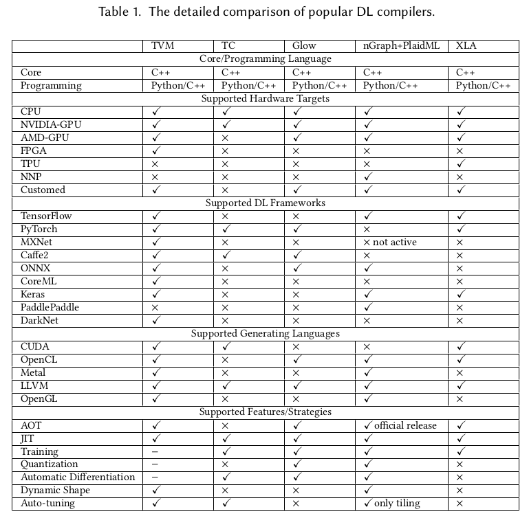
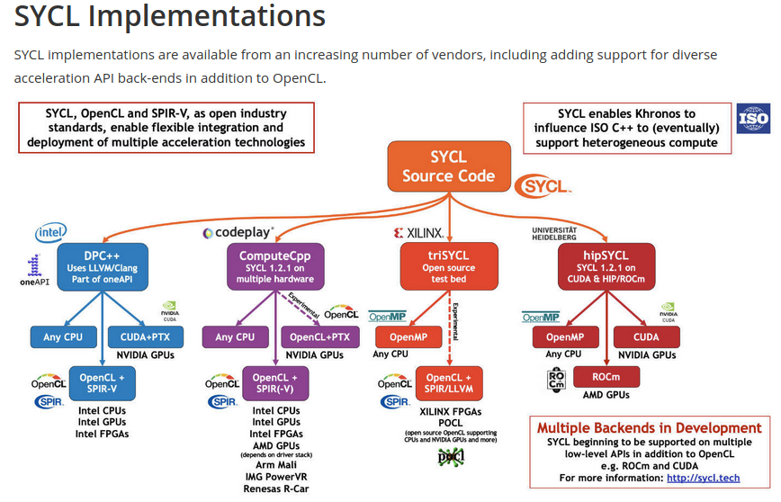
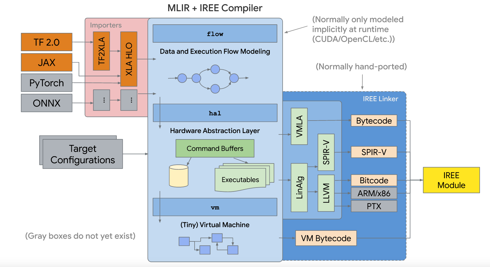
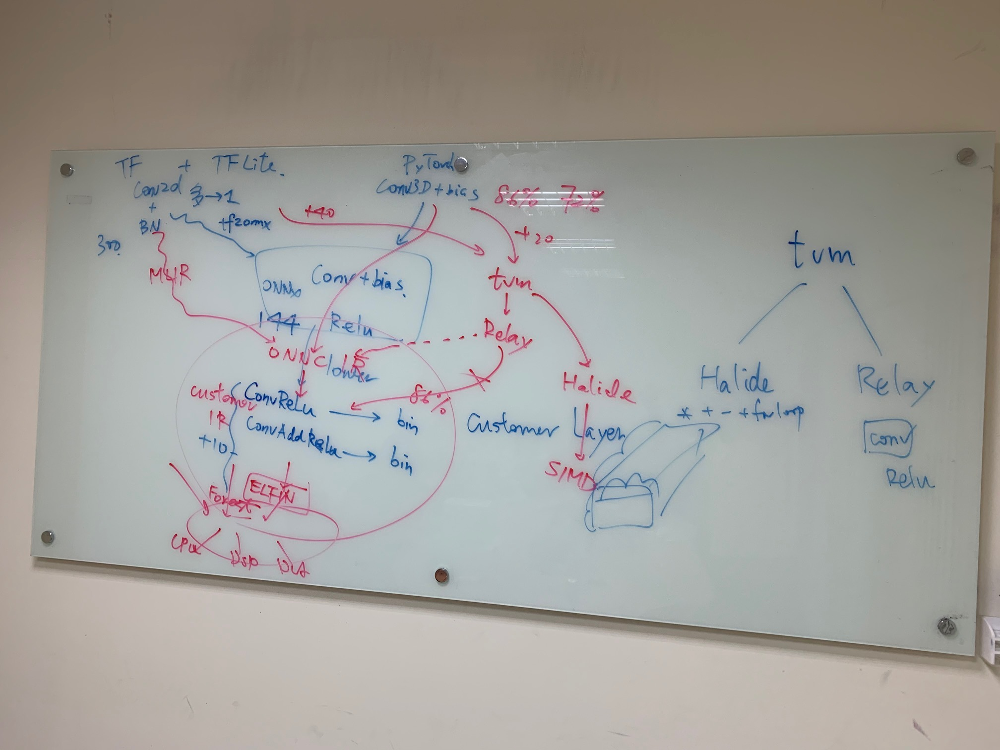
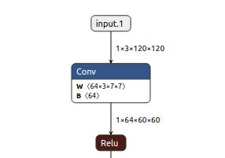

.. _sec-npu:

Appendix C: The concept of NPU (Neural Processor Unit) compiler
===============================================================

.. contents::
   :local:
   :depth: 4

Deep Learning Theory
--------------------

Deep Learning
*************

Hung-Yi Lee's video [#HungYiLee]_.

CNN
***

CNN: They have applications in image and video recognition, recommender systems,
image classification, medical image analysis, natural language processing, and
financial time series [#cnnwiki]_.

Concept about how to apply Convolution and MaxPool to getting features from image [#selectedpattern]_.
Conv+MaxPool -> get features map and downsize image, more Conv+MaxPool can filter image and higher
level of features and downsize more image. CNN model used in image recognition.

Concept and data applying in Deap Learning for different models of CNN [#onnxmodelzoo]_.

Book
****

http://www.deeplearningbook.org/ NTU: Hung-yi Lee MLDS (Machine Learing Deep +
Structure approaches), the trend for future implementation.

Deep learning compiler
----------------------

Survey
******

The current open source compilers for deep learning [#dlcs]_ as follows,

.. _dlcs-f:

TVM compiler open source infrastructure supports most of DL Frameworks such as
TensorFlow, PyTorch..., and generating CUDA/OpenCL/OpenGL for gpu and LLVM for
cpu.

GPU
***

The NVIDIA CUDA Toolkit provides a development environment for creating
high-performance GPU-accelerated applications.
GPU-accelerated CUDA libraries enable acceleration across multiple domains such
as linear algebra, image and video processing, deep learning and graph
analytics [#gpu4dl]_.

OpenCL runs on AMD GPUs and provides partial support for TensorFlow and PyTorch.
If you want to develop new networks some details might be missing, which could
prevent you from implementing the features you need [#gpu4dl]_.
For instance, if ARM GPU doesn't implement operation "Cosh" on TVM while a DL model
created from PyTorch generate "Cosh" operation, then it will fail to run
the DL model though TVM compile PyTorch model into OpenCL.
Once "Cosh" is implemented with kernel fuction "Cosh" in OpenCL by calling
GPU's instructions, it can be fixed.

NNEF
****

Neural Network Exchange Format.

NPU or GPU can apply NNEF to supprt all AI models.

The goal of NNEF is to enable data scientists and engineers to easily transfer
trained networks from their chosen training framework into a wide variety of
inference engines. A stable, flexible and extensible standard that equipment
manufacturers can rely on is critical for the widespread deployment of neural
networks onto edge devices, and so NNEF encapsulates a complete description of
the structure, operations and parameters of a trained neural network,
independent of the training tools used to produce it and the inference engine
used to execute it [#nnef]_.

ONNX and NNEF are Complementary
ONNX moves quickly to track authoring framework updates
NNEF provides a stable bridge from training into edge inferencing engines
[#nnef]_.

.. _nnefeco-f:
.. figure:: ../Fig/npu/nnefeco.png
  :align: center
  :scale: 100%

ONNX import/export to NNEF, should edge NPU use NNEF [#nnef]_?

OpenVX
******

OpenVX enables the graph to be extended to include hardware architectures
that don’t support programmable APIs [#openvx]_.

It is designed by the Khronos Group to facilitate portable, optimized and
power-efficient processing of methods for vision algorithms [#openvx-wiki]_.
Nothing about NPU I think.

SYCL
^^^^

User use SYCL or DSL compile domain language into SYCL and run on OpenCL
hardwares [#sycl]_. An example here [#sycl-wiki]_.

.. _syclcompiler-f:
.. figure:: ../Fig/npu/syclcompiler.png
  :align: center
  :scale: 100%

.. _syclimp-f:

https://github.com/Jonathan2251/nc/OpenCL_SYCL

Tools
*****

Create onnx test file [#onnx-editor]_.

NPU compiler
------------

Abstract
********

Tensorflow support unknown shape [#tfunknownshape]_.
Though our npu support kernel call where kernel call is a set of
commands to npu to deal shape at run time, it is unefficiency.
As I remember mlit supports binding shape for unknown at compile-time
but not always work.
Luckily, we can customilze by redefining model to binding shape staticlly [20200412]

MLIR and IREE
*************

IREE (Intermediate Representation Execution Environment, pronounced as "eerie")
is an MLIR-based end-to-end compiler that lowers ML models to a unified IR
optimized for real-time mobile/edge inference against heterogeneous hardware
accelerators. IREE also provides flexible deployment solutions for the compiled
ML models [#iree]_ as the following figure.

.. _iree-f:

- HAL IR: Vulkan-like allocation and execution model encoding -> on-line first-time compilation and save in cache. Executable compilation via architecture specific backend compiler plugins.

- VM IR: Dynamic module linkage definitions (imports, exports, globals, etc) [#vm-ir-dml]_.

The purpose of mlir is:

- Connect cpu with mlir-to-llvm-ir.

Tensorflow
**********

The mechansim of Mlir and iree applied on tensorflow as the figure above section
is not fitted for off-line edge npu that stand alone without server-connection
for tunning weight of face detection's purpose.
It is designed for on-line server-connected npu.
The gpu of supporting spirv is best candidate until this date 2020/5/12.

At beginning, tensorflow rely on api without fixed format such as ONNX [#onnx-fmt]_.
As a result ONNX emerged and adopted for most of npu in their private backend
compiler. Google does not like to hire onnx as the format for npu backend compiler
onnx-mlir project [#onnx-mlir]_ which convert onnx to mlir dialect is sponsored
by Google I guess [#onnx-mlir-sponsor]_ for encourging new npu compiler
development hiring mlir as their compiler input (convert onnx to mlir then
handling mlir input).

With mlir and iree appear on tensorflow as a series of fixed formats in
tensorflow as section above. The hardware vendors for cloud server AI machine
with heterogeneous hardware accelerators will run tensorflow system
by supporting mlir/iree input format in their compilers more and more.
So, it is unavoidable that tensorflow system's npu vendors have to support
mlir/iree input format beyond onnx. Or open source software or vendor software
appear to do transfer from mlir/iree to onnx. (python in tensorflow api allow
unknown type and shape size, so it cannot transer python api to onnx fully).

If lucky, google may hire onnx. Because onnx format is older than mlir
in history. In addition in aspect of format, mlir has mult-level mult-dialect and
more complicate while onnx is easy and better to understand (P.S. I don't dig
into mlir yet).
Many AI models has supported onnx file format. For some AI model's formats that
run on tensorflow without supporting onnx, aplly tensorflow-onnx open
source project [#tf-onnx]_ can convert tensorflow to onnx partly.

Onnx alliance may release some programs for transfering mlir to onnx for fighting
agiant mlir-iree growing in npu compiler but not at this moment.

For off-line edge npu that stand alone without server-connection
for tunning weight of face detection's purpose, supprting mlir-iree compiler
may not necessary.

mlir to onnx
************

https://www.tensorflow.org/mlir

https://mlir.llvm.org/talks/

https://llvm.org/devmtg/2019-04/talks.html#Tutorial_1

- 3 ppt in llvm tutorials

https://llvm.org/devmtg/2019-04/slides/Tutorial-AminiVasilacheZinenko-MLIR.pdf

build mlir: https://mlir.llvm.org/getting_started/

.. code-block:: console

  ~/llvm/1/llvm-project/build$ cmake -G Ninja ../llvm \
  >    -DLLVM_ENABLE_PROJECTS=mlir \
  >    -DLLVM_BUILD_EXAMPLES=ON \
  >    -DLLVM_TARGETS_TO_BUILD="X86;NVPTX;AMDGPU" \
  >    -DCMAKE_BUILD_TYPE=Release \
  >    -DLLVM_ENABLE_ASSERTIONS=ON

  ~/llvm/1/llvm-project/build$ cmake --build . --target check-mlir
  [200/1919] Generating VCSRevision.h
  -- Found Git: /usr/bin/git (found version "2.17.1")
  [1604/1919] Building CXX object tools/mlir/tools/mlir-linalg-ods-gen/CMakeFiles/mlir-linalg-ods-gen.dir/mlir-linalg-ods-gen.cpp.o
  /home/cschen/llvm/1/llvm-project/mlir/tools/mlir-linalg-ods-gen/mlir-linalg-ods-gen.cpp:935:6: warning: ‘bool {anonymous}::Expression::operator==(const {anonymous}::Expression&) const’ defined but not used [-Wunused-function]
   bool Expression::operator==(const Expression &e) const {
        ^~~~~~~~~~
  [1918/1919] Running the MLIR regression tests

  Testing Time: 9.88s
    Unsupported Tests:  16
    Expected Passes  : 465

run: https://mlir.llvm.org/docs/Tutorials/Toy/

.. code-block:: console

  ~/llvm/1/llvm-project/mlir/test/Examples/Toy/Ch1$ ~/llvm/1/llvm-project/build/bin/toyc-ch1 ast.toy -emit=ast
  ...
  ~/llvm/1/llvm-project/mlir/test/Examples/Toy/Ch1$ ~/llvm/1/llvm-project/build/bin/toyc-ch1 ast.toy -emit=ast 2>&1 | ~/llvm/1/llvm-project/build/bin/FileCheck ast.toy
  ~/llvm/1/llvm-project/mlir/test/Examples/Toy/Ch1$ ~/llvm/1/llvm-project/build/bin/llvm-lit ast.toy
  -- Testing: 1 tests, 1 workers --
  PASS: MLIR :: Examples/Toy/Ch1/ast.toy (1 of 1)

  Testing Time: 0.11s
    Expected Passes: 1

The result I run is based on git commit 455ccde1377b3ec32d321eb7c38808fecdf230a8 Date:   Sun May 17 21:00:09 2020 -0400

Support tensorflow
******************

Question:

Sean,

As I said, we can always redefine AI model to remove unknown type or dimension at ahead of time compilation to fit static compilation binding, and my AI input models are CNN without loop (it is DAG form). For this kind of models on tensorflow, can it be translated absolutely to mlir form based on what you know? If it can, then I can write converting program for mlir to my npu internal ir to support tensorflow.

Answer:

For programs with those restrictions, converting to MLIR xla_hlo dialect is always possible.

Note that it is always possible to convert a TensorFlow GraphDef into MLIR tensorflow dialect. MLIR is very flexible. But MLIR tensorflow dialect is too general for NPU and needs to be converted to MLIR xla_hlo dialect.

-- Sean Silva

Sean,

Thank you! I am going to pass this information to my boss. We don't study mlir yet. I believe it will take effort and we only have few engineers on compiler taking a lot of works. There other resource such as tensorflow-onnx but only part of supporting tensorflow to onnx converting.

Jonathan

ONNC
****

.. _onnc:

  ONNC

- Private IR is better than llvm intrinsic IR for non-VLIW (SIMD or MIMD). Stride, memory dependences, ..., llvm has not much advantages in this. Private IR is better.

- Support MLIR to private IR in Novemember. Open source tensorflow to onnx has limited operations support only, bad and not good.

- TVM support python interfaces but from TVM -> relay is not good according their experience. From MLIR is better.

- Support MLIR, pytorch, caffe are enough. Future has less AI model tools.

- Run time scheduling customer support.

- tf-onnx is not sufficient to support tf's operators and bad. So, translate tf through MLIR to ONNC to customer IR is must.

https://onnc.ai/

LLVM based NPU compiler
-----------------------

Use LLVM rather than GCC because TVM open source compiler generating llvm-ir 
for X86 and ARM and may extend to support other CPU in future. 
Though TVM may uses BYOC to generate C function calling NPU's builtin function,
the AutoTVM layer allows doing more optimization code generation such as
vectorization, CPU/NPU instructions iterleaving, ..., etc [#tvm-passes-stack]_
[#best-tvm-ai-acce]_.
However in cloud of DL scenario, since the time of data transfer from global 
DRAM to PE's (Processor Entity) local memory SRAM is unknown until run time,
applying BYOC for calling NPU's builtin function then using GCC instead of
llvm is possilbe.
NPU usually
implements data parallel instructions such as matrix multiplication, 
convolution, relu, pool, ..., to speed up the Deep Learning Operations.
For other operations not very data parallel such as global pool, concat, sort, 
..., may leave to CPU finishing them. TVM output llvm-ir rather than GCC since
GCC community never had desire to enable any tools besides compiler (Richard 
Stallman resisted attempts to make IR more reusable to prevent third-party 
commercial tools from reusing GCC’s frontends) [#llvm-ir-vs-gimple]_.

The way for supporting llvm based NPU compiler is to implement builtin functions
in clang and the corresponding specific NPU's llvm-intrinsice functions in llvm
backend. For instance, the matrix multiplication operations of clang/llvm support
as the following table.
  
.. table:: Matrix Multiplication defined in clang, llvm and ASM
    
  =====================  =======================
  Component              Function/IR/Instruction
  =====================  =======================
  clang's builtin        __builtin_tensor_matmul(A, B, C)
  llvm's intrinsic       @llvm.lt.matmul %A, %B, %C
  NPU's ASM instruction  matmul $A, $B, %C
  =====================  =======================

The detail steps to support clang's builtin and llvm's intrinsic function for 
backend are in my books [#support-clang-builtin]_ 
[#support-llvm-intrinsic-for-backend]_.

llvm IR for NPU compiler
************************

Though npu has no general purpose registers GPR, it is possible to apply llvm ir for
npu to do codegen by llvm as follows,

.. _conv:

  Conv operation in onnx file

.. code-block:: llvm

  @x1 = global [1 x [3 x [120 x [120 x float]]]], align 4
  @w1 = global [64 x [3 x [7 x [7 x float]]]], align 4
  @conv = @llvm.npu1.conv float* @x, float* @weight, ...

Conclusion:

  1. No GPRs in NPU but can get advantage of code-gen by llvm-tblgen tool.

  2. The vector size of llvm is power of 2 (1, 2, 4, 8, ...). But it can be achieved by modifying llvm kernel source data type.

  ref. code/llvm-ex1.c

  3. Though NPU has no GPRs, the memory allocation can be done by adjust instructions order and split instructions (if over NPU's memory) in passes of LLVM IR level.

reference:

  - section 5.2.2  Code Generation based on Low-Level IR.The low-level IR adopted by most DL compilers can be eventually lowered to LLVM IR, and benefits from LLVM’s mature optimizer and code generator [#dlcs]_.

Open source project
*******************

- onnx to mlir dialect: https://github.com/onnx/onnx-mlir

- tensorflow to onnx: https://github.com/onnx/tensorflow-onnx

- onnx to tensorflow: https://github.com/onnx/onnx-tensorflow

ONNX
----

viewer
******

- Web for opening onnx https://lutzroeder.github.io/netron/

- Application tool for opening onnx  https://github.com/lutzroeder/netron  // find "Browser: Start" in this page

Netron app in ubuntu.

install
*******

$ pip install onnx

onnx api
********

- copy onnx file: ex. nc/code/copy_onnx.py referenece here [#copy1]_.

- create onnx file: ex. nc/code/create1.py referenece here [#create]_.

- Kneron onnx creating tool [#kneron_onnx_create_tool]_.

.. [#HungYiLee] https://www.youtube.com/watch?v=CXgbekl66jc&list=PLJV_el3uVTsPy9oCRY30oBPNLCo89yu49

.. [#selectedpattern] http://violin-tao.blogspot.com/2017/07/ml-convolutional-neural-network-cnn.html

.. [#onnxmodelzoo] https://github.com/onnx/models

.. [#cnnwiki] https://en.wikipedia.org/wiki/Convolutional_neural_network

.. [#gru] https://medium.com/@tengyuanchang/%E6%AF%94%E8%BC%83%E9%95%B7%E7%9F%AD%E6%9C%9F%E8%A8%98%E6%86%B6%E6%A8%A1%E5%9E%8B-lstm-%E8%88%87%E6%94%B9%E8%89%AF%E5%BE%8C%E7%9A%84%E9%81%9E%E6%AD%B8%E7%A5%9E%E7%B6%93%E7%B6%B2%E8%B7%AF%E6%A8%A1%E5%9E%8B-gru-813dec22ec6d

.. [#gru2] in video 22:55 https://www.youtube.com/watch?v=rTqmWlnwz_0&list=PLJV_el3uVTsPy9oCRY30oBPNLCo89yu49&index=31

.. [#dlcs] https://arxiv.org/pdf/2002.03794.pdf

.. [#gpu4dl] https://missinglink.ai/guides/tensorflow/tensorflow-support-opencl/

.. [#nnef] https://www.khronos.org/nnef

.. [#openvx] https://www.khronos.org/openvx

.. [#openvx-wiki] https://en.wikipedia.org/wiki/OpenVX

.. [#sycl] https://www.khronos.org/sycl

.. [#sycl-wiki] https://en.wikipedia.org/wiki/SYCL

.. [#onnx-editor] https://www.youtube.com/watch?v=QZQwmZTfLmI

.. [#iree] https://github.com/google/iree

.. [#tfunknownshape] https://pgaleone.eu/tensorflow/2018/07/28/understanding-tensorflow-tensors-shape-static-dynamic/

.. [#vm-ir-dml] Page 15 of https://docs.google.com/presentation/d/1RCQ4ZPQFK9cVgu3IH1e5xbrBcqy7d_cEZ578j84OvYI/edit#slide=id.g6e31674683_0_23101

.. [#mlir-iree-purpose]  https://kknews.cc/zh-tw/tech/klkombr.html

.. [#onnx-fmt] Actually onnx format based on IO api with protobuffer. It has real binary format but may change from version to version. Tensorflow api has no real binary format.

.. [#onnx-mlir] https://github.com/onnx/onnx-mlir

.. [#onnx-mlir-sponsor] https://groups.google.com/a/tensorflow.org/forum/#!topic/mlir/2FT4sD8kqTY

.. [#tf-onnx] https://github.com/onnx/tensorflow-onnx

.. [#copy1] https://github.com/onnx/onnx/issues/2052

.. [#create] https://www.google.com/search?client=ubuntu&hs=bS9&channel=fs&sxsrf=ALeKk00IITG3Dj_IryeytZ_iTJJE3PszMA%3A1597217944046&ei=mJwzX8KZAuiLr7wPr_aq0AU&q=onnx+python+api&oq=onnx+python+api&gs_lcp=CgZwc3ktYWIQAzIECCMQJzIGCAAQCBAeOggIABAHEB4QEzoKCAAQCBAHEB4QE1CAEFiAEGCNHmgAcAB4AIABdIgBjwKSAQMxLjKYAQCgAQGqAQdnd3Mtd2l6wAEB&sclient=psy-ab&ved=0ahUKEwjCxbvBlJXrAhXoxYsBHS-7CloQ4dUDCAs&uact=5

.. [#kneron_onnx_create_tool] https://github.com/kneron/ONNX_Convertor/blob/master/optimizer_scripts/onnx2onnx.py

.. [#tvm-passes-stack] https://discuss.tvm.apache.org/t/how-to-see-different-ir-relay-te-tir-from-my-own-pytorch-model/13684

.. [#best-tvm-ai-acce] https://discuss.tvm.apache.org/t/which-is-the-best-way-to-port-tvm-to-a-new-ai-accelerator/6905

.. [#llvm-ir-vs-gimple] https://stackoverflow.com/questions/40799696/how-is-gcc-ir-different-from-llvm-ir/40802063

.. [#support-clang-builtin] http://jonathan2251.github.io/lbt/clang.html#builtin-functions

.. [#support-llvm-intrinsic-for-backend] http://jonathan2251.github.io/lbd/funccall.html#add-specific-backend-intrinsic-function
