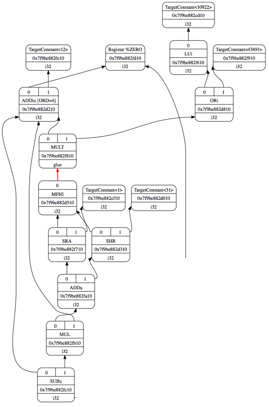

.. _sec-addingmoresupport:

Arithmetic and Logic Instructions
=================================

.. contents::
   :local:
   :depth: 4

This chapter first adds support for more Cpu0 arithmetic instructions.  
The :ref:`section Display LLVM DAG Nodes With Graphviz <dwg>` will show you the 
steps of DAG optimization and their corresponding ``llc`` display options.  
These DAG translations exist at various optimization steps and can be displayed  
using the Graphviz tool, which provides useful graphical information.  

Support for logic instructions will follow the arithmetic section.  
Although the LLVM backend only handles IR, we derive the IR from corresponding  
C operators using designed C example code.  
Instead of focusing on class relationships in the backend structure, as in the  
previous chapter, readers should now focus on mapping C operators to LLVM IR  
and defining the mapping relationship between IR and instructions in ``.td``  
files.  

The **HILO** and **C0** register classes are introduced in this chapter.  
Readers will learn how to handle additional register classes beyond general-  
purpose registers and understand why they are needed.  

Arithmetic
----------

The code added in ``Chapter4_1/`` to support arithmetic instructions is  
summarized as follows:  

.. rubric:: lbdex/chapters/Chapter4_1/Cpu0Subtarget.cpp
.. literalinclude:: ../lbdex/Cpu0/Cpu0Subtarget.cpp
    :start-after: #if CH >= CH4_1 //1
    :end-before: #endif
.. literalinclude:: ../lbdex/Cpu0/Cpu0Subtarget.cpp
    :start-after: //@1 {
    :end-before: //@1 }
	
.. code-block:: c++
  
    ...
  
.. literalinclude:: ../lbdex/Cpu0/Cpu0Subtarget.cpp
    :start-after: #if CH >= CH4_1 //2
    :end-before: #endif
	
.. code-block:: c++
   
    ...
  }

.. rubric:: lbdex/chapters/Chapter4_1/Cpu0InstrInfo.td
.. literalinclude:: ../lbdex/Cpu0/Cpu0InstrInfo.td
    :start-after: //#if CH >= CH4_1 1
    :end-before: //#endif
.. literalinclude:: ../lbdex/Cpu0/Cpu0InstrInfo.td
    :start-after: //#if CH >= CH4_1 2
    :end-before: //#endif
.. literalinclude:: ../lbdex/Cpu0/Cpu0InstrInfo.td
    :start-after: //#if CH >= CH4_1 3
    :end-before: //#endif
.. literalinclude:: ../lbdex/Cpu0/Cpu0InstrInfo.td
    :start-after: //#if CH >= CH4_1 4
    :end-before: //#endif
.. literalinclude:: ../lbdex/Cpu0/Cpu0InstrInfo.td
    :start-after: //#if CH >= CH4_1 5
    :end-before: //#endif
.. literalinclude:: ../lbdex/Cpu0/Cpu0InstrInfo.td
    :start-after: //#if CH >= CH4_1 6
    :end-before: //#endif
.. literalinclude:: ../lbdex/Cpu0/Cpu0InstrInfo.td
    :start-after: //#if CH >= CH4_1 7
    :end-before: //#endif
.. literalinclude:: ../lbdex/Cpu0/Cpu0InstrInfo.td
    :start-after: //#if CH >= CH4_1 8
    :end-before: //#endif

.. rubric:: lbdex/chapters/Chapter4_1/Cpu0ISelLowering.h
.. literalinclude:: ../lbdex/Cpu0/Cpu0ISelLowering.h
    :start-after: #if CH >= CH4_1
    :end-before: #endif

.. rubric:: lbdex/chapters/Chapter4_1/Cpu0ISelLowering.cpp
.. literalinclude:: ../lbdex/Cpu0/Cpu0ISelLowering.cpp
    :start-after: //@Cpu0TargetLowering {
    :end-before: #if CH >= CH3_2
.. literalinclude:: ../lbdex/Cpu0/Cpu0ISelLowering.cpp
    :start-after: #if CH >= CH4_1 //1
    :end-before: #endif
.. literalinclude:: ../lbdex/Cpu0/Cpu0ISelLowering.cpp
    :start-after: #if CH >= CH4_1 //2
    :end-before: #endif

.. code-block:: c++

    ...
  }
  ...

.. literalinclude:: ../lbdex/Cpu0/Cpu0ISelLowering.cpp
    :start-after: #if CH >= CH4_1 //3
    :end-before: #endif

.. rubric:: lbdex/chapters/Chapter4_1/Cpu0RegisterInfo.td
.. literalinclude:: ../lbdex/Cpu0/Cpu0RegisterInfo.td
    :start-after: //@ All registers definition
    :end-before: //@ General Purpose Registers
.. literalinclude:: ../lbdex/Cpu0/Cpu0RegisterInfo.td
    :start-after: //#if CH >= CH4_1 1
    :end-before: //#endif
	
.. code-block:: c++

  }
  ...

.. literalinclude:: ../lbdex/Cpu0/Cpu0RegisterInfo.td
    :start-after: //#if CH >= CH4_1 2
    :end-before: //#endif

.. rubric:: lbdex/chapters/Chapter4_1/Cpu0Schedule.td
.. literalinclude:: ../lbdex/Cpu0/Cpu0Schedule.td
    :start-after: //#if CH >= CH4_1 1
    :end-before: //#endif
.. literalinclude:: ../lbdex/Cpu0/Cpu0Schedule.td
    :start-after: //@ http://llvm.org/docs/doxygen/html/structllvm_1_1InstrStage.html
    :end-before: //@2
.. literalinclude:: ../lbdex/Cpu0/Cpu0Schedule.td
    :start-after: //#if CH >= CH4_1 2
    :end-before: //#endif

.. code-block:: c++

  ]>;

.. rubric:: lbdex/chapters/Chapter4_1/Cpu0SEISelDAGToDAG.h
.. literalinclude:: ../lbdex/Cpu0/Cpu0SEISelDAGToDAG.h
    :start-after: #if CH >= CH4_1
    :end-before: #endif

.. rubric:: lbdex/chapters/Chapter4_1/Cpu0SEISelDAGToDAG.cpp
.. literalinclude:: ../lbdex/Cpu0/Cpu0SEISelDAGToDAG.cpp
    :start-after: #if CH >= CH4_1 //1
    :end-before: #endif
.. literalinclude:: ../lbdex/Cpu0/Cpu0SEISelDAGToDAG.cpp
    :start-after: //@selectNode
    :end-before: #if CH >= CH7_1 //2
.. literalinclude:: ../lbdex/Cpu0/Cpu0SEISelDAGToDAG.cpp
    :start-after: #if CH >= CH4_1 //2
    :end-before: #endif
	
.. code-block:: c++

      }
      ...
    }

.. rubric:: lbdex/chapters/Chapter4_1/Cpu0SEInstrInfo.h
.. literalinclude:: ../lbdex/Cpu0/Cpu0SEInstrInfo.h
    :start-after: #if CH >= CH4_1
    :end-before: #endif

.. rubric:: lbdex/chapters/Chapter4_1/Cpu0SEInstrInfo.cpp
.. literalinclude:: ../lbdex/Cpu0/Cpu0SEInstrInfo.cpp
    :start-after: #if CH >= CH4_1
    :end-before: #endif


**+, -, \*, <<,** and **>>**
****************************

The **ADDu**, **ADD**, **SUBu**, **SUB**, and **MUL** instructions defined in  
``Chapter4_1/Cpu0InstrInfo.td`` correspond to the **+, -, \*** operators.  
**SHL** (defined earlier) and **SHLV** are used for **<<**, while **SRA**,  
**SRAV**, **SHR**, and **SHRV** handle **>>**.  

In RISC CPUs like MIPS, the multiply/divide function unit and add/sub/logic  
unit are implemented using separate hardware circuits with distinct data paths.  
Cpu0 follows the same approach, allowing these function units to execute  
simultaneously (instruction-level parallelism).  
Refer to [#instrstage]_ for details on instruction itineraries.  

``Chapter4_1/`` supports the **+, -, \*, <<, and >>** operators in C.  
The corresponding LLVM IR instructions are **add, sub, mul, shl, and ashr**.  

The **ashr** instruction (arithmetic shift right) shifts the first operand  
right by a specified number of bits with sign extension.  
In short, **ashr** performs "shift with sign extension fill."

.. note:: **ashr**

  Example:
    <result> = ashr i32 4, 1   ; yields {i32}:result = 2
    
    <result> = ashr i8 -2, 1   ; yields {i8}:result = -1
    
    <result> = ashr i32 1, 32  ; undefined

The behavior of the C **>>** operator for negative operands is  
implementation-dependent.  
Most compilers translate it as a "shift with sign extension fill,"  
which is equivalent to the MIPS **sra** instruction.  
The Microsoft website provides the following explanation:  

.. note:: **>>**, Microsoft Specific

  The result of a right shift of a signed negative quantity is implementation 
  dependent. 
  Although Microsoft C++ propagates the most-significant bit to fill vacated 
  bit positions, there is no guarantee that other implementations will do 
  likewise.

In addition to **ashr**, LLVM provides the **lshr** instruction ("logical shift  
right with zero fill"), which MIPS implements with the **srl** instruction.  

.. note:: **lshr**

  Example:
  <result> = lshr i8 -2, 1   ; yields {i8}:result = 0x7FFFFFFF 
  
LLVM defines **sra** as the IR node for **ashr** and **srl** for **lshr**.  
(It's unclear why LLVM does not directly use "ashr" and "lshr" as IR node names.)  
The following table summarizes C **>>** operator implementations:

.. table:: C operator >> implementation

  ======================================= ======================  =====================================
  Description                             Shift with zero filled  Shift with signed extension filled
  ======================================= ======================  =====================================
  symbol in .bc                           lshr                    ashr
  symbol in IR node                       srl                     sra
  Mips instruction                        srl                     sra
  Cpu0 instruction                        shr                     sra
  signed example before x >> 1            0xfffffffe i.e. -2      0xfffffffe i.e. -2
  signed example after x >> 1             0x7fffffff i.e 2G-1     0xffffffff i.e. -1
  unsigned example before x >> 1          0xfffffffe i.e. 4G-2    0xfffffffe i.e. 4G-2
  unsigned example after x >> 1           0x7fffffff i.e 2G-1     0xffffffff i.e. 4G-1
  ======================================= ======================  =====================================
  
**lshr:** Logical SHift Right

**ashr:** Arithmetic SHift right

**srl:**  Shift Right Logically

**sra:**  Shift Right Arithmetically

**shr:**  SHift Right


If we define **x >> 1** as **x = x / 2**, then **lshr** fails for some signed  
values (e.g., -2). Similarly, **ashr** fails for some unsigned values  
(e.g., **4G - 2**).  
Thus, to correctly handle both signed and unsigned integers, we need both  
**lshr** and **ashr**.  

.. table:: C operator << implementation

  ======================================= ======================
  Description                             Shift with zero filled
  ======================================= ======================
  symbol in .bc                           shl
  symbol in IR node                       shl
  Mips instruction                        sll
  Cpu0 instruction                        shl
  signed example before x << 1            0x40000000 i.e. 1G
  signed example after x << 1             0x80000000 i.e -2G
  unsigned example before x << 1          0x40000000 i.e. 1G
  unsigned example after x << 1           0x80000000 i.e 2G
  ======================================= ======================

Again, consider the definition of ``x << 1`` as ``x = x * 2``.  
From the table on C operator ``<<`` implementation, we see that **lshr**  
satisfies the case for "unsigned x = 1G" but fails for "signed x = 1G".  
This is acceptable since ``2G`` exceeds the 32-bit signed integer range  
(``-2G`` to ``2G - 1``).  

In the case of overflow, there is no way to retain the correct result  
within a register. Thus, any value stored in the register is acceptable.  
You can verify that **lshr** satisfies ``x = x * 2`` for all ``x << 1``,  
as long as the result remains within range, regardless of whether ``x``  
is signed or unsigned [#arithmetic-shift]_.  

The reference for the ``ashr`` instruction is available here [#ashr]_,  
and for ``lshr`` here [#lshr]_.  

The instructions **srav**, **shlv**, and **shrv** operate on two virtual  
input registers, while **sra**, **...**, and others operate on one virtual  
input register and one constant operand.  

Now, let's build ``Chapter4_1/`` and run it using the input file  
``ch4_math.ll`` as follows:

.. rubric:: lbdex/input/ch4_math.ll
.. literalinclude:: ../lbdex/input/ch4_math.ll
  
.. code-block:: console

  118-165-78-12:input Jonathan$ /Users/Jonathan/llvm/test/build/
  bin/llc -march=cpu0 -relocation-model=pic -filetype=asm ch4_math.ll -o -
    ...
	  ld	$2, 0($sp)
	  ld	$3, 4($sp)
	  subu	$4, $3, $2
	  addu	$5, $3, $2
	  addu	$4, $5, $4
	  mul	$5, $3, $2
	  addu	$4, $4, $5
	  shl	$5, $3, 2
	  addu	$4, $4, $5
	  sra	$5, $3, 2
	  addu	$4, $4, $5
	  addiu	$5, $zero, 128
	  shrv	$5, $5, $2
	  addiu	$t9, $zero, 1
	  shlv	$t9, $t9, $2
	  srav	$2, $3, $2
	  shr	$3, $3, 30
	  addu	$3, $4, $3
	  addu	$3, $3, $t9
	  addu	$3, $3, $5
	  addu	$2, $3, $2
	  addiu	$sp, $sp, 8
	  ret	$lr


The example input ``ch4_1_math.cpp`` shown below is a C file that includes  
the operators **`+`**, **`-`**, **`*`**, **`<<`**, and **`>>`**.  

Compiling this file with Clang will generate the corresponding LLVM IR  
instructions: **add**, **sub**, **mul**, **shl**, and **ashr**, as indicated  
in Chapter 3.  

.. rubric:: lbdex/input/ch4_1_math.cpp
.. literalinclude:: ../lbdex/input/ch4_1_math.cpp
    :start-after: /// start

    
Cpu0 instructions ``add`` and ``sub`` will trigger an overflow exception,  
whereas ``addu`` and ``subu`` truncate overflow values directly.  

Compiling ``ch4_1_addsuboverflow.cpp`` with the following command:  

.. code-block:: console

   llc -cpu0-enable-overflow=true  

will generate ``add`` and ``sub`` instructions as shown below:

.. rubric:: lbdex/input/ch4_1_addsuboverflow.cpp
.. literalinclude:: ../lbdex/input/ch4_1_addsuboverflow.cpp
    :start-after: /// start

.. code-block:: console

  118-165-78-12:input Jonathan$ clang -target mips-unknown-linux-gnu -c 
  ch4_1_addsuboverflow.cpp -emit-llvm -o ch4_1_addsuboverflow.bc
  118-165-78-12:input Jonathan$ llvm-dis ch4_1_addsuboverflow.bc -o -
  ...
  ; Function Attrs: nounwind
  define i32 @_Z13test_overflowv() #0 {
    ...
    %3 = add nsw i32 %1, %2
    ...
    %6 = sub nsw i32 %4, %5
    ...
  }

  118-165-78-12:input Jonathan$ /Users/Jonathan/llvm/test/build/
  bin/llc -march=cpu0 -relocation-model=pic -filetype=asm 
  -cpu0-enable-overflow=true ch4_1_addsuboverflow.bc -o -
	...
	add	$3, $4, $3
	...
	sub	$3, $4, $3
	...

In modern CPUs, programmers typically use truncate overflow instructions  
for C operators ``+`` and ``-``.  

However, by using the ``-cpu0-enable-overflow=true`` option, programmers  
can compile programs with overflow exception handling. This option is  
mainly used for debugging purposes. Compiling with this option can help  
identify bugs early and fix them efficiently.  


.. _dwg:

Display LLVM DAG Nodes With Graphviz
************************************

The previous section displayed the DAG translation process in text format  
on the terminal using the ``llc -debug`` option.  

The ``llc`` tool also supports graphical visualization. The  
:ref:`section Install other tools on iMac <install-other-tools-on-imac>` 
explains how to download and install Graphviz, a tool for rendering DAGs.  

This section introduces how to use ``llc`` with Graphviz for graphical  
display. Viewing DAGs graphically is often easier to interpret than  
reading raw text in the terminal. While not mandatory, this visualization  
can be very helpful, especially when debugging complex DAG transformations.  

The following ``llc`` options allow graphical visualization of DAGs,  
as mentioned in the "SelectionDAG Instruction Selection Process" section  
of the LLVM Target-Independent Code Generator documentation [#instructionsel]_:

.. note:: The ``llc`` Graphviz DAG display options

  -view-dag-combine1-dags displays the DAG after being built, before the 
  first optimization pass. 
  
  -view-legalize-dags displays the DAG before Legalization. 
  
  -view-dag-combine2-dags displays the DAG before the second optimization 
  pass. 
  
  -view-isel-dags displays the DAG before the Select phase. 
  
  -view-sched-dags displays the DAG before Scheduling. 
  
By tracking ``llc -debug``, you can see the steps of DAG translation as follows,

.. code-block:: console

  Initial selection DAG
  Optimized lowered selection DAG
  Type-legalized selection DAG
  Optimized type-legalized selection DAG
  Legalized selection DAG
  Optimized legalized selection DAG
  Instruction selection
  Selected selection DAG
  Scheduling
  ...


Let's run ``llc`` with option -view-dag-combine1-dags, and open the output 
result with Graphviz as follows,

.. code-block:: console

  118-165-12-177:input Jonathan$ /Users/Jonathan/llvm/test/
  build/bin/llc -view-dag-combine1-dags -march=cpu0 
  -relocation-model=pic -filetype=asm ch4_1_mult.bc -o ch4_1_mult.cpu0.s
  Writing '/tmp/llvm_84ibpm/dag.main.dot'...  done. 
  118-165-12-177:input Jonathan$ Graphviz /tmp/llvm_84ibpm/dag.main.dot 

It will show the /tmp/llvm_84ibpm/dag.main.dot as :numref:`otherinst-f1`.

.. _otherinst-f1:
.. figure:: ../Fig/otherinst/ch4_1_mult_view-dag-combine1-dags.png
  :scale: 50%

  llc option -view-dag-combine1-dags graphic view

:numref:`otherinst-f1` is the stage of "Initial selection DAG". 
List the other view options and their corresponding stages of DAG translation as 
follows,

.. note:: ``llc`` Graphviz options and the corresponding stages of DAG translation

  -view-dag-combine1-dags: Initial selection DAG
  
  -view-legalize-dags: Optimized type-legalized selection DAG
  
  -view-dag-combine2-dags: Legalized selection DAG
  
  -view-isel-dags: Optimized legalized selection DAG
  
  -view-sched-dags: Selected selection DAG

The ``-view-isel-dags`` option is particularly important and frequently  
used by LLVM backend developers. It displays the DAGs before instruction  
selection, providing crucial insight into how LLVM represents operations  
before they are mapped to target-specific instructions.  

To write pattern-matching rules in the target description file (``.td``),  
backend developers need to understand the DAG nodes corresponding to  
specific C operators. This visualization helps in accurately defining  
these patterns.  

Operator ``%`` and ``/``
*************************

DAG Representation of ``%``
^^^^^^^^^^^^^^^^^^^^^^^^^^^^

The following example, ``ch4_1_mult.cpp``, contains the C operator ``%``  
(modulus). The corresponding LLVM IR is shown below:

.. rubric:: lbdex/input/ch4_1_mult.cpp
.. literalinclude:: ../lbdex/input/ch4_1_mult.cpp
    :start-after: /// start

.. code-block:: console

  ...
  define i32 @_Z8test_multv() #0 {
    %b = alloca i32, align 4
    store i32 11, i32* %b, align 4
    %1 = load i32* %b, align 4
    %2 = add nsw i32 %1, 1
    %3 = srem i32 %2, 12
    store i32 %3, i32* %b, align 4
    %4 = load i32* %b, align 4
    ret i32 %4
  }

LLVM **srem** corresponds to the C operator **“%”**. Reference: [#srem]_.  
The following note provides details on its syntax and behavior:

.. note:: **'srem'** Instruction  

  **Syntax:**  
  **<result> = srem <ty> <op1>, <op2>   ; yields {ty}:result**  

  **Overview:**  
  The **'srem'** instruction returns the remainder from the signed division  
  of its two operands. This instruction also supports vector types, where  
  the elements must be integers.  

  **Arguments:**  
  The two arguments of the **'srem'** instruction must be integers or vectors  
  of integer values. Both operands must have identical types.  

  **Semantics:**  
  This instruction returns the remainder of a signed division, meaning the  
  result is either zero or has the same sign as the dividend (**op1**).  
  It is not the modulo operator, where the result would have the same sign  
  as the divisor (**op2**). For more details, see references such as  
  The Math Forum or Wikipedia’s article on the modulo operation.  

  Note that signed integer remainder (**srem**) and unsigned integer  
  remainder (**urem**) are distinct operations. For unsigned remainder,  
  use **'urem'** instead.  

  Taking the remainder of a division by zero results in undefined behavior.  
  Overflow also causes undefined behavior, though it is a rare case. One such  
  scenario is taking the remainder of a 32-bit division of **-2147483648** by  
  **-1**, which cannot be directly represented. This rule allows **srem**  
  to be implemented using division instructions that return both the quotient  
  and the remainder.  

  **Example:**  
  ``<result> = srem i32 4, %var``  ; yields ``{i32}: result = 4 % %var``  

To observe LLVM’s DAG representation of **srem**, run 
``llc –view-isel-dags --debug`` on the input file ``ch4_1_mult.bc`` in 
``Chapter3_5/``.
The **Optimized lowered selection DAG** statge is corresponding to DAG of
``–view-isel-dags``.
LLVM will display an error message along with the DAG output,  
as illustrated in the following **Optimized lowered selection DAG** and 
:numref:`otherinst-f2` below.

.. code-block:: console

  118-165-79-37:input Jonathan$ /Users/Jonathan/llvm/test/
  build/bin/llc -march=cpu0 -view-isel-dags -relocation-model=
  pic -filetype=asm --debug ch4_1_mult.bc -o -
  ...
  LLVM ERROR: Cannot select: t19: i32 = mulhs t8, Constant:i32<715827883>

.. code-block:: text

  Optimized lowered selection DAG: %bb.0 '_Z9test_multv:entry'
  SelectionDAG has 22 nodes:
        t0: ch = EntryToken
      t5: ch = store<(store 4 into %ir.b)> t0, Constant:i32<11>, FrameIndex:i32<0>, undef:i32     // t5 = store 11 to FrameIndex(0)
    t6: i32,ch = load<(dereferenceable load 4 from %ir.b)> t5, FrameIndex:i32<0>, undef:i32       // t6 = load FrameIndex(0)
    t8: i32 = add nsw t6, Constant:i32<1>                                                         // t8 = add t6, 1  -->  t8 = 12
            t22: i32 = sra t19, Constant:i32<1>                                                   // t22 = sra 
            t28: i32 = srl t19, Constant:i32<31>
          t25: i32 = add t22, t28
        t26: i32 = mul t25, Constant:i32<12>
      t27: i32 = sub t8, t26
    t11: ch = store<(store 4 into %ir.b)> t6:1, t27, FrameIndex:i32<0>, undef:i32
      t12: i32,ch = load<(dereferenceable load 4 from %ir.b)> t11, FrameIndex:i32<0>, undef:i32
    t14: ch,glue = CopyToReg t11, Register:i32 $v0, t12
    t19: i32 = mulhs t8, Constant:i32<715827883>
    t15: ch = Cpu0ISD::Ret t14, Register:i32 $v0, t14:1

.. _otherinst-f2:
.. figure:: ../Fig/otherinst/ch4_1_mult_view-isel-dags.png
   :scale: 50%

   ch4_1_mult.bc DAG

LLVM optimizes the **srem** operation by replacing division with multiplication  
in DAG optimization. This is because the **DIV** operation is more expensive  
in terms of execution time compared to **MUL**.  

For example, the following C code:

.. code-block:: c++

  int b = 11;
  b = (b + 1) % 12;

is translated into DAGs, as shown in :numref:`otherinst-f2`.  
The DAG representation is verified and explained by calculating the values  
at each node.  

The computation follows these steps:  

- t5 = store 11 to FrameIndex(0)
- t6 = load FrameIndex(0)
- t8 = add t6, 1  -->  t8 = 12
- 715827883 = 0x2AAAAAAB
- **0xC * 0x2AAAAAAB = 0x2,00000004**  
- **mulhs(0xC, 0x2AAAAAAAB)** retrieves the signed multiplication's high  
  word (upper 32 bits).  
- A multiplication of two 32-bit operands typically produces a 64-bit result  
  (e.g., **0x2, 0xAAAAAAAB**).  
- In this case, the high word of the result is **0x2**.  
- The final computation **sub(12, 12)** results in **0**,  
  which correctly matches **(11 + 1) % 12**.  

ARM Solution
^^^^^^^^^^^^^

To run this with an ARM-based solution, modify the following files in  
``Chapter4_1/``:  

- ``Cpu0InstrInfo.td``  
- ``Cpu0ISelDAGToDAG.cpp``  

Make the necessary changes as follows:
 
.. rubric:: lbdex/chapters/Chapter4_1/Cpu0InstrInfo.td
.. code-block:: c++

  /// Multiply and Divide Instructions.
  def SMMUL   : ArithLogicR<0x41, "smmul", mulhs, IIImul, CPURegs, 1>;
  def UMMUL   : ArithLogicR<0x42, "ummul", mulhu, IIImul, CPURegs, 1>;
  //def MULT    : Mult32<0x41, "mult", IIImul>;
  //def MULTu   : Mult32<0x42, "multu", IIImul>;

.. rubric:: lbdex/chapters/Chapter4_1/Cpu0ISelDAGToDAG.cpp
.. code-block:: c++

  #if 0
  /// Select multiply instructions.
  std::pair<SDNode*, SDNode*>
  Cpu0DAGToDAGISel::SelectMULT(SDNode *N, unsigned Opc, SDLoc DL, EVT Ty,
                               bool HasLo, bool HasHi) {
    SDNode *Lo = 0, *Hi = 0;
    SDNode *Mul = CurDAG->getMachineNode(Opc, DL, MVT::Glue, N->getOperand(0),
                                         N->getOperand(1));
    SDValue InFlag = SDValue(Mul, 0);

    if (HasLo) {
      Lo = CurDAG->getMachineNode(Cpu0::MFLO, DL,
                                  Ty, MVT::Glue, InFlag);
      InFlag = SDValue(Lo, 1);
    }
    if (HasHi)
      Hi = CurDAG->getMachineNode(Cpu0::MFHI, DL,
                                  Ty, InFlag);

    return std::make_pair(Lo, Hi);
  }
  #endif

  /// Select instructions not customized! Used for
  /// expanded, promoted and normal instructions
  SDNode* Cpu0DAGToDAGISel::Select(SDNode *Node) {
  ...
    switch(Opcode) {
    default: break;
  #if 0
    case ISD::MULHS:
    case ISD::MULHU: {
      MultOpc = (Opcode == ISD::MULHU ? Cpu0::MULTu : Cpu0::MULT);
      return SelectMULT(Node, MultOpc, DL, NodeTy, false, true).second;
    }
  #endif
   ...
  }


Let's apply the above changes and run them with ``ch4_1_mult.cpp`` using  
the ``llc -view-sched-dags`` option to generate :numref:`otherinst-f3`.  

The **SMMUL** instruction is used to extract the high word of the  
multiplication result.

.. _otherinst-f3:
.. figure:: ../Fig/otherinst/3.png
  :height: 743 px
  :width: 684 px
  :scale: 100 %
  :align: center

  DAG for ch4_1_mult.bc with ARM style SMMUL

The following is the result of running the above changes with ``ch4_1_mult.bc``.

.. code-block:: console

  118-165-66-82:input Jonathan$ /Users/Jonathan/llvm/test/build/bin/llc 
  -march=cpu0 -relocation-model=pic -filetype=asm 
  ch4_1_mult.bc -o -
    ...
  # BB#0:                                 # %entry
    addiu $sp, $sp, -8
  $tmp1:
    .cfi_def_cfa_offset 8
    addiu $2, $zero, 0
    st  $2, 4($fp)
    addiu $2, $zero, 11
    st  $2, 0($fp)
    lui $2, 10922
    ori $3, $2, 43691
    addiu $2, $zero, 12
    smmul $3, $2, $3
    shr $4, $3, 31
    sra $3, $3, 1
    addu  $3, $3, $4
    mul $3, $3, $2
    subu  $2, $2, $3
    st  $2, 0($fp)
    addiu $sp, $sp, 8
    ret $lr


MIPS Solution
^^^^^^^^^^^^^^

MIPS uses the **MULT** instruction to perform multiplication, storing the high 
and low parts of the result in the **HI** and **LO** registers, respectively. 
After that, the **mfhi** and **mflo** instructions move the values from the 
HI/LO registers to general-purpose registers.

ARM's **SMMUL** instruction is optimized for cases where only the high part 
of the result is needed, as it ignores the low part. ARM also provides **SMULL** 
(signed multiply long) to obtain the full 64-bit result.

If only the low part of the result is needed, the **Cpu0 MUL** instruction can 
be used. The implementation in ``Chapter4_1/`` follows the MIPS **MULT** style 
to minimize the number of added instructions. This approach makes **Cpu0** 
suitable as both a tutorial architecture for educational purposes and a 
learning resource for compiler design.

The following instructions are added in ``Chapter4_1/`` for the MIPS-style 
implementation:

- **MULT, MULTu, MFHI, MFLO, MTHI, MTLO** in ``Chapter4_1/Cpu0InstrInfo.td``
- **HI, LO registers** in ``Chapter4_1/Cpu0RegisterInfo.td`` and 
  ``Chapter4_1/MCTargetDesc/Cpu0BaseInfo.h``
- **IIHiLo, IIImul** in ``Chapter4_1/Cpu0Schedule.td``
- **SelectMULT()** in ``Chapter4_1/Cpu0ISelDAGToDAG.cpp``

Except for custom types, LLVM IR operations of type **expand** and **promote** 
will call **Cpu0DAGToDAGISel::Select()** during instruction selection in the 
DAG translation process. 

The function **selectMULT()**, which is called by **select()**, returns the **HI** 
part of the multiplication result to the **HI** register for IR operations 
**mulhs** or **mulhu**. After that, the **MFHI** instruction moves the **HI** 
register to the Cpu0 **"a"** register, **$ra**.

Since the **MFHI** instruction follows the **FL** format and only utilizes the 
Cpu0 **"a"** register, we set **$rb** and **imm16** to 0. 

:numref:`otherinst-f4` and ``ch4_1_mult.cpu0.s`` show the compilation results 
of ``ch4_1_mult.bc``.

.. _otherinst-f4:


  DAG for ch4_1_mult.bc with Mips style MULT

.. code-block:: console

  118-165-66-82:input Jonathan$ cat ch4_1_mult.cpu0.s 
    ...
  # BB#0:
    addiu $sp, $sp, -8
    addiu $2, $zero, 11
    st  $2, 4($sp)
    lui $2, 10922
    ori $3, $2, 43691
    addiu $2, $zero, 12
    mult  $2, $3
    mfhi  $3
    shr $4, $3, 31
    sra $3, $3, 1
    addu  $3, $3, $4
    mul $3, $3, $2
    subu  $2, $2, $3
    st  $2, 4($sp)
    addiu $sp, $sp, 8
    ret $lr
    

Full Support for `%` and `/`
^^^^^^^^^^^^^^^^^^^^^^^^^^^^^

Attentive readers may notice that LLVM replaces **division (`/`)** with  
**multiplication (`*`)** when computing the **remainder (`%`)** in our  
example. This optimization occurs because the divisor in our example,  
**"(b+1) % 12"**, is a constant.

However, what happens if the divisor is a variable, such as in  
**"(b+1) % a"**?  
In this case, our current implementation would fail to handle it correctly.

Cpu0, like MIPS, uses the **LO** and **HI** registers to store the  
**quotient** and **remainder**, respectively. The instructions **"mflo"**  
and **"mfhi"** retrieve the results from the **LO** and **HI** registers.  

Using this approach:
- The operation **`c = a / b`** is implemented as:
  
  .. code-block:: asm
  
     div a, b  
     mflo c  

- The operation **`c = a % b`** is implemented as:

  .. code-block:: asm

     div a, b  
     mfhi c  

To support the operators **`%`** and **`/`**, the following changes were  
added in **Chapter4_1/**:

1. **SDIV**, **UDIV**, and their reference classes, as well as DAG nodes in  
   `Cpu0InstrInfo.td`.
2. **copyPhysReg()**, declared in `Cpu0InstrInfo.h` and implemented in  
   `Cpu0InstrInfo.cpp`.
3. **setOperationAction(ISD::SDIV, MVT::i32, Expand)**,  
   **setTargetDAGCombine(ISD::SDIVREM)** in the constructor of  
   `Cpu0ISelLowering.cpp`, along with  
   `PerformDivRemCombine()` and `PerformDAGCombine()` in  
   `Cpu0ISelLowering.cpp`.

The LLVM IR instruction **sdiv** represents **signed division**, while  
**udiv** represents **unsigned division**.

.. rubric:: lbdex/input/ch4_1_mult2.cpp
.. literalinclude:: ../lbdex/input/ch4_1_mult2.cpp
    :start-after: /// start

When running `ch4_1_mult2.cpp`, the **`div`** instruction is not generated  
for the **`%`** operator. Instead, LLVM still replaces it with  
**multiplication (`*`)**.  

This happens because LLVM applies **Constant Propagation Optimization**,  
which optimizes expressions involving constants at compile time.

To force LLVM to generate a **`div`** instruction for **`%`**,  
we can use `ch4_1_mod.cpp`, which prevents LLVM from applying  
**Constant Propagation Optimization**.
  
.. rubric:: lbdex/input/ch4_1_mod.cpp
.. literalinclude:: ../lbdex/input/ch4_1_mod.cpp
    :start-after: /// start

.. code-block:: console

  118-165-77-79:input Jonathan$ clang -target mips-unknown-linux-gnu -c 
  ch4_1_mod.cpp -emit-llvm -o ch4_1_mod.bc
  118-165-77-79:input Jonathan$ /Users/Jonathan/llvm/test/build/bin/llc 
  -march=cpu0 -relocation-model=pic -filetype=asm 
  ch4_1_mod.bc -o -
  ...
  div $zero, $3, $2
  mflo  $2
  ...

To explains how to work with **“div”**, let's run ch4_1_mod.cpp with debug option
as follows,

To understand how LLVM generates the **`div`** instruction,  
let's run `ch4_1_mod.cpp` with the debug option as follows:

.. code-block:: console

  118-165-83-58:input Jonathan$ clang -target mips-unknown-linux-gnu -c 
  ch4_1_mod.cpp -I/Applications/Xcode.app/Contents/Developer/Platforms/
  MacOSX.platform/Developer/SDKs/MacOSX10.8.sdk/usr/include/ -emit-llvm -o 
  ch4_1_mod.bc
  118-165-83-58:input Jonathan$ /Users/Jonathan/llvm/test/build/
  bin/llc -march=cpu0 -relocation-model=pic -filetype=asm -debug 
  ch4_1_mod.bc -o -
  ...
  === _Z8test_modi
  Initial selection DAG: BB#0 '_Z8test_mod2i:'
  SelectionDAG has 21 nodes:
    ...
      0x2447448: <multiple use>
          0x24470d0: <multiple use>
          0x24471f8: i32 = Constant<1>

        0x2447320: i32 = add 0x24470d0, 0x24471f8 [ORD=7]

        0x2447448: <multiple use>
      0x2447570: i32 = srem 0x2447320, 0x2447448 [ORD=9]

      0x24468b8: <multiple use>
      0x2446b08: <multiple use>
    0x2448fc0: ch = store 0x2447448:1, 0x2447570, 0x24468b8, ...

    0x2449210: i32 = Register %V0

      0x2448fc0: <multiple use>
      0x2449210: <multiple use>
        0x2448fc0: <multiple use>
        0x24468b8: <multiple use>
        0x2446b08: <multiple use>
      0x24490e8: i32,ch = load 0x2448fc0, 0x24468b8, 0x2446b08<LD4[%b]> [ORD=11]

    0x2449338: ch,glue = CopyToReg 0x2448fc0, 0x2449210, 0x24490e8 [ORD=12]

      0x2449338: <multiple use>
      0x2449210: <multiple use>
      0x2449338: <multiple use>
    0x2449460: ch = Cpu0ISD::Ret 0x2449338, 0x2449210, 0x2449338:1 [ORD=12]

  Replacing.1 0x24490e8: i32,ch = load 0x2448fc0, 0x24468b8, ...

  With: 0x2447570: i32 = srem 0x2447320, 0x2447448 [ORD=9]
   and 1 other values
  ...

  Optimized lowered selection DAG: BB#0 '_Z8test_mod2i:'
  ...
    0x2447570: i32 = srem 0x2447320, 0x2447448 [ORD=9]
  ...
  
  Type-legalized selection DAG: BB#0 '_Z8test_mod2i:'
  SelectionDAG has 16 nodes:
    ...
    0x7fed6882d610: i32,ch = load 0x7fed6882d210, 0x7fed6882cd10, 
    0x7fed6882cb10<LD4[%1]> [ORD=5] [ID=-3]
  
      0x7fed6882d810: i32 = Constant<12> [ID=-3]
  
      0x7fed6882d610: <multiple use>
    0x7fed6882d710: i32 = srem 0x7fed6882d810, 0x7fed6882d610 [ORD=6] [ID=-3]
    ...
    
  Legalized selection DAG: BB#0 '_Z8test_mod2i:'
    ...
      ... i32 = srem 0x2447320, 0x2447448 [ORD=9] [ID=-3]
    ...
   ... replacing: ...: i32 = srem 0x2447320, 0x2447448 [ORD=9] [ID=13]
       with:      ...: i32,i32 = sdivrem 0x2447320, 0x2447448 [ORD=9]
  
  Optimized legalized selection DAG: BB#0 '_Z8test_mod2i:'
  SelectionDAG has 18 nodes:
    ...
      0x2449588: i32 = Register %HI

          0x24470d0: <multiple use>
          0x24471f8: i32 = Constant<1> [ID=6]

        0x2447320: i32 = add 0x24470d0, 0x24471f8 [ORD=7] [ID=12]

        0x2447448: <multiple use>
      0x24490e8: glue = Cpu0ISD::DivRem 0x2447320, 0x2447448 [ORD=9]

    0x24496b0: i32,ch,glue = CopyFromReg 0x240d480, 0x2449588, 0x24490e8 [ORD=9]

      0x2449338: <multiple use>
      0x2449210: <multiple use>
      0x2449338: <multiple use>
    0x2449460: ch = Cpu0ISD::Ret 0x2449338, 0x2449210, ...
    ...
  
  ===== Instruction selection begins: BB#0 ''
  ...
  Selecting: 0x24490e8: glue = Cpu0ISD::DivRem 0x2447320, 0x2447448 [ORD=9] [ID=14]

  ISEL: Starting pattern match on root node: 0x24490e8: glue = Cpu0ISD::DivRem 
  0x2447320, 0x2447448 [ORD=9] [ID=14]

    Initial Opcode index to 4044
    Morphed node: 0x24490e8: i32,glue = SDIV 0x2447320, 0x2447448 [ORD=9]

  ISEL: Match complete!
  => 0x24490e8: i32,glue = SDIV 0x2447320, 0x2447448 [ORD=9]
  ...

Summary of DAG Translation Steps:

The translation of DAGs for the **`%`** operator follows these four steps:

1. **Reduce DAG Nodes**
 
   - This occurs in the **"Optimized Lowered Selection DAG"** stage.
   - Redundant store and load nodes in SSA form are removed.

2. **Convert `srem` to `sdivrem`**

   - This transformation happens in the **"Legalized Selection DAG"** stage.

3. **Convert `sdivrem` to `Cpu0ISD::DivRem`**

   - This occurs in the **"Optimized Legalized Selection DAG"** stage.

4. **Add Register Mapping for HI Register**

   - In the **"Optimized Legalized Selection DAG"** stage, the following DAG nodes are added:  
     - `"i32 = Register %HI"`  
     - `"CopyFromReg ..."`

For a detailed breakdown, refer to:

- **Table: Stages for C Operator `%`**
- **Table: Functions Handling DAG Translation and Pattern Matching for C Operator `%`**

.. table:: Stages for C operator %

  ==================================  ==============================================
  Stage                               IR/DAG/instruction
  ==================================  ==============================================
  .bc                                 srem        
  Legalized selection DAG             sdivrem       
  Optimized legalized selection DAG   Cpu0ISD::DivRem, CopyFromReg xx, Hi, Cpu0ISD::DivRem
  pattern match                       div, mfhi
  ==================================  ==============================================


.. table:: Functions handle the DAG translation and pattern match for C operator %

  ====================================  ============================
  Translation                           Do by
  ====================================  ============================
  srem => sdivrem                       setOperationAction(ISD::SREM, MVT::i32, Expand);
  sdivrem => Cpu0ISD::DivRem            setTargetDAGCombine(ISD::SDIVREM);
  sdivrem => CopyFromReg xx, Hi, xx     PerformDivRemCombine();
  Cpu0ISD::DivRem => div                SDIV (Cpu0InstrInfo.td)
  CopyFromReg xx, Hi, xx => mfhi        MFLO (Cpu0InstrInfo.td)
  ====================================  ============================

The more detailed transformation of DAGs during `llc` execution follows these 
steps:

2. **Convert `srem` to `sdivrem`**

   - Triggered by the code:  
     ```
     setOperationAction(ISD::SREM, MVT::i32, Expand);
     ```
   - Defined in `Cpu0ISelLowering.cpp`.  
   - For details on **Expand**, refer to [#expand]_ and [#legalizetypes]_.

3. **Convert `sdivrem` to `Cpu0ISD::DivRem`**

   - Triggered by:  
     ```
     setTargetDAGCombine(ISD::SDIVREM);
     ```
   - Also defined in `Cpu0ISelLowering.cpp`.

4. **Handle `CopyFromReg` in DAG**

   - Managed by `PerformDivRemCombine()`, which is called by 
     `performDAGCombine()`.  
   - The **`%`** operator (corresponding to `srem`) makes 
     `"N->hasAnyUseOfValue(1)"` true in `PerformDivRemCombine()`, resulting in 
     `"CopyFromReg"` DAG creation.  
   - The **`/`** operator makes `"N->hasAnyUseOfValue(0)"` true.  
   - For `sdivrem`:
 
     - `sdiv` sets `"N->hasAnyUseOfValue(0)"` true.  
     - `srem` sets `"N->hasAnyUseOfValue(1)"` true.  

Once these steps modify the DAGs during `llc` execution, pattern matching in  
`Chapter4_1/Cpu0InstrInfo.td` translates:

- **`Cpu0ISD::DivRem`** → **`div`**  
- **`CopyFromReg xxDAG, Register %H, Cpu0ISD::DivRem`** → **`mfhi`**  

The `ch4_1_div.cpp` file tests the `/` (division) operator.


Rotate Instructions
^^^^^^^^^^^^^^^^^^^^

`Chapter4_1` includes support for **rotate operations**.  
The instructions **`rol`**, **`ror`**, **`rolv`**, and **`rorv`** are defined in `Cpu0InstrInfo.td` for translation.  

Compiling `ch4_1_rotate.cpp` will generate the `Cpu0 rol` instruction.

.. rubric:: lbdex/input/ch4_1_rotate.cpp
.. literalinclude:: ../lbdex/input/ch4_1_rotate.cpp
    :start-after: /// start

.. code-block:: console
  
  114-43-200-122:input Jonathan$ clang -target mips-unknown-linux-gnu -c 
  ch4_1_rotate.cpp -emit-llvm -o ch4_1_rotate.bc
  114-43-200-122:input Jonathan$ llvm-dis ch4_1_rotate.bc -o -
  
.. code-block:: llvm

  define i32 @_Z16test_rotate_leftv() #0 {
    %a = alloca i32, align 4
    %result = alloca i32, align 4
    store i32 8, i32* %a, align 4
    %1 = load i32* %a, align 4
    %2 = shl i32 %1, 30
    %3 = load i32* %a, align 4
    %4 = ashr i32 %3, 2
    %5 = or i32 %2, %4
    store i32 %5, i32* %result, align 4
    %6 = load i32* %result, align 4
    ret i32 %6
  }
  
.. code-block:: console

  114-43-200-122:input Jonathan$ /Users/Jonathan/llvm/test/build/
  bin/llc -march=cpu0 -relocation-model=pic -filetype=asm ch4_1_rotate.bc -o -
    ...
    rol $2, $2, 30
    ...


Logical Instructions
--------------------

`Chapter4_2` introduces support for logical operators:  

**`&, |, ^, !, ==, !=, <, <=, >, >=`**  

These operations are straightforward to implement.  

Below, you’ll find:  

- The added code with comments  
- A table mapping **IR operations → DAG nodes → final instructions**  
- The execution results of **bitcode (bc) and assembly (asm) for `ch4_2_logic.cpp`**  

Please check the run results to verify the implementation.

.. rubric:: lbdex/chapters/Chapter4_2/Cpu0InstrInfo.td
.. literalinclude:: ../lbdex/Cpu0/Cpu0InstrInfo.td
    :start-after: //#if CH >= CH4_2 1
    :end-before: //#endif
.. literalinclude:: ../lbdex/Cpu0/Cpu0InstrInfo.td
    :start-after: //#if CH >= CH4_2 10
    :end-before: //#endif
.. literalinclude:: ../lbdex/Cpu0/Cpu0InstrInfo.td
    :start-after: //#if CH >= CH4_2 2
    :end-before: //#endif
.. literalinclude:: ../lbdex/Cpu0/Cpu0InstrInfo.td
    :start-after: //#if CH >= CH4_2 3
    :end-before: //#endif
.. literalinclude:: ../lbdex/Cpu0/Cpu0InstrInfo.td
    :start-after: //#if CH >= CH4_2 4
    :end-before: //#endif
.. literalinclude:: ../lbdex/Cpu0/Cpu0InstrInfo.td
    :start-after: //#if CH >= CH4_2 5
    :end-before: //#endif
.. literalinclude:: ../lbdex/Cpu0/Cpu0InstrInfo.td
    :start-after: //#if CH >= CH4_2 6
    :end-before: //#endif
.. literalinclude:: ../lbdex/Cpu0/Cpu0InstrInfo.td
    :start-after: //#if CH >= CH4_2 7
    :end-before: //#endif
.. literalinclude:: ../lbdex/Cpu0/Cpu0InstrInfo.td
    :start-after: //#if CH >= CH4_2 8
    :end-before: //#endif
.. literalinclude:: ../lbdex/Cpu0/Cpu0InstrInfo.td
    :start-after: //#if CH >= CH4_2 9
    :end-before: //#endif

.. rubric:: lbdex/chapters/Chapter4_2/Cpu0ISelLowering.cpp
.. literalinclude:: ../lbdex/Cpu0/Cpu0ISelLowering.cpp
    :start-after: //@Cpu0TargetLowering {
    :end-before: #if CH >= CH3_2
.. literalinclude:: ../lbdex/Cpu0/Cpu0ISelLowering.cpp
    :start-after: #if CH >= CH4_2 //1.2
    :end-before: #endif

.. code-block:: c++

    ...
  }

.. rubric:: lbdex/input/ch4_2_logic.cpp
.. literalinclude:: ../lbdex/input/ch4_2_logic.cpp
    :start-after: /// start

.. code-block:: console

  114-43-204-152:input Jonathan$ clang -target mips-unknown-linux-gnu -c 
  ch4_2_logic.cpp -emit-llvm -o ch4_2_logic.bc
  114-43-204-152:input Jonathan$ llvm-dis ch4_2_logic.bc -o -
  ...
  ; Function Attrs: nounwind uwtable
  define i32 @_Z16test_andorxornotv() #0 {
  entry:
    ...
    %and = and i32 %0, %1
    ...
    %or = or i32 %2, %3
    ...
    %xor = xor i32 %4, %5
    ...
    %tobool = icmp ne i32 %6, 0
    %lnot = xor i1 %tobool, true
    %conv = zext i1 %lnot to i32
    ...
  }

  ; Function Attrs: nounwind uwtable
  define i32 @_Z10test_setxxv() #0 {
  entry:
    ...
    %cmp = icmp eq i32 %0, %1
    %conv = zext i1 %cmp to i32
    store i32 %conv, i32* %c, align 4
    ...
    %cmp1 = icmp ne i32 %2, %3
    %conv2 = zext i1 %cmp1 to i32
    store i32 %conv2, i32* %d, align 4
    ...
    %cmp3 = icmp slt i32 %4, %5
    %conv4 = zext i1 %cmp3 to i32
    store i32 %conv4, i32* %e, align 4
    ...
    %cmp5 = icmp sle i32 %6, %7
    %conv6 = zext i1 %cmp5 to i32
    store i32 %conv6, i32* %f, align 4
    ...
    %cmp7 = icmp sgt i32 %8, %9
    %conv8 = zext i1 %cmp7 to i32
    store i32 %conv8, i32* %g, align 4
    ...
    %cmp9 = icmp sge i32 %10, %11
    %conv10 = zext i1 %cmp9 to i32
    store i32 %conv10, i32* %h, align 4
    ...
  }
  
  114-43-204-152:input Jonathan$ /Users/Jonathan/llvm/test/build/
  bin/llc -march=cpu0 -mcpu=cpu032I -relocation-model=pic -filetype=asm 
  ch4_2_logic.bc -o -

    .globl  _Z16test_andorxornotv
    ...
    and $3, $4, $3
    ...
    or  $3, $4, $3
    ...
    xor $3, $4, $3
    ...
    cmp $sw, $3, $2
    andi  $2, $sw, 2
    shr $2, $2, 1
    ...

    .globl  _Z10test_setxxv
    ...
    cmp $sw, $3, $2
    andi  $2, $sw, 2
    shr $2, $2, 1
    ...
    cmp $sw, $3, $2
    andi  $2, $sw, 2
    shr $2, $2, 1
    xori  $2, $2, 1
    ...
    cmp $sw, $3, $2
    andi  $2, $sw, 1
    ...
    cmp $sw, $3, $2
    andi  $2, $sw, 1
    xori  $2, $2, 1
    ...
    cmp $sw, $3, $2
    andi  $2, $sw, 1
    ...
    cmp $sw, $3, $2
    andi  $2, $sw, 1
    xori  $2, $2, 1
    ...

  114-43-204-152:input Jonathan$ /Users/Jonathan/llvm/test/build/
  bin/llc -march=cpu0 -mcpu=cpu032II -relocation-model=pic -filetype=asm 
  ch4_2_logic.bc -o -
    ...
	sltiu	$2, $2, 1
	andi	$2, $2, 1
	...

.. table:: Logic operators for cpu032I

  ==========  =================================  ====================================  =======================
  C           .bc                                Optimized legalized selection DAG     cpu032I
  ==========  =================================  ====================================  =======================
  &, &&       and                                and                                   and
  \|, \|\|    or                                 or                                    or
  ^           xor                                xor                                   xor
  !           - %tobool = icmp ne i32 %6, 0      - %lnot = (setcc %tobool, 0, seteq)   - xor $3, $4, $3
              - %lnot = xor i1 %tobool, true     - %conv = (and %lnot, 1)
              - %conv = zext i1 %lnot to i32     - 
  ==          - %cmp = icmp eq i32 %0, %1        - %cmp = (setcc %0, %1, seteq)        - cmp $sw, $3, $2
              - %conv = zext i1 %cmp to i32      - and %cmp, 1                         - andi  $2, $sw, 2
                                                                                       - shr $2, $2, 1
                                                                                       - andi $2, $2, 1
  !=          - %cmp = icmp ne i32 %0, %1        - %cmp = (setcc %0, %1, setne)        - cmp $sw, $3, $2
              - %conv = zext i1 %cmp to i32      - and %cmp, 1                         - andi  $2, $sw, 2
                                                                                       - shr $2, $2, 1
                                                                                       - andi $2, $2, 1
  <           - %cmp = icmp lt i32 %0, %1        - (setcc %0, %1, setlt)               - cmp $sw, $3, $2
              - %conv = zext i1 %cmp to i32      - and %cmp, 1                         - andi  $2, $sw, 2
                                                                                       - andi $2, $2, 1
                                                                                       - andi $2, $2, 1
  <=          - %cmp = icmp le i32 %0, %1        - (setcc %0, %1, setle)               - cmp $sw, $2, $3
              - %conv = zext i1 %cmp to i32      - and %cmp, 1                         - andi  $2, $sw, 1
                                                                                       - xori  $2, $2, 1
                                                                                       - andi $2, $2, 1
  >           - %cmp = icmp gt i32 %0, %1        - (setcc %0, %1, setgt)               - cmp $sw, $2, $3
              - %conv = zext i1 %cmp to i32      - and %cmp, 1                         - andi  $2, $sw, 2
                                                                                       - andi $2, $2, 1
  >=          - %cmp = icmp le i32 %0, %1        - (setcc %0, %1, setle)               - cmp $sw, $3, $2
              - %conv = zext i1 %cmp to i32      - and %cmp, 1                         - andi  $2, $sw, 1
                                                                                       - xori  $2, $2, 1
                                                                                       - andi $2, $2, 1
  ==========  =================================  ====================================  =======================

.. table:: Logic operators for cpu032II

  ==========  =================================  ====================================  =======================
  C           .bc                                Optimized legalized selection DAG     cpu032II
  ==========  =================================  ====================================  =======================
  &, &&       and                                and                                   and
  \|, \|\|    or                                 or                                    or
  ^           xor                                xor                                   xor
  !           - %tobool = icmp ne i32 %6, 0      - %lnot = (setcc %tobool, 0, seteq)   - xor $3, $4, $3
              - %lnot = xor i1 %tobool, true     - %conv = (and %lnot, 1)
              - %conv = zext i1 %lnot to i32     - 
  ==          - %cmp = icmp eq i32 %0, %1        - %cmp = (setcc %0, %1, seteq)        - xor $2, $3, $2
              - %conv = zext i1 %cmp to i32      - and %cmp, 1                         - sltiu  $2, $2, 1
                                                                                       - andi $2, $2, 1
  !=          - %cmp = icmp ne i32 %0, %1        - %cmp = (setcc %0, %1, setne)        - xor $2, $3, $2
              - %conv = zext i1 %cmp to i32      - and %cmp, 1                         - sltu  $2, $zero, 2
                                                                                       - shr $2, $2, 1
                                                                                       - andi $2, $2, 1
  <           - %cmp = icmp lt i32 %0, %1        - (setcc %0, %1, setlt)               - slt $2, $3, $2
              - %conv = zext i1 %cmp to i32      - and %cmp, 1                         - andi  $2, $2, 1
  <=          - %cmp = icmp le i32 %0, %1        - (setcc %0, %1, setle)               - slt $2, $3, $2
              - %conv = zext i1 %cmp to i32      - and %cmp, 1                         - xori  $2, $2, 1
                                                                                       - andi $2, $2, 1
  >           - %cmp = icmp gt i32 %0, %1        - (setcc %0, %1, setgt)               - slt $2, $3, $2
              - %conv = zext i1 %cmp to i32      - and %cmp, 1                         - andi  $2, $2, 1
  >=          - %cmp = icmp le i32 %0, %1        - (setcc %0, %1, setle)               - slt $2, $3, $2
              - %conv = zext i1 %cmp to i32      - and %cmp, 1                         - xori  $2, $2, 1
                                                                                       - andi $2, $2, 1
  ==========  =================================  ====================================  =======================

For `ch4_2_logic.cpp`, the relation operators such as **`==, !=, <, <=, >, >=`**  
follow the convention where:  

- `%0 = $3 = 5`  
- `%1 = $2 = 3`  

### Optimized Legalized Selection DAG

The **"Optimized Legalized Selection DAG"** is the final DAG stage before  
**instruction selection**, as mentioned earlier in this chapter.  
To view all DAG stages, use the command:  

**`llc -debug`**

### `slt` vs. `cmp`

From the results, **`slt`** (set-less-than) requires fewer instructions than 
**`cmp`** for relation operator translation.  

Additionally:

- **`slt`** operates using general-purpose registers.  
- **`cmp`** requires the dedicated **`$sw`** register.  

This difference makes **`slt`** a more efficient choice in certain scenarios.

.. rubric:: lbdex/input/ch4_2_slt_explain.cpp
.. literalinclude:: ../lbdex/input/ch4_2_slt_explain.cpp
    :start-after: /// start

.. code-block:: console

  118-165-78-10:input Jonathan$ clang -target mips-unknown-linux-gnu -O2 
  -c ch4_2_slt_explain.cpp -emit-llvm -o ch4_2_slt_explain.bc
  118-165-78-10:input Jonathan$ /Users/Jonathan/llvm/test/build/
  bin/llc -march=cpu0 -mcpu=cpu032I -relocation-model=static -filetype=asm 
  ch4_2_slt_explain.bc -o -
    ...
    ld  $3, 20($sp)
    cmp $sw, $3, $2
    andi  $2, $sw, 1
    andi  $2, $2, 1
    st  $2, 12($sp)
    addiu $2, $zero, 2
    ld  $3, 16($sp)
    cmp $sw, $3, $2
    andi  $2, $sw, 1
    andi  $2, $2, 1
    ...
  118-165-78-10:input Jonathan$ /Users/Jonathan/llvm/test/build/
  bin/llc -march=cpu0 -mcpu=cpu032II -relocation-model=static -filetype=asm 
  ch4_2_slt_explain.bc -o -
    ...
    ld  $2, 20($sp)
    slti  $2, $2, 1
    andi  $2, $2, 1
    st  $2, 12($sp)
    ld  $2, 16($sp)
    slti  $2, $2, 2
    andi  $2, $2, 1
    st  $2, 8($sp)
    ...

Run the following two `llc -mcpu` options with `ch4_2_slt_explain.cpp`  
to obtain the results discussed above.

### Instruction Hazard in `llc -mcpu=cpu032I`

Regardless of the move operation between **`$sw`** and general-purpose registers  
in `llc -mcpu=cpu032I`, the two **`cmp`** instructions introduce a hazard  
during instruction reordering.  
This occurs because both instructions rely on the **`$sw`** register.

### Avoiding Hazards with `llc -mcpu=cpu032II`

The `llc -mcpu=cpu032II` configuration avoids this issue by using **`slti`**  
(set-less-than immediate) [#Quantitative]_.

#### Reordering Optimization with `slti`

The **`slti`** version allows safer instruction reordering, as demonstrated below:

.. code-block:: console

    ...
    ld  $2, 16($sp)
    slti  $2, $2, 2
    andi  $2, $2, 1
    st  $2, 8($sp)
    ld  $2, 20($sp)
    slti  $2, $2, 1
    andi  $2, $2, 1
    st  $2, 12($sp)
    ...

Chapter 4.2 includes both **`cmp`** and **`slt`** instructions.  
Although **`cpu032II`** supports both instructions, **`slt`** takes priority  
because the directive:

**let Predicates = [HasSlt]**

appears **before**:

**let Predicates = [HasCmp]**

in `Cpu0InstrInfo.td`.

Summary
--------

The following table summarizes the **C operators**, their corresponding  
**LLVM IR** (`.bc`), **Optimized Legalized Selection DAG**,  
and **Cpu0 instructions** implemented in this chapter.

This chapter covers over **20 mathematical and logical operators**,  
spanning **approximately 400 lines** of source code.

.. table:: Chapter 4 mathmatic operators

  ================  =================================  ====================================  ==========
  C                 .bc                                Optimized legalized selection DAG     Cpu0
  ================  =================================  ====================================  ==========
  \+                add                                add                                   addu
  \-                sub                                sub                                   subu
  \*                mul                                mul                                   mul
  /                 sdiv                               Cpu0ISD::DivRem                       div
  -                 udiv                               Cpu0ISD::DivRemU                      divu
  <<                shl                                shl                                   shl
  >>                - ashr                             - sra                                 - sra
                    - lshr                             - srl                                 - shr
  !                 - %tobool = icmp ne i32 %0, 0      - %lnot = (setcc %tobool, 0, seteq)   - %1 = (xor %tobool, 0)
                    - %lnot = xor i1 %tobool, true     - %conv = (and %lnot, 1)              - %true = (addiu $r0, 1)
                                                                                             - %lnot = (xor %1, %true)
  -                 - %conv = zext i1 %lnot to i32     - %conv = (and %lnot, 1)              - %conv = (and %lnot, 1)
  %                 - srem                             - Cpu0ISD::DivRem                     - div
                    - sremu                            - Cpu0ISD::DivRemU                    - divu
  (x<<n)|(x>>32-n)  shl + lshr                         rotl, rotr                            rol, rolv, ror, rorv 
  ================  =================================  ====================================  ==========


.. [#instrstage] http://llvm.org/docs/doxygen/html/structllvm_1_1InstrStage.html

.. [#arithmetic-shift] https://open4tech.com/logical-vs-arithmetic-shift

.. [#ashr] http://llvm.org/docs/LangRef.html#ashr-instruction

.. [#lshr] http://llvm.org/docs/LangRef.html#lshr-instruction

.. [#instructionsel] http://llvm.org/docs/CodeGenerator.html#selectiondag-instruction-selection-process

.. [#srem] http://llvm.org/docs/LangRef.html#srem-instruction

.. [#expand] http://llvm.org/docs/WritingAnLLVMBackend.html#expand

.. [#legalizetypes] http://llvm.org/docs/CodeGenerator.html#selectiondag-legalizetypes-phase

.. [#Quantitative] See book Computer Architecture: A Quantitative Approach (The Morgan 
       Kaufmann Series in Computer Architecture and Design) 


