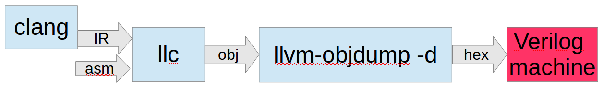

.. _sec-verilog:

Verify backend on verilog simulator
===================================

.. contents::
   :local:
   :depth: 4

Until now, we have an llvm backend to compile C or assembly as the blue part of 
:num:`Figure #runbackend-f1`. If without global variable, the elf obj can be 
dumped to hex file via ``llvm-objdump -d`` which finished in Chapter ELF Support.

.. _runbackend-f1: 

  Cpu0 backend without linker

This chapter will implement Cpu0 instructions by Verilog language as the red 
part of :num:`Figure #runbackend-f1`.
With this Verilog machine, we can write a C++ main 
function as well as the assembly boot code, and translate this 
main()+bootcode() into obj file.
Combined with llvm-objdump support in chapter ELF, 
this main()+bootcode() elf can be translated into hex file format which 
include the disassemble code as comment. 
Furthermore, we can run this hex program on the Cpu0 Verilog machine on PC and 
see the Cpu0 instructions execution result.

Create verilog simulator of Cpu0
--------------------------------

Verilog language is an IEEE standard in IC design. There are a lot of books and 
documents for this language. Free documents existed in Web sites [#]_ [#]_ [#]_ 
[#]_ [#]_. Verilog also called as Verilog HDL but not VHDL. 
VHDL is the same purpose language which compete against Verilog.
About VHDL reference here [#]_.
Example code lbdex/verilog/cpu0.v is the Cpu0 design in Verilog. 
In Appendix A, we have downloaded and installed Icarus Verilog tool both on 
iMac and Linux. The cpu0.v and cpu0Is.v are simple design 
with only few hundreds lines of code totally. 
Although it has not the pipeline features, we can assume the 
Cpu0 backend code run on the pipeline machine with NOP instruction fill in 
branch delay slot because the pipeline version use the same machine 
instructions. Verilog is a C like language in syntex and 
this book is a compiler book, so we list the cpu0.v as well as the building 
command directly as below. 
We expect readers can understand the Verilog code just with a little patient 
and no further explanation needed. 
According computer architecture, there are two type of I/O. 
One is memory mapped I/O, the other is instruction I/O. 
Cpu0 use memory mapped I/O where memory address 0x80000 as the output port. 
When meet the instruction **"st $ra, cx($rb)"**, where cx($rb) is 
0x80000, Cpu0 display the content as follows,

.. code-block:: c++

      ST : begin
        ...
        if (R[b]+c16 == `IOADDR) begin
          outw(R[a]);

.. rubric:: lbdex/verilog/cpu0.v
.. literalinclude:: ../lbdex/verilog/cpu0.v

.. rubric:: lbdex/verilog/cpu0Is.v
.. literalinclude:: ../lbdex/verilog/cpu0Is.v

Since Cpu0 Verilog machine supports both big and little endian, the memory 
and cpu module both have a wire connectting each other. 
The endian information stored in ROM of memory module, and memory module send 
the information when it is up according the following code,

.. rubric:: lbdex/verilog/cpu0.v
.. code-block:: bash

    assign cfg = mconfig[0][0:0];
    ...
    wire cfg;

    cpu0 cpu(.clock(clock), .itype(itype), .pc(pc), .tick(tick), .ir(ir),
    .mar(mar), .mdr(mdr), .dbus(dbus), .m_en(m_en), .m_rw(m_rw), .m_size(m_size),
    .cfg(cfg));

    memory0 mem(.clock(clock), .reset(reset), .en(m_en), .rw(m_rw), 
    .m_size(m_size), .abus(mar), .dbus_in(mdr), .dbus_out(dbus), .cfg(cfg));

Instead of set endian tranfer in memory module, the endian transfer can be set 
in CPU module and memory moudle always return with big endian.
I am not an professional engineer in FPGA/CPU hardware design. 
But according book "Computer 
Architecture: A Quantitative Approach", some operations may have no tolerance 
in time of execution stage. Any endian swap will make the clock cycle time 
longer and affect the CPU performance. So, I set the endian transfer in memory
module in Verilog. In system with bus, it suppose set in bus system I think.

.. code-block:: bash

  JonathantekiiMac:raw Jonathan$ pwd
  /Users/Jonathan/test/2/lbd/lbdex/verilog/raw
  JonathantekiiMac:raw Jonathan$ iverilog -o cpu0Is cpu0Is.v 

Verify backend
--------------

Now let's compile ch_run_backend.cpp as below. Since code size grows up from 
low to high address and stack grows up from high to low address. We set $sp 
at 0x6ffc because assuming cpu0.v uses 0x7000 bytes of memory.

.. rubric:: lbdex/input/start.h
.. literalinclude:: ../lbdex/input/start.h
    :start-after: /// start

.. rubric:: lbdex/input/boot.cpp
.. literalinclude:: ../lbdex/input/boot.cpp
    :start-after: /// start

.. rubric:: lbdex/input/print.h
.. literalinclude:: ../lbdex/input/print.h
    :start-after: /// start

.. rubric:: lbdex/input/print.cpp
.. literalinclude:: ../lbdex/input/print.cpp
    :start-after: /// start

.. rubric:: lbdex/input/ch_nolld.h
.. literalinclude:: ../lbdex/input/ch_nolld.h
    :start-after: /// start

.. rubric:: lbdex/input/ch_nolld.cpp
.. literalinclude:: ../lbdex/input/ch_nolld.cpp
    :start-after: /// start

.. rubric:: lbdex/input/ch_run_backend.cpp
.. literalinclude:: ../lbdex/input/ch_run_backend.cpp
    :start-after: /// start

.. rubric:: lbdex/input/functions.sh
.. literalinclude:: ../lbdex/input/functions.sh

.. rubric:: lbdex/input/build-run_backend.sh
.. literalinclude:: ../lbdex/input/build-run_backend.sh

To run program without linker implementation at this point, the boot.cpp is 
arranaged at the beginning of code and the main() of ch_run_backend.cpp is 
immediately after.
Let's run Chapter11_2/ with ``llvm-objdump -d`` for input file 
ch_run_backend.cpp to generate the hex file via build-run_bacekend.sh, then 
feed it to cpu0Is Verilog simulator to get the output result as below. 
Remind ch_run_backend.cpp have to be compiled with option 
``clang -target mips-unknown-linux-gnu`` since the example code ch9_3.cpp which 
uses the vararg needs to be compiled with this option. Other example codes have 
no differences between this option and default option. 

.. code-block:: bash

  JonathantekiiMac:input Jonathan$ bash build-run_backend.sh cpu032I be
  JonathantekiiMac:input Jonathan$ cd ../verilog
  JonathantekiiMac:verilog Jonathan$ ./cpu0Is
  WARNING: cpu0Is.v:386: $readmemh(cpu0.hex): Not enough words in the file for the 
  taskInterrupt(001)
  74
  15
  253
  3
  1
  14
  3
  -126
  130
  -32766
  32770
  393307
  16777222
  51
  2
  2147483647
  -2147483648
  7
  120
  15
  5
  0
  49
  total cpu cycles = 45860               
  RET to PC < 0, finished!

  JonathantekiiMac:input Jonathan$ bash build-run_backend.sh cpu032II be
  JonathantekiiMac:input Jonathan$ cd ../verilog
  JonathantekiiMac:verilog Jonathan$ ./cpu0IIs
  ...
  total cpu cycles = 43805               
  RET to PC < 0, finished!

The "total cpu cycles" can be calculated in this verilog simualtor, and the 
backend compiler and CPU performance can be reviewed.
Only the CPU cycles are counted, it exclude I/O cycles since I/O or display 
cycles time is unknown.
As explained in chapter "Control flow statements", cpu032II uses slt and beq
has better performance than cmp and jeq in cpu032I.
You can trace the memory binary code and destination
register changed at every instruction execution by the following change and
get the result as below,

.. rubric:: lbdex/verilog/cpu0Is.v

.. code-block:: c++

  `define TRACE 

.. rubric:: lbdex/verilog/cpu0.v

.. code-block:: c++

      ...
      `D = 1; // Trace register content at beginning

.. code-block:: bash

  JonathantekiiMac:raw Jonathan$ ./cpu0Is
  WARNING: cpu0.v:386: $readmemh(cpu0.hex): Not enough words in the file for the 
  requested range [0:28671].
  00000000: 2600000c
  00000004: 26000004
  00000008: 26000004
  0000000c: 26fffffc
  00000010: 09100000
  00000014: 09200000
  ...
  taskInterrupt(001)
  1530ns 00000054 : 02ed002c m[28620+44  ]=-1          SW=00000000
  1610ns 00000058 : 02bd0028 m[28620+40  ]=0           SW=00000000
  ...                     
  RET to PC < 0, finished!

As above result, cpu0.v dumps the memory first after reads input file cpu0.hex. 
Next, it runs instructions from address 0 and print each destination 
register value in the fourth column. 
The first column is the nano seconds of timing. The second 
is instruction address. The third is instruction content. 
Now, most example codes depicted in the previous chapters are verified by 
print the variable with print_integer().

This chapter shows Verilog PC output by displays the integer value located at 
I/O memory mapped address directly. 
Since the cpu0.v machine is created by Verilog language, it suppose can run on
real FPGA device. 
The real output hardware 
interface/port is hardware output device dependent, such as RS232, speaker, 
LED, .... You should implement the I/O interface/port when you want to program 
FPGA and wire I/O device to the I/O port. 

To generate cpu032II as well as little endian code, you can run with the 
following command. File build-run_backend.sh write the endian information to 
../verilog/cpu0.config as below.

.. code-block:: bash

  JonathantekiiMac:input Jonathan$ bash build-run_backend.sh cpu032I le

.. rubric:: ../verilog/cpu0.config
.. code-block:: c++

  1   /* 0: big endian, 1: little endian */

The following files test more features.

.. rubric:: lbdex/input/ch_nolld2.h
.. literalinclude:: ../lbdex/input/ch_nolld2.h
    :start-after: /// start

.. rubric:: lbdex/input/ch_nolld2.cpp
.. literalinclude:: ../lbdex/input/ch_nolld2.cpp
    :start-after: /// start

.. rubric:: lbdex/input/ch_run_backend2.cpp
.. literalinclude:: ../lbdex/input/ch_run_backend2.cpp
    :start-after: /// start

.. rubric:: lbdex/input/build-run_backend2.sh
.. literalinclude:: ../lbdex/input/build-run_backend2.sh
  
.. code-block:: bash

  JonathantekiiMac:input Jonathan$ bash build-run_backend.sh cpu032II le
  ...
  JonathantekiiMac:input Jonathan$ cd ../verilog
  JonathantekiiMac:verilog Jonathan$ ./cpu0IIs
  ...
  31
  ...

Other llvm based tools for Cpu0 processor
------------------------------------------

You can find the Cpu0 ELF linker implementation based on lld which is the 
llvm official linker project, as well as elf2hex which extended from llvm-objdump
driver at web: http://jonathan2251.github.io/lbt/index.html.

.. [#] http://ccckmit.wikidot.com/ve:main

.. [#] http://www.ece.umd.edu/courses/enee359a/

.. [#] http://www.ece.umd.edu/courses/enee359a/verilog_tutorial.pdf

.. [#] http://d1.amobbs.com/bbs_upload782111/files_33/ourdev_585395BQ8J9A.pdf

.. [#] http://en.wikipedia.org/wiki/Verilog

.. [#] http://en.wikipedia.org/wiki/VHDL
